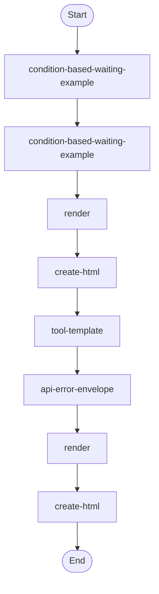
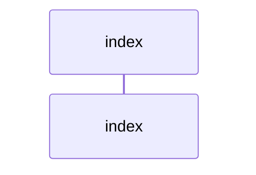

# Diagram Context Pack

Generated: 2026-03-15T20:11:52Z

## architecture

```mermaid
graph TD
  subgraph sg_backend_mcp_builder_scripts_c8612bc6["backend/mcp-builder/scripts"]
    node_backend_mcp_builder_scripts_connections_228b415f["connections"]
    node_backend_mcp_builder_scripts_evaluation_348facec["evaluation"]
  end
  subgraph sg_backend_workers_mcp_assets_aad8875d["backend/workers-mcp/assets"]
    node_backend_workers_mcp_assets_tool_template_8a83ced0["tool-template"]
  end
  subgraph sg_frontend_graphics_favicon_generator_scripts_a080ae45["frontend/graphics/favicon-generator/scripts"]
    node_frontend_graphics_favicon_generator_scripts_gene_4efce0bf["generate_favicon"]
  end
  subgraph sg_frontend_graphics_imagegen_scripts_d68f4790["frontend/graphics/imagegen/scripts"]
    node_frontend_graphics_imagegen_scripts_image_gen_67a8985f["image_gen"]
  end
  subgraph sg_frontend_graphics_og_image_creator_scripts_19c947bf["frontend/graphics/og-image-creator/scripts"]
    node_frontend_graphics_og_image_creator_scripts_analy_37814f37["analyze_codebase"]
    node_frontend_graphics_og_image_creator_scripts_gener_e06947cb["generate_og_images"]
  end
  subgraph sg_frontend_graphics_sora_scripts_8950b086["frontend/graphics/sora/scripts"]
    node_frontend_graphics_sora_scripts_sora_a9621009["sora"]
  end
  subgraph sg_frontend_stitch_react_components_examples_ade4b8ca["frontend/stitch-react-components/examples"]
    node_frontend_stitch_react_components_examples_gold_s_11018f2e["gold-standard-card"]
  end
  subgraph sg_frontend_stitch_react_components_resources_a1774f42["frontend/stitch-react-components/resources"]
    node_frontend_stitch_react_components_resources_compo_9f4fc92f["component-template"]
  end
  subgraph sg_frontend_stitch_react_components_scripts_0a99ecbe["frontend/stitch-react-components/scripts"]
    node_frontend_stitch_react_components_scripts_validat_15085a6f["validate"]
  end
  subgraph sg_frontend_tools_agentation_scripts_fe3c1e59["frontend/tools/agentation/scripts"]
    node_frontend_tools_agentation_scripts_check_watch_mo_b4fe8b37["check_watch_mode_readiness"]
  end
  subgraph sg_frontend_ui_remotion_rules_assets_ebdaffb9["frontend/ui/remotion/rules/assets"]
    node_frontend_ui_remotion_rules_assets_charts_bar_cha_661ecce2["charts-bar-chart"]
    node_frontend_ui_remotion_rules_assets_text_animation_e790818b["text-animations-typewriter"]
    node_frontend_ui_remotion_rules_assets_text_animation_60541458["text-animations-word-highlight"]
  end
  subgraph sg_frontend_ui_shadcn_ui_examples_d0e8e956["frontend/ui/shadcn-ui/examples"]
    node_frontend_ui_shadcn_ui_examples_auth_layout_a1444733["auth-layout"]
    node_frontend_ui_shadcn_ui_examples_data_table_80b0080c["data-table"]
    node_frontend_ui_shadcn_ui_examples_form_pattern_937936ea["form-pattern"]
  end
  subgraph sg_frontend_ui_stitch_remotion_examples_bc9a047c["frontend/ui/stitch-remotion/examples"]
    node_frontend_ui_stitch_remotion_examples_walkthrough_a0d9d1b7["WalkthroughComposition"]
  end
  subgraph sg_frontend_ui_stitch_remotion_resources_2f866462["frontend/ui/stitch-remotion/resources"]
    node_frontend_ui_stitch_remotion_resources_screen_sli_5ab76715["screen-slide-template"]
  end
  subgraph sg_frontend_ui_ui_ux_creative_coding_assets_460bd23e["frontend/ui/ui-ux-creative-coding/assets"]
    node_frontend_ui_ui_ux_creative_coding_assets_api_err_b2f1d8a2["api-error-envelope"]
    node_frontend_ui_ui_ux_creative_coding_assets_radix_w_0ef5e9fa["radix-wrapper"]
    node_frontend_ui_ui_ux_creative_coding_assets_storybo_502dc3b5["storybook-story"]
  end
  subgraph sg_github_gh_fix_ci_scripts_69b2aaa6["github/gh-fix-ci/scripts"]
    node_github_gh_fix_ci_scripts_inspect_pr_checks_57b444f3["inspect_pr_checks"]
  end
  subgraph sg_github_gh_workflow_scripts_7e4961c3["github/gh-workflow/scripts"]
    node_github_gh_workflow_scripts_fetch_comments_125b0eca["fetch_comments"]
    node_github_gh_workflow_scripts_github_pr_5824fbaf["github-pr"]
    node_github_gh_workflow_scripts_inspect_pr_checks_437f2cb4["inspect_pr_checks"]
  end
  subgraph sg_product_content_video_transcript_downloader_scri_cc2dabd8["product/content/video-transcript-downloader/scripts"]
    node_product_content_video_transcript_downloader_scri_8c8eabb0["vtd"]
  end
  subgraph sg_product_docs_context7_scripts_91ea455c["product/docs/context7/scripts"]
    node_product_docs_context7_scripts_context7_8a1b5cb4["context7"]
  end
  subgraph sg_product_docs_docs_expert_scripts_36681787["product/docs/docs-expert/scripts"]
    node_product_docs_docs_expert_scripts_bootstrap_doc_q_c1616fa7["bootstrap_doc_qa"]
    node_product_docs_docs_expert_scripts_check_brand_gui_d19769df["check_brand_guidelines"]
    node_product_docs_docs_expert_scripts_check_readabili_e8459829["check_readability"]
    node_product_docs_docs_expert_scripts_test_bootstrap__05395cd5["test_bootstrap_doc_qa"]
  end
  subgraph sg_product_domain_oak_api_scripts_beae328b["product/domain/oak-api/scripts"]
    node_product_domain_oak_api_scripts_oak_api_fetch_ce95d446["oak_api_fetch"]
  end
  subgraph sg_product_security_security_ownership_map_scripts_b3e27c78["product/security/security-ownership-map/scripts"]
    node_product_security_security_ownership_map_scripts__9b44e377["build_ownership_map"]
    node_product_security_security_ownership_map_scripts__556f907f["community_maintainers"]
    node_product_security_security_ownership_map_scripts__927c5b7e["query_ownership"]
    node_product_security_security_ownership_map_scripts__242a12b2["run_ownership_map"]
  end
  subgraph sg_product_specs_product_spec_assets_ralph_scripts_731ba4ee["product/specs/product-spec/assets/ralph/scripts"]
    node_product_specs_product_spec_assets_ralph_scripts__b36e9c3c["generate-prd-json-from-prd"]
  end
  subgraph sg_product_specs_product_spec_assets_ralph_scripts__08679609["product/specs/product-spec/assets/ralph/scripts/ralph"]
    node_product_specs_product_spec_assets_ralph_scripts__96f0964a["spec_to_prd"]
  end
  subgraph sg_product_specs_product_spec_scripts_e1e19a27["product/specs/product-spec/scripts"]
    node_product_specs_product_spec_scripts_evidence_map_e8e5ffcb["evidence-map"]
    node_product_specs_product_spec_scripts_spec_export_9127b184["spec-export"]
    node_product_specs_product_spec_scripts_spec_lint_8e137ef7["spec-lint"]
  end
  subgraph sg_scripts_16728d18["scripts"]
    node_scripts_bootstrap_recursive_skill_graph_artifact_83b9c62d["bootstrap_recursive_skill_graph_artifacts"]
    node_scripts_build_learning_posture_pilot_summary_0bbe2ac6["build_learning_posture_pilot_summary"]
    node_scripts_build_skill_state_map_e7aec9b7["build_skill_state_map"]
    node_scripts_diagnose_skill_ad7c6dcc["diagnose_skill"]
    node_scripts_docs_lint_1c72e6b0["docs_lint"]
    node_scripts_review_candidates_fab237f1["review_candidates"]
    node_scripts_run_skill_genome_loop_eb0d8326["run_skill_genome_loop"]
    node_scripts_setup_git_hooks_2ed98c53["setup-git-hooks"]
    node_scripts_skill_router_metrics_1c3b49c5["skill_router_metrics"]
    node_scripts_skill_spotlight_295bfa46["skill_spotlight"]
    node_scripts_sync_mcp_999c3805["sync_mcp"]
    node_scripts_test_bootstrap_recursive_skill_graph_art_a49b28fa["test_bootstrap_recursive_skill_graph_artifacts"]
    node_scripts_test_sync_mcp_6f0b8758["test_sync_mcp"]
    node_scripts_test_validate_recursive_promotions_scrip_f274eaff["test_validate_recursive_promotions_script"]
    node_scripts_test_verify_recursive_skill_graph_artifa_7c63b540["test_verify_recursive_skill_graph_artifacts"]
    node_scripts_validate_commit_msg_c49346f6["validate-commit-msg"]
    node_scripts_verify_question_lifecycle_contract_d47afbce["verify_question_lifecycle_contract"]
    node_scripts_verify_recursive_skill_graph_artifacts_8bc44e85["verify_recursive_skill_graph_artifacts"]
    node_scripts_verify_router_schema_41b498ad["verify_router_schema"]
    node_scripts_verify_skill_catalog_freshness_bccd6482["verify_skill_catalog_freshness"]
  end
  subgraph sg_skills_antigravity_agentation_scripts_15b05073["skills-antigravity/agentation/scripts"]
    node_skills_antigravity_agentation_scripts_check_watc_85ce8b59["check_watch_mode_readiness"]
  end
  subgraph sg_skills_antigravity_apple_app_creator_scripts_a7adea87["skills-antigravity/apple-app-creator/scripts"]
    node_skills_antigravity_apple_app_creator_scripts_ren_82fdd6ef["render_template"]
  end
  subgraph sg_skills_antigravity_atlas_scripts_5cabc719["skills-antigravity/atlas/scripts"]
    node_skills_antigravity_atlas_scripts_atlas_cli_a29d387e["atlas_cli"]
    node_skills_antigravity_atlas_scripts_atlas_common_12f1540c["atlas_common"]
  end
  subgraph sg_skills_antigravity_beautiful_mermaid_scripts_a7f1d7bc["skills-antigravity/beautiful-mermaid/scripts"]
    node_skills_antigravity_beautiful_mermaid_scripts_cre_29cddd8d["create-html"]
    node_skills_antigravity_beautiful_mermaid_scripts_ren_bc868c2c["render"]
  end
  subgraph sg_skills_antigravity_codex_home_audit_scripts_19a71358["skills-antigravity/codex-home-audit/scripts"]
    node_skills_antigravity_codex_home_audit_scripts_audi_fe870111["audit_codex_home"]
  end
  subgraph sg_skills_antigravity_codex_sessions_skill_scan_scr_6b855556["skills-antigravity/codex-sessions-skill-scan/scripts"]
    node_skills_antigravity_codex_sessions_skill_scan_scr_799d8d19["correlate_multi_source_skill_failures"]
    node_skills_antigravity_codex_sessions_skill_scan_scr_a9a41807["scan_codex_sessions"]
  end
  subgraph sg_skills_antigravity_context7_scripts_b734d1b1["skills-antigravity/context7/scripts"]
    node_skills_antigravity_context7_scripts_context7_d387f325["context7"]
  end
  subgraph sg_skills_antigravity_docs_expert_scripts_6a30241b["skills-antigravity/docs-expert/scripts"]
    node_skills_antigravity_docs_expert_scripts_bootstrap_8dda230c["bootstrap_doc_qa"]
    node_skills_antigravity_docs_expert_scripts_check_bra_fe293795["check_brand_guidelines"]
    node_skills_antigravity_docs_expert_scripts_check_rea_6e47fb29["check_readability"]
    node_skills_antigravity_docs_expert_scripts_test_boot_9336b337["test_bootstrap_doc_qa"]
  end
  subgraph sg_skills_antigravity_favicon_generator_scripts_e84d3dfe["skills-antigravity/favicon-generator/scripts"]
    node_skills_antigravity_favicon_generator_scripts_gen_910a0b1a["generate_favicon"]
  end
  subgraph sg_skills_antigravity_gh_fix_ci_scripts_e57289e8["skills-antigravity/gh-fix-ci/scripts"]
    node_skills_antigravity_gh_fix_ci_scripts_inspect_pr__552784da["inspect_pr_checks"]
  end
  subgraph sg_skills_antigravity_gh_workflow_scripts_b9a05941["skills-antigravity/gh-workflow/scripts"]
    node_skills_antigravity_gh_workflow_scripts_fetch_com_f69fea46["fetch_comments"]
    node_skills_antigravity_gh_workflow_scripts_github_pr_a8b25a33["github-pr"]
    node_skills_antigravity_gh_workflow_scripts_inspect_p_8bebf9ea["inspect_pr_checks"]
  end
  subgraph sg_skills_antigravity_imagegen_scripts_f430e260["skills-antigravity/imagegen/scripts"]
    node_skills_antigravity_imagegen_scripts_image_gen_49f570a7["image_gen"]
  end
  subgraph sg_skills_antigravity_mcp_builder_scripts_4497d29c["skills-antigravity/mcp-builder/scripts"]
    node_skills_antigravity_mcp_builder_scripts_connectio_92be9314["connections"]
    node_skills_antigravity_mcp_builder_scripts_evaluatio_53b1df7c["evaluation"]
  end
  subgraph sg_skills_antigravity_notebooklm_scripts_e00d733d["skills-antigravity/notebooklm/scripts"]
    node_skills_antigravity_notebooklm_scripts_init_fd2c4b71["__init__"]
    node_skills_antigravity_notebooklm_scripts_add_source_22e68525["add_source"]
    node_skills_antigravity_notebooklm_scripts_ask_questi_f462073f["ask_question"]
    node_skills_antigravity_notebooklm_scripts_audio_gene_0f0cea93["audio_generator"]
    node_skills_antigravity_notebooklm_scripts_auth_manag_367a6a80["auth_manager"]
    node_skills_antigravity_notebooklm_scripts_auto_sync_42dba4af["auto_sync"]
    node_skills_antigravity_notebooklm_scripts_browser_se_91765315["browser_session"]
    node_skills_antigravity_notebooklm_scripts_browser_ut_b598e6ec["browser_utils"]
    node_skills_antigravity_notebooklm_scripts_cleanup_ma_c93f588c["cleanup_manager"]
    node_skills_antigravity_notebooklm_scripts_config_00c3af81["config"]
    node_skills_antigravity_notebooklm_scripts_list_sourc_8c418115["list_sources"]
    node_skills_antigravity_notebooklm_scripts_notebook_m_050f68c2["notebook_manager"]
    node_skills_antigravity_notebooklm_scripts_remove_sou_a76062f7["remove_source"]
    node_skills_antigravity_notebooklm_scripts_run_6c9d2134["run"]
    node_skills_antigravity_notebooklm_scripts_setup_envi_f23824b9["setup_environment"]
    node_skills_antigravity_notebooklm_scripts_source_ext_4410b0c5["source_extractor"]
    node_skills_antigravity_notebooklm_scripts_source_fil_fbca546c["source_filter"]
    node_skills_antigravity_notebooklm_scripts_video_gene_3fb038cc["video_generator"]
  end
  subgraph sg_skills_antigravity_oak_api_scripts_49287d1b["skills-antigravity/oak-api/scripts"]
    node_skills_antigravity_oak_api_scripts_oak_api_fetch_015d1c8e["oak_api_fetch"]
  end
  subgraph sg_skills_antigravity_og_image_creator_scripts_fe8e2b74["skills-antigravity/og-image-creator/scripts"]
    node_skills_antigravity_og_image_creator_scripts_anal_ed3f789f["analyze_codebase"]
    node_skills_antigravity_og_image_creator_scripts_gene_aa97e015["generate_og_images"]
  end
  subgraph sg_skills_antigravity_process_watch_scripts_beec6b0d["skills-antigravity/process-watch/scripts"]
    node_skills_antigravity_process_watch_scripts_process_3a362b03["process-watch"]
  end
  subgraph sg_skills_antigravity_product_spec_assets_ralph_scr_485fd44f["skills-antigravity/product-spec/assets/ralph/scripts"]
    node_skills_antigravity_product_spec_assets_ralph_scr_007d0c6e["generate-prd-json-from-prd"]
  end
  subgraph sg_skills_antigravity_product_spec_assets_ralph_scr_08e57f7d["skills-antigravity/product-spec/assets/ralph/scripts/ralph"]
    node_skills_antigravity_product_spec_assets_ralph_scr_7b5c8921["spec_to_prd"]
  end
  subgraph sg_skills_antigravity_product_spec_scripts_7759f890["skills-antigravity/product-spec/scripts"]
    node_skills_antigravity_product_spec_scripts_evidence_ea6a4201["evidence-map"]
    node_skills_antigravity_product_spec_scripts_spec_exp_e3739087["spec-export"]
    node_skills_antigravity_product_spec_scripts_spec_lin_d4c977ca["spec-lint"]
  end
  subgraph sg_skills_antigravity_recon_workbench_assets_templa_a94838e0["skills-antigravity/recon-workbench/assets/template/scripts"]
    node_skills_antigravity_recon_workbench_assets_templa_1e236fe3["validate_schema"]
  end
  subgraph sg_skills_antigravity_remotion_rules_assets_e8598d95["skills-antigravity/remotion/rules/assets"]
    node_skills_antigravity_remotion_rules_assets_charts__6d5f7a7f["charts-bar-chart"]
    node_skills_antigravity_remotion_rules_assets_text_an_9295e4a7["text-animations-typewriter"]
    node_skills_antigravity_remotion_rules_assets_text_an_54a73b63["text-animations-word-highlight"]
  end
  subgraph sg_skills_antigravity_security_ownership_map_script_cca447fb["skills-antigravity/security-ownership-map/scripts"]
    node_skills_antigravity_security_ownership_map_script_8630a79f["build_ownership_map"]
    node_skills_antigravity_security_ownership_map_script_77e6adf0["community_maintainers"]
    node_skills_antigravity_security_ownership_map_script_aaf5cef5["query_ownership"]
    node_skills_antigravity_security_ownership_map_script_4502793e["run_ownership_map"]
  end
  subgraph sg_skills_antigravity_shadcn_ui_examples_9f1699e9["skills-antigravity/shadcn-ui/examples"]
    node_skills_antigravity_shadcn_ui_examples_auth_layou_c71066c2["auth-layout"]
    node_skills_antigravity_shadcn_ui_examples_data_table_411bfc9c["data-table"]
    node_skills_antigravity_shadcn_ui_examples_form_patte_b61ccdd6["form-pattern"]
  end
  subgraph sg_skills_antigravity_skill_builder_scripts_663e8da0["skills-antigravity/skill-builder/scripts"]
    node_skills_antigravity_skill_builder_scripts_analyze_85d9e71f["analyze_skill"]
    node_skills_antigravity_skill_builder_scripts_backfil_b3aa9108["backfill_missing_events"]
    node_skills_antigravity_skill_builder_scripts_benchma_c96c04a9["benchmark_skill_portfolio"]
    node_skills_antigravity_skill_builder_scripts_build_r_08f10aff["build_recursive_skill_shadow_report"]
    node_skills_antigravity_skill_builder_scripts_build_s_a860b98d["build_skill_eval_dashboard"]
    node_skills_antigravity_skill_builder_scripts_ci_skil_2adfccc5["ci_skill_quality_gate"]
    node_skills_antigravity_skill_builder_scripts_determi_d40d2426["deterministic_trace_checks"]
    node_skills_antigravity_skill_builder_scripts_generat_dfe8587e["generate_openai_yaml"]
    node_skills_antigravity_skill_builder_scripts_generat_aff2dffe["generate_pressure_tests"]
    node_skills_antigravity_skill_builder_scripts_generat_b9f673a2["generate_skill_graph_profiles"]
    node_skills_antigravity_skill_builder_scripts_init_sk_fbbc1a66["init_skill"]
    node_skills_antigravity_skill_builder_scripts_migrate_59dbedc9["migrate_evals_v2"]
    node_skills_antigravity_skill_builder_scripts_opencla_5484c554["openclaw_skill_guard"]
    node_skills_antigravity_skill_builder_scripts_quick_v_38c512b9["quick_validate"]
    node_skills_antigravity_skill_builder_scripts_record__ad0eec94["record_skill_feedback"]
    node_skills_antigravity_skill_builder_scripts_recursi_966dc567["recursive_skill_loop"]
    node_skills_antigravity_skill_builder_scripts_refresh_cdbb8bcc["refresh_benchmark_policy"]
    node_skills_antigravity_skill_builder_scripts_router__c573abc3["router_controls"]
    node_skills_antigravity_skill_builder_scripts_run_rep_7d5c14f2["run_repo_skill_quality"]
    node_skills_antigravity_skill_builder_scripts_run_ski_6431ba19["run_skill_evals"]
    node_skills_antigravity_skill_builder_scripts_run_ski_57a011b9["run_skill_graph_smoke"]
    node_skills_antigravity_skill_builder_scripts_skill_c_7e58a6c8["skill_catalog"]
    node_skills_antigravity_skill_builder_scripts_skill_g_392a1dc1["skill_gate"]
    node_skills_antigravity_skill_builder_scripts_skill_g_0d3dc330["skill_graph_inventory"]
    node_skills_antigravity_skill_builder_scripts_skill_r_b3c08322["skill_router"]
    node_skills_antigravity_skill_builder_scripts_skill_r_49381cf6["skill_router_schema"]
    node_skills_antigravity_skill_builder_scripts_skill_s_7f823e9e["skill_subject_scoreboard"]
    node_skills_antigravity_skill_builder_scripts_test_ba_8508ba7f["test_backfill_missing_events"]
    node_skills_antigravity_skill_builder_scripts_test_ev_b2b99e08["test_events_jsonl_required"]
    node_skills_antigravity_skill_builder_scripts_test_op_1b029f14["test_openclaw_skill_guard"]
    node_skills_antigravity_skill_builder_scripts_test_re_1db0811d["test_recursive_skill_loop_capture"]
    node_skills_antigravity_skill_builder_scripts_test_sk_0f7809cb["test_skill_router"]
    node_skills_antigravity_skill_builder_scripts_test_va_aacd20c7["test_validate_recursive_promotion"]
    node_skills_antigravity_skill_builder_scripts_upgrade_7f2d4a39["upgrade_skill"]
    node_skills_antigravity_skill_builder_scripts_validat_6193ab36["validate_recursive_promotion"]
    node_skills_antigravity_skill_builder_scripts_validat_399368f1["validate_skill_graph_profiles"]
  end
  subgraph sg_skills_antigravity_slides_assets_pptxgenjs_helpe_79f42d59["skills-antigravity/slides/assets/pptxgenjs_helpers"]
    node_skills_antigravity_slides_assets_pptxgenjs_helpe_3f855be3["code"]
    node_skills_antigravity_slides_assets_pptxgenjs_helpe_55457ce3["image"]
    node_skills_antigravity_slides_assets_pptxgenjs_helpe_3d46e471["index"]
    node_skills_antigravity_slides_assets_pptxgenjs_helpe_e57118a3["latex"]
    node_skills_antigravity_slides_assets_pptxgenjs_helpe_290adec1["layout"]
    node_skills_antigravity_slides_assets_pptxgenjs_helpe_6afbd8b9["layout_builders"]
    node_skills_antigravity_slides_assets_pptxgenjs_helpe_2fe232bd["svg"]
    node_skills_antigravity_slides_assets_pptxgenjs_helpe_6998a0ef["text"]
    node_skills_antigravity_slides_assets_pptxgenjs_helpe_e8a914a4["util"]
  end
  subgraph sg_skills_antigravity_slides_scripts_0eaf3cbe["skills-antigravity/slides/scripts"]
    node_skills_antigravity_slides_scripts_create_montage_4d245ca8["create_montage"]
    node_skills_antigravity_slides_scripts_detect_font_59d97cdc["detect_font"]
    node_skills_antigravity_slides_scripts_ensure_raster__7e4f2008["ensure_raster_image"]
    node_skills_antigravity_slides_scripts_render_slides_2ddbec2f["render_slides"]
    node_skills_antigravity_slides_scripts_slides_test_2c8ca475["slides_test"]
  end
  subgraph sg_skills_antigravity_sora_scripts_2b6f145b["skills-antigravity/sora/scripts"]
    node_skills_antigravity_sora_scripts_sora_caa4aee8["sora"]
  end
  subgraph sg_skills_antigravity_spreadsheet_references_exampl_0c2174a5["skills-antigravity/spreadsheet/references/examples/openpyxl"]
    node_skills_antigravity_spreadsheet_references_exampl_9a45e92c["create_basic_spreadsheet"]
    node_skills_antigravity_spreadsheet_references_exampl_2f3c549b["create_spreadsheet_with_styling"]
    node_skills_antigravity_spreadsheet_references_exampl_24227ece["read_existing_spreadsheet"]
    node_skills_antigravity_spreadsheet_references_exampl_de9f1358["styling_spreadsheet"]
  end
  subgraph sg_skills_antigravity_stitch_react_components_examp_1f28e39f["skills-antigravity/stitch-react-components/examples"]
    node_skills_antigravity_stitch_react_components_examp_4acc5877["gold-standard-card"]
  end
  subgraph sg_skills_antigravity_stitch_react_components_resou_907038ad["skills-antigravity/stitch-react-components/resources"]
    node_skills_antigravity_stitch_react_components_resou_aa93b399["component-template"]
  end
  subgraph sg_skills_antigravity_stitch_react_components_scrip_eef5309b["skills-antigravity/stitch-react-components/scripts"]
    node_skills_antigravity_stitch_react_components_scrip_c4f07782["validate"]
  end
  subgraph sg_skills_antigravity_stitch_remotion_examples_adf357e6["skills-antigravity/stitch-remotion/examples"]
    node_skills_antigravity_stitch_remotion_examples_walk_457e8c74["WalkthroughComposition"]
  end
  subgraph sg_skills_antigravity_stitch_remotion_resources_87df384d["skills-antigravity/stitch-remotion/resources"]
    node_skills_antigravity_stitch_remotion_resources_scr_feb4e683["screen-slide-template"]
  end
  subgraph sg_skills_antigravity_systematic_debugging_5b99fa89["skills-antigravity/systematic-debugging"]
    node_skills_antigravity_systematic_debugging_conditio_6d68d01e["condition-based-waiting-example"]
  end
  subgraph sg_skills_antigravity_ui_ux_creative_coding_assets_1a335019["skills-antigravity/ui-ux-creative-coding/assets"]
    node_skills_antigravity_ui_ux_creative_coding_assets__2c5ee2c1["api-error-envelope"]
    node_skills_antigravity_ui_ux_creative_coding_assets__2c9e642b["radix-wrapper"]
    node_skills_antigravity_ui_ux_creative_coding_assets__60b33d18["storybook-story"]
  end
  subgraph sg_skills_antigravity_video_transcript_downloader_s_478f8cd1["skills-antigravity/video-transcript-downloader/scripts"]
    node_skills_antigravity_video_transcript_downloader_s_19103ba8["vtd"]
  end
  subgraph sg_skills_antigravity_visual_explainer_scripts_e45fd4c3["skills-antigravity/visual-explainer/scripts"]
    node_skills_antigravity_visual_explainer_scripts_smok_24ff65fc["smoke_generate_slides"]
  end
  subgraph sg_skills_antigravity_workers_mcp_assets_c21a2ee0["skills-antigravity/workers-mcp/assets"]
    node_skills_antigravity_workers_mcp_assets_tool_templ_819fc528["tool-template"]
  end
  subgraph sg_skills_antigravity_xcode_makefiles_scripts_8e6e751c["skills-antigravity/xcode-makefiles/scripts"]
    node_skills_antigravity_xcode_makefiles_scripts_rende_80655f32["render_template"]
  end
  subgraph sg_utilities_apple_app_creator_scripts_0bf0c293["utilities/apple-app-creator/scripts"]
    node_utilities_apple_app_creator_scripts_render_templ_c55411ed["render_template"]
  end
  subgraph sg_utilities_atlas_scripts_dbcb91c2["utilities/atlas/scripts"]
    node_utilities_atlas_scripts_atlas_cli_db143b0e["atlas_cli"]
    node_utilities_atlas_scripts_atlas_common_92b48d7e["atlas_common"]
  end
  subgraph sg_utilities_beautiful_mermaid_scripts_4f6623c7["utilities/beautiful-mermaid/scripts"]
    node_utilities_beautiful_mermaid_scripts_create_html_63f0ef07["create-html"]
    node_utilities_beautiful_mermaid_scripts_render_5590e96f["render"]
  end
  subgraph sg_utilities_codex_home_audit_scripts_0e83e18e["utilities/codex-home-audit/scripts"]
    node_utilities_codex_home_audit_scripts_audit_codex_h_8385a8e9["audit_codex_home"]
  end
  subgraph sg_utilities_codex_plugin_builder_scripts_27d5b15e["utilities/codex-plugin-builder/scripts"]
    node_utilities_codex_plugin_builder_scripts_plugin_bu_3a9b9729["plugin_builder"]
  end
  subgraph sg_utilities_codex_sessions_skill_scan_scripts_05ecc107["utilities/codex-sessions-skill-scan/scripts"]
    node_utilities_codex_sessions_skill_scan_scripts_corr_e9e12d96["correlate_multi_source_skill_failures"]
    node_utilities_codex_sessions_skill_scan_scripts_scan_36c38f81["scan_codex_sessions"]
  end
  subgraph sg_utilities_notebooklm_scripts_dffe8cc2["utilities/notebooklm/scripts"]
    node_utilities_notebooklm_scripts_init_10bd8cf2["__init__"]
    node_utilities_notebooklm_scripts_add_source_abb166bf["add_source"]
    node_utilities_notebooklm_scripts_ask_question_08bac899["ask_question"]
    node_utilities_notebooklm_scripts_audio_generator_4ae31402["audio_generator"]
    node_utilities_notebooklm_scripts_auth_manager_0c9aba70["auth_manager"]
    node_utilities_notebooklm_scripts_auto_sync_94ea8b10["auto_sync"]
    node_utilities_notebooklm_scripts_browser_session_cd6cb498["browser_session"]
    node_utilities_notebooklm_scripts_browser_utils_d51b322d["browser_utils"]
    node_utilities_notebooklm_scripts_cleanup_manager_3fb347c0["cleanup_manager"]
    node_utilities_notebooklm_scripts_config_c3ed1c10["config"]
    node_utilities_notebooklm_scripts_list_sources_44a40c55["list_sources"]
    node_utilities_notebooklm_scripts_notebook_manager_8e36c810["notebook_manager"]
    node_utilities_notebooklm_scripts_remove_source_8d369a60["remove_source"]
    node_utilities_notebooklm_scripts_run_ea289e08["run"]
    node_utilities_notebooklm_scripts_setup_environment_0926100d["setup_environment"]
    node_utilities_notebooklm_scripts_source_extractor_8130f51f["source_extractor"]
    node_utilities_notebooklm_scripts_source_filter_cd211916["source_filter"]
    node_utilities_notebooklm_scripts_video_generator_6f931667["video_generator"]
  end
  subgraph sg_utilities_process_watch_scripts_a102835e["utilities/process-watch/scripts"]
    node_utilities_process_watch_scripts_process_watch_6ca399d4["process-watch"]
  end
  subgraph sg_utilities_recon_workbench_assets_template_script_0396ea43["utilities/recon-workbench/assets/template/scripts"]
    node_utilities_recon_workbench_assets_template_script_a5cde919["validate_schema"]
  end
  subgraph sg_utilities_skill_builder_scripts_5c7556ae["utilities/skill-builder/scripts"]
    node_utilities_skill_builder_scripts_analyze_skill_df5dad83["analyze_skill"]
    node_utilities_skill_builder_scripts_backfill_missing_6b17b447["backfill_missing_events"]
    node_utilities_skill_builder_scripts_benchmark_skill__5390f27e["benchmark_skill_portfolio"]
    node_utilities_skill_builder_scripts_build_recursive__b6615a1f["build_recursive_skill_shadow_report"]
    node_utilities_skill_builder_scripts_build_skill_eval_9c134ace["build_skill_eval_dashboard"]
    node_utilities_skill_builder_scripts_ci_skill_quality_67f0b9b2["ci_skill_quality_gate"]
    node_utilities_skill_builder_scripts_deterministic_tr_3738e327["deterministic_trace_checks"]
    node_utilities_skill_builder_scripts_generate_openai__29161244["generate_openai_yaml"]
    node_utilities_skill_builder_scripts_generate_pressur_04165a29["generate_pressure_tests"]
    node_utilities_skill_builder_scripts_generate_skill_g_5ef1c975["generate_skill_graph_profiles"]
    node_utilities_skill_builder_scripts_init_skill_7d39297b["init_skill"]
    node_utilities_skill_builder_scripts_migrate_evals_v2_695a5431["migrate_evals_v2"]
    node_utilities_skill_builder_scripts_openclaw_skill_g_b2d7a455["openclaw_skill_guard"]
    node_utilities_skill_builder_scripts_quick_validate_55a97528["quick_validate"]
    node_utilities_skill_builder_scripts_record_skill_fee_1cbd0809["record_skill_feedback"]
    node_utilities_skill_builder_scripts_recursive_skill__f085a05f["recursive_skill_loop"]
    node_utilities_skill_builder_scripts_refresh_benchmar_472d6286["refresh_benchmark_policy"]
    node_utilities_skill_builder_scripts_router_controls_d39e63f8["router_controls"]
    node_utilities_skill_builder_scripts_run_repo_skill_q_6e0c9abc["run_repo_skill_quality"]
    node_utilities_skill_builder_scripts_run_skill_evals_bbb39381["run_skill_evals"]
    node_utilities_skill_builder_scripts_run_skill_graph__607a74d6["run_skill_graph_smoke"]
    node_utilities_skill_builder_scripts_skill_catalog_bd99394f["skill_catalog"]
    node_utilities_skill_builder_scripts_skill_gate_6b4f1ca3["skill_gate"]
    node_utilities_skill_builder_scripts_skill_graph_inve_99d02869["skill_graph_inventory"]
    node_utilities_skill_builder_scripts_skill_router_fe01cfaa["skill_router"]
    node_utilities_skill_builder_scripts_skill_router_sch_23ecdd74["skill_router_schema"]
    node_utilities_skill_builder_scripts_skill_subject_sc_569f1782["skill_subject_scoreboard"]
    node_utilities_skill_builder_scripts_test_backfill_mi_c6917919["test_backfill_missing_events"]
    node_utilities_skill_builder_scripts_test_events_json_9d57599c["test_events_jsonl_required"]
    node_utilities_skill_builder_scripts_test_openclaw_sk_c26d3c6e["test_openclaw_skill_guard"]
    node_utilities_skill_builder_scripts_test_recursive_s_4e4ec503["test_recursive_skill_loop_capture"]
    node_utilities_skill_builder_scripts_test_skill_route_cc814a7d["test_skill_router"]
    node_utilities_skill_builder_scripts_test_validate_re_f27b2562["test_validate_recursive_promotion"]
    node_utilities_skill_builder_scripts_upgrade_skill_7a2f7bce["upgrade_skill"]
    node_utilities_skill_builder_scripts_validate_recursi_746b7a9a["validate_recursive_promotion"]
    node_utilities_skill_builder_scripts_validate_skill_g_dd69266e["validate_skill_graph_profiles"]
  end
  subgraph sg_utilities_slides_assets_pptxgenjs_helpers_5d2022c6["utilities/slides/assets/pptxgenjs_helpers"]
    node_utilities_slides_assets_pptxgenjs_helpers_code_6527e97b["code"]
    node_utilities_slides_assets_pptxgenjs_helpers_image_c067dc42["image"]
    node_utilities_slides_assets_pptxgenjs_helpers_index_07e4a8e3["index"]
    node_utilities_slides_assets_pptxgenjs_helpers_latex_e3f085ae["latex"]
    node_utilities_slides_assets_pptxgenjs_helpers_layout_80b79f3e["layout"]
    node_utilities_slides_assets_pptxgenjs_helpers_layout_0b110364["layout_builders"]
    node_utilities_slides_assets_pptxgenjs_helpers_svg_2f1f6de0["svg"]
    node_utilities_slides_assets_pptxgenjs_helpers_text_fad1e594["text"]
    node_utilities_slides_assets_pptxgenjs_helpers_util_444c54d5["util"]
  end
  subgraph sg_utilities_slides_scripts_727e2a40["utilities/slides/scripts"]
    node_utilities_slides_scripts_create_montage_b8a00a5a["create_montage"]
    node_utilities_slides_scripts_detect_font_ff9fb677["detect_font"]
    node_utilities_slides_scripts_ensure_raster_image_19839190["ensure_raster_image"]
    node_utilities_slides_scripts_render_slides_dba7c922["render_slides"]
    node_utilities_slides_scripts_slides_test_17917974["slides_test"]
  end
  subgraph sg_utilities_spreadsheet_references_examples_openpy_4aebcb51["utilities/spreadsheet/references/examples/openpyxl"]
    node_utilities_spreadsheet_references_examples_openpy_de58bd89["create_basic_spreadsheet"]
    node_utilities_spreadsheet_references_examples_openpy_7bb01a1f["create_spreadsheet_with_styling"]
    node_utilities_spreadsheet_references_examples_openpy_03a4326f["read_existing_spreadsheet"]
    node_utilities_spreadsheet_references_examples_openpy_6a3b6a11["styling_spreadsheet"]
  end
  subgraph sg_utilities_systematic_debugging_3499a0d8["utilities/systematic-debugging"]
    node_utilities_systematic_debugging_condition_based_w_cf1268e4["condition-based-waiting-example"]
  end
  subgraph sg_utilities_visual_explainer_scripts_8bc8c1cf["utilities/visual-explainer/scripts"]
    node_utilities_visual_explainer_scripts_smoke_generat_12f3c2a2["smoke_generate_slides"]
  end
  subgraph sg_utilities_xcode_makefiles_scripts_e17a0984["utilities/xcode-makefiles/scripts"]
    node_utilities_xcode_makefiles_scripts_render_templat_f4d76d3d["render_template"]
  end
  subgraph sg_vaults_arscontexta_ops_scripts_graph_50006b4a["vaults/arscontexta/ops/scripts/graph"]
    node_vaults_arscontexta_ops_scripts_graph_graph_lib_e0427692["_graph_lib"]
    node_vaults_arscontexta_ops_scripts_graph_build_graph_f0738582["build_graph_index"]
    node_vaults_arscontexta_ops_scripts_graph_detect_comm_b5f4d70b["detect_communities"]
    node_vaults_arscontexta_ops_scripts_graph_render_evol_2147ea79["render_evolution"]
    node_vaults_arscontexta_ops_scripts_graph_render_merm_4f79270f["render_mermaid"]
    node_vaults_arscontexta_ops_scripts_graph_snapshot_me_83d44d63["snapshot_metrics"]
  end

```

## auth


## class


## database

```mermaid
flowchart TD
  UserRequest["User request"]
  Decision{Record exists?}
  condition_based_waiting_example_ac329690["condition-based-waiting-example"]
  UserRequest --> condition_based_waiting_example_ac329690
  condition_based_waiting_example_ac329690 --> condition_based_waiting_example_ac329690_result["result"]
  condition_based_waiting_example_1_6e56cf4d["condition-based-waiting-example"]
  UserRequest --> condition_based_waiting_example_1_6e56cf4d
  condition_based_waiting_example_1_6e56cf4d --> condition_based_waiting_example_1_6e56cf4d_result["result"]
  tool_template_74b2d502["tool-template"]
  UserRequest --> tool_template_74b2d502
  tool_template_74b2d502 --> tool_template_74b2d502_result["result"]
  tool_template_1_966768c3["tool-template"]
  UserRequest --> tool_template_1_966768c3
  tool_template_1_966768c3 --> tool_template_1_966768c3_result["result"]
  gold_standard_card_ce9d59eb["gold-standard-card"]
  UserRequest --> gold_standard_card_ce9d59eb
  gold_standard_card_ce9d59eb --> gold_standard_card_ce9d59eb_result["result"]
  data_table_e0dd6841["data-table"]
  UserRequest --> data_table_e0dd6841
  data_table_e0dd6841 --> data_table_e0dd6841_result["result"]
  gold_standard_card_1_02ec10fa["gold-standard-card"]
  UserRequest --> gold_standard_card_1_02ec10fa
  gold_standard_card_1_02ec10fa --> gold_standard_card_1_02ec10fa_result["result"]
  data_table_1_2ea7511b["data-table"]
  UserRequest --> data_table_1_2ea7511b
  data_table_1_2ea7511b --> data_table_1_2ea7511b_result["result"]
  verify_skill_catalog_freshness_a896cce8["verify_skill_catalog_freshness"]
  UserRequest --> verify_skill_catalog_freshness_a896cce8
  verify_skill_catalog_freshness_a896cce8 --> verify_skill_catalog_freshness_a896cce8_result["result"]
  verify_router_schema_10b5c390["verify_router_schema"]
  UserRequest --> verify_router_schema_10b5c390
  verify_router_schema_10b5c390 --> verify_router_schema_10b5c390_result["result"]
  verify_question_lifecycle_contract_91025cb7["verify_question_lifecycle_contract"]
  UserRequest --> verify_question_lifecycle_contract_91025cb7
  verify_question_lifecycle_contract_91025cb7 --> verify_question_lifecycle_contract_91025cb7_result["result"]
  test_validate_recursive_promotions_script_64af0ba0["test_validate_recursive_promotions_script"]
  UserRequest --> test_validate_recursive_promotions_script_64af0ba0
  test_validate_recursive_promotions_script_64af0ba0 --> test_validate_recursive_promotions_script_64af0ba0_result["result"]
  build_skill_state_map_de83c93f["build_skill_state_map"]
  UserRequest --> build_skill_state_map_de83c93f
  build_skill_state_map_de83c93f --> build_skill_state_map_de83c93f_result["result"]
  validate_skill_graph_profiles_dac972b4["validate_skill_graph_profiles"]
  UserRequest --> validate_skill_graph_profiles_dac972b4
  validate_skill_graph_profiles_dac972b4 --> validate_skill_graph_profiles_dac972b4_result["result"]
  validate_recursive_promotion_cb35db6c["validate_recursive_promotion"]
  UserRequest --> validate_recursive_promotion_cb35db6c
  validate_recursive_promotion_cb35db6c --> validate_recursive_promotion_cb35db6c_result["result"]
  test_skill_router_1b78daf2["test_skill_router"]
  UserRequest --> test_skill_router_1b78daf2
  test_skill_router_1b78daf2 --> test_skill_router_1b78daf2_result["result"]
  skill_router_schema_cc48d7b7["skill_router_schema"]
  UserRequest --> skill_router_schema_cc48d7b7
  skill_router_schema_cc48d7b7 --> skill_router_schema_cc48d7b7_result["result"]
  skill_router_c50379b5["skill_router"]
  UserRequest --> skill_router_c50379b5
  skill_router_c50379b5 --> skill_router_c50379b5_result["result"]
  skill_gate_1b2f3166["skill_gate"]
  UserRequest --> skill_gate_1b2f3166
  skill_gate_1b2f3166 --> skill_gate_1b2f3166_result["result"]
  run_skill_graph_smoke_1d5ddf1a["run_skill_graph_smoke"]
  UserRequest --> run_skill_graph_smoke_1d5ddf1a
  run_skill_graph_smoke_1d5ddf1a --> run_skill_graph_smoke_1d5ddf1a_result["result"]
  run_skill_evals_9a0eaee5["run_skill_evals"]
  UserRequest --> run_skill_evals_9a0eaee5
  run_skill_evals_9a0eaee5 --> run_skill_evals_9a0eaee5_result["result"]
  run_repo_skill_quality_7f7a10ff["run_repo_skill_quality"]
  UserRequest --> run_repo_skill_quality_7f7a10ff
  run_repo_skill_quality_7f7a10ff --> run_repo_skill_quality_7f7a10ff_result["result"]
  recursive_skill_loop_aa940a84["recursive_skill_loop"]
  UserRequest --> recursive_skill_loop_aa940a84
  recursive_skill_loop_aa940a84 --> recursive_skill_loop_aa940a84_result["result"]
  init_skill_a854d1d0["init_skill"]
  UserRequest --> init_skill_a854d1d0
  init_skill_a854d1d0 --> init_skill_a854d1d0_result["result"]
  generate_skill_graph_profiles_d432f2ea["generate_skill_graph_profiles"]
  UserRequest --> generate_skill_graph_profiles_d432f2ea
  generate_skill_graph_profiles_d432f2ea --> generate_skill_graph_profiles_d432f2ea_result["result"]
  analyze_skill_fb508d56["analyze_skill"]
  UserRequest --> analyze_skill_fb508d56
  analyze_skill_fb508d56 --> analyze_skill_fb508d56_result["result"]
  video_generator_353cb04b["video_generator"]
  UserRequest --> video_generator_353cb04b
  video_generator_353cb04b --> video_generator_353cb04b_result["result"]
  source_filter_9bc26ec1["source_filter"]
  UserRequest --> source_filter_9bc26ec1
  source_filter_9bc26ec1 --> source_filter_9bc26ec1_result["result"]
  source_extractor_e5d0e94f["source_extractor"]
  UserRequest --> source_extractor_e5d0e94f
  source_extractor_e5d0e94f --> source_extractor_e5d0e94f_result["result"]
  remove_source_24de5f4e["remove_source"]
  UserRequest --> remove_source_24de5f4e
  remove_source_24de5f4e --> remove_source_24de5f4e_write["write/update"]
  remove_source_24de5f4e_write --> remove_source_24de5f4e_result["result"]
  notebook_manager_c3b8ce4b["notebook_manager"]
  UserRequest --> notebook_manager_c3b8ce4b
  notebook_manager_c3b8ce4b --> notebook_manager_c3b8ce4b_result["result"]
  config_b79606fb["config"]
  UserRequest --> config_b79606fb
  config_b79606fb --> config_b79606fb_result["result"]
  cleanup_manager_7636d45b["cleanup_manager"]
  UserRequest --> cleanup_manager_7636d45b
  cleanup_manager_7636d45b --> cleanup_manager_7636d45b_result["result"]
  browser_utils_6c690c56["browser_utils"]
  UserRequest --> browser_utils_6c690c56
  browser_utils_6c690c56 --> browser_utils_6c690c56_result["result"]
  browser_session_1ad989be["browser_session"]
  UserRequest --> browser_session_1ad989be
  browser_session_1ad989be --> browser_session_1ad989be_result["result"]
  auth_manager_d402d795["auth_manager"]
  UserRequest --> auth_manager_d402d795
  auth_manager_d402d795 --> auth_manager_d402d795_result["result"]
  audio_generator_49d9f296["audio_generator"]
  UserRequest --> audio_generator_49d9f296
  audio_generator_49d9f296 --> audio_generator_49d9f296_result["result"]
  ask_question_2f5dd588["ask_question"]
  UserRequest --> ask_question_2f5dd588
  ask_question_2f5dd588 --> ask_question_2f5dd588_result["result"]
  add_source_1dec659c["add_source"]
  UserRequest --> add_source_1dec659c
  add_source_1dec659c --> add_source_1dec659c_result["result"]
  scan_codex_sessions_ab2978a6["scan_codex_sessions"]
  UserRequest --> scan_codex_sessions_ab2978a6
  scan_codex_sessions_ab2978a6 --> scan_codex_sessions_ab2978a6_result["result"]
  audit_codex_home_9c47a803["audit_codex_home"]
  UserRequest --> audit_codex_home_9c47a803
  audit_codex_home_9c47a803 --> audit_codex_home_9c47a803_result["result"]
  atlas_common_02a7222b["atlas_common"]
  UserRequest --> atlas_common_02a7222b
  atlas_common_02a7222b --> atlas_common_02a7222b_result["result"]
  atlas_cli_689a6db0["atlas_cli"]
  UserRequest --> atlas_cli_689a6db0
  atlas_cli_689a6db0 --> atlas_cli_689a6db0_result["result"]
  inspect_pr_checks_8eb8c9ba["inspect_pr_checks"]
  UserRequest --> inspect_pr_checks_8eb8c9ba
  inspect_pr_checks_8eb8c9ba --> inspect_pr_checks_8eb8c9ba_result["result"]
  github_pr_3e9d1c41["github-pr"]
  UserRequest --> github_pr_3e9d1c41
  github_pr_3e9d1c41 --> github_pr_3e9d1c41_result["result"]
  inspect_pr_checks_1_9560c34e["inspect_pr_checks"]
  UserRequest --> inspect_pr_checks_1_9560c34e
  inspect_pr_checks_1_9560c34e --> inspect_pr_checks_1_9560c34e_result["result"]
  sora_a4c745fa["sora"]
  UserRequest --> sora_a4c745fa
  sora_a4c745fa --> sora_a4c745fa_result["result"]
  validate_skill_graph_profiles_1_e0892d0f["validate_skill_graph_profiles"]
  UserRequest --> validate_skill_graph_profiles_1_e0892d0f
  validate_skill_graph_profiles_1_e0892d0f --> validate_skill_graph_profiles_1_e0892d0f_result["result"]
  validate_recursive_promotion_1_bc45160d["validate_recursive_promotion"]
  UserRequest --> validate_recursive_promotion_1_bc45160d
  validate_recursive_promotion_1_bc45160d --> validate_recursive_promotion_1_bc45160d_result["result"]
  test_skill_router_1_9a354ca8["test_skill_router"]
  UserRequest --> test_skill_router_1_9a354ca8
  test_skill_router_1_9a354ca8 --> test_skill_router_1_9a354ca8_result["result"]
  skill_router_schema_1_edf929c4["skill_router_schema"]
  UserRequest --> skill_router_schema_1_edf929c4
  skill_router_schema_1_edf929c4 --> skill_router_schema_1_edf929c4_result["result"]
  skill_router_1_aeb4bedb["skill_router"]
  UserRequest --> skill_router_1_aeb4bedb
  skill_router_1_aeb4bedb --> skill_router_1_aeb4bedb_result["result"]
  skill_gate_1_94fb6889["skill_gate"]
  UserRequest --> skill_gate_1_94fb6889
  skill_gate_1_94fb6889 --> skill_gate_1_94fb6889_result["result"]
  run_skill_graph_smoke_1_767a8750["run_skill_graph_smoke"]
  UserRequest --> run_skill_graph_smoke_1_767a8750
  run_skill_graph_smoke_1_767a8750 --> run_skill_graph_smoke_1_767a8750_result["result"]
  run_skill_evals_1_e75689f5["run_skill_evals"]
  UserRequest --> run_skill_evals_1_e75689f5
  run_skill_evals_1_e75689f5 --> run_skill_evals_1_e75689f5_result["result"]
  run_repo_skill_quality_1_8b14eef4["run_repo_skill_quality"]
  UserRequest --> run_repo_skill_quality_1_8b14eef4
  run_repo_skill_quality_1_8b14eef4 --> run_repo_skill_quality_1_8b14eef4_result["result"]
  recursive_skill_loop_1_c584be9a["recursive_skill_loop"]
  UserRequest --> recursive_skill_loop_1_c584be9a
  recursive_skill_loop_1_c584be9a --> recursive_skill_loop_1_c584be9a_result["result"]
  init_skill_1_be4b19fa["init_skill"]
  UserRequest --> init_skill_1_be4b19fa
  init_skill_1_be4b19fa --> init_skill_1_be4b19fa_result["result"]
  generate_skill_graph_profiles_1_38d0a308["generate_skill_graph_profiles"]
  UserRequest --> generate_skill_graph_profiles_1_38d0a308
  generate_skill_graph_profiles_1_38d0a308 --> generate_skill_graph_profiles_1_38d0a308_result["result"]
  analyze_skill_1_26fb786e["analyze_skill"]
  UserRequest --> analyze_skill_1_26fb786e
  analyze_skill_1_26fb786e --> analyze_skill_1_26fb786e_result["result"]
  query_ownership_61d5e843["query_ownership"]
  UserRequest --> query_ownership_61d5e843
  query_ownership_61d5e843 --> query_ownership_61d5e843_lookup["lookup query"]
  query_ownership_61d5e843_lookup --> Decision
  Decision -->|found| query_ownership_61d5e843_update["update or modify"]
  Decision -->|not found| query_ownership_61d5e843_create["insert/create"]
  query_ownership_61d5e843_update --> query_ownership_61d5e843_result["result"]
  query_ownership_61d5e843_create --> query_ownership_61d5e843_result["result"]
  community_maintainers_498bebd5["community_maintainers"]
  UserRequest --> community_maintainers_498bebd5
  community_maintainers_498bebd5 --> community_maintainers_498bebd5_result["result"]
  video_generator_1_7aa969de["video_generator"]
  UserRequest --> video_generator_1_7aa969de
  video_generator_1_7aa969de --> video_generator_1_7aa969de_result["result"]
  source_filter_1_c15b0543["source_filter"]
  UserRequest --> source_filter_1_c15b0543
  source_filter_1_c15b0543 --> source_filter_1_c15b0543_result["result"]
  source_extractor_1_ffb507a5["source_extractor"]
  UserRequest --> source_extractor_1_ffb507a5
  source_extractor_1_ffb507a5 --> source_extractor_1_ffb507a5_result["result"]
  remove_source_1_87e3e80c["remove_source"]
  UserRequest --> remove_source_1_87e3e80c
  remove_source_1_87e3e80c --> remove_source_1_87e3e80c_write["write/update"]
  remove_source_1_87e3e80c_write --> remove_source_1_87e3e80c_result["result"]
  notebook_manager_1_7b33eace["notebook_manager"]
  UserRequest --> notebook_manager_1_7b33eace
  notebook_manager_1_7b33eace --> notebook_manager_1_7b33eace_result["result"]
  config_1_c3788135["config"]
  UserRequest --> config_1_c3788135
  config_1_c3788135 --> config_1_c3788135_result["result"]
  cleanup_manager_1_e47b5af3["cleanup_manager"]
  UserRequest --> cleanup_manager_1_e47b5af3
  cleanup_manager_1_e47b5af3 --> cleanup_manager_1_e47b5af3_result["result"]
  browser_utils_1_bc404583["browser_utils"]
  UserRequest --> browser_utils_1_bc404583
  browser_utils_1_bc404583 --> browser_utils_1_bc404583_result["result"]
  browser_session_1_7bce9b11["browser_session"]
  UserRequest --> browser_session_1_7bce9b11
  browser_session_1_7bce9b11 --> browser_session_1_7bce9b11_result["result"]
  auth_manager_1_f45ad268["auth_manager"]
  UserRequest --> auth_manager_1_f45ad268
  auth_manager_1_f45ad268 --> auth_manager_1_f45ad268_result["result"]
  audio_generator_1_abd106c0["audio_generator"]
  UserRequest --> audio_generator_1_abd106c0
  audio_generator_1_abd106c0 --> audio_generator_1_abd106c0_result["result"]
  ask_question_1_e6bb4d54["ask_question"]
  UserRequest --> ask_question_1_e6bb4d54
  ask_question_1_e6bb4d54 --> ask_question_1_e6bb4d54_result["result"]
  add_source_1_e9ca9309["add_source"]
  UserRequest --> add_source_1_e9ca9309
  add_source_1_e9ca9309 --> add_source_1_e9ca9309_result["result"]
  inspect_pr_checks_2_fc066b4f["inspect_pr_checks"]
  UserRequest --> inspect_pr_checks_2_fc066b4f
  inspect_pr_checks_2_fc066b4f --> inspect_pr_checks_2_fc066b4f_result["result"]
  github_pr_1_18a80186["github-pr"]
  UserRequest --> github_pr_1_18a80186
  github_pr_1_18a80186 --> github_pr_1_18a80186_result["result"]
  inspect_pr_checks_3_7bdd66dd["inspect_pr_checks"]
  UserRequest --> inspect_pr_checks_3_7bdd66dd
  inspect_pr_checks_3_7bdd66dd --> inspect_pr_checks_3_7bdd66dd_result["result"]
  generate_favicon_77bea963["generate_favicon"]
  UserRequest --> generate_favicon_77bea963
  generate_favicon_77bea963 --> generate_favicon_77bea963_result["result"]
  test_bootstrap_doc_qa_2d3a6f3b["test_bootstrap_doc_qa"]
  UserRequest --> test_bootstrap_doc_qa_2d3a6f3b
  test_bootstrap_doc_qa_2d3a6f3b --> test_bootstrap_doc_qa_2d3a6f3b_result["result"]
  bootstrap_doc_qa_2db0bed6["bootstrap_doc_qa"]
  UserRequest --> bootstrap_doc_qa_2db0bed6
  bootstrap_doc_qa_2db0bed6 --> bootstrap_doc_qa_2db0bed6_result["result"]
  scan_codex_sessions_1_518bff22["scan_codex_sessions"]
  UserRequest --> scan_codex_sessions_1_518bff22
  scan_codex_sessions_1_518bff22 --> scan_codex_sessions_1_518bff22_result["result"]
  audit_codex_home_1_b4fc56c4["audit_codex_home"]
  UserRequest --> audit_codex_home_1_b4fc56c4
  audit_codex_home_1_b4fc56c4 --> audit_codex_home_1_b4fc56c4_result["result"]
  atlas_common_1_3c5afd34["atlas_common"]
  UserRequest --> atlas_common_1_3c5afd34
  atlas_common_1_3c5afd34 --> atlas_common_1_3c5afd34_result["result"]
  atlas_cli_1_e3f0d88f["atlas_cli"]
  UserRequest --> atlas_cli_1_e3f0d88f
  atlas_cli_1_e3f0d88f --> atlas_cli_1_e3f0d88f_result["result"]
  query_ownership_1_1d217bbb["query_ownership"]
  UserRequest --> query_ownership_1_1d217bbb
  query_ownership_1_1d217bbb --> query_ownership_1_1d217bbb_lookup["lookup query"]
  query_ownership_1_1d217bbb_lookup --> Decision
  Decision -->|found| query_ownership_1_1d217bbb_update["update or modify"]
  Decision -->|not found| query_ownership_1_1d217bbb_create["insert/create"]
  query_ownership_1_1d217bbb_update --> query_ownership_1_1d217bbb_result["result"]
  query_ownership_1_1d217bbb_create --> query_ownership_1_1d217bbb_result["result"]
  community_maintainers_1_2d95cd80["community_maintainers"]
  UserRequest --> community_maintainers_1_2d95cd80
  community_maintainers_1_2d95cd80 --> community_maintainers_1_2d95cd80_result["result"]
  test_bootstrap_doc_qa_1_8f81b12e["test_bootstrap_doc_qa"]
  UserRequest --> test_bootstrap_doc_qa_1_8f81b12e
  test_bootstrap_doc_qa_1_8f81b12e --> test_bootstrap_doc_qa_1_8f81b12e_result["result"]
  bootstrap_doc_qa_1_902ba7fb["bootstrap_doc_qa"]
  UserRequest --> bootstrap_doc_qa_1_902ba7fb
  bootstrap_doc_qa_1_902ba7fb --> bootstrap_doc_qa_1_902ba7fb_result["result"]
  sora_1_a455af61["sora"]
  UserRequest --> sora_1_a455af61
  sora_1_a455af61 --> sora_1_a455af61_result["result"]
  generate_favicon_1_009b64c2["generate_favicon"]
  UserRequest --> generate_favicon_1_009b64c2
  generate_favicon_1_009b64c2 --> generate_favicon_1_009b64c2_result["result"]
  validate_schema_79e6ae3b["validate_schema"]
  UserRequest --> validate_schema_79e6ae3b
  validate_schema_79e6ae3b --> validate_schema_79e6ae3b_result["result"]
  validate_schema_1_92b3affa["validate_schema"]
  UserRequest --> validate_schema_1_92b3affa
  validate_schema_1_92b3affa --> validate_schema_1_92b3affa_result["result"]
  classDef dbNode fill:#0ea5e9,color:#fff
  classDef decisionNode fill:#0284c7,color:#fff

```

## dependency

```mermaid
graph LR
  ext_future_05a73385["__future__"] --> node_vaults_arscontexta_ops_scripts_graph_graph_lib_e0427692
  ext_future_05a73385["__future__"] --> node_utilities_skill_builder_scripts_analyze_skill_df5dad83
  ext_future_05a73385["__future__"] --> node_skills_antigravity_skill_builder_scripts_analyze_85d9e71f
  ext_future_05a73385["__future__"] --> node_utilities_atlas_scripts_atlas_cli_db143b0e
  ext_future_05a73385["__future__"] --> node_skills_antigravity_atlas_scripts_atlas_cli_a29d387e
  ext_future_05a73385["__future__"] --> node_utilities_atlas_scripts_atlas_common_92b48d7e
  ext_future_05a73385["__future__"] --> node_skills_antigravity_atlas_scripts_atlas_common_12f1540c
  ext_future_05a73385["__future__"] --> node_utilities_codex_home_audit_scripts_audit_codex_h_8385a8e9
  ext_future_05a73385["__future__"] --> node_skills_antigravity_codex_home_audit_scripts_audi_fe870111
  ext_future_05a73385["__future__"] --> node_utilities_skill_builder_scripts_backfill_missing_6b17b447
  ext_future_05a73385["__future__"] --> node_skills_antigravity_skill_builder_scripts_backfil_b3aa9108
  ext_future_05a73385["__future__"] --> node_utilities_skill_builder_scripts_benchmark_skill__5390f27e
  ext_future_05a73385["__future__"] --> node_skills_antigravity_skill_builder_scripts_benchma_c96c04a9
  ext_future_05a73385["__future__"] --> node_skills_antigravity_docs_expert_scripts_bootstrap_8dda230c
  ext_future_05a73385["__future__"] --> node_product_docs_docs_expert_scripts_bootstrap_doc_q_c1616fa7
  ext_future_05a73385["__future__"] --> node_scripts_bootstrap_recursive_skill_graph_artifact_83b9c62d
  ext_future_05a73385["__future__"] --> node_vaults_arscontexta_ops_scripts_graph_build_graph_f0738582
  ext_future_05a73385["__future__"] --> node_scripts_build_learning_posture_pilot_summary_0bbe2ac6
  ext_future_05a73385["__future__"] --> node_skills_antigravity_security_ownership_map_script_8630a79f
  ext_future_05a73385["__future__"] --> node_product_security_security_ownership_map_scripts__9b44e377
  ext_future_05a73385["__future__"] --> node_utilities_skill_builder_scripts_build_recursive__b6615a1f
  ext_future_05a73385["__future__"] --> node_skills_antigravity_skill_builder_scripts_build_r_08f10aff
  ext_future_05a73385["__future__"] --> node_utilities_skill_builder_scripts_build_skill_eval_9c134ace
  ext_future_05a73385["__future__"] --> node_skills_antigravity_skill_builder_scripts_build_s_a860b98d
  ext_future_05a73385["__future__"] --> node_scripts_build_skill_state_map_e7aec9b7
  ext_future_05a73385["__future__"] --> node_skills_antigravity_docs_expert_scripts_check_bra_fe293795
  ext_future_05a73385["__future__"] --> node_product_docs_docs_expert_scripts_check_brand_gui_d19769df
  ext_future_05a73385["__future__"] --> node_skills_antigravity_docs_expert_scripts_check_rea_6e47fb29
  ext_future_05a73385["__future__"] --> node_product_docs_docs_expert_scripts_check_readabili_e8459829
  ext_future_05a73385["__future__"] --> node_skills_antigravity_agentation_scripts_check_watc_85ce8b59
  ext_future_05a73385["__future__"] --> node_frontend_tools_agentation_scripts_check_watch_mo_b4fe8b37
  ext_future_05a73385["__future__"] --> node_utilities_skill_builder_scripts_ci_skill_quality_67f0b9b2
  ext_future_05a73385["__future__"] --> node_skills_antigravity_skill_builder_scripts_ci_skil_2adfccc5
  ext_future_05a73385["__future__"] --> node_skills_antigravity_security_ownership_map_script_77e6adf0
  ext_future_05a73385["__future__"] --> node_product_security_security_ownership_map_scripts__556f907f
  ext_future_05a73385["__future__"] --> node_skills_antigravity_context7_scripts_context7_d387f325
  ext_future_05a73385["__future__"] --> node_product_docs_context7_scripts_context7_8a1b5cb4
  ext_future_05a73385["__future__"] --> node_utilities_codex_sessions_skill_scan_scripts_corr_e9e12d96
  ext_future_05a73385["__future__"] --> node_skills_antigravity_codex_sessions_skill_scan_scr_799d8d19
  ext_future_05a73385["__future__"] --> node_utilities_spreadsheet_references_examples_openpy_de58bd89
  ext_future_05a73385["__future__"] --> node_skills_antigravity_spreadsheet_references_exampl_9a45e92c
  ext_future_05a73385["__future__"] --> node_utilities_spreadsheet_references_examples_openpy_7bb01a1f
  ext_future_05a73385["__future__"] --> node_skills_antigravity_spreadsheet_references_exampl_2f3c549b
  ext_future_05a73385["__future__"] --> node_vaults_arscontexta_ops_scripts_graph_detect_comm_b5f4d70b
  ext_future_05a73385["__future__"] --> node_utilities_skill_builder_scripts_deterministic_tr_3738e327
  ext_future_05a73385["__future__"] --> node_skills_antigravity_skill_builder_scripts_determi_d40d2426
  ext_future_05a73385["__future__"] --> node_scripts_diagnose_skill_ad7c6dcc
  ext_future_05a73385["__future__"] --> node_scripts_docs_lint_1c72e6b0
  ext_future_05a73385["__future__"] --> node_skills_antigravity_mcp_builder_scripts_evaluatio_53b1df7c
  ext_future_05a73385["__future__"] --> node_backend_mcp_builder_scripts_evaluation_348facec
  ext_future_05a73385["__future__"] --> node_github_gh_workflow_scripts_fetch_comments_125b0eca
  ext_future_05a73385["__future__"] --> node_skills_antigravity_gh_workflow_scripts_fetch_com_f69fea46
  ext_future_05a73385["__future__"] --> node_skills_antigravity_favicon_generator_scripts_gen_910a0b1a
  ext_future_05a73385["__future__"] --> node_frontend_graphics_favicon_generator_scripts_gene_4efce0bf
  ext_future_05a73385["__future__"] --> node_utilities_skill_builder_scripts_generate_openai__29161244
  ext_future_05a73385["__future__"] --> node_skills_antigravity_skill_builder_scripts_generat_dfe8587e
  ext_future_05a73385["__future__"] --> node_utilities_skill_builder_scripts_generate_pressur_04165a29
  ext_future_05a73385["__future__"] --> node_skills_antigravity_skill_builder_scripts_generat_aff2dffe
  ext_future_05a73385["__future__"] --> node_utilities_skill_builder_scripts_generate_skill_g_5ef1c975
  ext_future_05a73385["__future__"] --> node_skills_antigravity_skill_builder_scripts_generat_b9f673a2
  ext_future_05a73385["__future__"] --> node_skills_antigravity_product_spec_assets_ralph_scr_007d0c6e
  ext_future_05a73385["__future__"] --> node_product_specs_product_spec_assets_ralph_scripts__b36e9c3c
  ext_future_05a73385["__future__"] --> node_skills_antigravity_imagegen_scripts_image_gen_49f570a7
  ext_future_05a73385["__future__"] --> node_frontend_graphics_imagegen_scripts_image_gen_67a8985f
  ext_future_05a73385["__future__"] --> node_utilities_skill_builder_scripts_init_skill_7d39297b
  ext_future_05a73385["__future__"] --> node_utilities_skill_builder_scripts_init_skill_7d39297b
  ext_future_05a73385["__future__"] --> node_skills_antigravity_skill_builder_scripts_init_sk_fbbc1a66
  ext_future_05a73385["__future__"] --> node_skills_antigravity_skill_builder_scripts_init_sk_fbbc1a66
  ext_future_05a73385["__future__"] --> node_github_gh_workflow_scripts_inspect_pr_checks_437f2cb4
  ext_future_05a73385["__future__"] --> node_github_gh_fix_ci_scripts_inspect_pr_checks_57b444f3
  ext_future_05a73385["__future__"] --> node_skills_antigravity_gh_workflow_scripts_inspect_p_8bebf9ea
  ext_future_05a73385["__future__"] --> node_skills_antigravity_gh_fix_ci_scripts_inspect_pr__552784da
  ext_future_05a73385["__future__"] --> node_utilities_skill_builder_scripts_migrate_evals_v2_695a5431
  ext_future_05a73385["__future__"] --> node_skills_antigravity_skill_builder_scripts_migrate_59dbedc9
  ext_future_05a73385["__future__"] --> node_skills_antigravity_oak_api_scripts_oak_api_fetch_015d1c8e
  ext_future_05a73385["__future__"] --> node_product_domain_oak_api_scripts_oak_api_fetch_ce95d446
  ext_future_05a73385["__future__"] --> node_utilities_skill_builder_scripts_openclaw_skill_g_b2d7a455
  ext_future_05a73385["__future__"] --> node_skills_antigravity_skill_builder_scripts_opencla_5484c554
  ext_future_05a73385["__future__"] --> node_utilities_codex_plugin_builder_scripts_plugin_bu_3a9b9729
  ext_future_05a73385["__future__"] --> node_skills_antigravity_security_ownership_map_script_aaf5cef5
  ext_future_05a73385["__future__"] --> node_product_security_security_ownership_map_scripts__927c5b7e
  ext_future_05a73385["__future__"] --> node_utilities_skill_builder_scripts_quick_validate_55a97528
  ext_future_05a73385["__future__"] --> node_skills_antigravity_skill_builder_scripts_quick_v_38c512b9
  ext_future_05a73385["__future__"] --> node_utilities_spreadsheet_references_examples_openpy_03a4326f
  ext_future_05a73385["__future__"] --> node_skills_antigravity_spreadsheet_references_exampl_24227ece
  ext_future_05a73385["__future__"] --> node_utilities_skill_builder_scripts_record_skill_fee_1cbd0809
  ext_future_05a73385["__future__"] --> node_skills_antigravity_skill_builder_scripts_record__ad0eec94
  ext_future_05a73385["__future__"] --> node_utilities_skill_builder_scripts_recursive_skill__f085a05f
  ext_future_05a73385["__future__"] --> node_skills_antigravity_skill_builder_scripts_recursi_966dc567
  ext_future_05a73385["__future__"] --> node_utilities_skill_builder_scripts_refresh_benchmar_472d6286
  ext_future_05a73385["__future__"] --> node_skills_antigravity_skill_builder_scripts_refresh_cdbb8bcc
  ext_future_05a73385["__future__"] --> node_vaults_arscontexta_ops_scripts_graph_render_evol_2147ea79
  ext_future_05a73385["__future__"] --> node_vaults_arscontexta_ops_scripts_graph_render_merm_4f79270f
  ext_future_05a73385["__future__"] --> node_scripts_review_candidates_fab237f1
  ext_future_05a73385["__future__"] --> node_utilities_skill_builder_scripts_router_controls_d39e63f8
  ext_future_05a73385["__future__"] --> node_skills_antigravity_skill_builder_scripts_router__c573abc3
  ext_future_05a73385["__future__"] --> node_skills_antigravity_security_ownership_map_script_4502793e
  ext_future_05a73385["__future__"] --> node_product_security_security_ownership_map_scripts__242a12b2
  ext_future_05a73385["__future__"] --> node_utilities_skill_builder_scripts_run_repo_skill_q_6e0c9abc
  ext_future_05a73385["__future__"] --> node_skills_antigravity_skill_builder_scripts_run_rep_7d5c14f2
  ext_future_05a73385["__future__"] --> node_utilities_skill_builder_scripts_run_skill_evals_bbb39381
  ext_future_05a73385["__future__"] --> node_skills_antigravity_skill_builder_scripts_run_ski_6431ba19
  ext_future_05a73385["__future__"] --> node_scripts_run_skill_genome_loop_eb0d8326
  ext_future_05a73385["__future__"] --> node_utilities_skill_builder_scripts_run_skill_graph__607a74d6
  ext_future_05a73385["__future__"] --> node_skills_antigravity_skill_builder_scripts_run_ski_57a011b9
  ext_future_05a73385["__future__"] --> node_utilities_codex_sessions_skill_scan_scripts_scan_36c38f81
  ext_future_05a73385["__future__"] --> node_skills_antigravity_codex_sessions_skill_scan_scr_a9a41807
  ext_future_05a73385["__future__"] --> node_utilities_skill_builder_scripts_skill_catalog_bd99394f
  ext_future_05a73385["__future__"] --> node_skills_antigravity_skill_builder_scripts_skill_c_7e58a6c8
  ext_future_05a73385["__future__"] --> node_utilities_skill_builder_scripts_skill_gate_6b4f1ca3
  ext_future_05a73385["__future__"] --> node_skills_antigravity_skill_builder_scripts_skill_g_392a1dc1
  ext_future_05a73385["__future__"] --> node_utilities_skill_builder_scripts_skill_graph_inve_99d02869
  ext_future_05a73385["__future__"] --> node_skills_antigravity_skill_builder_scripts_skill_g_0d3dc330
  ext_future_05a73385["__future__"] --> node_utilities_skill_builder_scripts_skill_router_fe01cfaa
  ext_future_05a73385["__future__"] --> node_skills_antigravity_skill_builder_scripts_skill_r_b3c08322
  ext_future_05a73385["__future__"] --> node_scripts_skill_router_metrics_1c3b49c5
  ext_future_05a73385["__future__"] --> node_utilities_skill_builder_scripts_skill_router_sch_23ecdd74
  ext_future_05a73385["__future__"] --> node_skills_antigravity_skill_builder_scripts_skill_r_49381cf6
  ext_future_05a73385["__future__"] --> node_utilities_skill_builder_scripts_skill_subject_sc_569f1782
  ext_future_05a73385["__future__"] --> node_skills_antigravity_skill_builder_scripts_skill_s_7f823e9e
  ext_future_05a73385["__future__"] --> node_utilities_visual_explainer_scripts_smoke_generat_12f3c2a2
  ext_future_05a73385["__future__"] --> node_skills_antigravity_visual_explainer_scripts_smok_24ff65fc
  ext_future_05a73385["__future__"] --> node_vaults_arscontexta_ops_scripts_graph_snapshot_me_83d44d63
  ext_future_05a73385["__future__"] --> node_skills_antigravity_sora_scripts_sora_caa4aee8
  ext_future_05a73385["__future__"] --> node_frontend_graphics_sora_scripts_sora_a9621009
  ext_future_05a73385["__future__"] --> node_skills_antigravity_product_spec_assets_ralph_scr_7b5c8921
  ext_future_05a73385["__future__"] --> node_product_specs_product_spec_assets_ralph_scripts__96f0964a
  ext_future_05a73385["__future__"] --> node_utilities_spreadsheet_references_examples_openpy_6a3b6a11
  ext_future_05a73385["__future__"] --> node_skills_antigravity_spreadsheet_references_exampl_de9f1358
  ext_future_05a73385["__future__"] --> node_utilities_skill_builder_scripts_test_backfill_mi_c6917919
  ext_future_05a73385["__future__"] --> node_skills_antigravity_skill_builder_scripts_test_ba_8508ba7f
  ext_future_05a73385["__future__"] --> node_scripts_test_bootstrap_recursive_skill_graph_art_a49b28fa
  ext_future_05a73385["__future__"] --> node_utilities_skill_builder_scripts_test_openclaw_sk_c26d3c6e
  ext_future_05a73385["__future__"] --> node_skills_antigravity_skill_builder_scripts_test_op_1b029f14
  ext_future_05a73385["__future__"] --> node_utilities_skill_builder_scripts_test_recursive_s_4e4ec503
  ext_future_05a73385["__future__"] --> node_skills_antigravity_skill_builder_scripts_test_re_1db0811d
  ext_future_05a73385["__future__"] --> node_utilities_skill_builder_scripts_test_skill_route_cc814a7d
  ext_future_05a73385["__future__"] --> node_skills_antigravity_skill_builder_scripts_test_sk_0f7809cb
  ext_future_05a73385["__future__"] --> node_scripts_test_sync_mcp_6f0b8758
  ext_future_05a73385["__future__"] --> node_utilities_skill_builder_scripts_test_validate_re_f27b2562
  ext_future_05a73385["__future__"] --> node_skills_antigravity_skill_builder_scripts_test_va_aacd20c7
  ext_future_05a73385["__future__"] --> node_scripts_test_validate_recursive_promotions_scrip_f274eaff
  ext_future_05a73385["__future__"] --> node_scripts_test_verify_recursive_skill_graph_artifa_7c63b540
  ext_future_05a73385["__future__"] --> node_utilities_skill_builder_scripts_upgrade_skill_7a2f7bce
  ext_future_05a73385["__future__"] --> node_skills_antigravity_skill_builder_scripts_upgrade_7f2d4a39
  ext_future_05a73385["__future__"] --> node_utilities_skill_builder_scripts_validate_recursi_746b7a9a
  ext_future_05a73385["__future__"] --> node_skills_antigravity_skill_builder_scripts_validat_6193ab36
  ext_future_05a73385["__future__"] --> node_utilities_skill_builder_scripts_validate_skill_g_dd69266e
  ext_future_05a73385["__future__"] --> node_skills_antigravity_skill_builder_scripts_validat_399368f1
  ext_future_05a73385["__future__"] --> node_scripts_verify_question_lifecycle_contract_d47afbce
  ext_future_05a73385["__future__"] --> node_scripts_verify_recursive_skill_graph_artifacts_8bc44e85
  ext_future_05a73385["__future__"] --> node_scripts_verify_router_schema_41b498ad
  ext_future_05a73385["__future__"] --> node_scripts_verify_skill_catalog_freshness_bccd6482
  ext_graph_lib_3a0e944d["_graph_lib"] --> node_vaults_arscontexta_ops_scripts_graph_build_graph_f0738582
  ext_graph_lib_3a0e944d["_graph_lib"] --> node_vaults_arscontexta_ops_scripts_graph_detect_comm_b5f4d70b
  ext_graph_lib_3a0e944d["_graph_lib"] --> node_vaults_arscontexta_ops_scripts_graph_render_evol_2147ea79
  ext_graph_lib_3a0e944d["_graph_lib"] --> node_vaults_arscontexta_ops_scripts_graph_render_merm_4f79270f
  ext_graph_lib_3a0e944d["_graph_lib"] --> node_vaults_arscontexta_ops_scripts_graph_snapshot_me_83d44d63
  ext_iter_bookmark_nodes_6e42b9a5["_iter_bookmark_nodes"] --> node_utilities_atlas_scripts_atlas_cli_db143b0e
  ext_iter_bookmark_nodes_6e42b9a5["_iter_bookmark_nodes"] --> node_skills_antigravity_atlas_scripts_atlas_cli_a29d387e
  ext_components_a532e73f["@/components"] --> node_skills_antigravity_shadcn_ui_examples_auth_layou_c71066c2
  ext_components_a532e73f["@/components"] --> node_skills_antigravity_shadcn_ui_examples_auth_layou_c71066c2
  ext_components_a532e73f["@/components"] --> node_skills_antigravity_shadcn_ui_examples_auth_layou_c71066c2
  ext_components_a532e73f["@/components"] --> node_skills_antigravity_shadcn_ui_examples_auth_layou_c71066c2
  ext_components_a532e73f["@/components"] --> node_frontend_ui_shadcn_ui_examples_auth_layout_a1444733
  ext_components_a532e73f["@/components"] --> node_frontend_ui_shadcn_ui_examples_auth_layout_a1444733
  ext_components_a532e73f["@/components"] --> node_frontend_ui_shadcn_ui_examples_auth_layout_a1444733
  ext_components_a532e73f["@/components"] --> node_frontend_ui_shadcn_ui_examples_auth_layout_a1444733
  ext_components_a532e73f["@/components"] --> node_skills_antigravity_shadcn_ui_examples_data_table_411bfc9c
  ext_components_a532e73f["@/components"] --> node_skills_antigravity_shadcn_ui_examples_data_table_411bfc9c
  ext_components_a532e73f["@/components"] --> node_frontend_ui_shadcn_ui_examples_data_table_80b0080c
  ext_components_a532e73f["@/components"] --> node_frontend_ui_shadcn_ui_examples_data_table_80b0080c
  ext_components_a532e73f["@/components"] --> node_skills_antigravity_shadcn_ui_examples_form_patte_b61ccdd6
  ext_components_a532e73f["@/components"] --> node_skills_antigravity_shadcn_ui_examples_form_patte_b61ccdd6
  ext_components_a532e73f["@/components"] --> node_skills_antigravity_shadcn_ui_examples_form_patte_b61ccdd6
  ext_components_a532e73f["@/components"] --> node_skills_antigravity_shadcn_ui_examples_form_patte_b61ccdd6
  ext_components_a532e73f["@/components"] --> node_frontend_ui_shadcn_ui_examples_form_pattern_937936ea
  ext_components_a532e73f["@/components"] --> node_frontend_ui_shadcn_ui_examples_form_pattern_937936ea
  ext_components_a532e73f["@/components"] --> node_frontend_ui_shadcn_ui_examples_form_pattern_937936ea
  ext_components_a532e73f["@/components"] --> node_frontend_ui_shadcn_ui_examples_form_pattern_937936ea
  ext_hookform_resolvers_35431538["@hookform/resolvers"] --> node_skills_antigravity_shadcn_ui_examples_form_patte_b61ccdd6
  ext_hookform_resolvers_35431538["@hookform/resolvers"] --> node_frontend_ui_shadcn_ui_examples_form_pattern_937936ea
  ext_remotion_google_fonts_b4b8c8fe["@remotion/google-fonts"] --> node_skills_antigravity_remotion_rules_assets_charts__6d5f7a7f
  ext_remotion_google_fonts_b4b8c8fe["@remotion/google-fonts"] --> node_frontend_ui_remotion_rules_assets_charts_bar_cha_661ecce2
  ext_remotion_google_fonts_b4b8c8fe["@remotion/google-fonts"] --> node_skills_antigravity_remotion_rules_assets_text_an_54a73b63
  ext_remotion_google_fonts_b4b8c8fe["@remotion/google-fonts"] --> node_frontend_ui_remotion_rules_assets_text_animation_60541458
  ext_remotion_transitions_fd19b478["@remotion/transitions"] --> node_skills_antigravity_stitch_remotion_examples_walk_457e8c74
  ext_remotion_transitions_fd19b478["@remotion/transitions"] --> node_skills_antigravity_stitch_remotion_examples_walk_457e8c74
  ext_remotion_transitions_fd19b478["@remotion/transitions"] --> node_skills_antigravity_stitch_remotion_examples_walk_457e8c74
  ext_remotion_transitions_fd19b478["@remotion/transitions"] --> node_frontend_ui_stitch_remotion_examples_walkthrough_a0d9d1b7
  ext_remotion_transitions_fd19b478["@remotion/transitions"] --> node_frontend_ui_stitch_remotion_examples_walkthrough_a0d9d1b7
  ext_remotion_transitions_fd19b478["@remotion/transitions"] --> node_frontend_ui_stitch_remotion_examples_walkthrough_a0d9d1b7
  ext_storybook_test_51660103["@storybook/test"] --> node_skills_antigravity_ui_ux_creative_coding_assets__60b33d18
  ext_storybook_test_51660103["@storybook/test"] --> node_frontend_ui_ui_ux_creative_coding_assets_storybo_502dc3b5
  ext_swc_core_95c50016["@swc/core"] --> node_skills_antigravity_stitch_react_components_scrip_c4f07782
  ext_swc_core_95c50016["@swc/core"] --> node_frontend_stitch_react_components_scripts_validat_15085a6f
  ext_a_86f7e437["a"] --> node_utilities_notebooklm_scripts_add_source_abb166bf
  ext_a_86f7e437["a"] --> node_skills_antigravity_notebooklm_scripts_add_source_22e68525
  ext_a_86f7e437["a"] --> node_skills_antigravity_og_image_creator_scripts_anal_ed3f789f
  ext_a_86f7e437["a"] --> node_frontend_graphics_og_image_creator_scripts_analy_37814f37
  ext_a_86f7e437["a"] --> node_skills_antigravity_context7_scripts_context7_d387f325
  ext_a_86f7e437["a"] --> node_product_docs_context7_scripts_context7_8a1b5cb4
  ext_a_86f7e437["a"] --> node_utilities_codex_sessions_skill_scan_scripts_corr_e9e12d96
  ext_a_86f7e437["a"] --> node_skills_antigravity_codex_sessions_skill_scan_scr_799d8d19
  ext_a_86f7e437["a"] --> node_utilities_skill_builder_scripts_generate_pressur_04165a29
  ext_a_86f7e437["a"] --> node_utilities_skill_builder_scripts_generate_pressur_04165a29
  ext_a_86f7e437["a"] --> node_skills_antigravity_skill_builder_scripts_generat_aff2dffe
  ext_a_86f7e437["a"] --> node_skills_antigravity_skill_builder_scripts_generat_aff2dffe
  ext_a_86f7e437["a"] --> node_skills_antigravity_product_spec_assets_ralph_scr_007d0c6e
  ext_a_86f7e437["a"] --> node_skills_antigravity_product_spec_assets_ralph_scr_007d0c6e
  ext_a_86f7e437["a"] --> node_product_specs_product_spec_assets_ralph_scripts__b36e9c3c
  ext_a_86f7e437["a"] --> node_product_specs_product_spec_assets_ralph_scripts__b36e9c3c
  ext_a_86f7e437["a"] --> node_utilities_notebooklm_scripts_remove_source_8d369a60
  ext_a_86f7e437["a"] --> node_utilities_notebooklm_scripts_remove_source_8d369a60
  ext_a_86f7e437["a"] --> node_skills_antigravity_notebooklm_scripts_remove_sou_a76062f7
  ext_a_86f7e437["a"] --> node_skills_antigravity_notebooklm_scripts_remove_sou_a76062f7
  ext_a_86f7e437["a"] --> node_utilities_notebooklm_scripts_source_extractor_8130f51f
  ext_a_86f7e437["a"] --> node_skills_antigravity_notebooklm_scripts_source_ext_4410b0c5
  ext_a_86f7e437["a"] --> node_skills_antigravity_product_spec_scripts_spec_exp_e3739087
  ext_a_86f7e437["a"] --> node_product_specs_product_spec_scripts_spec_export_9127b184
  ext_a_86f7e437["a"] --> node_scripts_sync_mcp_999c3805
  ext_abc_a9993e36["abc"] --> node_skills_antigravity_mcp_builder_scripts_connectio_92be9314
  ext_abc_a9993e36["abc"] --> node_backend_mcp_builder_scripts_connections_228b415f
  ext_accepting_72b0afa7["accepting"] --> node_utilities_skill_builder_scripts_validate_recursi_746b7a9a
  ext_accepting_72b0afa7["accepting"] --> node_skills_antigravity_skill_builder_scripts_validat_6193ab36
  ext_ad_4aeb195c["ad"] --> node_utilities_codex_sessions_skill_scan_scripts_scan_36c38f81
  ext_ad_4aeb195c["ad"] --> node_skills_antigravity_codex_sessions_skill_scan_scr_a9a41807
  ext_add_source_f65a2e13["add_source"] --> node_utilities_notebooklm_scripts_auto_sync_94ea8b10
  ext_add_source_f65a2e13["add_source"] --> node_skills_antigravity_notebooklm_scripts_auto_sync_42dba4af
  ext_analyze_codebase_py_611d17f0["analyze_codebase.py"] --> node_skills_antigravity_og_image_creator_scripts_gene_aa97e015
  ext_analyze_codebase_py_611d17f0["analyze_codebase.py"] --> node_frontend_graphics_og_image_creator_scripts_gener_e06947cb
  ext_anthropic_c03a8d10["anthropic"] --> node_skills_antigravity_mcp_builder_scripts_evaluatio_53b1df7c
  ext_anthropic_c03a8d10["anthropic"] --> node_backend_mcp_builder_scripts_evaluation_348facec
  ext_argparse_e750ee7c["argparse"] --> node_vaults_arscontexta_ops_scripts_graph_graph_lib_e0427692
  ext_argparse_e750ee7c["argparse"] --> node_utilities_notebooklm_scripts_add_source_abb166bf
  ext_argparse_e750ee7c["argparse"] --> node_skills_antigravity_notebooklm_scripts_add_source_22e68525
  ext_argparse_e750ee7c["argparse"] --> node_skills_antigravity_og_image_creator_scripts_anal_ed3f789f
  ext_argparse_e750ee7c["argparse"] --> node_frontend_graphics_og_image_creator_scripts_analy_37814f37
  ext_argparse_e750ee7c["argparse"] --> node_utilities_skill_builder_scripts_analyze_skill_df5dad83
  ext_argparse_e750ee7c["argparse"] --> node_skills_antigravity_skill_builder_scripts_analyze_85d9e71f
  ext_argparse_e750ee7c["argparse"] --> node_utilities_notebooklm_scripts_ask_question_08bac899
  ext_argparse_e750ee7c["argparse"] --> node_skills_antigravity_notebooklm_scripts_ask_questi_f462073f
  ext_argparse_e750ee7c["argparse"] --> node_utilities_atlas_scripts_atlas_cli_db143b0e
  ext_argparse_e750ee7c["argparse"] --> node_skills_antigravity_atlas_scripts_atlas_cli_a29d387e
  ext_argparse_e750ee7c["argparse"] --> node_utilities_notebooklm_scripts_audio_generator_4ae31402
  ext_argparse_e750ee7c["argparse"] --> node_skills_antigravity_notebooklm_scripts_audio_gene_0f0cea93
  ext_argparse_e750ee7c["argparse"] --> node_utilities_codex_home_audit_scripts_audit_codex_h_8385a8e9
  ext_argparse_e750ee7c["argparse"] --> node_skills_antigravity_codex_home_audit_scripts_audi_fe870111
  ext_argparse_e750ee7c["argparse"] --> node_utilities_notebooklm_scripts_auth_manager_0c9aba70
  ext_argparse_e750ee7c["argparse"] --> node_skills_antigravity_notebooklm_scripts_auth_manag_367a6a80
  ext_argparse_e750ee7c["argparse"] --> node_utilities_notebooklm_scripts_auto_sync_94ea8b10
  ext_argparse_e750ee7c["argparse"] --> node_skills_antigravity_notebooklm_scripts_auto_sync_42dba4af
  ext_argparse_e750ee7c["argparse"] --> node_utilities_skill_builder_scripts_backfill_missing_6b17b447
  ext_argparse_e750ee7c["argparse"] --> node_skills_antigravity_skill_builder_scripts_backfil_b3aa9108
  ext_argparse_e750ee7c["argparse"] --> node_utilities_skill_builder_scripts_benchmark_skill__5390f27e
  ext_argparse_e750ee7c["argparse"] --> node_skills_antigravity_skill_builder_scripts_benchma_c96c04a9
  ext_argparse_e750ee7c["argparse"] --> node_skills_antigravity_docs_expert_scripts_bootstrap_8dda230c
  ext_argparse_e750ee7c["argparse"] --> node_product_docs_docs_expert_scripts_bootstrap_doc_q_c1616fa7
  ext_argparse_e750ee7c["argparse"] --> node_scripts_bootstrap_recursive_skill_graph_artifact_83b9c62d
  ext_argparse_e750ee7c["argparse"] --> node_vaults_arscontexta_ops_scripts_graph_build_graph_f0738582
  ext_argparse_e750ee7c["argparse"] --> node_scripts_build_learning_posture_pilot_summary_0bbe2ac6
  ext_argparse_e750ee7c["argparse"] --> node_skills_antigravity_security_ownership_map_script_8630a79f
  ext_argparse_e750ee7c["argparse"] --> node_product_security_security_ownership_map_scripts__9b44e377
  ext_argparse_e750ee7c["argparse"] --> node_utilities_skill_builder_scripts_build_recursive__b6615a1f
  ext_argparse_e750ee7c["argparse"] --> node_skills_antigravity_skill_builder_scripts_build_r_08f10aff
  ext_argparse_e750ee7c["argparse"] --> node_utilities_skill_builder_scripts_build_skill_eval_9c134ace
  ext_argparse_e750ee7c["argparse"] --> node_skills_antigravity_skill_builder_scripts_build_s_a860b98d
  ext_argparse_e750ee7c["argparse"] --> node_scripts_build_skill_state_map_e7aec9b7
  ext_argparse_e750ee7c["argparse"] --> node_skills_antigravity_docs_expert_scripts_check_bra_fe293795
  ext_argparse_e750ee7c["argparse"] --> node_product_docs_docs_expert_scripts_check_brand_gui_d19769df
  ext_argparse_e750ee7c["argparse"] --> node_skills_antigravity_docs_expert_scripts_check_rea_6e47fb29
  ext_argparse_e750ee7c["argparse"] --> node_product_docs_docs_expert_scripts_check_readabili_e8459829
  ext_argparse_e750ee7c["argparse"] --> node_skills_antigravity_agentation_scripts_check_watc_85ce8b59
  ext_argparse_e750ee7c["argparse"] --> node_frontend_tools_agentation_scripts_check_watch_mo_b4fe8b37
  ext_argparse_e750ee7c["argparse"] --> node_utilities_skill_builder_scripts_ci_skill_quality_67f0b9b2
  ext_argparse_e750ee7c["argparse"] --> node_skills_antigravity_skill_builder_scripts_ci_skil_2adfccc5
  ext_argparse_e750ee7c["argparse"] --> node_utilities_notebooklm_scripts_cleanup_manager_3fb347c0
  ext_argparse_e750ee7c["argparse"] --> node_skills_antigravity_notebooklm_scripts_cleanup_ma_c93f588c
  ext_argparse_e750ee7c["argparse"] --> node_skills_antigravity_security_ownership_map_script_77e6adf0
  ext_argparse_e750ee7c["argparse"] --> node_product_security_security_ownership_map_scripts__556f907f
  ext_argparse_e750ee7c["argparse"] --> node_skills_antigravity_context7_scripts_context7_d387f325
  ext_argparse_e750ee7c["argparse"] --> node_product_docs_context7_scripts_context7_8a1b5cb4
  ext_argparse_e750ee7c["argparse"] --> node_utilities_codex_sessions_skill_scan_scripts_corr_e9e12d96
  ext_argparse_e750ee7c["argparse"] --> node_skills_antigravity_codex_sessions_skill_scan_scr_799d8d19
  ext_argparse_e750ee7c["argparse"] --> node_utilities_spreadsheet_references_examples_openpy_de58bd89
  ext_argparse_e750ee7c["argparse"] --> node_skills_antigravity_spreadsheet_references_exampl_9a45e92c
  ext_argparse_e750ee7c["argparse"] --> node_utilities_slides_scripts_create_montage_b8a00a5a
  ext_argparse_e750ee7c["argparse"] --> node_skills_antigravity_slides_scripts_create_montage_4d245ca8
  ext_argparse_e750ee7c["argparse"] --> node_utilities_spreadsheet_references_examples_openpy_7bb01a1f
  ext_argparse_e750ee7c["argparse"] --> node_skills_antigravity_spreadsheet_references_exampl_2f3c549b
  ext_argparse_e750ee7c["argparse"] --> node_vaults_arscontexta_ops_scripts_graph_detect_comm_b5f4d70b
  ext_argparse_e750ee7c["argparse"] --> node_utilities_slides_scripts_detect_font_ff9fb677
  ext_argparse_e750ee7c["argparse"] --> node_skills_antigravity_slides_scripts_detect_font_59d97cdc
  ext_argparse_e750ee7c["argparse"] --> node_utilities_skill_builder_scripts_deterministic_tr_3738e327
  ext_argparse_e750ee7c["argparse"] --> node_skills_antigravity_skill_builder_scripts_determi_d40d2426
  ext_argparse_e750ee7c["argparse"] --> node_scripts_diagnose_skill_ad7c6dcc
  ext_argparse_e750ee7c["argparse"] --> node_scripts_docs_lint_1c72e6b0
  ext_argparse_e750ee7c["argparse"] --> node_utilities_slides_scripts_ensure_raster_image_19839190
  ext_argparse_e750ee7c["argparse"] --> node_skills_antigravity_slides_scripts_ensure_raster__7e4f2008
  ext_argparse_e750ee7c["argparse"] --> node_skills_antigravity_mcp_builder_scripts_evaluatio_53b1df7c
  ext_argparse_e750ee7c["argparse"] --> node_backend_mcp_builder_scripts_evaluation_348facec
  ext_argparse_e750ee7c["argparse"] --> node_skills_antigravity_product_spec_scripts_evidence_ea6a4201
  ext_argparse_e750ee7c["argparse"] --> node_product_specs_product_spec_scripts_evidence_map_e8e5ffcb
  ext_argparse_e750ee7c["argparse"] --> node_github_gh_workflow_scripts_fetch_comments_125b0eca
  ext_argparse_e750ee7c["argparse"] --> node_skills_antigravity_gh_workflow_scripts_fetch_com_f69fea46
  ext_argparse_e750ee7c["argparse"] --> node_skills_antigravity_favicon_generator_scripts_gen_910a0b1a
  ext_argparse_e750ee7c["argparse"] --> node_frontend_graphics_favicon_generator_scripts_gene_4efce0bf
  ext_argparse_e750ee7c["argparse"] --> node_skills_antigravity_og_image_creator_scripts_gene_aa97e015
  ext_argparse_e750ee7c["argparse"] --> node_frontend_graphics_og_image_creator_scripts_gener_e06947cb
  ext_argparse_e750ee7c["argparse"] --> node_utilities_skill_builder_scripts_generate_openai__29161244
  ext_argparse_e750ee7c["argparse"] --> node_skills_antigravity_skill_builder_scripts_generat_dfe8587e
  ext_argparse_e750ee7c["argparse"] --> node_utilities_skill_builder_scripts_generate_pressur_04165a29
  ext_argparse_e750ee7c["argparse"] --> node_skills_antigravity_skill_builder_scripts_generat_aff2dffe
  ext_argparse_e750ee7c["argparse"] --> node_utilities_skill_builder_scripts_generate_skill_g_5ef1c975
  ext_argparse_e750ee7c["argparse"] --> node_skills_antigravity_skill_builder_scripts_generat_b9f673a2
  ext_argparse_e750ee7c["argparse"] --> node_skills_antigravity_product_spec_assets_ralph_scr_007d0c6e
  ext_argparse_e750ee7c["argparse"] --> node_product_specs_product_spec_assets_ralph_scripts__b36e9c3c
  ext_argparse_e750ee7c["argparse"] --> node_github_gh_workflow_scripts_github_pr_5824fbaf
  ext_argparse_e750ee7c["argparse"] --> node_skills_antigravity_gh_workflow_scripts_github_pr_a8b25a33
  ext_argparse_e750ee7c["argparse"] --> node_skills_antigravity_imagegen_scripts_image_gen_49f570a7
  ext_argparse_e750ee7c["argparse"] --> node_frontend_graphics_imagegen_scripts_image_gen_67a8985f
  ext_argparse_e750ee7c["argparse"] --> node_utilities_skill_builder_scripts_init_skill_7d39297b
  ext_argparse_e750ee7c["argparse"] --> node_utilities_skill_builder_scripts_init_skill_7d39297b
  ext_argparse_e750ee7c["argparse"] --> node_skills_antigravity_skill_builder_scripts_init_sk_fbbc1a66
  ext_argparse_e750ee7c["argparse"] --> node_skills_antigravity_skill_builder_scripts_init_sk_fbbc1a66
  ext_argparse_e750ee7c["argparse"] --> node_github_gh_workflow_scripts_inspect_pr_checks_437f2cb4
  ext_argparse_e750ee7c["argparse"] --> node_github_gh_fix_ci_scripts_inspect_pr_checks_57b444f3
  ext_argparse_e750ee7c["argparse"] --> node_skills_antigravity_gh_workflow_scripts_inspect_p_8bebf9ea
  ext_argparse_e750ee7c["argparse"] --> node_skills_antigravity_gh_fix_ci_scripts_inspect_pr__552784da
  ext_argparse_e750ee7c["argparse"] --> node_utilities_notebooklm_scripts_list_sources_44a40c55
  ext_argparse_e750ee7c["argparse"] --> node_skills_antigravity_notebooklm_scripts_list_sourc_8c418115
  ext_argparse_e750ee7c["argparse"] --> node_utilities_skill_builder_scripts_migrate_evals_v2_695a5431
  ext_argparse_e750ee7c["argparse"] --> node_skills_antigravity_skill_builder_scripts_migrate_59dbedc9
  ext_argparse_e750ee7c["argparse"] --> node_utilities_notebooklm_scripts_notebook_manager_8e36c810
  ext_argparse_e750ee7c["argparse"] --> node_skills_antigravity_notebooklm_scripts_notebook_m_050f68c2
  ext_argparse_e750ee7c["argparse"] --> node_skills_antigravity_oak_api_scripts_oak_api_fetch_015d1c8e
  ext_argparse_e750ee7c["argparse"] --> node_product_domain_oak_api_scripts_oak_api_fetch_ce95d446
  ext_argparse_e750ee7c["argparse"] --> node_utilities_skill_builder_scripts_openclaw_skill_g_b2d7a455
  ext_argparse_e750ee7c["argparse"] --> node_skills_antigravity_skill_builder_scripts_opencla_5484c554
  ext_argparse_e750ee7c["argparse"] --> node_utilities_codex_plugin_builder_scripts_plugin_bu_3a9b9729
  ext_argparse_e750ee7c["argparse"] --> node_skills_antigravity_security_ownership_map_script_aaf5cef5
  ext_argparse_e750ee7c["argparse"] --> node_product_security_security_ownership_map_scripts__927c5b7e
  ext_argparse_e750ee7c["argparse"] --> node_utilities_skill_builder_scripts_quick_validate_55a97528
  ext_argparse_e750ee7c["argparse"] --> node_skills_antigravity_skill_builder_scripts_quick_v_38c512b9
  ext_argparse_e750ee7c["argparse"] --> node_utilities_spreadsheet_references_examples_openpy_03a4326f
  ext_argparse_e750ee7c["argparse"] --> node_skills_antigravity_spreadsheet_references_exampl_24227ece
  ext_argparse_e750ee7c["argparse"] --> node_utilities_skill_builder_scripts_record_skill_fee_1cbd0809
  ext_argparse_e750ee7c["argparse"] --> node_skills_antigravity_skill_builder_scripts_record__ad0eec94
  ext_argparse_e750ee7c["argparse"] --> node_utilities_skill_builder_scripts_recursive_skill__f085a05f
  ext_argparse_e750ee7c["argparse"] --> node_skills_antigravity_skill_builder_scripts_recursi_966dc567
  ext_argparse_e750ee7c["argparse"] --> node_utilities_skill_builder_scripts_refresh_benchmar_472d6286
  ext_argparse_e750ee7c["argparse"] --> node_skills_antigravity_skill_builder_scripts_refresh_cdbb8bcc
  ext_argparse_e750ee7c["argparse"] --> node_utilities_notebooklm_scripts_remove_source_8d369a60
  ext_argparse_e750ee7c["argparse"] --> node_skills_antigravity_notebooklm_scripts_remove_sou_a76062f7
  ext_argparse_e750ee7c["argparse"] --> node_vaults_arscontexta_ops_scripts_graph_render_evol_2147ea79
  ext_argparse_e750ee7c["argparse"] --> node_vaults_arscontexta_ops_scripts_graph_render_merm_4f79270f
  ext_argparse_e750ee7c["argparse"] --> node_utilities_slides_scripts_render_slides_dba7c922
  ext_argparse_e750ee7c["argparse"] --> node_skills_antigravity_slides_scripts_render_slides_2ddbec2f
  ext_argparse_e750ee7c["argparse"] --> node_utilities_xcode_makefiles_scripts_render_templat_f4d76d3d
  ext_argparse_e750ee7c["argparse"] --> node_utilities_apple_app_creator_scripts_render_templ_c55411ed
  ext_argparse_e750ee7c["argparse"] --> node_skills_antigravity_xcode_makefiles_scripts_rende_80655f32
  ext_argparse_e750ee7c["argparse"] --> node_skills_antigravity_apple_app_creator_scripts_ren_82fdd6ef
  ext_argparse_e750ee7c["argparse"] --> node_scripts_review_candidates_fab237f1
  ext_argparse_e750ee7c["argparse"] --> node_skills_antigravity_security_ownership_map_script_4502793e
  ext_argparse_e750ee7c["argparse"] --> node_product_security_security_ownership_map_scripts__242a12b2
  ext_argparse_e750ee7c["argparse"] --> node_utilities_skill_builder_scripts_run_repo_skill_q_6e0c9abc
  ext_argparse_e750ee7c["argparse"] --> node_skills_antigravity_skill_builder_scripts_run_rep_7d5c14f2
  ext_argparse_e750ee7c["argparse"] --> node_utilities_skill_builder_scripts_run_skill_evals_bbb39381
  ext_argparse_e750ee7c["argparse"] --> node_skills_antigravity_skill_builder_scripts_run_ski_6431ba19
  ext_argparse_e750ee7c["argparse"] --> node_scripts_run_skill_genome_loop_eb0d8326
  ext_argparse_e750ee7c["argparse"] --> node_utilities_skill_builder_scripts_run_skill_graph__607a74d6
  ext_argparse_e750ee7c["argparse"] --> node_skills_antigravity_skill_builder_scripts_run_ski_57a011b9
  ext_argparse_e750ee7c["argparse"] --> node_utilities_codex_sessions_skill_scan_scripts_scan_36c38f81
  ext_argparse_e750ee7c["argparse"] --> node_skills_antigravity_codex_sessions_skill_scan_scr_a9a41807
  ext_argparse_e750ee7c["argparse"] --> node_utilities_notebooklm_scripts_setup_environment_0926100d
  ext_argparse_e750ee7c["argparse"] --> node_skills_antigravity_notebooklm_scripts_setup_envi_f23824b9
  ext_argparse_e750ee7c["argparse"] --> node_utilities_skill_builder_scripts_skill_gate_6b4f1ca3
  ext_argparse_e750ee7c["argparse"] --> node_skills_antigravity_skill_builder_scripts_skill_g_392a1dc1
  ext_argparse_e750ee7c["argparse"] --> node_utilities_skill_builder_scripts_skill_router_fe01cfaa
  ext_argparse_e750ee7c["argparse"] --> node_skills_antigravity_skill_builder_scripts_skill_r_b3c08322
  ext_argparse_e750ee7c["argparse"] --> node_scripts_skill_router_metrics_1c3b49c5
  ext_argparse_e750ee7c["argparse"] --> node_utilities_skill_builder_scripts_skill_subject_sc_569f1782
  ext_argparse_e750ee7c["argparse"] --> node_skills_antigravity_skill_builder_scripts_skill_s_7f823e9e
  ext_argparse_e750ee7c["argparse"] --> node_utilities_slides_scripts_slides_test_17917974
  ext_argparse_e750ee7c["argparse"] --> node_skills_antigravity_slides_scripts_slides_test_2c8ca475
  ext_argparse_e750ee7c["argparse"] --> node_utilities_visual_explainer_scripts_smoke_generat_12f3c2a2
  ext_argparse_e750ee7c["argparse"] --> node_skills_antigravity_visual_explainer_scripts_smok_24ff65fc
  ext_argparse_e750ee7c["argparse"] --> node_vaults_arscontexta_ops_scripts_graph_snapshot_me_83d44d63
  ext_argparse_e750ee7c["argparse"] --> node_skills_antigravity_sora_scripts_sora_caa4aee8
  ext_argparse_e750ee7c["argparse"] --> node_frontend_graphics_sora_scripts_sora_a9621009
  ext_argparse_e750ee7c["argparse"] --> node_utilities_notebooklm_scripts_source_extractor_8130f51f
  ext_argparse_e750ee7c["argparse"] --> node_skills_antigravity_notebooklm_scripts_source_ext_4410b0c5
  ext_argparse_e750ee7c["argparse"] --> node_utilities_notebooklm_scripts_source_filter_cd211916
  ext_argparse_e750ee7c["argparse"] --> node_skills_antigravity_notebooklm_scripts_source_fil_fbca546c
  ext_argparse_e750ee7c["argparse"] --> node_skills_antigravity_product_spec_assets_ralph_scr_7b5c8921
  ext_argparse_e750ee7c["argparse"] --> node_product_specs_product_spec_assets_ralph_scripts__96f0964a
  ext_argparse_e750ee7c["argparse"] --> node_skills_antigravity_product_spec_scripts_spec_exp_e3739087
  ext_argparse_e750ee7c["argparse"] --> node_product_specs_product_spec_scripts_spec_export_9127b184
  ext_argparse_e750ee7c["argparse"] --> node_skills_antigravity_product_spec_scripts_spec_lin_d4c977ca
  ext_argparse_e750ee7c["argparse"] --> node_product_specs_product_spec_scripts_spec_lint_8e137ef7
  ext_argparse_e750ee7c["argparse"] --> node_utilities_spreadsheet_references_examples_openpy_6a3b6a11
  ext_argparse_e750ee7c["argparse"] --> node_skills_antigravity_spreadsheet_references_exampl_de9f1358
  ext_argparse_e750ee7c["argparse"] --> node_utilities_skill_builder_scripts_upgrade_skill_7a2f7bce
  ext_argparse_e750ee7c["argparse"] --> node_skills_antigravity_skill_builder_scripts_upgrade_7f2d4a39
  ext_argparse_e750ee7c["argparse"] --> node_utilities_skill_builder_scripts_validate_recursi_746b7a9a
  ext_argparse_e750ee7c["argparse"] --> node_skills_antigravity_skill_builder_scripts_validat_6193ab36
  ext_argparse_e750ee7c["argparse"] --> node_utilities_recon_workbench_assets_template_script_a5cde919
  ext_argparse_e750ee7c["argparse"] --> node_skills_antigravity_recon_workbench_assets_templa_1e236fe3
  ext_argparse_e750ee7c["argparse"] --> node_utilities_skill_builder_scripts_validate_skill_g_dd69266e
  ext_argparse_e750ee7c["argparse"] --> node_skills_antigravity_skill_builder_scripts_validat_399368f1
  ext_argparse_e750ee7c["argparse"] --> node_scripts_verify_recursive_skill_graph_artifacts_8bc44e85
  ext_argparse_e750ee7c["argparse"] --> node_scripts_verify_router_schema_41b498ad
  ext_argparse_e750ee7c["argparse"] --> node_scripts_verify_skill_catalog_freshness_bccd6482
  ext_argparse_e750ee7c["argparse"] --> node_utilities_notebooklm_scripts_video_generator_6f931667
  ext_argparse_e750ee7c["argparse"] --> node_skills_antigravity_notebooklm_scripts_video_gene_3fb038cc
  ext_args_3030e728["args"] --> node_utilities_notebooklm_scripts_auto_sync_94ea8b10
  ext_args_3030e728["args"] --> node_skills_antigravity_notebooklm_scripts_auto_sync_42dba4af
  ext_asyncio_4f5a0f01["asyncio"] --> node_skills_antigravity_mcp_builder_scripts_evaluatio_53b1df7c
  ext_asyncio_4f5a0f01["asyncio"] --> node_backend_mcp_builder_scripts_evaluation_348facec
  ext_asyncio_4f5a0f01["asyncio"] --> node_skills_antigravity_og_image_creator_scripts_gene_aa97e015
  ext_asyncio_4f5a0f01["asyncio"] --> node_frontend_graphics_og_image_creator_scripts_gener_e06947cb
  ext_asyncio_4f5a0f01["asyncio"] --> node_skills_antigravity_imagegen_scripts_image_gen_49f570a7
  ext_asyncio_4f5a0f01["asyncio"] --> node_frontend_graphics_imagegen_scripts_image_gen_67a8985f
  ext_asyncio_4f5a0f01["asyncio"] --> node_skills_antigravity_sora_scripts_sora_caa4aee8
  ext_asyncio_4f5a0f01["asyncio"] --> node_frontend_graphics_sora_scripts_sora_a9621009
  ext_atlas_common_b4a6f8cd["atlas_common"] --> node_utilities_atlas_scripts_atlas_cli_db143b0e
  ext_atlas_common_b4a6f8cd["atlas_common"] --> node_skills_antigravity_atlas_scripts_atlas_cli_a29d387e
  ext_auth_manager_b70fd6f0["auth_manager"] --> node_utilities_notebooklm_scripts_add_source_abb166bf
  ext_auth_manager_b70fd6f0["auth_manager"] --> node_skills_antigravity_notebooklm_scripts_add_source_22e68525
  ext_auth_manager_b70fd6f0["auth_manager"] --> node_utilities_notebooklm_scripts_ask_question_08bac899
  ext_auth_manager_b70fd6f0["auth_manager"] --> node_skills_antigravity_notebooklm_scripts_ask_questi_f462073f
  ext_auth_manager_b70fd6f0["auth_manager"] --> node_utilities_notebooklm_scripts_audio_generator_4ae31402
  ext_auth_manager_b70fd6f0["auth_manager"] --> node_skills_antigravity_notebooklm_scripts_audio_gene_0f0cea93
  ext_auth_manager_b70fd6f0["auth_manager"] --> node_utilities_notebooklm_scripts_auto_sync_94ea8b10
  ext_auth_manager_b70fd6f0["auth_manager"] --> node_skills_antigravity_notebooklm_scripts_auto_sync_42dba4af
  ext_auth_manager_b70fd6f0["auth_manager"] --> node_utilities_notebooklm_scripts_list_sources_44a40c55
  ext_auth_manager_b70fd6f0["auth_manager"] --> node_skills_antigravity_notebooklm_scripts_list_sourc_8c418115
  ext_auth_manager_b70fd6f0["auth_manager"] --> node_utilities_notebooklm_scripts_remove_source_8d369a60
  ext_auth_manager_b70fd6f0["auth_manager"] --> node_skills_antigravity_notebooklm_scripts_remove_sou_a76062f7
  ext_auth_manager_b70fd6f0["auth_manager"] --> node_utilities_notebooklm_scripts_source_extractor_8130f51f
  ext_auth_manager_b70fd6f0["auth_manager"] --> node_skills_antigravity_notebooklm_scripts_source_ext_4410b0c5
  ext_auth_manager_b70fd6f0["auth_manager"] --> node_utilities_notebooklm_scripts_video_generator_6f931667
  ext_auth_manager_b70fd6f0["auth_manager"] --> node_skills_antigravity_notebooklm_scripts_video_gene_3fb038cc
  ext_backfill_missing_events_4b74cb47["backfill_missing_events"] --> node_utilities_skill_builder_scripts_test_backfill_mi_c6917919
  ext_backfill_missing_events_4b74cb47["backfill_missing_events"] --> node_skills_antigravity_skill_builder_scripts_test_ba_8508ba7f
  ext_base64_8095e159["base64"] --> node_skills_antigravity_imagegen_scripts_image_gen_49f570a7
  ext_base64_8095e159["base64"] --> node_frontend_graphics_imagegen_scripts_image_gen_67a8985f
  ext_benchmark_fc38e4ae["benchmark"] --> node_utilities_skill_builder_scripts_refresh_benchmar_472d6286
  ext_benchmark_fc38e4ae["benchmark"] --> node_skills_antigravity_skill_builder_scripts_refresh_cdbb8bcc
  ext_bootstrap_doc_qa_502a8ea1["bootstrap_doc_qa"] --> node_skills_antigravity_docs_expert_scripts_test_boot_9336b337
  ext_bootstrap_doc_qa_502a8ea1["bootstrap_doc_qa"] --> node_product_docs_docs_expert_scripts_test_bootstrap__05395cd5
  ext_browser_utils_ad3f9fe1["browser_utils"] --> node_utilities_notebooklm_scripts_add_source_abb166bf
  ext_browser_utils_ad3f9fe1["browser_utils"] --> node_skills_antigravity_notebooklm_scripts_add_source_22e68525
  ext_browser_utils_ad3f9fe1["browser_utils"] --> node_utilities_notebooklm_scripts_ask_question_08bac899
  ext_browser_utils_ad3f9fe1["browser_utils"] --> node_skills_antigravity_notebooklm_scripts_ask_questi_f462073f
  ext_browser_utils_ad3f9fe1["browser_utils"] --> node_utilities_notebooklm_scripts_audio_generator_4ae31402
  ext_browser_utils_ad3f9fe1["browser_utils"] --> node_skills_antigravity_notebooklm_scripts_audio_gene_0f0cea93
  ext_browser_utils_ad3f9fe1["browser_utils"] --> node_utilities_notebooklm_scripts_auth_manager_0c9aba70
  ext_browser_utils_ad3f9fe1["browser_utils"] --> node_skills_antigravity_notebooklm_scripts_auth_manag_367a6a80
  ext_browser_utils_ad3f9fe1["browser_utils"] --> node_utilities_notebooklm_scripts_browser_session_cd6cb498
  ext_browser_utils_ad3f9fe1["browser_utils"] --> node_skills_antigravity_notebooklm_scripts_browser_se_91765315
  ext_browser_utils_ad3f9fe1["browser_utils"] --> node_utilities_notebooklm_scripts_list_sources_44a40c55
  ext_browser_utils_ad3f9fe1["browser_utils"] --> node_skills_antigravity_notebooklm_scripts_list_sourc_8c418115
  ext_browser_utils_ad3f9fe1["browser_utils"] --> node_utilities_notebooklm_scripts_remove_source_8d369a60
  ext_browser_utils_ad3f9fe1["browser_utils"] --> node_skills_antigravity_notebooklm_scripts_remove_sou_a76062f7
  ext_browser_utils_ad3f9fe1["browser_utils"] --> node_utilities_notebooklm_scripts_source_extractor_8130f51f
  ext_browser_utils_ad3f9fe1["browser_utils"] --> node_skills_antigravity_notebooklm_scripts_source_ext_4410b0c5
  ext_browser_utils_ad3f9fe1["browser_utils"] --> node_utilities_notebooklm_scripts_source_filter_cd211916
  ext_browser_utils_ad3f9fe1["browser_utils"] --> node_skills_antigravity_notebooklm_scripts_source_fil_fbca546c
  ext_browser_utils_ad3f9fe1["browser_utils"] --> node_utilities_notebooklm_scripts_video_generator_6f931667
  ext_browser_utils_ad3f9fe1["browser_utils"] --> node_skills_antigravity_notebooklm_scripts_video_gene_3fb038cc
  ext_cairosvg_2eac83ec["cairosvg"] --> node_skills_antigravity_favicon_generator_scripts_gen_910a0b1a
  ext_cairosvg_2eac83ec["cairosvg"] --> node_skills_antigravity_favicon_generator_scripts_gen_910a0b1a
  ext_cairosvg_2eac83ec["cairosvg"] --> node_frontend_graphics_favicon_generator_scripts_gene_4efce0bf
  ext_cairosvg_2eac83ec["cairosvg"] --> node_frontend_graphics_favicon_generator_scripts_gene_4efce0bf
  ext_center_305047e9["center"] --> node_skills_antigravity_favicon_generator_scripts_gen_910a0b1a
  ext_center_305047e9["center"] --> node_frontend_graphics_favicon_generator_scripts_gene_4efce0bf
  ext_child_process_4845fa97["child_process"] --> node_utilities_slides_assets_pptxgenjs_helpers_text_fad1e594
  ext_child_process_4845fa97["child_process"] --> node_skills_antigravity_slides_assets_pptxgenjs_helpe_6998a0ef
  ext_co_87dda204["co"] --> node_skills_antigravity_security_ownership_map_script_8630a79f
  ext_co_87dda204["co"] --> node_product_security_security_ownership_map_scripts__9b44e377
  ext_co_87dda204["co"] --> node_skills_antigravity_security_ownership_map_script_4502793e
  ext_co_87dda204["co"] --> node_product_security_security_ownership_map_scripts__242a12b2
  ext_collections_fa4b9d69["collections"] --> node_vaults_arscontexta_ops_scripts_graph_graph_lib_e0427692
  ext_collections_fa4b9d69["collections"] --> node_skills_antigravity_security_ownership_map_script_8630a79f
  ext_collections_fa4b9d69["collections"] --> node_product_security_security_ownership_map_scripts__9b44e377
  ext_collections_fa4b9d69["collections"] --> node_skills_antigravity_security_ownership_map_script_77e6adf0
  ext_collections_fa4b9d69["collections"] --> node_product_security_security_ownership_map_scripts__556f907f
  ext_collections_fa4b9d69["collections"] --> node_utilities_codex_sessions_skill_scan_scripts_corr_e9e12d96
  ext_collections_fa4b9d69["collections"] --> node_skills_antigravity_codex_sessions_skill_scan_scr_799d8d19
  ext_collections_fa4b9d69["collections"] --> node_vaults_arscontexta_ops_scripts_graph_detect_comm_b5f4d70b
  ext_collections_fa4b9d69["collections"] --> node_skills_antigravity_security_ownership_map_script_aaf5cef5
  ext_collections_fa4b9d69["collections"] --> node_product_security_security_ownership_map_scripts__927c5b7e
  ext_collections_fa4b9d69["collections"] --> node_vaults_arscontexta_ops_scripts_graph_render_merm_4f79270f
  ext_collections_fa4b9d69["collections"] --> node_utilities_codex_sessions_skill_scan_scripts_scan_36c38f81
  ext_collections_fa4b9d69["collections"] --> node_skills_antigravity_codex_sessions_skill_scan_scr_a9a41807
  ext_collections_fa4b9d69["collections"] --> node_scripts_skill_router_metrics_1c3b49c5
  ext_collections_fa4b9d69["collections"] --> node_utilities_skill_builder_scripts_skill_subject_sc_569f1782
  ext_collections_fa4b9d69["collections"] --> node_skills_antigravity_skill_builder_scripts_skill_s_7f823e9e
  ext_colorsys_b7471e97["colorsys"] --> node_skills_antigravity_favicon_generator_scripts_gen_910a0b1a
  ext_colorsys_b7471e97["colorsys"] --> node_frontend_graphics_favicon_generator_scripts_gene_4efce0bf
  ext_command_1925f793["command"] --> node_utilities_codex_sessions_skill_scan_scripts_corr_e9e12d96
  ext_command_1925f793["command"] --> node_skills_antigravity_codex_sessions_skill_scan_scr_799d8d19
  ext_command_1925f793["command"] --> node_github_gh_workflow_scripts_fetch_comments_125b0eca
  ext_command_1925f793["command"] --> node_skills_antigravity_gh_workflow_scripts_fetch_com_f69fea46
  ext_config_dfba7aad["config"] --> node_utilities_notebooklm_scripts_add_source_abb166bf
  ext_config_dfba7aad["config"] --> node_skills_antigravity_notebooklm_scripts_add_source_22e68525
  ext_config_dfba7aad["config"] --> node_utilities_notebooklm_scripts_ask_question_08bac899
  ext_config_dfba7aad["config"] --> node_skills_antigravity_notebooklm_scripts_ask_questi_f462073f
  ext_config_dfba7aad["config"] --> node_utilities_notebooklm_scripts_audio_generator_4ae31402
  ext_config_dfba7aad["config"] --> node_skills_antigravity_notebooklm_scripts_audio_gene_0f0cea93
  ext_config_dfba7aad["config"] --> node_utilities_notebooklm_scripts_auth_manager_0c9aba70
  ext_config_dfba7aad["config"] --> node_skills_antigravity_notebooklm_scripts_auth_manag_367a6a80
  ext_config_dfba7aad["config"] --> node_utilities_notebooklm_scripts_auto_sync_94ea8b10
  ext_config_dfba7aad["config"] --> node_skills_antigravity_notebooklm_scripts_auto_sync_42dba4af
  ext_config_dfba7aad["config"] --> node_utilities_notebooklm_scripts_browser_utils_d51b322d
  ext_config_dfba7aad["config"] --> node_skills_antigravity_notebooklm_scripts_browser_ut_b598e6ec
  ext_config_dfba7aad["config"] --> node_utilities_notebooklm_scripts_list_sources_44a40c55
  ext_config_dfba7aad["config"] --> node_skills_antigravity_notebooklm_scripts_list_sourc_8c418115
  ext_config_dfba7aad["config"] --> node_utilities_notebooklm_scripts_notebook_manager_8e36c810
  ext_config_dfba7aad["config"] --> node_skills_antigravity_notebooklm_scripts_notebook_m_050f68c2
  ext_config_dfba7aad["config"] --> node_utilities_notebooklm_scripts_remove_source_8d369a60
  ext_config_dfba7aad["config"] --> node_skills_antigravity_notebooklm_scripts_remove_sou_a76062f7
  ext_config_dfba7aad["config"] --> node_utilities_notebooklm_scripts_source_extractor_8130f51f
  ext_config_dfba7aad["config"] --> node_skills_antigravity_notebooklm_scripts_source_ext_4410b0c5
  ext_config_dfba7aad["config"] --> node_utilities_notebooklm_scripts_source_filter_cd211916
  ext_config_dfba7aad["config"] --> node_skills_antigravity_notebooklm_scripts_source_fil_fbca546c
  ext_config_dfba7aad["config"] --> node_utilities_notebooklm_scripts_video_generator_6f931667
  ext_config_dfba7aad["config"] --> node_skills_antigravity_notebooklm_scripts_video_gene_3fb038cc
  ext_connections_c0e3cefc["connections"] --> node_skills_antigravity_mcp_builder_scripts_evaluatio_53b1df7c
  ext_connections_c0e3cefc["connections"] --> node_backend_mcp_builder_scripts_evaluation_348facec
  ext_context7_d3b03b10["Context7"] --> node_utilities_skill_builder_scripts_refresh_benchmar_472d6286
  ext_context7_d3b03b10["Context7"] --> node_skills_antigravity_skill_builder_scripts_refresh_cdbb8bcc
  ext_context7_ae25cef0["Context7."] --> node_utilities_skill_builder_scripts_refresh_benchmar_472d6286
  ext_context7_ae25cef0["Context7."] --> node_skills_antigravity_skill_builder_scripts_refresh_cdbb8bcc
  ext_contextlib_534e5e22["contextlib"] --> node_skills_antigravity_mcp_builder_scripts_connectio_92be9314
  ext_contextlib_534e5e22["contextlib"] --> node_backend_mcp_builder_scripts_connections_228b415f
  ext_contextlib_534e5e22["contextlib"] --> node_scripts_run_skill_genome_loop_eb0d8326
  ext_contextlib_534e5e22["contextlib"] --> node_scripts_test_sync_mcp_6f0b8758
  ext_control_2aeede80["control"] --> node_scripts_run_skill_genome_loop_eb0d8326
  ext_control_2aeede80["control"] --> node_scripts_run_skill_genome_loop_eb0d8326
  ext_copy_f84e2e2d["copy"] --> node_utilities_skill_builder_scripts_refresh_benchmar_472d6286
  ext_copy_f84e2e2d["copy"] --> node_skills_antigravity_skill_builder_scripts_refresh_cdbb8bcc
  ext_create_9b7c68a9["create"] --> node_skills_antigravity_sora_scripts_sora_caa4aee8
  ext_create_9b7c68a9["create"] --> node_frontend_graphics_sora_scripts_sora_a9621009
  ext_css_194e13da["CSS"] --> node_skills_antigravity_og_image_creator_scripts_anal_ed3f789f
  ext_css_194e13da["CSS"] --> node_frontend_graphics_og_image_creator_scripts_analy_37814f37
  ext_csv_6cc98174["csv"] --> node_skills_antigravity_security_ownership_map_script_8630a79f
  ext_csv_6cc98174["csv"] --> node_product_security_security_ownership_map_scripts__9b44e377
  ext_csv_6cc98174["csv"] --> node_skills_antigravity_security_ownership_map_script_77e6adf0
  ext_csv_6cc98174["csv"] --> node_product_security_security_ownership_map_scripts__556f907f
  ext_csv_6cc98174["csv"] --> node_skills_antigravity_security_ownership_map_script_aaf5cef5
  ext_csv_6cc98174["csv"] --> node_product_security_security_ownership_map_scripts__927c5b7e
  ext_current_405ab5d2["current"] --> node_utilities_skill_builder_scripts_run_repo_skill_q_6e0c9abc
  ext_current_405ab5d2["current"] --> node_skills_antigravity_skill_builder_scripts_run_rep_7d5c14f2
  ext_daily_2fe14b9b["daily"] --> node_utilities_skill_builder_scripts_validate_skill_g_dd69266e
  ext_daily_2fe14b9b["daily"] --> node_skills_antigravity_skill_builder_scripts_validat_399368f1
  ext_dataclasses_cebf6197["dataclasses"] --> node_utilities_skill_builder_scripts_analyze_skill_df5dad83
  ext_dataclasses_cebf6197["dataclasses"] --> node_skills_antigravity_skill_builder_scripts_analyze_85d9e71f
  ext_dataclasses_cebf6197["dataclasses"] --> node_utilities_atlas_scripts_atlas_cli_db143b0e
  ext_dataclasses_cebf6197["dataclasses"] --> node_skills_antigravity_atlas_scripts_atlas_cli_a29d387e
  ext_dataclasses_cebf6197["dataclasses"] --> node_utilities_codex_home_audit_scripts_audit_codex_h_8385a8e9
  ext_dataclasses_cebf6197["dataclasses"] --> node_skills_antigravity_codex_home_audit_scripts_audi_fe870111
  ext_dataclasses_cebf6197["dataclasses"] --> node_utilities_skill_builder_scripts_benchmark_skill__5390f27e
  ext_dataclasses_cebf6197["dataclasses"] --> node_skills_antigravity_skill_builder_scripts_benchma_c96c04a9
  ext_dataclasses_cebf6197["dataclasses"] --> node_scripts_bootstrap_recursive_skill_graph_artifact_83b9c62d
  ext_dataclasses_cebf6197["dataclasses"] --> node_utilities_skill_builder_scripts_build_recursive__b6615a1f
  ext_dataclasses_cebf6197["dataclasses"] --> node_skills_antigravity_skill_builder_scripts_build_r_08f10aff
  ext_dataclasses_cebf6197["dataclasses"] --> node_scripts_build_skill_state_map_e7aec9b7
  ext_dataclasses_cebf6197["dataclasses"] --> node_utilities_codex_sessions_skill_scan_scripts_corr_e9e12d96
  ext_dataclasses_cebf6197["dataclasses"] --> node_skills_antigravity_codex_sessions_skill_scan_scr_799d8d19
  ext_dataclasses_cebf6197["dataclasses"] --> node_utilities_skill_builder_scripts_deterministic_tr_3738e327
  ext_dataclasses_cebf6197["dataclasses"] --> node_skills_antigravity_skill_builder_scripts_determi_d40d2426
  ext_dataclasses_cebf6197["dataclasses"] --> node_scripts_diagnose_skill_ad7c6dcc
  ext_dataclasses_cebf6197["dataclasses"] --> node_scripts_docs_lint_1c72e6b0
  ext_dataclasses_cebf6197["dataclasses"] --> node_utilities_skill_builder_scripts_generate_pressur_04165a29
  ext_dataclasses_cebf6197["dataclasses"] --> node_skills_antigravity_skill_builder_scripts_generat_aff2dffe
  ext_dataclasses_cebf6197["dataclasses"] --> node_utilities_skill_builder_scripts_generate_skill_g_5ef1c975
  ext_dataclasses_cebf6197["dataclasses"] --> node_skills_antigravity_skill_builder_scripts_generat_b9f673a2
  ext_dataclasses_cebf6197["dataclasses"] --> node_skills_antigravity_product_spec_assets_ralph_scr_007d0c6e
  ext_dataclasses_cebf6197["dataclasses"] --> node_product_specs_product_spec_assets_ralph_scripts__b36e9c3c
  ext_dataclasses_cebf6197["dataclasses"] --> node_utilities_skill_builder_scripts_openclaw_skill_g_b2d7a455
  ext_dataclasses_cebf6197["dataclasses"] --> node_skills_antigravity_skill_builder_scripts_opencla_5484c554
  ext_dataclasses_cebf6197["dataclasses"] --> node_utilities_skill_builder_scripts_recursive_skill__f085a05f
  ext_dataclasses_cebf6197["dataclasses"] --> node_skills_antigravity_skill_builder_scripts_recursi_966dc567
  ext_dataclasses_cebf6197["dataclasses"] --> node_utilities_skill_builder_scripts_refresh_benchmar_472d6286
  ext_dataclasses_cebf6197["dataclasses"] --> node_skills_antigravity_skill_builder_scripts_refresh_cdbb8bcc
  ext_dataclasses_cebf6197["dataclasses"] --> node_utilities_skill_builder_scripts_router_controls_d39e63f8
  ext_dataclasses_cebf6197["dataclasses"] --> node_skills_antigravity_skill_builder_scripts_router__c573abc3
  ext_dataclasses_cebf6197["dataclasses"] --> node_utilities_skill_builder_scripts_run_skill_evals_bbb39381
  ext_dataclasses_cebf6197["dataclasses"] --> node_skills_antigravity_skill_builder_scripts_run_ski_6431ba19
  ext_dataclasses_cebf6197["dataclasses"] --> node_utilities_codex_sessions_skill_scan_scripts_scan_36c38f81
  ext_dataclasses_cebf6197["dataclasses"] --> node_skills_antigravity_codex_sessions_skill_scan_scr_a9a41807
  ext_dataclasses_cebf6197["dataclasses"] --> node_utilities_skill_builder_scripts_skill_catalog_bd99394f
  ext_dataclasses_cebf6197["dataclasses"] --> node_skills_antigravity_skill_builder_scripts_skill_c_7e58a6c8
  ext_dataclasses_cebf6197["dataclasses"] --> node_utilities_skill_builder_scripts_skill_gate_6b4f1ca3
  ext_dataclasses_cebf6197["dataclasses"] --> node_skills_antigravity_skill_builder_scripts_skill_g_392a1dc1
  ext_dataclasses_cebf6197["dataclasses"] --> node_utilities_skill_builder_scripts_skill_graph_inve_99d02869
  ext_dataclasses_cebf6197["dataclasses"] --> node_skills_antigravity_skill_builder_scripts_skill_g_0d3dc330
  ext_dataclasses_cebf6197["dataclasses"] --> node_utilities_skill_builder_scripts_skill_router_sch_23ecdd74
  ext_dataclasses_cebf6197["dataclasses"] --> node_skills_antigravity_skill_builder_scripts_skill_r_49381cf6
  ext_dataclasses_cebf6197["dataclasses"] --> node_utilities_visual_explainer_scripts_smoke_generat_12f3c2a2
  ext_dataclasses_cebf6197["dataclasses"] --> node_skills_antigravity_visual_explainer_scripts_smok_24ff65fc
  ext_dataclasses_cebf6197["dataclasses"] --> node_skills_antigravity_product_spec_scripts_spec_exp_e3739087
  ext_dataclasses_cebf6197["dataclasses"] --> node_product_specs_product_spec_scripts_spec_export_9127b184
  ext_dataclasses_cebf6197["dataclasses"] --> node_skills_antigravity_product_spec_scripts_spec_lin_d4c977ca
  ext_dataclasses_cebf6197["dataclasses"] --> node_product_specs_product_spec_scripts_spec_lint_8e137ef7
  ext_dataclasses_cebf6197["dataclasses"] --> node_utilities_skill_builder_scripts_upgrade_skill_7a2f7bce
  ext_dataclasses_cebf6197["dataclasses"] --> node_skills_antigravity_skill_builder_scripts_upgrade_7f2d4a39
  ext_dataclasses_cebf6197["dataclasses"] --> node_utilities_skill_builder_scripts_validate_skill_g_dd69266e
  ext_dataclasses_cebf6197["dataclasses"] --> node_skills_antigravity_skill_builder_scripts_validat_399368f1
  ext_dataclasses_cebf6197["dataclasses"] --> node_scripts_verify_question_lifecycle_contract_d47afbce
  ext_dataclasses_cebf6197["dataclasses"] --> node_scripts_verify_recursive_skill_graph_artifacts_8bc44e85
  ext_datetime_89ffad08["datetime"] --> node_vaults_arscontexta_ops_scripts_graph_graph_lib_e0427692
  ext_datetime_89ffad08["datetime"] --> node_utilities_atlas_scripts_atlas_cli_db143b0e
  ext_datetime_89ffad08["datetime"] --> node_skills_antigravity_atlas_scripts_atlas_cli_a29d387e
  ext_datetime_89ffad08["datetime"] --> node_utilities_codex_home_audit_scripts_audit_codex_h_8385a8e9
  ext_datetime_89ffad08["datetime"] --> node_skills_antigravity_codex_home_audit_scripts_audi_fe870111
  ext_datetime_89ffad08["datetime"] --> node_utilities_notebooklm_scripts_auto_sync_94ea8b10
  ext_datetime_89ffad08["datetime"] --> node_skills_antigravity_notebooklm_scripts_auto_sync_42dba4af
  ext_datetime_89ffad08["datetime"] --> node_utilities_skill_builder_scripts_backfill_missing_6b17b447
  ext_datetime_89ffad08["datetime"] --> node_skills_antigravity_skill_builder_scripts_backfil_b3aa9108
  ext_datetime_89ffad08["datetime"] --> node_utilities_skill_builder_scripts_benchmark_skill__5390f27e
  ext_datetime_89ffad08["datetime"] --> node_skills_antigravity_skill_builder_scripts_benchma_c96c04a9
  ext_datetime_89ffad08["datetime"] --> node_scripts_bootstrap_recursive_skill_graph_artifact_83b9c62d
  ext_datetime_89ffad08["datetime"] --> node_scripts_build_learning_posture_pilot_summary_0bbe2ac6
  ext_datetime_89ffad08["datetime"] --> node_skills_antigravity_security_ownership_map_script_8630a79f
  ext_datetime_89ffad08["datetime"] --> node_product_security_security_ownership_map_scripts__9b44e377
  ext_datetime_89ffad08["datetime"] --> node_utilities_skill_builder_scripts_build_recursive__b6615a1f
  ext_datetime_89ffad08["datetime"] --> node_skills_antigravity_skill_builder_scripts_build_r_08f10aff
  ext_datetime_89ffad08["datetime"] --> node_scripts_build_skill_state_map_e7aec9b7
  ext_datetime_89ffad08["datetime"] --> node_skills_antigravity_security_ownership_map_script_77e6adf0
  ext_datetime_89ffad08["datetime"] --> node_product_security_security_ownership_map_scripts__556f907f
  ext_datetime_89ffad08["datetime"] --> node_utilities_codex_sessions_skill_scan_scripts_corr_e9e12d96
  ext_datetime_89ffad08["datetime"] --> node_skills_antigravity_codex_sessions_skill_scan_scr_799d8d19
  ext_datetime_89ffad08["datetime"] --> node_vaults_arscontexta_ops_scripts_graph_detect_comm_b5f4d70b
  ext_datetime_89ffad08["datetime"] --> node_scripts_docs_lint_1c72e6b0
  ext_datetime_89ffad08["datetime"] --> node_utilities_skill_builder_scripts_generate_skill_g_5ef1c975
  ext_datetime_89ffad08["datetime"] --> node_skills_antigravity_skill_builder_scripts_generat_b9f673a2
  ext_datetime_89ffad08["datetime"] --> node_utilities_notebooklm_scripts_notebook_manager_8e36c810
  ext_datetime_89ffad08["datetime"] --> node_skills_antigravity_notebooklm_scripts_notebook_m_050f68c2
  ext_datetime_89ffad08["datetime"] --> node_utilities_process_watch_scripts_process_watch_6ca399d4
  ext_datetime_89ffad08["datetime"] --> node_skills_antigravity_process_watch_scripts_process_3a362b03
  ext_datetime_89ffad08["datetime"] --> node_utilities_skill_builder_scripts_record_skill_fee_1cbd0809
  ext_datetime_89ffad08["datetime"] --> node_skills_antigravity_skill_builder_scripts_record__ad0eec94
  ext_datetime_89ffad08["datetime"] --> node_utilities_skill_builder_scripts_recursive_skill__f085a05f
  ext_datetime_89ffad08["datetime"] --> node_skills_antigravity_skill_builder_scripts_recursi_966dc567
  ext_datetime_89ffad08["datetime"] --> node_utilities_skill_builder_scripts_refresh_benchmar_472d6286
  ext_datetime_89ffad08["datetime"] --> node_skills_antigravity_skill_builder_scripts_refresh_cdbb8bcc
  ext_datetime_89ffad08["datetime"] --> node_vaults_arscontexta_ops_scripts_graph_render_evol_2147ea79
  ext_datetime_89ffad08["datetime"] --> node_scripts_review_candidates_fab237f1
  ext_datetime_89ffad08["datetime"] --> node_utilities_skill_builder_scripts_run_skill_evals_bbb39381
  ext_datetime_89ffad08["datetime"] --> node_skills_antigravity_skill_builder_scripts_run_ski_6431ba19
  ext_datetime_89ffad08["datetime"] --> node_scripts_run_skill_genome_loop_eb0d8326
  ext_datetime_89ffad08["datetime"] --> node_utilities_skill_builder_scripts_run_skill_graph__607a74d6
  ext_datetime_89ffad08["datetime"] --> node_skills_antigravity_skill_builder_scripts_run_ski_57a011b9
  ext_datetime_89ffad08["datetime"] --> node_utilities_codex_sessions_skill_scan_scripts_scan_36c38f81
  ext_datetime_89ffad08["datetime"] --> node_skills_antigravity_codex_sessions_skill_scan_scr_a9a41807
  ext_datetime_89ffad08["datetime"] --> node_utilities_skill_builder_scripts_skill_router_fe01cfaa
  ext_datetime_89ffad08["datetime"] --> node_skills_antigravity_skill_builder_scripts_skill_r_b3c08322
  ext_datetime_89ffad08["datetime"] --> node_scripts_skill_spotlight_295bfa46
  ext_datetime_89ffad08["datetime"] --> node_utilities_visual_explainer_scripts_smoke_generat_12f3c2a2
  ext_datetime_89ffad08["datetime"] --> node_skills_antigravity_visual_explainer_scripts_smok_24ff65fc
  ext_datetime_89ffad08["datetime"] --> node_vaults_arscontexta_ops_scripts_graph_snapshot_me_83d44d63
  ext_datetime_89ffad08["datetime"] --> node_utilities_notebooklm_scripts_source_extractor_8130f51f
  ext_datetime_89ffad08["datetime"] --> node_skills_antigravity_notebooklm_scripts_source_ext_4410b0c5
  ext_datetime_89ffad08["datetime"] --> node_skills_antigravity_product_spec_assets_ralph_scr_7b5c8921
  ext_datetime_89ffad08["datetime"] --> node_product_specs_product_spec_assets_ralph_scripts__96f0964a
  ext_datetime_89ffad08["datetime"] --> node_utilities_skill_builder_scripts_validate_skill_g_dd69266e
  ext_datetime_89ffad08["datetime"] --> node_skills_antigravity_skill_builder_scripts_validat_399368f1
  ext_datetime_89ffad08["datetime"] --> node_scripts_verify_recursive_skill_graph_artifacts_8bc44e85
  ext_defaults_623d5ad6["defaults."] --> node_utilities_skill_builder_scripts_generate_skill_g_5ef1c975
  ext_defaults_623d5ad6["defaults."] --> node_skills_antigravity_skill_builder_scripts_generat_b9f673a2
  ext_demo_89e495e7["demo"] --> node_skills_antigravity_docs_expert_scripts_bootstrap_8dda230c
  ext_demo_89e495e7["demo"] --> node_product_docs_docs_expert_scripts_bootstrap_doc_q_c1616fa7
  ext_demo_89e495e7["demo"] --> node_skills_antigravity_docs_expert_scripts_check_bra_fe293795
  ext_demo_89e495e7["demo"] --> node_product_docs_docs_expert_scripts_check_brand_gui_d19769df
  ext_deterministic_trace_checks_c5c35fbe["deterministic_trace_checks"] --> node_utilities_skill_builder_scripts_run_skill_evals_bbb39381
  ext_deterministic_trace_checks_c5c35fbe["deterministic_trace_checks"] --> node_skills_antigravity_skill_builder_scripts_run_ski_6431ba19
  ext_disk_a07bdcbc["disk"] --> node_scripts_build_learning_posture_pilot_summary_0bbe2ac6
  ext_disk_a07bdcbc["disk"] --> node_scripts_build_learning_posture_pilot_summary_0bbe2ac6
  ext_disk_a07bdcbc["disk"] --> node_utilities_notebooklm_scripts_notebook_manager_8e36c810
  ext_disk_a07bdcbc["disk"] --> node_skills_antigravity_notebooklm_scripts_notebook_m_050f68c2
  ext_e_58e6b3a4["e"] --> node_utilities_skill_builder_scripts_analyze_skill_df5dad83
  ext_e_58e6b3a4["e"] --> node_skills_antigravity_skill_builder_scripts_analyze_85d9e71f
  ext_e_58e6b3a4["e"] --> node_utilities_skill_builder_scripts_skill_gate_6b4f1ca3
  ext_e_58e6b3a4["e"] --> node_skills_antigravity_skill_builder_scripts_skill_g_392a1dc1
  ext_e_58e6b3a4["e"] --> node_utilities_skill_builder_scripts_upgrade_skill_7a2f7bce
  ext_e_58e6b3a4["e"] --> node_skills_antigravity_skill_builder_scripts_upgrade_7f2d4a39
  ext_each_b32f279e["each"] --> node_skills_antigravity_mcp_builder_scripts_evaluatio_53b1df7c
  ext_each_b32f279e["each"] --> node_backend_mcp_builder_scripts_evaluation_348facec
  ext_ensure_raster_image_0bae6a39["ensure_raster_image"] --> node_utilities_slides_scripts_create_montage_b8a00a5a
  ext_ensure_raster_image_0bae6a39["ensure_raster_image"] --> node_skills_antigravity_slides_scripts_create_montage_4d245ca8
  ext_enum_e338e8e3["enum"] --> node_utilities_skill_builder_scripts_analyze_skill_df5dad83
  ext_enum_e338e8e3["enum"] --> node_skills_antigravity_skill_builder_scripts_analyze_85d9e71f
  ext_enum_e338e8e3["enum"] --> node_utilities_skill_builder_scripts_skill_gate_6b4f1ca3
  ext_enum_e338e8e3["enum"] --> node_skills_antigravity_skill_builder_scripts_skill_g_392a1dc1
  ext_enum_e338e8e3["enum"] --> node_utilities_skill_builder_scripts_upgrade_skill_7a2f7bce
  ext_enum_e338e8e3["enum"] --> node_skills_antigravity_skill_builder_scripts_upgrade_7f2d4a39
  ext_event_5006ed02["event"] --> node_scripts_skill_router_metrics_1c3b49c5
  ext_evidence_7ea014de["Evidence"] --> node_skills_antigravity_product_spec_scripts_evidence_ea6a4201
  ext_evidence_7ea014de["Evidence"] --> node_product_specs_product_spec_scripts_evidence_map_e8e5ffcb
  ext_exc_778865dc["exc"] --> node_vaults_arscontexta_ops_scripts_graph_graph_lib_e0427692
  ext_exc_778865dc["exc"] --> node_vaults_arscontexta_ops_scripts_graph_graph_lib_e0427692
  ext_exc_778865dc["exc"] --> node_utilities_atlas_scripts_atlas_common_92b48d7e
  ext_exc_778865dc["exc"] --> node_skills_antigravity_atlas_scripts_atlas_common_12f1540c
  ext_exc_778865dc["exc"] --> node_skills_antigravity_docs_expert_scripts_bootstrap_8dda230c
  ext_exc_778865dc["exc"] --> node_product_docs_docs_expert_scripts_bootstrap_doc_q_c1616fa7
  ext_exc_778865dc["exc"] --> node_utilities_skill_builder_scripts_build_recursive__b6615a1f
  ext_exc_778865dc["exc"] --> node_skills_antigravity_skill_builder_scripts_build_r_08f10aff
  ext_exc_778865dc["exc"] --> node_skills_antigravity_mcp_builder_scripts_evaluatio_53b1df7c
  ext_exc_778865dc["exc"] --> node_skills_antigravity_mcp_builder_scripts_evaluatio_53b1df7c
  ext_exc_778865dc["exc"] --> node_backend_mcp_builder_scripts_evaluation_348facec
  ext_exc_778865dc["exc"] --> node_backend_mcp_builder_scripts_evaluation_348facec
  ext_exc_778865dc["exc"] --> node_github_gh_workflow_scripts_fetch_comments_125b0eca
  ext_exc_778865dc["exc"] --> node_github_gh_workflow_scripts_fetch_comments_125b0eca
  ext_exc_778865dc["exc"] --> node_skills_antigravity_gh_workflow_scripts_fetch_com_f69fea46
  ext_exc_778865dc["exc"] --> node_skills_antigravity_gh_workflow_scripts_fetch_com_f69fea46
  ext_exc_778865dc["exc"] --> node_skills_antigravity_og_image_creator_scripts_gene_aa97e015
  ext_exc_778865dc["exc"] --> node_frontend_graphics_og_image_creator_scripts_gener_e06947cb
  ext_exc_778865dc["exc"] --> node_utilities_skill_builder_scripts_record_skill_fee_1cbd0809
  ext_exc_778865dc["exc"] --> node_skills_antigravity_skill_builder_scripts_record__ad0eec94
  ext_exc_778865dc["exc"] --> node_utilities_skill_builder_scripts_recursive_skill__f085a05f
  ext_exc_778865dc["exc"] --> node_utilities_skill_builder_scripts_recursive_skill__f085a05f
  ext_exc_778865dc["exc"] --> node_skills_antigravity_skill_builder_scripts_recursi_966dc567
  ext_exc_778865dc["exc"] --> node_skills_antigravity_skill_builder_scripts_recursi_966dc567
  ext_exc_778865dc["exc"] --> node_utilities_skill_builder_scripts_run_skill_evals_bbb39381
  ext_exc_778865dc["exc"] --> node_skills_antigravity_skill_builder_scripts_run_ski_6431ba19
  ext_exc_778865dc["exc"] --> node_utilities_skill_builder_scripts_validate_recursi_746b7a9a
  ext_exc_778865dc["exc"] --> node_skills_antigravity_skill_builder_scripts_validat_6193ab36
  ext_existing_637487c8["existing"] --> node_scripts_build_skill_state_map_e7aec9b7
  ext_existing_637487c8["existing"] --> node_scripts_run_skill_genome_loop_eb0d8326
  ext_existing_637487c8["existing"] --> node_skills_antigravity_product_spec_assets_ralph_scr_7b5c8921
  ext_existing_637487c8["existing"] --> node_product_specs_product_spec_assets_ralph_scripts__96f0964a
  ext_fallback_5d288ad2["fallback"] --> node_skills_antigravity_docs_expert_scripts_bootstrap_8dda230c
  ext_fallback_5d288ad2["fallback"] --> node_product_docs_docs_expert_scripts_bootstrap_doc_q_c1616fa7
  ext_fc_4a4b13fb["fc"] --> node_utilities_slides_scripts_detect_font_ff9fb677
  ext_fc_4a4b13fb["fc"] --> node_skills_antigravity_slides_scripts_detect_font_59d97cdc
  ext_fnmatch_f16e84e2["fnmatch"] --> node_skills_antigravity_security_ownership_map_script_8630a79f
  ext_fnmatch_f16e84e2["fnmatch"] --> node_product_security_security_ownership_map_scripts__9b44e377
  ext_fnmatch_f16e84e2["fnmatch"] --> node_utilities_skill_builder_scripts_skill_gate_6b4f1ca3
  ext_fnmatch_f16e84e2["fnmatch"] --> node_skills_antigravity_skill_builder_scripts_skill_g_392a1dc1
  ext_fontconfig_e6b49871["fontconfig"] --> node_utilities_slides_scripts_detect_font_ff9fb677
  ext_fontconfig_e6b49871["fontconfig"] --> node_skills_antigravity_slides_scripts_detect_font_59d97cdc
  ext_fontkit_1b012114["fontkit"] --> node_utilities_slides_assets_pptxgenjs_helpers_text_fad1e594
  ext_fontkit_1b012114["fontkit"] --> node_skills_antigravity_slides_assets_pptxgenjs_helpe_6998a0ef
  ext_fs_3f4bb586["fs"] --> node_utilities_slides_assets_pptxgenjs_helpers_code_6527e97b
  ext_fs_3f4bb586["fs"] --> node_skills_antigravity_slides_assets_pptxgenjs_helpe_3f855be3
  ext_fs_3f4bb586["fs"] --> node_utilities_slides_assets_pptxgenjs_helpers_image_c067dc42
  ext_fs_3f4bb586["fs"] --> node_skills_antigravity_slides_assets_pptxgenjs_helpe_55457ce3
  ext_functools_080913a9["functools"] --> node_utilities_atlas_scripts_atlas_common_92b48d7e
  ext_functools_080913a9["functools"] --> node_skills_antigravity_atlas_scripts_atlas_common_12f1540c
  ext_functools_080913a9["functools"] --> node_utilities_slides_scripts_detect_font_ff9fb677
  ext_functools_080913a9["functools"] --> node_skills_antigravity_slides_scripts_detect_font_59d97cdc
  ext_git_46f1a0bd["git"] --> node_skills_antigravity_security_ownership_map_script_8630a79f
  ext_git_46f1a0bd["git"] --> node_skills_antigravity_security_ownership_map_script_8630a79f
  ext_git_46f1a0bd["git"] --> node_product_security_security_ownership_map_scripts__9b44e377
  ext_git_46f1a0bd["git"] --> node_product_security_security_ownership_map_scripts__9b44e377
  ext_github_92288596["GitHub."] --> node_github_gh_workflow_scripts_github_pr_5824fbaf
  ext_github_92288596["GitHub."] --> node_skills_antigravity_gh_workflow_scripts_github_pr_a8b25a33
  ext_graph_29a184b6["graph"] --> node_vaults_arscontexta_ops_scripts_graph_render_evol_2147ea79
  ext_gzip_ca546e36["gzip"] --> node_utilities_slides_scripts_ensure_raster_image_19839190
  ext_gzip_ca546e36["gzip"] --> node_skills_antigravity_slides_scripts_ensure_raster__7e4f2008
  ext_hashlib_7616ac97["hashlib"] --> node_vaults_arscontexta_ops_scripts_graph_graph_lib_e0427692
  ext_hashlib_7616ac97["hashlib"] --> node_utilities_codex_home_audit_scripts_audit_codex_h_8385a8e9
  ext_hashlib_7616ac97["hashlib"] --> node_skills_antigravity_codex_home_audit_scripts_audi_fe870111
  ext_hashlib_7616ac97["hashlib"] --> node_utilities_skill_builder_scripts_backfill_missing_6b17b447
  ext_hashlib_7616ac97["hashlib"] --> node_skills_antigravity_skill_builder_scripts_backfil_b3aa9108
  ext_hashlib_7616ac97["hashlib"] --> node_utilities_codex_sessions_skill_scan_scripts_corr_e9e12d96
  ext_hashlib_7616ac97["hashlib"] --> node_skills_antigravity_codex_sessions_skill_scan_scr_799d8d19
  ext_hashlib_7616ac97["hashlib"] --> node_utilities_skill_builder_scripts_recursive_skill__f085a05f
  ext_hashlib_7616ac97["hashlib"] --> node_skills_antigravity_skill_builder_scripts_recursi_966dc567
  ext_hashlib_7616ac97["hashlib"] --> node_scripts_run_skill_genome_loop_eb0d8326
  ext_hashlib_7616ac97["hashlib"] --> node_utilities_skill_builder_scripts_skill_catalog_bd99394f
  ext_hashlib_7616ac97["hashlib"] --> node_skills_antigravity_skill_builder_scripts_skill_c_7e58a6c8
  ext_hashlib_7616ac97["hashlib"] --> node_utilities_skill_builder_scripts_skill_router_sch_23ecdd74
  ext_hashlib_7616ac97["hashlib"] --> node_skills_antigravity_skill_builder_scripts_skill_r_49381cf6
  ext_hashlib_7616ac97["hashlib"] --> node_utilities_skill_builder_scripts_test_validate_re_f27b2562
  ext_hashlib_7616ac97["hashlib"] --> node_skills_antigravity_skill_builder_scripts_test_va_aacd20c7
  ext_hashlib_7616ac97["hashlib"] --> node_utilities_skill_builder_scripts_validate_recursi_746b7a9a
  ext_hashlib_7616ac97["hashlib"] --> node_utilities_skill_builder_scripts_validate_recursi_746b7a9a
  ext_hashlib_7616ac97["hashlib"] --> node_skills_antigravity_skill_builder_scripts_validat_6193ab36
  ext_hashlib_7616ac97["hashlib"] --> node_skills_antigravity_skill_builder_scripts_validat_6193ab36
  ext_hmac_f7ae9287["hmac"] --> node_utilities_skill_builder_scripts_validate_recursi_746b7a9a
  ext_hmac_f7ae9287["hmac"] --> node_skills_antigravity_skill_builder_scripts_validat_6193ab36
  ext_html_9f738ce8["HTML"] --> node_skills_antigravity_og_image_creator_scripts_gene_aa97e015
  ext_html_9f738ce8["HTML"] --> node_frontend_graphics_og_image_creator_scripts_gener_e06947cb
  ext_io_5a258230["io"] --> node_skills_antigravity_favicon_generator_scripts_gen_910a0b1a
  ext_io_5a258230["io"] --> node_frontend_graphics_favicon_generator_scripts_gene_4efce0bf
  ext_io_5a258230["io"] --> node_skills_antigravity_imagegen_scripts_image_gen_49f570a7
  ext_io_5a258230["io"] --> node_frontend_graphics_imagegen_scripts_image_gen_67a8985f
  ext_io_5a258230["io"] --> node_scripts_test_sync_mcp_6f0b8758
  ext_json_05d97e6e["json"] --> node_vaults_arscontexta_ops_scripts_graph_graph_lib_e0427692
  ext_json_05d97e6e["json"] --> node_skills_antigravity_og_image_creator_scripts_anal_ed3f789f
  ext_json_05d97e6e["json"] --> node_frontend_graphics_og_image_creator_scripts_analy_37814f37
  ext_json_05d97e6e["json"] --> node_utilities_skill_builder_scripts_analyze_skill_df5dad83
  ext_json_05d97e6e["json"] --> node_skills_antigravity_skill_builder_scripts_analyze_85d9e71f
  ext_json_05d97e6e["json"] --> node_utilities_atlas_scripts_atlas_cli_db143b0e
  ext_json_05d97e6e["json"] --> node_skills_antigravity_atlas_scripts_atlas_cli_a29d387e
  ext_json_05d97e6e["json"] --> node_utilities_atlas_scripts_atlas_common_92b48d7e
  ext_json_05d97e6e["json"] --> node_skills_antigravity_atlas_scripts_atlas_common_12f1540c
  ext_json_05d97e6e["json"] --> node_utilities_notebooklm_scripts_auth_manager_0c9aba70
  ext_json_05d97e6e["json"] --> node_skills_antigravity_notebooklm_scripts_auth_manag_367a6a80
  ext_json_05d97e6e["json"] --> node_utilities_notebooklm_scripts_auto_sync_94ea8b10
  ext_json_05d97e6e["json"] --> node_skills_antigravity_notebooklm_scripts_auto_sync_42dba4af
  ext_json_05d97e6e["json"] --> node_utilities_skill_builder_scripts_backfill_missing_6b17b447
  ext_json_05d97e6e["json"] --> node_skills_antigravity_skill_builder_scripts_backfil_b3aa9108
  ext_json_05d97e6e["json"] --> node_utilities_skill_builder_scripts_benchmark_skill__5390f27e
  ext_json_05d97e6e["json"] --> node_skills_antigravity_skill_builder_scripts_benchma_c96c04a9
  ext_json_05d97e6e["json"] --> node_scripts_bootstrap_recursive_skill_graph_artifact_83b9c62d
  ext_json_05d97e6e["json"] --> node_utilities_notebooklm_scripts_browser_utils_d51b322d
  ext_json_05d97e6e["json"] --> node_skills_antigravity_notebooklm_scripts_browser_ut_b598e6ec
  ext_json_05d97e6e["json"] --> node_scripts_build_learning_posture_pilot_summary_0bbe2ac6
  ext_json_05d97e6e["json"] --> node_skills_antigravity_security_ownership_map_script_8630a79f
  ext_json_05d97e6e["json"] --> node_product_security_security_ownership_map_scripts__9b44e377
  ext_json_05d97e6e["json"] --> node_utilities_skill_builder_scripts_build_recursive__b6615a1f
  ext_json_05d97e6e["json"] --> node_skills_antigravity_skill_builder_scripts_build_r_08f10aff
  ext_json_05d97e6e["json"] --> node_utilities_skill_builder_scripts_build_skill_eval_9c134ace
  ext_json_05d97e6e["json"] --> node_skills_antigravity_skill_builder_scripts_build_s_a860b98d
  ext_json_05d97e6e["json"] --> node_scripts_build_skill_state_map_e7aec9b7
  ext_json_05d97e6e["json"] --> node_skills_antigravity_docs_expert_scripts_check_bra_fe293795
  ext_json_05d97e6e["json"] --> node_product_docs_docs_expert_scripts_check_brand_gui_d19769df
  ext_json_05d97e6e["json"] --> node_skills_antigravity_agentation_scripts_check_watc_85ce8b59
  ext_json_05d97e6e["json"] --> node_frontend_tools_agentation_scripts_check_watch_mo_b4fe8b37
  ext_json_05d97e6e["json"] --> node_utilities_skill_builder_scripts_ci_skill_quality_67f0b9b2
  ext_json_05d97e6e["json"] --> node_skills_antigravity_skill_builder_scripts_ci_skil_2adfccc5
  ext_json_05d97e6e["json"] --> node_skills_antigravity_security_ownership_map_script_77e6adf0
  ext_json_05d97e6e["json"] --> node_product_security_security_ownership_map_scripts__556f907f
  ext_json_05d97e6e["json"] --> node_skills_antigravity_context7_scripts_context7_d387f325
  ext_json_05d97e6e["json"] --> node_product_docs_context7_scripts_context7_8a1b5cb4
  ext_json_05d97e6e["json"] --> node_utilities_codex_sessions_skill_scan_scripts_corr_e9e12d96
  ext_json_05d97e6e["json"] --> node_skills_antigravity_codex_sessions_skill_scan_scr_799d8d19
  ext_json_05d97e6e["json"] --> node_utilities_slides_scripts_detect_font_ff9fb677
  ext_json_05d97e6e["json"] --> node_skills_antigravity_slides_scripts_detect_font_59d97cdc
  ext_json_05d97e6e["json"] --> node_utilities_skill_builder_scripts_deterministic_tr_3738e327
  ext_json_05d97e6e["json"] --> node_skills_antigravity_skill_builder_scripts_determi_d40d2426
  ext_json_05d97e6e["json"] --> node_scripts_docs_lint_1c72e6b0
  ext_json_05d97e6e["json"] --> node_skills_antigravity_mcp_builder_scripts_evaluatio_53b1df7c
  ext_json_05d97e6e["json"] --> node_backend_mcp_builder_scripts_evaluation_348facec
  ext_json_05d97e6e["json"] --> node_github_gh_workflow_scripts_fetch_comments_125b0eca
  ext_json_05d97e6e["json"] --> node_skills_antigravity_gh_workflow_scripts_fetch_com_f69fea46
  ext_json_05d97e6e["json"] --> node_skills_antigravity_og_image_creator_scripts_gene_aa97e015
  ext_json_05d97e6e["json"] --> node_frontend_graphics_og_image_creator_scripts_gener_e06947cb
  ext_json_05d97e6e["json"] --> node_utilities_skill_builder_scripts_generate_skill_g_5ef1c975
  ext_json_05d97e6e["json"] --> node_skills_antigravity_skill_builder_scripts_generat_b9f673a2
  ext_json_05d97e6e["json"] --> node_skills_antigravity_product_spec_assets_ralph_scr_007d0c6e
  ext_json_05d97e6e["json"] --> node_product_specs_product_spec_assets_ralph_scripts__b36e9c3c
  ext_json_05d97e6e["json"] --> node_github_gh_workflow_scripts_github_pr_5824fbaf
  ext_json_05d97e6e["json"] --> node_skills_antigravity_gh_workflow_scripts_github_pr_a8b25a33
  ext_json_05d97e6e["json"] --> node_skills_antigravity_imagegen_scripts_image_gen_49f570a7
  ext_json_05d97e6e["json"] --> node_frontend_graphics_imagegen_scripts_image_gen_67a8985f
  ext_json_05d97e6e["json"] --> node_github_gh_workflow_scripts_inspect_pr_checks_437f2cb4
  ext_json_05d97e6e["json"] --> node_github_gh_fix_ci_scripts_inspect_pr_checks_57b444f3
  ext_json_05d97e6e["json"] --> node_skills_antigravity_gh_workflow_scripts_inspect_p_8bebf9ea
  ext_json_05d97e6e["json"] --> node_skills_antigravity_gh_fix_ci_scripts_inspect_pr__552784da
  ext_json_05d97e6e["json"] --> node_utilities_notebooklm_scripts_list_sources_44a40c55
  ext_json_05d97e6e["json"] --> node_skills_antigravity_notebooklm_scripts_list_sourc_8c418115
  ext_json_05d97e6e["json"] --> node_utilities_notebooklm_scripts_notebook_manager_8e36c810
  ext_json_05d97e6e["json"] --> node_skills_antigravity_notebooklm_scripts_notebook_m_050f68c2
  ext_json_05d97e6e["json"] --> node_skills_antigravity_oak_api_scripts_oak_api_fetch_015d1c8e
  ext_json_05d97e6e["json"] --> node_product_domain_oak_api_scripts_oak_api_fetch_ce95d446
  ext_json_05d97e6e["json"] --> node_utilities_skill_builder_scripts_openclaw_skill_g_b2d7a455
  ext_json_05d97e6e["json"] --> node_skills_antigravity_skill_builder_scripts_opencla_5484c554
  ext_json_05d97e6e["json"] --> node_utilities_codex_plugin_builder_scripts_plugin_bu_3a9b9729
  ext_json_05d97e6e["json"] --> node_skills_antigravity_security_ownership_map_script_aaf5cef5
  ext_json_05d97e6e["json"] --> node_product_security_security_ownership_map_scripts__927c5b7e
  ext_json_05d97e6e["json"] --> node_utilities_skill_builder_scripts_record_skill_fee_1cbd0809
  ext_json_05d97e6e["json"] --> node_skills_antigravity_skill_builder_scripts_record__ad0eec94
  ext_json_05d97e6e["json"] --> node_utilities_skill_builder_scripts_recursive_skill__f085a05f
  ext_json_05d97e6e["json"] --> node_skills_antigravity_skill_builder_scripts_recursi_966dc567
  ext_json_05d97e6e["json"] --> node_utilities_skill_builder_scripts_refresh_benchmar_472d6286
  ext_json_05d97e6e["json"] --> node_skills_antigravity_skill_builder_scripts_refresh_cdbb8bcc
  ext_json_05d97e6e["json"] --> node_vaults_arscontexta_ops_scripts_graph_render_merm_4f79270f
  ext_json_05d97e6e["json"] --> node_scripts_review_candidates_fab237f1
  ext_json_05d97e6e["json"] --> node_utilities_skill_builder_scripts_run_repo_skill_q_6e0c9abc
  ext_json_05d97e6e["json"] --> node_skills_antigravity_skill_builder_scripts_run_rep_7d5c14f2
  ext_json_05d97e6e["json"] --> node_utilities_skill_builder_scripts_run_skill_evals_bbb39381
  ext_json_05d97e6e["json"] --> node_skills_antigravity_skill_builder_scripts_run_ski_6431ba19
  ext_json_05d97e6e["json"] --> node_scripts_run_skill_genome_loop_eb0d8326
  ext_json_05d97e6e["json"] --> node_utilities_skill_builder_scripts_run_skill_graph__607a74d6
  ext_json_05d97e6e["json"] --> node_skills_antigravity_skill_builder_scripts_run_ski_57a011b9
  ext_json_05d97e6e["json"] --> node_utilities_codex_sessions_skill_scan_scripts_scan_36c38f81
  ext_json_05d97e6e["json"] --> node_skills_antigravity_codex_sessions_skill_scan_scr_a9a41807
  ext_json_05d97e6e["json"] --> node_utilities_skill_builder_scripts_skill_catalog_bd99394f
  ext_json_05d97e6e["json"] --> node_skills_antigravity_skill_builder_scripts_skill_c_7e58a6c8
  ext_json_05d97e6e["json"] --> node_utilities_skill_builder_scripts_skill_gate_6b4f1ca3
  ext_json_05d97e6e["json"] --> node_skills_antigravity_skill_builder_scripts_skill_g_392a1dc1
  ext_json_05d97e6e["json"] --> node_utilities_skill_builder_scripts_skill_graph_inve_99d02869
  ext_json_05d97e6e["json"] --> node_skills_antigravity_skill_builder_scripts_skill_g_0d3dc330
  ext_json_05d97e6e["json"] --> node_utilities_skill_builder_scripts_skill_router_fe01cfaa
  ext_json_05d97e6e["json"] --> node_skills_antigravity_skill_builder_scripts_skill_r_b3c08322
  ext_json_05d97e6e["json"] --> node_scripts_skill_router_metrics_1c3b49c5
  ext_json_05d97e6e["json"] --> node_scripts_skill_spotlight_295bfa46
  ext_json_05d97e6e["json"] --> node_utilities_skill_builder_scripts_skill_subject_sc_569f1782
  ext_json_05d97e6e["json"] --> node_skills_antigravity_skill_builder_scripts_skill_s_7f823e9e
  ext_json_05d97e6e["json"] --> node_utilities_visual_explainer_scripts_smoke_generat_12f3c2a2
  ext_json_05d97e6e["json"] --> node_skills_antigravity_visual_explainer_scripts_smok_24ff65fc
  ext_json_05d97e6e["json"] --> node_skills_antigravity_sora_scripts_sora_caa4aee8
  ext_json_05d97e6e["json"] --> node_frontend_graphics_sora_scripts_sora_a9621009
  ext_json_05d97e6e["json"] --> node_utilities_notebooklm_scripts_source_filter_cd211916
  ext_json_05d97e6e["json"] --> node_skills_antigravity_notebooklm_scripts_source_fil_fbca546c
  ext_json_05d97e6e["json"] --> node_skills_antigravity_product_spec_assets_ralph_scr_7b5c8921
  ext_json_05d97e6e["json"] --> node_product_specs_product_spec_assets_ralph_scripts__96f0964a
  ext_json_05d97e6e["json"] --> node_skills_antigravity_product_spec_scripts_spec_exp_e3739087
  ext_json_05d97e6e["json"] --> node_product_specs_product_spec_scripts_spec_export_9127b184
  ext_json_05d97e6e["json"] --> node_scripts_sync_mcp_999c3805
  ext_json_05d97e6e["json"] --> node_scripts_test_bootstrap_recursive_skill_graph_art_a49b28fa
  ext_json_05d97e6e["json"] --> node_utilities_skill_builder_scripts_test_events_json_9d57599c
  ext_json_05d97e6e["json"] --> node_skills_antigravity_skill_builder_scripts_test_ev_b2b99e08
  ext_json_05d97e6e["json"] --> node_utilities_skill_builder_scripts_test_recursive_s_4e4ec503
  ext_json_05d97e6e["json"] --> node_skills_antigravity_skill_builder_scripts_test_re_1db0811d
  ext_json_05d97e6e["json"] --> node_utilities_skill_builder_scripts_test_skill_route_cc814a7d
  ext_json_05d97e6e["json"] --> node_skills_antigravity_skill_builder_scripts_test_sk_0f7809cb
  ext_json_05d97e6e["json"] --> node_scripts_test_sync_mcp_6f0b8758
  ext_json_05d97e6e["json"] --> node_utilities_skill_builder_scripts_test_validate_re_f27b2562
  ext_json_05d97e6e["json"] --> node_skills_antigravity_skill_builder_scripts_test_va_aacd20c7
  ext_json_05d97e6e["json"] --> node_scripts_test_validate_recursive_promotions_scrip_f274eaff
  ext_json_05d97e6e["json"] --> node_scripts_test_verify_recursive_skill_graph_artifa_7c63b540
  ext_json_05d97e6e["json"] --> node_utilities_skill_builder_scripts_upgrade_skill_7a2f7bce
  ext_json_05d97e6e["json"] --> node_skills_antigravity_skill_builder_scripts_upgrade_7f2d4a39
  ext_json_05d97e6e["json"] --> node_utilities_skill_builder_scripts_validate_recursi_746b7a9a
  ext_json_05d97e6e["json"] --> node_skills_antigravity_skill_builder_scripts_validat_6193ab36
  ext_json_05d97e6e["json"] --> node_utilities_recon_workbench_assets_template_script_a5cde919
  ext_json_05d97e6e["json"] --> node_skills_antigravity_recon_workbench_assets_templa_1e236fe3
  ext_json_05d97e6e["json"] --> node_utilities_skill_builder_scripts_validate_skill_g_dd69266e
  ext_json_05d97e6e["json"] --> node_skills_antigravity_skill_builder_scripts_validat_399368f1
  ext_json_05d97e6e["json"] --> node_scripts_verify_recursive_skill_graph_artifacts_8bc44e85
  ext_json_05d97e6e["json"] --> node_scripts_verify_router_schema_41b498ad
  ext_json_05d97e6e["json"] --> node_scripts_verify_skill_catalog_freshness_bccd6482
  ext_jsonschema_ef9c3016["jsonschema"] --> node_utilities_recon_workbench_assets_template_script_a5cde919
  ext_jsonschema_ef9c3016["jsonschema"] --> node_skills_antigravity_recon_workbench_assets_templa_1e236fe3
  ext_library_00299a40["library"] --> node_utilities_notebooklm_scripts_add_source_abb166bf
  ext_library_00299a40["library"] --> node_skills_antigravity_notebooklm_scripts_add_source_22e68525
  ext_library_00299a40["library"] --> node_utilities_notebooklm_scripts_ask_question_08bac899
  ext_library_00299a40["library"] --> node_skills_antigravity_notebooklm_scripts_ask_questi_f462073f
  ext_library_00299a40["library"] --> node_utilities_notebooklm_scripts_audio_generator_4ae31402
  ext_library_00299a40["library"] --> node_skills_antigravity_notebooklm_scripts_audio_gene_0f0cea93
  ext_library_00299a40["library"] --> node_utilities_notebooklm_scripts_auto_sync_94ea8b10
  ext_library_00299a40["library"] --> node_skills_antigravity_notebooklm_scripts_auto_sync_42dba4af
  ext_library_00299a40["library"] --> node_utilities_notebooklm_scripts_list_sources_44a40c55
  ext_library_00299a40["library"] --> node_skills_antigravity_notebooklm_scripts_list_sourc_8c418115
  ext_library_00299a40["library"] --> node_utilities_notebooklm_scripts_notebook_manager_8e36c810
  ext_library_00299a40["library"] --> node_skills_antigravity_notebooklm_scripts_notebook_m_050f68c2
  ext_library_00299a40["library"] --> node_utilities_notebooklm_scripts_remove_source_8d369a60
  ext_library_00299a40["library"] --> node_skills_antigravity_notebooklm_scripts_remove_sou_a76062f7
  ext_library_00299a40["library"] --> node_utilities_notebooklm_scripts_source_extractor_8130f51f
  ext_library_00299a40["library"] --> node_skills_antigravity_notebooklm_scripts_source_ext_4410b0c5
  ext_library_00299a40["library"] --> node_utilities_notebooklm_scripts_video_generator_6f931667
  ext_library_00299a40["library"] --> node_skills_antigravity_notebooklm_scripts_video_gene_3fb038cc
  ext_linebreak_9fb65519["linebreak"] --> node_utilities_slides_assets_pptxgenjs_helpers_text_fad1e594
  ext_linebreak_9fb65519["linebreak"] --> node_skills_antigravity_slides_assets_pptxgenjs_helpe_6998a0ef
  ext_logging_42f7b07d["logging"] --> node_scripts_sync_mcp_999c3805
  ext_lucide_react_0cab62d1["lucide-react"] --> node_skills_antigravity_shadcn_ui_examples_data_table_411bfc9c
  ext_lucide_react_0cab62d1["lucide-react"] --> node_frontend_ui_shadcn_ui_examples_data_table_80b0080c
  ext_markdown_90320b91["markdown"] --> node_vaults_arscontexta_ops_scripts_graph_build_graph_f0738582
  ext_markdown_90320b91["markdown"] --> node_utilities_visual_explainer_scripts_smoke_generat_12f3c2a2
  ext_markdown_90320b91["markdown"] --> node_skills_antigravity_visual_explainer_scripts_smok_24ff65fc
  ext_markdown_90320b91["markdown"] --> node_utilities_notebooklm_scripts_source_filter_cd211916
  ext_markdown_90320b91["markdown"] --> node_skills_antigravity_notebooklm_scripts_source_fil_fbca546c
  ext_math_7a488390["math"] --> node_skills_antigravity_security_ownership_map_script_8630a79f
  ext_math_7a488390["math"] --> node_product_security_security_ownership_map_scripts__9b44e377
  ext_math_7a488390["math"] --> node_skills_antigravity_security_ownership_map_script_77e6adf0
  ext_math_7a488390["math"] --> node_product_security_security_ownership_map_scripts__556f907f
  ext_math_7a488390["math"] --> node_utilities_slides_scripts_create_montage_b8a00a5a
  ext_math_7a488390["math"] --> node_skills_antigravity_slides_scripts_create_montage_4d245ca8
  ext_math_7a488390["math"] --> node_skills_antigravity_favicon_generator_scripts_gen_910a0b1a
  ext_math_7a488390["math"] --> node_frontend_graphics_favicon_generator_scripts_gene_4efce0bf
  ext_math_7a488390["math"] --> node_utilities_skill_builder_scripts_recursive_skill__f085a05f
  ext_math_7a488390["math"] --> node_skills_antigravity_skill_builder_scripts_recursi_966dc567
  ext_mathjax_full_80e91e1e["mathjax-full"] --> node_utilities_slides_assets_pptxgenjs_helpers_latex_e3f085ae
  ext_mathjax_full_80e91e1e["mathjax-full"] --> node_utilities_slides_assets_pptxgenjs_helpers_latex_e3f085ae
  ext_mathjax_full_80e91e1e["mathjax-full"] --> node_utilities_slides_assets_pptxgenjs_helpers_latex_e3f085ae
  ext_mathjax_full_80e91e1e["mathjax-full"] --> node_utilities_slides_assets_pptxgenjs_helpers_latex_e3f085ae
  ext_mathjax_full_80e91e1e["mathjax-full"] --> node_utilities_slides_assets_pptxgenjs_helpers_latex_e3f085ae
  ext_mathjax_full_80e91e1e["mathjax-full"] --> node_utilities_slides_assets_pptxgenjs_helpers_latex_e3f085ae
  ext_mathjax_full_80e91e1e["mathjax-full"] --> node_skills_antigravity_slides_assets_pptxgenjs_helpe_e57118a3
  ext_mathjax_full_80e91e1e["mathjax-full"] --> node_skills_antigravity_slides_assets_pptxgenjs_helpe_e57118a3
  ext_mathjax_full_80e91e1e["mathjax-full"] --> node_skills_antigravity_slides_assets_pptxgenjs_helpe_e57118a3
  ext_mathjax_full_80e91e1e["mathjax-full"] --> node_skills_antigravity_slides_assets_pptxgenjs_helpe_e57118a3
  ext_mathjax_full_80e91e1e["mathjax-full"] --> node_skills_antigravity_slides_assets_pptxgenjs_helpe_e57118a3
  ext_mathjax_full_80e91e1e["mathjax-full"] --> node_skills_antigravity_slides_assets_pptxgenjs_helpe_e57118a3
  ext_mcp_import_error_a320eb20["MCP_IMPORT_ERROR"] --> node_skills_antigravity_mcp_builder_scripts_connectio_92be9314
  ext_mcp_import_error_a320eb20["MCP_IMPORT_ERROR"] --> node_backend_mcp_builder_scripts_connections_228b415f
  ext_mcp_21593b80["MCP"] --> node_utilities_notebooklm_scripts_ask_question_08bac899
  ext_mcp_21593b80["MCP"] --> node_skills_antigravity_notebooklm_scripts_ask_questi_f462073f
  ext_mcp_c3ecbf70["mcp"] --> node_skills_antigravity_mcp_builder_scripts_connectio_92be9314
  ext_mcp_c3ecbf70["mcp"] --> node_backend_mcp_builder_scripts_connections_228b415f
  ext_mcp_21593b80["MCP"] --> node_skills_antigravity_mcp_builder_scripts_evaluatio_53b1df7c
  ext_mcp_21593b80["MCP"] --> node_backend_mcp_builder_scripts_evaluation_348facec
  ext_mcp_client_sse_006d3bfb["mcp.client.sse"] --> node_skills_antigravity_mcp_builder_scripts_connectio_92be9314
  ext_mcp_client_sse_006d3bfb["mcp.client.sse"] --> node_backend_mcp_builder_scripts_connections_228b415f
  ext_mcp_client_stdio_39eeadc7["mcp.client.stdio"] --> node_skills_antigravity_mcp_builder_scripts_connectio_92be9314
  ext_mcp_client_stdio_39eeadc7["mcp.client.stdio"] --> node_backend_mcp_builder_scripts_connections_228b415f
  ext_mcp_client_streamable_http_0459584e["mcp.client.streamable_http"] --> node_skills_antigravity_mcp_builder_scripts_connectio_92be9314
  ext_mcp_client_streamable_http_0459584e["mcp.client.streamable_http"] --> node_backend_mcp_builder_scripts_connections_228b415f
  ext_multiple_88fc77e7["multiple"] --> node_skills_antigravity_favicon_generator_scripts_gen_910a0b1a
  ext_multiple_88fc77e7["multiple"] --> node_frontend_graphics_favicon_generator_scripts_gene_4efce0bf
  ext_name_6ae99955["name"] --> node_utilities_notebooklm_scripts_notebook_manager_8e36c810
  ext_name_6ae99955["name"] --> node_skills_antigravity_notebooklm_scripts_notebook_m_050f68c2
  ext_networkx_21fbd627["networkx"] --> node_skills_antigravity_security_ownership_map_script_8630a79f
  ext_networkx_21fbd627["networkx"] --> node_product_security_security_ownership_map_scripts__9b44e377
  ext_networkx_21fbd627["networkx"] --> node_skills_antigravity_security_ownership_map_script_4502793e
  ext_networkx_21fbd627["networkx"] --> node_product_security_security_ownership_map_scripts__242a12b2
  ext_networkx_algorithms_62bfc26f["networkx.algorithms"] --> node_skills_antigravity_security_ownership_map_script_8630a79f
  ext_networkx_algorithms_62bfc26f["networkx.algorithms"] --> node_product_security_security_ownership_map_scripts__9b44e377
  ext_networkx_readwrite_e744b19e["networkx.readwrite"] --> node_skills_antigravity_security_ownership_map_script_8630a79f
  ext_networkx_readwrite_e744b19e["networkx.readwrite"] --> node_product_security_security_ownership_map_scripts__9b44e377
  ext_node_modules_9193e35d["node_modules"] --> node_skills_antigravity_favicon_generator_scripts_gen_910a0b1a
  ext_node_modules_9193e35d["node_modules"] --> node_frontend_graphics_favicon_generator_scripts_gene_4efce0bf
  ext_node_child_process_f62b7d19["node:child_process"] --> node_utilities_beautiful_mermaid_scripts_render_5590e96f
  ext_node_child_process_f62b7d19["node:child_process"] --> node_utilities_beautiful_mermaid_scripts_render_5590e96f
  ext_node_child_process_f62b7d19["node:child_process"] --> node_skills_antigravity_beautiful_mermaid_scripts_ren_bc868c2c
  ext_node_child_process_f62b7d19["node:child_process"] --> node_skills_antigravity_beautiful_mermaid_scripts_ren_bc868c2c
  ext_node_child_process_f62b7d19["node:child_process"] --> node_scripts_validate_commit_msg_c49346f6
  ext_node_child_process_f62b7d19["node:child_process"] --> node_skills_antigravity_video_transcript_downloader_s_19103ba8
  ext_node_child_process_f62b7d19["node:child_process"] --> node_product_content_video_transcript_downloader_scri_8c8eabb0
  ext_node_fs_a15b7d96["node:fs"] --> node_utilities_beautiful_mermaid_scripts_create_html_63f0ef07
  ext_node_fs_a15b7d96["node:fs"] --> node_skills_antigravity_beautiful_mermaid_scripts_cre_29cddd8d
  ext_node_fs_a15b7d96["node:fs"] --> node_utilities_beautiful_mermaid_scripts_render_5590e96f
  ext_node_fs_a15b7d96["node:fs"] --> node_skills_antigravity_beautiful_mermaid_scripts_ren_bc868c2c
  ext_node_fs_a15b7d96["node:fs"] --> node_scripts_setup_git_hooks_2ed98c53
  ext_node_fs_a15b7d96["node:fs"] --> node_skills_antigravity_stitch_react_components_scrip_c4f07782
  ext_node_fs_a15b7d96["node:fs"] --> node_frontend_stitch_react_components_scripts_validat_15085a6f
  ext_node_fs_a15b7d96["node:fs"] --> node_scripts_validate_commit_msg_c49346f6
  ext_node_fs_a15b7d96["node:fs"] --> node_skills_antigravity_video_transcript_downloader_s_19103ba8
  ext_node_fs_a15b7d96["node:fs"] --> node_product_content_video_transcript_downloader_scri_8c8eabb0
  ext_node_os_d93fe73a["node:os"] --> node_skills_antigravity_video_transcript_downloader_s_19103ba8
  ext_node_os_d93fe73a["node:os"] --> node_product_content_video_transcript_downloader_scri_8c8eabb0
  ext_node_path_78811c13["node:path"] --> node_utilities_beautiful_mermaid_scripts_create_html_63f0ef07
  ext_node_path_78811c13["node:path"] --> node_skills_antigravity_beautiful_mermaid_scripts_cre_29cddd8d
  ext_node_path_78811c13["node:path"] --> node_utilities_beautiful_mermaid_scripts_render_5590e96f
  ext_node_path_78811c13["node:path"] --> node_skills_antigravity_beautiful_mermaid_scripts_ren_bc868c2c
  ext_node_path_78811c13["node:path"] --> node_scripts_setup_git_hooks_2ed98c53
  ext_node_path_78811c13["node:path"] --> node_skills_antigravity_stitch_react_components_scrip_c4f07782
  ext_node_path_78811c13["node:path"] --> node_frontend_stitch_react_components_scripts_validat_15085a6f
  ext_node_path_78811c13["node:path"] --> node_skills_antigravity_video_transcript_downloader_s_19103ba8
  ext_node_path_78811c13["node:path"] --> node_product_content_video_transcript_downloader_scri_8c8eabb0
  ext_node_url_d0cb3ad7["node:url"] --> node_skills_antigravity_video_transcript_downloader_s_19103ba8
  ext_node_url_d0cb3ad7["node:url"] --> node_product_content_video_transcript_downloader_scri_8c8eabb0
  ext_none_6eef6648["None"] --> node_github_gh_workflow_scripts_fetch_comments_125b0eca
  ext_none_6eef6648["None"] --> node_skills_antigravity_gh_workflow_scripts_fetch_com_f69fea46
  ext_none_6eef6648["None"] --> node_utilities_process_watch_scripts_process_watch_6ca399d4
  ext_none_6eef6648["None"] --> node_utilities_process_watch_scripts_process_watch_6ca399d4
  ext_none_6eef6648["None"] --> node_utilities_process_watch_scripts_process_watch_6ca399d4
  ext_none_6eef6648["None"] --> node_utilities_process_watch_scripts_process_watch_6ca399d4
  ext_none_6eef6648["None"] --> node_utilities_process_watch_scripts_process_watch_6ca399d4
  ext_none_6eef6648["None"] --> node_utilities_process_watch_scripts_process_watch_6ca399d4
  ext_none_6eef6648["None"] --> node_utilities_process_watch_scripts_process_watch_6ca399d4
  ext_none_6eef6648["None"] --> node_skills_antigravity_process_watch_scripts_process_3a362b03
  ext_none_6eef6648["None"] --> node_skills_antigravity_process_watch_scripts_process_3a362b03
  ext_none_6eef6648["None"] --> node_skills_antigravity_process_watch_scripts_process_3a362b03
  ext_none_6eef6648["None"] --> node_skills_antigravity_process_watch_scripts_process_3a362b03
  ext_none_6eef6648["None"] --> node_skills_antigravity_process_watch_scripts_process_3a362b03
  ext_none_6eef6648["None"] --> node_skills_antigravity_process_watch_scripts_process_3a362b03
  ext_none_6eef6648["None"] --> node_skills_antigravity_process_watch_scripts_process_3a362b03
  ext_notebook_manager_c0dce256["notebook_manager"] --> node_utilities_notebooklm_scripts_add_source_abb166bf
  ext_notebook_manager_c0dce256["notebook_manager"] --> node_skills_antigravity_notebooklm_scripts_add_source_22e68525
  ext_notebook_manager_c0dce256["notebook_manager"] --> node_utilities_notebooklm_scripts_ask_question_08bac899
  ext_notebook_manager_c0dce256["notebook_manager"] --> node_skills_antigravity_notebooklm_scripts_ask_questi_f462073f
  ext_notebook_manager_c0dce256["notebook_manager"] --> node_utilities_notebooklm_scripts_audio_generator_4ae31402
  ext_notebook_manager_c0dce256["notebook_manager"] --> node_skills_antigravity_notebooklm_scripts_audio_gene_0f0cea93
  ext_notebook_manager_c0dce256["notebook_manager"] --> node_utilities_notebooklm_scripts_auto_sync_94ea8b10
  ext_notebook_manager_c0dce256["notebook_manager"] --> node_skills_antigravity_notebooklm_scripts_auto_sync_42dba4af
  ext_notebook_manager_c0dce256["notebook_manager"] --> node_utilities_notebooklm_scripts_list_sources_44a40c55
  ext_notebook_manager_c0dce256["notebook_manager"] --> node_skills_antigravity_notebooklm_scripts_list_sourc_8c418115
  ext_notebook_manager_c0dce256["notebook_manager"] --> node_utilities_notebooklm_scripts_remove_source_8d369a60
  ext_notebook_manager_c0dce256["notebook_manager"] --> node_skills_antigravity_notebooklm_scripts_remove_sou_a76062f7
  ext_notebook_manager_c0dce256["notebook_manager"] --> node_utilities_notebooklm_scripts_source_extractor_8130f51f
  ext_notebook_manager_c0dce256["notebook_manager"] --> node_skills_antigravity_notebooklm_scripts_source_ext_4410b0c5
  ext_notebook_manager_c0dce256["notebook_manager"] --> node_utilities_notebooklm_scripts_video_generator_6f931667
  ext_notebook_manager_c0dce256["notebook_manager"] --> node_skills_antigravity_notebooklm_scripts_video_gene_3fb038cc
  ext_notebook_5280933c["notebook"] --> node_utilities_notebooklm_scripts_add_source_abb166bf
  ext_notebook_5280933c["notebook"] --> node_skills_antigravity_notebooklm_scripts_add_source_22e68525
  ext_notebook_5280933c["notebook"] --> node_utilities_notebooklm_scripts_run_ea289e08
  ext_notebook_5280933c["notebook"] --> node_skills_antigravity_notebooklm_scripts_run_6c9d2134
  ext_notebook_4fe2c844["notebook..."] --> node_utilities_notebooklm_scripts_remove_source_8d369a60
  ext_notebook_4fe2c844["notebook..."] --> node_skills_antigravity_notebooklm_scripts_remove_sou_a76062f7
  ext_notebooklm_84065018["NotebookLM"] --> node_utilities_notebooklm_scripts_ask_question_08bac899
  ext_notebooklm_84065018["NotebookLM"] --> node_skills_antigravity_notebooklm_scripts_ask_questi_f462073f
  ext_notebooklm_84065018["NotebookLM"] --> node_utilities_notebooklm_scripts_browser_session_cd6cb498
  ext_notebooklm_84065018["NotebookLM"] --> node_skills_antigravity_notebooklm_scripts_browser_se_91765315
  ext_notebooklm_84065018["NotebookLM"] --> node_utilities_notebooklm_scripts_list_sources_44a40c55
  ext_notebooklm_84065018["NotebookLM"] --> node_skills_antigravity_notebooklm_scripts_list_sourc_8c418115
  ext_notebooklm_84065018["NotebookLM"] --> node_utilities_notebooklm_scripts_notebook_manager_8e36c810
  ext_notebooklm_84065018["NotebookLM"] --> node_skills_antigravity_notebooklm_scripts_notebook_m_050f68c2
  ext_notebooklm_84065018["NotebookLM"] --> node_utilities_notebooklm_scripts_remove_source_8d369a60
  ext_notebooklm_84065018["NotebookLM"] --> node_utilities_notebooklm_scripts_remove_source_8d369a60
  ext_notebooklm_84065018["NotebookLM"] --> node_skills_antigravity_notebooklm_scripts_remove_sou_a76062f7
  ext_notebooklm_84065018["NotebookLM"] --> node_skills_antigravity_notebooklm_scripts_remove_sou_a76062f7
  ext_notebooklm_84065018["NotebookLM"] --> node_utilities_notebooklm_scripts_source_extractor_8130f51f
  ext_notebooklm_84065018["NotebookLM"] --> node_skills_antigravity_notebooklm_scripts_source_ext_4410b0c5
  ext_now_c9bc849a["now"] --> node_utilities_codex_sessions_skill_scan_scripts_scan_36c38f81
  ext_now_c9bc849a["now"] --> node_skills_antigravity_codex_sessions_skill_scan_scr_a9a41807
  ext_numpy_a65e1d38["numpy"] --> node_utilities_slides_scripts_slides_test_17917974
  ext_numpy_a65e1d38["numpy"] --> node_skills_antigravity_slides_scripts_slides_test_2c8ca475
  ext_official_5adeac62["official"] --> node_skills_antigravity_docs_expert_scripts_bootstrap_8dda230c
  ext_official_5adeac62["official"] --> node_product_docs_docs_expert_scripts_bootstrap_doc_q_c1616fa7
  ext_ooxml_a4313c88["OOXML"] --> node_utilities_slides_scripts_render_slides_dba7c922
  ext_ooxml_a4313c88["OOXML"] --> node_skills_antigravity_slides_scripts_render_slides_2ddbec2f
  ext_openai_7d3bbb5c["openai"] --> node_skills_antigravity_imagegen_scripts_image_gen_49f570a7
  ext_openai_7d3bbb5c["openai"] --> node_skills_antigravity_imagegen_scripts_image_gen_49f570a7
  ext_openai_7d3bbb5c["openai"] --> node_skills_antigravity_imagegen_scripts_image_gen_49f570a7
  ext_openai_7d3bbb5c["openai"] --> node_frontend_graphics_imagegen_scripts_image_gen_67a8985f
  ext_openai_7d3bbb5c["openai"] --> node_frontend_graphics_imagegen_scripts_image_gen_67a8985f
  ext_openai_7d3bbb5c["openai"] --> node_frontend_graphics_imagegen_scripts_image_gen_67a8985f
  ext_openai_7d3bbb5c["openai"] --> node_skills_antigravity_sora_scripts_sora_caa4aee8
  ext_openai_7d3bbb5c["openai"] --> node_skills_antigravity_sora_scripts_sora_caa4aee8
  ext_openai_7d3bbb5c["openai"] --> node_skills_antigravity_sora_scripts_sora_caa4aee8
  ext_openai_7d3bbb5c["openai"] --> node_frontend_graphics_sora_scripts_sora_a9621009
  ext_openai_7d3bbb5c["openai"] --> node_frontend_graphics_sora_scripts_sora_a9621009
  ext_openai_7d3bbb5c["openai"] --> node_frontend_graphics_sora_scripts_sora_a9621009
  ext_openclaw_skill_guard_5fe9f923["openclaw_skill_guard"] --> node_utilities_skill_builder_scripts_skill_router_fe01cfaa
  ext_openclaw_skill_guard_5fe9f923["openclaw_skill_guard"] --> node_skills_antigravity_skill_builder_scripts_skill_r_b3c08322
  ext_openclaw_skill_guard_5fe9f923["openclaw_skill_guard"] --> node_utilities_skill_builder_scripts_test_openclaw_sk_c26d3c6e
  ext_openclaw_skill_guard_5fe9f923["openclaw_skill_guard"] --> node_skills_antigravity_skill_builder_scripts_test_op_1b029f14
  ext_openpyxl_a29d9cc4["openpyxl"] --> node_utilities_spreadsheet_references_examples_openpy_de58bd89
  ext_openpyxl_a29d9cc4["openpyxl"] --> node_skills_antigravity_spreadsheet_references_exampl_9a45e92c
  ext_openpyxl_a29d9cc4["openpyxl"] --> node_utilities_spreadsheet_references_examples_openpy_7bb01a1f
  ext_openpyxl_a29d9cc4["openpyxl"] --> node_skills_antigravity_spreadsheet_references_exampl_2f3c549b
  ext_openpyxl_a29d9cc4["openpyxl"] --> node_utilities_spreadsheet_references_examples_openpy_03a4326f
  ext_openpyxl_a29d9cc4["openpyxl"] --> node_skills_antigravity_spreadsheet_references_exampl_24227ece
  ext_openpyxl_a29d9cc4["openpyxl"] --> node_utilities_spreadsheet_references_examples_openpy_6a3b6a11
  ext_openpyxl_a29d9cc4["openpyxl"] --> node_skills_antigravity_spreadsheet_references_exampl_de9f1358
  ext_openpyxl_formatting_rule_78139dd6["openpyxl.formatting.rule"] --> node_utilities_spreadsheet_references_examples_openpy_7bb01a1f
  ext_openpyxl_formatting_rule_78139dd6["openpyxl.formatting.rule"] --> node_skills_antigravity_spreadsheet_references_exampl_2f3c549b
  ext_openpyxl_styles_10b8677b["openpyxl.styles"] --> node_utilities_spreadsheet_references_examples_openpy_7bb01a1f
  ext_openpyxl_styles_10b8677b["openpyxl.styles"] --> node_skills_antigravity_spreadsheet_references_exampl_2f3c549b
  ext_openpyxl_styles_10b8677b["openpyxl.styles"] --> node_utilities_spreadsheet_references_examples_openpy_6a3b6a11
  ext_openpyxl_styles_10b8677b["openpyxl.styles"] --> node_skills_antigravity_spreadsheet_references_exampl_de9f1358
  ext_openpyxl_utils_6644feec["openpyxl.utils"] --> node_utilities_spreadsheet_references_examples_openpy_de58bd89
  ext_openpyxl_utils_6644feec["openpyxl.utils"] --> node_skills_antigravity_spreadsheet_references_exampl_9a45e92c
  ext_openpyxl_utils_6644feec["openpyxl.utils"] --> node_utilities_spreadsheet_references_examples_openpy_7bb01a1f
  ext_openpyxl_utils_6644feec["openpyxl.utils"] --> node_skills_antigravity_spreadsheet_references_exampl_2f3c549b
  ext_os_999a3419["os"] --> node_utilities_notebooklm_scripts_init_10bd8cf2
  ext_os_999a3419["os"] --> node_skills_antigravity_notebooklm_scripts_init_fd2c4b71
  ext_os_999a3419["os"] --> node_vaults_arscontexta_ops_scripts_graph_graph_lib_e0427692
  ext_os_999a3419["os"] --> node_utilities_notebooklm_scripts_audio_generator_4ae31402
  ext_os_999a3419["os"] --> node_skills_antigravity_notebooklm_scripts_audio_gene_0f0cea93
  ext_os_999a3419["os"] --> node_utilities_codex_home_audit_scripts_audit_codex_h_8385a8e9
  ext_os_999a3419["os"] --> node_skills_antigravity_codex_home_audit_scripts_audi_fe870111
  ext_os_999a3419["os"] --> node_skills_antigravity_security_ownership_map_script_8630a79f
  ext_os_999a3419["os"] --> node_product_security_security_ownership_map_scripts__9b44e377
  ext_os_999a3419["os"] --> node_skills_antigravity_docs_expert_scripts_check_bra_fe293795
  ext_os_999a3419["os"] --> node_product_docs_docs_expert_scripts_check_brand_gui_d19769df
  ext_os_999a3419["os"] --> node_skills_antigravity_docs_expert_scripts_check_rea_6e47fb29
  ext_os_999a3419["os"] --> node_product_docs_docs_expert_scripts_check_readabili_e8459829
  ext_os_999a3419["os"] --> node_skills_antigravity_context7_scripts_context7_d387f325
  ext_os_999a3419["os"] --> node_product_docs_context7_scripts_context7_8a1b5cb4
  ext_os_999a3419["os"] --> node_utilities_codex_sessions_skill_scan_scripts_corr_e9e12d96
  ext_os_999a3419["os"] --> node_skills_antigravity_codex_sessions_skill_scan_scr_799d8d19
  ext_os_999a3419["os"] --> node_utilities_slides_scripts_create_montage_b8a00a5a
  ext_os_999a3419["os"] --> node_skills_antigravity_slides_scripts_create_montage_4d245ca8
  ext_os_999a3419["os"] --> node_utilities_slides_scripts_detect_font_ff9fb677
  ext_os_999a3419["os"] --> node_skills_antigravity_slides_scripts_detect_font_59d97cdc
  ext_os_999a3419["os"] --> node_scripts_docs_lint_1c72e6b0
  ext_os_999a3419["os"] --> node_utilities_slides_scripts_ensure_raster_image_19839190
  ext_os_999a3419["os"] --> node_skills_antigravity_slides_scripts_ensure_raster__7e4f2008
  ext_os_999a3419["os"] --> node_skills_antigravity_favicon_generator_scripts_gen_910a0b1a
  ext_os_999a3419["os"] --> node_frontend_graphics_favicon_generator_scripts_gene_4efce0bf
  ext_os_999a3419["os"] --> node_skills_antigravity_imagegen_scripts_image_gen_49f570a7
  ext_os_999a3419["os"] --> node_frontend_graphics_imagegen_scripts_image_gen_67a8985f
  ext_os_999a3419["os"] --> node_utilities_notebooklm_scripts_notebook_manager_8e36c810
  ext_os_999a3419["os"] --> node_skills_antigravity_notebooklm_scripts_notebook_m_050f68c2
  ext_os_999a3419["os"] --> node_skills_antigravity_oak_api_scripts_oak_api_fetch_015d1c8e
  ext_os_999a3419["os"] --> node_product_domain_oak_api_scripts_oak_api_fetch_ce95d446
  ext_os_999a3419["os"] --> node_utilities_skill_builder_scripts_openclaw_skill_g_b2d7a455
  ext_os_999a3419["os"] --> node_skills_antigravity_skill_builder_scripts_opencla_5484c554
  ext_os_999a3419["os"] --> node_utilities_skill_builder_scripts_quick_validate_55a97528
  ext_os_999a3419["os"] --> node_skills_antigravity_skill_builder_scripts_quick_v_38c512b9
  ext_os_999a3419["os"] --> node_utilities_skill_builder_scripts_recursive_skill__f085a05f
  ext_os_999a3419["os"] --> node_skills_antigravity_skill_builder_scripts_recursi_966dc567
  ext_os_999a3419["os"] --> node_utilities_skill_builder_scripts_refresh_benchmar_472d6286
  ext_os_999a3419["os"] --> node_skills_antigravity_skill_builder_scripts_refresh_cdbb8bcc
  ext_os_999a3419["os"] --> node_utilities_slides_scripts_render_slides_dba7c922
  ext_os_999a3419["os"] --> node_utilities_slides_scripts_render_slides_dba7c922
  ext_os_999a3419["os"] --> node_skills_antigravity_slides_scripts_render_slides_2ddbec2f
  ext_os_999a3419["os"] --> node_skills_antigravity_slides_scripts_render_slides_2ddbec2f
  ext_os_999a3419["os"] --> node_utilities_xcode_makefiles_scripts_render_templat_f4d76d3d
  ext_os_999a3419["os"] --> node_utilities_apple_app_creator_scripts_render_templ_c55411ed
  ext_os_999a3419["os"] --> node_skills_antigravity_xcode_makefiles_scripts_rende_80655f32
  ext_os_999a3419["os"] --> node_skills_antigravity_apple_app_creator_scripts_ren_82fdd6ef
  ext_os_999a3419["os"] --> node_utilities_notebooklm_scripts_run_ea289e08
  ext_os_999a3419["os"] --> node_skills_antigravity_notebooklm_scripts_run_6c9d2134
  ext_os_999a3419["os"] --> node_utilities_skill_builder_scripts_run_skill_evals_bbb39381
  ext_os_999a3419["os"] --> node_skills_antigravity_skill_builder_scripts_run_ski_6431ba19
  ext_os_999a3419["os"] --> node_utilities_codex_sessions_skill_scan_scripts_scan_36c38f81
  ext_os_999a3419["os"] --> node_skills_antigravity_codex_sessions_skill_scan_scr_a9a41807
  ext_os_999a3419["os"] --> node_utilities_notebooklm_scripts_setup_environment_0926100d
  ext_os_999a3419["os"] --> node_skills_antigravity_notebooklm_scripts_setup_envi_f23824b9
  ext_os_999a3419["os"] --> node_utilities_skill_builder_scripts_skill_gate_6b4f1ca3
  ext_os_999a3419["os"] --> node_skills_antigravity_skill_builder_scripts_skill_g_392a1dc1
  ext_os_999a3419["os"] --> node_skills_antigravity_sora_scripts_sora_caa4aee8
  ext_os_999a3419["os"] --> node_frontend_graphics_sora_scripts_sora_a9621009
  ext_os_999a3419["os"] --> node_scripts_sync_mcp_999c3805
  ext_os_999a3419["os"] --> node_utilities_skill_builder_scripts_validate_recursi_746b7a9a
  ext_os_999a3419["os"] --> node_skills_antigravity_skill_builder_scripts_validat_6193ab36
  ext_os_999a3419["os"] --> node_utilities_notebooklm_scripts_video_generator_6f931667
  ext_os_999a3419["os"] --> node_skills_antigravity_notebooklm_scripts_video_gene_3fb038cc
  ext_os_path_d44b815b["os.path"] --> node_utilities_slides_scripts_create_montage_b8a00a5a
  ext_os_path_d44b815b["os.path"] --> node_skills_antigravity_slides_scripts_create_montage_4d245ca8
  ext_os_path_d44b815b["os.path"] --> node_utilities_slides_scripts_detect_font_ff9fb677
  ext_os_path_d44b815b["os.path"] --> node_skills_antigravity_slides_scripts_detect_font_59d97cdc
  ext_os_path_d44b815b["os.path"] --> node_utilities_slides_scripts_ensure_raster_image_19839190
  ext_os_path_d44b815b["os.path"] --> node_skills_antigravity_slides_scripts_ensure_raster__7e4f2008
  ext_os_path_d44b815b["os.path"] --> node_utilities_slides_scripts_render_slides_dba7c922
  ext_os_path_d44b815b["os.path"] --> node_skills_antigravity_slides_scripts_render_slides_2ddbec2f
  ext_os_path_d44b815b["os.path"] --> node_utilities_slides_scripts_slides_test_17917974
  ext_os_path_d44b815b["os.path"] --> node_skills_antigravity_slides_scripts_slides_test_2c8ca475
  ext_page_767013ce["page"] --> node_utilities_notebooklm_scripts_source_extractor_8130f51f
  ext_page_767013ce["page"] --> node_skills_antigravity_notebooklm_scripts_source_ext_4410b0c5
  ext_parse_git_block_6a321dd0["parse_git_block"] --> node_skills_antigravity_security_ownership_map_script_77e6adf0
  ext_parse_git_block_6a321dd0["parse_git_block"] --> node_skills_antigravity_security_ownership_map_script_77e6adf0
  ext_parse_git_block_6a321dd0["parse_git_block"] --> node_product_security_security_ownership_map_scripts__556f907f
  ext_parse_git_block_6a321dd0["parse_git_block"] --> node_product_security_security_ownership_map_scripts__556f907f
  ext_patchright_sync_api_3ba6e705["patchright.sync_api"] --> node_utilities_notebooklm_scripts_add_source_abb166bf
  ext_patchright_sync_api_3ba6e705["patchright.sync_api"] --> node_skills_antigravity_notebooklm_scripts_add_source_22e68525
  ext_patchright_sync_api_3ba6e705["patchright.sync_api"] --> node_utilities_notebooklm_scripts_ask_question_08bac899
  ext_patchright_sync_api_3ba6e705["patchright.sync_api"] --> node_skills_antigravity_notebooklm_scripts_ask_questi_f462073f
  ext_patchright_sync_api_3ba6e705["patchright.sync_api"] --> node_utilities_notebooklm_scripts_audio_generator_4ae31402
  ext_patchright_sync_api_3ba6e705["patchright.sync_api"] --> node_skills_antigravity_notebooklm_scripts_audio_gene_0f0cea93
  ext_patchright_sync_api_3ba6e705["patchright.sync_api"] --> node_utilities_notebooklm_scripts_auth_manager_0c9aba70
  ext_patchright_sync_api_3ba6e705["patchright.sync_api"] --> node_skills_antigravity_notebooklm_scripts_auth_manag_367a6a80
  ext_patchright_sync_api_3ba6e705["patchright.sync_api"] --> node_utilities_notebooklm_scripts_browser_session_cd6cb498
  ext_patchright_sync_api_3ba6e705["patchright.sync_api"] --> node_skills_antigravity_notebooklm_scripts_browser_se_91765315
  ext_patchright_sync_api_3ba6e705["patchright.sync_api"] --> node_utilities_notebooklm_scripts_browser_utils_d51b322d
  ext_patchright_sync_api_3ba6e705["patchright.sync_api"] --> node_skills_antigravity_notebooklm_scripts_browser_ut_b598e6ec
  ext_patchright_sync_api_3ba6e705["patchright.sync_api"] --> node_utilities_notebooklm_scripts_list_sources_44a40c55
  ext_patchright_sync_api_3ba6e705["patchright.sync_api"] --> node_skills_antigravity_notebooklm_scripts_list_sourc_8c418115
  ext_patchright_sync_api_3ba6e705["patchright.sync_api"] --> node_utilities_notebooklm_scripts_remove_source_8d369a60
  ext_patchright_sync_api_3ba6e705["patchright.sync_api"] --> node_skills_antigravity_notebooklm_scripts_remove_sou_a76062f7
  ext_patchright_sync_api_3ba6e705["patchright.sync_api"] --> node_utilities_notebooklm_scripts_source_extractor_8130f51f
  ext_patchright_sync_api_3ba6e705["patchright.sync_api"] --> node_skills_antigravity_notebooklm_scripts_source_ext_4410b0c5
  ext_patchright_sync_api_3ba6e705["patchright.sync_api"] --> node_utilities_notebooklm_scripts_video_generator_6f931667
  ext_patchright_sync_api_3ba6e705["patchright.sync_api"] --> node_skills_antigravity_notebooklm_scripts_video_gene_3fb038cc
  ext_pathlib_4471f74a["pathlib"] --> node_utilities_notebooklm_scripts_init_10bd8cf2
  ext_pathlib_4471f74a["pathlib"] --> node_skills_antigravity_notebooklm_scripts_init_fd2c4b71
  ext_pathlib_4471f74a["pathlib"] --> node_vaults_arscontexta_ops_scripts_graph_graph_lib_e0427692
  ext_pathlib_4471f74a["pathlib"] --> node_utilities_notebooklm_scripts_add_source_abb166bf
  ext_pathlib_4471f74a["pathlib"] --> node_skills_antigravity_notebooklm_scripts_add_source_22e68525
  ext_pathlib_4471f74a["pathlib"] --> node_skills_antigravity_og_image_creator_scripts_anal_ed3f789f
  ext_pathlib_4471f74a["pathlib"] --> node_frontend_graphics_og_image_creator_scripts_analy_37814f37
  ext_pathlib_4471f74a["pathlib"] --> node_utilities_skill_builder_scripts_analyze_skill_df5dad83
  ext_pathlib_4471f74a["pathlib"] --> node_skills_antigravity_skill_builder_scripts_analyze_85d9e71f
  ext_pathlib_4471f74a["pathlib"] --> node_utilities_notebooklm_scripts_ask_question_08bac899
  ext_pathlib_4471f74a["pathlib"] --> node_skills_antigravity_notebooklm_scripts_ask_questi_f462073f
  ext_pathlib_4471f74a["pathlib"] --> node_utilities_atlas_scripts_atlas_common_92b48d7e
  ext_pathlib_4471f74a["pathlib"] --> node_skills_antigravity_atlas_scripts_atlas_common_12f1540c
  ext_pathlib_4471f74a["pathlib"] --> node_utilities_notebooklm_scripts_audio_generator_4ae31402
  ext_pathlib_4471f74a["pathlib"] --> node_skills_antigravity_notebooklm_scripts_audio_gene_0f0cea93
  ext_pathlib_4471f74a["pathlib"] --> node_utilities_codex_home_audit_scripts_audit_codex_h_8385a8e9
  ext_pathlib_4471f74a["pathlib"] --> node_skills_antigravity_codex_home_audit_scripts_audi_fe870111
  ext_pathlib_4471f74a["pathlib"] --> node_utilities_notebooklm_scripts_auth_manager_0c9aba70
  ext_pathlib_4471f74a["pathlib"] --> node_skills_antigravity_notebooklm_scripts_auth_manag_367a6a80
  ext_pathlib_4471f74a["pathlib"] --> node_utilities_notebooklm_scripts_auto_sync_94ea8b10
  ext_pathlib_4471f74a["pathlib"] --> node_skills_antigravity_notebooklm_scripts_auto_sync_42dba4af
  ext_pathlib_4471f74a["pathlib"] --> node_utilities_skill_builder_scripts_backfill_missing_6b17b447
  ext_pathlib_4471f74a["pathlib"] --> node_skills_antigravity_skill_builder_scripts_backfil_b3aa9108
  ext_pathlib_4471f74a["pathlib"] --> node_utilities_skill_builder_scripts_benchmark_skill__5390f27e
  ext_pathlib_4471f74a["pathlib"] --> node_skills_antigravity_skill_builder_scripts_benchma_c96c04a9
  ext_pathlib_4471f74a["pathlib"] --> node_skills_antigravity_docs_expert_scripts_bootstrap_8dda230c
  ext_pathlib_4471f74a["pathlib"] --> node_product_docs_docs_expert_scripts_bootstrap_doc_q_c1616fa7
  ext_pathlib_4471f74a["pathlib"] --> node_scripts_bootstrap_recursive_skill_graph_artifact_83b9c62d
  ext_pathlib_4471f74a["pathlib"] --> node_utilities_notebooklm_scripts_browser_session_cd6cb498
  ext_pathlib_4471f74a["pathlib"] --> node_skills_antigravity_notebooklm_scripts_browser_se_91765315
  ext_pathlib_4471f74a["pathlib"] --> node_vaults_arscontexta_ops_scripts_graph_build_graph_f0738582
  ext_pathlib_4471f74a["pathlib"] --> node_scripts_build_learning_posture_pilot_summary_0bbe2ac6
  ext_pathlib_4471f74a["pathlib"] --> node_skills_antigravity_security_ownership_map_script_8630a79f
  ext_pathlib_4471f74a["pathlib"] --> node_product_security_security_ownership_map_scripts__9b44e377
  ext_pathlib_4471f74a["pathlib"] --> node_utilities_skill_builder_scripts_build_recursive__b6615a1f
  ext_pathlib_4471f74a["pathlib"] --> node_skills_antigravity_skill_builder_scripts_build_r_08f10aff
  ext_pathlib_4471f74a["pathlib"] --> node_utilities_skill_builder_scripts_build_skill_eval_9c134ace
  ext_pathlib_4471f74a["pathlib"] --> node_skills_antigravity_skill_builder_scripts_build_s_a860b98d
  ext_pathlib_4471f74a["pathlib"] --> node_scripts_build_skill_state_map_e7aec9b7
  ext_pathlib_4471f74a["pathlib"] --> node_skills_antigravity_agentation_scripts_check_watc_85ce8b59
  ext_pathlib_4471f74a["pathlib"] --> node_frontend_tools_agentation_scripts_check_watch_mo_b4fe8b37
  ext_pathlib_4471f74a["pathlib"] --> node_utilities_skill_builder_scripts_ci_skill_quality_67f0b9b2
  ext_pathlib_4471f74a["pathlib"] --> node_skills_antigravity_skill_builder_scripts_ci_skil_2adfccc5
  ext_pathlib_4471f74a["pathlib"] --> node_utilities_notebooklm_scripts_cleanup_manager_3fb347c0
  ext_pathlib_4471f74a["pathlib"] --> node_skills_antigravity_notebooklm_scripts_cleanup_ma_c93f588c
  ext_pathlib_4471f74a["pathlib"] --> node_skills_antigravity_security_ownership_map_script_77e6adf0
  ext_pathlib_4471f74a["pathlib"] --> node_product_security_security_ownership_map_scripts__556f907f
  ext_pathlib_4471f74a["pathlib"] --> node_utilities_notebooklm_scripts_config_c3ed1c10
  ext_pathlib_4471f74a["pathlib"] --> node_skills_antigravity_notebooklm_scripts_config_00c3af81
  ext_pathlib_4471f74a["pathlib"] --> node_utilities_codex_sessions_skill_scan_scripts_corr_e9e12d96
  ext_pathlib_4471f74a["pathlib"] --> node_skills_antigravity_codex_sessions_skill_scan_scr_799d8d19
  ext_pathlib_4471f74a["pathlib"] --> node_utilities_spreadsheet_references_examples_openpy_de58bd89
  ext_pathlib_4471f74a["pathlib"] --> node_skills_antigravity_spreadsheet_references_exampl_9a45e92c
  ext_pathlib_4471f74a["pathlib"] --> node_utilities_slides_scripts_create_montage_b8a00a5a
  ext_pathlib_4471f74a["pathlib"] --> node_skills_antigravity_slides_scripts_create_montage_4d245ca8
  ext_pathlib_4471f74a["pathlib"] --> node_utilities_spreadsheet_references_examples_openpy_7bb01a1f
  ext_pathlib_4471f74a["pathlib"] --> node_skills_antigravity_spreadsheet_references_exampl_2f3c549b
  ext_pathlib_4471f74a["pathlib"] --> node_vaults_arscontexta_ops_scripts_graph_detect_comm_b5f4d70b
  ext_pathlib_4471f74a["pathlib"] --> node_utilities_skill_builder_scripts_deterministic_tr_3738e327
  ext_pathlib_4471f74a["pathlib"] --> node_skills_antigravity_skill_builder_scripts_determi_d40d2426
  ext_pathlib_4471f74a["pathlib"] --> node_scripts_diagnose_skill_ad7c6dcc
  ext_pathlib_4471f74a["pathlib"] --> node_scripts_docs_lint_1c72e6b0
  ext_pathlib_4471f74a["pathlib"] --> node_skills_antigravity_mcp_builder_scripts_evaluatio_53b1df7c
  ext_pathlib_4471f74a["pathlib"] --> node_backend_mcp_builder_scripts_evaluation_348facec
  ext_pathlib_4471f74a["pathlib"] --> node_skills_antigravity_product_spec_scripts_evidence_ea6a4201
  ext_pathlib_4471f74a["pathlib"] --> node_product_specs_product_spec_scripts_evidence_map_e8e5ffcb
  ext_pathlib_4471f74a["pathlib"] --> node_skills_antigravity_favicon_generator_scripts_gen_910a0b1a
  ext_pathlib_4471f74a["pathlib"] --> node_frontend_graphics_favicon_generator_scripts_gene_4efce0bf
  ext_pathlib_4471f74a["pathlib"] --> node_skills_antigravity_og_image_creator_scripts_gene_aa97e015
  ext_pathlib_4471f74a["pathlib"] --> node_frontend_graphics_og_image_creator_scripts_gener_e06947cb
  ext_pathlib_4471f74a["pathlib"] --> node_utilities_skill_builder_scripts_generate_openai__29161244
  ext_pathlib_4471f74a["pathlib"] --> node_skills_antigravity_skill_builder_scripts_generat_dfe8587e
  ext_pathlib_4471f74a["pathlib"] --> node_utilities_skill_builder_scripts_generate_pressur_04165a29
  ext_pathlib_4471f74a["pathlib"] --> node_skills_antigravity_skill_builder_scripts_generat_aff2dffe
  ext_pathlib_4471f74a["pathlib"] --> node_utilities_skill_builder_scripts_generate_skill_g_5ef1c975
  ext_pathlib_4471f74a["pathlib"] --> node_skills_antigravity_skill_builder_scripts_generat_b9f673a2
  ext_pathlib_4471f74a["pathlib"] --> node_skills_antigravity_product_spec_assets_ralph_scr_007d0c6e
  ext_pathlib_4471f74a["pathlib"] --> node_product_specs_product_spec_assets_ralph_scripts__b36e9c3c
  ext_pathlib_4471f74a["pathlib"] --> node_github_gh_workflow_scripts_github_pr_5824fbaf
  ext_pathlib_4471f74a["pathlib"] --> node_skills_antigravity_gh_workflow_scripts_github_pr_a8b25a33
  ext_pathlib_4471f74a["pathlib"] --> node_skills_antigravity_imagegen_scripts_image_gen_49f570a7
  ext_pathlib_4471f74a["pathlib"] --> node_frontend_graphics_imagegen_scripts_image_gen_67a8985f
  ext_pathlib_4471f74a["pathlib"] --> node_utilities_skill_builder_scripts_init_skill_7d39297b
  ext_pathlib_4471f74a["pathlib"] --> node_skills_antigravity_skill_builder_scripts_init_sk_fbbc1a66
  ext_pathlib_4471f74a["pathlib"] --> node_github_gh_workflow_scripts_inspect_pr_checks_437f2cb4
  ext_pathlib_4471f74a["pathlib"] --> node_github_gh_fix_ci_scripts_inspect_pr_checks_57b444f3
  ext_pathlib_4471f74a["pathlib"] --> node_skills_antigravity_gh_workflow_scripts_inspect_p_8bebf9ea
  ext_pathlib_4471f74a["pathlib"] --> node_skills_antigravity_gh_fix_ci_scripts_inspect_pr__552784da
  ext_pathlib_4471f74a["pathlib"] --> node_utilities_notebooklm_scripts_list_sources_44a40c55
  ext_pathlib_4471f74a["pathlib"] --> node_skills_antigravity_notebooklm_scripts_list_sourc_8c418115
  ext_pathlib_4471f74a["pathlib"] --> node_utilities_skill_builder_scripts_migrate_evals_v2_695a5431
  ext_pathlib_4471f74a["pathlib"] --> node_skills_antigravity_skill_builder_scripts_migrate_59dbedc9
  ext_pathlib_4471f74a["pathlib"] --> node_utilities_notebooklm_scripts_notebook_manager_8e36c810
  ext_pathlib_4471f74a["pathlib"] --> node_skills_antigravity_notebooklm_scripts_notebook_m_050f68c2
  ext_pathlib_4471f74a["pathlib"] --> node_utilities_skill_builder_scripts_openclaw_skill_g_b2d7a455
  ext_pathlib_4471f74a["pathlib"] --> node_skills_antigravity_skill_builder_scripts_opencla_5484c554
  ext_pathlib_4471f74a["pathlib"] --> node_utilities_codex_plugin_builder_scripts_plugin_bu_3a9b9729
  ext_pathlib_4471f74a["pathlib"] --> node_skills_antigravity_security_ownership_map_script_aaf5cef5
  ext_pathlib_4471f74a["pathlib"] --> node_product_security_security_ownership_map_scripts__927c5b7e
  ext_pathlib_4471f74a["pathlib"] --> node_utilities_skill_builder_scripts_quick_validate_55a97528
  ext_pathlib_4471f74a["pathlib"] --> node_skills_antigravity_skill_builder_scripts_quick_v_38c512b9
  ext_pathlib_4471f74a["pathlib"] --> node_utilities_spreadsheet_references_examples_openpy_03a4326f
  ext_pathlib_4471f74a["pathlib"] --> node_skills_antigravity_spreadsheet_references_exampl_24227ece
  ext_pathlib_4471f74a["pathlib"] --> node_utilities_skill_builder_scripts_record_skill_fee_1cbd0809
  ext_pathlib_4471f74a["pathlib"] --> node_skills_antigravity_skill_builder_scripts_record__ad0eec94
  ext_pathlib_4471f74a["pathlib"] --> node_utilities_skill_builder_scripts_recursive_skill__f085a05f
  ext_pathlib_4471f74a["pathlib"] --> node_skills_antigravity_skill_builder_scripts_recursi_966dc567
  ext_pathlib_4471f74a["pathlib"] --> node_utilities_skill_builder_scripts_refresh_benchmar_472d6286
  ext_pathlib_4471f74a["pathlib"] --> node_skills_antigravity_skill_builder_scripts_refresh_cdbb8bcc
  ext_pathlib_4471f74a["pathlib"] --> node_utilities_notebooklm_scripts_remove_source_8d369a60
  ext_pathlib_4471f74a["pathlib"] --> node_skills_antigravity_notebooklm_scripts_remove_sou_a76062f7
  ext_pathlib_4471f74a["pathlib"] --> node_vaults_arscontexta_ops_scripts_graph_render_evol_2147ea79
  ext_pathlib_4471f74a["pathlib"] --> node_vaults_arscontexta_ops_scripts_graph_render_merm_4f79270f
  ext_pathlib_4471f74a["pathlib"] --> node_utilities_xcode_makefiles_scripts_render_templat_f4d76d3d
  ext_pathlib_4471f74a["pathlib"] --> node_utilities_apple_app_creator_scripts_render_templ_c55411ed
  ext_pathlib_4471f74a["pathlib"] --> node_skills_antigravity_xcode_makefiles_scripts_rende_80655f32
  ext_pathlib_4471f74a["pathlib"] --> node_skills_antigravity_apple_app_creator_scripts_ren_82fdd6ef
  ext_pathlib_4471f74a["pathlib"] --> node_scripts_review_candidates_fab237f1
  ext_pathlib_4471f74a["pathlib"] --> node_utilities_skill_builder_scripts_router_controls_d39e63f8
  ext_pathlib_4471f74a["pathlib"] --> node_skills_antigravity_skill_builder_scripts_router__c573abc3
  ext_pathlib_4471f74a["pathlib"] --> node_utilities_notebooklm_scripts_run_ea289e08
  ext_pathlib_4471f74a["pathlib"] --> node_skills_antigravity_notebooklm_scripts_run_6c9d2134
  ext_pathlib_4471f74a["pathlib"] --> node_skills_antigravity_security_ownership_map_script_4502793e
  ext_pathlib_4471f74a["pathlib"] --> node_product_security_security_ownership_map_scripts__242a12b2
  ext_pathlib_4471f74a["pathlib"] --> node_utilities_skill_builder_scripts_run_repo_skill_q_6e0c9abc
  ext_pathlib_4471f74a["pathlib"] --> node_skills_antigravity_skill_builder_scripts_run_rep_7d5c14f2
  ext_pathlib_4471f74a["pathlib"] --> node_utilities_skill_builder_scripts_run_skill_evals_bbb39381
  ext_pathlib_4471f74a["pathlib"] --> node_skills_antigravity_skill_builder_scripts_run_ski_6431ba19
  ext_pathlib_4471f74a["pathlib"] --> node_scripts_run_skill_genome_loop_eb0d8326
  ext_pathlib_4471f74a["pathlib"] --> node_utilities_skill_builder_scripts_run_skill_graph__607a74d6
  ext_pathlib_4471f74a["pathlib"] --> node_skills_antigravity_skill_builder_scripts_run_ski_57a011b9
  ext_pathlib_4471f74a["pathlib"] --> node_utilities_codex_sessions_skill_scan_scripts_scan_36c38f81
  ext_pathlib_4471f74a["pathlib"] --> node_skills_antigravity_codex_sessions_skill_scan_scr_a9a41807
  ext_pathlib_4471f74a["pathlib"] --> node_utilities_notebooklm_scripts_setup_environment_0926100d
  ext_pathlib_4471f74a["pathlib"] --> node_skills_antigravity_notebooklm_scripts_setup_envi_f23824b9
  ext_pathlib_4471f74a["pathlib"] --> node_utilities_skill_builder_scripts_skill_catalog_bd99394f
  ext_pathlib_4471f74a["pathlib"] --> node_skills_antigravity_skill_builder_scripts_skill_c_7e58a6c8
  ext_pathlib_4471f74a["pathlib"] --> node_utilities_skill_builder_scripts_skill_gate_6b4f1ca3
  ext_pathlib_4471f74a["pathlib"] --> node_skills_antigravity_skill_builder_scripts_skill_g_392a1dc1
  ext_pathlib_4471f74a["pathlib"] --> node_utilities_skill_builder_scripts_skill_graph_inve_99d02869
  ext_pathlib_4471f74a["pathlib"] --> node_skills_antigravity_skill_builder_scripts_skill_g_0d3dc330
  ext_pathlib_4471f74a["pathlib"] --> node_utilities_skill_builder_scripts_skill_router_fe01cfaa
  ext_pathlib_4471f74a["pathlib"] --> node_skills_antigravity_skill_builder_scripts_skill_r_b3c08322
  ext_pathlib_4471f74a["pathlib"] --> node_scripts_skill_router_metrics_1c3b49c5
  ext_pathlib_4471f74a["pathlib"] --> node_scripts_skill_spotlight_295bfa46
  ext_pathlib_4471f74a["pathlib"] --> node_utilities_skill_builder_scripts_skill_subject_sc_569f1782
  ext_pathlib_4471f74a["pathlib"] --> node_skills_antigravity_skill_builder_scripts_skill_s_7f823e9e
  ext_pathlib_4471f74a["pathlib"] --> node_utilities_slides_scripts_slides_test_17917974
  ext_pathlib_4471f74a["pathlib"] --> node_skills_antigravity_slides_scripts_slides_test_2c8ca475
  ext_pathlib_4471f74a["pathlib"] --> node_utilities_visual_explainer_scripts_smoke_generat_12f3c2a2
  ext_pathlib_4471f74a["pathlib"] --> node_skills_antigravity_visual_explainer_scripts_smok_24ff65fc
  ext_pathlib_4471f74a["pathlib"] --> node_vaults_arscontexta_ops_scripts_graph_snapshot_me_83d44d63
  ext_pathlib_4471f74a["pathlib"] --> node_skills_antigravity_sora_scripts_sora_caa4aee8
  ext_pathlib_4471f74a["pathlib"] --> node_frontend_graphics_sora_scripts_sora_a9621009
  ext_pathlib_4471f74a["pathlib"] --> node_utilities_notebooklm_scripts_source_extractor_8130f51f
  ext_pathlib_4471f74a["pathlib"] --> node_skills_antigravity_notebooklm_scripts_source_ext_4410b0c5
  ext_pathlib_4471f74a["pathlib"] --> node_utilities_notebooklm_scripts_source_filter_cd211916
  ext_pathlib_4471f74a["pathlib"] --> node_skills_antigravity_notebooklm_scripts_source_fil_fbca546c
  ext_pathlib_4471f74a["pathlib"] --> node_skills_antigravity_product_spec_assets_ralph_scr_7b5c8921
  ext_pathlib_4471f74a["pathlib"] --> node_product_specs_product_spec_assets_ralph_scripts__96f0964a
  ext_pathlib_4471f74a["pathlib"] --> node_skills_antigravity_product_spec_scripts_spec_exp_e3739087
  ext_pathlib_4471f74a["pathlib"] --> node_product_specs_product_spec_scripts_spec_export_9127b184
  ext_pathlib_4471f74a["pathlib"] --> node_skills_antigravity_product_spec_scripts_spec_lin_d4c977ca
  ext_pathlib_4471f74a["pathlib"] --> node_product_specs_product_spec_scripts_spec_lint_8e137ef7
  ext_pathlib_4471f74a["pathlib"] --> node_utilities_spreadsheet_references_examples_openpy_6a3b6a11
  ext_pathlib_4471f74a["pathlib"] --> node_skills_antigravity_spreadsheet_references_exampl_de9f1358
  ext_pathlib_4471f74a["pathlib"] --> node_utilities_skill_builder_scripts_test_backfill_mi_c6917919
  ext_pathlib_4471f74a["pathlib"] --> node_skills_antigravity_skill_builder_scripts_test_ba_8508ba7f
  ext_pathlib_4471f74a["pathlib"] --> node_skills_antigravity_docs_expert_scripts_test_boot_9336b337
  ext_pathlib_4471f74a["pathlib"] --> node_product_docs_docs_expert_scripts_test_bootstrap__05395cd5
  ext_pathlib_4471f74a["pathlib"] --> node_scripts_test_bootstrap_recursive_skill_graph_art_a49b28fa
  ext_pathlib_4471f74a["pathlib"] --> node_utilities_skill_builder_scripts_test_events_json_9d57599c
  ext_pathlib_4471f74a["pathlib"] --> node_skills_antigravity_skill_builder_scripts_test_ev_b2b99e08
  ext_pathlib_4471f74a["pathlib"] --> node_utilities_skill_builder_scripts_test_openclaw_sk_c26d3c6e
  ext_pathlib_4471f74a["pathlib"] --> node_skills_antigravity_skill_builder_scripts_test_op_1b029f14
  ext_pathlib_4471f74a["pathlib"] --> node_utilities_skill_builder_scripts_test_recursive_s_4e4ec503
  ext_pathlib_4471f74a["pathlib"] --> node_skills_antigravity_skill_builder_scripts_test_re_1db0811d
  ext_pathlib_4471f74a["pathlib"] --> node_utilities_skill_builder_scripts_test_skill_route_cc814a7d
  ext_pathlib_4471f74a["pathlib"] --> node_skills_antigravity_skill_builder_scripts_test_sk_0f7809cb
  ext_pathlib_4471f74a["pathlib"] --> node_scripts_test_sync_mcp_6f0b8758
  ext_pathlib_4471f74a["pathlib"] --> node_utilities_skill_builder_scripts_test_validate_re_f27b2562
  ext_pathlib_4471f74a["pathlib"] --> node_skills_antigravity_skill_builder_scripts_test_va_aacd20c7
  ext_pathlib_4471f74a["pathlib"] --> node_scripts_test_validate_recursive_promotions_scrip_f274eaff
  ext_pathlib_4471f74a["pathlib"] --> node_scripts_test_verify_recursive_skill_graph_artifa_7c63b540
  ext_pathlib_4471f74a["pathlib"] --> node_utilities_skill_builder_scripts_upgrade_skill_7a2f7bce
  ext_pathlib_4471f74a["pathlib"] --> node_skills_antigravity_skill_builder_scripts_upgrade_7f2d4a39
  ext_pathlib_4471f74a["pathlib"] --> node_utilities_skill_builder_scripts_validate_recursi_746b7a9a
  ext_pathlib_4471f74a["pathlib"] --> node_skills_antigravity_skill_builder_scripts_validat_6193ab36
  ext_pathlib_4471f74a["pathlib"] --> node_utilities_skill_builder_scripts_validate_skill_g_dd69266e
  ext_pathlib_4471f74a["pathlib"] --> node_skills_antigravity_skill_builder_scripts_validat_399368f1
  ext_pathlib_4471f74a["pathlib"] --> node_scripts_verify_question_lifecycle_contract_d47afbce
  ext_pathlib_4471f74a["pathlib"] --> node_scripts_verify_recursive_skill_graph_artifacts_8bc44e85
  ext_pathlib_4471f74a["pathlib"] --> node_scripts_verify_router_schema_41b498ad
  ext_pathlib_4471f74a["pathlib"] --> node_scripts_verify_skill_catalog_freshness_bccd6482
  ext_pathlib_4471f74a["pathlib"] --> node_utilities_notebooklm_scripts_video_generator_6f931667
  ext_pathlib_4471f74a["pathlib"] --> node_skills_antigravity_notebooklm_scripts_video_gene_3fb038cc
  ext_pdf_d613d88c["PDF"] --> node_utilities_slides_scripts_render_slides_dba7c922
  ext_pdf_d613d88c["PDF"] --> node_skills_antigravity_slides_scripts_render_slides_2ddbec2f
  ext_pdf2image_541d7700["pdf2image"] --> node_utilities_slides_scripts_render_slides_dba7c922
  ext_pdf2image_541d7700["pdf2image"] --> node_skills_antigravity_slides_scripts_render_slides_2ddbec2f
  ext_pil_ad9e6940["PIL"] --> node_utilities_slides_scripts_create_montage_b8a00a5a
  ext_pil_ad9e6940["PIL"] --> node_skills_antigravity_slides_scripts_create_montage_4d245ca8
  ext_pil_ad9e6940["PIL"] --> node_skills_antigravity_favicon_generator_scripts_gen_910a0b1a
  ext_pil_ad9e6940["PIL"] --> node_frontend_graphics_favicon_generator_scripts_gene_4efce0bf
  ext_pil_ad9e6940["PIL"] --> node_skills_antigravity_imagegen_scripts_image_gen_49f570a7
  ext_pil_ad9e6940["PIL"] --> node_frontend_graphics_imagegen_scripts_image_gen_67a8985f
  ext_pil_ad9e6940["PIL"] --> node_utilities_slides_scripts_slides_test_17917974
  ext_pil_ad9e6940["PIL"] --> node_skills_antigravity_slides_scripts_slides_test_2c8ca475
  ext_playwright_async_api_9d26c688["playwright.async_api"] --> node_skills_antigravity_og_image_creator_scripts_gene_aa97e015
  ext_playwright_async_api_9d26c688["playwright.async_api"] --> node_frontend_graphics_og_image_creator_scripts_gener_e06947cb
  ext_poppler_f83e2312["poppler"] --> node_utilities_slides_scripts_render_slides_dba7c922
  ext_poppler_f83e2312["poppler"] --> node_skills_antigravity_slides_scripts_render_slides_2ddbec2f
  ext_powerpoint_782e4989["PowerPoint"] --> node_utilities_slides_scripts_ensure_raster_image_19839190
  ext_powerpoint_782e4989["PowerPoint"] --> node_skills_antigravity_slides_scripts_ensure_raster__7e4f2008
  ext_pptx_ab6cba81["PPTX"] --> node_utilities_slides_scripts_detect_font_ff9fb677
  ext_pptx_ab6cba81["PPTX"] --> node_skills_antigravity_slides_scripts_detect_font_59d97cdc
  ext_pptx_206a699d["pptx"] --> node_utilities_slides_scripts_slides_test_17917974
  ext_pptx_206a699d["pptx"] --> node_skills_antigravity_slides_scripts_slides_test_2c8ca475
  ext_pptx_dml_color_816f65ac["pptx.dml.color"] --> node_utilities_slides_scripts_slides_test_17917974
  ext_pptx_dml_color_816f65ac["pptx.dml.color"] --> node_skills_antigravity_slides_scripts_slides_test_2c8ca475
  ext_pptx_enum_shapes_87889930["pptx.enum.shapes"] --> node_utilities_slides_scripts_slides_test_17917974
  ext_pptx_enum_shapes_87889930["pptx.enum.shapes"] --> node_skills_antigravity_slides_scripts_slides_test_2c8ca475
  ext_pptx_util_50a3c6bd["pptx.util"] --> node_utilities_slides_scripts_slides_test_17917974
  ext_pptx_util_50a3c6bd["pptx.util"] --> node_skills_antigravity_slides_scripts_slides_test_2c8ca475
  ext_prismjs_01766028["prismjs"] --> node_utilities_slides_assets_pptxgenjs_helpers_code_6527e97b
  ext_prismjs_01766028["prismjs"] --> node_skills_antigravity_slides_assets_pptxgenjs_helpe_3f855be3
  ext_processed_46c7abc9["processed"] --> node_scripts_run_skill_genome_loop_eb0d8326
  ext_psutil_8ff84ed6["psutil"] --> node_utilities_process_watch_scripts_process_watch_6ca399d4
  ext_psutil_8ff84ed6["psutil"] --> node_skills_antigravity_process_watch_scripts_process_3a362b03
  ext_random_a415ab5c["random"] --> node_utilities_notebooklm_scripts_browser_utils_d51b322d
  ext_random_a415ab5c["random"] --> node_skills_antigravity_notebooklm_scripts_browser_ut_b598e6ec
  ext_random_a415ab5c["random"] --> node_skills_antigravity_favicon_generator_scripts_gen_910a0b1a
  ext_random_a415ab5c["random"] --> node_frontend_graphics_favicon_generator_scripts_gene_4efce0bf
  ext_random_a415ab5c["random"] --> node_utilities_skill_builder_scripts_generate_pressur_04165a29
  ext_random_a415ab5c["random"] --> node_skills_antigravity_skill_builder_scripts_generat_aff2dffe
  ext_random_a415ab5c["random"] --> node_utilities_skill_builder_scripts_recursive_skill__f085a05f
  ext_random_a415ab5c["random"] --> node_skills_antigravity_skill_builder_scripts_recursi_966dc567
  ext_random_a415ab5c["random"] --> node_scripts_skill_spotlight_295bfa46
  ext_re_c387c982["re"] --> node_vaults_arscontexta_ops_scripts_graph_graph_lib_e0427692
  ext_re_c387c982["re"] --> node_utilities_notebooklm_scripts_add_source_abb166bf
  ext_re_c387c982["re"] --> node_skills_antigravity_notebooklm_scripts_add_source_22e68525
  ext_re_c387c982["re"] --> node_skills_antigravity_og_image_creator_scripts_anal_ed3f789f
  ext_re_c387c982["re"] --> node_frontend_graphics_og_image_creator_scripts_analy_37814f37
  ext_re_c387c982["re"] --> node_utilities_skill_builder_scripts_analyze_skill_df5dad83
  ext_re_c387c982["re"] --> node_skills_antigravity_skill_builder_scripts_analyze_85d9e71f
  ext_re_c387c982["re"] --> node_utilities_notebooklm_scripts_ask_question_08bac899
  ext_re_c387c982["re"] --> node_skills_antigravity_notebooklm_scripts_ask_questi_f462073f
  ext_re_c387c982["re"] --> node_utilities_notebooklm_scripts_audio_generator_4ae31402
  ext_re_c387c982["re"] --> node_skills_antigravity_notebooklm_scripts_audio_gene_0f0cea93
  ext_re_c387c982["re"] --> node_utilities_codex_home_audit_scripts_audit_codex_h_8385a8e9
  ext_re_c387c982["re"] --> node_skills_antigravity_codex_home_audit_scripts_audi_fe870111
  ext_re_c387c982["re"] --> node_utilities_notebooklm_scripts_auth_manager_0c9aba70
  ext_re_c387c982["re"] --> node_skills_antigravity_notebooklm_scripts_auth_manag_367a6a80
  ext_re_c387c982["re"] --> node_utilities_skill_builder_scripts_benchmark_skill__5390f27e
  ext_re_c387c982["re"] --> node_skills_antigravity_skill_builder_scripts_benchma_c96c04a9
  ext_re_c387c982["re"] --> node_skills_antigravity_security_ownership_map_script_8630a79f
  ext_re_c387c982["re"] --> node_product_security_security_ownership_map_scripts__9b44e377
  ext_re_c387c982["re"] --> node_scripts_build_skill_state_map_e7aec9b7
  ext_re_c387c982["re"] --> node_skills_antigravity_docs_expert_scripts_check_bra_fe293795
  ext_re_c387c982["re"] --> node_product_docs_docs_expert_scripts_check_brand_gui_d19769df
  ext_re_c387c982["re"] --> node_skills_antigravity_docs_expert_scripts_check_rea_6e47fb29
  ext_re_c387c982["re"] --> node_product_docs_docs_expert_scripts_check_readabili_e8459829
  ext_re_c387c982["re"] --> node_skills_antigravity_security_ownership_map_script_77e6adf0
  ext_re_c387c982["re"] --> node_product_security_security_ownership_map_scripts__556f907f
  ext_re_c387c982["re"] --> node_utilities_codex_sessions_skill_scan_scripts_corr_e9e12d96
  ext_re_c387c982["re"] --> node_skills_antigravity_codex_sessions_skill_scan_scr_799d8d19
  ext_re_c387c982["re"] --> node_utilities_slides_scripts_create_montage_b8a00a5a
  ext_re_c387c982["re"] --> node_skills_antigravity_slides_scripts_create_montage_4d245ca8
  ext_re_c387c982["re"] --> node_vaults_arscontexta_ops_scripts_graph_detect_comm_b5f4d70b
  ext_re_c387c982["re"] --> node_utilities_slides_scripts_detect_font_ff9fb677
  ext_re_c387c982["re"] --> node_skills_antigravity_slides_scripts_detect_font_59d97cdc
  ext_re_c387c982["re"] --> node_utilities_skill_builder_scripts_deterministic_tr_3738e327
  ext_re_c387c982["re"] --> node_skills_antigravity_skill_builder_scripts_determi_d40d2426
  ext_re_c387c982["re"] --> node_scripts_diagnose_skill_ad7c6dcc
  ext_re_c387c982["re"] --> node_scripts_docs_lint_1c72e6b0
  ext_re_c387c982["re"] --> node_skills_antigravity_mcp_builder_scripts_evaluatio_53b1df7c
  ext_re_c387c982["re"] --> node_backend_mcp_builder_scripts_evaluation_348facec
  ext_re_c387c982["re"] --> node_skills_antigravity_product_spec_scripts_evidence_ea6a4201
  ext_re_c387c982["re"] --> node_product_specs_product_spec_scripts_evidence_map_e8e5ffcb
  ext_re_c387c982["re"] --> node_github_gh_workflow_scripts_fetch_comments_125b0eca
  ext_re_c387c982["re"] --> node_skills_antigravity_gh_workflow_scripts_fetch_com_f69fea46
  ext_re_c387c982["re"] --> node_skills_antigravity_og_image_creator_scripts_gene_aa97e015
  ext_re_c387c982["re"] --> node_frontend_graphics_og_image_creator_scripts_gener_e06947cb
  ext_re_c387c982["re"] --> node_utilities_skill_builder_scripts_generate_openai__29161244
  ext_re_c387c982["re"] --> node_skills_antigravity_skill_builder_scripts_generat_dfe8587e
  ext_re_c387c982["re"] --> node_utilities_skill_builder_scripts_generate_pressur_04165a29
  ext_re_c387c982["re"] --> node_skills_antigravity_skill_builder_scripts_generat_aff2dffe
  ext_re_c387c982["re"] --> node_skills_antigravity_product_spec_assets_ralph_scr_007d0c6e
  ext_re_c387c982["re"] --> node_product_specs_product_spec_assets_ralph_scripts__b36e9c3c
  ext_re_c387c982["re"] --> node_github_gh_workflow_scripts_github_pr_5824fbaf
  ext_re_c387c982["re"] --> node_skills_antigravity_gh_workflow_scripts_github_pr_a8b25a33
  ext_re_c387c982["re"] --> node_skills_antigravity_imagegen_scripts_image_gen_49f570a7
  ext_re_c387c982["re"] --> node_frontend_graphics_imagegen_scripts_image_gen_67a8985f
  ext_re_c387c982["re"] --> node_utilities_skill_builder_scripts_init_skill_7d39297b
  ext_re_c387c982["re"] --> node_skills_antigravity_skill_builder_scripts_init_sk_fbbc1a66
  ext_re_c387c982["re"] --> node_github_gh_workflow_scripts_inspect_pr_checks_437f2cb4
  ext_re_c387c982["re"] --> node_github_gh_fix_ci_scripts_inspect_pr_checks_57b444f3
  ext_re_c387c982["re"] --> node_skills_antigravity_gh_workflow_scripts_inspect_p_8bebf9ea
  ext_re_c387c982["re"] --> node_skills_antigravity_gh_fix_ci_scripts_inspect_pr__552784da
  ext_re_c387c982["re"] --> node_utilities_notebooklm_scripts_list_sources_44a40c55
  ext_re_c387c982["re"] --> node_skills_antigravity_notebooklm_scripts_list_sourc_8c418115
  ext_re_c387c982["re"] --> node_utilities_skill_builder_scripts_migrate_evals_v2_695a5431
  ext_re_c387c982["re"] --> node_skills_antigravity_skill_builder_scripts_migrate_59dbedc9
  ext_re_c387c982["re"] --> node_utilities_skill_builder_scripts_openclaw_skill_g_b2d7a455
  ext_re_c387c982["re"] --> node_skills_antigravity_skill_builder_scripts_opencla_5484c554
  ext_re_c387c982["re"] --> node_utilities_codex_plugin_builder_scripts_plugin_bu_3a9b9729
  ext_re_c387c982["re"] --> node_utilities_skill_builder_scripts_quick_validate_55a97528
  ext_re_c387c982["re"] --> node_skills_antigravity_skill_builder_scripts_quick_v_38c512b9
  ext_re_c387c982["re"] --> node_utilities_skill_builder_scripts_recursive_skill__f085a05f
  ext_re_c387c982["re"] --> node_skills_antigravity_skill_builder_scripts_recursi_966dc567
  ext_re_c387c982["re"] --> node_utilities_skill_builder_scripts_refresh_benchmar_472d6286
  ext_re_c387c982["re"] --> node_skills_antigravity_skill_builder_scripts_refresh_cdbb8bcc
  ext_re_c387c982["re"] --> node_utilities_notebooklm_scripts_remove_source_8d369a60
  ext_re_c387c982["re"] --> node_skills_antigravity_notebooklm_scripts_remove_sou_a76062f7
  ext_re_c387c982["re"] --> node_vaults_arscontexta_ops_scripts_graph_render_merm_4f79270f
  ext_re_c387c982["re"] --> node_utilities_slides_scripts_render_slides_dba7c922
  ext_re_c387c982["re"] --> node_skills_antigravity_slides_scripts_render_slides_2ddbec2f
  ext_re_c387c982["re"] --> node_utilities_skill_builder_scripts_run_skill_evals_bbb39381
  ext_re_c387c982["re"] --> node_skills_antigravity_skill_builder_scripts_run_ski_6431ba19
  ext_re_c387c982["re"] --> node_scripts_run_skill_genome_loop_eb0d8326
  ext_re_c387c982["re"] --> node_utilities_codex_sessions_skill_scan_scripts_scan_36c38f81
  ext_re_c387c982["re"] --> node_skills_antigravity_codex_sessions_skill_scan_scr_a9a41807
  ext_re_c387c982["re"] --> node_utilities_skill_builder_scripts_skill_catalog_bd99394f
  ext_re_c387c982["re"] --> node_skills_antigravity_skill_builder_scripts_skill_c_7e58a6c8
  ext_re_c387c982["re"] --> node_utilities_skill_builder_scripts_skill_gate_6b4f1ca3
  ext_re_c387c982["re"] --> node_skills_antigravity_skill_builder_scripts_skill_g_392a1dc1
  ext_re_c387c982["re"] --> node_utilities_skill_builder_scripts_skill_router_fe01cfaa
  ext_re_c387c982["re"] --> node_skills_antigravity_skill_builder_scripts_skill_r_b3c08322
  ext_re_c387c982["re"] --> node_utilities_skill_builder_scripts_skill_router_sch_23ecdd74
  ext_re_c387c982["re"] --> node_skills_antigravity_skill_builder_scripts_skill_r_49381cf6
  ext_re_c387c982["re"] --> node_utilities_visual_explainer_scripts_smoke_generat_12f3c2a2
  ext_re_c387c982["re"] --> node_skills_antigravity_visual_explainer_scripts_smok_24ff65fc
  ext_re_c387c982["re"] --> node_skills_antigravity_sora_scripts_sora_caa4aee8
  ext_re_c387c982["re"] --> node_frontend_graphics_sora_scripts_sora_a9621009
  ext_re_c387c982["re"] --> node_utilities_notebooklm_scripts_source_extractor_8130f51f
  ext_re_c387c982["re"] --> node_skills_antigravity_notebooklm_scripts_source_ext_4410b0c5
  ext_re_c387c982["re"] --> node_utilities_notebooklm_scripts_source_filter_cd211916
  ext_re_c387c982["re"] --> node_skills_antigravity_notebooklm_scripts_source_fil_fbca546c
  ext_re_c387c982["re"] --> node_skills_antigravity_product_spec_assets_ralph_scr_7b5c8921
  ext_re_c387c982["re"] --> node_product_specs_product_spec_assets_ralph_scripts__96f0964a
  ext_re_c387c982["re"] --> node_skills_antigravity_product_spec_scripts_spec_exp_e3739087
  ext_re_c387c982["re"] --> node_product_specs_product_spec_scripts_spec_export_9127b184
  ext_re_c387c982["re"] --> node_skills_antigravity_product_spec_scripts_spec_lin_d4c977ca
  ext_re_c387c982["re"] --> node_product_specs_product_spec_scripts_spec_lint_8e137ef7
  ext_re_c387c982["re"] --> node_scripts_sync_mcp_999c3805
  ext_re_c387c982["re"] --> node_utilities_skill_builder_scripts_upgrade_skill_7a2f7bce
  ext_re_c387c982["re"] --> node_skills_antigravity_skill_builder_scripts_upgrade_7f2d4a39
  ext_re_c387c982["re"] --> node_utilities_skill_builder_scripts_validate_recursi_746b7a9a
  ext_re_c387c982["re"] --> node_skills_antigravity_skill_builder_scripts_validat_6193ab36
  ext_re_c387c982["re"] --> node_utilities_skill_builder_scripts_validate_skill_g_dd69266e
  ext_re_c387c982["re"] --> node_skills_antigravity_skill_builder_scripts_validat_399368f1
  ext_re_c387c982["re"] --> node_scripts_verify_skill_catalog_freshness_bccd6482
  ext_re_c387c982["re"] --> node_utilities_notebooklm_scripts_video_generator_6f931667
  ext_re_c387c982["re"] --> node_skills_antigravity_notebooklm_scripts_video_gene_3fb038cc
  ext_react_hook_form_e50a5044["react-hook-form"] --> node_skills_antigravity_shadcn_ui_examples_form_patte_b61ccdd6
  ext_react_hook_form_e50a5044["react-hook-form"] --> node_frontend_ui_shadcn_ui_examples_form_pattern_937936ea
  ext_react_6b810c90["react"] --> node_skills_antigravity_shadcn_ui_examples_auth_layou_c71066c2
  ext_react_6b810c90["react"] --> node_frontend_ui_shadcn_ui_examples_auth_layout_a1444733
  ext_react_6b810c90["react"] --> node_skills_antigravity_stitch_react_components_resou_aa93b399
  ext_react_6b810c90["react"] --> node_frontend_stitch_react_components_resources_compo_9f4fc92f
  ext_react_6b810c90["react"] --> node_skills_antigravity_shadcn_ui_examples_data_table_411bfc9c
  ext_react_6b810c90["react"] --> node_frontend_ui_shadcn_ui_examples_data_table_80b0080c
  ext_react_6b810c90["react"] --> node_skills_antigravity_stitch_react_components_examp_4acc5877
  ext_react_6b810c90["react"] --> node_frontend_stitch_react_components_examples_gold_s_11018f2e
  ext_react_6b810c90["react"] --> node_skills_antigravity_ui_ux_creative_coding_assets__2c9e642b
  ext_react_6b810c90["react"] --> node_frontend_ui_ui_ux_creative_coding_assets_radix_w_0ef5e9fa
  ext_react_6b810c90["react"] --> node_skills_antigravity_remotion_rules_assets_text_an_54a73b63
  ext_react_6b810c90["react"] --> node_frontend_ui_remotion_rules_assets_text_animation_60541458
  ext_react_6b810c90["react"] --> node_skills_antigravity_stitch_remotion_examples_walk_457e8c74
  ext_react_6b810c90["react"] --> node_frontend_ui_stitch_remotion_examples_walkthrough_a0d9d1b7
  ext_reader_24b55fe8["reader"] --> node_skills_antigravity_security_ownership_map_script_77e6adf0
  ext_reader_24b55fe8["reader"] --> node_product_security_security_ownership_map_scripts__556f907f
  ext_reader_24b55fe8["reader"] --> node_skills_antigravity_security_ownership_map_script_aaf5cef5
  ext_reader_24b55fe8["reader"] --> node_product_security_security_ownership_map_scripts__927c5b7e
  ext_remotion_95674e2d["remotion"] --> node_skills_antigravity_remotion_rules_assets_charts__6d5f7a7f
  ext_remotion_95674e2d["remotion"] --> node_frontend_ui_remotion_rules_assets_charts_bar_cha_661ecce2
  ext_remotion_95674e2d["remotion"] --> node_skills_antigravity_stitch_remotion_resources_scr_feb4e683
  ext_remotion_95674e2d["remotion"] --> node_skills_antigravity_stitch_remotion_resources_scr_feb4e683
  ext_remotion_95674e2d["remotion"] --> node_frontend_ui_stitch_remotion_resources_screen_sli_5ab76715
  ext_remotion_95674e2d["remotion"] --> node_frontend_ui_stitch_remotion_resources_screen_sli_5ab76715
  ext_remotion_95674e2d["remotion"] --> node_skills_antigravity_stitch_remotion_examples_walk_457e8c74
  ext_remotion_95674e2d["remotion"] --> node_frontend_ui_stitch_remotion_examples_walkthrough_a0d9d1b7
  ext_render_slides_2f8eda38["render_slides"] --> node_utilities_slides_scripts_detect_font_ff9fb677
  ext_render_slides_2f8eda38["render_slides"] --> node_skills_antigravity_slides_scripts_detect_font_59d97cdc
  ext_render_slides_2f8eda38["render_slides"] --> node_utilities_slides_scripts_slides_test_17917974
  ext_render_slides_2f8eda38["render_slides"] --> node_skills_antigravity_slides_scripts_slides_test_2c8ca475
  ext_response_0ec6d150["response"] --> node_utilities_notebooklm_scripts_source_filter_cd211916
  ext_response_0ec6d150["response"] --> node_skills_antigravity_notebooklm_scripts_source_fil_fbca546c
  ext_rich_console_6ac2c23f["rich.console"] --> node_github_gh_workflow_scripts_github_pr_5824fbaf
  ext_rich_console_6ac2c23f["rich.console"] --> node_skills_antigravity_gh_workflow_scripts_github_pr_a8b25a33
  ext_rich_console_6ac2c23f["rich.console"] --> node_utilities_process_watch_scripts_process_watch_6ca399d4
  ext_rich_console_6ac2c23f["rich.console"] --> node_skills_antigravity_process_watch_scripts_process_3a362b03
  ext_rich_panel_6a2d0313["rich.panel"] --> node_github_gh_workflow_scripts_github_pr_5824fbaf
  ext_rich_panel_6a2d0313["rich.panel"] --> node_skills_antigravity_gh_workflow_scripts_github_pr_a8b25a33
  ext_rich_panel_6a2d0313["rich.panel"] --> node_utilities_process_watch_scripts_process_watch_6ca399d4
  ext_rich_panel_6a2d0313["rich.panel"] --> node_skills_antigravity_process_watch_scripts_process_3a362b03
  ext_rich_table_ae620555["rich.table"] --> node_github_gh_workflow_scripts_github_pr_5824fbaf
  ext_rich_table_ae620555["rich.table"] --> node_skills_antigravity_gh_workflow_scripts_github_pr_a8b25a33
  ext_rich_table_ae620555["rich.table"] --> node_utilities_process_watch_scripts_process_watch_6ca399d4
  ext_rich_table_ae620555["rich.table"] --> node_skills_antigravity_process_watch_scripts_process_3a362b03
  ext_route_fc166eb8["route"] --> node_skills_antigravity_og_image_creator_scripts_gene_aa97e015
  ext_route_fc166eb8["route"] --> node_frontend_graphics_og_image_creator_scripts_gener_e06947cb
  ext_router_controls_91a63960["router_controls"] --> node_utilities_skill_builder_scripts_skill_router_fe01cfaa
  ext_router_controls_91a63960["router_controls"] --> node_skills_antigravity_skill_builder_scripts_skill_r_b3c08322
  ext_router_controls_91a63960["router_controls"] --> node_utilities_skill_builder_scripts_test_skill_route_cc814a7d
  ext_router_controls_91a63960["router_controls"] --> node_skills_antigravity_skill_builder_scripts_test_sk_0f7809cb
  ext_run_df6ad190["run"] --> node_utilities_slides_scripts_detect_font_ff9fb677
  ext_run_df6ad190["run"] --> node_skills_antigravity_slides_scripts_detect_font_59d97cdc
  ext_run_json_6ea16e77["run.json"] --> node_utilities_skill_builder_scripts_backfill_missing_6b17b447
  ext_run_json_6ea16e77["run.json"] --> node_skills_antigravity_skill_builder_scripts_backfil_b3aa9108
  ext_runner_63a5fd3b["runner"] --> node_utilities_skill_builder_scripts_run_skill_evals_bbb39381
  ext_runner_63a5fd3b["runner"] --> node_skills_antigravity_skill_builder_scripts_run_ski_6431ba19
  ext_runs_6853381b["runs."] --> node_scripts_skill_spotlight_295bfa46
  ext_search_3559d7ac["search"] --> node_skills_antigravity_context7_scripts_context7_d387f325
  ext_search_3559d7ac["search"] --> node_product_docs_context7_scripts_context7_8a1b5cb4
  ext_shlex_0d3a6c05["shlex"] --> node_utilities_skill_builder_scripts_run_skill_evals_bbb39381
  ext_shlex_0d3a6c05["shlex"] --> node_skills_antigravity_skill_builder_scripts_run_ski_6431ba19
  ext_shlex_0d3a6c05["shlex"] --> node_scripts_sync_mcp_999c3805
  ext_shutil_74870859["shutil"] --> node_utilities_atlas_scripts_atlas_common_92b48d7e
  ext_shutil_74870859["shutil"] --> node_skills_antigravity_atlas_scripts_atlas_common_12f1540c
  ext_shutil_74870859["shutil"] --> node_utilities_notebooklm_scripts_auth_manager_0c9aba70
  ext_shutil_74870859["shutil"] --> node_skills_antigravity_notebooklm_scripts_auth_manag_367a6a80
  ext_shutil_74870859["shutil"] --> node_skills_antigravity_docs_expert_scripts_bootstrap_8dda230c
  ext_shutil_74870859["shutil"] --> node_product_docs_docs_expert_scripts_bootstrap_doc_q_c1616fa7
  ext_shutil_74870859["shutil"] --> node_utilities_notebooklm_scripts_cleanup_manager_3fb347c0
  ext_shutil_74870859["shutil"] --> node_skills_antigravity_notebooklm_scripts_cleanup_ma_c93f588c
  ext_shutil_74870859["shutil"] --> node_utilities_slides_scripts_detect_font_ff9fb677
  ext_shutil_74870859["shutil"] --> node_skills_antigravity_slides_scripts_detect_font_59d97cdc
  ext_shutil_74870859["shutil"] --> node_utilities_slides_scripts_ensure_raster_image_19839190
  ext_shutil_74870859["shutil"] --> node_skills_antigravity_slides_scripts_ensure_raster__7e4f2008
  ext_shutil_74870859["shutil"] --> node_github_gh_fix_ci_scripts_inspect_pr_checks_57b444f3
  ext_shutil_74870859["shutil"] --> node_skills_antigravity_gh_fix_ci_scripts_inspect_pr__552784da
  ext_shutil_74870859["shutil"] --> node_utilities_slides_scripts_render_slides_dba7c922
  ext_shutil_74870859["shutil"] --> node_skills_antigravity_slides_scripts_render_slides_2ddbec2f
  ext_shutil_74870859["shutil"] --> node_utilities_xcode_makefiles_scripts_render_templat_f4d76d3d
  ext_shutil_74870859["shutil"] --> node_utilities_apple_app_creator_scripts_render_templ_c55411ed
  ext_shutil_74870859["shutil"] --> node_skills_antigravity_xcode_makefiles_scripts_rende_80655f32
  ext_shutil_74870859["shutil"] --> node_skills_antigravity_apple_app_creator_scripts_ren_82fdd6ef
  ext_shutil_74870859["shutil"] --> node_utilities_notebooklm_scripts_run_ea289e08
  ext_shutil_74870859["shutil"] --> node_skills_antigravity_notebooklm_scripts_run_6c9d2134
  ext_shutil_74870859["shutil"] --> node_utilities_notebooklm_scripts_setup_environment_0926100d
  ext_shutil_74870859["shutil"] --> node_skills_antigravity_notebooklm_scripts_setup_envi_f23824b9
  ext_shutil_74870859["shutil"] --> node_scripts_test_validate_recursive_promotions_scrip_f274eaff
  ext_signal_36ab4aaa["signal"] --> node_utilities_process_watch_scripts_process_watch_6ca399d4
  ext_signal_36ab4aaa["signal"] --> node_skills_antigravity_process_watch_scripts_process_3a362b03
  ext_silence_ca456ebf["silence"] --> node_utilities_skill_builder_scripts_run_skill_evals_bbb39381
  ext_silence_ca456ebf["silence"] --> node_skills_antigravity_skill_builder_scripts_run_ski_6431ba19
  ext_skia_canvas_2e9654bb["skia-canvas"] --> node_utilities_slides_assets_pptxgenjs_helpers_text_fad1e594
  ext_skia_canvas_2e9654bb["skia-canvas"] --> node_skills_antigravity_slides_assets_pptxgenjs_helpe_6998a0ef
  ext_skill_catalog_bd0dece5["skill_catalog"] --> node_utilities_skill_builder_scripts_skill_router_fe01cfaa
  ext_skill_catalog_bd0dece5["skill_catalog"] --> node_skills_antigravity_skill_builder_scripts_skill_r_b3c08322
  ext_skill_catalog_bd0dece5["skill_catalog"] --> node_utilities_skill_builder_scripts_test_skill_route_cc814a7d
  ext_skill_catalog_bd0dece5["skill_catalog"] --> node_skills_antigravity_skill_builder_scripts_test_sk_0f7809cb
  ext_skill_graph_inventory_e8777198["skill_graph_inventory"] --> node_utilities_skill_builder_scripts_benchmark_skill__5390f27e
  ext_skill_graph_inventory_e8777198["skill_graph_inventory"] --> node_skills_antigravity_skill_builder_scripts_benchma_c96c04a9
  ext_skill_graph_inventory_e8777198["skill_graph_inventory"] --> node_utilities_skill_builder_scripts_generate_skill_g_5ef1c975
  ext_skill_graph_inventory_e8777198["skill_graph_inventory"] --> node_skills_antigravity_skill_builder_scripts_generat_b9f673a2
  ext_skill_graph_inventory_e8777198["skill_graph_inventory"] --> node_utilities_skill_builder_scripts_run_repo_skill_q_6e0c9abc
  ext_skill_graph_inventory_e8777198["skill_graph_inventory"] --> node_skills_antigravity_skill_builder_scripts_run_rep_7d5c14f2
  ext_skill_graph_inventory_e8777198["skill_graph_inventory"] --> node_utilities_skill_builder_scripts_validate_skill_g_dd69266e
  ext_skill_graph_inventory_e8777198["skill_graph_inventory"] --> node_skills_antigravity_skill_builder_scripts_validat_399368f1
  ext_skill_router_schema_d4968b9b["skill_router_schema"] --> node_utilities_skill_builder_scripts_skill_router_fe01cfaa
  ext_skill_router_schema_d4968b9b["skill_router_schema"] --> node_skills_antigravity_skill_builder_scripts_skill_r_b3c08322
  ext_skill_router_schema_d4968b9b["skill_router_schema"] --> node_utilities_skill_builder_scripts_test_skill_route_cc814a7d
  ext_skill_router_schema_d4968b9b["skill_router_schema"] --> node_skills_antigravity_skill_builder_scripts_test_sk_0f7809cb
  ext_skill_router_schema_d4968b9b["skill_router_schema"] --> node_scripts_verify_router_schema_41b498ad
  ext_skill_router_40746c63["skill_router"] --> node_utilities_skill_builder_scripts_test_skill_route_cc814a7d
  ext_skill_router_40746c63["skill_router"] --> node_skills_antigravity_skill_builder_scripts_test_sk_0f7809cb
  ext_skill_34b33e00["skill"] --> node_utilities_skill_builder_scripts_build_skill_eval_9c134ace
  ext_skill_34b33e00["skill"] --> node_skills_antigravity_skill_builder_scripts_build_s_a860b98d
  ext_skill_34b33e00["skill"] --> node_utilities_skill_builder_scripts_skill_subject_sc_569f1782
  ext_skill_34b33e00["skill"] --> node_skills_antigravity_skill_builder_scripts_skill_s_7f823e9e
  ext_skill_md_55b84175["SKILL.md"] --> node_utilities_skill_builder_scripts_generate_openai__29161244
  ext_skill_md_55b84175["SKILL.md"] --> node_skills_antigravity_skill_builder_scripts_generat_dfe8587e
  ext_skill_md_10b54b8a["SKILL.md."] --> node_utilities_skill_builder_scripts_skill_gate_6b4f1ca3
  ext_skill_md_10b54b8a["SKILL.md."] --> node_skills_antigravity_skill_builder_scripts_skill_g_392a1dc1
  ext_socket_897d2105["socket"] --> node_utilities_codex_sessions_skill_scan_scripts_scan_36c38f81
  ext_socket_897d2105["socket"] --> node_skills_antigravity_codex_sessions_skill_scan_scr_a9a41807
  ext_source_filter_d43cee25["source_filter"] --> node_utilities_notebooklm_scripts_ask_question_08bac899
  ext_source_filter_d43cee25["source_filter"] --> node_skills_antigravity_notebooklm_scripts_ask_questi_f462073f
  ext_source_filter_d43cee25["source_filter"] --> node_utilities_notebooklm_scripts_audio_generator_4ae31402
  ext_source_filter_d43cee25["source_filter"] --> node_skills_antigravity_notebooklm_scripts_audio_gene_0f0cea93
  ext_source_filter_d43cee25["source_filter"] --> node_utilities_notebooklm_scripts_video_generator_6f931667
  ext_source_filter_d43cee25["source_filter"] --> node_skills_antigravity_notebooklm_scripts_video_gene_3fb038cc
  ext_source_828d338a["source"] --> node_utilities_visual_explainer_scripts_smoke_generat_12f3c2a2
  ext_source_828d338a["source"] --> node_skills_antigravity_visual_explainer_scripts_smok_24ff65fc
  ext_sqlite3_b54e393c["sqlite3"] --> node_utilities_atlas_scripts_atlas_cli_db143b0e
  ext_sqlite3_b54e393c["sqlite3"] --> node_skills_antigravity_atlas_scripts_atlas_cli_a29d387e
  ext_state_json_6f6d5800["state.json"] --> node_utilities_notebooklm_scripts_ask_question_08bac899
  ext_state_json_6f6d5800["state.json"] --> node_skills_antigravity_notebooklm_scripts_ask_questi_f462073f
  ext_state_json_6f6d5800["state.json"] --> node_utilities_notebooklm_scripts_auth_manager_0c9aba70
  ext_state_json_6f6d5800["state.json"] --> node_skills_antigravity_notebooklm_scripts_auth_manag_367a6a80
  ext_state_json_6f6d5800["state.json"] --> node_utilities_notebooklm_scripts_browser_utils_d51b322d
  ext_state_json_6f6d5800["state.json"] --> node_utilities_notebooklm_scripts_browser_utils_d51b322d
  ext_state_json_6f6d5800["state.json"] --> node_skills_antigravity_notebooklm_scripts_browser_ut_b598e6ec
  ext_state_json_6f6d5800["state.json"] --> node_skills_antigravity_notebooklm_scripts_browser_ut_b598e6ec
  ext_statistics_3d18b2ea["statistics"] --> node_utilities_skill_builder_scripts_build_recursive__b6615a1f
  ext_statistics_3d18b2ea["statistics"] --> node_skills_antigravity_skill_builder_scripts_build_r_08f10aff
  ext_struct_d118e5a3["struct"] --> node_skills_antigravity_favicon_generator_scripts_gen_910a0b1a
  ext_struct_d118e5a3["struct"] --> node_frontend_graphics_favicon_generator_scripts_gene_4efce0bf
  ext_subprocess_d2d1e1c0["subprocess"] --> node_utilities_notebooklm_scripts_init_10bd8cf2
  ext_subprocess_d2d1e1c0["subprocess"] --> node_skills_antigravity_notebooklm_scripts_init_fd2c4b71
  ext_subprocess_d2d1e1c0["subprocess"] --> node_utilities_atlas_scripts_atlas_common_92b48d7e
  ext_subprocess_d2d1e1c0["subprocess"] --> node_skills_antigravity_atlas_scripts_atlas_common_12f1540c
  ext_subprocess_d2d1e1c0["subprocess"] --> node_skills_antigravity_security_ownership_map_script_8630a79f
  ext_subprocess_d2d1e1c0["subprocess"] --> node_product_security_security_ownership_map_scripts__9b44e377
  ext_subprocess_d2d1e1c0["subprocess"] --> node_skills_antigravity_security_ownership_map_script_77e6adf0
  ext_subprocess_d2d1e1c0["subprocess"] --> node_product_security_security_ownership_map_scripts__556f907f
  ext_subprocess_d2d1e1c0["subprocess"] --> node_utilities_slides_scripts_detect_font_ff9fb677
  ext_subprocess_d2d1e1c0["subprocess"] --> node_skills_antigravity_slides_scripts_detect_font_59d97cdc
  ext_subprocess_d2d1e1c0["subprocess"] --> node_scripts_docs_lint_1c72e6b0
  ext_subprocess_d2d1e1c0["subprocess"] --> node_utilities_slides_scripts_ensure_raster_image_19839190
  ext_subprocess_d2d1e1c0["subprocess"] --> node_skills_antigravity_slides_scripts_ensure_raster__7e4f2008
  ext_subprocess_d2d1e1c0["subprocess"] --> node_github_gh_workflow_scripts_fetch_comments_125b0eca
  ext_subprocess_d2d1e1c0["subprocess"] --> node_skills_antigravity_gh_workflow_scripts_fetch_com_f69fea46
  ext_subprocess_d2d1e1c0["subprocess"] --> node_github_gh_workflow_scripts_github_pr_5824fbaf
  ext_subprocess_d2d1e1c0["subprocess"] --> node_skills_antigravity_gh_workflow_scripts_github_pr_a8b25a33
  ext_subprocess_d2d1e1c0["subprocess"] --> node_github_gh_workflow_scripts_inspect_pr_checks_437f2cb4
  ext_subprocess_d2d1e1c0["subprocess"] --> node_github_gh_fix_ci_scripts_inspect_pr_checks_57b444f3
  ext_subprocess_d2d1e1c0["subprocess"] --> node_skills_antigravity_gh_workflow_scripts_inspect_p_8bebf9ea
  ext_subprocess_d2d1e1c0["subprocess"] --> node_skills_antigravity_gh_fix_ci_scripts_inspect_pr__552784da
  ext_subprocess_d2d1e1c0["subprocess"] --> node_utilities_notebooklm_scripts_notebook_manager_8e36c810
  ext_subprocess_d2d1e1c0["subprocess"] --> node_skills_antigravity_notebooklm_scripts_notebook_m_050f68c2
  ext_subprocess_d2d1e1c0["subprocess"] --> node_utilities_slides_scripts_render_slides_dba7c922
  ext_subprocess_d2d1e1c0["subprocess"] --> node_skills_antigravity_slides_scripts_render_slides_2ddbec2f
  ext_subprocess_d2d1e1c0["subprocess"] --> node_utilities_notebooklm_scripts_run_ea289e08
  ext_subprocess_d2d1e1c0["subprocess"] --> node_skills_antigravity_notebooklm_scripts_run_6c9d2134
  ext_subprocess_d2d1e1c0["subprocess"] --> node_skills_antigravity_security_ownership_map_script_4502793e
  ext_subprocess_d2d1e1c0["subprocess"] --> node_product_security_security_ownership_map_scripts__242a12b2
  ext_subprocess_d2d1e1c0["subprocess"] --> node_utilities_skill_builder_scripts_run_repo_skill_q_6e0c9abc
  ext_subprocess_d2d1e1c0["subprocess"] --> node_skills_antigravity_skill_builder_scripts_run_rep_7d5c14f2
  ext_subprocess_d2d1e1c0["subprocess"] --> node_utilities_skill_builder_scripts_run_skill_evals_bbb39381
  ext_subprocess_d2d1e1c0["subprocess"] --> node_skills_antigravity_skill_builder_scripts_run_ski_6431ba19
  ext_subprocess_d2d1e1c0["subprocess"] --> node_utilities_skill_builder_scripts_run_skill_graph__607a74d6
  ext_subprocess_d2d1e1c0["subprocess"] --> node_skills_antigravity_skill_builder_scripts_run_ski_57a011b9
  ext_subprocess_d2d1e1c0["subprocess"] --> node_utilities_notebooklm_scripts_setup_environment_0926100d
  ext_subprocess_d2d1e1c0["subprocess"] --> node_skills_antigravity_notebooklm_scripts_setup_envi_f23824b9
  ext_subprocess_d2d1e1c0["subprocess"] --> node_utilities_notebooklm_scripts_source_filter_cd211916
  ext_subprocess_d2d1e1c0["subprocess"] --> node_skills_antigravity_notebooklm_scripts_source_fil_fbca546c
  ext_subprocess_d2d1e1c0["subprocess"] --> node_skills_antigravity_product_spec_assets_ralph_scr_7b5c8921
  ext_subprocess_d2d1e1c0["subprocess"] --> node_product_specs_product_spec_assets_ralph_scripts__96f0964a
  ext_subprocess_d2d1e1c0["subprocess"] --> node_scripts_test_bootstrap_recursive_skill_graph_art_a49b28fa
  ext_subprocess_d2d1e1c0["subprocess"] --> node_utilities_skill_builder_scripts_test_recursive_s_4e4ec503
  ext_subprocess_d2d1e1c0["subprocess"] --> node_skills_antigravity_skill_builder_scripts_test_re_1db0811d
  ext_subprocess_d2d1e1c0["subprocess"] --> node_utilities_skill_builder_scripts_test_validate_re_f27b2562
  ext_subprocess_d2d1e1c0["subprocess"] --> node_skills_antigravity_skill_builder_scripts_test_va_aacd20c7
  ext_subprocess_d2d1e1c0["subprocess"] --> node_scripts_test_validate_recursive_promotions_scrip_f274eaff
  ext_subprocess_d2d1e1c0["subprocess"] --> node_scripts_test_verify_recursive_skill_graph_artifa_7c63b540
  ext_succeeds_05b3af9c["succeeds"] --> node_scripts_test_sync_mcp_6f0b8758
  ext_suggested_ff87bd67["suggested"] --> node_utilities_notebooklm_scripts_browser_utils_d51b322d
  ext_suggested_ff87bd67["suggested"] --> node_skills_antigravity_notebooklm_scripts_browser_ut_b598e6ec
  ext_sync_mcp_34bc0fd3["sync_mcp"] --> node_scripts_test_sync_mcp_6f0b8758
  ext_sys_b4c56ee8["sys"] --> node_utilities_notebooklm_scripts_init_10bd8cf2
  ext_sys_b4c56ee8["sys"] --> node_skills_antigravity_notebooklm_scripts_init_fd2c4b71
  ext_sys_b4c56ee8["sys"] --> node_utilities_notebooklm_scripts_add_source_abb166bf
  ext_sys_b4c56ee8["sys"] --> node_skills_antigravity_notebooklm_scripts_add_source_22e68525
  ext_sys_b4c56ee8["sys"] --> node_utilities_skill_builder_scripts_analyze_skill_df5dad83
  ext_sys_b4c56ee8["sys"] --> node_skills_antigravity_skill_builder_scripts_analyze_85d9e71f
  ext_sys_b4c56ee8["sys"] --> node_utilities_notebooklm_scripts_ask_question_08bac899
  ext_sys_b4c56ee8["sys"] --> node_skills_antigravity_notebooklm_scripts_ask_questi_f462073f
  ext_sys_b4c56ee8["sys"] --> node_utilities_atlas_scripts_atlas_cli_db143b0e
  ext_sys_b4c56ee8["sys"] --> node_skills_antigravity_atlas_scripts_atlas_cli_a29d387e
  ext_sys_b4c56ee8["sys"] --> node_utilities_notebooklm_scripts_audio_generator_4ae31402
  ext_sys_b4c56ee8["sys"] --> node_skills_antigravity_notebooklm_scripts_audio_gene_0f0cea93
  ext_sys_b4c56ee8["sys"] --> node_utilities_notebooklm_scripts_auth_manager_0c9aba70
  ext_sys_b4c56ee8["sys"] --> node_skills_antigravity_notebooklm_scripts_auth_manag_367a6a80
  ext_sys_b4c56ee8["sys"] --> node_utilities_notebooklm_scripts_auto_sync_94ea8b10
  ext_sys_b4c56ee8["sys"] --> node_skills_antigravity_notebooklm_scripts_auto_sync_42dba4af
  ext_sys_b4c56ee8["sys"] --> node_utilities_skill_builder_scripts_backfill_missing_6b17b447
  ext_sys_b4c56ee8["sys"] --> node_skills_antigravity_skill_builder_scripts_backfil_b3aa9108
  ext_sys_b4c56ee8["sys"] --> node_utilities_notebooklm_scripts_browser_session_cd6cb498
  ext_sys_b4c56ee8["sys"] --> node_skills_antigravity_notebooklm_scripts_browser_se_91765315
  ext_sys_b4c56ee8["sys"] --> node_skills_antigravity_security_ownership_map_script_8630a79f
  ext_sys_b4c56ee8["sys"] --> node_product_security_security_ownership_map_scripts__9b44e377
  ext_sys_b4c56ee8["sys"] --> node_utilities_skill_builder_scripts_build_recursive__b6615a1f
  ext_sys_b4c56ee8["sys"] --> node_skills_antigravity_skill_builder_scripts_build_r_08f10aff
  ext_sys_b4c56ee8["sys"] --> node_skills_antigravity_security_ownership_map_script_77e6adf0
  ext_sys_b4c56ee8["sys"] --> node_product_security_security_ownership_map_scripts__556f907f
  ext_sys_b4c56ee8["sys"] --> node_skills_antigravity_context7_scripts_context7_d387f325
  ext_sys_b4c56ee8["sys"] --> node_product_docs_context7_scripts_context7_8a1b5cb4
  ext_sys_b4c56ee8["sys"] --> node_utilities_codex_sessions_skill_scan_scripts_corr_e9e12d96
  ext_sys_b4c56ee8["sys"] --> node_skills_antigravity_codex_sessions_skill_scan_scr_799d8d19
  ext_sys_b4c56ee8["sys"] --> node_utilities_slides_scripts_create_montage_b8a00a5a
  ext_sys_b4c56ee8["sys"] --> node_skills_antigravity_slides_scripts_create_montage_4d245ca8
  ext_sys_b4c56ee8["sys"] --> node_utilities_skill_builder_scripts_deterministic_tr_3738e327
  ext_sys_b4c56ee8["sys"] --> node_skills_antigravity_skill_builder_scripts_determi_d40d2426
  ext_sys_b4c56ee8["sys"] --> node_scripts_diagnose_skill_ad7c6dcc
  ext_sys_b4c56ee8["sys"] --> node_scripts_docs_lint_1c72e6b0
  ext_sys_b4c56ee8["sys"] --> node_skills_antigravity_mcp_builder_scripts_evaluatio_53b1df7c
  ext_sys_b4c56ee8["sys"] --> node_backend_mcp_builder_scripts_evaluation_348facec
  ext_sys_b4c56ee8["sys"] --> node_github_gh_workflow_scripts_fetch_comments_125b0eca
  ext_sys_b4c56ee8["sys"] --> node_skills_antigravity_gh_workflow_scripts_fetch_com_f69fea46
  ext_sys_b4c56ee8["sys"] --> node_utilities_skill_builder_scripts_generate_openai__29161244
  ext_sys_b4c56ee8["sys"] --> node_skills_antigravity_skill_builder_scripts_generat_dfe8587e
  ext_sys_b4c56ee8["sys"] --> node_utilities_skill_builder_scripts_generate_pressur_04165a29
  ext_sys_b4c56ee8["sys"] --> node_skills_antigravity_skill_builder_scripts_generat_aff2dffe
  ext_sys_b4c56ee8["sys"] --> node_skills_antigravity_product_spec_assets_ralph_scr_007d0c6e
  ext_sys_b4c56ee8["sys"] --> node_product_specs_product_spec_assets_ralph_scripts__b36e9c3c
  ext_sys_b4c56ee8["sys"] --> node_github_gh_workflow_scripts_github_pr_5824fbaf
  ext_sys_b4c56ee8["sys"] --> node_skills_antigravity_gh_workflow_scripts_github_pr_a8b25a33
  ext_sys_b4c56ee8["sys"] --> node_skills_antigravity_imagegen_scripts_image_gen_49f570a7
  ext_sys_b4c56ee8["sys"] --> node_frontend_graphics_imagegen_scripts_image_gen_67a8985f
  ext_sys_b4c56ee8["sys"] --> node_utilities_skill_builder_scripts_init_skill_7d39297b
  ext_sys_b4c56ee8["sys"] --> node_skills_antigravity_skill_builder_scripts_init_sk_fbbc1a66
  ext_sys_b4c56ee8["sys"] --> node_github_gh_workflow_scripts_inspect_pr_checks_437f2cb4
  ext_sys_b4c56ee8["sys"] --> node_github_gh_fix_ci_scripts_inspect_pr_checks_57b444f3
  ext_sys_b4c56ee8["sys"] --> node_skills_antigravity_gh_workflow_scripts_inspect_p_8bebf9ea
  ext_sys_b4c56ee8["sys"] --> node_skills_antigravity_gh_fix_ci_scripts_inspect_pr__552784da
  ext_sys_b4c56ee8["sys"] --> node_utilities_notebooklm_scripts_list_sources_44a40c55
  ext_sys_b4c56ee8["sys"] --> node_skills_antigravity_notebooklm_scripts_list_sourc_8c418115
  ext_sys_b4c56ee8["sys"] --> node_utilities_skill_builder_scripts_migrate_evals_v2_695a5431
  ext_sys_b4c56ee8["sys"] --> node_skills_antigravity_skill_builder_scripts_migrate_59dbedc9
  ext_sys_b4c56ee8["sys"] --> node_utilities_notebooklm_scripts_notebook_manager_8e36c810
  ext_sys_b4c56ee8["sys"] --> node_skills_antigravity_notebooklm_scripts_notebook_m_050f68c2
  ext_sys_b4c56ee8["sys"] --> node_skills_antigravity_oak_api_scripts_oak_api_fetch_015d1c8e
  ext_sys_b4c56ee8["sys"] --> node_product_domain_oak_api_scripts_oak_api_fetch_ce95d446
  ext_sys_b4c56ee8["sys"] --> node_utilities_codex_plugin_builder_scripts_plugin_bu_3a9b9729
  ext_sys_b4c56ee8["sys"] --> node_utilities_process_watch_scripts_process_watch_6ca399d4
  ext_sys_b4c56ee8["sys"] --> node_skills_antigravity_process_watch_scripts_process_3a362b03
  ext_sys_b4c56ee8["sys"] --> node_skills_antigravity_security_ownership_map_script_aaf5cef5
  ext_sys_b4c56ee8["sys"] --> node_product_security_security_ownership_map_scripts__927c5b7e
  ext_sys_b4c56ee8["sys"] --> node_utilities_skill_builder_scripts_quick_validate_55a97528
  ext_sys_b4c56ee8["sys"] --> node_skills_antigravity_skill_builder_scripts_quick_v_38c512b9
  ext_sys_b4c56ee8["sys"] --> node_utilities_skill_builder_scripts_recursive_skill__f085a05f
  ext_sys_b4c56ee8["sys"] --> node_skills_antigravity_skill_builder_scripts_recursi_966dc567
  ext_sys_b4c56ee8["sys"] --> node_utilities_notebooklm_scripts_remove_source_8d369a60
  ext_sys_b4c56ee8["sys"] --> node_skills_antigravity_notebooklm_scripts_remove_sou_a76062f7
  ext_sys_b4c56ee8["sys"] --> node_utilities_notebooklm_scripts_run_ea289e08
  ext_sys_b4c56ee8["sys"] --> node_skills_antigravity_notebooklm_scripts_run_6c9d2134
  ext_sys_b4c56ee8["sys"] --> node_skills_antigravity_security_ownership_map_script_4502793e
  ext_sys_b4c56ee8["sys"] --> node_product_security_security_ownership_map_scripts__242a12b2
  ext_sys_b4c56ee8["sys"] --> node_utilities_skill_builder_scripts_run_repo_skill_q_6e0c9abc
  ext_sys_b4c56ee8["sys"] --> node_skills_antigravity_skill_builder_scripts_run_rep_7d5c14f2
  ext_sys_b4c56ee8["sys"] --> node_utilities_skill_builder_scripts_run_skill_evals_bbb39381
  ext_sys_b4c56ee8["sys"] --> node_skills_antigravity_skill_builder_scripts_run_ski_6431ba19
  ext_sys_b4c56ee8["sys"] --> node_utilities_codex_sessions_skill_scan_scripts_scan_36c38f81
  ext_sys_b4c56ee8["sys"] --> node_skills_antigravity_codex_sessions_skill_scan_scr_a9a41807
  ext_sys_b4c56ee8["sys"] --> node_utilities_notebooklm_scripts_setup_environment_0926100d
  ext_sys_b4c56ee8["sys"] --> node_skills_antigravity_notebooklm_scripts_setup_envi_f23824b9
  ext_sys_b4c56ee8["sys"] --> node_utilities_skill_builder_scripts_skill_gate_6b4f1ca3
  ext_sys_b4c56ee8["sys"] --> node_skills_antigravity_skill_builder_scripts_skill_g_392a1dc1
  ext_sys_b4c56ee8["sys"] --> node_utilities_skill_builder_scripts_skill_router_fe01cfaa
  ext_sys_b4c56ee8["sys"] --> node_skills_antigravity_skill_builder_scripts_skill_r_b3c08322
  ext_sys_b4c56ee8["sys"] --> node_utilities_slides_scripts_slides_test_17917974
  ext_sys_b4c56ee8["sys"] --> node_skills_antigravity_slides_scripts_slides_test_2c8ca475
  ext_sys_b4c56ee8["sys"] --> node_skills_antigravity_sora_scripts_sora_caa4aee8
  ext_sys_b4c56ee8["sys"] --> node_frontend_graphics_sora_scripts_sora_a9621009
  ext_sys_b4c56ee8["sys"] --> node_utilities_notebooklm_scripts_source_extractor_8130f51f
  ext_sys_b4c56ee8["sys"] --> node_skills_antigravity_notebooklm_scripts_source_ext_4410b0c5
  ext_sys_b4c56ee8["sys"] --> node_utilities_notebooklm_scripts_source_filter_cd211916
  ext_sys_b4c56ee8["sys"] --> node_skills_antigravity_notebooklm_scripts_source_fil_fbca546c
  ext_sys_b4c56ee8["sys"] --> node_skills_antigravity_product_spec_scripts_spec_exp_e3739087
  ext_sys_b4c56ee8["sys"] --> node_product_specs_product_spec_scripts_spec_export_9127b184
  ext_sys_b4c56ee8["sys"] --> node_skills_antigravity_product_spec_scripts_spec_lin_d4c977ca
  ext_sys_b4c56ee8["sys"] --> node_product_specs_product_spec_scripts_spec_lint_8e137ef7
  ext_sys_b4c56ee8["sys"] --> node_scripts_sync_mcp_999c3805
  ext_sys_b4c56ee8["sys"] --> node_utilities_skill_builder_scripts_test_backfill_mi_c6917919
  ext_sys_b4c56ee8["sys"] --> node_skills_antigravity_skill_builder_scripts_test_ba_8508ba7f
  ext_sys_b4c56ee8["sys"] --> node_scripts_test_bootstrap_recursive_skill_graph_art_a49b28fa
  ext_sys_b4c56ee8["sys"] --> node_utilities_skill_builder_scripts_test_events_json_9d57599c
  ext_sys_b4c56ee8["sys"] --> node_skills_antigravity_skill_builder_scripts_test_ev_b2b99e08
  ext_sys_b4c56ee8["sys"] --> node_utilities_skill_builder_scripts_test_recursive_s_4e4ec503
  ext_sys_b4c56ee8["sys"] --> node_skills_antigravity_skill_builder_scripts_test_re_1db0811d
  ext_sys_b4c56ee8["sys"] --> node_scripts_test_sync_mcp_6f0b8758
  ext_sys_b4c56ee8["sys"] --> node_utilities_skill_builder_scripts_test_validate_re_f27b2562
  ext_sys_b4c56ee8["sys"] --> node_skills_antigravity_skill_builder_scripts_test_va_aacd20c7
  ext_sys_b4c56ee8["sys"] --> node_scripts_test_verify_recursive_skill_graph_artifa_7c63b540
  ext_sys_b4c56ee8["sys"] --> node_utilities_skill_builder_scripts_upgrade_skill_7a2f7bce
  ext_sys_b4c56ee8["sys"] --> node_skills_antigravity_skill_builder_scripts_upgrade_7f2d4a39
  ext_sys_b4c56ee8["sys"] --> node_utilities_skill_builder_scripts_validate_recursi_746b7a9a
  ext_sys_b4c56ee8["sys"] --> node_skills_antigravity_skill_builder_scripts_validat_6193ab36
  ext_sys_b4c56ee8["sys"] --> node_utilities_recon_workbench_assets_template_script_a5cde919
  ext_sys_b4c56ee8["sys"] --> node_skills_antigravity_recon_workbench_assets_templa_1e236fe3
  ext_sys_b4c56ee8["sys"] --> node_scripts_verify_question_lifecycle_contract_d47afbce
  ext_sys_b4c56ee8["sys"] --> node_scripts_verify_recursive_skill_graph_artifacts_8bc44e85
  ext_sys_b4c56ee8["sys"] --> node_scripts_verify_router_schema_41b498ad
  ext_sys_b4c56ee8["sys"] --> node_utilities_notebooklm_scripts_video_generator_6f931667
  ext_sys_b4c56ee8["sys"] --> node_skills_antigravity_notebooklm_scripts_video_gene_3fb038cc
  ext_tabs_72a26a3e["tabs"] --> node_utilities_atlas_scripts_atlas_cli_db143b0e
  ext_tabs_72a26a3e["tabs"] --> node_utilities_atlas_scripts_atlas_cli_db143b0e
  ext_tabs_72a26a3e["tabs"] --> node_utilities_atlas_scripts_atlas_cli_db143b0e
  ext_tabs_72a26a3e["tabs"] --> node_skills_antigravity_atlas_scripts_atlas_cli_a29d387e
  ext_tabs_72a26a3e["tabs"] --> node_skills_antigravity_atlas_scripts_atlas_cli_a29d387e
  ext_tabs_72a26a3e["tabs"] --> node_skills_antigravity_atlas_scripts_atlas_cli_a29d387e
  ext_tempfile_30fe567d["tempfile"] --> node_vaults_arscontexta_ops_scripts_graph_graph_lib_e0427692
  ext_tempfile_30fe567d["tempfile"] --> node_utilities_atlas_scripts_atlas_common_92b48d7e
  ext_tempfile_30fe567d["tempfile"] --> node_skills_antigravity_atlas_scripts_atlas_common_12f1540c
  ext_tempfile_30fe567d["tempfile"] --> node_utilities_slides_scripts_create_montage_b8a00a5a
  ext_tempfile_30fe567d["tempfile"] --> node_skills_antigravity_slides_scripts_create_montage_4d245ca8
  ext_tempfile_30fe567d["tempfile"] --> node_utilities_slides_scripts_detect_font_ff9fb677
  ext_tempfile_30fe567d["tempfile"] --> node_skills_antigravity_slides_scripts_detect_font_59d97cdc
  ext_tempfile_30fe567d["tempfile"] --> node_utilities_spreadsheet_references_examples_openpy_03a4326f
  ext_tempfile_30fe567d["tempfile"] --> node_skills_antigravity_spreadsheet_references_exampl_24227ece
  ext_tempfile_30fe567d["tempfile"] --> node_utilities_slides_scripts_render_slides_dba7c922
  ext_tempfile_30fe567d["tempfile"] --> node_skills_antigravity_slides_scripts_render_slides_2ddbec2f
  ext_tempfile_30fe567d["tempfile"] --> node_utilities_slides_scripts_slides_test_17917974
  ext_tempfile_30fe567d["tempfile"] --> node_skills_antigravity_slides_scripts_slides_test_2c8ca475
  ext_tempfile_30fe567d["tempfile"] --> node_utilities_skill_builder_scripts_test_backfill_mi_c6917919
  ext_tempfile_30fe567d["tempfile"] --> node_skills_antigravity_skill_builder_scripts_test_ba_8508ba7f
  ext_tempfile_30fe567d["tempfile"] --> node_skills_antigravity_docs_expert_scripts_test_boot_9336b337
  ext_tempfile_30fe567d["tempfile"] --> node_product_docs_docs_expert_scripts_test_bootstrap__05395cd5
  ext_tempfile_30fe567d["tempfile"] --> node_scripts_test_bootstrap_recursive_skill_graph_art_a49b28fa
  ext_tempfile_30fe567d["tempfile"] --> node_utilities_skill_builder_scripts_test_openclaw_sk_c26d3c6e
  ext_tempfile_30fe567d["tempfile"] --> node_skills_antigravity_skill_builder_scripts_test_op_1b029f14
  ext_tempfile_30fe567d["tempfile"] --> node_utilities_skill_builder_scripts_test_recursive_s_4e4ec503
  ext_tempfile_30fe567d["tempfile"] --> node_skills_antigravity_skill_builder_scripts_test_re_1db0811d
  ext_tempfile_30fe567d["tempfile"] --> node_utilities_skill_builder_scripts_test_skill_route_cc814a7d
  ext_tempfile_30fe567d["tempfile"] --> node_skills_antigravity_skill_builder_scripts_test_sk_0f7809cb
  ext_tempfile_30fe567d["tempfile"] --> node_scripts_test_sync_mcp_6f0b8758
  ext_tempfile_30fe567d["tempfile"] --> node_utilities_skill_builder_scripts_test_validate_re_f27b2562
  ext_tempfile_30fe567d["tempfile"] --> node_skills_antigravity_skill_builder_scripts_test_va_aacd20c7
  ext_tempfile_30fe567d["tempfile"] --> node_scripts_test_validate_recursive_promotions_scrip_f274eaff
  ext_tempfile_30fe567d["tempfile"] --> node_scripts_test_verify_recursive_skill_graph_artifa_7c63b540
  ext_textwrap_b9c4f154["textwrap"] --> node_utilities_skill_builder_scripts_upgrade_skill_7a2f7bce
  ext_textwrap_b9c4f154["textwrap"] --> node_skills_antigravity_skill_builder_scripts_upgrade_7f2d4a39
  ext_the_bbccdf2e["the"] --> node_utilities_atlas_scripts_atlas_cli_db143b0e
  ext_the_bbccdf2e["the"] --> node_skills_antigravity_atlas_scripts_atlas_cli_a29d387e
  ext_the_bbccdf2e["the"] --> node_utilities_notebooklm_scripts_audio_generator_4ae31402
  ext_the_bbccdf2e["the"] --> node_skills_antigravity_notebooklm_scripts_audio_gene_0f0cea93
  ext_the_bbccdf2e["the"] --> node_utilities_notebooklm_scripts_browser_utils_d51b322d
  ext_the_bbccdf2e["the"] --> node_utilities_notebooklm_scripts_browser_utils_d51b322d
  ext_the_bbccdf2e["the"] --> node_skills_antigravity_notebooklm_scripts_browser_ut_b598e6ec
  ext_the_bbccdf2e["the"] --> node_skills_antigravity_notebooklm_scripts_browser_ut_b598e6ec
  ext_the_bbccdf2e["the"] --> node_skills_antigravity_mcp_builder_scripts_connectio_92be9314
  ext_the_bbccdf2e["the"] --> node_backend_mcp_builder_scripts_connections_228b415f
  ext_the_bbccdf2e["the"] --> node_utilities_slides_scripts_create_montage_b8a00a5a
  ext_the_bbccdf2e["the"] --> node_skills_antigravity_slides_scripts_create_montage_4d245ca8
  ext_the_bbccdf2e["the"] --> node_utilities_skill_builder_scripts_init_skill_7d39297b
  ext_the_bbccdf2e["the"] --> node_skills_antigravity_skill_builder_scripts_init_sk_fbbc1a66
  ext_the_bbccdf2e["the"] --> node_utilities_notebooklm_scripts_list_sources_44a40c55
  ext_the_bbccdf2e["the"] --> node_skills_antigravity_notebooklm_scripts_list_sourc_8c418115
  ext_the_bbccdf2e["the"] --> node_utilities_notebooklm_scripts_notebook_manager_8e36c810
  ext_the_bbccdf2e["the"] --> node_skills_antigravity_notebooklm_scripts_notebook_m_050f68c2
  ext_the_bbccdf2e["the"] --> node_utilities_codex_plugin_builder_scripts_plugin_bu_3a9b9729
  ext_the_bbccdf2e["the"] --> node_utilities_notebooklm_scripts_source_filter_cd211916
  ext_the_bbccdf2e["the"] --> node_utilities_notebooklm_scripts_source_filter_cd211916
  ext_the_bbccdf2e["the"] --> node_skills_antigravity_notebooklm_scripts_source_fil_fbca546c
  ext_the_bbccdf2e["the"] --> node_skills_antigravity_notebooklm_scripts_source_fil_fbca546c
  ext_the_bbccdf2e["the"] --> node_utilities_skill_builder_scripts_validate_recursi_746b7a9a
  ext_the_bbccdf2e["the"] --> node_skills_antigravity_skill_builder_scripts_validat_6193ab36
  ext_the_bbccdf2e["the"] --> node_utilities_notebooklm_scripts_video_generator_6f931667
  ext_the_bbccdf2e["the"] --> node_skills_antigravity_notebooklm_scripts_video_gene_3fb038cc
  ext_their_df055c66["their"] --> node_utilities_notebooklm_scripts_config_c3ed1c10
  ext_their_df055c66["their"] --> node_skills_antigravity_notebooklm_scripts_config_00c3af81
  ext_this_c2543fff["this"] --> node_utilities_notebooklm_scripts_config_c3ed1c10
  ext_this_c2543fff["this"] --> node_skills_antigravity_notebooklm_scripts_config_00c3af81
  ext_this_c2543fff["this"] --> node_utilities_codex_sessions_skill_scan_scripts_scan_36c38f81
  ext_this_c2543fff["this"] --> node_skills_antigravity_codex_sessions_skill_scan_scr_a9a41807
  ext_time_714eea0f["time"] --> node_utilities_notebooklm_scripts_add_source_abb166bf
  ext_time_714eea0f["time"] --> node_skills_antigravity_notebooklm_scripts_add_source_22e68525
  ext_time_714eea0f["time"] --> node_utilities_notebooklm_scripts_ask_question_08bac899
  ext_time_714eea0f["time"] --> node_skills_antigravity_notebooklm_scripts_ask_questi_f462073f
  ext_time_714eea0f["time"] --> node_utilities_notebooklm_scripts_audio_generator_4ae31402
  ext_time_714eea0f["time"] --> node_skills_antigravity_notebooklm_scripts_audio_gene_0f0cea93
  ext_time_714eea0f["time"] --> node_utilities_notebooklm_scripts_auth_manager_0c9aba70
  ext_time_714eea0f["time"] --> node_skills_antigravity_notebooklm_scripts_auth_manag_367a6a80
  ext_time_714eea0f["time"] --> node_utilities_notebooklm_scripts_browser_session_cd6cb498
  ext_time_714eea0f["time"] --> node_skills_antigravity_notebooklm_scripts_browser_se_91765315
  ext_time_714eea0f["time"] --> node_utilities_notebooklm_scripts_browser_utils_d51b322d
  ext_time_714eea0f["time"] --> node_skills_antigravity_notebooklm_scripts_browser_ut_b598e6ec
  ext_time_714eea0f["time"] --> node_skills_antigravity_mcp_builder_scripts_evaluatio_53b1df7c
  ext_time_714eea0f["time"] --> node_backend_mcp_builder_scripts_evaluation_348facec
  ext_time_714eea0f["time"] --> node_skills_antigravity_imagegen_scripts_image_gen_49f570a7
  ext_time_714eea0f["time"] --> node_frontend_graphics_imagegen_scripts_image_gen_67a8985f
  ext_time_714eea0f["time"] --> node_utilities_notebooklm_scripts_list_sources_44a40c55
  ext_time_714eea0f["time"] --> node_skills_antigravity_notebooklm_scripts_list_sourc_8c418115
  ext_time_714eea0f["time"] --> node_utilities_process_watch_scripts_process_watch_6ca399d4
  ext_time_714eea0f["time"] --> node_skills_antigravity_process_watch_scripts_process_3a362b03
  ext_time_714eea0f["time"] --> node_utilities_skill_builder_scripts_recursive_skill__f085a05f
  ext_time_714eea0f["time"] --> node_skills_antigravity_skill_builder_scripts_recursi_966dc567
  ext_time_714eea0f["time"] --> node_skills_antigravity_sora_scripts_sora_caa4aee8
  ext_time_714eea0f["time"] --> node_frontend_graphics_sora_scripts_sora_a9621009
  ext_time_714eea0f["time"] --> node_utilities_notebooklm_scripts_source_extractor_8130f51f
  ext_time_714eea0f["time"] --> node_skills_antigravity_notebooklm_scripts_source_ext_4410b0c5
  ext_time_714eea0f["time"] --> node_utilities_notebooklm_scripts_source_filter_cd211916
  ext_time_714eea0f["time"] --> node_skills_antigravity_notebooklm_scripts_source_fil_fbca546c
  ext_time_714eea0f["time"] --> node_utilities_notebooklm_scripts_video_generator_6f931667
  ext_time_714eea0f["time"] --> node_skills_antigravity_notebooklm_scripts_video_gene_3fb038cc
  ext_tomli_b3bca24d["tomli"] --> node_scripts_sync_mcp_999c3805
  ext_tomli_b3bca24d["tomli"] --> node_scripts_test_sync_mcp_6f0b8758
  ext_tomli_b3bca24d["tomli"] --> node_scripts_test_sync_mcp_6f0b8758
  ext_tomllib_9fc42983["tomllib"] --> node_scripts_test_sync_mcp_6f0b8758
  ext_traceback_efac37b5["traceback"] --> node_utilities_notebooklm_scripts_add_source_abb166bf
  ext_traceback_efac37b5["traceback"] --> node_skills_antigravity_notebooklm_scripts_add_source_22e68525
  ext_traceback_efac37b5["traceback"] --> node_utilities_notebooklm_scripts_ask_question_08bac899
  ext_traceback_efac37b5["traceback"] --> node_skills_antigravity_notebooklm_scripts_ask_questi_f462073f
  ext_traceback_efac37b5["traceback"] --> node_utilities_notebooklm_scripts_audio_generator_4ae31402
  ext_traceback_efac37b5["traceback"] --> node_skills_antigravity_notebooklm_scripts_audio_gene_0f0cea93
  ext_traceback_efac37b5["traceback"] --> node_utilities_notebooklm_scripts_browser_utils_d51b322d
  ext_traceback_efac37b5["traceback"] --> node_skills_antigravity_notebooklm_scripts_browser_ut_b598e6ec
  ext_traceback_efac37b5["traceback"] --> node_skills_antigravity_mcp_builder_scripts_evaluatio_53b1df7c
  ext_traceback_efac37b5["traceback"] --> node_backend_mcp_builder_scripts_evaluation_348facec
  ext_traceback_efac37b5["traceback"] --> node_utilities_notebooklm_scripts_list_sources_44a40c55
  ext_traceback_efac37b5["traceback"] --> node_skills_antigravity_notebooklm_scripts_list_sourc_8c418115
  ext_traceback_efac37b5["traceback"] --> node_utilities_notebooklm_scripts_remove_source_8d369a60
  ext_traceback_efac37b5["traceback"] --> node_skills_antigravity_notebooklm_scripts_remove_sou_a76062f7
  ext_traceback_efac37b5["traceback"] --> node_utilities_notebooklm_scripts_source_extractor_8130f51f
  ext_traceback_efac37b5["traceback"] --> node_skills_antigravity_notebooklm_scripts_source_ext_4410b0c5
  ext_traceback_efac37b5["traceback"] --> node_utilities_notebooklm_scripts_source_filter_cd211916
  ext_traceback_efac37b5["traceback"] --> node_skills_antigravity_notebooklm_scripts_source_fil_fbca546c
  ext_traceback_efac37b5["traceback"] --> node_utilities_notebooklm_scripts_video_generator_6f931667
  ext_traceback_efac37b5["traceback"] --> node_skills_antigravity_notebooklm_scripts_video_gene_3fb038cc
  ext_typer_6a0426e7["typer"] --> node_github_gh_workflow_scripts_github_pr_5824fbaf
  ext_typer_6a0426e7["typer"] --> node_skills_antigravity_gh_workflow_scripts_github_pr_a8b25a33
  ext_typer_6a0426e7["typer"] --> node_utilities_process_watch_scripts_process_watch_6ca399d4
  ext_typer_6a0426e7["typer"] --> node_skills_antigravity_process_watch_scripts_process_3a362b03
  ext_types_e7b1fff7["types"] --> node_scripts_test_sync_mcp_6f0b8758
  ext_typing_02d7d347["typing"] --> node_vaults_arscontexta_ops_scripts_graph_graph_lib_e0427692
  ext_typing_02d7d347["typing"] --> node_skills_antigravity_og_image_creator_scripts_anal_ed3f789f
  ext_typing_02d7d347["typing"] --> node_frontend_graphics_og_image_creator_scripts_analy_37814f37
  ext_typing_02d7d347["typing"] --> node_utilities_skill_builder_scripts_analyze_skill_df5dad83
  ext_typing_02d7d347["typing"] --> node_skills_antigravity_skill_builder_scripts_analyze_85d9e71f
  ext_typing_02d7d347["typing"] --> node_utilities_atlas_scripts_atlas_cli_db143b0e
  ext_typing_02d7d347["typing"] --> node_skills_antigravity_atlas_scripts_atlas_cli_a29d387e
  ext_typing_02d7d347["typing"] --> node_utilities_atlas_scripts_atlas_common_92b48d7e
  ext_typing_02d7d347["typing"] --> node_skills_antigravity_atlas_scripts_atlas_common_12f1540c
  ext_typing_02d7d347["typing"] --> node_utilities_codex_home_audit_scripts_audit_codex_h_8385a8e9
  ext_typing_02d7d347["typing"] --> node_skills_antigravity_codex_home_audit_scripts_audi_fe870111
  ext_typing_02d7d347["typing"] --> node_utilities_notebooklm_scripts_auth_manager_0c9aba70
  ext_typing_02d7d347["typing"] --> node_skills_antigravity_notebooklm_scripts_auth_manag_367a6a80
  ext_typing_02d7d347["typing"] --> node_utilities_notebooklm_scripts_auto_sync_94ea8b10
  ext_typing_02d7d347["typing"] --> node_skills_antigravity_notebooklm_scripts_auto_sync_42dba4af
  ext_typing_02d7d347["typing"] --> node_utilities_skill_builder_scripts_backfill_missing_6b17b447
  ext_typing_02d7d347["typing"] --> node_skills_antigravity_skill_builder_scripts_backfil_b3aa9108
  ext_typing_02d7d347["typing"] --> node_utilities_skill_builder_scripts_benchmark_skill__5390f27e
  ext_typing_02d7d347["typing"] --> node_skills_antigravity_skill_builder_scripts_benchma_c96c04a9
  ext_typing_02d7d347["typing"] --> node_scripts_bootstrap_recursive_skill_graph_artifact_83b9c62d
  ext_typing_02d7d347["typing"] --> node_utilities_notebooklm_scripts_browser_session_cd6cb498
  ext_typing_02d7d347["typing"] --> node_skills_antigravity_notebooklm_scripts_browser_se_91765315
  ext_typing_02d7d347["typing"] --> node_utilities_notebooklm_scripts_browser_utils_d51b322d
  ext_typing_02d7d347["typing"] --> node_skills_antigravity_notebooklm_scripts_browser_ut_b598e6ec
  ext_typing_02d7d347["typing"] --> node_scripts_build_learning_posture_pilot_summary_0bbe2ac6
  ext_typing_02d7d347["typing"] --> node_skills_antigravity_security_ownership_map_script_8630a79f
  ext_typing_02d7d347["typing"] --> node_product_security_security_ownership_map_scripts__9b44e377
  ext_typing_02d7d347["typing"] --> node_utilities_skill_builder_scripts_build_recursive__b6615a1f
  ext_typing_02d7d347["typing"] --> node_skills_antigravity_skill_builder_scripts_build_r_08f10aff
  ext_typing_02d7d347["typing"] --> node_utilities_skill_builder_scripts_build_skill_eval_9c134ace
  ext_typing_02d7d347["typing"] --> node_skills_antigravity_skill_builder_scripts_build_s_a860b98d
  ext_typing_02d7d347["typing"] --> node_scripts_build_skill_state_map_e7aec9b7
  ext_typing_02d7d347["typing"] --> node_skills_antigravity_docs_expert_scripts_check_bra_fe293795
  ext_typing_02d7d347["typing"] --> node_product_docs_docs_expert_scripts_check_brand_gui_d19769df
  ext_typing_02d7d347["typing"] --> node_skills_antigravity_agentation_scripts_check_watc_85ce8b59
  ext_typing_02d7d347["typing"] --> node_frontend_tools_agentation_scripts_check_watch_mo_b4fe8b37
  ext_typing_02d7d347["typing"] --> node_utilities_skill_builder_scripts_ci_skill_quality_67f0b9b2
  ext_typing_02d7d347["typing"] --> node_skills_antigravity_skill_builder_scripts_ci_skil_2adfccc5
  ext_typing_02d7d347["typing"] --> node_utilities_notebooklm_scripts_cleanup_manager_3fb347c0
  ext_typing_02d7d347["typing"] --> node_skills_antigravity_notebooklm_scripts_cleanup_ma_c93f588c
  ext_typing_02d7d347["typing"] --> node_skills_antigravity_security_ownership_map_script_77e6adf0
  ext_typing_02d7d347["typing"] --> node_product_security_security_ownership_map_scripts__556f907f
  ext_typing_02d7d347["typing"] --> node_skills_antigravity_mcp_builder_scripts_connectio_92be9314
  ext_typing_02d7d347["typing"] --> node_backend_mcp_builder_scripts_connections_228b415f
  ext_typing_02d7d347["typing"] --> node_utilities_codex_sessions_skill_scan_scripts_corr_e9e12d96
  ext_typing_02d7d347["typing"] --> node_skills_antigravity_codex_sessions_skill_scan_scr_799d8d19
  ext_typing_02d7d347["typing"] --> node_utilities_slides_scripts_create_montage_b8a00a5a
  ext_typing_02d7d347["typing"] --> node_skills_antigravity_slides_scripts_create_montage_4d245ca8
  ext_typing_02d7d347["typing"] --> node_vaults_arscontexta_ops_scripts_graph_detect_comm_b5f4d70b
  ext_typing_02d7d347["typing"] --> node_utilities_skill_builder_scripts_deterministic_tr_3738e327
  ext_typing_02d7d347["typing"] --> node_skills_antigravity_skill_builder_scripts_determi_d40d2426
  ext_typing_02d7d347["typing"] --> node_scripts_diagnose_skill_ad7c6dcc
  ext_typing_02d7d347["typing"] --> node_scripts_docs_lint_1c72e6b0
  ext_typing_02d7d347["typing"] --> node_skills_antigravity_mcp_builder_scripts_evaluatio_53b1df7c
  ext_typing_02d7d347["typing"] --> node_backend_mcp_builder_scripts_evaluation_348facec
  ext_typing_02d7d347["typing"] --> node_skills_antigravity_product_spec_scripts_evidence_ea6a4201
  ext_typing_02d7d347["typing"] --> node_product_specs_product_spec_scripts_evidence_map_e8e5ffcb
  ext_typing_02d7d347["typing"] --> node_github_gh_workflow_scripts_fetch_comments_125b0eca
  ext_typing_02d7d347["typing"] --> node_skills_antigravity_gh_workflow_scripts_fetch_com_f69fea46
  ext_typing_02d7d347["typing"] --> node_skills_antigravity_favicon_generator_scripts_gen_910a0b1a
  ext_typing_02d7d347["typing"] --> node_frontend_graphics_favicon_generator_scripts_gene_4efce0bf
  ext_typing_02d7d347["typing"] --> node_skills_antigravity_og_image_creator_scripts_gene_aa97e015
  ext_typing_02d7d347["typing"] --> node_frontend_graphics_og_image_creator_scripts_gener_e06947cb
  ext_typing_02d7d347["typing"] --> node_utilities_skill_builder_scripts_generate_openai__29161244
  ext_typing_02d7d347["typing"] --> node_skills_antigravity_skill_builder_scripts_generat_dfe8587e
  ext_typing_02d7d347["typing"] --> node_utilities_skill_builder_scripts_generate_pressur_04165a29
  ext_typing_02d7d347["typing"] --> node_skills_antigravity_skill_builder_scripts_generat_aff2dffe
  ext_typing_02d7d347["typing"] --> node_utilities_skill_builder_scripts_generate_skill_g_5ef1c975
  ext_typing_02d7d347["typing"] --> node_skills_antigravity_skill_builder_scripts_generat_b9f673a2
  ext_typing_02d7d347["typing"] --> node_skills_antigravity_product_spec_assets_ralph_scr_007d0c6e
  ext_typing_02d7d347["typing"] --> node_product_specs_product_spec_assets_ralph_scripts__b36e9c3c
  ext_typing_02d7d347["typing"] --> node_github_gh_workflow_scripts_github_pr_5824fbaf
  ext_typing_02d7d347["typing"] --> node_skills_antigravity_gh_workflow_scripts_github_pr_a8b25a33
  ext_typing_02d7d347["typing"] --> node_skills_antigravity_imagegen_scripts_image_gen_49f570a7
  ext_typing_02d7d347["typing"] --> node_frontend_graphics_imagegen_scripts_image_gen_67a8985f
  ext_typing_02d7d347["typing"] --> node_utilities_skill_builder_scripts_init_skill_7d39297b
  ext_typing_02d7d347["typing"] --> node_skills_antigravity_skill_builder_scripts_init_sk_fbbc1a66
  ext_typing_02d7d347["typing"] --> node_github_gh_workflow_scripts_inspect_pr_checks_437f2cb4
  ext_typing_02d7d347["typing"] --> node_github_gh_fix_ci_scripts_inspect_pr_checks_57b444f3
  ext_typing_02d7d347["typing"] --> node_skills_antigravity_gh_workflow_scripts_inspect_p_8bebf9ea
  ext_typing_02d7d347["typing"] --> node_skills_antigravity_gh_fix_ci_scripts_inspect_pr__552784da
  ext_typing_02d7d347["typing"] --> node_utilities_skill_builder_scripts_migrate_evals_v2_695a5431
  ext_typing_02d7d347["typing"] --> node_skills_antigravity_skill_builder_scripts_migrate_59dbedc9
  ext_typing_02d7d347["typing"] --> node_utilities_notebooklm_scripts_notebook_manager_8e36c810
  ext_typing_02d7d347["typing"] --> node_skills_antigravity_notebooklm_scripts_notebook_m_050f68c2
  ext_typing_02d7d347["typing"] --> node_skills_antigravity_oak_api_scripts_oak_api_fetch_015d1c8e
  ext_typing_02d7d347["typing"] --> node_product_domain_oak_api_scripts_oak_api_fetch_ce95d446
  ext_typing_02d7d347["typing"] --> node_utilities_skill_builder_scripts_openclaw_skill_g_b2d7a455
  ext_typing_02d7d347["typing"] --> node_skills_antigravity_skill_builder_scripts_opencla_5484c554
  ext_typing_02d7d347["typing"] --> node_utilities_codex_plugin_builder_scripts_plugin_bu_3a9b9729
  ext_typing_02d7d347["typing"] --> node_utilities_process_watch_scripts_process_watch_6ca399d4
  ext_typing_02d7d347["typing"] --> node_skills_antigravity_process_watch_scripts_process_3a362b03
  ext_typing_02d7d347["typing"] --> node_skills_antigravity_security_ownership_map_script_aaf5cef5
  ext_typing_02d7d347["typing"] --> node_product_security_security_ownership_map_scripts__927c5b7e
  ext_typing_02d7d347["typing"] --> node_utilities_skill_builder_scripts_quick_validate_55a97528
  ext_typing_02d7d347["typing"] --> node_skills_antigravity_skill_builder_scripts_quick_v_38c512b9
  ext_typing_02d7d347["typing"] --> node_utilities_skill_builder_scripts_recursive_skill__f085a05f
  ext_typing_02d7d347["typing"] --> node_skills_antigravity_skill_builder_scripts_recursi_966dc567
  ext_typing_02d7d347["typing"] --> node_utilities_skill_builder_scripts_refresh_benchmar_472d6286
  ext_typing_02d7d347["typing"] --> node_skills_antigravity_skill_builder_scripts_refresh_cdbb8bcc
  ext_typing_02d7d347["typing"] --> node_vaults_arscontexta_ops_scripts_graph_render_evol_2147ea79
  ext_typing_02d7d347["typing"] --> node_vaults_arscontexta_ops_scripts_graph_render_merm_4f79270f
  ext_typing_02d7d347["typing"] --> node_utilities_slides_scripts_render_slides_dba7c922
  ext_typing_02d7d347["typing"] --> node_skills_antigravity_slides_scripts_render_slides_2ddbec2f
  ext_typing_02d7d347["typing"] --> node_scripts_review_candidates_fab237f1
  ext_typing_02d7d347["typing"] --> node_utilities_skill_builder_scripts_router_controls_d39e63f8
  ext_typing_02d7d347["typing"] --> node_skills_antigravity_skill_builder_scripts_router__c573abc3
  ext_typing_02d7d347["typing"] --> node_utilities_skill_builder_scripts_run_repo_skill_q_6e0c9abc
  ext_typing_02d7d347["typing"] --> node_skills_antigravity_skill_builder_scripts_run_rep_7d5c14f2
  ext_typing_02d7d347["typing"] --> node_utilities_skill_builder_scripts_run_skill_evals_bbb39381
  ext_typing_02d7d347["typing"] --> node_skills_antigravity_skill_builder_scripts_run_ski_6431ba19
  ext_typing_02d7d347["typing"] --> node_scripts_run_skill_genome_loop_eb0d8326
  ext_typing_02d7d347["typing"] --> node_utilities_skill_builder_scripts_run_skill_graph__607a74d6
  ext_typing_02d7d347["typing"] --> node_skills_antigravity_skill_builder_scripts_run_ski_57a011b9
  ext_typing_02d7d347["typing"] --> node_utilities_codex_sessions_skill_scan_scripts_scan_36c38f81
  ext_typing_02d7d347["typing"] --> node_skills_antigravity_codex_sessions_skill_scan_scr_a9a41807
  ext_typing_02d7d347["typing"] --> node_utilities_skill_builder_scripts_skill_catalog_bd99394f
  ext_typing_02d7d347["typing"] --> node_skills_antigravity_skill_builder_scripts_skill_c_7e58a6c8
  ext_typing_02d7d347["typing"] --> node_utilities_skill_builder_scripts_skill_gate_6b4f1ca3
  ext_typing_02d7d347["typing"] --> node_skills_antigravity_skill_builder_scripts_skill_g_392a1dc1
  ext_typing_02d7d347["typing"] --> node_utilities_skill_builder_scripts_skill_graph_inve_99d02869
  ext_typing_02d7d347["typing"] --> node_skills_antigravity_skill_builder_scripts_skill_g_0d3dc330
  ext_typing_02d7d347["typing"] --> node_utilities_skill_builder_scripts_skill_router_fe01cfaa
  ext_typing_02d7d347["typing"] --> node_skills_antigravity_skill_builder_scripts_skill_r_b3c08322
  ext_typing_02d7d347["typing"] --> node_scripts_skill_router_metrics_1c3b49c5
  ext_typing_02d7d347["typing"] --> node_utilities_skill_builder_scripts_skill_router_sch_23ecdd74
  ext_typing_02d7d347["typing"] --> node_skills_antigravity_skill_builder_scripts_skill_r_49381cf6
  ext_typing_02d7d347["typing"] --> node_utilities_slides_scripts_slides_test_17917974
  ext_typing_02d7d347["typing"] --> node_skills_antigravity_slides_scripts_slides_test_2c8ca475
  ext_typing_02d7d347["typing"] --> node_vaults_arscontexta_ops_scripts_graph_snapshot_me_83d44d63
  ext_typing_02d7d347["typing"] --> node_skills_antigravity_sora_scripts_sora_caa4aee8
  ext_typing_02d7d347["typing"] --> node_frontend_graphics_sora_scripts_sora_a9621009
  ext_typing_02d7d347["typing"] --> node_utilities_notebooklm_scripts_source_filter_cd211916
  ext_typing_02d7d347["typing"] --> node_skills_antigravity_notebooklm_scripts_source_fil_fbca546c
  ext_typing_02d7d347["typing"] --> node_skills_antigravity_product_spec_assets_ralph_scr_7b5c8921
  ext_typing_02d7d347["typing"] --> node_product_specs_product_spec_assets_ralph_scripts__96f0964a
  ext_typing_02d7d347["typing"] --> node_skills_antigravity_product_spec_scripts_spec_exp_e3739087
  ext_typing_02d7d347["typing"] --> node_product_specs_product_spec_scripts_spec_export_9127b184
  ext_typing_02d7d347["typing"] --> node_skills_antigravity_product_spec_scripts_spec_lin_d4c977ca
  ext_typing_02d7d347["typing"] --> node_product_specs_product_spec_scripts_spec_lint_8e137ef7
  ext_typing_02d7d347["typing"] --> node_utilities_skill_builder_scripts_test_events_json_9d57599c
  ext_typing_02d7d347["typing"] --> node_skills_antigravity_skill_builder_scripts_test_ev_b2b99e08
  ext_typing_02d7d347["typing"] --> node_utilities_skill_builder_scripts_test_validate_re_f27b2562
  ext_typing_02d7d347["typing"] --> node_skills_antigravity_skill_builder_scripts_test_va_aacd20c7
  ext_typing_02d7d347["typing"] --> node_scripts_test_verify_recursive_skill_graph_artifa_7c63b540
  ext_typing_02d7d347["typing"] --> node_utilities_skill_builder_scripts_upgrade_skill_7a2f7bce
  ext_typing_02d7d347["typing"] --> node_skills_antigravity_skill_builder_scripts_upgrade_7f2d4a39
  ext_typing_02d7d347["typing"] --> node_utilities_skill_builder_scripts_validate_recursi_746b7a9a
  ext_typing_02d7d347["typing"] --> node_skills_antigravity_skill_builder_scripts_validat_6193ab36
  ext_typing_02d7d347["typing"] --> node_utilities_skill_builder_scripts_validate_skill_g_dd69266e
  ext_typing_02d7d347["typing"] --> node_skills_antigravity_skill_builder_scripts_validat_399368f1
  ext_typing_02d7d347["typing"] --> node_scripts_verify_recursive_skill_graph_artifacts_8bc44e85
  ext_typing_02d7d347["typing"] --> node_scripts_verify_router_schema_41b498ad
  ext_typing_02d7d347["typing"] --> node_scripts_verify_skill_catalog_freshness_bccd6482
  ext_ui_9d578751["UI"] --> node_utilities_notebooklm_scripts_audio_generator_4ae31402
  ext_ui_9d578751["UI"] --> node_skills_antigravity_notebooklm_scripts_audio_gene_0f0cea93
  ext_ui_9d578751["UI"] --> node_utilities_notebooklm_scripts_config_c3ed1c10
  ext_ui_9d578751["UI"] --> node_skills_antigravity_notebooklm_scripts_config_00c3af81
  ext_ui_9d578751["UI"] --> node_utilities_notebooklm_scripts_video_generator_6f931667
  ext_ui_9d578751["UI"] --> node_skills_antigravity_notebooklm_scripts_video_gene_3fb038cc
  ext_unittest_94e06087["unittest"] --> node_utilities_skill_builder_scripts_test_backfill_mi_c6917919
  ext_unittest_94e06087["unittest"] --> node_skills_antigravity_skill_builder_scripts_test_ba_8508ba7f
  ext_unittest_94e06087["unittest"] --> node_skills_antigravity_docs_expert_scripts_test_boot_9336b337
  ext_unittest_94e06087["unittest"] --> node_product_docs_docs_expert_scripts_test_bootstrap__05395cd5
  ext_unittest_94e06087["unittest"] --> node_scripts_test_bootstrap_recursive_skill_graph_art_a49b28fa
  ext_unittest_94e06087["unittest"] --> node_utilities_skill_builder_scripts_test_openclaw_sk_c26d3c6e
  ext_unittest_94e06087["unittest"] --> node_skills_antigravity_skill_builder_scripts_test_op_1b029f14
  ext_unittest_94e06087["unittest"] --> node_utilities_skill_builder_scripts_test_recursive_s_4e4ec503
  ext_unittest_94e06087["unittest"] --> node_skills_antigravity_skill_builder_scripts_test_re_1db0811d
  ext_unittest_94e06087["unittest"] --> node_utilities_skill_builder_scripts_test_skill_route_cc814a7d
  ext_unittest_94e06087["unittest"] --> node_skills_antigravity_skill_builder_scripts_test_sk_0f7809cb
  ext_unittest_94e06087["unittest"] --> node_scripts_test_sync_mcp_6f0b8758
  ext_unittest_94e06087["unittest"] --> node_utilities_skill_builder_scripts_test_validate_re_f27b2562
  ext_unittest_94e06087["unittest"] --> node_skills_antigravity_skill_builder_scripts_test_va_aacd20c7
  ext_unittest_94e06087["unittest"] --> node_scripts_test_validate_recursive_promotions_scrip_f274eaff
  ext_unittest_94e06087["unittest"] --> node_scripts_test_verify_recursive_skill_graph_artifa_7c63b540
  ext_unittest_mock_b8ea7264["unittest.mock"] --> node_scripts_test_sync_mcp_6f0b8758
  ext_untrusted_75b5f940["untrusted"] --> node_scripts_run_skill_genome_loop_eb0d8326
  ext_urllib_error_7bf2c8c0["urllib.error"] --> node_skills_antigravity_context7_scripts_context7_d387f325
  ext_urllib_error_7bf2c8c0["urllib.error"] --> node_product_docs_context7_scripts_context7_8a1b5cb4
  ext_urllib_error_7bf2c8c0["urllib.error"] --> node_utilities_skill_builder_scripts_refresh_benchmar_472d6286
  ext_urllib_error_7bf2c8c0["urllib.error"] --> node_skills_antigravity_skill_builder_scripts_refresh_cdbb8bcc
  ext_urllib_parse_ab9b2d3d["urllib.parse"] --> node_skills_antigravity_context7_scripts_context7_d387f325
  ext_urllib_parse_ab9b2d3d["urllib.parse"] --> node_product_docs_context7_scripts_context7_8a1b5cb4
  ext_urllib_parse_ab9b2d3d["urllib.parse"] --> node_skills_antigravity_oak_api_scripts_oak_api_fetch_015d1c8e
  ext_urllib_parse_ab9b2d3d["urllib.parse"] --> node_product_domain_oak_api_scripts_oak_api_fetch_ce95d446
  ext_urllib_parse_ab9b2d3d["urllib.parse"] --> node_utilities_skill_builder_scripts_refresh_benchmar_472d6286
  ext_urllib_parse_ab9b2d3d["urllib.parse"] --> node_skills_antigravity_skill_builder_scripts_refresh_cdbb8bcc
  ext_urllib_request_920e1163["urllib.request"] --> node_skills_antigravity_context7_scripts_context7_d387f325
  ext_urllib_request_920e1163["urllib.request"] --> node_product_docs_context7_scripts_context7_8a1b5cb4
  ext_urllib_request_920e1163["urllib.request"] --> node_skills_antigravity_oak_api_scripts_oak_api_fetch_015d1c8e
  ext_urllib_request_920e1163["urllib.request"] --> node_product_domain_oak_api_scripts_oak_api_fetch_ce95d446
  ext_urllib_request_920e1163["urllib.request"] --> node_utilities_skill_builder_scripts_refresh_benchmar_472d6286
  ext_urllib_request_920e1163["urllib.request"] --> node_skills_antigravity_skill_builder_scripts_refresh_cdbb8bcc
  ext_uuid_48e3462c["uuid"] --> node_utilities_skill_builder_scripts_skill_router_fe01cfaa
  ext_uuid_48e3462c["uuid"] --> node_skills_antigravity_skill_builder_scripts_skill_r_b3c08322
  ext_validate_recursive_promotion_26402dc1["validate_recursive_promotion"] --> node_utilities_skill_builder_scripts_test_events_json_9d57599c
  ext_validate_recursive_promotion_26402dc1["validate_recursive_promotion"] --> node_utilities_skill_builder_scripts_test_events_json_9d57599c
  ext_validate_recursive_promotion_26402dc1["validate_recursive_promotion"] --> node_skills_antigravity_skill_builder_scripts_test_ev_b2b99e08
  ext_validate_recursive_promotion_26402dc1["validate_recursive_promotion"] --> node_skills_antigravity_skill_builder_scripts_test_ev_b2b99e08
  ext_validate_recursive_promotion_py_cc4e6ad1["validate_recursive_promotion.py"] --> node_scripts_run_skill_genome_loop_eb0d8326
  ext_validate_recursive_promotion_py_cc4e6ad1["validate_recursive_promotion.py"] --> node_scripts_run_skill_genome_loop_eb0d8326
  ext_venv_31e31f32["venv"] --> node_utilities_notebooklm_scripts_init_10bd8cf2
  ext_venv_31e31f32["venv"] --> node_skills_antigravity_notebooklm_scripts_init_fd2c4b71
  ext_venv_31e31f32["venv"] --> node_utilities_notebooklm_scripts_setup_environment_0926100d
  ext_venv_31e31f32["venv"] --> node_skills_antigravity_notebooklm_scripts_setup_envi_f23824b9
  ext_walk_df06b147["walk"] --> node_utilities_skill_builder_scripts_deterministic_tr_3738e327
  ext_walk_df06b147["walk"] --> node_utilities_skill_builder_scripts_deterministic_tr_3738e327
  ext_walk_df06b147["walk"] --> node_skills_antigravity_skill_builder_scripts_determi_d40d2426
  ext_walk_df06b147["walk"] --> node_skills_antigravity_skill_builder_scripts_determi_d40d2426
  ext_webbrowser_decbbb7e["webbrowser"] --> node_utilities_visual_explainer_scripts_smoke_generat_12f3c2a2
  ext_webbrowser_decbbb7e["webbrowser"] --> node_skills_antigravity_visual_explainer_scripts_smok_24ff65fc
  ext_xml_c0aa9ef7["XML"] --> node_utilities_slides_scripts_detect_font_ff9fb677
  ext_xml_c0aa9ef7["XML"] --> node_skills_antigravity_slides_scripts_detect_font_59d97cdc
  ext_xml_c0aa9ef7["XML"] --> node_skills_antigravity_mcp_builder_scripts_evaluatio_53b1df7c
  ext_xml_c0aa9ef7["XML"] --> node_backend_mcp_builder_scripts_evaluation_348facec
  ext_xml_etree_elementtree_db6355ce["xml.etree.ElementTree"] --> node_utilities_slides_scripts_detect_font_ff9fb677
  ext_xml_etree_elementtree_db6355ce["xml.etree.ElementTree"] --> node_skills_antigravity_slides_scripts_detect_font_59d97cdc
  ext_xml_etree_elementtree_db6355ce["xml.etree.ElementTree"] --> node_skills_antigravity_mcp_builder_scripts_evaluatio_53b1df7c
  ext_xml_etree_elementtree_db6355ce["xml.etree.ElementTree"] --> node_backend_mcp_builder_scripts_evaluation_348facec
  ext_xml_etree_elementtree_db6355ce["xml.etree.ElementTree"] --> node_utilities_slides_scripts_render_slides_dba7c922
  ext_xml_etree_elementtree_db6355ce["xml.etree.ElementTree"] --> node_skills_antigravity_slides_scripts_render_slides_2ddbec2f
  ext_yaml_c94c088e["yaml"] --> node_utilities_skill_builder_scripts_analyze_skill_df5dad83
  ext_yaml_c94c088e["yaml"] --> node_skills_antigravity_skill_builder_scripts_analyze_85d9e71f
  ext_yaml_c94c088e["yaml"] --> node_utilities_skill_builder_scripts_generate_openai__29161244
  ext_yaml_c94c088e["yaml"] --> node_skills_antigravity_skill_builder_scripts_generat_dfe8587e
  ext_yaml_c94c088e["yaml"] --> node_utilities_skill_builder_scripts_migrate_evals_v2_695a5431
  ext_yaml_c94c088e["yaml"] --> node_skills_antigravity_skill_builder_scripts_migrate_59dbedc9
  ext_yaml_c94c088e["yaml"] --> node_utilities_skill_builder_scripts_quick_validate_55a97528
  ext_yaml_c94c088e["yaml"] --> node_skills_antigravity_skill_builder_scripts_quick_v_38c512b9
  ext_yaml_c94c088e["yaml"] --> node_utilities_skill_builder_scripts_run_skill_evals_bbb39381
  ext_yaml_c94c088e["yaml"] --> node_skills_antigravity_skill_builder_scripts_run_ski_6431ba19
  ext_yaml_c94c088e["yaml"] --> node_utilities_skill_builder_scripts_skill_gate_6b4f1ca3
  ext_yaml_c94c088e["yaml"] --> node_skills_antigravity_skill_builder_scripts_skill_g_392a1dc1
  ext_yaml_c94c088e["yaml"] --> node_utilities_skill_builder_scripts_upgrade_skill_7a2f7bce
  ext_yaml_c94c088e["yaml"] --> node_skills_antigravity_skill_builder_scripts_upgrade_7f2d4a39
  ext_youtube_transcript_plus_e4b40010["youtube-transcript-plus"] --> node_skills_antigravity_video_transcript_downloader_s_19103ba8
  ext_youtube_transcript_plus_e4b40010["youtube-transcript-plus"] --> node_product_content_video_transcript_downloader_scri_8c8eabb0
  ext_zipfile_fabc0a48["zipfile"] --> node_utilities_slides_scripts_detect_font_ff9fb677
  ext_zipfile_fabc0a48["zipfile"] --> node_skills_antigravity_slides_scripts_detect_font_59d97cdc
  ext_zipfile_fabc0a48["zipfile"] --> node_utilities_slides_scripts_render_slides_dba7c922
  ext_zipfile_fabc0a48["zipfile"] --> node_skills_antigravity_slides_scripts_render_slides_2ddbec2f
  ext_zod_370c9d47["zod"] --> node_skills_antigravity_ui_ux_creative_coding_assets__2c5ee2c1
  ext_zod_370c9d47["zod"] --> node_frontend_ui_ui_ux_creative_coding_assets_api_err_b2f1d8a2
  ext_zod_370c9d47["zod"] --> node_skills_antigravity_shadcn_ui_examples_form_patte_b61ccdd6
  ext_zod_370c9d47["zod"] --> node_frontend_ui_shadcn_ui_examples_form_pattern_937936ea
  style ext_a_86f7e437 fill:#f59e0b,color:#fff
  style ext_abc_a9993e36 fill:#f59e0b,color:#fff
  style ext_accepting_72b0afa7 fill:#f59e0b,color:#fff
  style ext_ad_4aeb195c fill:#f59e0b,color:#fff
  style ext_add_source_f65a2e13 fill:#f59e0b,color:#fff
  style ext_analyze_codebase_py_611d17f0 fill:#f59e0b,color:#fff
  style ext_anthropic_c03a8d10 fill:#f59e0b,color:#fff
  style ext_argparse_e750ee7c fill:#f59e0b,color:#fff
  style ext_args_3030e728 fill:#f59e0b,color:#fff
  style ext_asyncio_4f5a0f01 fill:#f59e0b,color:#fff
  style ext_atlas_common_b4a6f8cd fill:#f59e0b,color:#fff
  style ext_auth_manager_b70fd6f0 fill:#f59e0b,color:#fff
  style ext_backfill_missing_events_4b74cb47 fill:#f59e0b,color:#fff
  style ext_base64_8095e159 fill:#f59e0b,color:#fff
  style ext_benchmark_fc38e4ae fill:#f59e0b,color:#fff
  style ext_bootstrap_doc_qa_502a8ea1 fill:#f59e0b,color:#fff
  style ext_browser_utils_ad3f9fe1 fill:#f59e0b,color:#fff
  style ext_cairosvg_2eac83ec fill:#f59e0b,color:#fff
  style ext_center_305047e9 fill:#f59e0b,color:#fff
  style ext_child_process_4845fa97 fill:#f59e0b,color:#fff
  style ext_co_87dda204 fill:#f59e0b,color:#fff
  style ext_collections_fa4b9d69 fill:#f59e0b,color:#fff
  style ext_colorsys_b7471e97 fill:#f59e0b,color:#fff
  style ext_command_1925f793 fill:#f59e0b,color:#fff
  style ext_components_a532e73f fill:#f59e0b,color:#fff
  style ext_config_dfba7aad fill:#f59e0b,color:#fff
  style ext_connections_c0e3cefc fill:#f59e0b,color:#fff
  style ext_context7_ae25cef0 fill:#f59e0b,color:#fff
  style ext_context7_d3b03b10 fill:#f59e0b,color:#fff
  style ext_contextlib_534e5e22 fill:#f59e0b,color:#fff
  style ext_control_2aeede80 fill:#f59e0b,color:#fff
  style ext_copy_f84e2e2d fill:#f59e0b,color:#fff
  style ext_create_9b7c68a9 fill:#f59e0b,color:#fff
  style ext_css_194e13da fill:#f59e0b,color:#fff
  style ext_csv_6cc98174 fill:#f59e0b,color:#fff
  style ext_current_405ab5d2 fill:#f59e0b,color:#fff
  style ext_daily_2fe14b9b fill:#f59e0b,color:#fff
  style ext_dataclasses_cebf6197 fill:#f59e0b,color:#fff
  style ext_datetime_89ffad08 fill:#f59e0b,color:#fff
  style ext_defaults_623d5ad6 fill:#f59e0b,color:#fff
  style ext_demo_89e495e7 fill:#f59e0b,color:#fff
  style ext_deterministic_trace_checks_c5c35fbe fill:#f59e0b,color:#fff
  style ext_disk_a07bdcbc fill:#f59e0b,color:#fff
  style ext_e_58e6b3a4 fill:#f59e0b,color:#fff
  style ext_each_b32f279e fill:#f59e0b,color:#fff
  style ext_ensure_raster_image_0bae6a39 fill:#f59e0b,color:#fff
  style ext_enum_e338e8e3 fill:#f59e0b,color:#fff
  style ext_event_5006ed02 fill:#f59e0b,color:#fff
  style ext_evidence_7ea014de fill:#f59e0b,color:#fff
  style ext_exc_778865dc fill:#f59e0b,color:#fff
  style ext_existing_637487c8 fill:#f59e0b,color:#fff
  style ext_fallback_5d288ad2 fill:#f59e0b,color:#fff
  style ext_fc_4a4b13fb fill:#f59e0b,color:#fff
  style ext_fnmatch_f16e84e2 fill:#f59e0b,color:#fff
  style ext_fontconfig_e6b49871 fill:#f59e0b,color:#fff
  style ext_fontkit_1b012114 fill:#f59e0b,color:#fff
  style ext_fs_3f4bb586 fill:#f59e0b,color:#fff
  style ext_functools_080913a9 fill:#f59e0b,color:#fff
  style ext_future_05a73385 fill:#f59e0b,color:#fff
  style ext_git_46f1a0bd fill:#f59e0b,color:#fff
  style ext_github_92288596 fill:#f59e0b,color:#fff
  style ext_graph_29a184b6 fill:#f59e0b,color:#fff
  style ext_graph_lib_3a0e944d fill:#f59e0b,color:#fff
  style ext_gzip_ca546e36 fill:#f59e0b,color:#fff
  style ext_hashlib_7616ac97 fill:#f59e0b,color:#fff
  style ext_hmac_f7ae9287 fill:#f59e0b,color:#fff
  style ext_hookform_resolvers_35431538 fill:#f59e0b,color:#fff
  style ext_html_9f738ce8 fill:#f59e0b,color:#fff
  style ext_io_5a258230 fill:#f59e0b,color:#fff
  style ext_iter_bookmark_nodes_6e42b9a5 fill:#f59e0b,color:#fff
  style ext_json_05d97e6e fill:#f59e0b,color:#fff
  style ext_jsonschema_ef9c3016 fill:#f59e0b,color:#fff
  style ext_library_00299a40 fill:#f59e0b,color:#fff
  style ext_linebreak_9fb65519 fill:#f59e0b,color:#fff
  style ext_logging_42f7b07d fill:#f59e0b,color:#fff
  style ext_lucide_react_0cab62d1 fill:#f59e0b,color:#fff
  style ext_markdown_90320b91 fill:#f59e0b,color:#fff
  style ext_math_7a488390 fill:#f59e0b,color:#fff
  style ext_mathjax_full_80e91e1e fill:#f59e0b,color:#fff
  style ext_mcp_21593b80 fill:#f59e0b,color:#fff
  style ext_mcp_c3ecbf70 fill:#f59e0b,color:#fff
  style ext_mcp_client_sse_006d3bfb fill:#f59e0b,color:#fff
  style ext_mcp_client_stdio_39eeadc7 fill:#f59e0b,color:#fff
  style ext_mcp_client_streamable_http_0459584e fill:#f59e0b,color:#fff
  style ext_mcp_import_error_a320eb20 fill:#f59e0b,color:#fff
  style ext_multiple_88fc77e7 fill:#f59e0b,color:#fff
  style ext_name_6ae99955 fill:#f59e0b,color:#fff
  style ext_networkx_21fbd627 fill:#f59e0b,color:#fff
  style ext_networkx_algorithms_62bfc26f fill:#f59e0b,color:#fff
  style ext_networkx_readwrite_e744b19e fill:#f59e0b,color:#fff
  style ext_node_child_process_f62b7d19 fill:#f59e0b,color:#fff
  style ext_node_fs_a15b7d96 fill:#f59e0b,color:#fff
  style ext_node_modules_9193e35d fill:#f59e0b,color:#fff
  style ext_node_os_d93fe73a fill:#f59e0b,color:#fff
  style ext_node_path_78811c13 fill:#f59e0b,color:#fff
  style ext_node_url_d0cb3ad7 fill:#f59e0b,color:#fff
  style ext_none_6eef6648 fill:#f59e0b,color:#fff
  style ext_notebook_4fe2c844 fill:#f59e0b,color:#fff
  style ext_notebook_5280933c fill:#f59e0b,color:#fff
  style ext_notebook_manager_c0dce256 fill:#f59e0b,color:#fff
  style ext_notebooklm_84065018 fill:#f59e0b,color:#fff
  style ext_now_c9bc849a fill:#f59e0b,color:#fff
  style ext_numpy_a65e1d38 fill:#f59e0b,color:#fff
  style ext_official_5adeac62 fill:#f59e0b,color:#fff
  style ext_ooxml_a4313c88 fill:#f59e0b,color:#fff
  style ext_openai_7d3bbb5c fill:#f59e0b,color:#fff
  style ext_openclaw_skill_guard_5fe9f923 fill:#f59e0b,color:#fff
  style ext_openpyxl_a29d9cc4 fill:#f59e0b,color:#fff
  style ext_openpyxl_formatting_rule_78139dd6 fill:#f59e0b,color:#fff
  style ext_openpyxl_styles_10b8677b fill:#f59e0b,color:#fff
  style ext_openpyxl_utils_6644feec fill:#f59e0b,color:#fff
  style ext_os_999a3419 fill:#f59e0b,color:#fff
  style ext_os_path_d44b815b fill:#f59e0b,color:#fff
  style ext_page_767013ce fill:#f59e0b,color:#fff
  style ext_parse_git_block_6a321dd0 fill:#f59e0b,color:#fff
  style ext_patchright_sync_api_3ba6e705 fill:#f59e0b,color:#fff
  style ext_pathlib_4471f74a fill:#f59e0b,color:#fff
  style ext_pdf_d613d88c fill:#f59e0b,color:#fff
  style ext_pdf2image_541d7700 fill:#f59e0b,color:#fff
  style ext_pil_ad9e6940 fill:#f59e0b,color:#fff
  style ext_playwright_async_api_9d26c688 fill:#f59e0b,color:#fff
  style ext_poppler_f83e2312 fill:#f59e0b,color:#fff
  style ext_powerpoint_782e4989 fill:#f59e0b,color:#fff
  style ext_pptx_206a699d fill:#f59e0b,color:#fff
  style ext_pptx_ab6cba81 fill:#f59e0b,color:#fff
  style ext_pptx_dml_color_816f65ac fill:#f59e0b,color:#fff
  style ext_pptx_enum_shapes_87889930 fill:#f59e0b,color:#fff
  style ext_pptx_util_50a3c6bd fill:#f59e0b,color:#fff
  style ext_prismjs_01766028 fill:#f59e0b,color:#fff
  style ext_processed_46c7abc9 fill:#f59e0b,color:#fff
  style ext_psutil_8ff84ed6 fill:#f59e0b,color:#fff
  style ext_random_a415ab5c fill:#f59e0b,color:#fff
  style ext_re_c387c982 fill:#f59e0b,color:#fff
  style ext_react_6b810c90 fill:#f59e0b,color:#fff
  style ext_react_hook_form_e50a5044 fill:#f59e0b,color:#fff
  style ext_reader_24b55fe8 fill:#f59e0b,color:#fff
  style ext_remotion_95674e2d fill:#f59e0b,color:#fff
  style ext_remotion_google_fonts_b4b8c8fe fill:#f59e0b,color:#fff
  style ext_remotion_transitions_fd19b478 fill:#f59e0b,color:#fff
  style ext_render_slides_2f8eda38 fill:#f59e0b,color:#fff
  style ext_response_0ec6d150 fill:#f59e0b,color:#fff
  style ext_rich_console_6ac2c23f fill:#f59e0b,color:#fff
  style ext_rich_panel_6a2d0313 fill:#f59e0b,color:#fff
  style ext_rich_table_ae620555 fill:#f59e0b,color:#fff
  style ext_route_fc166eb8 fill:#f59e0b,color:#fff
  style ext_router_controls_91a63960 fill:#f59e0b,color:#fff
  style ext_run_df6ad190 fill:#f59e0b,color:#fff
  style ext_run_json_6ea16e77 fill:#f59e0b,color:#fff
  style ext_runner_63a5fd3b fill:#f59e0b,color:#fff
  style ext_runs_6853381b fill:#f59e0b,color:#fff
  style ext_search_3559d7ac fill:#f59e0b,color:#fff
  style ext_shlex_0d3a6c05 fill:#f59e0b,color:#fff
  style ext_shutil_74870859 fill:#f59e0b,color:#fff
  style ext_signal_36ab4aaa fill:#f59e0b,color:#fff
  style ext_silence_ca456ebf fill:#f59e0b,color:#fff
  style ext_skia_canvas_2e9654bb fill:#f59e0b,color:#fff
  style ext_skill_34b33e00 fill:#f59e0b,color:#fff
  style ext_skill_catalog_bd0dece5 fill:#f59e0b,color:#fff
  style ext_skill_graph_inventory_e8777198 fill:#f59e0b,color:#fff
  style ext_skill_md_10b54b8a fill:#f59e0b,color:#fff
  style ext_skill_md_55b84175 fill:#f59e0b,color:#fff
  style ext_skill_router_40746c63 fill:#f59e0b,color:#fff
  style ext_skill_router_schema_d4968b9b fill:#f59e0b,color:#fff
  style ext_socket_897d2105 fill:#f59e0b,color:#fff
  style ext_source_828d338a fill:#f59e0b,color:#fff
  style ext_source_filter_d43cee25 fill:#f59e0b,color:#fff
  style ext_sqlite3_b54e393c fill:#f59e0b,color:#fff
  style ext_state_json_6f6d5800 fill:#f59e0b,color:#fff
  style ext_statistics_3d18b2ea fill:#f59e0b,color:#fff
  style ext_storybook_test_51660103 fill:#f59e0b,color:#fff
  style ext_struct_d118e5a3 fill:#f59e0b,color:#fff
  style ext_subprocess_d2d1e1c0 fill:#f59e0b,color:#fff
  style ext_succeeds_05b3af9c fill:#f59e0b,color:#fff
  style ext_suggested_ff87bd67 fill:#f59e0b,color:#fff
  style ext_swc_core_95c50016 fill:#f59e0b,color:#fff
  style ext_sync_mcp_34bc0fd3 fill:#f59e0b,color:#fff
  style ext_sys_b4c56ee8 fill:#f59e0b,color:#fff
  style ext_tabs_72a26a3e fill:#f59e0b,color:#fff
  style ext_tempfile_30fe567d fill:#f59e0b,color:#fff
  style ext_textwrap_b9c4f154 fill:#f59e0b,color:#fff
  style ext_the_bbccdf2e fill:#f59e0b,color:#fff
  style ext_their_df055c66 fill:#f59e0b,color:#fff
  style ext_this_c2543fff fill:#f59e0b,color:#fff
  style ext_time_714eea0f fill:#f59e0b,color:#fff
  style ext_tomli_b3bca24d fill:#f59e0b,color:#fff
  style ext_tomllib_9fc42983 fill:#f59e0b,color:#fff
  style ext_traceback_efac37b5 fill:#f59e0b,color:#fff
  style ext_typer_6a0426e7 fill:#f59e0b,color:#fff
  style ext_types_e7b1fff7 fill:#f59e0b,color:#fff
  style ext_typing_02d7d347 fill:#f59e0b,color:#fff
  style ext_ui_9d578751 fill:#f59e0b,color:#fff
  style ext_unittest_94e06087 fill:#f59e0b,color:#fff
  style ext_unittest_mock_b8ea7264 fill:#f59e0b,color:#fff
  style ext_untrusted_75b5f940 fill:#f59e0b,color:#fff
  style ext_urllib_error_7bf2c8c0 fill:#f59e0b,color:#fff
  style ext_urllib_parse_ab9b2d3d fill:#f59e0b,color:#fff
  style ext_urllib_request_920e1163 fill:#f59e0b,color:#fff
  style ext_uuid_48e3462c fill:#f59e0b,color:#fff
  style ext_validate_recursive_promotion_26402dc1 fill:#f59e0b,color:#fff
  style ext_validate_recursive_promotion_py_cc4e6ad1 fill:#f59e0b,color:#fff
  style ext_venv_31e31f32 fill:#f59e0b,color:#fff
  style ext_walk_df06b147 fill:#f59e0b,color:#fff
  style ext_webbrowser_decbbb7e fill:#f59e0b,color:#fff
  style ext_xml_c0aa9ef7 fill:#f59e0b,color:#fff
  style ext_xml_etree_elementtree_db6355ce fill:#f59e0b,color:#fff
  style ext_yaml_c94c088e fill:#f59e0b,color:#fff
  style ext_youtube_transcript_plus_e4b40010 fill:#f59e0b,color:#fff
  style ext_zipfile_fabc0a48 fill:#f59e0b,color:#fff
  style ext_zod_370c9d47 fill:#f59e0b,color:#fff

```

## events

```mermaid
flowchart TD
  subgraph Channels["Event channels / queues"]
    radix_wrapper_782f1842{{"radix-wrapper"}}
    radix_wrapper_1_af63dc71{{"radix-wrapper"}}
    verify_recursive_skill_graph_artifacts_62510fc1{{"verify_recursive_skill_graph_artifacts"}}
    verify_question_lifecycle_contract_91025cb7{{"verify_question_lifecycle_contract"}}
    test_verify_recursive_skill_graph_artifacts_d745a5ae{{"test_verify_recursive_skill_graph_artifacts"}}
    run_skill_genome_loop_ab174e95{{"run_skill_genome_loop"}}
    build_skill_state_map_de83c93f{{"build_skill_state_map"}}
    validate_skill_graph_profiles_dac972b4{{"validate_skill_graph_profiles"}}
    validate_recursive_promotion_cb35db6c{{"validate_recursive_promotion"}}
    upgrade_skill_8352a0bd{{"upgrade_skill"}}
    test_validate_recursive_promotion_6d8e8620{{"test_validate_recursive_promotion"}}
    test_skill_router_1b78daf2{{"test_skill_router"}}
    test_events_jsonl_required_317630f1{{"test_events_jsonl_required"}}
    test_backfill_missing_events_d160f74b{{"test_backfill_missing_events"}}
    skill_router_c50379b5{{"skill_router"}}
    skill_gate_1b2f3166{{"skill_gate"}}
    run_skill_evals_9a0eaee5{{"run_skill_evals"}}
    recursive_skill_loop_aa940a84{{"recursive_skill_loop"}}
    migrate_evals_v2_43b7418c{{"migrate_evals_v2"}}
    deterministic_trace_checks_74950b39{{"deterministic_trace_checks"}}
    build_recursive_skill_shadow_report_87382709{{"build_recursive_skill_shadow_report"}}
    backfill_missing_events_c3c5b79c{{"backfill_missing_events"}}
    scan_codex_sessions_ab2978a6{{"scan_codex_sessions"}}
    validate_skill_graph_profiles_1_e0892d0f{{"validate_skill_graph_profiles"}}
    validate_recursive_promotion_1_bc45160d{{"validate_recursive_promotion"}}
    upgrade_skill_1_0a82fdac{{"upgrade_skill"}}
    test_validate_recursive_promotion_1_c719577d{{"test_validate_recursive_promotion"}}
    test_skill_router_1_9a354ca8{{"test_skill_router"}}
    test_events_jsonl_required_1_748329b7{{"test_events_jsonl_required"}}
    test_backfill_missing_events_1_47fba40c{{"test_backfill_missing_events"}}
    skill_router_1_aeb4bedb{{"skill_router"}}
    skill_gate_1_94fb6889{{"skill_gate"}}
    run_skill_evals_1_e75689f5{{"run_skill_evals"}}
    recursive_skill_loop_1_c584be9a{{"recursive_skill_loop"}}
    migrate_evals_v2_1_de3d9043{{"migrate_evals_v2"}}
    deterministic_trace_checks_1_0a4a8ad7{{"deterministic_trace_checks"}}
    build_recursive_skill_shadow_report_1_13d6ed69{{"build_recursive_skill_shadow_report"}}
    backfill_missing_events_1_2889cc4b{{"backfill_missing_events"}}
    run_ownership_map_e4120ef7{{"run_ownership_map"}}
    query_ownership_61d5e843{{"query_ownership"}}
    build_ownership_map_53db368d{{"build_ownership_map"}}
    scan_codex_sessions_1_518bff22{{"scan_codex_sessions"}}
    check_watch_mode_readiness_b521ad1b{{"check_watch_mode_readiness"}}
    run_ownership_map_1_7b0bed20{{"run_ownership_map"}}
    query_ownership_1_1d217bbb{{"query_ownership"}}
    build_ownership_map_1_bb939757{{"build_ownership_map"}}
    check_watch_mode_readiness_1_11860954{{"check_watch_mode_readiness"}}
  end
  classDef eventNode fill:#db2777,color:#fff

```



## flow



## security


## sequence



## user

```mermaid
flowchart LR
  User(("User"))
  api_error_envelope_fc8693a0["api-error-envelope"]
  User --> api_error_envelope_fc8693a0
  api_error_envelope_1_dae72ef6["api-error-envelope"]
  User --> api_error_envelope_1_dae72ef6
  storybook_story_c7b57404["storybook-story"]
  User --> storybook_story_c7b57404
  radix_wrapper_782f1842["radix-wrapper"]
  User --> radix_wrapper_782f1842
  form_pattern_8f93bc34["form-pattern"]
  User --> form_pattern_8f93bc34
  data_table_e0dd6841["data-table"]
  User --> data_table_e0dd6841
  auth_layout_716db075["auth-layout"]
  User --> auth_layout_716db075
  component_template_1_29868136["component-template"]
  User --> component_template_1_29868136
  gold_standard_card_1_02ec10fa["gold-standard-card"]
  User --> gold_standard_card_1_02ec10fa
  storybook_story_1_9df83cc2["storybook-story"]
  User --> storybook_story_1_9df83cc2
  radix_wrapper_1_af63dc71["radix-wrapper"]
  User --> radix_wrapper_1_af63dc71
  screen_slide_template_1_d4990aa4["screen-slide-template"]
  User --> screen_slide_template_1_d4990aa4
  WalkthroughComposition_1_b56ec9a6["WalkthroughComposition"]
  User --> WalkthroughComposition_1_b56ec9a6
  form_pattern_1_158bcfab["form-pattern"]
  User --> form_pattern_1_158bcfab
  data_table_1_2ea7511b["data-table"]
  User --> data_table_1_2ea7511b
  auth_layout_1_20956e9e["auth-layout"]
  User --> auth_layout_1_20956e9e
  text_animations_word_highlight_1_73441a67["text-animations-word-highlight"]
  User --> text_animations_word_highlight_1_73441a67
  text_animations_typewriter_1_00cb4678["text-animations-typewriter"]
  User --> text_animations_typewriter_1_00cb4678
  charts_bar_chart_1_f1e6a24a["charts-bar-chart"]
  User --> charts_bar_chart_1_f1e6a24a
  validate_1_c64d32cd["validate"]
  User --> validate_1_c64d32cd
  latex_60e5f258["latex"]
  User --> latex_60e5f258
  latex_1_07e9a0e9["latex"]
  User --> latex_1_07e9a0e9
  test_sync_mcp_bc0aa8db["test_sync_mcp"]
  User --> test_sync_mcp_bc0aa8db
  test_bootstrap_recursive_skill_graph_artifacts_9893db51["test_bootstrap_recursive_skill_graph_artifacts"]
  User --> test_bootstrap_recursive_skill_graph_artifacts_9893db51
  skill_router_metrics_d55b2440["skill_router_metrics"]
  User --> skill_router_metrics_d55b2440
  bootstrap_recursive_skill_graph_artifacts_505022fa["bootstrap_recursive_skill_graph_artifacts"]
  User --> bootstrap_recursive_skill_graph_artifacts_505022fa
  test_skill_router_1b78daf2["test_skill_router"]
  User --> test_skill_router_1b78daf2
  test_recursive_skill_loop_capture_60a81330["test_recursive_skill_loop_capture"]
  User --> test_recursive_skill_loop_capture_60a81330
  skill_subject_scoreboard_ea503635["skill_subject_scoreboard"]
  User --> skill_subject_scoreboard_ea503635
  skill_router_c50379b5["skill_router"]
  User --> skill_router_c50379b5
  skill_gate_1b2f3166["skill_gate"]
  User --> skill_gate_1b2f3166
  refresh_benchmark_policy_4dda5e84["refresh_benchmark_policy"]
  User --> refresh_benchmark_policy_4dda5e84
  record_skill_feedback_75f2db5a["record_skill_feedback"]
  User --> record_skill_feedback_75f2db5a
  build_recursive_skill_shadow_report_87382709["build_recursive_skill_shadow_report"]
  User --> build_recursive_skill_shadow_report_87382709
  render_slides_88cc52f9["render_slides"]
  User --> render_slides_88cc52f9
  detect_font_e5a11e2f["detect_font"]
  User --> detect_font_e5a11e2f
  browser_session_1ad989be["browser_session"]
  User --> browser_session_1ad989be
  plugin_builder_e9cff287["plugin_builder"]
  User --> plugin_builder_e9cff287
  fetch_comments_63be772c["fetch_comments"]
  User --> fetch_comments_63be772c
  render_slides_1_b2c2bf26["render_slides"]
  User --> render_slides_1_b2c2bf26
  detect_font_1_12143c58["detect_font"]
  User --> detect_font_1_12143c58
  sora_a4c745fa["sora"]
  User --> sora_a4c745fa
  test_skill_router_1_9a354ca8["test_skill_router"]
  User --> test_skill_router_1_9a354ca8
  test_recursive_skill_loop_capture_1_5d81c3c5["test_recursive_skill_loop_capture"]
  User --> test_recursive_skill_loop_capture_1_5d81c3c5
  skill_subject_scoreboard_1_d0314212["skill_subject_scoreboard"]
  User --> skill_subject_scoreboard_1_d0314212
  skill_router_1_aeb4bedb["skill_router"]
  User --> skill_router_1_aeb4bedb
  skill_gate_1_94fb6889["skill_gate"]
  User --> skill_gate_1_94fb6889
  refresh_benchmark_policy_1_28d48340["refresh_benchmark_policy"]
  User --> refresh_benchmark_policy_1_28d48340
  record_skill_feedback_1_4f0f4947["record_skill_feedback"]
  User --> record_skill_feedback_1_4f0f4947
  build_recursive_skill_shadow_report_1_13d6ed69["build_recursive_skill_shadow_report"]
  User --> build_recursive_skill_shadow_report_1_13d6ed69
  oak_api_fetch_a0b53f3b["oak_api_fetch"]
  User --> oak_api_fetch_a0b53f3b
  browser_session_1_7bce9b11["browser_session"]
  User --> browser_session_1_7bce9b11
  analyze_codebase_72d2ab64["analyze_codebase"]
  User --> analyze_codebase_72d2ab64
  connections_1e5fac86["connections"]
  User --> connections_1e5fac86
  image_gen_ad36dde7["image_gen"]
  User --> image_gen_ad36dde7
  fetch_comments_1_abed7b62["fetch_comments"]
  User --> fetch_comments_1_abed7b62
  context7_0472116c["context7"]
  User --> context7_0472116c
  check_watch_mode_readiness_b521ad1b["check_watch_mode_readiness"]
  User --> check_watch_mode_readiness_b521ad1b
  connections_1_72396b07["connections"]
  User --> connections_1_72396b07
  oak_api_fetch_1_41850e0b["oak_api_fetch"]
  User --> oak_api_fetch_1_41850e0b
  context7_1_e1823b91["context7"]
  User --> context7_1_e1823b91
  check_watch_mode_readiness_1_11860954["check_watch_mode_readiness"]
  User --> check_watch_mode_readiness_1_11860954
  sora_1_a455af61["sora"]
  User --> sora_1_a455af61
  generate_og_images_1_c1539de0["generate_og_images"]
  User --> generate_og_images_1_c1539de0
  analyze_codebase_1_a12b09d2["analyze_codebase"]
  User --> analyze_codebase_1_a12b09d2
  image_gen_1_d075472d["image_gen"]
  User --> image_gen_1_d075472d
  generate_favicon_1_009b64c2["generate_favicon"]
  User --> generate_favicon_1_009b64c2
  classDef userNode fill:#16a34a,color:#fff

```



