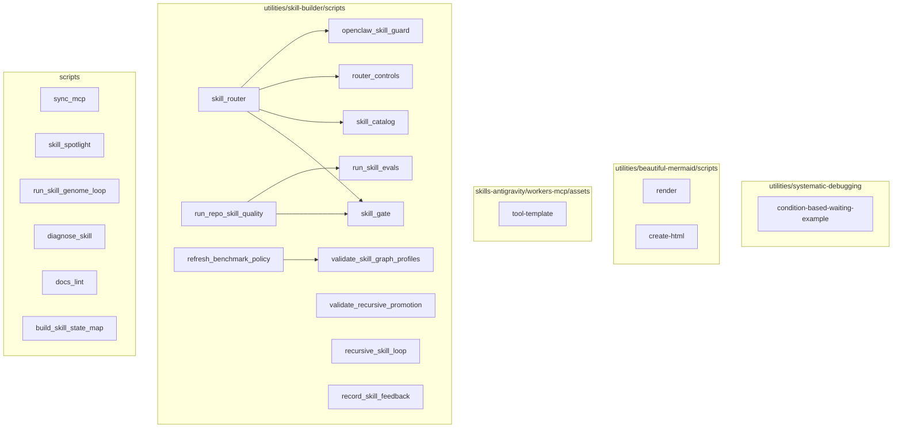
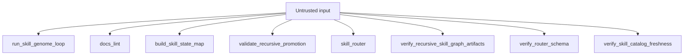
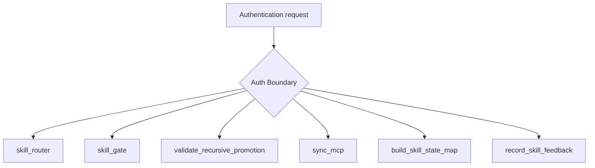

# Diagram Context Pack

**Generated:** 2026-03-15T19:03:34Z  
**Tool:** `@brainwav/diagram v1.0.8` (npx)  
**Manifest:** 10/10 types · 0 placeholders · all gates passed  

> This file is maintained by `scripts/refresh-diagram-context.sh`.  
> Agents: read this before making architecture claims about this repo.

---

## Table of Contents

- [Repository purpose](#repository-purpose)
- [Core components](#core-components)
- [Architecture diagram](#architecture-diagram)
- [Security surface](#security-surface)
- [Auth boundary](#auth-boundary)
- [Dependency graph (key paths)](#dependency-graph-key-paths)
- [Events and queues](#events-and-queues)
- [Quality and risk signals](#quality-and-risk-signals)
- [Refresh instructions](#refresh-instructions)

---

## Repository purpose

A canonical skill library and CI quality system for AI coding agents (Codex, Claude Code, Gemini).
Primary concern: skill authoring, cross-runtime symlink projection, automated quality gates,
and a human-gated recursive improvement loop.

No database, no HTTP server, no client-facing UI. All components are local tooling scripts
(Python/Shell) or Mermaid diagram assets.

---

## Core components

| Component | Location | Role |
|-----------|----------|------|
| `skill_router` | `utilities/skill-builder/scripts/skill_router.py` | Intent-first routing engine; scores queries against catalog |
| `skill_gate` | `utilities/skill-builder/scripts/skill_gate.py` | Tier-1 structure gate; validates SKILL.md schema |
| `openclaw_skill_guard` | `utilities/skill-builder/scripts/openclaw_skill_guard.py` | Readiness + security checks on high-risk skills |
| `recursive_skill_loop` | `utilities/skill-builder/scripts/recursive_skill_loop.py` | Bounded `generate→evaluate→diagnose→improve→re-score` loop |
| `run_skill_genome_loop` | `scripts/run_skill_genome_loop.py` | Nightly candidate generator; kill-switch aware |
| `validate_recursive_promotion` | `utilities/skill-builder/scripts/validate_recursive_promotion.py` | Secret redaction + promotion artifact verifier |
| `refresh_benchmark_policy` | `utilities/skill-builder/scripts/refresh_benchmark_policy.py` | Weekly Context7-backed threshold ratchet |
| `sync_mcp` | `scripts/sync_mcp.py` | Projects Codex MCP config → Antigravity; no browser dep |
| `run_repo_skill_quality` | `utilities/skill-builder/scripts/run_repo_skill_quality.py` | CI quality orchestrator (Tier 1 + optional Tier 2) |
| `record_skill_feedback` | `utilities/skill-builder/scripts/record_skill_feedback.py` | Persists decision feedback; feeds subject scoreboard |

**Routing invariant** (from `.architecture.yml`):  
`skill_router` → `skill_gate` → `openclaw_skill_guard` must remain reachable in that order.

---

## Architecture diagram



---

## Security surface

Scripts that accept untrusted input (from `security.mmd`):



**Not in untrusted surface:** `sync_mcp` — consistent with `.architecture.yml` rule `sync_mcp_isolated`.

---

## Auth boundary

Scripts inside the auth boundary (from `auth.mmd`):



---

## Dependency graph (key paths)

External dependencies confirmed from `dependency.mmd` — **stdlib only at runtime** (no third-party PyPI at import time except `pyyaml` and `tomli`/`tomllib`):

```
skill_router.py
  ├── skill_catalog.py      (loads SKILL.md frontmatter from disk)
  ├── skill_router_schema.py (Candidate + RouterResult dataclasses)
  ├── router_controls.py    (rollout-mode / kill-switch file reads)
  └── openclaw_skill_guard.py
       └── scans .py/.js/.ts/.sh files for readiness/security patterns

recursive_skill_loop.py
  └── artifacts/skill-graphs/runs/<run_id>/
       ├── run.json
       ├── iteration_journal.jsonl
       ├── promotion_decision.json
       └── lesson_candidates.json

refresh_benchmark_policy.py
  └── Context7 (external MCP / urllib — runs only in scheduled CI)

sync_mcp.py
  ├── ~/.codex/config.toml  (source)
  └── ~/.gemini/antigravity/mcp_config.json  (target)
```

One mirror pattern throughout: `frontend/<skill>/` ↔ `skills-antigravity/<skill>/` — these are sync artifacts, not divergence.

---

## Events and queues

Event-driven scripts (from `events.mmd`):

| Script | Trigger mechanism |
|--------|-------------------|
| `run_skill_genome_loop` | JSONL watermark + nightly cron / `just genome-loop` |
| `recursive_skill_loop` | Per-run invocation; writes `iteration_journal.jsonl` |
| `validate_recursive_promotion` | CI PR gate on promotion artifact changes |
| `run_skill_evals` | CI `workflow_dispatch` or manual |
| `skill_router` | Appends to `route-events.jsonl` on each route call |
| `test_skill_router` | Unit tests (pytest) |
| `upgrade_skill` | Manual CLI invocation |

---

## Quality and risk signals

| Signal | Status |
|--------|--------|
| Manifest completeness | ✅ 10/10 types, 0 placeholders |
| `diagram test` (.architecture.yml rules) | ⚠️ Skipped — `./rules` module missing in v1.0.8 |
| External HTTP surface | `refresh_benchmark_policy` only (scheduled CI, not runtime) |
| Supply-chain risk | Low — stdlib-only Python, no third-party runtime imports |
| Mirror fidelity | `frontend/` ↔ `skills-antigravity/` mirrors; verify with `diff -r` periodically |
| `sync_mcp` isolation | ✅ Confirmed isolated from browser subsystem |

**Known gap:** `.architecture.yml` rules (`skill_gate_reachable`, `openclaw_guard_reachable`, `sync_mcp_isolated`, etc.) are not CI-enforced because `diagram test` subcommand is missing in v1.0.8. Manual verification only until the fix lands.

---

## Refresh instructions

The `pnpm exec` path in `refresh-diagram-context.sh` requires a local install.  
Use `npx` as the direct alternative:

```bash
# Regenerate all diagrams
npx --yes @brainwav/diagram all . --output-dir .diagram

# Re-gate artifacts
npx --yes @brainwav/diagram manifest . \
  --manifest-dir .diagram \
  --require-types architecture,dependency,security,auth \
  --fail-on-placeholder

# Commit updated context + diagrams
git add .diagram/
git commit -m "chore: refresh diagram context pack"
```
