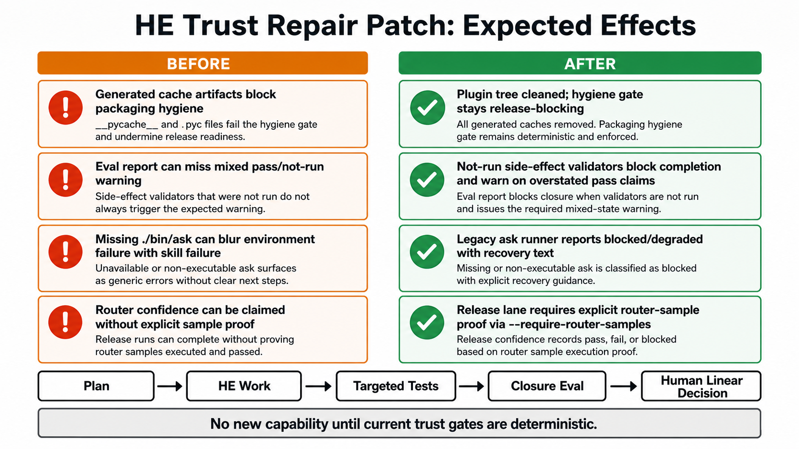

# HE Trust Repair Before After Infographic

## Artifact

## Purpose

This infographic compares the expected behavior before and after the HE trust
defect repair patch.

It supports:

- `.harness/plan/2026-05-09-agent-skills-he-trust-defect-repair-plan.md`
- the follow-on `he-phase-heartbeat` execution gate for the same plan

## Source

Generated image cache source:

`/Users/jamiecraik/.codex/generated_images/019e04dd-86ac-7d23-b21c-e1a878f5b8dc/ig_00a18cf34defe2690169ff92c305a081919be58e55d2cd05fb.png`

Repository artifact path:

`.harness/media/2026-05-09-he-trust-repair-before-after.png`
