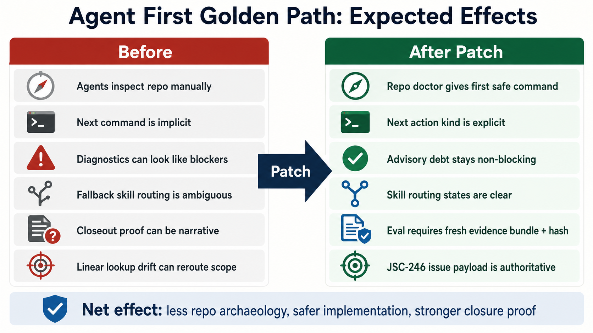

# JSC-246 Agent First Golden Path Before After Infographic

## Artifact

## Purpose

This infographic compares the expected behavior before and after the JSC-246
Agent First Golden Path patch.

It supports:

- `.harness/plan/agent-skills-jsc-246-agent-first-golden-path-plan.md`
- `.harness/review/agent-skills-jsc-246-agent-first-golden-path-plan-technical-review.md`
- the follow-on `he-phase-heartbeat` execution gate for the same plan

## Source

Generated image cache source:

`~/.codex/generated_images/019e0cb6-d4a5-7662-bef9-7bac2a13e7e3/ig_027907650167e6500169ffb05043cc8191bddca62c3efea780.png`

Repository artifact path:

`.harness/media/2026-05-09-jsc-246-agent-first-golden-path-before-after.png`
