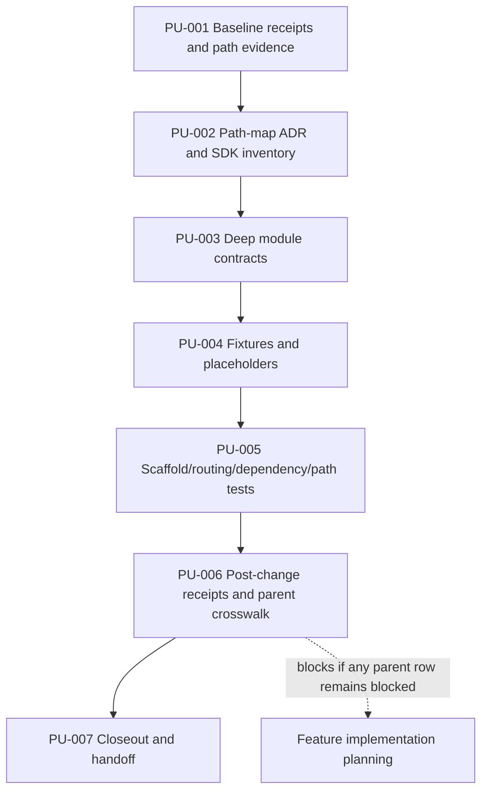
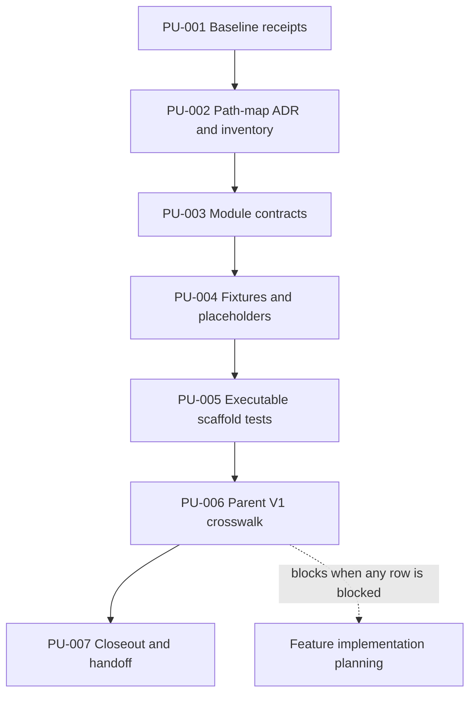

# Agent-First Skills SDK Scaffold and Deep Module Refactor Plan

## Command Summary

BLUF: This plan turns JSC-391 from an accepted scaffold spec into a bounded execution contract for reshaping the Skills SDK landing zones before feature implementation begins. It will not add new user-facing SDK behavior; it will create the path-map decision, inventory the existing SDK code, define deep module ownership, add parseable placeholders and fixtures, prove dependency and path-ownership rules, and produce baseline/post-change receipts that protect current `./bin/ask` behavior. The main risk is accidentally treating folders or prose as readiness, so every unit pairs a structural change with a test, receipt, or explicit blocked parent-acceptance row before handoff to `he-work`.

Decision Needed: Approve PU-001 through PU-007 for `he-work`, with PU-001 as the first implementation unit.

Top Risks: Expanding JSC-391 into V1 feature work; duplicating existing `skills_sdk` modules; selecting physical paths without an ADR; editing runtime projections; declaring parent V1 acceptance before work-mode, sensor, receipt, and adversarial-review evidence exists; relying on narrative receipts instead of comparable command evidence.

Next Action: Hand PU-001 to `he-work` after confirming implementation authority, then execute units in order and stop before feature planning until the parent V1 crosswalk has no `blocked_parent_acceptance` rows.

## Objective

Implement the JSC-391 scaffold/refactor gate so future Skills SDK work lands in accepted agent-first deep modules instead of old CLI glue.

The plan must produce implementation evidence that:

- selected physical paths are recorded in a path-map ADR before scaffold files are created;
- existing tracked source files under `Infrastructure/scripts/lib/ask/skills_sdk/**` are inventoried and classified as preserve, move, wrap, or defer;
- deep modules have small public contracts and hidden internals;
- signing is a placeholder-owned module only, with no signing execution, key handling, registry publication, or trust-store writes;
- generated/runtime projection paths are denied as scaffold source;
- current `./bin/ask` behavior is protected by baseline and post-change compatibility receipts;
- parent V1 acceptance IDs SA-024 through SA-029 are satisfied or explicitly left blocked before feature implementation planning.

## Source Contract

| Source | Contract Consumed |
| --- | --- |
| `.harness/specs/2026-06-03-jsc-391-agent-first-skills-sdk-scaffold-refactor-spec.md` | JSC-391 FR-001 through FR-010, NFR-001 through NFR-005, VP-001 through VP-013, SA-001 through SA-022. |
| `.harness/specs/2026-06-03-skills-sdk-v1-product-spec.md` | Parent V1 SA-024 through SA-029 and pre-plan scaffold gate. |
| Linear JSC-391 | Live issue fetched 2026-06-03: status Todo, priority High, project Skills SDK Platformization, no blocker relations, local spec path recorded. |
| `UBIQUITOUS_LANGUAGE.md` | Canonical Skill Source, Runtime Projection, Generated Command Handle, Agent Skills Standard, and project-local source terms. |
| `Docs/agents/14-path-ownership-boundaries.md` | Canonical source, derived/runtime surface, and edit policy for `.agents`, `.skillsets`, `Plugins/cache`, `Docs`, `Infrastructure`, and `.harness`. |
| `Infrastructure/tests/test_skills_sdk_boundaries.py` | Existing boundary test family for SDK modules and command-layer import separation. |
| `Infrastructure/references/skills-sdk-apparatus-lens.md` | Proof stance: schema, command output, fixtures, evals, and validation outrank prose review. |

## Scope and Boundaries

In scope:

- `.harness/decisions/**` or `Docs/decisions/skills-sdk/**` for the path-map ADR, depending on repo-native decision convention discovered in PU-001.
- `Docs/canon/skills-sdk/**` or repo-native equivalent selected by the ADR.
- `Infrastructure/scripts/lib/ask/skills_sdk/**` for module shells or wrappers only where the ADR and inventory select this area.
- `Infrastructure/schemas/skills-sdk/**` or `schemas/skills-sdk/**` only after PU-002 selects one canonical schema home in the path-map ADR.
- `Infrastructure/tests/fixtures/skills_sdk/**` for minimum fixtures.
- `examples/skills-sdk/**` for minimal source-shape examples if selected by the path-map ADR.
- `Infrastructure/tests/test_skills_sdk_boundaries.py` and new focused `Infrastructure/tests/test_*skills_sdk*` files for scaffold, routing, dependency, path ownership, fixture, and receipt tests.
- `.harness/receipts/**` or `.harness/evidence/**` for baseline/post-change compatibility receipts if selected by the ADR or closeout convention.
- A parseable module ownership map in the ADR-selected evidence, schema, or canon-docs surface, with stable fields consumed by tests.
- `AGENTS.md` or `Docs/agents/14-path-ownership-boundaries.md` only if discoverability cannot be satisfied by linking an existing authoritative pointer.

Out of scope:

- Runtime projection edits under `.agents/**`, `.skillsets/**`, `skills-codex/**`, `Plugins/cache/**`, `~/.agents/skills/**`, or `~/.codex/skills/**`.
- New user-facing CLI behavior, including `skill check`, install, package, signing, refs ingestion, sandbox execution, eval execution, registry publish, marketplace, or global/project skill writes.
- Replacing `./bin/ask`.
- Broad repo migration or standalone repository extraction.
- Tessl or external confirmation as a required SDK gate.
- Linear mutation, PR creation, staging, commit, push, or tracker closure from this plan stage.

Do not proceed if a unit requires an out-of-scope surface. Return to `he-plan` or `he-spec` with the exact blocker.

## Authority and Scope Boundary

| Field | Boundary |
| --- | --- |
| requested_depth | approved_slice: JSC-391 scaffold/refactor gate only. |
| approved_execution_boundary | User requested this implementation plan from the JSC-391 spec; implementation is not authorized by this planning artifact alone. |
| downscope_authority | source_artifact: the spec allows physical path adaptation only when module boundaries are preserved and the ADR explains why. |
| external_mutation_boundary | confirmation_required for any Linear mutation; none is required to execute local scaffold work, but tracker sync is evidence debt. |
| proof_boundary | Completion is proven by created/updated scaffold files, path-map ADR, tests, baseline/post-change receipts, parent V1 crosswalk, and command output. |
| non_proof_sources | Chat summaries, local plan prose, visual diagrams, and stale Linear descriptions explain context but do not prove scaffold implementation. |
| freshness_required | Repo status and Linear JSC-391 state before implementation start; validation timestamp before closeout; PR/CI state only if a PR is opened later. |
| human_acceptance_boundary | Required before feature implementation planning; not required to write this local plan artifact. |

## Current State / Evidence

| Evidence | Observation | Planning Impact |
| --- | --- | --- |
| Git status | Branch `main` tracks `origin/main`; local spec is modified from the prior review; plan artifact will be a second unstaged change. | Preserve the existing spec edit and do not stage anything. |
| Linear JSC-391 | Fetched read-only on 2026-06-03: Todo, High priority, no blocker relations. Description records the local spec but lacks the newest parent-crosswalk/signing details. | Plan can proceed locally; `linear_action_required` remains true for optional tracker sync after plan review. |
| Existing SDK files | `conformance.py`, `contracts.py`, `package_contracts.py`, `package_verify.py`, `runtime_adapters.py`, and `__init__.py` exist under `Infrastructure/scripts/lib/ask/skills_sdk/`. | PU-002 must inventory before adding shells; wrappers/defer are preferred over parallel modules when equivalent behavior exists. |
| Existing SDK generated cache | `__pycache__` may exist under `Infrastructure/scripts/lib/ask/skills_sdk/` but is not tracked source. | PU-002 inventory and receipts must use tracked/source files only and must not promote generated cache files into the scaffold contract. |
| Existing tests | `Infrastructure/tests/test_skills_sdk_boundaries.py` already checks SDK modules do not import command-layer code. | Extend this family for dependency direction and module routing instead of inventing a disconnected test style. |
| Path ownership docs | `.agents/**`, `.skillsets/**`, `skills-codex/**`, `Plugins/cache/**`, and root `SKILL.md` are generated/runtime surfaces. | PU-005 must make projection rejection executable. |
| Parent V1 spec | SA-024 through SA-029 are owned by JSC-391. | PU-006 must produce a parent crosswalk and leave unresolved parent rows blocked. |

## Implementation Strategy

Work from the decision surface inward:

1. Prove baseline compatibility before creating scaffold files.
2. Create the path-map ADR and inventory current SDK code.
3. Define deep module contracts, a machine-readable module ownership map, and signing placeholder ownership in docs or module README files.
4. Add only parseable placeholders, examples, and fixtures needed for future work to have landing zones, and validate every placeholder before the unit hands off.
5. Add tests and lintable rules that make path ownership, module routing, dependency direction, feature-leak prevention, and receipt comparison executable.
6. Produce the parent V1 crosswalk and mandatory repo-local planning-gate proof before any feature implementation planning proceeds.
7. Close out with exact commands, changed files, receipts, unresolved parent rows, and tracker evidence debt.

Prefer documentation plus tests over placeholder code when code would only copy a template or increase import surface. Prefer wrappers or `defer` classifications over duplicate modules when existing `skills_sdk` code already owns equivalent behavior.

## Runtime Persistence and State

| Field | Value |
| --- | --- |
| runtime_state | Plan artifact ready for review; no implementation has started. |
| resumption_key | `.harness/plan/2026-06-03-jsc-391-agent-first-skills-sdk-scaffold-refactor-plan.md`; JSC-391. |
| runtime_invocation_receipt | he-plan invoked in Codex session on 2026-06-03; no external mutation performed. |
| artifact_chain_key | jsc-391-agent-first-skills-sdk-scaffold-refactor. |
| persistent_artifacts | JSC-391 spec, parent V1 spec, and this plan. |
| live_state_refresh | required before he-work starts and before PR/closeout claims. |
| session_evidence_status | fresh for repo status and Linear fetch during plan creation; historical for any earlier validation not rerun in the implementation window. |
| proof_boundary | Plan validation proves artifact quality only; implementation proof requires PU validation gates and post-change receipts. |

## Enforcement Contract

essential_decisions:

- JSC-391 is a scaffold/refactor gate, not feature implementation.
- `./bin/ask` remains the repo control plane.
- Runtime projections are not canonical scaffold source.
- Every future feature issue names one owning deep module and collaborators.
- Deep modules expose small public contracts and hide implementation details.
- Parent V1 SA-024 through SA-029 must be mapped to satisfied, accepted deferral, or `blocked_parent_acceptance` before feature planning.
- Signing is a placeholder owner only in this slice.

fillable_gaps:

- Exact physical path mapping after PU-001 repo inspection and ADR.
- README versus ADR split for module boundary documentation.
- Test filenames and fixture filenames.
- Whether placeholder modules are importable packages or documented landing-zone directories.
- Whether Linear JSC-391 should be updated with plan and crosswalk links after local plan review.

guardrails:

- Baseline and post-change compatibility receipt commands in PU-001 and PU-006.
- Path-map ADR exists before scaffold file creation.
- Inventory classifies every existing tracked/source `skills_sdk` file before module shells are added and excludes generated cache files.
- Baseline and post-change receipts include SDK import/public-contract checks, not only CLI command compatibility.
- Module routing expectations live in a parseable ownership map that tests consume directly.
- Path ownership tests reject generated projections as scaffold source.
- Dependency tests catch forbidden direct imports across internals.
- Feature-leak negative checks prove no new user-facing CLI/signing/sandbox/eval/install/registry behavior.
- Feature-planning blocks are enforced by a repo-local executable gate; dry-run refusal artifacts and Linear dependency/status evidence are supplemental only.
- Parent V1 crosswalk records unresolved parent rows as `blocked_parent_acceptance`.

refusal_triggers:

- A unit starts `skill check`, install, signing execution, sandbox execution, eval execution, registry publish, marketplace, global writes, or new user-facing CLI behavior.
- A unit writes to generated/runtime projection surfaces as source.
- A unit replaces `./bin/ask` or migrates the whole repo.
- A unit creates parallel modules that duplicate existing `skills_sdk` behavior without wrap/defer justification.
- A closeout claims JSC-391 fully accepted while any parent V1 crosswalk row remains blocked.

durable_memory:

- Path-map ADR and module contracts live in the selected repo-native decision/canon surface.
- Receipt schema and regression-classification fields are preserved in tests or docs, not only closeout prose.
- Any tracker sync should link this plan and the parent acceptance crosswalk without treating the local plan as Linear mutation proof.

professional_output:

- Every PU closeout reports changed files, exact commands, pass/fail/blocker state, module map impact, baseline/post-change receipt status, parent crosswalk status, rollback, and next action.
- Final closeout separates local code/test truth, Linear state, PR state, CI state, review-thread state, artifact state, and merge readiness.

## Coding and Testing Lenses

coding_lens:

- Ownership: `.harness/**`, `Docs/**`, `Infrastructure/scripts/lib/ask/skills_sdk/**`, `Infrastructure/tests/**`, `Infrastructure/schemas/**` or `schemas/**`, `examples/**` only when selected by ADR.
- Public contract: deep module responsibilities, parseable module routing map, dependency direction, path ownership, compatibility receipt fields, SDK import/public-symbol compatibility, parent V1 crosswalk, and `./bin/ask` compatibility.
- Generated boundaries: no hand edits to `.agents/**`, `.skillsets/**`, `skills-codex/**`, `Plugins/cache/**`, root `SKILL.md`, or user/global runtime links.
- Complexity posture: keep the scaffold thin; prefer docs/tests/parseable placeholders; wrap or defer existing implementation rather than duplicate it.
- Failure/recovery: stop on path conflict, behavior regression, projection edit, feature leakage, or blocked validation; isolate or revert the offending scaffold change.

testing_lens:

- Observable behavior: current repo status/doctor/skills list/explain/prove/closeout commands remain callable; existing SDK modules remain importable with compatible public contracts; scaffold files exist where ADR says; generated projection paths are rejected; feature behavior is absent; parent crosswalk blocks unresolved rows through a repo-local executable gate.
- Prior-art tests: extend `Infrastructure/tests/test_skills_sdk_boundaries.py`; inspect `Infrastructure/tests/test_pr_skills_sdk_artifacts.py`; use repo wrappers for compatibility commands.
- Positive scenarios: valid minimal Codex `SKILL.md`, valid SDK draft package, selected module routing rows, parseable placeholders, allowed canonical paths.
- Negative scenarios: missing-frontmatter skill, generated-projection rejection, forbidden module import, rejected path alternative, feature-leak command behavior.
- Exact commands: listed under Validation Gates and per PU.
- Blocked gates: classify Linear mutation as confirmation_required unless separately authorized; classify external Tessl as not applicable for this slice.

## Work Units

### PU-001: Capture Baseline Compatibility And Path Evidence

Objective: Establish the pre-change compatibility baseline, selected existing skill handle, exact unit-test set, and path-convention evidence before scaffold files are created.

Source trace: FR-003, FR-008, FR-009, SA-006, SA-013, VP-001, VP-002, VP-008, VP-012.

Allowed paths or areas: `.harness/receipts/**` or `.harness/evidence/**` for baseline receipts; no product code changes.

Forbidden paths or areas: `Infrastructure/scripts/lib/ask/skills_sdk/**` changes, runtime projections, generated surfaces, and feature behavior.

Steps:

1. Run and save baseline compatibility receipts for the required command matrix.
2. Discover one stable `<existing-skill-handle>` from `./bin/ask skills list --json --robot`.
3. Run and save SDK import/public-contract receipts for every existing tracked source module under `Infrastructure/scripts/lib/ask/skills_sdk/**`, including selected public symbols or `__all__` where present.
4. Record CLI receipt fields: `schema_version`, `phase`, `command`, `exit_code`, `structured_output_status`, `selected_skill_handle`, `expected_invariant`, `actual_invariant`, `normalized_failure_class`, `regression_classification`, and `evidence_ref`.
5. Record SDK receipt fields: `schema_version`, `phase`, `module`, `import_status`, `public_symbols_status`, `expected_public_contract`, `actual_public_contract`, `compatibility_classification`, and `evidence_ref`.
6. Inspect existing schema, docs, decision, fixture, and test conventions for the path-map ADR.
7. Stop if the baseline cannot be captured or if repo status contains unrelated dirty files that would contaminate closeout.

Validation command/evidence: `python3 bin/ask repo status --json`; `./bin/ask repo doctor --json --robot`; `./bin/ask skills list --json --robot`; `./bin/ask skills explain <existing-skill-handle> --json --robot`; `./bin/ask skills prove <existing-skill-handle> --json --robot`; `./bin/ask repo closeout --changed --json --robot`; Python import/public-contract receipt command selected in PU-001, importing each existing `ask.skills_sdk` module from the repo wrapper environment and recording public symbols.

Stop condition: Any command cannot run and cannot be classified into a receipt with a blocker and recovery step.

Rollback note: Remove only the baseline receipt artifact if it is malformed before any scaffold edits depend on it.

Handoff state: required before PU-002.

### PU-002: Create Path-Map ADR And Existing SDK Inventory

Objective: Select physical paths for every logical landing zone and classify each existing `skills_sdk` file before adding module shells or placeholders.

Source trace: FR-001, FR-002, FR-004, NFR-001, NFR-003, SA-002, SA-005, OQ-001, OQ-002, OQ-003.

Allowed paths or areas: `.harness/decisions/**` or `Docs/decisions/skills-sdk/**` for the ADR; selected canon docs path; selected parseable module ownership map path; inventory tables inside the ADR or linked plan evidence.

Forbidden paths or areas: creating scaffold files before the ADR exists; writing to rejected alternatives; moving existing SDK files without import compatibility proof.

Steps:

1. Create a path-map ADR that selects physical paths for SDK core, schemas, runtime, packaging, signing, evals, fixtures, examples, canon docs, and decisions.
2. Cite repo evidence for each selected path and each rejected alternative.
3. Inventory all tracked source files under `Infrastructure/scripts/lib/ask/skills_sdk/**` and explicitly exclude generated cache paths such as `__pycache__/**`.
4. Classify each existing file as preserve, move, wrap, or defer.
5. Select the parseable module ownership map path and format.
6. Record source/projection ownership rules, including denied projection paths.
7. Add a note that changing the ADR requires amendment before implementation writes to rejected alternatives.

Validation command/evidence: `test -f <selected-path-map-adr>`; `test -f <selected-module-ownership-map>`; `rg -n "Infrastructure/scripts/lib/ask/skills_sdk|preserve|move|wrap|defer|\.agents/skills|\.skillsets" <selected-path-map-adr>`; parse the selected module ownership map with the repo-standard JSON/YAML/TOML/Markdown-table parser chosen by the ADR; `python3 -m pytest Infrastructure/tests/test_skills_sdk_boundaries.py -q` if inventory changes import assumptions.

Stop condition: Path ownership conflicts with existing docs, or no canonical schema/docs/decision home can be selected without user decision.

Rollback note: Revert the ADR only if no scaffold files have used it; otherwise amend it with supersession rationale.

Handoff state: required before PU-003.

### PU-003: Define Deep Module Contracts And Minimal Landing Zones

Objective: Create or document deep module ownership so future work has an agent-safe public contract without implementing V1 features.

Source trace: FR-002, FR-005, FR-006, FR-010, NFR-002, NFR-004, SA-003, SA-004, SA-011, SA-019, SA-020, SA-021.

Allowed paths or areas: selected canon docs path; selected module ownership map path; selected `Infrastructure/scripts/lib/ask/skills_sdk/**` module directories only as empty package init files, README files, or wrapper interfaces justified by PU-002; selected schema/docs path for placeholder contract files.

Forbidden paths or areas: new user-facing CLI commands or command behavior; signing, sandbox, eval, or install execution; duplicate modules for behavior already owned by existing `skills_sdk` files.

Steps:

1. Add module boundary documentation for `manifest`, `receipts`, `risk`, `install`, `sandbox`, `refs`, `evals`, and `signing`.
2. Document each module's responsibility, public contract, hidden internals, collaborators, and forbidden ownership.
3. Create or update the parseable module ownership map with stable fields for `module`, `owns`, `collaborators`, `public_contract`, `forbidden_ownership`, `source_paths`, and `status`.
4. Define work-mode tags for inferential, computational, and hybrid work.
5. Define `risk` module sensor placement and probability/impact/detectability model as a contract or explicit blocked row.
6. Define `receipts` proof metadata and redaction boundary as a contract or explicit blocked row.
7. Keep signing documentation/schema-only and include honest `not_run` or `blocked` status semantics.

Validation command/evidence: `rg -n "manifest|receipts|risk|install|sandbox|refs|evals|signing" <selected-module-docs>`; `rg -n "inferential|computational|hybrid|probability|impact|detectability|proof metadata|redaction" <selected-module-docs>`; parse and field-check `<selected-module-ownership-map>` for every required module; `python3 -m py_compile Infrastructure/scripts/lib/ask/skills_sdk/**/*.py` if Python shells are added.

Stop condition: A module contract requires real feature behavior to be meaningful.

Rollback note: Remove or amend the module docs/shells; no runtime data migration should exist.

Handoff state: required before PU-004.

### PU-004: Add Fixtures, Examples, And Parseable Placeholder Contracts

Objective: Add the minimum fixture and placeholder set needed to prove future SDK work has valid landing zones without pretending features exist.

Source trace: FR-007, NFR-005, SA-010, SA-012, VP-006, VP-007, parent SA-024.

Allowed paths or areas: selected `Infrastructure/tests/fixtures/skills_sdk/**`, `examples/skills-sdk/**`, schema placeholder path, and canon docs path.

Forbidden paths or areas: runtime projection fixtures treated as source; placeholder content that returns pass for unimplemented signing, sandbox, eval, install, or registry behavior; external Tessl requirement.

Steps:

1. Add valid minimal Codex `SKILL.md` fixture.
2. Add invalid missing-frontmatter skill fixture.
3. Add valid SDK draft package fixture.
4. Add generated-projection path fixture that must be rejected.
5. Add parseable schema or Markdown placeholders for future contract areas selected by the ADR.
6. Ensure placeholder statuses are `not_run`, `skipped_optional`, or `blocked` where capability is absent.
7. Parse or schema-check every placeholder created in this PU before handoff, using the lightweight parser appropriate to the selected format.

Validation command/evidence: `python3 -m py_compile` for Python placeholder files; immediate JSON/YAML/TOML/Markdown-table parser checks for every placeholder created in PU-004; focused fixture/parser tests added in PU-005 for durable regression coverage.

Stop condition: A placeholder implies runtime readiness or feature availability.

Rollback note: Remove malformed fixtures/placeholders and rerun fixture parser tests.

Handoff state: can run after PU-003, but cannot hand off until every created placeholder has a passing lightweight parser/schema check or a blocked validation row.

### PU-005: Add Executable Scaffold, Routing, Dependency, And Path Tests

Objective: Convert scaffold contracts into tests or lintable rules so future agents cannot bypass them with prose.

Source trace: FR-004, FR-005, FR-006, FR-009, SA-008, SA-011, SA-017, VP-003, VP-004, VP-005, VP-009, VP-010, VP-011, parent SA-028.

Allowed paths or areas: `Infrastructure/tests/test_skills_sdk_boundaries.py`, new focused `Infrastructure/tests/test_skills_sdk_*.py` files, helper modules under `Infrastructure/tests` only when needed, and repo path ownership docs only if tests need an authoritative pointer.

Forbidden paths or areas: tests coupled to private implementation names unless accepted as the contract; tests that assert only file presence while missing path ownership, module routing, or feature-leak behavior; broad validation rewrites unrelated to JSC-391.

Steps:

1. Add scaffold structure test against the path-map ADR.
2. Add module routing test for known task surfaces and owning modules by consuming the parseable module ownership map.
3. Extend dependency direction test to catch forbidden direct imports across internals.
4. Add path ownership test proving generated/runtime projection paths are denied as scaffold source.
5. Add feature-leak negative checks proving no new user-facing command behavior, signing execution, sandbox execution, eval execution, install write, registry/publish behavior, or global/project skill writes.
6. Add discoverability test or doc link check proving the new scaffold is findable by future agents.
7. Add a repo-local executable planning gate that fails when feature implementation planning references parent SA-024 through SA-029 while the JSC-391 crosswalk contains any `blocked_parent_acceptance` row.

Validation command/evidence: `python3 -m pytest Infrastructure/tests/test_skills_sdk_boundaries.py -q`; `python3 -m pytest Infrastructure/tests/test_skills_sdk_*.py -q`; `bash Infrastructure/scripts/validation-and-linting/check_path_ownership_boundaries.sh` if touched files include ownership docs or generated-surface logic.

Stop condition: A rule cannot be tested without implementing out-of-scope behavior.

Rollback note: Revert focused tests and any contract files they made necessary.

Handoff state: required before PU-006.

### PU-006: Capture Post-Change Receipts And Parent V1 Acceptance Crosswalk

Objective: Prove behavior compatibility, classify regressions, and decide whether parent V1 acceptance rows are satisfied or still blocked.

Source trace: FR-008, FR-009, FR-010, SA-013, SA-014, SA-018, SA-019, SA-020, SA-021, SA-022, VP-001, VP-008, VP-012, VP-013, parent SA-024 through SA-029.

Allowed paths or areas: `.harness/receipts/**` or selected evidence path; selected decision/canon/closeout path; `.harness/linear/**` for optional tracker payload.

Forbidden paths or areas: marking JSC-391 accepted when any parent row remains `blocked_parent_acceptance`; treating local plan/spec validation as live Linear mutation; mutating Linear without explicit authorization.

Steps:

1. Run the same CLI compatibility command matrix and SDK import/public-contract receipt command as PU-001 and save post-change receipts.
2. Compare baseline and post-change CLI and SDK receipts using required fields, not narrative similarity.
3. Produce a parent V1 crosswalk for SA-024 through SA-029 with `satisfied`, `accepted_deferral`, or `blocked_parent_acceptance`.
4. Produce mandatory planning-gate proof from the repo-local executable gate added in PU-005; dry-run/refusal artifacts and Linear dependency/status evidence may be attached only as supplemental context.
5. If Linear description remains stale, prepare a confirmation-required payload linking the plan and crosswalk without applying it.
6. Classify every failure as introduced by scaffold, pre-existing, unrelated dirty worktree, environment/tooling, or blocked.

Validation command/evidence: same CLI and SDK compatibility receipt matrix from PU-001; repo-local planning-gate command from PU-005; `rg -n "SA-024|SA-025|SA-026|SA-027|SA-028|SA-029|blocked_parent_acceptance" <crosswalk-artifact>`.

Stop condition: Baseline/post-change receipts differ in a way that cannot be classified safely.

Rollback note: Revert scaffold changes associated with an introduced regression or leave feature planning blocked with exact recovery evidence.

Handoff state: required before PU-007.

### PU-007: Closeout, Review, And Handoff Package

Objective: Prepare the implementation closeout package without collapsing local proof, tracker state, PR state, CI state, or review readiness.

Source trace: SA-015, SA-016, SA-017, professional_output, stage arc boundary.

Allowed paths or areas: `.harness/reports/**` or `.harness/evidence/**` for closeout, `.harness/linear/**` for optional tracker payload, and `Docs/agents/**` or `AGENTS.md` only if PU-005 proved discoverability requires it.

Forbidden paths or areas: staging, committing, pushing, PR creation, or Linear mutation unless separately authorized; claiming CI, PR review, mergeability, or tracker closure without live evidence.

Steps:

1. Summarize changed files, module map, deferred feature work, commands, pass/fail/blocker state, rollback, and next action.
2. Run a bounded review pass against the implemented scaffold.
3. Verify every planned artifact exists and is non-empty.
4. Leave tracker and PR lanes separate from local validation.
5. Hand off to `he-code-review` or user review if the diff is large or touches high-risk surfaces; otherwise hand off to user for staging/commit authority.

Validation command/evidence: `git status --short --branch`; `git diff --check`; `./bin/ask repo closeout --changed --json --robot`; review artifact checks required by the chosen review lane.

Stop condition: Missing artifact, unresolved regression, stale Linear state, or parent crosswalk blocked while a feature-planning handoff is requested.

Rollback note: Use the changed-file list and ADR dependency chain to revert the scaffold slice in reverse PU order.

Handoff state: explicit stop unless user authorizes implementation or review mutation.

## Dependencies and Sequencing

Dependency rules:

- PU-002 must not start scaffold writes before PU-001 baseline receipts exist.
- PU-003 must not add module shells before PU-002 selects physical paths.
- PU-004 may run in parallel with late PU-003 documentation only after the ADR selects fixture/example paths.
- PU-006 must use the same compatibility command matrix as PU-001.
- Feature implementation planning is forbidden until PU-006 proves no parent V1 crosswalk row remains `blocked_parent_acceptance`.

## Validation Gates

| Gate | Timing | Command or Evidence | Required | Owner |
| --- | --- | --- | --- | --- |
| Plan BLUF | Before handoff | `python3 Plugins/harness-engineering/scripts/check_bluf_structure.py .harness/plan/2026-06-03-jsc-391-agent-first-skills-sdk-scaffold-refactor-plan.md --json` | required | he-plan |
| Plan shape | Before handoff | `python3 Plugins/harness-engineering/scripts/check_generated_artifact_shape.py .harness/plan/2026-06-03-jsc-391-agent-first-skills-sdk-scaffold-refactor-plan.md --kind plan --json` | required | he-plan |
| Plan identity | Before handoff | `python3 Infrastructure/scripts/validation-and-linting/he_artifact_identity_lint.py .harness/plan/2026-06-03-jsc-391-agent-first-skills-sdk-scaffold-refactor-plan.md` | required | he-plan |
| Plan traceability | Before handoff | `python3 Infrastructure/scripts/validation-and-linting/he_linear_traceability_lint.py .harness/plan/2026-06-03-jsc-391-agent-first-skills-sdk-scaffold-refactor-plan.md` | required | he-plan |
| Baseline compatibility | PU-001 | Required command matrix receipts | required | he-work |
| SDK import/public-contract baseline | PU-001 | Python import/public-symbol receipts for existing `skills_sdk` modules | required | he-work |
| Path-map ADR | PU-002 | `test -f <selected-path-map-adr>` plus `rg` proof | required | he-work |
| Module ownership map | PU-002/PU-003 | `test -f <selected-module-ownership-map>` plus parser/field checks | required | he-work |
| Boundary tests | PU-005 | `python3 -m pytest Infrastructure/tests/test_skills_sdk_boundaries.py -q` | required | he-work |
| Focused scaffold tests | PU-005 | `python3 -m pytest Infrastructure/tests/test_skills_sdk_*.py -q` | required when files exist | he-work |
| Placeholder parser checks | PU-004/PU-005 | Immediate parser checks plus focused fixture/parser regression tests | required when placeholders are created | he-work |
| Feature-planning gate | PU-005/PU-006 | Repo-local executable gate proving blocked parent rows block feature planning | required | he-work |
| Path ownership guard | PU-005/PU-007 | `bash Infrastructure/scripts/validation-and-linting/check_path_ownership_boundaries.sh` | conditional when ownership docs or generated boundaries are touched | he-work |
| Post-change compatibility | PU-006 | Required CLI and SDK compatibility receipts | required | he-work |
| Changed-file closeout | PU-007 | `./bin/ask repo closeout --changed --json --robot` | required | he-work |
| Diff hygiene | PU-007 | `git diff --check` | required | he-work |

## Review Plan

Use bounded review after PU-006 and before PU-007 closeout:

- correctness lens: receipt comparison, parent crosswalk, and feature-leak negative checks;
- maintainability lens: module contracts are deep enough and wrappers do not duplicate existing code;
- testing lens: scaffold assertions are behavior/contract-shaped, not only presence checks;
- project standards lens: AGENTS, UBIQUITOUS_LANGUAGE, and path ownership docs remain respected;
- agent-native lens: future agents can discover the scaffold, know allowed paths, and understand blocked parent rows.

Escalate to a formal review swarm only if implementation changes exceed 50 lines of Python behavior, touch public CLI semantics, or create multiple new schema/test surfaces.

## Rollback Plan

Rollback in reverse unit order:

1. PU-007: remove closeout/report artifacts that no longer describe current state.
2. PU-006: remove or mark post-change receipts superseded; keep baseline receipts only if useful for diagnosis.
3. PU-005: revert focused tests and lintable rules.
4. PU-004: remove fixtures/placeholders/examples.
5. PU-003: remove module docs/shells/wrappers added by this slice.
6. PU-002: amend or revert the path-map ADR; if downstream files already used it, prefer supersession over deletion.
7. PU-001: keep baseline receipt as historical evidence or delete if malformed and unused.

Emergency rollback trigger: any scaffold change breaks current `./bin/ask` compatibility and cannot be isolated inside the current PU.

## Risk Register

| Risk | Severity | Signal | Mitigation |
| --- | --- | --- | --- |
| Feature creep into V1 behavior | High | New command behavior, signing/sandbox/eval execution, install writes, or registry flow appears. | Feature-leak negative checks and refusal triggers. |
| Duplicate SDK modules | High | New shell duplicates `contracts.py`, `package_contracts.py`, `package_verify.py`, `runtime_adapters.py`, or `conformance.py`. | PU-002 preserve/move/wrap/defer inventory before PU-003. |
| Path ambiguity | High | Both `schemas/` and `Infrastructure/schemas/` or `Docs/` and `docs/` receive writes. | Path-map ADR forbids rejected alternatives. |
| Parent acceptance drift | High | JSC-391 marked accepted while SA-025 through SA-029 are unproven. | PU-006 parent crosswalk with `blocked_parent_acceptance`. |
| Projection source drift | High | .agents, .skillsets, Plugins/cache, or root SKILL.md edited by hand. | Path ownership tests and guard. |
| Compatibility regression masked as pre-existing | Medium-high | Baseline/post-change receipts are narrative or incomparable. | Required receipt fields and equivalence rule. |
| Linear evidence drift | Medium | Local plan/spec outpaces Linear description. | Read-only live fetch recorded; optional Linear payload requires confirmation. |
| Over-documentation without tests | Medium | Contracts exist but no executable scaffold/routing/path tests. | PU-005 required before crosswalk closeout. |

## Observability and Evidence

Evidence artifacts to produce during implementation:

- Baseline compatibility receipts from PU-001.
- Path-map ADR and inventory from PU-002.
- Module contract docs and placeholder schema/docs from PU-003.
- Fixture files from PU-004.
- Focused pytest and ownership guard outputs from PU-005.
- Post-change compatibility receipts and parent V1 crosswalk from PU-006.
- Closeout report with changed files, validation, blockers, rollback, and next action from PU-007.

Receipt comparison must separate local code/test truth, Linear tracker state, PR state, CI state, review-thread state, artifact state, and merge readiness.

## Visual References / Diagrams

The dependency graph below is the visual reference. No generated image is needed because the work is a file-system, contract, and validation sequence where Mermaid is more durable and easier for agents to parse.

## Accessibility and Operator Ergonomics

- Keep ADR and module docs scannable with tables and stable IDs.
- Use repo-relative paths in artifacts.
- Prefer short status values such as `satisfied`, `blocked_parent_acceptance`, `preserved`, and `introduced_by_scaffold`.
- Do not use color-only status.
- Keep receipt JSON fields stable and machine-readable.

## Open Questions

| ID | Question | Owner | Blocking Status | Resolution Path |
| --- | --- | --- | --- | --- |
| OQ-001 | Should public schemas live under `schemas/skills-sdk/` or `Infrastructure/schemas/skills-sdk/`? | PU-002 implementer | blocks scaffold writes | Resolve in path-map ADR. |
| OQ-002 | Should docs use `Docs/canon/skills-sdk/` or lowercase `docs/canon/skills-sdk/`? | PU-002 implementer | blocks docs writes | Resolve in path-map ADR; default to `Docs/` unless evidence says otherwise. |
| OQ-003 | Should existing `Infrastructure/scripts/lib/ask/skills_sdk/` become the initial SDK core root? | PU-002 implementer | blocks module shells | Inventory existing files and classify preserve/move/wrap/defer. |
| OQ-004 | Which exact existing skill handle should compatibility receipts use? | PU-001 implementer | blocks baseline receipts | Discover through `./bin/ask skills list --json --robot`. |
| OQ-005 | Should Linear JSC-391 be updated with this plan and the amended crosswalk? | User or Linear-authorized agent | does not block local plan | Prepare payload after plan review if requested. |

## Final Decision

This plan is ready as a local `he-work` execution contract for JSC-391 after the user authorizes implementation. It does not authorize feature implementation planning, Linear mutation, staging, commit, push, or PR creation. Feature implementation planning remains blocked until PU-006 proves the parent V1 crosswalk has no `blocked_parent_acceptance` rows.

## Linear Work Item Contract

| Field | Value |
| --- | --- |
| Primary issue | JSC-391 |
| URL | https://linear.app/jscraik/issue/JSC-391/spec-agent-first-skills-sdk-scaffold-and-deep-module-landing-zones |
| Project | Skills SDK Platformization |
| Team | Jscraik |
| Status | Todo |
| Priority | High |
| Mutation status | already_linked; no mutation performed by this plan |
| Related issues | JSC-375, JSC-376, JSC-378, JSC-390 |
| Contract | JSC-391 owns scaffold/deep-module landing zones before feature implementation planning. |

## Linear Acceptance Traceability

| Linear issue | Acceptance IDs |
| --- | --- |
| JSC-391 | SA-001, SA-002, SA-003, SA-004, SA-005, SA-006, SA-007, SA-008, SA-009, SA-010, SA-011, SA-012, SA-013, SA-014, SA-015, SA-016, SA-017, SA-018, SA-019, SA-020, SA-021, SA-022 |
| JSC-375 | SA-007, SA-008, SA-013 |
| JSC-376 | SA-007, SA-014 |
| JSC-378 | SA-002, SA-003, SA-004, SA-011 |
| JSC-390 | SA-001 |

## Appendix A. Harness Metadata / Traceability

interactive_status: not_requested

selection_evidence:

- User explicitly requested `harness-engineering:he-plan` for `.harness/specs/2026-06-03-jsc-391-agent-first-skills-sdk-scaffold-refactor-spec.md`.
- JSC-391 spec defines a scaffold/refactor gate before Skills SDK feature implementation planning.
- Linear JSC-391 was fetched read-only during plan creation and is already linked.

route: he-plan

stage: plan

scope:

- In scope: durable implementation plan for JSC-391 scaffold/refactor gate.
- Out of scope: implementation, tracker mutation, staging, commit, push, PR creation, feature planning, registry/marketplace/signing/sandbox/eval execution.

source:

- `.harness/specs/2026-06-03-jsc-391-agent-first-skills-sdk-scaffold-refactor-spec.md`

plan_path: `.harness/plan/2026-06-03-jsc-391-agent-first-skills-sdk-scaffold-refactor-plan.md`

traceability:

- Primary local spec: `.harness/specs/2026-06-03-jsc-391-agent-first-skills-sdk-scaffold-refactor-spec.md`
- Parent V1 spec: `.harness/specs/2026-06-03-skills-sdk-v1-product-spec.md`
- Primary tracker: JSC-391

validation:

- Plan validation commands listed in Validation Gates.
- Implementation validation commands listed per PU.

safe_to_continue: true

blocked_reason: not_applicable

linear_action_required: true

linear_mutation_status: already_linked

post_plan_handoff:
  state: explicit_stop
  selected_next_stage: he-work
  evidence: `.harness/plan/2026-06-03-jsc-391-agent-first-skills-sdk-scaffold-refactor-plan.md`
  next_action: User approval is required before implementation; optional Linear sync needs confirmation.

authority_scope_boundary:
  requested_depth: approved_slice
  approved_execution_boundary: user-requested he-plan from JSC-391 spec
  downscope_authority: source_artifact
  external_mutation_boundary: confirmation_required
  proof_boundary: files, tests, receipts, crosswalk, validation output
  non_proof_sources:
    - chat_summary
    - local_plan_prose
    - stale_linear_description
  freshness_required:
    - repo_status
    - linear_tracker_state
    - validation_time
  human_acceptance_boundary: required_before_feature_planning

runtime_persistence:
  runtime_state: plan_ready_for_review
  resumption_key: `.harness/plan/2026-06-03-jsc-391-agent-first-skills-sdk-scaffold-refactor-plan.md`; JSC-391
  runtime_invocation_receipt: Codex he-plan invocation on 2026-06-03
  artifact_chain_key: jsc-391-agent-first-skills-sdk-scaffold-refactor
  persistent_artifacts:
    - `.harness/specs/2026-06-03-jsc-391-agent-first-skills-sdk-scaffold-refactor-spec.md`
    - `.harness/plan/2026-06-03-jsc-391-agent-first-skills-sdk-scaffold-refactor-plan.md`
  live_state_refresh: required_before_he_work_and_closeout
  session_evidence_status: fresh_for_repo_and_linear_fetch_during_plan_creation

stage_arc_boundary:
  left_arc:
    source_of_truth: JSC-391 local spec plus read-only Linear fetch
    entry_authority: explicit
    freshness_required: fresh
    not_proof: Local plan validation does not prove implementation, Linear mutation, PR state, CI, or feature readiness.
  active_arc:
    owned_stage: he-plan
    allowed_actions: read repo evidence and write local .harness/plan artifact
    forbidden_actions: implementation, staging, commit, push, PR creation, Linear mutation, feature planning
    mutation_boundary: local_artifact
  right_arc:
    handoff_target: he-work
    handoff_artifact: `.harness/plan/2026-06-03-jsc-391-agent-first-skills-sdk-scaffold-refactor-plan.md`
    proof_required: PU validation gates plus parent V1 crosswalk
    closure_boundary: not_closure
    resume_key: JSC-391
  persona_lenses:
    coding_lens: required
    testing_lens: required
    coverage_parity_required: yes

coding_lens: See Coding and Testing Lenses.

testing_lens: See Coding and Testing Lenses.

blackboard_delta:

- JSC-391 can be implemented as a scaffold gate but cannot unblock feature planning until parent SA-024 through SA-029 are resolved.
- Linear JSC-391 is live and already linked, but its description should be refreshed after plan review to include parent crosswalk/signing details.

git_staging_status: not_staged

staged_paths: []

confidence:

- high that source traceability, path ownership boundaries, and validation routes are captured from fresh local evidence;
- medium that physical paths will be accepted, because PU-002 must still decide schema/docs homes from repo conventions;
- medium that Linear remains aligned, because live fetch was read-only and the tracker description is behind the amended local spec;
- low for implementation correctness until PU validation gates run.

## Appendix B. Linear / Tracker Handoff

Current live Linear evidence:

| Field | Value |
| --- | --- |
| Issue | JSC-391 |
| Status | Todo |
| Priority | High |
| Project | Skills SDK Platformization |
| Relations | No blocker relations observed in read-only fetch |
| Mutation | None performed |

Optional tracker update payload after user confirmation:

- Link this plan path.
- Note that local spec now includes parent V1 SA-024 through SA-029 crosswalk.
- Note that signing is placeholder-owned only and no signing execution is authorized.
- Note that feature implementation planning remains blocked until the parent crosswalk has no `blocked_parent_acceptance` rows.

## Appendix C. Review Outcomes

Plan self-review status: no material blocker found before validation.

Review notes:

- The plan preserves the source spec's refusal triggers and does not authorize feature work.
- The plan explicitly separates local proof from Linear mutation.
- The plan uses the existing `test_skills_sdk_boundaries.py` family instead of inventing an unrelated validation surface.
- The plan leaves physical path mapping to PU-002 rather than pretending it is already settled.
