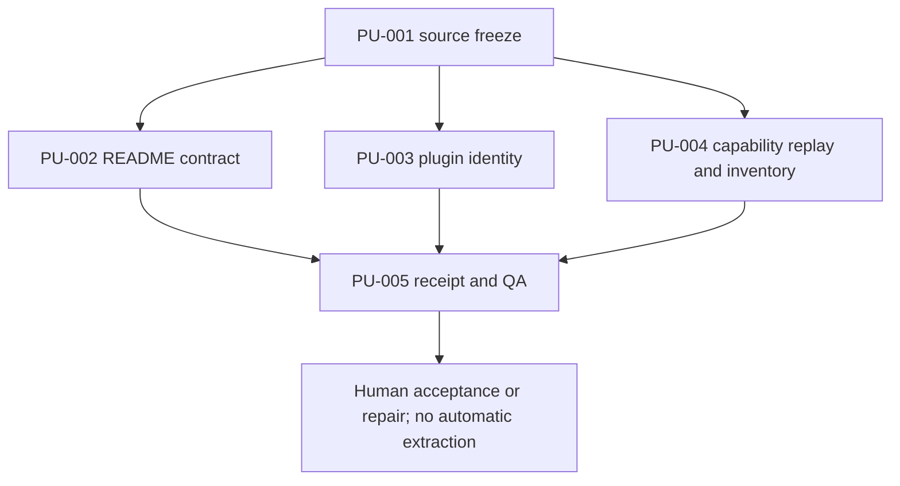
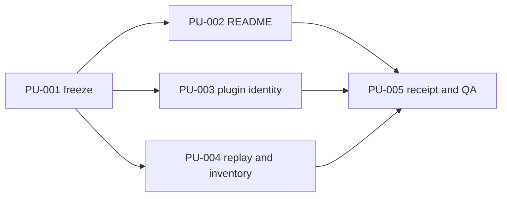

# Skills SDK Stabilization Baseline Plan

## Command Summary

BLUF: This plan gives the Skills SDK maintainer, implementation agent, and independent QA reviewer one execution contract whose job is to stabilize the current `agent-skills` repository before service refactoring or Foundry extraction. It limits implementation to the README intake/package mismatch, plugin-cache identity drift, exhaustive safe capability replay, a revision-bound baseline receipt, and a read-only command/service inventory because changing migration architecture or deleting code would destroy the comparison baseline. The main risk is accidental expansion into public CLI changes, runtime paths, Tessl, CircleCI, extraction, or deadwood deletion; the next handoff is an explicitly authorized Worker packet followed by separate QA Disproof, not implementation from this planning stage.

Decision Needed: authorize or amend this bounded stabilization plan before any
implementation worktree or branch is created.

Top Risks: dirty-checkout contamination; public CLI behavior drift; fixing test
expectations rather than the package contract; hiding plugin cache duplicates;
unsafe capability command execution; incomplete revision-bound evidence.

Next Action: obtain implementation authorization, then create the clean
`codex/skills-sdk-stabilization-baseline` worktree from the freshly recorded
source SHA and dispatch separate Worker and QA packets.

## Objective

Produce a clean, independently reviewed stabilization baseline for the existing
Skills SDK implementation without beginning extraction or future-state runtime
work. The baseline must make current package admission, plugin cache identity,
and capability evidence internally consistent and reproducible at one SHA.

## Source Contract

| Source | Authority |
|---|---|
| Jamie Brain bounded implementation specification | FR-019 through FR-027, FR-065 through FR-071, FR-080, SA-004, SA-015 through SA-018 |
| Independent disproof review | `safe_to_plan` final verdict; transaction/authenticity contracts constrain later state work but are not implemented here |
| Agent Skills reconciliation | Current failing tests, dirty-state exclusion, capability-evidence limits, reuse boundaries |
| Repository `AGENTS.md`, `CODESTYLE.md`, `UBIQUITOUS_LANGUAGE.md` | Target implementation and validation authority |
| Current repository wrappers and focused tests | Executable behavior and proof authority |

## Scope and Boundaries

In scope:

- create a clean branch/worktree from a freshly recorded source SHA;
- align the README admission/package contract through one canonical policy;
- remove or correctly classify duplicate `plugin-router` and unexpected
  `plugin-builder` runtime-cache exposure without changing canonical plugin
  source identity by implication;
- execute or explicitly classify every safe capability-matrix command/external
  evidence reference;
- emit `skills-sdk.stabilization-baseline-receipt.v1`;
- produce a read-only command/service rationalization inventory;
- run focused, aggregate-required, artifact-shape, and independent QA gates.

Out of scope:

- public command rename/removal or semantic change;
- broad service/module refactoring;
- deadwood deletion;
- lockfile v2, transaction locking, authenticity policy, or runtime install v2;
- `skills-sdk`/`skills-foundry` extraction or remote creation;
- Tessl or CircleCI mutation;
- plugin install/update/uninstall mutation;
- home skill roots, symlinks, plugin cache, or live runtime mutation;
- publication, visibility changes, archive, rename, or retirement.

## Authority and Scope Boundary

```yaml
requested_depth: approved_slice
approved_execution_boundary: plan only until explicit implementation authorization; later Worker limited to PU-001 through PU-005
downscope_authority: explicit Jamie approval or accepted source-spec revision
external_mutation_boundary: none
freshness_required: branch, head_sha, dirty_state, validation_time
human_acceptance_boundary: required after QA Disproof
```

FR-065/FR-080 govern all compatibility behavior. Any proposed change to command
names, aliases, flags/defaults, exit codes, stdout/stderr placement, robot
envelopes/error codes, contractual ordering, or side effects stops the slice.

## Current State / Evidence

Observed during planning:

- branch: `codex/skills-sdk-capability-truth`;
- planning-time HEAD: `fc5e330d721db2e15b148a9af1621e032899c5bc`;
- primary checkout contains a modified `.gitignore` and untracked
  `.harness/reports/project-pm/agent-skills/skills-sdk-tessl-publish/`;
- `skill_intake.py` rejects an unexpected `README.md`, while package hardening
  and project install require/allow `README.md`;
- `test_local_plugin_picker_surface.py` names the allowed plugin identities and
  currently exposes duplicate/unexpected cache behavior;
- capability evidence has a schema-backed receipt builder, but the accepted
  baseline requires exhaustive execution/classification rather than inventory.

Implementation MUST refresh these facts before creating the worktree. If HEAD
or dirty state changed, the receipt records the new facts; it must not silently
pretend the planning-time SHA is the execution SHA.

## Implementation Strategy

Use characterization and policy proof before edits. Resolve one contract at a
time, run its focused tests, then integrate into a single revision-bound
receipt. Do not fix failures by weakening assertions unless the canonical
policy and public behavior evidence require that exact change.

The read-only command/service inventory is evidence for the later
rationalization plan. It cannot trigger moves, renames, consolidation, or
deletion in this slice.

## Runtime Persistence and State

```yaml
runtime_state: stabilization plan written; implementation not authorized
resumption_key: .harness/plan/2026-07-11-skills-sdk-stabilization-baseline-plan.md
runtime_invocation_receipt: not_applicable_before_authorized_implementation
artifact_chain_key: skills-sdk-foundry-bounded-implementation -> skills-sdk-stabilization-baseline
persistent_artifacts:
  - this plan
  - source specification and independent review
  - future stabilization receipt
  - future rationalization inventory
  - future Worker and QA artifacts
live_state_refresh: required before worktree creation and closeout
session_evidence_status: historical after handoff
proof_boundary: plan validation proves plan shape only; implementation requires fresh target-repo and QA evidence
```

## Enforcement Contract

```yaml
essential_decisions:
  - README is governed by one canonical intake/package policy
  - plugin cache exposes one deterministic allowed identity per skill
  - every capability reference receives an explicit evidence status
  - public CLI behavior remains compatible
  - dirty primary state is excluded
fillable_gaps:
  - private helper reuse
  - fixture organization
  - deterministic inventory formatting
guardrails:
  - focused intake/package/plugin/capability tests
  - schema validation
  - public wrapper characterization
  - git diff and excluded-path checks
  - independent QA Disproof
refusal_triggers:
  - public CLI or schema semantic change
  - migration/runtime/Tessl/CircleCI requirement
  - unclassified user-owned state
  - destructive cache or source cleanup
  - missing safe command classification
durable_memory:
  - baseline receipt, rationalization inventory, source spec/review, steering uptake when triggered
professional_output:
  - files, exact commands, pass/fail/blocked, blockers, warnings, rollback, excluded state, not_proven, QA reference, next action
```

## Coding and Testing Lenses

```yaml
coding_lens:
  ownership: intake/package modules own source contract; plugin services own cache identity; capability evidence owns replay receipt
  allowed: exact files discovered in PU-001 and admitted in the Worker packet
  forbidden: runtime projections, home roots, plugin cache as source, extraction, external state
  compatibility: characterize ./bin/ask sdk before edits; FR-080 stops public drift
  recovery: isolated worktree and atomic evidence writes; discard only the dedicated worktree on rejected implementation
  complexity: reuse existing policy/digest/receipt machinery
testing_lens:
  observable_behavior: admitted package files align across intake, build/hardening and install; plugin picker is unique; capability references are exhaustive
  source_acceptance: SA-004, SA-015, SA-016, SA-017
  prior_art: intake/review/hardening, local plugin picker, capability status/evidence tests
  scenarios: valid README, unexpected file, duplicate identities, stale cache, safe command pass/fail/block, unsafe/external command classification
  recovery_owner: Worker fixes implementation; independent QA rejects or accepts actual output
```

## Work Units

Every unit below names an allowed path or area, a forbidden path or area,
validation evidence, a stop condition, rollback, and a handoff state. The
Worker packet must make those labels exact before implementation.

### PU-001: Freeze Source And Characterize Compatibility

Objective: create the isolated execution boundary and baseline evidence.

Source trace: FR-019, FR-020, FR-024, FR-065, FR-080, SA-016.

Allowed areas: new dedicated worktree; `.harness/evidence/**`; read-only source
and tests. Forbidden: current dirty checkout edits, external mutation.

Steps:

1. Refresh branch, HEAD, worktrees, status, and excluded dirty paths.
2. Create `codex/skills-sdk-stabilization-baseline` in a dedicated worktree from
   the accepted fresh SHA.
3. Record public `./bin/ask sdk` help/status/error characterization needed by
   affected commands.
4. Record before-test outcomes and ownership classification.

Validation: exact git evidence, wrapper characterization, and before-test
receipt. Stop if the branch exists at a conflicting SHA, the worktree is not
clean, or source state cannot be separated from user-owned changes.

Rollback: remove only the dedicated unaccepted worktree/branch with explicit
authorization; never reset the primary checkout.

### PU-002: Reconcile README Intake And Package Policy

Objective: make intake, review, hardening, and install agree on whether and how
`README.md` belongs in a valid release package.

Source trace: FR-021, FR-024, SA-004.

Candidate allowed paths, subject to PU-001 confirmation:

- `Infrastructure/scripts/lib/ask/skills_sdk/skill_intake.py`;
- `Infrastructure/scripts/lib/ask/skills_sdk/package_hardening.py`;
- `Infrastructure/scripts/lib/ask/skills_sdk/project_install.py`;
- their schemas, fixtures, and focused tests;
- narrow documentation stating the canonical policy.

Forbidden: changing unrelated allowed files, Tessl/publication policy, or
runtime roots.

Steps: identify canonical package contract; add characterization/negative tests;
make the smallest shared-policy correction; prove intake, review, hardening, and
install agree.

Validation: focused intake/review/package/install tests. Stop if resolution
requires a public schema/version change or changes registry identity.

Rollback: revert only PU-002 changes in the dedicated worktree and retain the
failing evidence.

### PU-003: Reconcile Plugin Cache Identity

Objective: ensure local picker output contains one allowed identity per active
plugin skill without deleting canonical plugin source or mutating the live Codex
plugin cache.

Source trace: FR-021, FR-024, FR-043 through FR-051, SA-003, SA-004.

Candidate allowed paths: plugin source/cache discovery services, identity
normalization policy, picker tests/fixtures, narrow docs. Forbidden: live
`$CODEX_HOME/plugins`, plugin source deletion, install/update/uninstall.

Steps: trace duplicate `plugin-router` and unexpected `plugin-builder` to source,
alias, archive, fixture, or cache discovery; encode one deterministic rule;
preserve explicit accepted identities; add sibling-pattern tests.

Validation: `test_local_plugin_picker_surface.py` plus affected plugin lifecycle
tests and cache/source containment tests. Stop if the fix needs direct cache
mutation, changes a public plugin identity, or cannot distinguish source from
runtime cache safely.

Rollback: revert PU-003 policy/test changes; do not clean the live cache.

### PU-004: Exhaustive Capability Replay And Read-Only Rationalization Inventory

Objective: replace inventory-only capability evidence with exhaustive explicit
classification and produce the later rationalization input without refactoring.

Source trace: FR-022, FR-023, FR-066 through FR-070, SA-004, SA-015, SA-017.

Allowed paths: capability evidence/status modules, schemas, tests, controlled
`.harness/evidence/**` outputs, one read-only inventory artifact. Forbidden:
executing unsafe/destructive commands, service refactor, deletion, external
mutation, secret access.

Steps:

1. Enumerate every matrix reference deterministically.
2. Classify it as `pass`, `fail`, `blocked_external`, `blocked_unsafe`,
   `not_applicable`, or `stale_reference`.
3. Execute only repository-approved safe local commands with bounded timeout.
4. Record exact command, exit/result, blocker, evidence reference, and
   `not_proven` without secrets.
5. Inventory every `ask sdk` command and SDK module using FR-066/FR-067 fields;
   make no disposition-driven code change.

Validation: capability evidence schema/tests, completeness assertion with zero
unclassified rows, safe-command allowlist tests, deterministic inventory tests.
Stop on ambiguous safety, credentials, external mutation, or missing ownership.

Rollback: discard generated unaccepted evidence and revert PU-004 code; preserve
the prior inventory receipt for comparison.

### PU-005: Baseline Receipt, Aggregate Validation, And QA Disproof

Objective: bind the stabilized behavior and exclusions to one revision and let
independent QA attempt to disprove it.

Source trace: FR-023, FR-025, FR-027, SA-004, SA-013, SA-014.

Allowed paths: stabilization receipt schema/producer/tests, evidence and QA
artifacts, narrow truth docs. Forbidden: unrelated cleanup or readiness claims.

Receipt fields: schema/version, HEAD, branch/worktree, dirty-state proof,
excluded paths, capability/schema digests, exact commands/outcomes, public
compatibility characterization, rationalization inventory digest, blockers,
warnings, `not_proven`, Worker artifact, QA artifact, and next gate.

Validation sequence:

1. PU-focused suites after each unit.
2. Accepted aggregate Infrastructure test wrapper.
3. `./bin/ask sdk status --json --robot`.
4. `./bin/ask sdk evidence verify --scope capability-matrix --json --robot`.
5. Repository closeout/changed-file gates derived from `AGENTS.md` and
   `Docs/agents/04-validation.md` at execution time.
6. Independent QA checks actual worktree, excluded dirty paths, receipt/schema,
   compatibility evidence, and no forbidden mutation.

Stop if any focused gate fails, aggregate ownership is unclear, receipt does not
bind the exact SHA/digests, QA artifact is missing, or public/external/runtime
claims exceed evidence.

Rollback: reject the baseline and retain its evidence; do not merge or extract.

## Dependencies and Sequencing



PU-002 through PU-004 may be implemented independently only after PU-001. PU-005
requires all three. Failure in one unit does not authorize skipping it.

## Validation Gates

| Gate | Class | Pass condition |
|---|---|---|
| Plan artifact shape | required now | Observable behavior and source acceptance IDs are present; BLUF and generated-plan validators pass |
| Worktree isolation | required before implementation | clean dedicated worktree at recorded SHA; excluded primary state unchanged |
| Focused tests | required | all affected suites pass with exact command receipts |
| Capability completeness | required | zero unclassified references; blocked rows have specific reasons |
| Compatibility | required | characterized public behavior unchanged or slice stops |
| Aggregate repo gate | required | repo-authoritative aggregate command passes or blocker is classified and baseline rejected |
| Independent QA | required | non-builder artifact exists and accepts actual output |
| Tessl/CircleCI/runtime | not applicable | forbidden in stabilization; no claim made |

## Review Plan

- Worker writes implementation and evidence only in the dedicated worktree.
- Independent QA receives the source spec, this plan, exact SHA, changed-file
  list, commands, baseline receipt, rationalization inventory, and excluded
  dirty-state evidence.
- QA tries to disprove every SA mapped to this slice and checks sibling patterns.
- PM/human acceptance follows QA; builder cannot self-accept.

## Rollback Plan

No live runtime or external state should change. Unit rollback is isolated Git
reversion inside the dedicated worktree. A rejected baseline leaves the primary
checkout and current runtime untouched. Worktree/branch removal is a later
explicit cleanup action, never an automatic failure response.

## Risk Register

| Risk | Control | Stop condition |
|---|---|---|
| Tests made green by changing expectations | canonical policy and characterization first | no source-backed behavior decision |
| Dirty state leaks into baseline | isolated worktree and excluded-path digest/status | any excluded file appears in diff |
| Plugin fix mutates cache/source identity | read-only tracing and test policy | direct cache write or identity change required |
| Unsafe capability execution | allowlist and explicit blocked status | safety cannot be proven |
| Public CLI drift | FR-080 characterization | any contractual output/side effect changes |
| Baseline overclaims readiness | receipt `not_proven` and QA | external/runtime claim lacks separate evidence |

## Observability and Evidence

No runtime content telemetry is added. Evidence is command metadata, statuses,
digests, test output references, receipts, inventory, and QA artifacts. Secrets,
prompt bodies, private package bodies, raw environment, and unbounded subprocess
output are prohibited.

## Visual References / Diagrams



The dependency diagram is authoritative for unit ordering. Prose stop
conditions and source requirements prevail if rendering differs.

## Accessibility and Operator Ergonomics

CLI and receipt output must use stable text statuses, not color alone; concise
repair guidance; deterministic JSON; and separate local, external, runtime, and
QA truth fields.

## Open Questions

No implementation decision may be invented by the Worker. Exact aggregate
commands and final allowed files are refreshed from current target instructions
during PU-001. Any change to public behavior, schema authority, plugin identity,
or safety policy returns to the specification.

## Final Decision

The plan is ready for explicit implementation authorization after its artifact
validators pass. `post_plan_handoff.state: awaiting_user_choice` because this
planning stage does not authorize `he-work` by itself.

## Appendix A. Harness Metadata / Traceability

```yaml
interactive_status: plan_created_pending_authorization
selection_evidence: accepted spec plus final independent safe_to_plan verdict
route: standard-plan
stage: he-plan
scope: stabilization only, PU-001 through PU-005
safe_to_continue: false_without_implementation_authorization
blocked_reason: Worker and QA packets not yet authorized or created
linear_action_required: false
linear_mutation_status: not_applicable
post_plan_handoff:
  state: awaiting_user_choice
authority_scope_boundary: plan artifact only
runtime_persistence: this plan, spec, review, future receipt/inventory/QA
git_staging_status: not_staged
staged_paths: []
confidence: high on scope and sequence; implementation evidence not yet produced
stage_arc_boundary:
  left_arc:
    source_of_truth: accepted amended spec and final independent safe_to_plan review
    entry_authority: explicit
    freshness_required: fresh before worktree creation
    not_proof: local plan and review do not prove implementation
  active_arc:
    owned_stage: he-plan
    allowed_actions: plan artifact write and validation
    forbidden_actions: implementation, deletion, extraction, runtime or external mutation
    mutation_boundary: local_artifact
  right_arc:
    handoff_target: authorized Worker then independent QA
    handoff_acceptance: PU-001 through PU-005 evidence and SA-004/015/016/017 accepted
    not_proven: implementation, Tessl, CircleCI, runtime, extraction, publication, retirement
subagent_policy: conditional
roles_used: [adversarial-document-reviewer]
roles_recommended: [worker, correctness-reviewer, testing-reviewer, security-reviewer]
roles_missing: []
```

## Appendix B. Linear / Tracker Handoff

No Linear mutation was requested or performed. A local plan is not live tracker
state. If the project requires a tracker before implementation, create or link
it through a separate authorized lane.

## Appendix C. Review Outcomes

The independent specification review initially returned `revise_before_plan`.
Transaction, authenticity, portability, compatibility, plugin-interface,
privacy, lifecycle, retention, and sequencing amendments were applied. Final
bounded re-review returned `safe_to_plan` and authorized only this plan artifact.
