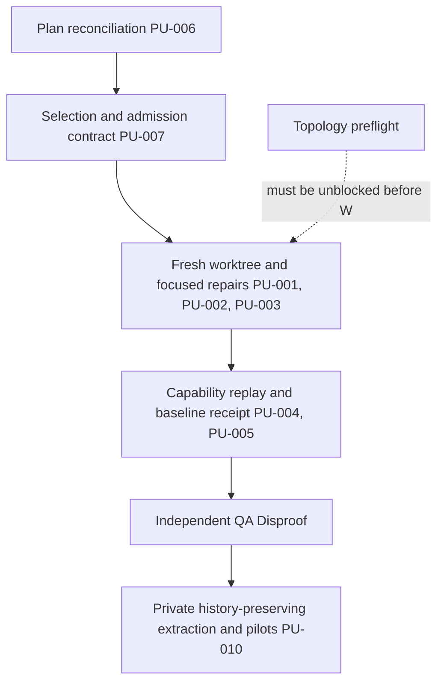
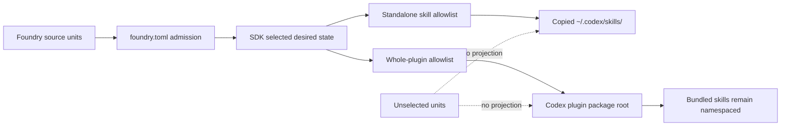

# Skills SDK Stabilization Baseline Reconciliation Plan

## Command Summary

BLUF: For the SDK maintainer, developer, and reviewer, this plan reconciles the July 11 Skills SDK stabilization slice with the current repository and the selected-install policy. It explains what is already present, what remains blocked, and why standalone skills and whole plugins must be selected explicitly before runtime projection. The change is limited to this plan artifact; it does not repair source, initialize Foundry or SDK repositories, regenerate a baseline, or mutate Codex runtime paths. Because the topology gate and focused intake/plugin tests still fail, the next action is a fresh stabilization worktree followed by bounded repairs, exhaustive capability replay, and a receipt-bound QA gate.

Decision Needed: accept this reconciliation as the current planning contract before authorizing the implementation slice.

Top Risks: treating partial SDK machinery as acceptance; selecting all source by default; flattening plugin-contained skills; extracting before a reproducible baseline; stale in-repository Foundry targets; and confusing a local plan or test lane with runtime, registry, CI, review, or release proof.

Next Action: validate this plan artifact, then obtain separate authorization for PU-001 in a clean dedicated worktree. Keep the baseline receipt pending until the topology and focused stabilization blockers have current evidence.

## Objective

Reconcile the existing stabilization plan with the current `agent-skills` tree and the intended separation between the agent-skills Foundry/dogfood source, Skills SDK lifecycle code, Foundry source projects, and selected Codex runtime installations. Preserve the July 11 plan as historical source evidence while making the current selection, admission, topology, and baseline gates explicit.

This plan is a planning artifact, not an implementation authorization and not a runtime cutover plan.

## Source Contract

| Source | Role | Current interpretation |
| --- | --- | --- |
| `.harness/plan/2026-07-11-skills-sdk-stabilization-baseline-plan.md` | Prior stabilization plan | Preserved; its PU-001 through PU-005 sequence remains the source of implementation-unit identity. |
| Jamie Brain bounded implementation specification | Product and lifecycle authority | FR-001 through FR-018 govern standalone and plugin state; FR-019 through FR-027 govern stabilization; FR-038 through FR-042 govern later extraction; FR-057 through FR-063 govern pilots and retirement; FR-065 through FR-071 govern command/service rationalization; FR-081 governs Codex plugin authority. |
| Jamie Brain architecture decision | Topology authority | `agent-skills` is the current foundry/dogfood source; `skills-foundry` is the separate Foundry source destination; Skills SDK and runtime projections are separate lanes. |
| `AGENTS.md`, `CODESTYLE.md`, `UBIQUITOUS_LANGUAGE.md` | Repository operating authority | Plan files are durable contracts; generated artifacts are not hand-edited; local, hosted, runtime, registry, and release evidence remain separate. |
| Current wrappers and focused tests | Executable behavior authority | The current checkout is clean at `4f7075eee3ae8ea81ca4aed9b1e6e5ecd77e6a8e`; intake/package and plugin-cache drift remain observable. |

## Scope and Boundaries

In scope for this reconciliation artifact:

- refresh current repository, topology, and focused-test evidence;
- preserve PU-001 through PU-005 while adding the current dependency and blocker information;
- define Foundry admission separately from SDK runtime selection;
- define an explicit allowlist for standalone skill projection to `~/.codex/skills`;
- define explicit whole-plugin selection for the Codex plugin root without flattening bundled skills;
- define the lock, digest, receipt, and rollback evidence required for later selection and installation work;
- map the current code-tree surfaces to the stabilization units and their proof gaps;
- retain explicit stop conditions for topology, intake, cache identity, capability replay, and QA.

Out of scope for this artifact:

- source-code repair;
- changing `.harness/plan/2026-07-11-skills-sdk-stabilization-baseline-plan.md` in place;
- initializing or extracting `~/dev/skills-foundry`;
- creating `~/dev/skills-sdk`;
- changing `~/.codex/skills`, `~/.codex/plugins`, `$CODEX_HOME`, `.agents`, or `Plugins/cache`;
- creating or editing generated lockfiles, receipts, caches, or runtime projections;
- Tessl, CircleCI, registry, GitHub, Linear, publication, deletion, rename, archive, or merge mutation;
- declaring the stabilization baseline accepted.

## Authority and Scope Boundary

```yaml
requested_depth: approved_slice
approved_execution_boundary: Jamie explicitly authorized this additive plan artifact; implementation requires a separate current authorization
downscope_authority: explicit_user_approval
external_mutation_boundary: none
freshness_required: branch, head_sha, dirty_state, validation_time
human_acceptance_boundary: required
proof_boundary: plan identity, frontmatter, BLUF, execution-first shape, plan graph, current evidence references, explicit blockers, and selected-install contract; these do not prove implementation, runtime projection, external CI, registry state, review approval, mergeability, or release readiness
non_proof_sources: [chat_summary, prior_receipt, stale_session, aggregate_test_count, local_plan_prose]
```

Only `.harness/plan/2026-07-20-skills-sdk-stabilization-baseline-reconciliation.md` may be written in this stage. A later implementation worker must receive explicit allowed paths and a fresh worktree identity before source mutation.

## Current State / Evidence

The current primary checkout is `main`, clean, and aligned with `origin/main` at `4f7075eee3ae8ea81ca4aed9b1e6e5ecd77e6a8e`. This is local repository evidence only.

The topology preflight is blocked because `~/dev/skills-foundry` is not a Git repository and three stale in-repository targets remain in the older migration plan and `Infrastructure/config/repo-layout.v1.json`: `foundry/skills`, `foundry/plugins`, and `foundry/system-skills`. These are plan/config reconciliation blockers, not evidence that extraction should begin.

The corrected focused stabilization suite reports nine failures and ninety-five passes, with seven subtests passing. The failures are concentrated in two contract families:

1. intake and intake-review disagree with the package hardening/install contract over the top-level `README.md` path;
2. the local plugin picker surface exposes duplicate `plugin-router` identity and lacks a versioned `harness-engineering` cache root.

The capability evidence/status subset reports forty-five tests passing and seven subtests passing. That proves the existing inventory/status scaffold is schema-backed; it does not prove exhaustive command replay or produce the required stabilization receipt.

The code tree therefore maps as follows:

| Unit | Current state | Evidence boundary |
| --- | --- | --- |
| PU-001 clean worktree and before-test receipt | Not evidenced | The current clean `main` checkout is not the dedicated stabilization worktree. |
| PU-002 README/intake/package reconciliation | Partial and blocked | Focused intake and intake-review tests fail on the `README.md` contract drift. |
| PU-003 plugin-cache identity reconciliation | Partial and blocked | Focused plugin picker tests fail on duplicate `plugin-router` and missing `harness-engineering` versioned cache. |
| PU-004 exhaustive capability replay | Scaffolded/partial | Capability tests pass, but replay references remain unclassified and no replay receipt is present. |
| PU-005 revision-bound baseline receipt and independent QA | Not evidenced | No current `skills-sdk.stabilization-baseline-receipt.v1` producer/receipt chain is present. |

## Implementation Strategy

Treat the plan update as a contract reconciliation, not as permission to widen the stabilization slice. Resolve the selection/admission vocabulary first, then run the existing PU sequence in a clean worktree. Reuse current intake, package, lock, digest, receipt, journal, and plugin-reference mechanisms before adding new abstractions.

The key distinction is:

```text
Foundry source admission  ->  SDK release/selection lock  ->  runtime projection
foundry.toml              ->  selected standalone IDs or plugin refs            ->  copied Codex installs
```

Foundry admission says which authored release units are governed. Runtime selection says which of those admitted units the operator actually wants installed. Neither decision is inferred from directory presence.

## Runtime Persistence and State

```yaml
runtime_state: plan reconciliation written; stabilization implementation remains blocked on current topology and focused-test evidence
resumption_key: .harness/plan/2026-07-20-skills-sdk-stabilization-baseline-reconciliation.md plus PU-001 worktree identity
runtime_invocation_receipt: blocked until an authorized implementation worker creates the fresh stabilization receipt chain
artifact_chain_key: skills-sdk-stabilization-baseline
persistent_artifacts:
  - .harness/plan/2026-07-11-skills-sdk-stabilization-baseline-plan.md
  - .harness/plan/2026-07-20-skills-sdk-stabilization-baseline-reconciliation.md
  - future skills-sdk.stabilization-baseline-receipt.v1
  - future capability replay and rationalization inventory
live_state_refresh: required
session_evidence_status: historical until each command is rerun in the authorized worktree
proof_boundary: this artifact proves plan scope and current blocker classification only
```

The eventual user desired state belongs in SDK-owned state outside installed skill directories, for example `$CODEX_HOME/skills-sdk/state/user/skills.lock.json`. Installed skill directories are copied consumer artifacts, not authoritative source or desired-state stores.

## Enforcement Contract

```yaml
essential_decisions:
  - Foundry admission is governed by an authored manifest such as foundry.toml.
  - Runtime selection is an explicit allowlist and never an all-source default.
  - Standalone skills and plugin packages have different ownership and rollback units.
  - Plugin-contained skills are never flattened into standalone skill roots.
  - Generated lockfiles and receipts are derived state and are never hand-edited.
  - Public ./bin/ask behavior remains compatible during stabilization.
  - Local, hosted, runtime, registry, and release evidence remain separate.
fillable_gaps:
  - exact selection-manifest schema name and version after PU-001 source inspection
  - exact Codex-owned plugin lifecycle command/API after interface characterization
  - exact capability replay command list after current matrix refresh
guardrails:
  - topology preflight and stale-target detection
  - `foundry.toml` admission and path-containment validation
  - standalone selection-lock schema and digest validation
  - plugin-reference ownership checks with no flattening
  - focused intake/package/plugin/capability tests
  - revision-bound stabilization receipt schema and producer
  - independent QA Disproof against current worktree and receipt
refusal_triggers:
  - missing clean dedicated worktree or stale HEAD evidence
  - public CLI or schema semantic change without an accepted amendment
  - direct writes to Codex plugin cache or runtime projections
  - all-source or implicit-default installation selection
  - flattened plugin-contained skills or standalone ownership of plugin files
  - unclassified capability references
  - missing generated receipt, independent QA, or rollback evidence
  - topology, authenticity, publication, Tessl, CircleCI, or external mutation requirements entering the stabilization slice
durable_memory:
  - this reconciliation plan
  - stabilization receipt and capability inventory when produced
  - independent QA artifact
  - steering uptake record when repeated operating feedback is classified as a durable workflow defect
professional_output:
  - changed plan path
  - exact validation commands and outcomes
  - current blockers and warnings
  - next authorized action
  - rollback and excluded-path evidence
  - claims boundary separating plan proof from implementation and runtime proof
```

## Coding and Testing Lenses

```yaml
coding_lens:
  ownership: this stage owns only the additive `.harness/plan/**` artifact; later intake/package modules own package admission, plugin services own cache identity, capability evidence owns replay receipts, and SDK state owns selection locks
  allowed_paths:
    - .harness/plan/2026-07-20-skills-sdk-stabilization-baseline-reconciliation.md
  forbidden_paths:
    - Infrastructure/scripts/lib/ask/**
    - Infrastructure/config/**
    - Infrastructure/tests/**
    - Plugins/**
    - Skills/**
    - .agents/**
    - Plugins/cache/**
    - ~/.codex/skills/**
    - ~/.codex/plugins/**
    - ~/dev/skills-foundry/**
    - ~/dev/skills-sdk/**
  compatibility: preserve existing ./bin/ask command names, schemas, statuses, and side-effect boundaries during later stabilization
  failure_recovery: stop on topology or contract drift; use a fresh worktree and reversible local commits; never repair a generated projection by hand
  generated_artifact_boundary: lockfiles, caches, installed copies, and receipts are derived outputs; their producers and schemas must be validated before use
  complexity_posture: reuse existing selection, package, digest, journal, receipt, and plugin-reference mechanisms before adding abstractions
testing_lens:
  observable_behavior: only selected standalone skills project as copied packages; selected plugins remain whole packages with namespaced bundled skills; unselected units remain absent from runtime projections
  source_acceptance_ids: [FR-001, FR-002, FR-006, FR-007, FR-017, FR-018, FR-019, FR-021, FR-022, FR-023, FR-025, FR-026, FR-027, FR-038, FR-039, FR-040, FR-041, FR-057, FR-058, FR-061, FR-065, FR-066, FR-081]
  prior_art_tests: [tests/test_skills_sdk_skill_intake.py, tests/test_skills_sdk_skill_intake_review.py, tests/test_skills_sdk_package_hardening.py, tests/test_local_plugin_picker_surface.py, tests/test_skills_sdk_capability_evidence.py, tests/test_skills_sdk_capability_status.py]
  positive_scenarios: selected standalone skill is copied to its exact target and is independent of source checkout; selected plugin is installed as one namespaced package
  negative_scenarios: unselected skill is not projected; plugin-contained skill is not copied standalone; duplicate identities, symlinks, path escapes, stale locks, and cache-only publication are refused
  stale_state_scenarios: selection lock digest differs, source revision is stale, runtime copy is drifted, or plugin reference points at a missing version
  validation_commands: exact repository-native commands are refreshed in PU-001; current plan-only commands are listed under Validation Gates
  blocked_gates: topology, focused intake/plugin, exhaustive replay, independent QA, runtime cutover, external Tessl/CircleCI, and Codex plugin lifecycle proof remain blocked or conditional until their owners provide evidence
  recovery_ownership: implementation worker owns local source repair; QA Disproof owns independent falsification; Jamie owns policy, scope, runtime-cutover, and external-mutation decisions
```

## Work Units

The original plan owns PU-001 through PU-005. This reconciliation adds the following stable units without renumbering those existing units.

### PU-006 — Reconcile current topology and stabilization evidence

Objective: bind the plan to the current `main` SHA, topology result, clean-state boundary, focused-test result, and current evidence gaps.

Source trace: FR-019, FR-020, FR-026, FR-027, SA-004, SA-015.

Allowed paths: this plan artifact only during the current stage; later source/config repairs require a newly authorized worktree.

Forbidden paths: source modules, generated config, caches, runtime projections, Foundry/SDK directories, Codex home directories, and hosted systems.

Steps: capture current branch/head/dirty evidence; record topology findings; map PU-001 through PU-005; preserve historical planning facts as historical.

Validation: `he_artifact_identity_lint.py`, `he_frontmatter_safety_lint.py`, BLUF shape, generated plan shape, and plan-graph validation.

Stop condition: stop if the current SHA, source plan, or topology decision cannot be identified from live evidence.

Rollback: remove only this newly created plan artifact if the artifact validators reject it; preserve the July 11 plan.

Handoff: this plan remains the current reconciliation artifact; no implementation handoff occurs until the user authorizes PU-001.

### PU-007 — Define selected admission and projection contract

Objective: make the distinction between Foundry admission, standalone selection, and whole-plugin selection explicit before any install or extraction work.

Source trace: FR-001 through FR-018, FR-038 through FR-042, FR-057 through FR-063, FR-081, NFR-001 through NFR-007.

Allowed paths: this plan artifact and later versioned schema/manifest files explicitly admitted by a new implementation packet.

Forbidden paths: direct runtime projection, plugin cache writes, symlink replacement, source extraction, publication, or package upload.

Steps: require authored Foundry admission; require an SDK-owned selection lock; select standalone IDs individually; select plugins as whole packages; bind versions, digests, scope, ownership, and receipts; state that unselected units remain absent.

Validation: later schema and policy tests must prove positive selection, negative selection, digest mismatch, collision, symlink, path-containment, plugin non-flattening, rollback, and repository-independence behavior.

Stop condition: stop if a proposal relies on directory presence, implicit all-source selection, mutable source paths as authority, or individual ownership of plugin-contained files.

Rollback: the contract is plan-only; reject or supersede this addendum without touching runtime state if policy review changes the selection model.

Handoff: selection policy is an input to PU-008 and later runtime-cutover planning, not permission to mutate runtime paths.

### PU-008 — Stabilize intake and plugin-cache contracts

Objective: after separate implementation authorization, resolve README package-contract drift and plugin-cache identity drift in a fresh dedicated worktree.

Source trace: FR-019 through FR-027, PU-002, PU-003, SA-004, SA-015, SA-016.

Allowed paths: only files discovered by PU-001 and admitted in the Worker packet; focused tests and schemas that directly prove the selected contract.

Forbidden paths: public CLI renames, broad refactoring, deadwood deletion, Foundry extraction, runtime cutover, Codex plugin cache mutation, and unrelated cleanup.

Steps: characterize the canonical README contract; align intake/package/install policy; characterize plugin identity ownership; repair duplicate/missing cache surfaces through the canonical producer; rerun focused tests.

Validation: focused intake, intake-review, package-hardening, plugin-picker, schema, changed-file, and wrapper gates; every command recorded with `pass`, `fail`, or `blocked`.

Stop condition: stop on public behavior change, schema semantic change, unclassified dirty state, direct cache editing, or a missing safe producer.

Rollback: one normal local commit per bounded repair; revert only the current isolated commit after preserving the failing receipt and QA evidence.

Handoff: only a focused-suite result and local repair receipt can advance to PU-009.

### PU-009 — Exhaustive capability replay and stabilization receipt

Objective: classify every capability-matrix command or external reference and emit `skills-sdk.stabilization-baseline-receipt.v1` bound to one accepted revision.

Source trace: FR-022, FR-023, FR-025, FR-027, SA-004, SA-017.

Allowed paths: capability evidence schemas/producers, receipt schema/producer, read-only inventory, and tests explicitly admitted by the Worker packet.

Forbidden paths: unsafe command execution, publication, external mutation, runtime cutover, and silent omission of blocked or stale references.

Steps: refresh the matrix; classify each reference as `pass`, `fail`, `blocked_external`, `blocked_unsafe`, `not_applicable`, or `stale_reference`; record command evidence and redacted blockers; generate the revision-bound receipt; obtain independent QA Disproof.

Validation: schema validation, exhaustive classification count, receipt digest binding, changed-file gates, and independent QA against the actual worktree.

Stop condition: stop on unclassified references, missing receipt producer/schema, stale SHA, missing QA artifact, or excluded dirty-state contamination.

Rollback: preserve the blocked receipt and inventory; do not substitute aggregate counts for per-reference evidence.

Handoff: a receipt-bound QA artifact is required before any extraction discussion.

### PU-010 — Extraction and pilot preconditions

Objective: define the later, separately authorized path from accepted stabilization to private history-preserving Foundry extraction and standalone/plugin pilots.

Source trace: FR-038 through FR-042, FR-057 through FR-063, SA-018.

Allowed paths: future isolated extraction preview and pilot evidence repositories after stabilization acceptance.

Forbidden paths: extraction, repository creation, remote push, source deletion, rename, archive, publication, runtime cutover, or symlink removal in this plan stage.

Steps: preview path-filtered history-preserving extraction; audit included/excluded paths, commit mapping, secrets, cache/runtime material, licenses, and visibility; prove standalone and plugin pilots separately; retain source until rollback and acceptance evidence exists.

Validation: extraction receipt, private-repository visibility evidence, pilot acceptance receipts, independent QA, rollback rehearsal, and runtime behavior evidence in separate lanes.

Stop condition: stop if stabilization, authenticity, private visibility, pilot, rollback, or independent QA evidence is missing.

Rollback: discard only an isolated extraction preview; preserve the accepted source repository and stabilization receipt.

Handoff: future `he-work` or extraction-specific plan with separate explicit authorization; this addendum does not authorize that work.

## Dependencies and Sequencing



PU-006 is the current artifact write. PU-007 is a policy contract captured here and requires schema/test implementation later. PU-008 and PU-009 cannot start until a fresh implementation worktree is authorized and the topology blocker is addressed. PU-010 remains downstream of an accepted stabilization receipt and separate explicit authorization.

## Validation Gates

| Gate | Scope | Status/evidence | Required next proof |
| --- | --- | --- | --- |
| Artifact identity | New plan path and frontmatter | Required now | `python3 Infrastructure/scripts/validation-and-linting/he_artifact_identity_lint.py <plan>` |
| Frontmatter safety | Parser-safe metadata | Required now | `python3 Infrastructure/scripts/validation-and-linting/he_frontmatter_safety_lint.py <plan>` |
| BLUF structure | Reader-first opening | Required now | `python3 Plugins/harness-engineering/scripts/check_bluf_structure.py <plan> --json` |
| Generated plan shape | Execution-first sections, PU units, authority, lenses, visual decision | Required now | `python3 Plugins/harness-engineering/scripts/check_generated_artifact_shape.py <plan> --kind plan --json` |
| Plan graph | Repository plan graph surface | Required now; scope is repository-wide | `bash scripts/validate_plan_graphs.sh` |
| Current topology | Foundry boundary and stale targets | Blocked | Resolve the two source/config blockers in a later authorized slice, then rerun the topology preflight. |
| PU-002/PU-003 focused suite | Intake/package/plugin behavior | Failed: 9 failed, 95 passed, 7 subtests | Repair the canonical producer/contract, then rerun the corrected focused command. |
| Capability status subset | Existing evidence/status scaffold | Passed: 45 passed, 7 subtests | Add exhaustive replay classification and receipt production. |
| Stabilization receipt | Revision-bound aggregate evidence | Not evidenced | Produce and schema-validate `skills-sdk.stabilization-baseline-receipt.v1`. |
| Independent QA | Current-head disproof | Not evidenced | QA must inspect the actual worktree and receipt, not this plan alone. |

The plan-only validation commands must run after the file is written. Implementation gates are deliberately blocked or conditional; they are not replaced by this plan validation.

## Review Plan

This plan requires a document-shape review now and independent QA Disproof after PU-008/PU-009. The current plan review must verify:

- selected-install policy is explicit and does not imply all-source projection;
- plugin selection remains package-level and no flattening is permitted;
- work-unit IDs preserve the July 11 PU-001 through PU-005 sequence;
- allowed and forbidden paths are visible;
- current blockers are not relabeled as future work without evidence;
- plan validation, implementation validation, runtime proof, hosted checks, and release claims remain separate.

An approval or comment from this plan review does not prove source correctness, current CI, runtime behavior, plugin installation, Foundry extraction, or release acceptance.

## Rollback Plan

The rollback for this stage is additive: remove or mark this new plan artifact `superseded` and preserve the July 11 plan. Do not revert or alter source, generated state, runtime paths, or external systems. If a later implementation unit fails, retain its failed receipt and restore only the isolated worktree commit after QA records the failure.

## Risk Register

| Risk | Trigger | Mitigation | Owner |
| --- | --- | --- | --- |
| All-source installation by default | Selection lock omitted or generated from directory scan | Require explicit allowlist, digest-bound lock, and negative-selection tests | SDK implementation owner |
| Plugin skill flattening | Nested plugin skill copied into standalone root | Whole-plugin install unit and plugin-reference ownership checks | SDK/plugin integration owner |
| Topology drift | Foundry target remains inside `agent-skills` or destination is not a Git repo | Fail topology preflight before implementation or extraction | Repository/operator owner |
| Contract drift | Intake, hardening, install, and tests disagree over README/package paths | Reconcile one canonical contract and rerun focused tests | Intake/package owner |
| Cache identity collision | Duplicate plugin skill path or missing versioned cache root | Repair the canonical producer; prohibit direct cache edits | Plugin-cache owner |
| Receipt theater | Aggregate counts or plan prose substituted for per-reference evidence | Require schema-bound receipt with exact commands and QA artifact | Capability-evidence owner |
| Premature extraction | Foundry extraction starts before stabilization acceptance | FR-039/FR-041 gate and explicit extraction authorization | Jamie plus extraction owner |

## Observability and Evidence

Every future implementation and closeout report must distinguish:

- local source and test evidence;
- generated schema, lock, receipt, and digest evidence;
- hosted CI and review evidence;
- runtime discovery and invocation evidence;
- Tessl or registry evidence;
- extraction, rollback, and publication evidence.

Each command record must use `Command: <exact command> -> pass|fail|blocked (<reason>)`. A blocked external or unsafe command remains blocked; a local test count cannot be used to infer runtime or release behavior.

The eventual stabilization receipt must include the current SHA, branch, worktree, dirty-state boundary, plan/manifest/schema digests, command matrix digest, per-reference classifications, blockers, excluded paths, and QA artifact reference.

## Visual References / Diagrams

The dependency graph in `Dependencies and Sequencing` is the required execution visual. The selection pipeline below is the required ownership visual:



Prose and validation gates remain authoritative if either diagram and text diverge.

## Accessibility and Operator Ergonomics

Use text statuses and deterministic JSON rather than color-only indicators. Keep the selection report readable as an allowlist with explicit omitted units, target scope, digest, lifecycle state, and blocker reason. Make plugin-versus-standalone ownership visible in every receipt and avoid relying on a directory tree as the only selection explanation.

## Open Questions

- What exact versioned schema name should the selected-install lock use after PU-001 confirms the existing lock/receipt surfaces?
- Which Codex-owned plugin lifecycle command or API can be characterized without direct cache writes, as required by FR-081?
- Which source units are initially selected for Jamie's global standalone allowlist and which plugins are explicitly selected as whole packages?
- Does the eventual Foundry manifest admit every authored release unit or only the subset proposed for the first private pilots?
- Which independent reviewer owns the current-head QA Disproof for the stabilization receipt?

These questions are implementation-time decisions. They do not authorize guessing or runtime mutation.

## Final Decision

This additive reconciliation plan records the current topology, test, and evidence blockers and establishes the selected-install policy boundary. Its artifact scope is authorized; implementation, baseline generation, Foundry initialization/extraction, runtime projection, plugin mutation, publication, and cleanup remain outside this stage.

The plan remains `blocked` for implementation handoff until the current topology blocker is addressed, the focused PU-002/PU-003 failures are repaired in an isolated worktree, capability references are exhaustively classified, the revision-bound baseline receipt is produced, and independent QA Disproof is recorded.

`post_plan_handoff.state: awaiting_user_choice` because this request authorizes the additive plan artifact but does not authorize source/runtime/external mutation. The next safe action is a fresh PU-001 worktree and before-test receipt under a separate implementation authorization.

## Appendix A. Harness Metadata / Traceability

```yaml
interactive_status: reconciliation_plan_written_pending_validation
selection_evidence: current main SHA, topology preflight, focused stabilization suite, capability status subset, architecture decision, bounded implementation specification
route: standard-plan
stage: he-plan
scope: additive plan reconciliation; implementation units PU-006 through PU-010 describe gated future work while preserving PU-001 through PU-005
safe_to_continue: false_without_plan_validation_and_separate_implementation_authorization
blocked_reason: topology preflight and focused intake/plugin evidence remain blocked or failing; baseline receipt is not evidenced
linear_action_required: false
linear_mutation_status: not_applicable
post_plan_handoff:
  state: awaiting_user_choice
  next_stage: authorized PU-001 worktree preparation
  required_input: fresh implementation authorization and current topology decision
authority_scope_boundary: plan artifact only
runtime_persistence: this addendum, original plan, future receipt, future inventory, future QA artifact
git_staging_status: not_staged
staged_paths: []
confidence: high on current local evidence and selection boundary; blocked on topology, focused repairs, exhaustive replay, baseline production, and independent QA
stage_arc_boundary:
  left_arc:
    source_of_truth: current agent-skills checkout, original stabilization plan, accepted specification, architecture decision, and Jamie's plan-artifact authorization
    entry_authority: explicit
    freshness_required: fresh
    not_proof: prior session summaries, aggregate counts, this plan, or stale hosted/review state
  active_arc:
    owned_stage: he-plan
    allowed_actions: additive plan artifact write and plan validation
    forbidden_actions: source implementation, generated-state mutation, runtime projection, Foundry/SDK initialization, external mutation, destructive cleanup, and merge/release claims
    mutation_boundary: local_artifact
  right_arc:
    handoff_target: Jamie decision, then separately authorized PU-001 Worker and independent QA
    handoff_artifact: .harness/plan/2026-07-20-skills-sdk-stabilization-baseline-reconciliation.md
    proof_required: plan identity/shape validation now; fresh worktree, implementation, receipt, and QA evidence before stabilization handoff
    closure_boundary: not_closure
    resume_key: skills-sdk-stabilization-baseline plus PU-001 worktree identity
  persona_lenses:
    coding_lens: required
    testing_lens: required
    coverage_parity_required: yes
```

## Appendix B. Linear / Tracker Handoff

No Linear mutation was requested or performed. This plan is local repository state, not live tracker state. A tracker update requires a separate authorized lane.

## Appendix C. Review Outcomes

The July 11 plan and bounded implementation specification remain source artifacts. This addendum incorporates current local evidence and the selected-install policy. Plan validators and the current topology/focused-test results remain the evidence boundary; no implementation or runtime acceptance is inferred from this document.
