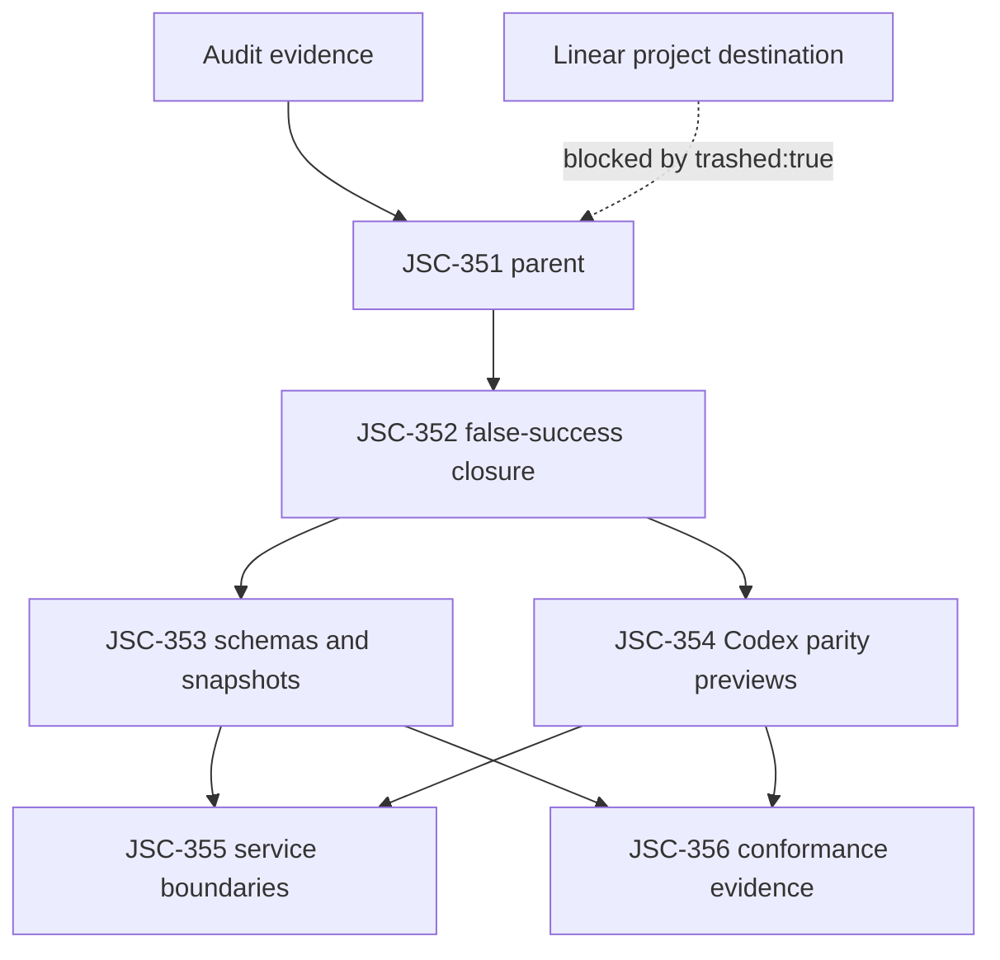

# Agent Skills Codex ABI Conformance Spec

## Command Summary

BLUF: This spec defines the behavior contract for making Agent Skills Kit prove Codex-native Skills SDK readiness through executable `ask` commands and live Linear-tracked work. It exists because the audit showed that doctor, package, proof, projection, and budget foundations are real, but success can still be reported without proving Codex loader, renderer, config, package, command-handle, and invocation truth. The decision is to treat Codex as the runtime ABI and make `ask` the conformance layer around that ABI, starting with false-success prevention before broader SDK generation or IR work. The main risk is that future agents will keep closing gaps as local warnings or planning slices unless schemas, parity previews, and validation gates make false readiness impossible. The next action is to implement JSC-352 first, then progress through JSC-353 to JSC-356 only as their dependency gates pass.

Decision Needed: approve JSC-352 as the first implementation issue and confirm whether JSC-351 through JSC-356 should be assigned to the canonical `agent-skills` project despite the live `trashed:true` signal.
Top Risks: false-success readiness claims could recur; public JSON contracts could drift without schemas or snapshots; broad SDK generation could start before Codex runtime parity is executable.
Next Action: begin JSC-352 with the focused validation gates in this spec, keeping project/cycle assignment blocked until Jamie confirms the live Linear destination.

## Purpose

This spec turns the evidence-led gap audit and the HE Linear plan into a testable behavior contract for the first Codex ABI conformance slice. It does not replace the Linear plan; it defines what the live issues must prove before implementation can be called complete.

## Problem Statement

Agent Skills Kit has the right direction for a Skills SDK, but the current executable boundary is weaker than the stated direction. Operators can see useful doctor, package, proof, runtime budget, and command-handle signals, yet the system can still report success through `.agents` readiness, advisory warnings, optional schema validation, or projection-only evidence. Jamie asked for full implementation, not smaller unproved slices reclassified as later work. The immediate problem is therefore trust: the repo needs deterministic proof that Codex itself would load, render, configure, and invoke the skill package being claimed as SDK-ready.

## User / Operator Scenarios

1. As Jamie, I want live Linear issues for the Codex ABI conformance work so that the audit findings become executable tracker state instead of another local artifact.
2. As an implementation agent, I want one parent issue and bounded child issues with validation gates so that I can work in dependency order without turning every audit observation into a separate ticket.
3. As a future reviewer, I want `ask` commands to prove Codex readiness directly so that local projection success cannot be mistaken for runtime truth.
4. As a package author, I want schema-backed package and doctor contracts so that compatibility drift is caught before a package is promoted.
5. As an operator, I want conformance evidence that can be replayed so that future agents do not rely on summaries or memory to decide whether the SDK is ready.

## Goals

- Make Codex runtime truth the binding ABI for Skills SDK readiness.
- Convert the audit into live Linear issues with bounded execution order.
- Prevent success-shaped output when Codex readiness, generated handles, schema validation, or runtime surface status are unproved.
- Add schema, compatibility, parity preview, and conformance evidence foundations before broader SDK generation.
- Preserve the rooted/latent skill tree and doctor-readiness strengths already present in the repo.

## Non-Goals

- Do not create one Linear issue per audit gap.
- Do not create or reactivate a Linear project from this spec.
- Do not start full IR/emitter or autonomous generation work before trust-boundary and compatibility gates are green.
- Do not treat project assignment as safe while Linear reports the canonical `agent-skills` project as `trashed:true`.
- Do not use local `.harness` artifacts as proof that live Linear state exists.

## Current State / Evidence

| Evidence | Current Signal | Spec Consequence |
|---|---|---|
| Gap audit | Overall maturity `C-`, Codex ABI readiness `D+` | Start with trust-boundary fixes. |
| Linear plan | One parent plus five sub-issues selected | Use JSC-351 through JSC-356 as live tracker scope. |
| Live Linear mutation | JSC-351 through JSC-356 created | Issues exist, but no project assignment. |
| Live project lookup | Canonical and duplicate `agent-skills` projects reported `trashed:true` | Project/cycle assignment remains blocked. |
| JSC-329 | Done | Existing doctor contract is a baseline, not the full ABI conformance endpoint. |
| Current `ask` parser | `proof`, `doctor`, and `package` exist; `--runtime-target`, `--codex-parity`, `load-preview`, `render-preview`, `config explain`, and `conformance run` are absent from the current parser | Treat those commands as implementation targets and block acceptance until they exist and are validated. |
| Doctor schema test | Current test returns early when `jsonschema` is unavailable | JSC-352 must make schema validation deterministic instead of dependency-optional. |

## Authority and Scope Boundary

| Field | Contract |
|---|---|
| requested_depth | Deep implementation-readiness specification for Codex ABI conformance, not a shallow feature checklist. |
| approved_execution_boundary | JSC-351 through JSC-356 may be implemented in dependency order when each child issue preserves its source requirements, validation gates, and rollback boundaries. |
| downscope_authority | Implementers may reduce blast radius inside a child issue, but may not omit required Codex proof, schema, compatibility, or conformance behavior by labeling it later work. |
| external_mutation_boundary | Linear, GitHub, CircleCI, CodeRabbit, package registries, user config, and runtime caches are external mutation surfaces; writes require explicit lane evidence and must be reported separately from local implementation. |
| freshness_required | Runtime command behavior, source references, tracker state, and validation output must be refreshed before acceptance or closeout claims. |
| human_acceptance_boundary | Jamie or the delegated spec owner decides project/cycle destination, merge authority, unresolved broad SDK architecture questions, and any compatibility-breaking public contract change. |

## Assumptions, Constraints, and Authority

| Item | Classification | Contract |
|---|---|---|
| Canonical spec source | verified | This file is the canonical HE spec for JSC-351 through JSC-356. |
| Live Linear issue existence | verified in the prior live mutation pass | Recheck live Linear state before implementation closeout because tracker state can drift. |
| Project destination | unresolved | Do not assign project or cycle until Jamie confirms the intended destination. |
| Codex source behavior | evidence-backed but version-sensitive | Parity adapters must cite the checked Codex source or fixtures used by the implementation branch; do not rely on remembered behavior. |
| Public JSON compatibility | required | Any public payload change needs a schema or compatibility snapshot before merge. |
| Decision authority | Jamie / spec owner | Broad SDK architecture, project routing, and long-lived IR/emitter decisions require explicit acceptance outside this spec. |
| Implementation authority | bounded agent work | Agents may implement child issues in dependency order, but cannot skip validation gates or recategorize required work as later scope without spec owner approval. |

## Linear Work Item Contract

| Field | Value |
|---|---|
| Linear parent issue | JSC-351 |
| Parent URL | https://linear.app/jscraik/issue/JSC-351/agent-skills-make-skills-sdk-prove-codex-abi-conformance |
| Team | JSC |
| Status | Triage |
| Priority | High |
| Mutation status | created |
| Project status | unassigned because the canonical project reported `trashed:true` |
| Required tracker behavior | Keep JSC-351 through JSC-356 aligned with this spec and do not assign project/cycle until Jamie confirms destination. |

## Linear Acceptance Traceability

| Linear issue | Acceptance IDs | Linkage |
|---|---|---|
| JSC-351 | SA-001 through SA-011 | Parent coordination issue for Codex ABI conformance. |
| JSC-352 | SA-002, SA-003, SA-004 | P0 false-success closure for proof, doctor, repo doctor, and runtime surface. |
| JSC-353 | SA-005 | Package schemas and compatibility snapshots. |
| JSC-354 | SA-006 | Codex loader, renderer, config, and invocation parity previews. |
| JSC-355 | SA-007 | Skills SDK service module extraction. |
| JSC-356 | SA-008 | Conformance workouts, evidence stream, and package verify. |
| JSC-351 through JSC-356 | SA-009 | Project/cycle assignment remains blocked until destination is confirmed. |

## Proposed Behavior

Agent Skills Kit should expose a conformance path where `ask` proves whether a skill package is SDK-ready for Codex. The path must begin with existing doctor/proof/package surfaces and progressively add Codex-specific parity previews. A readiness claim is valid only when a command or validator proves the relevant runtime behavior, schema contract, compatibility snapshot, and conformance evidence.

User-facing solution: Linear now tracks the work as JSC-351 through JSC-356. Implementation begins at JSC-352, then proceeds through schema compatibility, Codex parity previews, service extraction, and conformance evidence. Project assignment is intentionally paused until the live project-state ambiguity is resolved.

Implementation sequencing rule: a later child issue may start discovery, but it must not claim completion until its upstream trust-boundary gates are green or explicitly blocked with evidence. JSC-352 is the minimum confidence gate for any later SDK expansion.

## Requirements

### Functional Requirements

- FR-001: `skills proof` MUST support runtime-targeted proof for `codex`, `agents`, and `any` so Codex readiness cannot be hidden by another runtime.
- FR-002: `skills doctor --codex-parity` MUST require Codex-targeted proof before reporting SDK conformance.
- FR-003: Repo doctor or an equivalent required gate MUST include generated command-handle checking.
- FR-004: Runtime surface output MUST preserve machine-readable validation failures instead of converting them into success-shaped output.
- FR-005: Doctor contract tests MUST perform schema validation deterministically.
- FR-006: Skill package readiness MUST have concrete versioned schemas for package metadata and readiness output.
- FR-007: Compatibility snapshots MUST cover public JSON surfaces for doctor, package, proof, and command-handle outputs.
- FR-008: Codex loader, renderer, config, explicit invocation, and implicit invocation previews MUST exist before broad SDK readiness is claimed.
- FR-009: Skills SDK service boundaries MUST separate contracts, catalog, validation, packaging, runtime adapters, and evidence from CLI glue by the time JSC-355 is accepted; the exact module names remain fillable.
- FR-010: Conformance workouts and JSONL evidence MUST prove replayable runtime behavior before autonomous SDK generation expands.
- FR-011: Live Linear issue state MUST remain traceable to source artifacts and validation commands.
- FR-012: Each new command introduced by this spec MUST have parser coverage, implementation coverage, JSON contract coverage, and at least one failing fixture that proves the command blocks false success.
- FR-013: Any parity command that models Codex behavior MUST report the Codex source version, fixture identity, or checked local source path it used as evidence.
- FR-014: Doctor output MUST preserve next-command precedence so blocking conformance failures recommend the corrective command before generic improvement or informational commands.

### Non-Functional Requirements

- NFR-001: Validation gates MUST prefer deterministic commands, schemas, and snapshots over prompt guidance.
- NFR-002: Public JSON changes MUST be versioned or compatibility-tested.
- NFR-003: The first implementation slice MUST be small enough to validate with focused tests before broader checks.
- NFR-004: Project/cycle mutations MUST remain blocked until the live Linear project ambiguity is resolved.
- NFR-005: Closeout evidence MUST report exact commands, pass/fail state, blockers, warnings, and next action.
- NFR-006: Human-readable output MUST stay concise enough for operators, while JSON output remains complete enough for automation and regression checks.
- NFR-007: Conformance checks MUST be repeatable from a clean checkout or explicitly classify environment-dependent evidence as blocked.

## Interfaces

| Interface | Required Behavior | Owning Issue |
|---|---|---|
| `./bin/ask skills proof <target> --runtime-target codex --json --robot` | Proves Codex runtime readiness truthfully. | JSC-352 |
| `./bin/ask skills doctor <target> --codex-parity --json --robot` | Aggregates Codex parity checks and blocks on failed conformance. | JSC-352, JSC-354 |
| `./bin/ask skills package <target> --json --robot` | Emits schema-backed readiness payload. | JSC-353 |
| `./bin/ask skills load-preview --codex-parity --json --robot` | Reports what Codex would load. | JSC-354 |
| `./bin/ask skills render-preview --codex-parity --json --robot` | Reports Codex renderer budget and warnings. | JSC-354 |
| `./bin/ask skills config explain --json --robot` | Explains Codex skill config enable/disable effects. | JSC-354 |
| `./bin/ask skills inject-preview <prompt> --codex-parity --json --robot` | Reports explicit Codex skill injection predictions. | JSC-354 |
| `./bin/ask skills implicit-preview --command-json <file> --codex-parity --json --robot` | Reports implicit invocation attribution for shell commands or file reads. | JSC-354 |
| `./bin/ask skills conformance run --suite codex-parity --json --robot` | Emits replayable conformance evidence. | JSC-356 |

## Data / Domain Contract

| Contract | Required Fields | Compatibility Rule |
|---|---|---|
| `skill-package.v1` | name, description, short_description, interface, dependencies, policy, scope, plugin_id, invocation policy where applicable | Unknown fields tolerated; missing required Codex ABI fields fail strict mode. |
| `skill-package-readiness.v1` | status, blockers, warnings, schema_version, package metadata, install readiness, promotion status, validation commands | Public enum changes require snapshot update and migration note. |
| `skill-load-preview.v1` | roots, scope, path, name, plugin_id, disabled reason, parse errors, final order | Must match Codex fixture expectations. |
| `skill-render-preview.v1` | rendered skills, budget, warnings, truncation, omissions | Must mirror Codex renderer semantics. |
| `skill-invocation-preview.v1` | request text or command descriptor, selected skills, source of invocation, injection decision, blockers, warnings | Must distinguish explicit mention, picker selection, path mention, and implicit command attribution. |
| `skills-conformance-evidence.v1` | trace id, command, target, checks, outputs, pass/fail/blockers, artifact paths | Must be replayable from repo state. |
| `skill-doctor-next-command.v1` | current check, blocker class, recommended command, precedence reason, lower-priority alternatives | Blocking corrective commands must outrank generic explain, improve, or informational commands. |

## Enforcement Contract

essential_decisions:
- Codex is the runtime ABI for SDK readiness.
- JSC-352 is the first implementation issue.
- Project assignment is blocked until the Linear project-state ambiguity is resolved.
- Public contract names and schema versions must not drift silently.

fillable_gaps:
- Exact Python module names under `Infrastructure/scripts/lib/ask/services/skills/`.
- Fixture names and organization.
- Snapshot storage path, as long as compatibility tests enforce it.
- JSON field ordering, as long as machine-readable schema and compatibility are stable.

guardrails:
- Focused pytest suites for doctor, package, repo doctor, runtime, parity previews, and compatibility snapshots.
- JSON Schema validation for public payloads.
- Command-handle parity checks in repo doctor or equivalent required gate.
- Conformance evidence JSONL for replayable proof.
- BLUF and artifact-shape validators for durable HE artifacts.
- Spec identity and Linear traceability validators before this spec is used as an implementation contract.
- Source-version or fixture identity in every Codex parity payload.

refusal_triggers:
- A new public API shape without schema or compatibility decision.
- A runtime readiness claim that can pass without Codex proof.
- A broad IR/emitter implementation request before JSC-352 through JSC-354 gates are green.
- A request to attach issues to a project while live Linear still reports ambiguous trashed state.
- A package trust decision without provenance and rollback policy.

durable_memory:
- Record transferable operational lessons in `.harness/quality/steering-uptake.md` or the relevant `.harness/decisions/**` artifact when a repeated steering failure is converted into an enforcement rule.

professional_output:
- Closeout must include files changed, live Linear issue IDs, exact validation commands, pass/fail/blocked state, remaining blockers, warnings, rollback notes, and the next action.

## Proof and Runtime Boundary

| Field | Contract |
|---|---|
| proof_boundary | A passing spec, plan, or artifact-shape validator is not implementation proof; acceptance requires executable runtime behavior and focused tests for the claimed surface. |
| non_proof_sources | Summaries, memory, generated plans, review comments, docs, and projected runtime files are non-proof sources until reconciled with source, tests, commands, or live state. |
| runtime_state | Runtime state is the observed behavior of ask commands, validator output, source code, fixtures, tests, and live tracker/PR/CI/review surfaces. |
| resumption_key | A future agent resumes from the active Goal Governor task, latest receipt, implementation notes, and current live validation output. |
| runtime_invocation_receipt | Each runtime claim must identify the command or test invoked, inputs used, output status, and blocker or pass condition. |
| artifact_chain_key | Evidence flows from this spec to plan, child issue, implementation slice, validation artifact, review disposition, and delivery state. |
| persistent_artifacts | Persistent artifacts include schemas, fixtures, compatibility snapshots, conformance evidence, goal receipts, implementation notes, and validation logs retained in repo-owned paths. |
| live_state_refresh | Before acceptance, refresh live Linear, PR, CI, review, and runtime command state instead of relying on stale local artifacts. |
| session_evidence_status | Chat transcript claims are supporting context only; required acceptance evidence must be persisted or re-runnable. |

## Coding and Testing Lenses

| Lens | Contract |
|---|---|
| coding_lens | Implement narrowly in existing ask command paths first, keep public command changes additive where possible, make later service extraction follow proven seams, and preserve canonical source ownership over projections. |
| testing_lens | Test observable behavior and negative paths: Codex-targeted proof must fail closed when only .agents readiness exists, doctor parity must route to Codex proof, schemas must validate deterministically, and preview commands must identify their Codex source or fixture basis. |

## Security, Privacy, and Safety

- Do not expose secrets in issue descriptions, specs, JSONL evidence, or command outputs.
- Package verification work must treat remote sources, zip archives, symlinks, and generated artifacts as untrusted until validated.
- Runtime adapters must not execute arbitrary skill code while previewing loader/render/config behavior.
- Destructive Linear or Git operations require explicit approval.
- Loader, renderer, config, and invocation previews must be read-only analyses. They must not execute skill scripts, install packages, mutate runtime roots, or write generated projections unless a separate explicit command is invoked.
- Package verification must reject path traversal, unsafe symlink escape, digest mismatch, and untrusted source provenance before any install or promotion decision.
- Evidence files must avoid credential-bearing environment dumps and must redact access tokens, API keys, local auth cookies, and private connector payloads.

## Accessibility and Operator Ergonomics

Operator-facing command output must keep status, blockers, warnings, next command, and validation gates visible in JSON and human-readable modes. Status must not rely on color. Failure messages should name the active blocker and the next safe command.

Additional accessibility requirements:
- Human-readable output must use stable headings and plain text summaries before dense tables.
- JSON output must expose blocker classes and next commands so assistive or automation tooling does not need to parse prose.
- Any terminal color use must be redundant with text labels.
- Long evidence paths should be copyable as text and not only embedded in diagrams.

## Observability and Evidence

Every conformance command introduced by this spec must emit enough evidence to distinguish a true pass from a skipped, unavailable, or environment-blocked check.

Required evidence fields:
- trace id or run id
- command and arguments
- target skill/package
- runtime target
- Codex source or fixture identity for parity checks
- check results using `pass`, `fail`, `blocked`, or `not applicable`
- blocker classes and warning classes
- artifact paths for generated snapshots or JSONL evidence
- next safe command
- next-command precedence reason when multiple commands could be suggested

Conformance evidence must be stored under a repo-owned path chosen during JSC-356 and must be safe to reference from Linear without leaking secrets.

## Failure and Recovery

| Failure | Required Recovery |
|---|---|
| Codex runtime target missing | Report blocked Codex readiness; do not pass through `.agents` unless runtime target is `any`. |
| Generated command handles drift | Block repo doctor or classify accepted drift explicitly. |
| Schema validation dependency missing | Treat contract validation as blocked, not skipped. |
| Preview parity fixture missing | Block parity claim until fixture exists. |
| Linear project reports `trashed:true` | Keep issues unprojected and ask for destination confirmation. |
| Codex source path unavailable | Mark parity evidence blocked and do not infer runtime behavior from projection policy. |
| Public JSON snapshot mismatch | Block release or require an explicit compatibility migration decision. |
| Evidence JSONL contains sensitive data | Quarantine the artifact, redact or regenerate it, and do not attach it to Linear. |

## Rollback / Recovery

Rollback must prefer restoring truthful command behavior over preserving new surface area.

Required rollback rules:
- If `skills proof --runtime-target codex` reports false positives, revert that slice or fail closed until fixed.
- If `doctor --codex-parity` breaks non-parity doctor behavior, keep the compatibility doctor available and disable only the parity mode while preserving a blocker.
- If generated command-handle enforcement creates excessive noise, classify the drift with an explicit accepted-drift file or issue; do not silently remove the check.
- If schema or snapshot changes break downstream consumers, restore the previous schema version or add a migration note and compatibility adapter.
- If Linear project assignment is later proven unsafe, remove project/cycle assignment from JSC-351 through JSC-356 and record the tracker correction in the parent issue.

## Validation Plan

JSC-352 validation:
- `./bin/ask skills handles --check --check-command-handles --no-handles --json --robot`
- `./bin/ask skills proof context7 --runtime-target codex --json --robot`
- `./bin/ask skills doctor context7 --codex-parity --json --robot`
- `./bin/ask runtime surface --json --robot`
- `python3 -m pytest Infrastructure/tests/test_ask_skills_doctor.py Infrastructure/tests/test_ask_repo_doctor.py Infrastructure/tests/test_ask_runtime.py -q`
- focused doctor fixture proving blocker-specific next-command precedence

JSC-353 validation:
- `python3 -m pytest Infrastructure/tests/test_ask_skills_package.py Infrastructure/tests/test_ask_skills_package_contract.py Infrastructure/tests/test_command_surface_handles.py -q`
- `./bin/ask skills package context7 --json --robot`
- `./bin/ask skills doctor context7 --json --robot`

JSC-354 validation:
- `./bin/ask skills load-preview --codex-parity --json --robot`
- `./bin/ask skills render-preview --codex-parity --json --robot`
- `./bin/ask skills config explain --json --robot`
- `./bin/ask skills inject-preview 'use $context7 for docs' --codex-parity --json --robot`
- `python3 -m pytest Infrastructure/tests/test_ask_skills_codex_parity.py -q`

Artifact validation:
- `python3 Plugins/harness-engineering/scripts/check_bluf_structure.py .harness/specs/2026-05-22-jsc-351-agent-skills-codex-abi-conformance-spec.md --json`
- `python3 Plugins/harness-engineering/scripts/check_generated_artifact_shape.py .harness/specs/2026-05-22-jsc-351-agent-skills-codex-abi-conformance-spec.md --kind spec --json`
- `python3 Infrastructure/scripts/validation-and-linting/he_artifact_identity_lint.py .harness/specs/2026-05-22-jsc-351-agent-skills-codex-abi-conformance-spec.md`
- `python3 Infrastructure/scripts/validation-and-linting/he_linear_traceability_lint.py .harness/specs/2026-05-22-jsc-351-agent-skills-codex-abi-conformance-spec.md`

Current availability note: commands that this spec introduces are expected to be blocked before implementation. A closeout may count them only after the parser, command implementation, focused tests, and JSON contract evidence exist.

## Acceptance Criteria

- SA-001: JSC-351 through JSC-356 exist in live Linear, `JSC-352` through `JSC-356` remain children of `JSC-351`, and the parent issue links this spec plus the source audit.
- SA-002: JSC-352 adds runtime-targeted proof, and a focused test proves `.agents` readiness cannot satisfy `--runtime-target codex`.
- SA-003: JSC-352 makes generated command-handle parity part of a required repo doctor or equivalent gate, with a failing fixture for stale generated handles.
- SA-004: JSC-352 preserves machine-readable runtime surface failures, and a focused test proves validation failure state is not flattened into success.
- SA-005: JSC-353 adds concrete package schemas and compatibility snapshots, and tests fail when required Codex ABI fields or public enums drift.
- SA-006: JSC-354 adds Codex loader, renderer, config, explicit invocation, and implicit invocation parity previews, each with fixture evidence that cites the Codex source or fixture identity used.
- SA-007: JSC-355 extracts a narrow service module boundary without changing public JSON contracts, and boundary tests prevent command modules from owning SDK logic directly.
- SA-008: JSC-356 emits replayable conformance evidence and adds package verification that rejects unsafe archives, symlink escapes, digest mismatches, and untrusted provenance.
- SA-009: Project/cycle assignment remains absent until the Linear destination is confirmed; any later assignment is recorded on JSC-351 with the confirming evidence.
- SA-010: This spec passes HE artifact identity, Linear traceability, BLUF, and generated-artifact-shape validators before it is used for implementation closeout.
- SA-011: JSC-352 adds doctor next-command precedence coverage so blocking Codex parity, generated-handle, or schema failures recommend the corrective command before generic advice.

## Visual References / Diagrams

## Implementation Notes

- Implement JSC-352 before adding new SDK surfaces.
- Preserve public JSON fields unless a compatibility snapshot and migration note are added.
- Extract service modules only after behavior is protected by focused tests.
- Treat `skills-sdk.json` planning contract sections as evidence until validators map them to executable commands.

## Open Questions

1. Should JSC-351 through JSC-356 be assigned to the canonical `agent-skills` project despite the live `trashed:true` signal?
2. Should `Repo › agent-skills` be created as the preferred repo/location label, or should the existing legacy `agent-skills` label remain the active route for this slice?
3. Should full IR/emitter architecture get a separate ADR after JSC-352 through JSC-354 are green?
4. Which Codex source checkout or release should be treated as the parity reference for the first implementation branch?

## Decision

Proceed with the live issue set JSC-351 through JSC-356. Start implementation at JSC-352. Keep project and cycle assignment blocked until Jamie confirms the live Linear destination.

## Evidence and References

- `.harness/research/audits/2026-05-22-evidence-led-codebase-gap-audit.md`
- `.harness/linear/2026-05-22-agent-skills-codex-abi-conformance-linear-plan.md`
- `.harness/research/deep/2026-05-22-skills-sdk-oagen-analysis.md`
- Live Linear issues: JSC-351, JSC-352, JSC-353, JSC-354, JSC-355, JSC-356
- Current `Infrastructure/bin/ask` parser evidence: existing `proof`, `doctor`, `package`, and `handles` commands are present; planned parity commands and flags are absent before implementation.
- Current `Infrastructure/tests/test_ask_skills_doctor.py` evidence: schema validation returns early when `jsonschema` is unavailable, motivating JSC-352 mandatory schema validation.

## Appendix A. Harness Metadata / Traceability

| Field | Value |
|---|---|
| interactive_status | execution_selected |
| selection_evidence | User invoked `he-spec` with the audit and Linear plan and explicitly asked to make the issues live in Linear. |
| route | he-spec |
| stage | spec |
| scope | JSC-351 through JSC-356 |
| safe_to_continue | true for JSC-352 implementation; blocked for project/cycle assignment |
| blocked_reason | Project assignment blocked by live Linear `trashed:true` project signal. |
| linear_mutation_status | created |
| confidence | High for issue creation and source traceability; medium for project destination because live project state is contradictory. |

## Appendix B. Review Outcomes

The audit used agent-native, API contract, and adversarial review inputs. No additional review swarm was spawned for this spec because the selected slice and live issue topology were already defined by the approved audit and Linear plan.

## Appendix C. he-plan Handoff

Hand off JSC-352 to implementation planning or direct bounded work. The first work unit should implement runtime-targeted proof, generated command-handle enforcement, mandatory doctor schema validation, runtime-surface failure preservation, and doctor next-command precedence. The handoff must preserve the validation commands listed under JSC-352 and must not broaden into loader/render/injection parity previews until the first trust-boundary gate is green.
