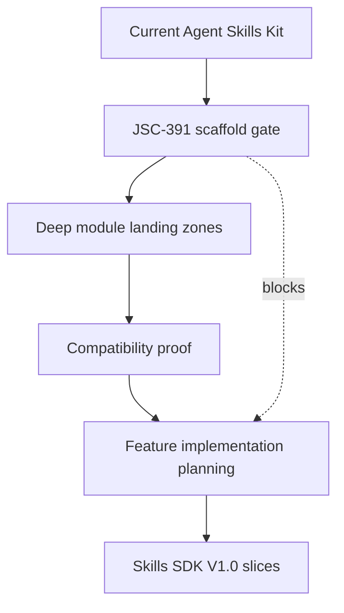

# Agent-First Skills SDK Scaffold and Deep Module Refactor Spec

## Command Summary

BLUF: This spec defines the scaffold and refactor gate that Jamie, future agents, and implementation developers need before Skills SDK features are planned. It matters because new work should land in agent-first deep modules rather than making old CLI glue heavier, so this document decides the landing zones, ownership rules, validation proof, and no-go boundaries for JSC-391. The main risk is over-migrating the repository or breaking existing `./bin/ask` behavior before V1.0 has delivered value, so the accepted slice is structural and compatibility-first. The next action is to review and accept this spec, then hand only JSC-391 to `he-plan` before any feature implementation plan begins.

Decision Needed: Accept JSC-391 as the scaffold/deep-module gate before feature implementation planning.

Top Risks: Moving too much code too early; breaking current `./bin/ask`; editing runtime projections as source; treating placeholder folders as feature readiness.

Next Action: Run HE validation, then use this spec for a JSC-391 implementation plan.

## Purpose

Prepare Agent Skills Kit for Skills SDK V1.0 feature work by creating or documenting the agent-first scaffold, deep module boundaries, path ownership rules, and compatibility proof required before implementation begins.

This spec is deliberately narrower than the V1 product spec. It does not define the full SDK lifecycle; it defines the structure that future SDK lifecycle work must land in.

## Problem Statement

The V1 product spec now requires future work to land in a scaffold with deep modules such as `manifest`, `receipts`, `risk`, `install`, `sandbox`, `refs`, and `evals`. Without a dedicated scaffold/refactor slice, agents can start implementing schemas, CLI handlers, receipts, security gates, or evals inside existing command glue. That would make the SDK harder to extract, harder to test, and harder for future agents to navigate.

The operator problem is practical: Jamie needs the project reshaped enough that all new SDK work has a natural owner, but not so much that the repo is rewritten before there is working value.

## User / Operator Scenarios

### Scenario 1: Future feature work has a real SDK landing zone

An agent plans the first `skill check` implementation.

Expected result: the plan names a deep module owner such as `manifest`, `receipts`, or `risk`; writes contract files under the accepted scaffold; and avoids expanding old CLI glue except for the smallest facade needed to preserve `./bin/ask`.

### Scenario 2: Existing repo behavior survives the scaffold

The scaffold is created without implementing new feature behavior.

Expected result: existing repo status, doctor, skill explain/prove paths, changed-file closeout, and relevant current tests still pass or report pre-existing blockers without behavior regression.

### Scenario 3: Generated projections are not edited as source

An implementation agent sees `.agents/skills/**` and `.skillsets/**`.

Expected result: the agent treats those as generated/runtime projection surfaces unless a project manifest explicitly declares otherwise, and writes scaffold source under canonical SDK/source paths only.

### Scenario 4: Deep modules stay deep

A future install-scope change touches lockfile, trust store, and preview behavior.

Expected result: the task owns `install` as the primary module and collaborates with `manifest`, `receipts`, and `sandbox` only through accepted interfaces rather than cross-importing implementation details.

### Scenario 5: Planning refuses feature work before scaffold acceptance

`he-plan` is asked to plan feature implementation before JSC-391 is accepted.

Expected result: planning blocks or scopes itself to JSC-391; it does not start feature plans for schemas, CLI commands, signing, evals, or runtime behavior.

## Goals

- G-001: Create or document SDK landing zones for future V1.0 work.
- G-002: Define deep module ownership boundaries.
- G-003: Preserve existing `./bin/ask` behavior and current runtime projection rules.
- G-004: Establish import/dependency rules so modules stay deep and small at the surface.
- G-005: Define source versus generated projection ownership for the scaffold.
- G-006: Add enough validation to prove the scaffold does not break current behavior.
- G-007: Require future feature plans to name owning deep modules, work mode, and sensor placement.
- G-008: Keep the scaffold thin so V1.0 usefulness is not delayed by a repo-wide migration.

## Non-Goals

- NG-001: Do not migrate the whole repository.
- NG-002: Do not replace `./bin/ask`.
- NG-003: Do not implement `skill check`, install, package, signing, refs ingestion, sandboxing, or eval features beyond placeholder landing zones.
- NG-004: Do not edit runtime projections as canonical source.
- NG-005: Do not create marketplace, registry, or public publishing behavior.
- NG-006: Do not require Tessl or any external confirmation tool.
- NG-007: Do not create a standalone repository yet.
- NG-008: Do not make docs/explorer output proof of runtime readiness.

## Current State / Evidence

| Source | Evidence |
| --- | --- |
| `.harness/specs/2026-06-03-skills-sdk-v1-product-spec.md` | Parent V1 product contract; requires scaffold gate through JSC-391 and acceptance IDs SA-024 to SA-029. |
| `UBIQUITOUS_LANGUAGE.md` | Defines Agent Skills Kit, `ask` CLI, Canonical Skill Source, Runtime Projection, and project-local skill terms. |
| `AGENTS.md` | Requires `./bin/ask` for repo operations and directs agents to path ownership and validation docs. |
| Linear JSC-391 | Live tracker issue for scaffold/deep-module landing zones. |
| `Docs/agents/14-path-ownership-boundaries.md` | Path ownership guidance to verify during implementation planning. |
| `Docs/agents/16-agent-operating-contract.md` | Repo command behavior and robot-mode expectations. |

Current implied structure:

```text
Agent Skills Kit
  ./bin/ask control plane
  Infrastructure scripts
  canonical skills and plugin-owned skills
  generated runtime projections
  existing validators and HE artifacts
```

Needed scaffold:

```text
Skills SDK landing zones
  deep modules
  schemas
  fixtures
  examples
  docs/canon
  docs/decisions
```

## Authority and Scope Boundary

| Field | Boundary |
| --- | --- |
| requested_depth | Full scaffold/refactor spec for JSC-391 only. |
| approved_execution_boundary | Local spec artifact creation and validation; no implementation. |
| downscope_authority | Implementation planning may adapt physical paths if it preserves logical module boundaries and explains why. |
| external_mutation_boundary | JSC-391 already exists; this spec does not require new external tracker mutation. |
| freshness_required | Refresh Linear and repo status before implementation planning or PR closeout. |
| human_acceptance_boundary | Jamie must accept scaffold scope before feature implementation planning. |

## Proposed Behavior

JSC-391 should create or document the scaffold that future Skills SDK work uses. The implementation should be structural and compatibility-first:

1. Inspect the repo and create a path-map ADR before creating files.
2. Inventory existing `Infrastructure/scripts/lib/ask/skills_sdk/**` code and classify each file as preserve, move, wrap, or defer.
3. Resolve physical path mapping for logical landing zones; after the ADR is accepted, alternative paths are forbidden for this slice unless the ADR is amended.
4. Add deep module boundaries and a README or ADR.
5. Add minimal module shells or documented placeholders.
6. Add fixtures for minimal Codex skill, invalid skill, SDK draft package, and generated-projection rejection.
7. Add tests for scaffold presence, module routing, dependency direction, and path ownership.
8. Run baseline and post-change compatibility checks proving `./bin/ask` behavior still works.

The user-facing result is not a new CLI feature. The user-facing result is confidence that future `skill check`, install, signing, sandbox, refs, and eval work will land in the right place without breaking current operations.

## Requirements

### Functional Requirements

- FR-001: The scaffold MUST define logical landing zones for SDK core, schemas, runtime, packaging, signing, evals, fixtures, examples, canon docs, and decisions.
- FR-002: The scaffold MUST define deep modules for `manifest`, `receipts`, `risk`, `install`, `sandbox`, `refs`, and `evals`.
- FR-003: The scaffold MUST preserve `./bin/ask` as the repo control plane.
- FR-004: The scaffold MUST distinguish canonical source from generated runtime projections.
- FR-005: Future feature issues MUST name one owning deep module and any collaborator modules.
- FR-006: CLI handlers MAY orchestrate modules but MUST NOT own SDK business logic.
- FR-007: The scaffold MUST include or plan minimal fixtures for Codex `SKILL.md` shape and SDK draft package shape.
- FR-008: The scaffold MUST include validation that proves behavior compatibility or reports pre-existing blockers.
- FR-009: The scaffold MUST block feature implementation planning until accepted.

### Non-Functional Requirements

- NFR-001: The scaffold MUST avoid broad repo migration.
- NFR-002: The scaffold MUST keep module surfaces small and internals hidden.
- NFR-003: The scaffold SHOULD use existing repo patterns before introducing new framework structure.
- NFR-004: The scaffold MUST be understandable to future agents from file layout, README/ADR, and tests.
- NFR-005: The scaffold MUST not slow draft/local skill usefulness.

## Interfaces

### Logical Landing Zones

```text
sdk/
schemas/
runtime/
packaging/
signing/
evals/
fixtures/
examples/
docs/canon/
docs/decisions/
```

### Candidate Physical Mapping

| Logical zone | Candidate path | Purpose |
| --- | --- | --- |
| SDK core | `Infrastructure/scripts/lib/ask/skills_sdk/` | Extractable service layer while `./bin/ask` remains the control plane. |
| Schemas | `schemas/skills-sdk/` or `Infrastructure/schemas/skills-sdk/` | Public JSON schemas for manifest, receipts, lockfile, eval datasets, and package metadata. |
| Runtime | `Infrastructure/scripts/lib/ask/skills_sdk/runtime/` | Runtime/sandbox interfaces, not full execution platform. |
| Packaging | `Infrastructure/scripts/lib/ask/skills_sdk/packaging/` | Package assembly interfaces and preview-only contracts. |
| Signing | `Infrastructure/scripts/lib/ask/skills_sdk/signing/` | Signature/provenance adapter interfaces. |
| Evals | `Infrastructure/scripts/lib/ask/skills_sdk/evals/` | Eval dataset and result contract helpers. |
| Fixtures | `Infrastructure/tests/fixtures/skills_sdk/` | Valid, invalid, and edge-case skill package fixtures. |
| Examples | `examples/skills-sdk/` | Minimal/source-shape examples for docs and tests. |
| Canon docs | `Docs/canon/skills-sdk/` or `docs/canon/skills-sdk/` | Architecture, lifecycle, security model, glossary. |
| Decisions | `Docs/decisions/skills-sdk/` or `docs/decisions/skills-sdk/` | ADRs for package format and scaffold choices. |

Implementation planning may choose different physical paths only with a recorded decision and compatibility proof.

### Path Selection Contract

The first JSC-391 implementation step MUST create or update a path-map ADR before creating scaffold files. The ADR MUST record:

- the selected physical path for every logical landing zone;
- the repo evidence used to choose it;
- any rejected alternative and why it was rejected;
- the compatibility checks that protect existing `./bin/ask` behavior;
- the path ownership rule for generated projections.

Default preference is existing repo casing and conventions: `Docs/canon/skills-sdk/` and `Docs/decisions/skills-sdk/` should be selected unless repo inspection proves a stronger reason to introduce lowercase `docs/`. Once the ADR is accepted, implementation MUST NOT write to the rejected alternative paths in this slice.

### Existing Skills SDK Inventory Contract

The repo already contains `Infrastructure/scripts/lib/ask/skills_sdk/`. Before adding new module shells or moving code, the implementation plan MUST inventory every existing file under that path and classify it:

| Classification | Meaning |
| --- | --- |
| preserve | Existing behavior stays in place and is covered by compatibility checks. |
| move | The file is moved to a selected module path with import compatibility preserved. |
| wrap | New deep-module interface delegates to existing implementation without duplicating it. |
| defer | Existing file remains untouched; future migration is documented. |

Known files at spec time:

```text
Infrastructure/scripts/lib/ask/skills_sdk/__init__.py
Infrastructure/scripts/lib/ask/skills_sdk/conformance.py
Infrastructure/scripts/lib/ask/skills_sdk/contracts.py
Infrastructure/scripts/lib/ask/skills_sdk/package_contracts.py
Infrastructure/scripts/lib/ask/skills_sdk/package_verify.py
Infrastructure/scripts/lib/ask/skills_sdk/runtime_adapters.py
```

New module shells MUST NOT duplicate an equivalent existing module. If an equivalent exists, JSC-391 should wrap or document it rather than introduce parallel behavior.

## Data / Domain Contract

### Deep Module Contract

| Module | Responsibility | Must expose | Must hide |
| --- | --- | --- | --- |
| `manifest` | Skill identity, `SKILL.md` source shape, package manifest validation. | parse/validate functions, normalized identity, source-shape diagnostics. | file-walk details, host-specific metadata internals. |
| `receipts` | Evidence schema, proof metadata, public/private projections. | receipt builders, status/reason enums, redaction helpers. | raw logs, secret-bearing evidence. |
| `risk` | Risk tier, SemVer change class, sensor placement, gate selection. | classifier, gate plan, review effort recommendation. | scanner/runtime implementation details. |
| `install` | Scope selection, install preview, lockfile, trust store, rollback, quarantine. | resolver, preview model, lock/trust schema helpers. | direct filesystem writes outside accepted write API. |
| `sandbox` | Execution isolation adapter contract and receipts. | sandbox profile, adapter probe, receipt shape. | platform-specific command construction details. |
| `refs` | Reference ingestion, trust boundary, freshness, promotion authority. | source manifest, promotion receipt, trust diagnostics. | raw untrusted content as instructions. |
| `evals` | Internal datasets, rubrics, A/B comparison, eval result receipts. | dataset schema, result schema, threshold helpers. | judge implementation internals. |

### Dependency Direction Contract

| Layer | May depend on | Must not depend on |
| --- | --- | --- |
| `manifest` | repo-neutral parsing helpers | install, sandbox, signing, eval runner internals |
| `receipts` | manifest identifiers and redaction helpers | raw logs, install writes, scanner implementations |
| `risk` | manifest and receipts contracts | install, sandbox, refs, eval implementation internals |
| `install` | manifest, receipts, risk, sandbox public adapter contract | refs/evals internals, direct global writes outside accepted API |
| `sandbox` | manifest identity, receipts | install internals, eval internals |
| `refs` | manifest, receipts, risk | sandbox command construction, eval judge internals |
| `evals` | manifest, receipts, risk, sandbox public adapter contract | install internals, signing internals |

Implementation MUST add a lightweight dependency rule file or test that catches direct imports across forbidden internals.

### Module Routing Contract

| Task surface | Owning module | Collaborators | Forbidden ownership |
| --- | --- | --- | --- |
| `SKILL.md` shape, frontmatter, description quality | `manifest` | `risk`, `receipts` | CLI handler, install |
| Receipt creation, redaction, proof summaries | `receipts` | all modules by public builder API | raw scanner output in docs only |
| Change class, risk tier, sensor plan | `risk` | `manifest`, `receipts` | install/sandbox hardcoding gate choices |
| Install scope, preview, lockfile, trust store, rollback, quarantine | `install` | `manifest`, `risk`, `sandbox`, `receipts` | direct writes from CLI handlers |
| macOS/native sandbox profile and A/B isolation adapter | `sandbox` | `risk`, `receipts`, `evals` | install owning command construction |
| References, runbooks, context ingestion, freshness, trust boundary | `refs` | `manifest`, `risk`, `receipts`, `evals` | raw reference content as instructions |
| Internal datasets, rubrics, A/B comparison, LLM-judge receipt | `evals` | `manifest`, `risk`, `sandbox`, `receipts`, `refs` | Tessl/external confirmation as required SDK gate |

Future feature plans MUST cite this routing table and name one primary owner.

### Path Ownership Contract

| Path class | Ownership rule |
| --- | --- |
| `Skills/**/SKILL.md` | Canonical skill source when under existing repo conventions. |
| `Plugins/**/skills/**/SKILL.md` | Plugin-owned canonical skill source. |
| `.agents/skills/**` | Runtime projection/generated command-handle surface in this repo unless explicitly declared otherwise in another owner repo. |
| `~/.agents/skills` and `~/.codex/skills` | User runtime links/projections, not scaffold source. |
| `Infrastructure/scripts/lib/ask/**` | Current control-plane service implementation area. |
| `schemas/**`, `fixtures/**`, `examples/**`, `Docs/**` | Candidate scaffold contract areas when accepted by plan. |

Path resolver semantics:

- Allowed canonical source paths MUST be selected in the path-map ADR.
- Denied projection paths MUST include `.agents/skills/**`, `.skillsets/**`, `~/.agents/skills/**`, and `~/.codex/skills/**` unless a separate owner manifest explicitly declares that repository as the source owner.
- Ambiguous paths require an owner manifest or path ownership document before writes.
- In this repository, `.agents/skills/**` is projection/runtime surface by default; scaffold tests MUST assert this classification.

## Enforcement Contract

### essential_decisions

- JSC-391 is a scaffold/refactor gate, not feature implementation.
- `./bin/ask` remains the repo control plane.
- Runtime projections are not canonical scaffold source.
- Every future feature issue names an owning deep module.
- Deep modules expose small contracts and hide implementation detail.

### fillable_gaps

- Exact physical path mapping after repo inspection and path-map ADR.
- README versus ADR format for module boundary documentation.
- Test filenames and fixture filenames.
- Whether placeholder modules are empty packages or documented landing-zone directories.

### guardrails

- Path ownership tests or docs must prevent edits to runtime projections as source.
- Compatibility checks must run before scaffold closeout.
- Module routing must be documented before feature planning.
- Schema/fixture placeholders must parse.
- Allowed placeholder content is limited to README/ADR text, empty package initialization, schema stubs, fixture examples, and tests proving ownership. It does not include new command behavior.

### refusal_triggers

- A plan starts feature implementation before scaffold acceptance.
- A plan replaces `./bin/ask`.
- A plan migrates the whole repository.
- A plan edits `.agents/skills/**` or generated command handles as source.
- A plan introduces marketplace, registry, or standalone extraction behavior.
- A plan adds signing, sandbox execution, eval execution, install writes, registry publish, global skill writes, or new user-facing CLI behavior in this slice.

### durable_memory

- Accepted module boundaries should be recorded in `Docs/canon/skills-sdk/`, an ADR, or the chosen repo-native equivalent.
- Any physical path mapping that differs from this spec must be documented and linked from JSC-391.

### professional_output

- Closeout must report files changed, module boundaries created, commands run, compatibility pass/fail, blockers, and next action.
- Closeout MUST include a structured receipt or closeout JSON with changed paths, validation commands, pass/fail state, module map, baseline/post-change comparison, deferred feature work, and regression classification.

## Proof and Runtime Boundary

| Field | Contract |
| --- | --- |
| proof_boundary | Completion can be proven only by created files, tests, command output, and updated traceability. |
| non_proof_sources | The visual pipeline, chat discussion, and subagent findings are evidence context, not proof of scaffold implementation. |
| runtime_state | Spec artifact only; scaffold not implemented. |
| resumption_key | `.harness/specs/2026-06-03-jsc-391-agent-first-skills-sdk-scaffold-refactor-spec.md`; Linear JSC-391. |
| runtime_invocation_receipt | blocked: no runtime implementation in this spec. |
| artifact_chain_key | skills-sdk-scaffold-refactor |
| persistent_artifacts | This spec and Linear JSC-391. |
| live_state_refresh | required before implementation planning and before PR closeout. |
| session_evidence_status | current local spec evidence plus live JSC-391 state observed in this session. |

## Coding and Testing Lenses

coding_lens:

- Preserve `./bin/ask`.
- Keep scaffold structural.
- Avoid generated projection edits.
- Prefer existing `Infrastructure/scripts/lib/ask/**` patterns where compatible.
- Make modules deep: small public contracts, hidden internals.

testing_lens:

- Test behavior preservation first.
- Test scaffold presence second.
- Test path ownership and module routing because those are the core regression risks.
- Treat missing future feature implementations as expected, not failing.
- Record pre-existing blockers separately from scaffold regressions.

## Security, Privacy, and Safety

- SEC-001: Scaffold work MUST NOT weaken existing sandbox, approval, or command safety behavior.
- SEC-002: Scaffold work MUST NOT introduce new external network calls or secret access.
- SEC-003: Scaffold work MUST NOT write to user/global skill locations.
- SEC-004: Generated projections MUST NOT be edited as canonical source.
- SEC-005: Any future signing, sandbox, or trust-store module must remain placeholder/documentation only in this slice.

## Failure and Recovery

| Failure | Required recovery |
| --- | --- |
| Scaffold path conflicts with existing owner boundary | Stop, document conflict, choose repo-native mapping in plan. |
| Existing `./bin/ask` behavior changes | Revert or isolate the scaffold change before closeout. |
| Generated projection touched as source | Stop and move the change to canonical source or docs. |
| Feature implementation begins | Split it out and defer until scaffold acceptance. |
| Validation command blocked | Report blocker, command, reason, and smallest next recovery step. |

## Validation Plan

The JSC-391 implementation plan MUST include the validation floor below. A required check may be skipped only when blocked, and the blocker MUST include the command, observed result, reason, and smallest recovery step.

- VP-001: Baseline compatibility receipt is captured before scaffold edits and post-change compatibility receipt is captured after edits.
- VP-002: Existing relevant unit tests for current skill SDK/artifact behavior still pass.
- VP-003: New scaffold structure test verifies expected landing zones or documented mappings exist.
- VP-004: New module routing test verifies known task surfaces map to owning modules.
- VP-005: New path ownership test verifies generated projection paths are not treated as scaffold source.
- VP-006: Schema placeholder tests verify files are parseable JSON/YAML/Markdown as appropriate.
- VP-007: Fixture tests cover valid minimal Codex `SKILL.md`, invalid missing-frontmatter skill, valid SDK draft package, and generated-projection rejection.
- VP-008: Closeout reports changed files, commands, pass/fail state, blockers, module map, deferred work, and regression classification.
- VP-009: Feature-leak negative checks prove this slice did not add new user-facing command behavior, signing execution, sandbox execution, eval execution, registry/publish behavior, or writes to global/project skill install targets.
- VP-010: Dependency direction test or lint proves modules consume public contracts rather than forbidden internals.
- VP-011: `AGENTS.md` or repo path ownership docs are updated, or the closeout links to the existing authoritative pointer that makes the new scaffold discoverable.

Required compatibility command matrix:

| Command | Expected proof |
| --- | --- |
| `python3 bin/ask repo status --json` | Repo wrapper remains importable and returns structured status. |
| `./bin/ask repo doctor --json --robot` | Robot-mode repo health still works or reports pre-existing blockers. |
| `./bin/ask skills list --json --robot` | Existing skill discovery remains callable. |
| `./bin/ask skills explain <existing-skill-handle> --json --robot` | Existing skill explanation path is preserved. |
| `./bin/ask skills prove <existing-skill-handle> --json --robot` | Existing skill proof path is preserved. |
| `./bin/ask repo closeout --changed --json --robot` | Changed-file closeout remains callable. |

Implementation planning MUST discover the exact `<existing-skill-handle>` and existing unit test set before edits. A failure can be classified as pre-existing only when it appears in both baseline and post-change receipts with equivalent failure shape.

Minimum fixture set:

| Fixture | Purpose |
| --- | --- |
| valid minimal Codex `SKILL.md` | Proves required frontmatter and concise body shape. |
| invalid missing-frontmatter skill | Proves validators fail closed. |
| valid SDK draft package | Proves source package shape can be parsed. |
| generated-projection path fixture | Proves projection paths are rejected as scaffold source. |

Spec validation commands:

```bash
python3 Plugins/harness-engineering/scripts/check_bluf_structure.py .harness/specs/2026-06-03-jsc-391-agent-first-skills-sdk-scaffold-refactor-spec.md --json
python3 Plugins/harness-engineering/scripts/check_generated_artifact_shape.py .harness/specs/2026-06-03-jsc-391-agent-first-skills-sdk-scaffold-refactor-spec.md --kind spec --json
python3 Infrastructure/scripts/validation-and-linting/he_artifact_identity_lint.py .harness/specs/2026-06-03-jsc-391-agent-first-skills-sdk-scaffold-refactor-spec.md
python3 Infrastructure/scripts/validation-and-linting/he_linear_traceability_lint.py .harness/specs/2026-06-03-jsc-391-agent-first-skills-sdk-scaffold-refactor-spec.md
```

## Acceptance Criteria

### Plan Acceptance

- SA-001: The scaffold spec is linked to JSC-391 and the V1 product spec.
- SA-002: The implementation plan creates a path-map ADR before scaffold files are created.
- SA-003: Deep modules are accepted with responsibility, exposed interface, and hidden complexity boundaries.
- SA-004: Future issues must name an owning deep module and collaborator modules when needed.
- SA-005: Existing `Infrastructure/scripts/lib/ask/skills_sdk/**` files are inventoried and classified as preserve, move, wrap, or defer before new module shells are added.
- SA-006: Implementation planning discovers the exact compatibility command set, existing skill handle, and relevant existing tests before edits.

### Implementation Acceptance

- SA-007: `./bin/ask` remains the repo control plane after scaffold implementation.
- SA-008: Runtime projections and generated command handles are not edited as canonical source.
- SA-009: The scaffold implementation avoids broad repo migration.
- SA-010: Minimal fixtures exist for valid Codex skill, invalid missing-frontmatter skill, valid SDK draft package, and generated-projection rejection.
- SA-011: Module routing and dependency direction are represented in docs, tests, or lintable rules.
- SA-012: No marketplace, registry, Tessl-required, standalone-repo, signing execution, sandbox execution, eval execution, install write, or new user-facing CLI behavior is introduced.

### Closeout Acceptance

- SA-013: Scaffold validation proves existing behavior is preserved or reports pre-existing blockers from baseline and post-change receipts.
- SA-014: Feature implementation planning remains blocked until JSC-391 scaffold acceptance.
- SA-015: The implementation closeout reports module ownership, work mode, sensor placement, and receipt/proof status for scaffold tasks.
- SA-016: The closeout includes a structured receipt or closeout JSON with changed paths, validation commands, pass/fail state, module map, deferred feature work, and regression classification.
- SA-017: `AGENTS.md` or repo path ownership docs are updated, or the closeout links to the existing authoritative pointer that makes the new scaffold discoverable.

## Visual References / Diagrams



## Evidence and References

- `.harness/specs/2026-06-03-skills-sdk-v1-product-spec.md`
- `UBIQUITOUS_LANGUAGE.md`
- `AGENTS.md`
- `Docs/agents/14-path-ownership-boundaries.md`
- `Docs/agents/16-agent-operating-contract.md`
- Linear JSC-391

## Linear Work Item Contract

| Field | Value |
| --- | --- |
| Primary issue | JSC-391 |
| URL | https://linear.app/jscraik/issue/JSC-391/spec-agent-first-skills-sdk-scaffold-and-deep-module-landing-zones |
| Project | Skills SDK Platformization |
| Team | Jscraik |
| Status | Todo |
| Priority | High |
| Mutation status | not_needed |
| Related issues | JSC-375, JSC-376, JSC-378, JSC-390 |
| Contract | JSC-391 owns scaffold/deep-module landing zones before feature implementation planning. |

## Linear Acceptance Traceability

| Linear issue | Acceptance IDs |
| --- | --- |
| JSC-391 | SA-001, SA-002, SA-003, SA-004, SA-005, SA-006, SA-007, SA-008, SA-009, SA-010, SA-011, SA-012, SA-013, SA-014, SA-015, SA-016, SA-017 |
| JSC-375 | SA-007, SA-008, SA-013 |
| JSC-376 | SA-007, SA-014 |
| JSC-378 | SA-002, SA-003, SA-004, SA-011 |
| JSC-390 | SA-001 |

## Open Questions

| ID | Question | Owner | Required evidence | Blocking status |
| --- | --- | --- | --- | --- |
| OQ-001 | Should public schemas live under repo-root `schemas/` or `Infrastructure/schemas/` for this repository? | he-plan repo inspection | Path-map ADR citing existing schema conventions and import/test impact. | blocks_implementation_plan |
| OQ-002 | Should docs use `Docs/canon/skills-sdk/` or lowercase `docs/canon/skills-sdk/`? | he-plan repo inspection | Path-map ADR citing current docs casing; default to `Docs/` unless evidence says otherwise. | blocks_implementation_plan |
| OQ-003 | Should the existing `Infrastructure/scripts/lib/ask/skills_sdk/` area become the initial SDK core root? | he-plan repo inspection | Existing-file inventory with preserve/move/wrap/defer classification. | blocks_implementation_plan |
| OQ-004 | Which existing tests are the minimal compatibility proof for this scaffold slice? | he-plan validation discovery | Baseline command matrix plus exact test names and selected existing skill handle. | blocks_plan_validation |

## Decision

Proceed with JSC-391 as a scaffold/refactor spec before feature implementation planning. The scaffold should create or document the agent-first Skills SDK shape, define deep module boundaries, preserve `./bin/ask`, and prove behavior compatibility without implementing the broader V1 product features.

## Handoff to he-plan

`he-plan` should plan JSC-391 only. It should not plan `skill check`, install, signing, sandbox, refs, evals, or docs/explorer feature work until the scaffold implementation is accepted.

Plan should begin with:

1. Capture baseline compatibility receipts with the required command matrix.
2. Inspect repo conventions and create the path-map ADR.
3. Inventory `Infrastructure/scripts/lib/ask/skills_sdk/**` and classify each existing file as preserve, move, wrap, or defer.
4. Define deep module README/ADR boundaries and dependency direction.
5. Add minimal importable module shells or documented placeholders without duplicating existing modules.
6. Add minimal fixtures for valid Codex skill, invalid missing-frontmatter skill, SDK draft package, and generated-projection rejection.
7. Add scaffold/path ownership/module routing/dependency direction tests.
8. Run post-change compatibility checks and classify baseline versus scaffold regressions.
9. Update JSC-391 and closeout evidence with a structured receipt.

No-Fog Gate:

- Do not migrate the whole repo.
- Do not replace `./bin/ask`.
- Do not edit runtime projections as source.
- Do not implement V1 features inside the scaffold slice.
- Do not add new user-facing CLI behavior, signing execution, sandbox execution, eval execution, install writes, registry/publish behavior, or global/project skill writes.
- Do not start feature plans until JSC-391 acceptance is proven.

## Appendix A. Harness Metadata / Traceability

interactive_status: not_requested

selection_evidence:

- User asked to proceed with a spec for modularisation and refactoring of the scaffold into the new SDK format.
- JSC-391 exists and owns the scaffold/deep-module gate.
- The V1 product spec explicitly blocks feature implementation planning until the scaffold gate is accepted.

route: he-spec

stage: spec

scope:

- In scope: scaffold/refactor contract for JSC-391.
- Out of scope: implementation, full SDK feature work, registry, marketplace, standalone extraction.

traceability:

- Primary local artifact: `.harness/specs/2026-06-03-skills-sdk-v1-product-spec.md`.
- Primary tracker artifact: JSC-391.

validation:

- HE BLUF and artifact-shape checks required.
- Artifact identity and Linear traceability lint required when available.

safe_to_continue: true

blocked_reason: not_applicable

linear_mutation_status: not_needed

linear_action_required: Review and accept whether JSC-391 should proceed to `he-plan`.

spec_path: `.harness/specs/2026-06-03-jsc-391-agent-first-skills-sdk-scaffold-refactor-spec.md`

acceptance_ids:

- SA-001
- SA-002
- SA-003
- SA-004
- SA-005
- SA-006
- SA-007
- SA-008
- SA-009
- SA-010
- SA-011
- SA-012
- SA-013
- SA-014
- SA-015
- SA-016
- SA-017

authority_scope_boundary:

- This spec does not authorize implementation.

proof_runtime_boundary:

- This spec proves only that the scaffold/refactor contract has been drafted and validated structurally.

coding_lens:

- Preserve `./bin/ask`.
- Keep scaffold structural.
- Avoid generated projection edits.

testing_lens:

- Start with behavior compatibility, scaffold presence, path ownership, and module routing tests.

git_staging_status: unstaged

staged_paths: []

handoff:

- After review, hand off to `he-plan` for JSC-391 scaffold implementation planning.

confidence:

- high for scope because JSC-391 and the V1 product spec both name the scaffold gate.
- medium for physical path mapping because implementation planning must verify repo-native ownership boundaries.

## Appendix B. Review Outcomes

Review status: adversarial review incorporated; HE validation passing.

Adversarial review result:

- Architecture/path ownership reviewer completed and identified implementation risks around unresolved physical paths, weak `./bin/ask` compatibility proof, existing `skills_sdk` duplication risk, placeholder feature leakage, projection ownership, dependency direction, module routing, baseline receipts, docs casing, and agent discoverability.
- Testing/validation reviewer completed and identified implementation risks around permissive validation floors, weak compatibility command matrix, unresolved path mapping, shallow fixtures, feature-leak prevention, dependency rule testing, path allowlist/denylist semantics, pre-existing blocker masking, acceptance grouping, open-question ownership, and structured closeout receipts.
- Agent-native workflow reviewer did not return a final payload before timeout; no additional findings were incorporated from that lane.

Incorporated changes:

- Added mandatory path-map ADR before scaffold file creation.
- Added existing `Infrastructure/scripts/lib/ask/skills_sdk/**` inventory and preserve/move/wrap/defer classification.
- Added dependency direction, module routing, and path resolver contracts.
- Replaced permissive validation language with a required validation floor, compatibility command matrix, fixture minimums, baseline/post-change receipts, and feature-leak negative checks.
- Grouped acceptance into plan, implementation, and closeout phases and expanded traceability to SA-017.
- Assigned open-question owners and required evidence.

Validation commands:

```bash
python3 Plugins/harness-engineering/scripts/check_bluf_structure.py .harness/specs/2026-06-03-jsc-391-agent-first-skills-sdk-scaffold-refactor-spec.md --json
python3 Plugins/harness-engineering/scripts/check_generated_artifact_shape.py .harness/specs/2026-06-03-jsc-391-agent-first-skills-sdk-scaffold-refactor-spec.md --kind spec --json
python3 Infrastructure/scripts/validation-and-linting/he_artifact_identity_lint.py .harness/specs/2026-06-03-jsc-391-agent-first-skills-sdk-scaffold-refactor-spec.md
python3 Infrastructure/scripts/validation-and-linting/he_linear_traceability_lint.py .harness/specs/2026-06-03-jsc-391-agent-first-skills-sdk-scaffold-refactor-spec.md
```

Latest observed result:

```text
check_bluf_structure.py: pass
check_generated_artifact_shape.py: pass
he_artifact_identity_lint.py: pass
he_linear_traceability_lint.py: pass
```
