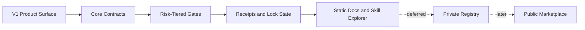
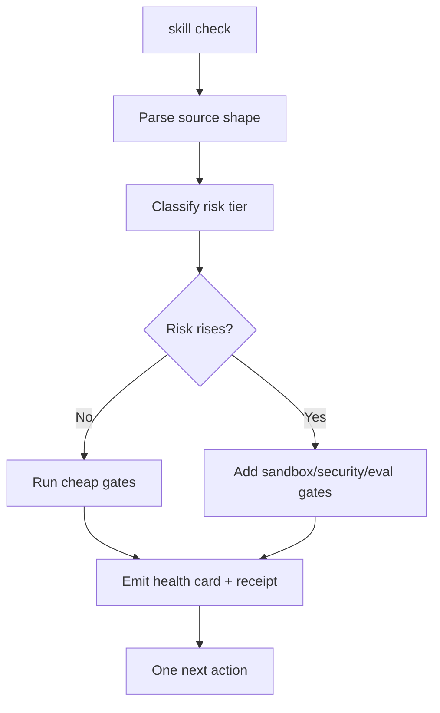

# Skills SDK V1 Product Spec

## Command Summary

BLUF: This spec defines the smallest useful Skills SDK V1 product contract so Jamie can move from a strong platform vision into a buildable, agent-native implementation without accidentally creating a marketplace, governance platform, or dashboard before the core contracts work. It covers the V1 command surface, package identity, manifests, install scopes, risk tiers, receipts, permissions, refs ingestion, internal evals, sandbox/security gates, static docs and Skill Explorer, and the explicit non-goals that keep adoption fast. The decision is to build the Skills SDK as a thin CLI and contract layer first, backed by strong guardrails and durable receipts, while deferring full registry, marketplace, broad governance, fancy HITL UI, and required third-party confirmation. The JSC-391 scaffold gate is now accepted through PR #221, so the next action is to hand this spec to `he-plan` for a bounded V1.0 implementation plan that starts with schema, receipt, command, install-scope, and risk-tier contracts.

Decision Needed: Confirm the V1.0 planning defaults that remain outside the completed JSC-391 scaffold gate. The product spec is accepted as "Skills SDK V1 Product Spec", the extracted CLI name is `skills-sdk`, and JSC-391 scaffold acceptance is current local repo evidence.

Top Risks: V1 can bloat into a public registry, docs platform, plugin marketplace, and eval platform at once; permissions and receipts can stay vague; install scope and trust identity can drift; knowledge refs can become untrusted context; static docs and Skill Explorer can be mistaken for marketplace readiness.

Next Action: Produce the V1.0 HE plan from this spec, carrying unresolved implementation defaults as explicit plan-time decisions instead of restarting the scaffold gate.

## Enhancement Summary

**Deepened on:** 2026-06-03
**Mode:** targeted-confidence
**Key areas improved:** config boundaries, domain contracts, exit codes, data retention, adapter states, validation readiness

- Split the full V1 contract from the first V1.0 build slice so `he-plan` starts with `skill check`, manifest schema, core receipt, risk classifier, and install preview stub instead of a platform rewrite.
- Added implementation-blocking contract detail for command exit codes, adapter detection states, install-scope targets, source-shape tiers, config security precedence, and data-retention/disposal so `he-plan` does not have to invent operational semantics.
- Tightened the V1 domain contract around identity, manifest, permission grant states, lockfile/trust-store integrity, receipt/evidence publication boundaries, sandbox adapter requirements, refs-as-data, and eval confidence while keeping marketplace and full registry work out of scope.
- Added acceptance and validation coverage for data retention, adapter detection, deterministic exit-code behavior, and the V1.0 build-slice boundary without renumbering existing `SA-*` IDs.

## Purpose

The purpose of Skills SDK V1 is to let humans and agents create, check, evaluate, package, and install skills as software packages without making ordinary skill authoring slow or ceremonial.

V1 exists to prove the core product doctrine:

```text
Thin surface. Strong guardrails. Durable memory. Professional output.
```

V1 also needs a strict product-boundary contract:

```text
agent-skills = bootstrap foundry, dogfood repo, source packages, fixtures, and governance memory.
Skills SDK = professional lifecycle contract for shaping, guarding, proving, packaging, and handing off skills.
Tessl = distribution and external proof surface, separated into private, eval, and public lanes.
Local runtime = installed behavior truth, observed after package and trust boundaries pass.
```

The canonical product pipeline is:

```text
Foundry -> SDK Lifecycle -> Guardrails -> Evals/Proof -> Tessl Distribution -> Local Runtime Truth
```

The canonical feedback loops are `Author loop`, `Proof loop`, `Release loop`, and `Runtime loop`.

The SDK MUST treat skills as secure, signed, permissioned, sandboxed, evaluatable software packages when risk requires it. The SDK MUST also preserve the low-friction usefulness of skills by keeping draft and local workflows light.

## Tessl Workspace Topology Direction

The desired Tessl setup is a lifecycle and authority model, not a domain-category model. The SDK should support three Tessl workspace lanes:

- `eval`: private workspace lane for project-linked eval runs, review runs, scenario quality, and release-decision evidence.
- `private_skills`: private workspace lane for internal skills that should be searchable, installable, and reviewable without being public distribution truth.
- `public_published`: public workspace lane for skills that have passed promotion, policy, review, and publish authority.

Skill domains such as frontend, backend, engineering, legal, security, marketing, database, and agent-ops are category facets inside those workspaces. They should not become workspaces unless a separate governance boundary requires different membership, settings, or source authority.

The migration direction is to remove GitHub as the distribution surface for skills. GitHub can remain source, review, and provenance during the transition, but Tessl workspace/package receipts should become the install, search, eval, review, inventory, and publish truth. Future registry intake receipts MUST separate GitHub source provenance from Tessl distribution truth and record workspace lane, workspace name, package identity, category facets, project linkage, eval/review evidence, inventory coverage, member authority, and workspace policy.

## Problem Statement

The project has converged on a strong architecture: skills are not just `SKILL.md` files. A useful skill package can include instructions, references, runbooks, scripts, assets, permissions, state, evals, evidence, provenance, signatures, and runtime boundaries.

The problem is that this vision can sprawl into a platform before the V1 product works. Current planning already includes authoring, security, runtime, registry, package management, eval ops, governance, knowledge engineering, plugin factory, HITL visibility, docs, and Skill Explorer concepts. Those concepts are useful, but they must be staged.

V1 needs a narrow, testable product contract:

```text
skill init
skill check
skill refs ingest
skill eval
skill package
skill install --scope project|workspace|global --preview
```

Everything else should support that path or remain deferred.

## User / Operator Scenarios

### Scenario 1: Author creates a small local skill

Jamie runs `skill init`, chooses a minimal template, edits `SKILL.md`, and runs `skill check`.

Expected result: the SDK validates the source shape, explains the current risk tier, emits a check receipt, and avoids heavy signing, SBOM, Tessl, or marketplace gates.

### Scenario 2: Author adds references and runbooks

Jamie adds PDFs, Markdown, screenshots, transcripts, and docs to support a skill whose `SKILL.md` must stay thin.

Expected result: `skill refs ingest` extracts deterministic source material, records provenance, screens prompt injection and untrusted content, and promotes only curated references into the package.

### Scenario 3: Skill becomes scripted

A skill gains executable scripts using shell wrappers, `uv`, Python modules, `jq`, JSON, YAML, and Markdown.

Expected result: `skill check` raises the risk tier, requires env allowlists, secret scans, parser-first transforms, sandbox dry runs, and runtime receipts before execution or sharing.

### Scenario 4: Team installs a skill into a project

A user installs a skill into a repo-level `.codex/skills` scope rather than global `~/.codex` or `~/.agents`.

Expected result: `skill install --scope project --preview` shows target paths, source digest, permissions, conflicts, trust state, rollback path, and lockfile changes before writing.

### Scenario 5: A skill update changes behavior

A skill changes from version N to version N+1.

Expected result: the SDK classifies the change as Patch, Minor, or Major using SemVer semantics, maps that classification to eval/security/signing gates, and records migration, rollback, and compatibility evidence.

### Scenario 6: External skill is installed

A user wants to install a skill from outside the project.

Expected result: the SDK stages the skill in quarantine/sandbox first, checks signatures and provenance where available, scans secrets/prompt injection/toxic flows, evaluates permissions, and blocks invocation until trust gates pass.

### Scenario 7: Docs and Skill Explorer demonstrate package readiness

Jamie publishes a static docs and explorer surface on his own domain.

Expected result: docs explain capability contracts; the read-only Skill Explorer demonstrates package identity, signatures, permissions, evals, security receipts, refs, freshness, install preview, rollback, and quarantine state without becoming a marketplace.

## Goals

- G-001: Define the V1 Skills SDK product surface around the smallest useful command set.
- G-002: Define source shape, package identity, manifest, install scope, lockfile, and trust store contracts.
- G-003: Define risk-tiered gates so draft skills stay fast and higher-risk skills become secure.
- G-004: Define shared receipt schema as the backbone for CLI, CI, HITL, docs, explorer, and audits.
- G-005: Define deterministic exit codes and failure taxonomy.
- G-006: Define permission and runtime access contracts for filesystem, network, env, secrets, state, tools, MCP, and host integrations.
- G-007: Define refs ingestion as deterministic extraction plus agent curation.
- G-008: Define internal evals as source-of-truth before sandbox/dev-eval and Tessl confirmation.
- G-009: Define static developer docs and read-only Skill Explorer as V1 public surfaces.
- G-010: Preserve AX: human and agent collaboration should be visible, low-friction, and evidence-backed.

## Non-Goals

- NG-001: Do not build a public marketplace in V1.
- NG-002: Do not build publisher accounts, ranking, moderation queues, payments, or public submissions in V1.
- NG-003: Do not build a remote registry protocol in V1.
- NG-004: Do not require Tessl as a first-party SDK gate.
- NG-005: Do not build a broad governance platform or separate Governance SDK in V1.
- NG-006: Do not build a fancy HITL dashboard before CLI receipts and health cards are stable.
- NG-007: Do not make plugin-factory a default path for every skill.
- NG-008: Do not require full knowledge engineering for tiny docs-only skills.
- NG-009: Do not expose OPA/Rego, signing, SBOM, or policy internals to normal authors unless risk requires it.
- NG-010: Do not treat static Skill Explorer as an install feed or marketplace.

## Current State / Evidence

| Evidence | Current Signal | Spec Consequence |
| --- | --- | --- |
| `Docs/reference/skills-sdk-platform-atlas.html` | Truth-aware atlas for the product-boundary pipeline and current SDK capability truth | Use as operator-facing map, not as evidence that all command or external proof lanes replayed. |
| `artifacts/recommended-skills-sdk-pipeline.html` | Historical full SDK architecture atlas with lifecycle, OSS, CI, security, knowledge, factories, docs, and explorer lanes | Use as broad vision, not as V1 scope by itself. |
| `artifacts/skills-sdk-user-lifecycle-one-page.html` | User-facing lifecycle one-page with V1 scope, skill story/use case, CLI facade, install scopes, security adapters, knowledge ingestion, docs, and explorer | Use as product-surface evidence for V1. |
| `artifacts/reports/skills-sdk-gap-analysis-current-code-tree-2026-06-03.md` | Gap-analysis report against current tree | Use as implementation readiness evidence, not as proof all contracts exist. |
| JSC-375 through JSC-390 | Linear issue set for SDK platformization | Use for traceability and later planning. |
| `Infrastructure/references/skills-sdk-apparatus-lens.md` | Existing apparatus lens for proof-backed SDK readiness | Use as enforcement lens for receipts, gates, and professional output. |
| `Plugins/harness-engineering/skills/he-spec/SKILL.md` | Spec creation contract | This artifact follows HE spec shape and validation expectations. |

## Authority and Scope Boundary

| Field | Contract |
| --- | --- |
| requested_depth | approved_slice |
| approved_execution_boundary | This spec approves V1 product specification only. Implementation requires a follow-on `he-plan` and selected issue scope. |
| downscope_authority | explicit_user_approval required to remove V1 product-surface commands, receipt schema, risk tiers, install scopes, or permissions from the first implementation plan. |
| external_mutation_boundary | Linear comments/issues are already updated for planning; further GitHub, Linear, domain, DNS, CI, registry, or secret-management writes require explicit user approval. |
| freshness_required | branch, validation_time, tracker_state, and PR state must be refreshed before implementation closeout. |
| human_acceptance_boundary | required for V1 scope, domain/subdomain naming, default docs stack, policy adapter choice, security vendor choices, and public/private explorer exposure. |

## Linear Work Item Contract

| Field | Value |
| --- | --- |
| Primary issue | JSC-390 |
| URL | https://linear.app/jscraik/issue/JSC-390/spec-developer-docs-and-static-skill-explorer-surface |
| Project | Skills SDK Platformization |
| Team | Jscraik |
| Status | Todo |
| Priority | High |
| Mutation status | not_needed |
| Related issues | JSC-375, JSC-376, JSC-378, JSC-379, JSC-381, JSC-383, JSC-384, JSC-386, JSC-388, JSC-389, JSC-391 |
| Contract | JSC-390 owns docs and static Skill Explorer. Related issues own implementation lanes for CLI, core boundary, evals, runtime, registry UX, OSS adapters, and CI gates. |
| Scope warning | JSC-390 is not the right parent for the full V1 product implementation. Before `he-plan`, create or promote a parent issue for the V1.0 build slice, or explicitly bind this spec to an existing parent issue. |

## Linear Acceptance Traceability

| Linear issue | Acceptance IDs |
| --- | --- |
| JSC-390 | SA-001, SA-011 |
| JSC-376 | SA-002, SA-005 |
| JSC-378 | SA-003, SA-004 |
| JSC-384 | SA-004, SA-007, SA-010 |
| JSC-389 | SA-005, SA-012 |
| JSC-386 | SA-006 |
| JSC-388 | SA-007, SA-010 |
| JSC-381 | SA-008 |
| JSC-379 | SA-009 |
| JSC-383 | SA-009 |
| JSC-376 | SA-013 |
| JSC-388 | SA-013 |
| JSC-386 | SA-014 |
| JSC-381 | SA-014 |
| V1 parent needed | SA-015 |
| JSC-390 | SA-016 |
| JSC-384, JSC-388 | SA-017, SA-018 |
| JSC-381 | SA-019 |
| JSC-386 | SA-020, SA-021 |
| JSC-379, JSC-383 | SA-022 |
| JSC-375, JSC-376, JSC-378 | SA-023 |
| JSC-391 | SA-024 |
| JSC-391 | SA-025 |
| JSC-391 | SA-026 |
| JSC-391 | SA-027, SA-028, SA-029 |

| Acceptance ID | Linear linkage | Required proof |
| --- | --- | --- |
| SA-001 | JSC-390 plus SDK platformization project | V1 non-goals are accepted before planning. |
| SA-002 | JSC-376 | V1 command surface is accepted and mapped to receipts. |
| SA-003 | JSC-378 | Source shape and manifest boundary are represented in the core SDK model. |
| SA-004 | JSC-378, JSC-384 | Receipt schema is accepted as the evidence backbone. |
| SA-005 | JSC-376, JSC-389 | Failure taxonomy and exit-code mapping are accepted before implementation. |
| SA-006 | JSC-386 | Project, workspace, and global install scope preview/rollback is accepted. |
| SA-007 | JSC-384, JSC-388 | Permission model and security adapter boundaries are accepted. |
| SA-008 | JSC-381 | Refs ingestion and knowledge trust/freshness contracts are accepted. |
| SA-009 | JSC-379, JSC-383 | Internal eval confirmation ladder is accepted. |
| SA-010 | JSC-384, JSC-388 | External skill sandbox/quarantine gates are accepted. |
| SA-011 | JSC-390 | Static docs and read-only Skill Explorer are accepted as non-marketplace V1 public surfaces. |
| SA-012 | JSC-389 | HE plan handoff preserves proof, CI, risk-tier, coding, and testing lenses. |
| SA-013 | JSC-376, JSC-388 | Exit-code and adapter detection contracts are accepted before CLI implementation. |
| SA-014 | JSC-386, JSC-381 | Data retention and disposal rules are accepted before install, refs ingestion, eval trace, or sandbox work. |
| SA-015 | V1 parent needed | First V1.0 build slice is accepted separately from the full V1 contract before planning. |
| SA-016 | JSC-390 | Static Explorer boundary is accepted as read-only and non-marketplace. |
| SA-017 | JSC-384, JSC-388 | Sandbox adapter fail-closed contract is accepted before scripted or external skill execution. |
| SA-018 | JSC-384, JSC-388 | External unsigned/provenance-missing skill quarantine is accepted before install work. |
| SA-019 | JSC-381 | Reference trust boundary is accepted before refs ingestion implementation. |
| SA-020 | JSC-386 | Lockfile and trust-store mutation schemas are accepted before install/update/rollback work. |
| SA-021 | JSC-386 | Install scope target semantics are accepted before writes to project, workspace, or global scopes. |
| SA-022 | JSC-379, JSC-383 | Eval dataset confidence, provenance, thresholds, and A/B sandbox rules are accepted before eval implementation. |
| SA-023 | JSC-375, JSC-376, JSC-378 | Linear dependency graph is accepted before parallel implementation starts. |
| SA-024 | JSC-391 | Agent-first scaffold gate is accepted before feature implementation planning. |
| SA-025 | JSC-391 | Inferential, computational, and hybrid work-mode tags are accepted before implementation planning. |
| SA-026 | JSC-391 | Sensor placement and probability/impact/detectability risk model are accepted before implementation planning. |
| SA-027 | JSC-391 | Receipt proof metadata is accepted before implementation planning. |
| SA-028 | JSC-391 | Module routing and progressive-disclosure contracts are accepted before implementation planning. |
| SA-029 | JSC-391 | P1/P2 adversarial review findings require computational proof, accepted deferral, or evidence-backed non-applicability. |

## Linear Dependency Model

Current Linear state has mostly `relatedTo` links rather than hard blocker edges. For the V1.0 slice, the implementation dependency model SHOULD be:

| Lane | Issues | Dependency posture |
| --- | --- | --- |
| Foundation serial lane | JSC-375, JSC-376, JSC-378 | Start first. These define manifest/root ownership, command surface, and extractable core/Skill IR. |
| Scaffold gate | JSC-391 | Must happen before feature implementation planning so new work lands in the SDK/deep-module shape. |
| Docs/explorer proof lane | JSC-390 | Can run in parallel as a static contract surface, but final fidelity depends on manifest, receipt, install scope, and trust contracts. |
| Security/runtime lane | JSC-384, JSC-388, JSC-380 | Can spec in parallel, but implementation waits for core identity, permission, receipt, and adapter contracts. |
| Knowledge/eval lane | JSC-381, JSC-379, JSC-383 | Can spec in parallel, then implement once receipt, refs trust boundary, and eval dataset schema are stable. |
| Install/update lane | JSC-386 | Depends on install scope, lockfile, trust store, receipt, and preview contracts. |
| CI/adoption lane | JSC-389 | Can prepare hooks/CI shape in parallel, then wire gates after exit codes and adapter detection are stable. |
| Extraction/project lane | JSC-387 | Later gate; proves whether the SDK boundary is ready to become a standalone project. |

Recommended hard blockers to encode in Linear before implementation:

- JSC-375 blocks install/update work that depends on owner/root semantics.
- JSC-376 blocks CLI/golden-path and CI command-surface work.
- JSC-378 blocks deeper runtime, eval, package, and extraction implementation.
- JSC-390 should remain related to the foundation issues, not a hard blocker for the CLI/core V1.0 slice.
- The scaffold issue should block feature implementation issues, but not block spec refinement work.

## Proposed Behavior

### User-Facing Solution

The Skills SDK V1 should present one thin author-facing CLI:

```text
skill init
skill check
skill refs ingest
skill eval
skill package
skill install
```

`skill check` is the hero command. It determines the current risk tier, runs the cheapest useful gates, emits a readable health card and machine-readable receipt, and explains one next action.

### V1 Layering

V1 is split into three layers:

```text
V1 Product Surface
  skill init
  skill check
  skill refs ingest
  skill eval
  skill package
  skill install

V1 Core Contracts
  source shape
  package manifest
  receipt schema
  risk tiers
  install scopes
  permission model
  eval dataset schema
  security adapter interface
  lockfile
  trust store

Later Platform Capabilities
  public registry
  marketplace
  HITL dashboard
  org policy admin
  public plugin marketplace
  external confirmations
  broad governance workflows
```

### V1 Contract vs V1.0 Build Slice

This document defines the **V1 contract**. It does not require every V1 contract surface to ship in the first implementation slice.

Before feature implementation planning, the project MUST complete a small
agent-first scaffold slice so new work lands in the intended SDK shape rather
than deepening old CLI glue.

The first implementation slice, **V1.0**, MUST be smaller:

```text
agent-first scaffold landing zones
skill check
manifest schema
core check receipt
risk-tier classifier
install preview stub
artifact tests
```

V1.0 MAY include placeholder contracts for refs ingestion, evals, package signing, docs, and Skill Explorer, but those placeholders MUST emit honest `not_run`, `skipped_optional`, or `blocked` states rather than pretending the full lifecycle exists. `he-plan` MUST keep V1.0 separate from later V1 milestones.

### Pre-Plan Scaffold Gate

The scaffold gate is separate implementation-enabling work, but it is part of
this spec's planning contract. `he-plan` MUST NOT produce feature-by-feature
implementation plans until the scaffold gate is accepted.

The scaffold gate MUST create or document these landing zones:

```text
sdk/
schemas/
runtime/
packaging/
signing/
evals/
fixtures/
examples/
docs/canon/
docs/decisions/
```

It MUST also define the first deep module boundaries:

| Deep module | Responsibility |
| --- | --- |
| `manifest` | Skill identity, package manifest, source shape validation. |
| `receipts` | Evidence schema, status, reason codes, public/private projections. |
| `risk` | Tier classification and gate selection. |
| `install` | Scope selection, lockfile, trust store, rollback, quarantine. |
| `sandbox` | Execution isolation and sandbox adapter receipts. |
| `refs` | Reference ingestion, trust boundary, freshness, promotion. |
| `evals` | Internal datasets, rubrics, A/B comparison, result receipts. |

Acceptance for the scaffold gate is structural, not behavioral: existing
`./bin/ask` behavior must continue to work, V1.0 contracts must have clear
landing zones, and future implementation issues must name the module they
change.

Module routing contract:

| Trigger | Owning module | Allowed collaborators |
| --- | --- | --- |
| Source shape, identity, manifest fields | `manifest` | `receipts`, `risk` |
| Receipt fields, proof metadata, evidence projection | `receipts` | every module as producer |
| Tier change, sensor placement, gate selection | `risk` | `receipts`, `evals`, `sandbox` |
| Scope, lockfile, trust store, rollback, quarantine | `install` | `manifest`, `receipts`, `sandbox` |
| Execution isolation, env/network/filesystem controls | `sandbox` | `install`, `receipts`, `risk` |
| Raw sources, context, runbooks, freshness, promotion | `refs` | `evals`, `receipts`, `risk` |
| Dataset, rubric, judge, A/B comparison, thresholds | `evals` | `refs`, `sandbox`, `receipts` |

Plans MUST name one owning module for each task. Multi-module work requires a
primary owner plus explicit collaborator modules.

### First-Slice Work Mode Contract

The V1.0 slice MUST tag each planned work item as `inferential`,
`computational`, or `hybrid` before implementation begins. This prevents agents
from using judgment where deterministic tooling is required, and prevents
scripts from pretending to decide product or security intent.

| Work mode | Meaning | Examples | Required proof |
| --- | --- | --- | --- |
| `inferential` | Agent or human judgment is the primary value. | Product context, coding convention interpretation, workflow design, threat-model review, UX/AX review, review-agent critique, rubric judgment. | Decision note, rationale, cited evidence, acceptance criterion, human approval when high-risk. |
| `computational` | Deterministic tools or scripts are the primary value. | Code search, CLI scripts, code modification, schema validation, static analysis, formatting, secret scans, logs, browser checks, artifact tests, JSON/YAML/JQ transforms. | Command output, exit code, receipt, diff, fixture result, generated artifact, or test result. |
| `hybrid` | Deterministic evidence is gathered first, then agent judgment interprets it. | Refs ingestion, security review, eval analysis, change classification, install preview review, A/B comparison. | Computational receipt plus inferential decision note. |

V1.0 absolute rule:

```text
computational evidence first where it exists;
inferential judgment only after evidence is gathered;
hybrid work must record both.
```

The first slice MUST use this model for at least:

| Area | Default mode | Notes |
| --- | --- | --- |
| Coding conventions | `hybrid` | Search existing code and docs first; agent interprets local convention. |
| Product context | `inferential` | Product framing is judgment-led but must cite spec/Linear evidence. |
| Workflow design | `hybrid` | Use repo commands and current issue state before agent synthesis. |
| Review agents | `inferential` | Reviews produce findings, not proof, unless backed by command evidence. |
| Code search | `computational` | Use `rg`, structured parsers, or repo wrappers. |
| CLI scripts | `computational` | Output, exit codes, and receipts are proof. |
| Code modification | `computational` | Diff plus tests validate the change. |
| Static analysis | `computational` | Tool output is evidence. |
| Logs | `computational` | Logs are evidence, not conclusions. |
| Browser checks | `computational` | Screenshots/DOM checks prove rendered behavior. |

Implementation plans MUST name the mode for each task and MUST NOT mark
inferential-only output as proof of implementation.

### Sensor Placement and Risk Assessment Contract

The SDK MUST place checks where they are cheapest to run and cheapest to fix.
This creates a sensor strategy across the path to production:

```text
coding session
  cheap sensors, fast feedback
integration boundary
  contract and compatibility sensors
CI pipeline
  heavier repeatable gates
installed/runtime use
  continuous drift detection
```

Sensor placement MUST be risk-based, not ceremony-based. Every V1.0 planned
gate MUST identify:

| Dimension | Question | SDK interpretation |
| --- | --- | --- |
| Probability | How likely is the skill or agent to get something wrong? | Know the AI/tool behavior, context quality, requirement confidence, and ambiguity. |
| Impact | How bad is it if it goes wrong? | Know use-case criticality, permission power, data sensitivity, blast radius, and reversibility. |
| Detectability | How likely are we to notice it went wrong? | Know feedback loops, observability, receipts, eval coverage, logs, and human review points. |

The sensor rule is:

```text
risk = probability x impact x low detectability
```

High probability, high impact, or low detectability moves checks earlier and
makes them more blocking. Low-risk checks stay cheap and local.

V1.0 MUST classify sensors into four placements:

| Placement | Cheap examples | Expensive examples | Default behavior |
| --- | --- | --- | --- |
| Coding session | `rg`, schema parse, lint, local fixtures, manifest diff, prompt-injection strings, README/story check | full eval suite, full SBOM, external confirmation | Prefer fast computational checks while changes are cheap to fix. |
| Integration boundary | install preview, contract tests, lockfile diff, permission diff, risk-tier change, signature dry run | complete package signing or publish validation | Block when contracts or trust boundaries change. |
| CI pipeline | static analysis, secret scan, schema suite, fixture suite, sandbox dry run, generated docs checks | high-cost security scans, broad A/B evals, browser matrix | Run repeatably; promote from warning to blocking by risk tier. |
| Repeated/runtime | drift detection, freshness check, revoked signer/package check, stale refs, eval regression monitor | periodic full security review, external Tessl confirmation | Detect decay after install and trigger warning, quarantine, or re-eval. |

For each sensor, the plan MUST record:

```json
{
  "sensor_id": "string",
  "placement": "coding|integration|ci|runtime",
  "mode": "inferential|computational|hybrid",
  "risk_dimensions": {
    "probability": "low|medium|high",
    "impact": "low|medium|high",
    "detectability": "low|medium|high"
  },
  "cost": "low|medium|high",
  "blocking": true,
  "receipt_required": true
}
```

Sensors MUST avoid slowing skill usefulness by default. A high-cost sensor is
allowed in the coding session only when the risk tier or changed surface makes
late detection materially more expensive or unsafe.

Default V1.0 sensor placements:

| Sensor | Placement | Mode | Blocking default |
| --- | --- | --- | --- |
| Manifest schema parse | coding | computational | true |
| Receipt schema parse | coding | computational | true |
| Command registry drift check | integration | computational | true |
| Install preview diff | integration | hybrid | true for writes |
| Secret scan | CI | computational | true for scripted/shared/privileged/published |
| Sandbox dry run | CI | computational | true for scripted/privileged/external |
| Refs trust check | integration | hybrid | true when refs are promoted |
| Eval dataset check | CI | hybrid | true when behavior is claimed |
| Runtime drift check | runtime | computational | warning until revoked/quarantined state |

### Review Resolution Contract

Adversarial review findings are inferential evidence, not implementation proof.
Every P1/P2 review finding MUST be resolved by one of:

- computational proof with command output, test result, receipt, or diff;
- explicit accepted deferral with owner, reason, target milestone, and risk;
- removal as non-applicable with cited evidence.

Review findings MUST NOT be marked complete by summary text alone.

### Review Effort Matrix

Review depth MUST follow risk rather than personal preference.

| Risk shape | Review effort | Default action |
| --- | --- | --- |
| Low probability, low impact, high detectability | none | Computational checks and receipt are enough. |
| Medium uncertainty or moderate impact | spot check | One reviewer checks summary, diff, and receipt. |
| High impact or low detectability | approval required | Human or designated reviewer approval recorded in receipt. |
| Privileged permissions, secrets, external install, or runtime execution | two-party review | Author plus security/reviewer role. |
| Published, org-wide, or third-party confirmation lane | external confirmation | Internal rubrics first, then sandbox/dev-eval or Tessl confirmation where selected. |

The SDK SHOULD keep review effort low for draft/local skills and raise it only
when probability, impact, or low detectability justifies the cost.

### Skill Source Shape

The minimal valid Codex skill shape is:

```text
my-skill/
└── SKILL.md
```

`SKILL.md` MUST include `name` and `description` frontmatter for Codex discovery.

The minimal valid SDK Draft package shape is:

```text
my-skill/
├── SKILL.md
└── README.md
```

The full V1 source shape is:

```text
my-skill/
├── SKILL.md
├── README.md
├── scripts/
├── references/
├── assets/
├── agents/
│   └── openai.yaml
├── evals/
└── skill.manifest.json
```

| Path | Requirement | Trigger |
| --- | --- | --- |
| `SKILL.md` | Required | Every skill. |
| `README.md` | Required | Every package intended for handoff, install, or review. |
| `scripts/` | Optional | Scripted or deterministic behavior. |
| `references/` | Optional | Progressive-disclosure context, runbooks, sources, examples. |
| `assets/` | Optional | Templates, resources, static files, visual assets. |
| `agents/openai.yaml` | Optional/runtime-specific | Recommended for Codex-targeted packages that need OpenAI/Codex UI metadata, invocation policy, or tool dependency declarations. Required only when those Codex-specific fields are declared. |
| `evals/` | Required once behavior is claimed | Internal evals, JSONL datasets, rubrics, A/B cases. |
| `skill.manifest.json` | Required for package/check/install | Package identity, permissions, risk tier, install scopes, receipts. |

`SKILL.md` remains the thin card. `agents/openai.yaml` is host metadata, not generic skill truth. The SDK MUST preserve it when present and MAY generate it for Codex/OpenAI emitted artifacts, but MUST NOT require it for generic skills. README, story/use-case fields, references, runbooks, evals, receipts, and package metadata carry the deeper lifecycle only when the skill's risk, reuse, or installability requires them.

### `SKILL.md` Contract

`SKILL.md` has two required surfaces:

1. YAML frontmatter for discovery.
2. Markdown body for actionable guidance.

Required frontmatter:

```yaml
---
name: my-skill
description: Use when the agent needs to perform a specific workflow with clear boundaries, inputs, outputs, and non-trigger cases.
---
```

| Field | Requirement |
| --- | --- |
| `name` | Required skill identifier. Use lowercase kebab-case only: letters, numbers, and hyphens. |
| `description` | Required discovery text. It MUST clearly describe when the skill should activate, ideally starting with `Use when...`, and include enough specificity for agent matching. |

The description is critical for skill discovery. It SHOULD be specific and
slightly verbose rather than vague, because agents use it to decide whether to
load the full skill.

Markdown body:

- concise instructions;
- examples where helpful;
- clear inputs and outputs;
- constraints and non-goals;
- links to references/runbooks for deeper context.

Keep `SKILL.md` simple and focused. Frontmatter helps agents discover the skill;
the body gives clear, actionable guidance after selection. Use progressive
disclosure for everything that would make the body too long or too broad.

### Authoring and Publishing Best Practices

The SDK SHOULD preserve these authoring habits as checks, examples, templates,
or warnings:

| Practice | SDK behavior |
| --- | --- |
| Use `SKILL.md` format | Skills MUST use a file named `SKILL.md` and follow the Agent Skills package conventions. |
| Write clear descriptions | Frontmatter `description` is critical for discovery; it MUST say when the skill should and should not be used. |
| Keep skills focused | Each skill SHOULD have one clear purpose; broad skills trigger a scope warning. |
| Document clearly | `SKILL.md` SHOULD include concise instructions and examples, with deeper context moved to references/runbooks. |
| Test before publishing | Internal `skill check` and `skill eval` run first; external lint/review/scenario evaluation MAY be used as confirmation when configured by project policy. |
| Test local install quickly | Creation flows SHOULD offer an install/test path equivalent to `--install` so authors can exercise the skill locally immediately. |
| Version carefully | Published plugin/package updates MUST update package/plugin version metadata using SemVer before publish. |

External checks remain optional third-party confirmation in this SDK unless a
project policy explicitly makes them required for a selected release lane.

## Requirements

### Functional Requirements

- FR-001: The SDK MUST expose `skill init`, `skill check`, `skill refs ingest`, `skill eval`, `skill package`, and `skill install` as the V1 product command surface.
- FR-002: `skill check` MUST emit both a human-readable health card and a machine-readable check receipt.
- FR-003: `skill check` MUST classify the skill risk tier before selecting gates.
- FR-004: The SDK MUST support install scopes for project, workspace, and global targets.
- FR-005: `skill install --preview` MUST show target paths, source digest, permissions, trust state, conflicts, lockfile changes, and rollback path before writing.
- FR-006: The SDK MUST maintain `skills.lock.json` or an equivalent lockfile for installed skill identity, version, digest, scope, receipts, and rollback metadata.
- FR-007: The SDK MUST define a local or org trust store for trusted signers, allowed registries, approved adapters, denied packages, and revoked skills.
- FR-008: The SDK MUST define a common receipt schema used by check, refs ingest, eval, package, signature, runtime, install, rollback, and quarantine operations.
- FR-009: The SDK MUST define deterministic exit codes for pass, blocked, warning, config error, tool missing, policy denied, eval failed, security failed, signature failed, and context untrusted states.
- FR-010: The SDK MUST define permission contracts for filesystem, network, env, secrets, tools, MCP servers, web access, persistent state, and host integrations.
- FR-011: The SDK MUST record each permission as requested, granted, denied, approval-required, and runtime-observed where applicable.
- FR-012: `skill refs ingest` MUST use deterministic extraction scripts before agent curation.
- FR-013: `skill refs ingest` MUST record source manifest fields: file type, hash, origin, owner, capture date, freshness, license, trust level, and intended skill use.
- FR-014: Refs ingestion MUST screen prompt injection, stale claims, unsupported instructions, toxic flows, secrets, URLs, and untrusted content boundaries.
- FR-015: Internal evals MUST test `SKILL.md`, references, runbooks, scripts, permissions, runtime receipts, and failure recovery where relevant.
- FR-016: The SDK MUST support A/B sandbox evaluation comparing a baseline skill and changed skill.
- FR-017: Tessl MUST remain a third-party confirmation lane after internal rubrics pass, not a required V1 SDK gate.
- FR-018: Scripted skills MUST trigger secret scans, env allowlists, parser-first review, sandbox dry run, and runtime receipts.
- FR-019: External skills MUST be staged in quarantine or sandbox before trust and invocation.
- FR-020: The SDK MUST support Patch, Minor, and Major change classification using SemVer semantics and map each class to eval, migration, signing, docs, and release gates.
- FR-021: The SDK MUST support quarantine and uninstall flows that disable invocation, preserve evidence, remove projections, update lock/trust state, and explain next action.
- FR-022: The SDK MUST define a static docs and Skill Explorer V1 surface that consumes package manifests and receipts without enabling marketplace behavior.
- FR-023: The SDK MUST generate docs references for CLI, schemas, receipts, package examples, and skill pages where source data exists.
- FR-024: The SDK MUST keep `./bin/ask` as the repo control plane while any new `skill` facade remains a product-facing wrapper or future extractable CLI.

### Non-Functional Requirements

- NFR-001: V1 MUST keep draft and local skill authoring fast by avoiding maximum ceremony by default.
- NFR-002: Heavy gates MUST activate by risk tier, not by blanket policy.
- NFR-003: CLI diagnostics MUST explain what failed, why it matters, how to fix it, and what command to run next.
- NFR-004: Public schemas, command JSON, receipt enums, and failure taxonomy MUST be versioned.
- NFR-005: The SDK SHOULD prefer structured parsers and JSON/YAML/schema APIs over regex for deterministic transforms.
- NFR-006: The SDK MUST redact secrets and sensitive evidence by default.
- NFR-007: Docs and explorer builds MUST be static/CDN-compatible for V1.
- NFR-008: The SDK MUST support graceful degradation only when an adapter is optional for the selected risk tier and command. Missing mandatory adapters fail closed.
- NFR-009: Agent-facing output MUST be token-efficient and progressively disclosed.
- NFR-010: Human-facing output MUST preserve AX: visible work, approval points, evidence drawers, and one next action.

## Interfaces

### CLI Interface

| Command | V1 Meaning | Primary Receipt |
| --- | --- | --- |
| `skill init` | Create source shape from template | create receipt |
| `skill check` | Validate source, classify risk, run selected gates | check receipt |
| `skill refs ingest` | Extract, screen, curate, and promote references | context receipt |
| `skill eval` | Run internal rubrics, datasets, and A/B checks | eval receipt |
| `skill package` | Build manifest, package, signatures, provenance, install preview | package receipt |
| `skill install --scope project\|workspace\|global --preview` | Plan and apply install scope with rollback | install receipt |

### Config Interface

V1 uses deny-first security precedence plus request precedence.

Security ceilings, hard denies, revocations, and mandatory gates from org policy or trust store override every lower scope. CLI flags, project config, workspace config, or user config MAY narrow access or request approval, but MUST NOT bypass a deny, revocation, required gate, or maximum permission ceiling.

Request precedence for non-security defaults SHOULD use this order unless Jamie explicitly changes it during spec review:

```text
CLI flags
project config
workspace config
user config
org policy
SDK defaults
```

Conflict rules:

- Deny beats allow.
- Revocation beats trust.
- More restrictive permission beats broader permission.
- Project config may choose project install scope by default, but global install still requires explicit confirmation.
- Ambiguity in permissions, install scope, secret access, or sandbox policy returns `policy_denied` or `blocked`, not pass.

This precedence affects permissions, install scope, risk tier overrides, secrets, eval gates, and sandbox policy. If implementation discovers an existing repo convention that conflicts with this order, it MUST stop at `he-plan` with a decision note rather than silently changing precedence.

### Exit Code Interface

V1 command exit codes MUST be deterministic across local, agent, and CI use.

| Exit code | State | Meaning |
| --- | --- | --- |
| 0 | `pass` | Required gates for the selected risk tier passed. |
| 1 | `blocked` | Work cannot continue until a required gate is fixed. |
| 2 | `warning` | Work may continue, but non-blocking evidence or quality gaps exist. |
| 3 | `config_error` | Configuration is invalid, ambiguous, or conflicts with precedence. |
| 4 | `tool_missing` | Required tool for the selected gate is missing or unavailable. |
| 5 | `policy_denied` | Policy denied the operation or install/run authority. |
| 6 | `eval_failed` | Required eval, rubric, or A/B comparison failed. |
| 7 | `security_failed` | Required scan, sandbox, secret, or review gate failed. |
| 8 | `signature_failed` | Signature, digest, signer, or provenance verification failed. |
| 9 | `context_untrusted` | References, fetched URLs, or source material are untrusted, stale, or poisoned. |

Commands MUST also emit the same status in the receipt so automation does not infer state from exit code alone.

Receipt fields MUST separate summary state from failure reason:

```json
{
  "status": "pass|warning|blocked|degraded|quarantined|not_run|skipped_optional",
  "reason_code": "tool_missing|config_error|policy_denied|eval_failed|security_failed|signature_failed|context_untrusted|not_implemented|optional_not_run",
  "blocker_class": "optional string",
  "exit_code": 0,
  "work_mode": "inferential|computational|hybrid",
  "proof_type": "command|test|schema|diff|receipt|review|approval|browser|log|not_run",
  "evidence_kind": "deterministic|judgment|mixed"
}
```

`status` answers whether the phase can continue. `reason_code` and `blocker_class` explain why.

### CLI Compatibility Interface

V1 MUST preserve the repo control plane while the product facade is introduced.

| Product command | Repo command during in-repo implementation | Compatibility rule |
| --- | --- | --- |
| `skill check` | `./bin/ask skills check` or `./bin/ask sdk check` until facade exists | Same JSON envelope, status, exit code, and receipt path. |
| `skill init` | `./bin/ask skills create` or future SDK facade | Must not conflict with existing create semantics without deprecation notes. |
| `skill refs ingest` | future `./bin/ask sdk refs ingest` | Must be unavailable/blocked honestly until implemented. |
| `skill eval` | existing/future eval wrapper | Must distinguish internal evals, sandbox/dev-eval, and Tessl. |
| `skill package` | existing/future package wrapper | Must emit package receipt and install preview compatibility. |
| `skill install` | existing/future install wrapper | Must require explicit scope and preview for writes. |

Every command MUST support the repo's machine-readable mode conventions (`--json` and/or `--robot`) before automation depends on it.

### Docs Interface

V1 docs SHOULD use:

```text
Fumadocs
Next.js
MDX
React
TypeScript
pnpm
Node
```

Docs routes SHOULD include:

```text
yourdomain.com/docs
yourdomain.com/docs/cli
yourdomain.com/docs/spec
yourdomain.com/docs/security
yourdomain.com/docs/evals
yourdomain.com/skills
yourdomain.com/examples
```

Subdomains MAY be used:

```text
docs.yourdomain.com
skills.yourdomain.com
```

### Static Explorer Boundary

V1 Skill Explorer is a local/static proof surface, not a registry.

It MUST NOT:

- initiate install, publish, update, or rollback actions;
- expose a remote package feed;
- rank, recommend, or discover third-party packages;
- define marketplace metadata;
- consume private receipts without a public-safe projection.

It MAY render local/example packages, static manifests, public-safe receipts, trust state, install preview examples, quarantine state, and docs links. Any interactive install or registry behavior is a later capability and requires a separate spec.

### Adapter Detection Interface

Tool adapters MUST report a stable detection state before any gate relies on them.

| State | Meaning | Required behavior |
| --- | --- | --- |
| `available` | Tool exists and passed a basic version/config probe. | Gate may run. |
| `missing` | Tool is not installed or not on PATH. | Emit setup guidance and decide optional versus blocking by risk tier. |
| `misconfigured` | Tool exists but cannot run safely or lacks required config. | Block only when the selected risk tier requires the tool. |
| `blocked` | Tool needs credentials, network, approval, or policy that is unavailable. | Emit blocker and recovery path without leaking secrets. |
| `optional` | Tool would improve evidence but is not required for this tier. | Record skipped optional evidence; do not fail the command. |

Adapters include Cosign, Gitsign, BetterLeaks, Gitleaks, TruffleHog, OPA, ORAS, Syft, OSV/Grype/Trivy/Snyk, macOS `sandbox-exec`, CircleCI, GitHub Actions security checks, CodeRabbit, and Tessl.

Graceful degradation applies only when an adapter is optional for the selected risk tier. Missing mandatory adapters MUST fail closed:

| Risk tier | Mandatory adapter classes when feature is present |
| --- | --- |
| Scripted | secret scan, parser/script validation, sandbox dry run |
| Shared | package signature/provenance, owner approval, dependency/SBOM when dependencies exist |
| Privileged | policy decision, sandbox receipt, security review, eval suite |
| Published | signature verification, provenance, install preview, rollback/decommission evidence |

If a mandatory adapter is `missing`, `misconfigured`, or `blocked`, the command MUST return `tool_missing`, `security_failed`, `signature_failed`, or `policy_denied` as appropriate.

### Health Card Interface

Human CLI output SHOULD be a compact health card:

```text
Skill: publisher/name
State: blocked
Risk: scripted
Blocking gate: sandbox dry run
Why it matters: scripts can touch filesystem/network/env.
Next action: skill check --fix-sandbox-profile
Receipt: .harness/receipts/...
```

The health card MUST show no more than one primary next action by default. Detailed evidence, logs, failing case IDs, and adapter probes SHOULD be available through `--json`, `--verbose`, or receipt paths rather than dumped into the default output.

Progressive disclosure levels:

| Level | Surface | Contents |
| --- | --- | --- |
| Default | CLI health card | status, risk tier, primary blocker/warning, why it matters, one next action, receipt path. |
| `--verbose` | CLI detail | gate list, sensor IDs, adapter states, selected evidence summaries, no raw secrets. |
| `--json`/`--robot` | Machine output | full command envelope and receipt-safe machine fields. |
| Receipt path | Evidence artifact | full allowed evidence, redactions, command output, logs, test IDs, approval decisions. |

Default output MUST NOT include more than one next action or raw evidence.

## Data / Domain Contract

### Skill Identity

V1 MUST define stable skill identity before package, update, lockfile, trust, explorer, or rollback work begins.

Minimum identity fields:

```json
{
  "schema_version": "1",
  "skill_id": "publisher/name",
  "name": "name",
  "publisher": "publisher",
  "namespace": "publisher",
  "version": "0.1.0",
  "manifest_id": "uuid-or-stable-slug",
  "source_repo": "optional",
  "package_digest": "sha256:...",
  "signature_identity": "optional"
}
```

Unknown-field behavior MUST be defined for each public schema. V1 SHOULD reject unknown fields in strict validation and preserve forward-compatible unknowns only in permissive read mode.

Identity invariants:

- `skill_id` grammar is `publisher/name`.
- `publisher` is the namespace authority.
- `name` is stable within a publisher namespace.
- `version` uses SemVer for released packages.
- `manifest_id` remains stable across package rebuilds unless the skill is forked.
- Package digest covers all package files, generated manifest inputs, and declared references/assets included in the artifact.
- Signer identity must bind to publisher authority through the trust store or explicit local approval.
- Rename requires alias/deprecation metadata.
- Fork requires a new publisher namespace or explicit fork provenance.

### Manifest Contract

`skill.manifest.json` MUST bind source shape to package behavior. Minimum fields:

```json
{
  "schema_version": "1",
  "identity": {},
  "risk_tier": "draft|local|scripted|shared|privileged|published",
  "entrypoints": [],
  "permissions": [],
  "references": [],
  "scripts": [],
  "evals": [],
  "install": {
    "supported_scopes": ["project", "workspace", "global"]
  },
  "receipts": []
}
```

Manifest validation MUST fail when declared scripts, references, evals, or assets point to missing package files.

### Receipt Schema

Every receipt MUST include at least:

```json
{
  "schema_version": "1",
  "schema_uri": "https://example.invalid/schemas/skill-receipt.schema.json",
  "receipt_format_version": "1",
  "receipt_id": "uuid",
  "skill_id": "publisher/name",
  "command": "skill check",
  "command_version": "1",
  "sdk_version": "0.1.0",
  "phase": "check",
  "status": "pass|warning|blocked|degraded|quarantined|not_run|skipped_optional",
  "reason_code": "tool_missing|config_error|policy_denied|eval_failed|security_failed|signature_failed|context_untrusted|not_implemented|optional_not_run",
  "exit_code": 0,
  "work_mode": "inferential|computational|hybrid",
  "proof_type": "command|test|schema|diff|receipt|review|approval|browser|log|not_run",
  "evidence_kind": "deterministic|judgment|mixed",
  "sensor_ids": [],
  "sensor_placement": "coding|integration|ci|runtime",
  "judgment_note_id": "optional",
  "command_result": {},
  "started_at": "iso8601",
  "ended_at": "iso8601",
  "actor": "human|agent|ci",
  "actor_role": "skill_author|skill_reviewer|installer|security_reviewer|eval_runner|runtime_operator|ci|agent",
  "inputs": {},
  "outputs": {},
  "tool_versions": {},
  "policy_decisions": [],
  "evidence_paths": [],
  "digests": {},
  "redactions": [],
  "next_action": "string"
}
```

Receipt evidence MUST distinguish public from private data:

```json
{
  "visibility": "private|project|public",
  "sensitivity": "none|internal|secret|personal|security",
  "redaction_status": "not_needed|redacted|required",
  "public_summary": "safe short text"
}
```

Docs and Skill Explorer MUST consume only public-safe receipt projections. Raw sandbox logs, env data, prompt-injection examples, secrets findings, private paths, and eval traces remain private unless explicitly redacted.

Approval decisions MUST be modeled when HITL approval changes behavior:

```json
{
  "approval_decision": {
    "actor": "human|agent|ci",
    "actor_role": "skill_author|skill_reviewer|installer|security_reviewer|eval_runner|runtime_operator",
    "scope": "project|workspace|global|package|permission|trust_exception|ref_promotion",
    "reason": "string",
    "allowed_action": "string",
    "expiry": "iso8601-or-null",
    "receipt_id": "uuid",
    "override_policy": false
  }
}
```

`override_policy` MUST be false unless an accepted policy explicitly permits override. Hard denies and revocations cannot be overridden by approval decisions.

### Failure Taxonomy

V1 failure states:

```text
pass
warning
blocked
degraded
quarantined
not_run
skipped_optional
tool_missing
config_error
policy_denied
eval_failed
security_failed
signature_failed
context_untrusted
not_implemented
optional_not_run
```

### Install Scope Contract

| Scope | Target | Lockfile | Trust source | V1 rule |
| --- | --- | --- | --- | --- |
| `project` | `./.codex/skills/<skill>/` or project-declared equivalent | `./skills.lock.json` or project-declared equivalent | project plus higher scopes | Default recommendation for repo-specific skills. Requires preview and lock update. |
| `workspace` | `.agents/skills/<skill>/` or workspace projection | workspace lockfile | workspace/org plus user trust | Used for team/workspace surfaces; MUST distinguish canonical source from generated projection. |
| `global` | `~/.codex/skills/<skill>/` or `~/.agents/skills/<skill>/` | user/global lockfile | user trust store plus org ceiling | Requires explicit confirmation because it affects unrelated projects. |
| `quarantine` | SDK-controlled quarantine path | quarantine ledger | deny-first trust state | Required for untrusted external installs and failed security/trust gates. |

No install command may silently promote from quarantine to an enabled scope.

Install defaults:

- Project scope is the default when a project root is detected.
- Global scope is never implicit.
- Workspace scope requires explicit workspace root detection or user selection.
- Conflicting installed versions require preview plus rollback plan.
- Rollback target is the previous lockfile entry and package digest for that scope.
- External unsigned or provenance-missing skills are quarantined until a scoped trust exception records source, digest, approver, expiry, rollback path, and reason.

Install target resolver rules:

- Resolve and display absolute target paths in preview before writes.
- Canonicalize paths before policy checks.
- Reject symlink escape, path traversal, and writes outside allowed roots.
- Distinguish canonical source paths from generated runtime projections.
- Record root detection evidence in the install receipt.
- Refuse ambiguous project/workspace roots with `config_error`.

### Lockfile and Trust Store Contract

`skills.lock.json` or the project equivalent MUST include:

```json
{
  "schema_version": "1",
  "scope": "project|workspace|global",
  "installed": [
    {
      "skill_id": "publisher/name",
      "version": "0.1.0",
      "package_digest": "sha256:...",
      "manifest_digest": "sha256:...",
      "installed_at": "iso8601",
      "source": "local|git|registry|file",
      "receipt_id": "uuid",
      "rollback": {}
    }
  ]
}
```

The trust store MUST include trusted signers, revoked signers, revoked package digests, allowed sources, denied sources, policy version, and exception expiry. Revocation always overrides trust. Lockfile and trust-store mutations MUST emit receipts and rollback journal entries.

Trust exceptions MUST include scope, approver, reason, package digest, source origin, expiry, max TTL, revalidation condition, and rollback path. Expired or revoked exceptions automatically quarantine the package or deny the action.

### Permission Contract

Every permission entry MUST have an enforceable shape:

```json
{
  "category": "filesystem|network|env|secrets|tool|mcp|web|state|host",
  "target": {},
  "access": "read|write|execute|connect|invoke",
  "state": "requested|granted|denied|approval_required|observed",
  "reason": "string",
  "source": "manifest|policy|runtime|approval"
}
```

Defaults are deny-by-default. Runtime-observed actions that were not granted MUST be recorded as violations or approval-required events depending on risk tier and policy.

Permission targets MUST use category-specific shapes:

| Category | Target shape |
| --- | --- |
| filesystem | normalized root path plus access mode; no symlink escape. |
| network | protocol, host, port, and optional path allowlist. |
| env | exact environment variable names or denied prefix list. |
| secrets | brokered secret ID or vault reference, never raw value. |
| tool | command/tool ID plus allowed arguments or operation class. |
| mcp | MCP server ID plus tool/resource IDs. |
| web | URL origin plus fetch/read/write policy. |
| state | scoped state namespace and read/write mode. |
| host | host integration ID and allowed operation. |

Broad wildcard targets are denied unless an accepted policy explicitly grants them with expiry and receipt evidence.

### Risk Tier Composition

When multiple triggers match, the final risk tier is the highest matched tier. Gates are the union of all required gates for that tier and any lower tiers. A tier can be downgraded only after the triggering evidence is removed and a new receipt proves the lower tier. CLI flags may request stricter gates but may not request weaker gates than policy allows.

### Change Classification Contract

| Change class | SemVer example | Examples | Required response |
| --- | --- | --- | --- |
| Patch | `1.0.0` -> `1.0.1` | Bug fixes, typos, wording, README clarification, non-behavioral docs update, minor quality improvements. | Cheap check, receipt, optional eval smoke. |
| Minor | `1.0.0` -> `1.1.0` | New backward-compatible features, procedure change, reference/runbook update, prompt restructuring, permission wording, script refactor without new capability. | Refs quality check, focused evals, install preview diff, updated receipt. |
| Major | `1.0.0` -> `2.0.0` | Breaking changes, new topic, new tool/script capability, new permission, external source, runtime behavior change, install scope change, security model change, package identity change. | Full risk-tier gates, A/B eval, security review, signing/provenance, rollback/quarantine plan. |
 
Change class is not user-declared only. The SDK MUST infer or challenge the class from diffs and package metadata.

### Sandbox Adapter Contract

Sandbox execution MUST be adapter-based and fail closed when required.

Minimum sandbox profile fields:

```json
{
  "filesystem": "deny|read_only|scoped_write",
  "network": "deny|allowlist",
  "env": "deny|allowlist",
  "secrets": "deny|brokered",
  "process": "deny_child_process|allow_scoped",
  "state": "ephemeral|scoped_persistent"
}
```

On supported Apple Silicon macOS hosts, `apple/container` is the stronger V1 provider candidate for Linux-container-style isolation. macOS `sandbox-exec` remains a lower-level process-confinement probe. Other platforms MAY use container or policy adapters, but no platform may report pass for a mandatory sandbox gate without a receipt proving equivalent filesystem, network, env, secret, process, and state controls.

Sandbox receipts MUST include:

```json
{
  "adapter": "sandbox-exec|container|policy-adapter",
  "platform": "darwin|linux|other",
  "profile_digest": "sha256:...",
  "command_digest": "sha256:...",
  "allowed_roots": [],
  "denied_roots": [],
  "env_allowlist": [],
  "network_policy": {},
  "state_mode": "ephemeral|scoped_persistent",
  "observed_violations": [],
  "pass_fail_reason": "string"
}
```

### Reference Trust Boundary

Refs ingestion treats screenshots, videos, transcripts, PDFs, Markdown, docs, and fetched URLs as untrusted data until promoted.

Rules:

- Raw refs are data-only and MUST NOT be followed as instructions.
- Extraction scripts may parse files but MUST NOT execute embedded code or tool instructions.
- URL fetching requires policy, trust, freshness, and source-boundary metadata.
- Derived references must quote, escape, or summarize untrusted instructions.
- Promotion requires provenance, digest, freshness, license/usage status, intended skill use, and promotion authority.
- Deterministic extraction may propose refs; agents may summarize refs; high-risk refs require reviewer approval or eval-backed promotion receipt.
- Negative fixtures MUST cover prompt injection, stale claims, secret-bearing docs, webhook/email exfiltration, and contradictory sources.

### Persistent State Integrity

Persistent state is poisonable data at rest. Skill runtime code MUST NOT write lockfiles, trust stores, or policy files directly. SDK-owned state writes MUST be atomic, permission-restricted, receipt-producing, and checked by digest or journal. Tamper detection, digest mismatch, unexpected writer, or state schema violation MUST quarantine the affected skill or state scope.

### Eval Dataset Contract

Eval datasets SHOULD use JSONL with stable case IDs:

```json
{"case_id":"ctx-001","source_digest":"sha256:...","input":{},"expected":{},"rubric":{},"risk_tags":["context","prompt_injection"]}
```

Required eval properties:

- deterministic runner configuration where possible;
- dataset provenance and digest;
- pass thresholds by risk tier;
- negative safety cases;
- context/reference quality cases;
- script and permission cases where relevant;
- A/B sandbox isolation for before/after skill comparisons;
- side-effect isolation and network policy.

Eval result receipts MUST include:

```json
{
  "threshold": 0.9,
  "score": 0.93,
  "judge": "deterministic|llm|human|hybrid",
  "retry_policy": {},
  "flake_status": "stable|flaky|unknown",
  "baseline_digest": "sha256:...",
  "candidate_digest": "sha256:...",
  "blocking": true
}
```

Internal evals run first. Sandbox/dev-eval or external project checks run second. Tessl remains third-party confirmation after internal rubrics pass.

### Data Retention and Disposal Contract

| Data class | Default retention | Disposal rule |
| --- | --- | --- |
| Source package files | Project source control or chosen install scope | Removed on uninstall unless retained by source ownership. |
| Receipts | Project `.harness/` or SDK evidence directory | Preserved for audit unless user requests disposal and policy allows it. |
| Extracted raw refs | Local evidence/cache unless promoted | Delete or quarantine if untrusted, poisoned, secret-bearing, or superseded. |
| Promoted references | Skill package `references/` | Remove on rollback/uninstall when package owns the ref. |
| Eval traces | Local/project evidence path | Redact secrets; retain enough to reproduce failures. |
| Sandbox logs | Runtime receipt/evidence path | Redact env, secret, token, and path-sensitive values. |
| Persistent state | Scope-specific state directory | Quarantine on poisoning suspicion; delete or migrate on uninstall/update. |
| Explorer output | Static generated site/artifact | Regenerate from manifests and receipts; never treat as source of truth. |

The SDK MUST classify what is committed, what stays local, what is redacted, and what is deleted during uninstall or quarantine.

### Risk Tiers

| Tier | Trigger | Required V1 Gates |
| --- | --- | --- |
| Draft | Idea or docs only | presence, schema parse, basic lint |
| Local | Personal utility | references quality, minimal eval, changed-file smoke |
| Scripted | Executable behavior | secret scan, env allowlist, parser-first script checks, macOS sandbox dry run |
| Shared | Team reuse | signed package, provenance, SBOM where dependencies exist, owner approval |
| Privileged | Secrets, network, state, MCP, host access | policy decision, sandbox receipt, security review, full eval suite |
| Published | Public or external distribution | Cosign/Gitsign, install preview, rollback, decommission plan |

## Enforcement Contract

### essential_decisions

Implementation agents MUST NOT invent these decisions:

- CLI command names and primary command semantics.
- Receipt schema shape and status enums.
- Skill identity fields.
- Install scope names and target semantics.
- Permission categories and observed/granted/denied states.
- Failure taxonomy and exit-code mapping.
- Risk-tier gate activation rules.
- Trust store and lockfile ownership.
- Whether Skill Explorer is static/read-only or marketplace-enabled.

### fillable_gaps

Agents MAY fill these low-risk gaps during implementation:

- Internal module names.
- Helper function names.
- Formatting of human-readable health cards within the accepted fields.
- Exact fixture filenames.
- Generated docs page component layout.
- Adapter probe implementation details when the public adapter result contract is stable.

### guardrails

Guardrails MUST include:

- Schema validation for manifests, receipts, eval datasets, lockfiles, and explorer manifests.
- Snapshot tests for `skill check` and install preview JSON.
- Negative fixtures for missing tools, denied policy, untrusted context, failed signature, and stale refs.
- Artifact tests for generated docs and visual docs.
- Secret-scan fixtures for scripted skills.
- Sandbox receipt tests for scripted skills.
- Eval dataset tests for references and context quality.

### refusal_triggers

Downstream agents MUST stop instead of filling gaps when:

- A new public schema field, enum, or exit code is required.
- Install scope precedence is ambiguous.
- Permission grant semantics are ambiguous.
- A security adapter requires secrets or external credentials.
- A package would be installed globally without explicit scope confirmation.
- External skill trust cannot be established.
- The spec would turn static Skill Explorer into a marketplace.

### durable_memory

Transferable feedback and durable decisions SHOULD be recorded in:

- `.harness/specs/**`
- `.harness/plan/**`
- `.harness/quality/steering-uptake.md`
- `Docs/agents/**` when it affects agent behavior
- Linear issue comments when it affects tracker scope
- Future ADRs under `docs/decisions/**` or equivalent

### professional_output

Closeout MUST report:

- Files changed.
- Exact commands run.
- Pass/fail state.
- Blockers and warnings.
- Receipt paths.
- Next action.
- Rollback or quarantine path where relevant.

## Proof and Runtime Boundary

| Field | Contract |
| --- | --- |
| proof_boundary | Completion can be proven only by schema tests, command output tests, fixture tests, artifact tests, browser/docs checks where relevant, and Linear/GitHub state refresh when external state is claimed. |
| non_proof_sources | Chat summaries, visual ideas, unverified memory, stale browser screenshots, and local-only assumptions are evidence context, not proof. |
| runtime_state | Spec drafted after visual docs and Linear JSC-390 were created; implementation not started. |
| resumption_key | `.harness/specs/2026-06-03-skills-sdk-v1-product-spec.md`; branch `codex-skills-sdk-design-map-gap-analysis`; Linear JSC-390 and related SDK issues. |
| runtime_invocation_receipt | blocked: this is a local spec artifact, not a live runtime execution. |
| artifact_chain_key | skills-sdk-v1-product |
| persistent_artifacts | This spec, visual HTML artifacts, Linear JSC-390, and related comments. |
| live_state_refresh | required before implementation closeout and before any PR merge claim. |
| session_evidence_status | historical plus current local validation; must be refreshed for implementation. |

## Coding and Testing Lenses

coding_lens:

- Ownership starts in the existing repo control plane and extractable SDK service boundary.
- Preserve `./bin/ask` as repo control plane while a `skill` facade can be introduced behind a stable wrapper or future CLI package.
- Public contracts include schemas, command JSON, exit codes, receipts, install scopes, and lockfile fields.
- Generated artifacts and runtime projections MUST NOT be edited as canonical source.
- Reuse existing repo wrappers, schema validation style, artifact tests, and skill SDK apparatus patterns before inventing new abstractions.

testing_lens:

- Test externally observable behavior first: command output, receipts, lockfile changes, install preview, sandbox receipt, eval outcome, and generated docs.
- Positive cases: draft skill passes minimal gates, local skill warning, scripted skill requires sandbox, project install preview, static explorer manifest renders.
- Negative cases: missing tool, denied policy, global install without confirmation, untrusted refs, prompt injection in source docs, signature failure, eval failure, stale context, poisoned state.
- Known validation commands:
  - `python3 -m unittest Infrastructure.tests.test_pr_skills_sdk_artifacts`
  - future schema tests for manifest, receipt, lockfile, eval dataset, and explorer manifest
  - future CLI contract tests for `skill check` and install preview
- Blocked gates: actual `skill` facade and V1 schemas do not yet exist.

## Security, Privacy, and Safety

- SEC-001: Secret material MUST NOT be printed in receipts, logs, docs, explorer pages, eval outputs, or prompts.
- SEC-002: Env vars MUST use explicit allowlists and preferably a secret broker such as 1Password where configured.
- SEC-003: External skills MUST be sandboxed and scanned before invocation.
- SEC-004: Persistent state MUST be treated as poisonable data at rest.
- SEC-005: Toxic flows such as email exfiltration, webhook exfiltration, API credential exposure, and unapproved network writes MUST be denied unless explicitly approved.
- SEC-006: Skills MUST NOT inherit all ambient permissions silently.
- SEC-007: Fetched URLs and external refs MUST carry trust, freshness, and source-boundary metadata.
- SEC-008: `apple/container` is the preferred V1 sandbox provider candidate on supported Apple Silicon macOS hosts; macOS `sandbox-exec` remains a lower-level process-confinement probe, and Linux/container adapters remain future-compatible siblings.
- SEC-009: OPA/Rego is the default policy-as-code candidate; Cedar remains deferred.
- SEC-010: BetterLeaks is the preferred secret-detection candidate, with Gitleaks or TruffleHog as fallback or deep verification.
- SEC-011: Sigstore Cosign and Gitsign are default candidates for package and source signing.

## Accessibility and Operator Ergonomics

- The CLI MUST use plain-language diagnostics and one next action.
- Machine-readable JSON MUST be available through `--json` or `--robot` where the repo convention requires it.
- Human status MUST NOT depend on color alone.
- HITL views MUST show plan, active step, gate, proof, and diff without exposing raw logs by default.
- Docs and Skill Explorer MUST include accessible headings, keyboard navigation, readable density, and responsive layouts when implemented.

## Failure and Recovery

| Failure | Required Recovery |
| --- | --- |
| `tool_missing` | Explain missing tool, why it matters, install/setup command, and whether gate is optional. |
| `config_error` | Show config source, precedence, invalid field, and repair path. |
| `policy_denied` | Show plain-language denial reason, policy version, and approval path if available. |
| `eval_failed` | Show dataset, rubric, failing case IDs, and rerun command. |
| `security_failed` | Show scanner or reviewer lane, redacted evidence, severity, and remediation. |
| `signature_failed` | Show signer/digest mismatch and block install/publish. |
| `context_untrusted` | Quarantine or block refs promotion until source trust/freshness is resolved. |
| `quarantined` | Disable invocation, preserve evidence, update lock/trust state, and show rollback/uninstall. |

## Validation Plan

V1 implementation is not accepted until these validation families exist and pass for the selected slice:

- VP-001: Manifest schema validation with positive and negative fixtures.
- VP-002: Receipt schema validation for check, refs, eval, package, install, runtime, and quarantine receipts.
- VP-003: CLI contract tests for `skill check`, `skill install --preview`, and failure states.
- VP-004: Lockfile tests for install, update, rollback, uninstall, and quarantine.
- VP-005: Permission model tests for requested, granted, denied, approval-required, and runtime-observed states.
- VP-006: Refs ingestion tests for extraction, provenance, prompt injection, stale source, and promotion.
- VP-007: Eval dataset tests for `SKILL.md`, references, scripts, permissions, and A/B comparisons.
- VP-008: Security adapter probe tests for missing/misconfigured/available optional tools.
- VP-009: Artifact tests for docs and static Skill Explorer pages.
- VP-010: Browser or static HTML checks when visual docs or explorer pages change.
- VP-011: Exit-code tests verify that every failure taxonomy state maps to the documented code and receipt status.
- VP-012: Data-retention tests verify uninstall, rollback, quarantine, and redaction behavior for source, receipts, refs, eval traces, sandbox logs, and state.
- VP-013: Adapter detection tests verify `available`, `missing`, `misconfigured`, `blocked`, and `optional` states without requiring live credentials.
- VP-014: Static Explorer boundary tests verify the Explorer cannot initiate install, publish, package discovery, ranking, or registry behavior.
- VP-015: Sandbox adapter tests verify fail-closed behavior when mandatory filesystem, network, env, secrets, process, or state controls are missing.
- VP-016: Lockfile and trust-store tests verify revocation precedence, trust exceptions, mutation receipts, rollback journal entries, and tamper detection.
- VP-017: Refs trust-boundary tests verify raw documents are treated as data-only and injected instructions are not followed.
- VP-018: Eval dataset tests verify stable case IDs, source digests, thresholds, negative safety cases, and A/B sandbox isolation.
- VP-019: Linear tracker refresh verifies next-slice issues are not incorrectly left in Backlog and that blocker/parallel posture is documented.
- VP-020: Sensor placement tests verify each V1.0 gate records placement, work mode, risk dimensions, cost, blocking behavior, and receipt requirement.
- VP-021: Receipt schema tests verify work mode, proof type, evidence kind, sensor IDs, actor role, placeholder states, approval decisions, command version, and schema URI.
- VP-022: Module routing tests verify each implementation task names one owning deep module and any collaborator modules.
- VP-023: Review-resolution tests verify P1/P2 findings are closed only by computational proof, accepted deferral, or evidence-backed non-applicability.
- VP-024: Progressive-disclosure tests verify default output has one next action and detailed evidence is behind `--verbose`, `--json`, or receipt paths.

Current validation for this spec artifact is listed in Appendix B.

## Acceptance Criteria

- SA-001: V1 scope is accepted as a product spec, with public marketplace, registry protocol, governance platform, fancy HITL dashboard, and required Tessl explicitly out of scope.
- SA-002: The V1 command surface is accepted and mapped to receipts.
- SA-003: Skill source shape distinguishes minimal Codex `SKILL.md` requirements from SDK package README, optional host metadata such as `agents/openai.yaml`, scripts, references, assets, evals, and manifest expectations.
- SA-004: Receipt schema is accepted as the evidence backbone.
- SA-005: Failure taxonomy and exit-code mapping are accepted before implementation.
- SA-006: Install scope model supports project, workspace, and global choices with preview and rollback.
- SA-007: Permission model includes filesystem, network, env, secrets, tools, MCP, web, persistent state, and host integrations.
- SA-008: Refs ingestion separates deterministic extraction from agent curation and requires source trust/freshness/provenance.
- SA-009: Internal evals run before sandbox/dev-eval and Tessl confirmation.
- SA-010: External skills are sandboxed/quarantined before invocation.
- SA-011: Static docs and read-only Skill Explorer are accepted as V1 public surfaces, not marketplace functionality.
- SA-012: HE plan handoff preserves coding and testing lenses, proof boundary, and refusal triggers.
- SA-013: Exit-code and adapter detection contracts are accepted before CLI implementation.
- SA-014: Data retention and disposal rules are accepted before install, refs ingestion, eval trace, or sandbox work.
- SA-015: First V1.0 build slice is accepted separately from the full V1 contract before planning.
- SA-016: Static Explorer boundary is accepted as read-only and non-marketplace.
- SA-017: Sandbox adapter fail-closed contract is accepted before scripted or external skill execution.
- SA-018: External unsigned/provenance-missing skill quarantine is accepted before install work.
- SA-019: Reference trust boundary is accepted before refs ingestion implementation.
- SA-020: Lockfile and trust-store mutation schemas are accepted before install/update/rollback work.
- SA-021: Install scope target semantics are accepted before writes to project, workspace, or global scopes.
- SA-022: Eval dataset confidence, provenance, thresholds, and A/B sandbox rules are accepted before eval implementation.
- SA-023: Linear dependency graph is accepted before parallel implementation starts.
- SA-024: Agent-first scaffold gate is accepted before feature implementation planning.
- SA-025: Inferential, computational, and hybrid work-mode tags are accepted before implementation planning.
- SA-026: Sensor placement and probability/impact/detectability risk model are accepted before implementation planning.
- SA-027: Receipt proof metadata is accepted before implementation planning.
- SA-028: Module routing and progressive-disclosure contracts are accepted before implementation planning.
- SA-029: P1/P2 adversarial review findings require computational proof, accepted deferral, or evidence-backed non-applicability.

## Visual References / Diagrams

### V1 Scope Boundary



### Skill Check Gate Selection



## Implementation Notes

- Use this spec to create a plan, not to start full implementation immediately.
- Start with schemas and receipts because every other surface consumes them.
- Keep the first implementation slice small enough to test without building docs, explorer, and security adapters all at once.
- Do not treat `JSC-390` as the parent tracker for the full SDK. It is a next-slice docs/explorer issue.
- Create or promote a V1.0 parent issue before implementation starts so the next slice is not hidden inside docs scope.
- Treat JSC-391 scaffold acceptance as complete: PR #221 is merged and local `main` contains `c3ff670f3 feat(skills-sdk): add agent-first scaffold gate (#221)`.
- JSC-390 owns docs and static Skill Explorer.
- JSC-388 owns OSS adapter registry and requirements mapping.
- JSC-386 owns registry/install/update/data-disposition UX.
- JSC-389 owns CI, hooks, and risk-tiered adoption gates.
- JSC-376 owns command registry and CLI surface drift.

## Open Questions

| ID | Question | Blocking status |
| --- | --- | --- |
| OQ-001 | What exact domain or subdomain layout should be used for docs and Skill Explorer? | can_defer |
| OQ-002 | Should the extracted CLI be named `skill`, `skills-sdk`, or remain `ask sdk` until extraction is proven? | resolved: `skills-sdk` |
| OQ-003 | Should deny-first security precedence plus request precedence be accepted exactly as written, or should org policy be moved above user/project defaults for non-security defaults too? | accepted_as_written |
| OQ-004 | What is the default V1 lockfile filename: `skills.lock.json`, `skill.lock.json`, or repo-specific equivalent? | plan_time_decision: default to `skills.lock.json` unless implementation evidence contradicts |
| OQ-005 | Which scanner stack is mandatory in V1 versus optional adapter detection? | blocks_security_implementation |
| OQ-006 | Should Skill Explorer be repo-local static output first, or a hosted site first? | can_defer |
| OQ-007 | What is the first representative skill package used as the V1 fixture? | blocks_v1_fixture_plan |

## Decision

Proceed with a constrained Skills SDK V1 Product Spec. Do not spec or plan the full platform first. V1 starts with product commands, schemas, receipts, install scopes, permissions, risk tiers, refs ingestion, internal evals, sandbox/security adapter contracts, and static docs/explorer generation. The V1.0 plan uses `skills-sdk` as the extracted CLI name, preserves `./bin/ask` as the repo control plane, treats deny-first security precedence as accepted, and carries `skills.lock.json` as the default lockfile unless implementation evidence requires a narrower repo-specific equivalent.

## Evidence and References

- `artifacts/recommended-skills-sdk-pipeline.html`
- `artifacts/skills-sdk-user-lifecycle-one-page.html`
- `artifacts/reports/skills-sdk-gap-analysis-current-code-tree-2026-06-03.md`
- `Infrastructure/references/skills-sdk-apparatus-lens.md`
- `Plugins/harness-engineering/skills/he-spec/SKILL.md`
- `Plugins/harness-engineering/references/skills/he-spec/spec-artifact-contract.md`
- `Plugins/harness-engineering/references/spec-plan-runtime-boundary-contract.md`
- Linear JSC-390, JSC-391, JSC-386, JSC-388, JSC-389, JSC-376, JSC-375, JSC-378, JSC-381, JSC-383, JSC-384

## Appendix A. Harness Metadata / Traceability

interactive_status: not_requested

selection_evidence:

- User explicitly asked to use `he-spec` from the Harness Engineering plugin in this project.
- Current visual docs and Linear issues already select the Skills SDK V1 direction.

route: he-spec

stage: spec

scope:

- In scope: V1 product contract.
- Out of scope: implementation plan, code changes, public marketplace, full registry, broad governance platform.

traceability:

- Primary local artifacts: visual docs and current gap report.
- Primary tracker artifact: JSC-390 for docs/explorer and JSC-391 for the completed scaffold gate, with related SDK platformization issues.

validation:

- HE BLUF and artifact-shape checks required for this generated spec.
- Artifact identity and Linear traceability lint should run if available.

safe_to_continue: true

blocked_reason: not_applicable

linear_mutation_status: not_needed

linear_action_required: Create or promote a parent issue for the V1.0 implementation slice before implementation starts; JSC-390 remains docs/explorer and JSC-391 scaffold acceptance is complete.

spec_path: `.harness/specs/2026-06-03-skills-sdk-v1-product-spec.md`

acceptance_ids:

- SA-001
- SA-002
- SA-003
- SA-004
- SA-005
- SA-006
- SA-007
- SA-008
- SA-009
- SA-010
- SA-011
- SA-012
- SA-013
- SA-014
- SA-015
- SA-016
- SA-017
- SA-018
- SA-019
- SA-020
- SA-021
- SA-022
- SA-023
- SA-024
- SA-025
- SA-026
- SA-027
- SA-028
- SA-029

authority_scope_boundary:

- This spec does not authorize implementation or external mutations beyond already-created Linear planning context.

proof_runtime_boundary:

- This spec can prove only that the V1 contract has been drafted and validated structurally, not that the SDK has been implemented.

coding_lens:

- Preserve `./bin/ask` as repo control plane.
- Add extractable SDK commands only behind accepted schemas and contracts.
- Avoid generated projection edits as canonical source.

testing_lens:

- Start with scaffold, then schema, receipt, CLI, lockfile, refs, eval, and artifact tests.
- Treat missing tool adapters as classified states, not silent failures.

git_staging_status: unstaged

staged_paths: []

handoff:

- After review, hand off to `he-plan` for the V1.0 schema, receipt, `skills-sdk` command, install-scope, risk-tier, and install-preview implementation plan.

confidence:

- high for V1 scope summary because it is tied to current visual artifacts, Linear issues, HE spec contract, and accepted JSC-391 scaffold evidence.
- medium for default tooling choices because final domain/docs stack, scanner mandatory set, and representative fixture still require implementation-time confirmation.

## Appendix B. Review Outcomes

Review status: HE validation passing after adversarial review integration.

Validation commands:

```bash
python3 Plugins/harness-engineering/scripts/check_bluf_structure.py .harness/specs/2026-06-03-skills-sdk-v1-product-spec.md --json
python3 Plugins/harness-engineering/scripts/check_generated_artifact_shape.py .harness/specs/2026-06-03-skills-sdk-v1-product-spec.md --kind spec --json
python3 Infrastructure/scripts/validation-and-linting/he_artifact_identity_lint.py .harness/specs/2026-06-03-skills-sdk-v1-product-spec.md
python3 Infrastructure/scripts/validation-and-linting/he_linear_traceability_lint.py .harness/specs/2026-06-03-skills-sdk-v1-product-spec.md
```

Latest observed result:

```text
check_bluf_structure.py: pass
check_generated_artifact_shape.py: pass
he_artifact_identity_lint.py: pass
he_linear_traceability_lint.py: pass
```

## Appendix C. he-plan Handoff

Plan should begin with:

1. Schema and receipt contract files inside the accepted JSC-391 scaffold.
2. CLI facade shape and `skills-sdk check` contract.
3. Risk tier and install-scope model.
4. Lockfile and trust-store model, defaulting to `skills.lock.json`.
5. Refs ingestion source manifest and context receipt placeholders.
6. Internal eval dataset schema placeholders.
7. Security adapter interface and sandbox receipt placeholders.
8. Static docs/explorer manifest generation contract placeholders.

No-Fog Gate:

- Do not start marketplace work.
- Do not make Tessl required.
- Do not skip receipt schema.
- Do not install globally without explicit scope.
- Do not treat docs/explorer as proof of runtime readiness.
- Do not restart the JSC-391 scaffold gate; treat it as accepted through PR #221 and plan only the next bounded V1.0 slice.

## Appendix D. V1.0 Implementation Status

Status source: `Infrastructure/config/skills-sdk/capability-matrix.v1.json`.

Closeout source: `Docs/goals/skills-sdk-v1-0-product-implementation/state.yaml`.

PU-008 adds the capability truth surface that reconciles this product spec with the implemented V1.0 SDK. The current SDK proves the local command facade, schema spine, check receipt, risk classification, package verification, read-only install preview, lockfile preview, placeholder lifecycle receipts, and static local docs artifacts. It does not claim remote registry, marketplace, publish, signing execution, sandbox execution, eval execution, real install writes, trust-store mutation, rollback, uninstall, hosted explorer publishing, CI adoption gates, compiled package emission, or package hardening as executable V1.0 product behavior.

| Status | V1.0 capability ids |
| --- | --- |
| implemented | authoring, check, manifest_schema, receipt_schema, risk_classification, package_verify |
| preview_only | install_preview, lockfile_preview, static_docs |
| placeholder_optional | refs_ingestion, evals, security_adapter, skill_explorer |
| placeholder_blocked | signing |
| blocked_missing_adapter | sandbox |
| deferred | real_install, trust_store, schema_registry, rollback, uninstall, compiled_package_pipeline, emitters, ci_adoption_gates, package_hardening |
| out_of_scope | registry, marketplace, publish |

Readiness boundary: this appendix records local repository capability truth only. It does not prove live PR state, CI state, review-thread state, tracker state, merge readiness, external service readiness, marketplace readiness, registry readiness, signing key readiness, sandbox provider readiness, or hosted explorer availability.
