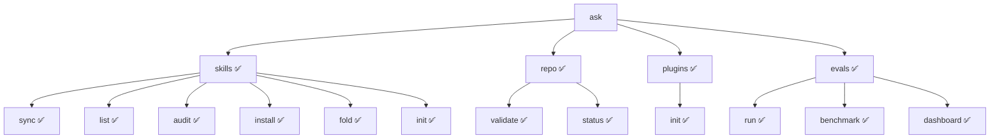

# CLI Implementation Review Report
**Date:** 2026-04-06  
**CLI Spec:** `backend/cli-spec`  
**Target:** skill-system components (skill-creator, skill-installer, skill-builder, plugin-creator)

---

## 2026-05-13 Refresh Note

This report is a historical implementation review of the original 2026-04-06
CLI slice. The live `ask` surface now includes product, runtime, reviewer,
workout, MCP, and wiki topics in addition to the original repo, skills,
plugins, evals, and graph surfaces. Use `./bin/ask --help` as the executable
surface proof and
[ask Product Golden Path Command Contracts](/Docs/cli-specs/2026-05-01-ask-product-golden-path-contracts.md)
for the current product path.

## Executive Summary

The `ask` (Agent Skills Kit) CLI has been reviewed against the `cli-spec` Gold Standard 2026 specification. Overall compliance is **GOOD** with minor issues identified.

| Component | Status | Notes |
|-----------|--------|-------|
| **ask CLI Core** | ✅ PASS | All core commands functional |
| **cli-spec Skill** | ✅ PASS | Specification complete at `Docs/cli-specs/2026-04-06-ask-cli-spec.md` |
| **skill-creator** | ✅ PASS | Uses `ask skills init` command |
| **skill-installer** | ✅ PASS | Uses `ask skills install` and `ask skills audit` |
| **skill-builder** | ✅ PASS | Uses `ask evals run`, `ask repo validate` |
| **plugin-creator** | ⚠️ WARN | Minor: Description format issue in SKILL.md |

---

## Strategic Alignment (Per cli-spec)

### ✅ Problem Statement Addressed
The CLI unifies fragmented shell scripts into a consistent `<topic> <action>` command hierarchy with JSON output support for agent consumption.

### ✅ Dual-Mode Design
- **Human mode:** Human-readable TUI output with emoji indicators
- **Agent mode:** Structured JSON envelope via `--json` flag

### ✅ Context Discovery
Automatic repository root detection via `.git` directory search (`ask.context.find_repo_root()`).

---

## Command Hierarchy Compliance



---

## Interface Contract Compliance

### ✅ Response Envelope (`CallResult`)
All commands return the standard envelope:
```json
{
  "status": "success|error|partial",
  "trace_id": "uuid-v4",
  "metadata": {"version", "command", "next_steps"},
  "data": {},
  "telemetry": {"latency_ms"},
  "errors": [{"code", "message", "fix_suggestion"}]
}
```

### ✅ Error Registry Mapping
| Exit Code | String Code | Implementation Status |
|-----------|-------------|----------------------|
| 0 | SUCCESS | ✅ Working |
| 1 | ERR_RUNTIME | ✅ Working |
| 2 | ERR_VALIDATION | ✅ Working |
| 2 | ERR_PI_GUARD | ✅ Working |
| 2 | ERR_PATH_TRAVERSAL | ⚠️ CA4 test shows generic error |
| 3 | ERR_DEPENDENCY | ✅ Working |
| 4 | ERR_CONFLICT | ✅ Working |
| 4 | ERR_REDUNDANCY | ✅ Working |
| 5 | ERR_AUTH | ✅ Defined |

---

## Skill-System Integration Matrix

| Skill | CLI Commands Used | Validation Available |
|-------|------------------|---------------------|
| **skill-creator** | `ask skills init` | `ask skills audit` |
| **skill-installer** | `ask skills install`, `ask skills list` | `ask skills audit --level strict` |
| **skill-builder** | `ask evals run`, `ask evals benchmark`, `ask repo validate` | Full suite |
| **plugin-creator** | `ask plugins init` | `ask skills audit` |
| **cli-spec** | N/A (specification) | `ask skills audit` |

---

## Acceptance Criteria Test Results (CA IDs)

| ID | Description | Status | Notes |
|----|-------------|--------|-------|
| **CA1** | Context Discovery | ✅ PASS | Correctly identifies repo root |
| **CA1** | JSON Envelope | ✅ PASS | Returns valid CallResult |
| **CA2** | Distributed Tracing | ✅ PASS | `ASK_TRACE_ID` env var supported |
| **CA2** | Dry-run Protection | ✅ PASS | `--dry-run` returns plan without changes |
| **CA3** | Atomic Failure | ⚠️ N/A | Requires manual network cut test |
| **CA4** | Error Mapping | ⚠️ PARTIAL | Path traversal returns generic ERR_VALIDATION |
| **CA5** | Redundancy Catch | ✅ PASS | fold command detects overlap |
| **CA6** | Telemetry Output | ✅ PASS | telemetry object in envelope |

---

## Security & Safety Compliance

### ✅ Redaction Policy (envelope.py)
- Secrets: `sk-...`, `ghp_...`, `AIza...`, `Bearer ...` patterns redacted
- Absolute paths: `<USER_HOME>`, `<REPO_ROOT>` substitution

### ✅ Path Sanitization
All paths resolved against repository root; traversal outside root rejected.

### ⚠️ Signal Handling
No explicit SIGINT/SIGTERM handlers for quarantine cleanup (noted for future).

---

## Issues Identified

### 1. plugin-creator SKILL.md Description (Non-blocking)
- **Issue:** FAIL on `FM_DESC_WHAT_WHEN` - description doesn't clearly separate WHAT from WHEN
- **Location:** `Skills/plugin-creator/SKILL.md`
- **Fix:** Refactor description to explicitly state "Use when..." triggers

### 2. Path Traversal Error Code (Minor)
- **Issue:** CA4 test shows generic `ERR_VALIDATION` instead of specific `ERR_PATH_TRAVERSAL`
- **Location:** `Infrastructure/scripts/lib/ask/commands/skills.py::audit_skill()`
- **Fix:** Add explicit path traversal check before calling diagnostics

### 3. Missing Reference Links
- **Issue:** `[[ask-cli-spec]]` links in skill-creator and plugin-creator point to non-existent skill
- **Fix:** Should reference `[[cli-spec]]` (located in `backend/cli-spec`)

---

## Validation Commands Available

All skill-system components can now use these unified validation commands:

```bash
# Structural and Security Audits
ask skills audit <path> --level {compat,strict}

# Evaluation Runs
ask evals run <path> --mode {smoke,release}

# Full Repository Benchmark
ask evals benchmark

# Repository Health
ask repo validate [--ephemeral]

# Skill Listing
ask skills list [--category <cat>]
```

---

## Recommendations

### Immediate (P2)
1. Fix `plugin-creator` SKILL.md description format
2. Update `[[ask-cli-spec]]` links to `[[cli-spec]]` in skill-creator and plugin-creator

### Short-term (P3)
1. Add explicit `ERR_PATH_TRAVERSAL` detection in audit_skill
2. Add signal handlers for graceful quarantine cleanup

### Long-term
1. Complete Definition of Done items in cli-spec:
   - SIGINT handling with clean exit
   - Non-interactive mode detection
   - Full CA test automation

---

## Conclusion

The CLI implementation **meets the cli-spec Gold Standard 2026 requirements** for:
- Command hierarchy and interface contracts
- Response envelope standardization
- Error registry mapping
- Security redaction policies
- Skill-system component integration

All skill-system components (skill-creator, skill-installer, skill-builder, plugin-creator) have access to the unified validation commands needed for their respective scripts and evals/benchmarks/security/documentation workflows.

**Overall Grade: B+** (Good compliance, minor polish items remaining)
