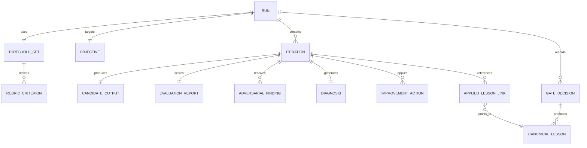

# feat: Recursive Skill Self-Improvement Loop (Drafts to Canonical Graph)

## Enhancement Summary

**Deepened on:** 2026-02-19
**Sections enhanced:** 13
**Research agents/skills used:** agent-native-architecture, llm-design-review, docs-expert, product-spec, skill-builder, skill-refactor, security-best-practices, context7 validation, plus parallel review/research agents.

### Key Improvements
1. Added explicit **gate contract** and measurable **pilot scorecard** targets.
2. Added **security + abuse** controls (poisoning, prompt-injection, PII/log retention, rollback).
3. Added **telemetry schema + daily health outputs** for recursive improvement quality loops.
4. Added **canonical lesson lifecycle** and **run recovery/concurrency** requirements.
5. Added **repo governance alignment tasks** (`.agent/PLANS.md`, `plan-graph-lint`, `verify-work.sh`).

### New Considerations Discovered
- LLM-as-judge reliability requires calibration, mirrored pairwise checks, drift monitoring, and non-single-judge decisions.
- v1 must avoid over-generalization: pilot on small UI profile set with explicit expansion gates.

## Overview
Build a reusable recursive self-improvement loop for skills that runs:
**generate -> evaluate -> diagnose -> improve -> repeat** until thresholds pass (or bounded stop conditions trigger).

v1 follows the brainstorm decision: **Approach A** (auto-generated drafts with human promotion to canonical knowledge), starting with UI/UX skills and expanding later.

## At a Glance
- Decision: Approach A (draft auto-generation + human promotion to canonical).
- v1 Scope: pilot UI/UX skill profiles first.
- Core loop: generate -> evaluate -> diagnose -> improve -> re-score.
- Hard stops: iteration cap, elapsed-time/token budget, escalation/abort policies.
- Expansion gate: only after pilot KPIs and governance checks pass.

## MVP Definition (ship gate)

**In MVP (Phases 1-3 only):**
- Run engine with bounded loop execution and explicit terminal outcomes.
- Standard evaluator each iteration + adversarial evaluator on checkpoint policy.
- Human-gated promotion into canonical lessons with provenance and security checks.

**Out of MVP (post-MVP / Phase 4+):**
- `pause_run` / `resume_run` and broader operator control surface.
- Automated revoke/supersede workflows.
- Expanded evaluator jury automation beyond checkpoint policy.

**Pilot profile set (initial fixed list):**
1. `ui-ux-creative-coding`
2. `interface-craft`
3. `frontend-ui-design`
4. `react-ui-patterns`

All non-listed profiles are explicitly out of scope until expansion gate approval.

## Problem Statement / Motivation
Current skill usage quality depends heavily on one-shot output quality and operator memory. High-value patterns (what worked, what failed, why) are not consistently converted into reusable, searchable, high-trust knowledge.

We need a repeatable system that:
1. Enforces explicit scoring criteria and thresholds,
2. Applies adversarial pressure (skeptical reviewer personas),
3. Produces auditable iteration artifacts,
4. Promotes only vetted learnings into canonical graph memory.

## Proposed Solution
Create a recursive loop framework with two storage tiers:
- **Draft tier (auto):** per-run iteration and diagnosis artifacts.
- **Canonical tier (human-promoted):** graph-linked, reusable lessons attached to skills and tasks.

The loop is task-profile driven (e.g., ad concept, video hook, positioning, SEO brief), with per-profile rubric thresholds and adversarial evaluator personas.

## Non-Goals (v1)
- No auto-promotion to canonical memory without human approval.
- No cross-domain rollout beyond selected pilot profile set.
- No replacement of existing governance gates; this augments them.

## Research Consolidation

### Brainstorm context used
Found brainstorm from **2026-02-19**: `skill-graph-learning-loop`. Used as source of truth for WHAT to build.

### Local repo findings (internal)
- Skill indexing/sync conventions: `Infrastructure/scripts/sync_skills.sh:126`
- Existing lessons slot: stale reference to `FORJAMIE.md:93` (file not present in repo as of 2026-03-21)
- Tiered gating model (`report-only -> warn -> fail`): `Skills/skill-builder/Infrastructure/references/tiered-gating-policy.md:5`
- MUST/SHOULD/MAY rubric pattern: `Skills/skill-builder/Infrastructure/references/gold-skill-rubric.md:1`
- Docs governance cutoff model: `Infrastructure/docs-policy.json:2`
- Task dependency graph convention: `.agent/PLANS.md:19`
- Session-scan learning extraction precedent: `Skills/skill-refactor/Infrastructure/scripts/scan_codex_sessions.py:5`
- Eval scorecard/gate precedent: `Skills/skill-builder/Infrastructure/scripts/run_skill_evals.py:14`

### Institutional learnings
- `docs/solutions/` is not present; nearest alternatives:
  - `docs/reference/index.md`
  - `product/domain/chatgpt-apps-production-checklist/Infrastructure/references/lessons-matrix.md:1`
  - Governance docs under `GOVERNANCE/`
- Reusable pitfall: duplicate source-of-truth risk between mirrored skill-builder areas (`Skills/...` and `Skills/...`).

### External research decision
No framework-specific external dependency is required for this planning phase (validated). External references are included only for evaluation/gov best-practice hardening.

## SpecFlow Analysis (gaps incorporated)
Key gaps addressed in this deepened plan:
- Explicit termination policy (iteration/time/token budget + stop reasons)
- Threshold schema beyond single pass/fail score
- Evaluator governance (standard vs adversarial, tie-breaks)
- Auditable artifact trail per iteration
- Escalation policy for no-improvement loops
- Stability criterion (pass for N consecutive cycles)
- Canonical lesson lifecycle and run recovery/concurrency behavior

## Technical Approach

### Architecture
**MVP v1 modules (pilot-first):**
1. **Run Engine** (generate/evaluate/diagnose/improve orchestration + budgets + stop reasons)
2. **Evaluation Module** (standard evaluator each iteration; adversarial checks on checkpoint policy: initial, final, and failure-triggered)
3. **Promotion Module** (human promotion gate + provenance/security validation; no runtime retrieval injection in MVP)

**Deferred (post-pilot hardening):**
- Extended evaluator jury behavior and expanded adversarial automation
- Broader operator control surface beyond MVP runtime operations
- Full graph-native normalization beyond MVP persisted artifacts
- Retrieval injection on skill start (Phase 4+)

### MVP persistence model (v1)
Persist only three top-level artifact classes in v1:
- `run`
- `iteration_journal`
- `promotion_decision`

`EVALUATION_REPORT` and `GATE_DECISION` remain required schema entities, but in v1 they are stored as immutable embedded subdocuments inside `iteration_journal` and `promotion_decision` (not separate top-level tables yet).

#### MVP artifact-to-evidence mapping
| Top-level artifact | Embedded evidence required | Required fields (minimum) | Gate/provenance usage |
|---|---|---|---|
| `run` | run-level gate snapshots + terminal outcome | `run_id`, `profile_id`, `terminal_status`, `stop_reason`, budget counters, `schema_version` | anchors run-time gate decisions and final audit summary |
| `iteration_journal` | `evaluation_report`, diagnosis links, delta history, retrieval lineage | `run_id`, `iteration_id`, criterion deltas, diagnosis refs, `applied_lessons[]`, `rubric_version`, `evaluator_version`, `prompt_hash` | provides hard-gate evidence for stability/non-regression checks and promotion impact attribution |
| `promotion_decision` | `gate_decision`, reviewer approvals, security checklist | `run_id`, `lesson_id`, `decision`, reviewer IDs, `expected_version`, provenance fields | required evidence artifact for canonical promotion/revoke history |


`applied_lessons[]` is required whenever retrieval is used and stores `{lesson_id, lesson_version, retrieval_rank, applied_at}` for downstream impact measurement.
In MVP (Phases 1–3), retrieval injection is disabled and `applied_lessons[]` must remain empty; population begins in Phase 4+.

Other entities remain logical/schema-level until pilot success gates are met.

#### Canonical entity naming map (authoritative for v1)
| Conceptual entity | v1 persisted location | Notes |
|---|---|---|
| `RUN` | `run` | top-level artifact |
| `ITERATION` | `iteration_journal` | top-level artifact |
| `EVALUATION_REPORT` | `iteration_journal.evaluation_report` | embedded immutable subdocument |
| `GATE_DECISION` | `promotion_decision.gate_decision` | embedded immutable subdocument |
| `PROMOTION_DECISION` | `promotion_decision` | top-level artifact |


### Agent-Native Capability Map (MVP runtime)
| Operator action | Required capability path | Preconditions | Authorization | Idempotency | Postcondition | Emitted event |
|---|---|---|---|---|---|---|
| Start loop run | `start_run(profile_id, objective, budget)` | Profile exists; thresholds + stop policy loaded | Runner role | `idempotency_key` required | Run initialized with immutable `run_id` + budget lock | `run_initialized` |
| Approve promotion | `recommend_promotion` -> `human_promote` | Required evidence + security checks pass | Human reviewer role | `expected_version` required | Canonical lesson promoted with provenance metadata | `promotion_approved` |
| Escalate run | `escalate_run(run_id, reason_code)` | Active run triggers escalation policy | Runtime/governance role | `idempotency_key` required | Terminal escalated state; follow-up must start a new run | `run_state_changed` |
| Abort run | `abort_run(run_id, reason)` | Active run exists | Runtime/governance role | `idempotency_key` required | Terminal aborted state with explicit stop reason | `run_state_changed` |

**Deferred operator actions (Phase 4 gate):**
- `inspect_run` / `run_inspected` evidence review event
- `revoke_lesson` / `supersede_lesson`
- `pause_run` / `resume_run`
- escalation assignment/notification workflows beyond the MVP terminal escalation event

### Data model (conceptual, post-MVP informational)
This ERD is non-binding for MVP implementation. MVP must only persist `run`, `iteration_journal`, and `promotion_decision` per the authoritative mapping above.



### Immutable provenance + versioning requirements
- `RUN`, `ITERATION`, `EVALUATION_REPORT`, and `GATE_DECISION` must include immutable fields: `schema_version`, `rubric_version`, `evaluator_version`, `persona_set_id`, `prompt_hash`, `created_at`, `created_by`.
- Enforce uniqueness constraints: `run_id`, and `(run_id, iteration_id)`.
- Promotion gate rejects artifacts missing required provenance/version fields.

### Lifecycle states
- Run (MVP): `Draft -> Initialized -> Looping -> GateCheck -> Passed | Failed | Escalated | Aborted -> Archived`
- Iteration: `Generated -> Evaluated -> Diagnosed -> Improved -> Re-evaluated -> Accepted | Rejected`
- Canonical lesson: `Promoted -> Active -> Superseded | Deprecated | Revoked`
- Promotion decision: `Draft -> Candidate -> Approved | Rejected`


Phase 4 extension (deferred): `Looping <-> Paused` via `pause_run` / `resume_run`.

**Run terminal contract:**
- `terminal_status`: `passed | failed | escalated | aborted`
- `stop_reason`: `pass | budget_exhausted | escalated | aborted | policy_failed | evaluator_conflict | dependency_missing`

### FSM transition matrix (required)
| Entity | From state | Allowed transitions | Notes |
|---|---|---|---|
| Run | Draft | Initialized, Aborted | Must emit `run_initialized` or `run_state_changed` |
| Run | Initialized | Looping, Aborted | No direct terminal pass/fail from Initialized |
| Run | Looping | GateCheck, Escalated, Aborted | Retry stays in Looping with incremented iteration |
| Run | GateCheck | Looping, Passed, Failed, Escalated, Aborted | `GateCheck -> Looping` allowed only when budgets remain and blocking gates are not yet satisfied; abort is allowed from any non-terminal run state |
| Run | Escalated | Archived | Terminal status; remediation continues in a new run |
| Run | Passed/Failed/Aborted | Archived | Terminal before archive; `stop_reason` required |
| Iteration | Generated | Evaluated | Immutable snapshot before scoring |
| Iteration | Evaluated | Diagnosed, Rejected | Rejected requires reason code |
| Iteration | Diagnosed | Improved | Diagnosis must reference evidence |
| Iteration | Improved | Re-evaluated | Same rubric/evaluator version for comparability |
| Iteration | Re-evaluated | Accepted, Rejected | Accepted requires non-regression checks |
| Promotion decision | Draft | Candidate, Rejected | Draft may be rejected pre-review |
| Promotion decision | Candidate | Approved, Rejected | Approved emits promotion artifact |
| Canonical lesson | Promoted | Active, Revoked | Promotion writes provenance + scope |
| Canonical lesson | Active | Superseded, Revoked, Deprecated | Revoked takes retrieval precedence |
| Canonical lesson | Superseded | Revoked, Deprecated | Superseded lessons are non-primary |

### Canonical lesson scope and lineage rules
- Every canonical lesson must include: `lesson_id`, `scope_skill`, `scope_profile`, `status`, `effective_from`, `effective_to`, `supersedes_lesson_id?`, `superseded_by_lesson_id?`.
- Write-time integrity constraints are required: at most one overlapping `Active` lesson per `{scope_skill, scope_profile}` effective window; overlapping active windows must be rejected before write.
- Retrieval (Phase 4+) must filter by scope first, then choose highest-priority active lesson by deterministic tie-break order: `status_priority -> confidence -> recency -> lesson_id`.
- Revoked lessons are excluded immediately; superseded lessons are fallback-only when explicitly requested for audit.

### Determinism and idempotency contract
- Iteration journal writes require optimistic locking on `run_version` and unique `(run_id, iteration_id)` to prevent duplicate/concurrent append corruption; `iteration_id` must be monotonic and immutable per run.
- `idempotency_key` scope (write actions): `{action_type, actor_id, target_ref, payload_hash}`.
- `target_ref` must be action-specific:
  - `start_run`: `{profile_id, objective_hash, budget_hash}`
  - `escalate_run` / `abort_run`: `{run_id, reason_code}`
  - `human_promote`: `{run_id, lesson_id, expected_version, reviewer_id}`
- `idempotency_key` TTL: 24h minimum; replay of same key must return original result payload + status.
- Terminal run-state writes are CAS-protected via `run_version`; only the first successful terminal transition is accepted. Concurrent terminal intents must resolve by deterministic precedence: `aborted > escalated > failed > passed`.
- `expected_version` is mandatory for mutating lesson actions to prevent stale writes.
- Retrieval tie-break order must be deterministic and versioned in schema.

### Research Insights
**Best practices:**
- Use calibrated judge panels, not single-judge pass/fail.
- Require immutable metadata (`schema_version`, `rubric_version`, `evaluator_version`, `prompt_hash`) for comparability.

**Performance considerations:**
- Control evaluator explosion with tiered checks and call/token budgets.
- Use top-K retrieval and retrieval-token budget to avoid context bloat.

**Edge cases:**
- Crash/retry and concurrent-run idempotency.
- Conflicting canonical lessons and stale lesson suppression.

## Threshold Registry (single source of truth)
All numeric/boolean thresholds are defined here and referenced by ID across gates, SLOs, quality gates, and success metrics.

| Threshold ID | Definition | Target | Enforcement phase |
|---|---|---|---|
| `TR-01` | Stability consecutive pass count | `N >= 1` in MVP (Phases 1–3); `N >= 3` in post-MVP hardening (Phase 4+) | MVP (blocking), Phase 4+ hardening |
| `TR-02` | Critical non-regression | `100% required` | MVP (blocking) |
| `TR-03` | Budget compliance (`% runs within caps`) | `>= 95%` | MVP (blocking) |
| `TR-04` | Evaluator consistency flip rate | `<= 3%` | Phase 3+ (hard), MVP advisory |
| `TR-05` | Judge calibration agreement | `>= 80%` | Phase 3+ (hard), MVP advisory |
| `TR-06` | Promotion precision | `>= 70%` | Phase 4+ gate (after retrieval injection) |

## Run-Time Gate Contract (per-run)
| Gate | v1 class | Rule | Pass/fail threshold | Evidence source | Scope |
|---|---|---|---|---|---|
| Stability | Blocking | Consecutive pass count per run | `TR-01` | Iteration journal | per_run |
| Critical non-regression | Blocking | No critical criterion drop vs initial baseline or best accepted prior iteration | `TR-02` | Criterion deltas | per_run |
| Budget compliance | Blocking | Iteration/time/token caps respected | `TR-03` | Runtime counters | per_run |
| Promotion safety | Blocking | Human approval + provenance + security checks | Required before canonical write | Gate decision artifact | per_run |
| Evaluator consistency | Advisory (v1), Blocking (Phase 3+) | Final mirrored check produces no unresolved conflict | `TR-04` | Evaluation report | per_run |
| Judge calibration eligibility | Advisory (v1), Blocking (Phase 3+) | Judge profile allowed for this run | `eligible` + `TR-05` | Judge registry | per_run |

## Program Health SLO Contract (rolling)
Phase 2 treats SLOs as baseline/monitoring targets; hard enforcement begins in Phase 3+ for `TR-04`/`TR-05`, and Phase 4+ for `TR-06`.

| SLO | Metric | Target | Evaluation window |
|---|---|---|---|
| Evaluator consistency | Mirrored pairwise flip rate | `TR-04` | Rolling 7 days |
| Judge calibration | Human agreement on gold set | `TR-05` | Rolling 14 days |
| Budget compliance | `% runs within caps` | `TR-03` | Rolling 7 days |
| Promotion precision | `% promoted lessons improving downstream runs` | `TR-06` | Rolling 14 days |

Note: `TR-06` is advisory in MVP and becomes hard-gated in Phase 4+ once retrieval injection is enabled.

## Canonical event enum (single source)
MVP core events: `run_initialized | run_state_changed | promotion_approved | failure_event`
Deferred events (Phase 4+): `run_inspected | lesson_revised | scan_summary | pattern_candidate`
failure_event emission rule: emit `failure_event` whenever a run reaches terminal status other than `passed`.

## Telemetry & Feedback Loop Contract
```text
schema_version: "1.0"
event_id: "<uuid>"
ts: "<ISO-8601>"
run_id: "<loop-run-id>"
skill_name: "<kebab-case>"
task_profile: "<profile-id>"
event_type: "<run_initialized|run_state_changed|promotion_approved|failure_event|run_inspected|lesson_revised|scan_summary|pattern_candidate>"  # last four are Phase 4+ only
severity: "<info|warn|fail>"
terminal_status: "<passed|failed|escalated|aborted|null>"
stop_reason: "<pass|budget_exhausted|escalated|aborted|policy_failed|evaluator_conflict|dependency_missing|null>"
iteration_id: "<run-iteration-id>"
criterion_id: "<criterion-id|null>"
gate_id: "<runtime-gate-id|null>"
actor_id: "<human-or-agent-id>"
evaluator_version: "<version-id>"
rubric_version: "<version-id>"
prompt_hash: "<sha256>"
source:
  kind: "<session_scan|eval_trace|human_review>"
  ref: "<source-ref>"
fingerprint: "<stable-hash>"
counts:
  invocations_window: 0
  issue_events_window: 0
  distinct_sessions_window: 0
quality:
  score_before: null
  score_after: null
  token_used: 0
  elapsed_ms: 0
decision:
  state: "<draft|candidate|approved|rejected>"
  reason: "<short reason>"
```

Daily operator outputs:
- `daily-skill-health.md`
- `failure-pattern-candidates.jsonl`
- `promotion-queue.md`

## MVP Phases (1–3)

#### Phase 1: Spec + schema foundation
- Define profile/rubric/threshold schema and stop conditions.
- Define draft/canonical artifact schemas and naming conventions.
- Define gate contract and telemetry schema.
- Draft files:
  - `docs/skill-graphs/schemas/task-profile.schema.md`
  - `docs/skill-graphs/schemas/iteration-journal.schema.md`
  - `docs/skill-graphs/schemas/canonical-lesson.schema.md`
  - `docs/skill-graphs/schemas/gate-contract.schema.md`
- Success criteria: schemas reviewed and accepted with governance owners.

#### Phase 2: Shadow-mode evaluation loop (no auto-improve)
- Run evaluator + adversarial evaluator and record results only.
- Validate score stability, mirrored pairwise consistency, and false-positive rates.
- Pilot files:
  - `docs/skill-graphs/pilots/ui-skills-shadow-results.md`
- Success criteria: stable scoring variance and actionable diagnoses.

#### Phase 3: Assisted recursive loop + human promotion
- Enable improve/re-score iterations under strict budget.
- Add promotion checklist and reviewer workflow for canonical promotion.
- Enforce security/privacy checks before promotion.
- Workflow docs:
  - `docs/skill-graphs/workflows/promotion-gate.md`
  - `docs/skill-graphs/workflows/reviewer-rubric.md`
- Success criteria: meaningful quality deltas and acceptable review overhead.

## Post-MVP Expansion (Phase 4+)

#### Phase 4: Bounded autonomy + retrieval integration
- Enable bounded automatic loops for approved pilot profiles.
- Inject promoted canonical lessons on skill start for selected UI skills.
- Runbook docs:
  - `docs/skill-graphs/runbooks/kill-switch-and-escalation.md`
- Success criteria: reduced repeat-failure rate and no governance regressions.

## Phase-to-Task Execution Map
| Phase | Task IDs | Exit Gate |
|---|---|---|
| Phase 1 | T1, T2, T3, T10, T11, T14 | Contracts, telemetry, and recovery specs approved |
| Phase 2 | T4, T8, T15 | Shadow stability + governance evidence checks pass |
| Phase 3 | T5, T6, T12, T13 | Promotion workflow + security/integrity gates pass |
| Phase 4 (post-MVP) | T7, T9, T16 | Go/No-Go review passed |

## Task Graph (id / depends_on)
```yaml
tasks:
  - id: T1
    title: Define recursive loop policy (thresholds, stop conditions, escalation)
    depends_on: []
  - id: T2
    title: Define draft + canonical lesson schemas
    depends_on: [T1]
  - id: T3
    title: Define evaluator and adversarial persona contract
    depends_on: [T1]
  - id: T4
    title: Stand up shadow-mode pilot for UI skill set
    depends_on: [T2, T3, T8, T11]
  - id: T5
    title: Define human promotion rubric + reviewer workflow
    depends_on: [T2, T4]
  - id: T6
    title: Enable assisted recursive loop (bounded budgets, manual human-gated promotion writes only)
    depends_on: [T4, T5, T8, T12, T14, T15]
  - id: T7
    title: Integrate canonical retrieval hooks into selected UI skills
    depends_on: [T5, T6, T12, T13]
  - id: T8
    title: Add governance/CI checks and evidence reporting
    depends_on: [T10, T11]
  - id: T9
    title: Pilot review + go/no-go for expansion to non-UI skills
    depends_on: [T7, T8, T16]
  - id: T10
    title: Establish canonical source-of-truth policy and drift guard
    depends_on: [T1]
  - id: T11
    title: Add telemetry schema and daily failure-pattern candidate pipeline
    depends_on: [T2, T3, T10]
  - id: T12
    title: Add artifact security/privacy controls and promotion integrity checks
    depends_on: [T5]
  - id: T13
    title: Add canonical lesson lifecycle and retrieval conflict handling
    depends_on: [T5, T6]
  - id: T14
    title: Add run recovery and concurrency/idempotency contract
    depends_on: [T2, T3]
  - id: T15
    title: Align with repo governance checks (.agent/PLANS.md, plan-graph-lint, verify-work)
    depends_on: [T8]
  - id: T16
    title: Define expansion gate scorecard with explicit pass/fail thresholds
    depends_on: [T11, T12, T13, T14, T15]
```

## Alternative Approaches Considered
- **B: Single global lessons log** — rejected for weak traversal and high noise risk.
- **C: Fully graph-native day 1** — deferred due to avoidable v1 complexity and governance overhead.

## Acceptance Criteria

### Functional requirements
- [ ] Loop executes generate/evaluate/diagnose/improve/re-score cycle for a configured task profile (`docs/skill-graphs/schemas/task-profile.schema.md`).
- [ ] Every iteration writes auditable artifacts with score deltas, rationale, and immutable metadata (`run_id`, `iteration_id`, versions, prompt hash).
- [ ] Adversarial evaluator follows checkpoint policy in MVP (initial, final, and failure-triggered), and outputs actionable findings with severity.
- [ ] Run finalization records both `terminal_status` (`passed|failed|escalated|aborted`) and explicit `stop_reason` (`pass|budget_exhausted|escalated|aborted|policy_failed|evaluator_conflict|dependency_missing`).
- [ ] Promotion to canonical knowledge requires human approval checklist completion and provenance fields.
- [ ] Retrieval integration contract is finalized for Phase 4 (scope filtering + conflict resolution), with no runtime retrieval injection in MVP.

### Non-functional requirements
- [ ] No infinite loops: hard cap on iterations + elapsed-time/token budget per run.
- [ ] Repeatability (`TR-04`): fixed-input judge flip rate and score stddev are monitored in MVP (advisory) and hard-gated in Phase 3+.
- [ ] Traceability: each improvement action references prior diagnosis evidence.
- [ ] Data handling: redaction + retention TTL for draft artifacts, encrypted storage for sensitive logs.

### Quality gates
- [ ] Release-gate enforcement split is explicit: blocking per-run gates in MVP, `TR-04/05` hard-enforced in Phase 3+, and `TR-06` hard-enforced in Phase 4+.
- [ ] Threshold pass must hold per `TR-01` (MVP Phases 1–3: `N>=1`; post-MVP Phase 4+: `N>=3` stability hardening gate).
- [ ] Critical criteria are non-regressing across accepted iterations per `TR-02`.
- [ ] Judge calibration eligibility is enforced per run; rolling calibration target (`TR-05`) becomes hard-gated in Phase 3+.
- [ ] Governance evidence sections are complete for promotion decisions.

## AC-to-Test Mapping (high-level)
| AC Group | Unit | Integration | E2E | Governance |
|---|---|---|---|---|
| Loop correctness | stop-reason enums, threshold eval | loop writes full journals | pass/budget/escalated/aborted paths | reviewer signoff evidence |
| Evaluator reliability | mirrored pairwise + calibration logic | multi-judge orchestration | drift-triggered freeze | weekly eval health review |
| Promotion integrity | provenance field validation | promotion gate policy checks | approve/reject promotion paths (MVP); revoke/supersede paths (Phase 4+) | approval audit trail |
| Security/privacy | redaction validators | artifact retention/ACL flows | leakage blocking before promotion | periodic security control checks |

## Success Metrics

_Baseline protocol (applies to all KPIs unless noted):_
- Use Phase 2 shadow-mode logs as baseline window (first 2 weeks).
- Pilot readiness sample: 40 runs total (minimum 10 per pilot skill).
- Expansion-gate sample: 100 runs total and at least 20 runs per pilot skill.
- Report both overall and per-skill values.

| KPI | Metric definition | Pilot target | Review cadence |
|---|---|---|---|
| Repeat failure pattern rate | `% runs containing >=1 top-5 failure taxonomy tag` | `>=35%` reduction vs baseline | Weekly |
| First-pass acceptance rate | `% runs accepted at Iteration 1` | `+20pp` vs baseline | Weekly |
| Iterations to accepted output | median and p90 iterations | Median `<=2`, p90 `<=4` | Weekly |
| Quality uplift per run | `accepted_score - initial_score` | Median `>= +0.12`; `>=80%` positive uplift | Weekly |
| Critical non-regression compliance | `% accepted runs with no critical drop` | `TR-02` | Per run + weekly |
| Promotion precision | `% promoted lessons improving downstream outcomes` | `TR-06` within 14 days (post-MVP) | Biweekly |
| Reviewer overhead | median/p90 minutes per promotion decision | median `<=12m`, p90 `<=20m` | Weekly |
| Manual rewrite escape rate | `% runs needing post-loop one-shot rewrite` | `<=15%` and `>=50%` reduction | Biweekly |
| Loop budget compliance | `% runs within iteration/time/token caps` | `TR-03` | Weekly |

## Dependencies & Risks

### Dependencies
- Existing skill metadata/indexing conventions (`Infrastructure/scripts/sync_skills.sh`).
- Existing quality-gate and scorecard patterns (`Skills/skill-builder/Infrastructure/scripts/*`).
- Governance cadence and evidence requirements (`GOVERNANCE/*`, PR template).

### Risk register
| Risk | Trigger | Owner | Mitigation | Escalation |
|---|---|---|---|---|
| Rubric gaming | score rises while critical quality drops | Eval owner | non-regression checks + adversarial probes | freeze profile |
| Draft noise | low-confidence diagnoses accumulate | Workflow owner | confidence threshold + promotion gate | pause promotions |
| Source-of-truth drift | conflicting lesson stores | Platform owner | single canonical path + drift CI check | block merge |
| Runaway loop cost | budget caps exceeded repeatedly | Runtime owner | hard caps + kill switch + plateau abort | incident review |
| Canonical poisoning | unsafe lesson promoted | Governance owner | dual approval + provenance + quarantine | revoke + rollback |
| Artifact leakage | secrets/PII in logs | Security owner | redaction + secret scan + TTL retention | block promotion |

## Documentation Plan
- Add new docs root: `docs/skill-graphs/`
- Add pilot readout: `docs/skill-graphs/pilots/ui-skills-pilot-readout.md`
- Add governance appendix for promotion decisions and exceptions.
- Add framework dependency manifest for runner/tooling versions.

## References & Research

### Internal references
- `docs/brainstorms/2026-02-19-skill-graph-learning-loop-brainstorm.md`
- `Infrastructure/scripts/sync_skills.sh:126`
- stale `FORJAMIE.md:93` reference (file not present in repo as of 2026-03-21)
- `.agent/PLANS.md:19`
- `Skills/skill-builder/Infrastructure/references/tiered-gating-policy.md:5`
- `Skills/skill-builder/Infrastructure/references/gold-skill-rubric.md:1`
- `Skills/skill-refactor/Infrastructure/scripts/scan_codex_sessions.py:5`
- `Skills/skill-builder/Infrastructure/scripts/run_skill_evals.py:14`
- `Infrastructure/docs-policy.json:2`

### External references
- OpenAI evaluation best practices: https://platform.openai.com/docs/guides/evals-best-practices
- Anthropic prompt engineering guide: https://docs.anthropic.com/en/docs/build-with-claude/prompt-engineering/overview
- NIST AI RMF 1.0: https://doi.org/10.6028/NIST.AI.100-1
- NIST Generative AI Profile (AI 600-1): https://doi.org/10.6028/NIST.AI.600-1
- NIST SP 800-61r3 (incident response): https://doi.org/10.6028/NIST.SP.800-61r3
- MT-Bench / Chatbot Arena: https://arxiv.org/abs/2306.05685
- G-Eval: https://arxiv.org/abs/2303.16634
- Position bias in LLM judges: https://arxiv.org/abs/2406.07791
- PoLL: https://arxiv.org/abs/2404.18796
