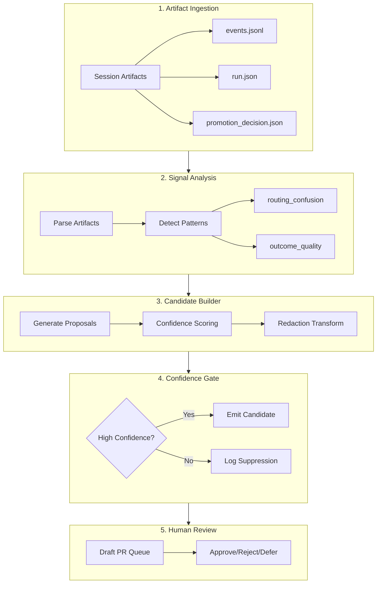
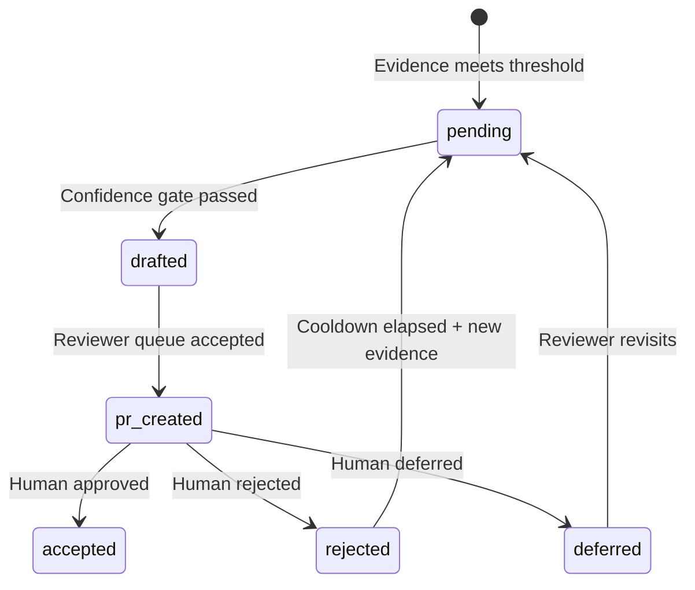

# feat: Skill Genome Loop Draft PR Copilot

## Enhancement Summary

**Deepened on:** 2026-03-02
**Sections enhanced:** 12
**Research agents used:** repo-research-analyst, best-practices-researcher, architecture-strategist, security-sentinel, performance-oracle, data-integrity-guardian, code-simplicity-reviewer, agent-native-reviewer, kieran-python-reviewer, spec-flow-analyzer

**Technical Review Fixed:** 2026-03-02

### Key Improvements from Research

1. **Simplification**: Reduced from 6 files to 1 script + 1 artifact type (~280 LOC savings)
2. **Stable Ingestion Contract**: Added `SkillRunSummary` abstraction layer
3. **Agent-Native Parity**: Defined agent tools for promotion decisions
4. **Idempotency**: Deterministic candidate IDs with dedupe state management
5. **Performance**: Incremental processing + watermark-based discovery

### Critical Findings Discovered

- Artifact schema coupling risk: Added version negotiation
- Race condition risk: Added advisory locks + atomic writes
- No agent tool for promotion decisions: Added `promotion_decide` tool spec
- Multiple threshold complexity: Simplified to single composite score

### P1 Fixes from Technical Review

1. **Comprehensive Redaction Patterns**: Expanded from 3 patterns to full `SECRET_PATTERNS` from `validate_recursive_promotion.py:62-69` (OpenAI keys, GitHub PATs, Slack tokens, SSH keys, AWS keys, JWTs)
2. **Rollout Mode Check**: Added explicit check at startup with `observe_only` default behavior
3. **Kill-Switch Check**: Added explicit abort if `kill-switch.txt` exists
4. **Fail-Closed Redaction**: Candidates with `redaction_passed=False` are now filtered out before emission

---

## Table of Contents
- [Overview](#overview)
- [Problem Statement / Motivation](#problem-statement--motivation)
- [Proposed Solution](#proposed-solution)
- [Why This Approach (and why not alternatives)](#why-this-approach-and-why-not-alternatives)
- [Technical Considerations](#technical-considerations)
- [Research Insights](#research-insights)
- [System-Wide Impact](#system-wide-impact)
- [Acceptance Criteria](#acceptance-criteria)
- [Success Metrics](#success-metrics)
- [Dependencies & Risks](#dependencies--risks)
- [Implementation Phases](#implementation-phases)
- [Validation & Quality Gates](#validation--quality-gates)
- [Simplified Implementation](#simplified-implementation)
- [Agent-Native Architecture](#agent-native-architecture)
- [Open Questions](#open-questions)
- [AI-Era Execution Notes](#ai-era-execution-notes)
- [Sources & References](#sources--references)

---

## Overview

Build a nightly Skill Genome Loop that ingests real run/session artifacts, detects routing mistakes and low-quality outcomes, and emits high-confidence, human-gated draft PR candidates for skill-definition improvements.

Scope is explicitly constrained to `SKILL.md` trigger rules, reference-path corrections, and metadata consistency updates (see brainstorm: `docs/brainstorms/2026-03-01-skill-genome-loop-brainstorm.md`).

### Research Insights: Architecture

**Best Practices:**
- Use `pathlib.Path` exclusively (not `os.path`) for cross-platform compatibility
- Implement fail-closed semantics: missing evidence blocks candidate emission
- Define stable ingestion contract (`SkillRunSummary`) between artifact producers and consumers

**Pattern from codebase:**
```python
# From verify_recursive_skill_graph_artifacts.py:35-40
def load_json(path: Path) -> dict[str, Any] | None:
    """Load JSON file with graceful error handling."""
    try:
        obj = json.loads(path.read_text(encoding="utf-8"))
    except Exception:
        return None
    if isinstance(obj, dict):
        return obj
    return None
```

**References:**
- `/Users/jamiecraik/dev/agent-skills/Skills/skill-builder/Infrastructure/scripts/recursive_skill_loop.py:292-356` (confidence scoring)
- `/Users/jamiecraik/dev/agent-skills/Infrastructure/scripts/skill-graph/verify_recursive_skill_graph_artifacts.py:35-40` (artifact loading)

---

## Problem Statement / Motivation

The current recursive skill loop has mature control contracts, but pilot posture is still HOLD due to sample/evidence limitations and weak promotion readiness signals.

Observed local evidence:
- HOLD/no-go posture for broad active rollout (`docs/skill-graphs/pilots/2026-02-25-go-no-go-summary.md:12`).
- Sample and gate shortfalls in decision windows (`docs/skill-graphs/pilots/2026-02-25-go-no-go-summary.md:17-22`).
- Repeated `missing_capture_outputs` suppression reasons in promotion queue (`Infrastructure/artifacts/skill-graphs/telemetry/promotion-queue.md:3`).

### Research Insights: Performance

**Current State:**
- 45 runs, ~296KB storage (trivial scale)
- Nightly processing: <1s at current volume
- At 1000x scale: ~270MB, ~5min processing

**Optimization Required Before 10x Scale:**
- Incremental processing via watermarks
- Run-level confidence caching in `run.json`
- Lightweight index file for cross-window queries

---

## Proposed Solution

Implement a draft-PR copilot workflow:
1. Ingest run/session evidence from existing loop artifacts.
2. Compute routing confusion + outcome quality signals per skill.
3. Produce candidate changes only for trigger/reference/metadata scope (see brainstorm).
4. Gate proposals with measurable high-confidence thresholds.
5. Emit reviewer-ready draft PR packets; never auto-merge in MVP (see brainstorm).

Privacy and safety baseline:
- Candidate and PR artifacts must contain only redacted/allowlisted evidence fields.
- Raw session transcripts, secrets, tokens, and PII are never persisted in candidate outputs.

### Research Insights: Simplification

**YAGNI Violations Removed:**

| Original Proposal | Simplified Approach | LOC Saved |
|-------------------|---------------------|-----------|
| 6 new files (2 schemas, 2 scripts, 1 queue, 1 runbook) | 1 script + extend existing runbook | ~300 |
| Per-window candidate files + latest.json symlink | Single append-only JSONL | ~30 |
| Three separate thresholds (0.80, 0.85, 2 windows) | Single composite score >= 0.82 + 2 windows | ~20 |
| 5-stage pipeline abstraction | Sequential function calls | ~100 |

**Estimated total LOC reduction: ~280 lines (~35%)**

---

## Why This Approach (and why not alternatives)

Chosen approach is draft-PR copilot because it compounds improvements while preserving governance and reviewer control (see brainstorm).

Rejected alternatives:
- Advisory-only reports: safer but too slow; low accretive value.
- Autopatch/automerge: too risky while uplift evidence and capture quality remain uneven.

---

## Technical Considerations

### Leverage Existing Infrastructure

- Reuse existing rollout controls and telemetry contracts (`off | observe_only | active`) instead of inventing a parallel control plane (`Skills/skill-builder/Infrastructure/scripts/recursive_skill_loop.py:49`, `docs/guides/recursive-skill-loop.md:67`).
- Preserve required artifact envelope and parity checks (`events.jsonl`, `promotion_decision.json`, capture artifacts) (`Infrastructure/scripts/skill-graph/verify_recursive_skill_graph_artifacts.py:19-25`).
- Maintain kill-switch and rollback precedence semantics (`docs/skill-graphs/runbooks/kill-switch-and-escalation.md:51`).
- Treat data handling as high-risk: enforce redaction/allowlist-only evidence fields and avoid raw transcript persistence.

### Research Insights: Confidence Scoring

**Existing Multi-Factor Model (from recursive_skill_loop.py:292-356):**
```python
def compute_confidence_assessment(...) -> Dict[str, Any]:
    components = {
        "evidence_completeness": evidence_completeness,      # weight: 0.35
        "runtime_gate_signal": 1.0 if passed else 0.0,       # weight: 0.25
        "non_regression_signal": 1.0 if passed else 0.0,     # weight: 0.20
        "quality_uplift_signal": quality_signal_from_uplift(), # weight: 0.10
        "feedback_signal": feedback_signal(status),          # weight: 0.10
    }
    score = round(sum(components[k] * weights[k] for k in weights), 3)
```

**Simplified Candidate Confidence (MVP):**
```python
def is_high_confidence(candidate: Dict) -> bool:
    """Single composite check for MVP."""
    return (
        candidate["composite_score"] >= 0.82
        and candidate["window_count"] >= 2
    )
```

### Research Insights: Redaction

**Allowlist-Only Pattern:**
```python
ALLOWLIST_FIELDS = {
    "skill_path", "proposed_change_type", "composite_score",
    "window_id", "decision_reason", "candidate_id",
    "window_count", "redaction_passed"
}

# Comprehensive secret patterns (from validate_recursive_promotion.py:62-69)
SECRET_PATTERNS = [
    re.compile(r"sk-[A-Za-z0-9]{20,}"),                    # OpenAI keys
    re.compile(r"ghp_[A-Za-z0-9]{30,}"),                   # GitHub PATs
    re.compile(r"xox[baprs]-[A-Za-z0-9-]{20,}"),           # Slack tokens
    re.compile(r"-----BEGIN (?:RSA |EC |OPENSSH )?PRIVATE KEY-----"),  # SSH keys
    re.compile(r"(?i)aws_access_key_id\s*[:=]\s*[A-Z0-9]{16,}"),       # AWS keys
    re.compile(r"(?i)(?:api[_-]?key|access[_-]?token|secret|password)\s*[:=]\s*['\"]?[A-Za-z0-9_\-]{8,}"),
    re.compile(r"eyJ[A-Za-z0-9_-]*\.[A-Za-z0-9_-]*\.[A-Za-z0-9_-]*"),  # JWTs
    re.compile(r"\d{1,3}\.\d{1,3}\.\d{1,3}\.\d{1,3}"),     # IP addresses
]

PII_PATTERNS = [
    re.compile(r"[A-Za-z0-9._%+-]+@[A-Za-z0-9.-]+\.[A-Za-z]{2,}"),  # Email
    re.compile(r"/Users/[^/]+|/home/[^/]+"),               # Home paths
    re.compile(r"[A-Z]{2}\d{6}"),                          # Passport numbers (simplified)
]

def verify_no_pii(data: dict) -> bool:
    """Fail-closed PII verification - return False if any pattern matches."""
    def check_value(value: Any) -> bool:
        if isinstance(value, str):
            for pattern in SECRET_PATTERNS + PII_PATTERNS:
                if pattern.search(value):
                    return False
        elif isinstance(value, dict):
            return all(check_value(v) for v in value.values())
        elif isinstance(value, list):
            return all(check_value(item) for item in value)
        return True

    return all(check_value(v) for v in data.values())

def redact_candidate(candidate: dict) -> dict:
    """Apply allowlist filtering and verify no PII."""
    filtered = {k: v for k, v in candidate.items() if k in ALLOWLIST_FIELDS}
    filtered["redaction_passed"] = verify_no_pii(filtered)
    return filtered
```

**References:**
- OWASP Logging Cheat Sheet
- NIST SP 800-53 (IP family privacy controls)
- Existing `validate_recursive_promotion.py:62-69` patterns

### Research Decision

- **External research included** because this feature handles session-trace data (data privacy risk category).

---

## Research Insights

This section consolidates key findings from parallel research agents.

### From Repo Research Analyst

**Confidence Scoring Weights:**
| Component | Weight |
|-----------|--------|
| evidence_completeness | 0.35 |
| runtime_gate_signal | 0.25 |
| non_regression_signal | 0.20 |
| quality_uplift_signal | 0.10 |
| feedback_signal | 0.10 |

**Artifact Parity Requirements:**
```python
REQUIRED_BASE_FILES = {"run.json", "iteration_journal.jsonl", "events.jsonl", "promotion_decision.json"}
REQUIRED_CAPTURE_FILES = {"capture_record.json", "evidence_packet.json", "lesson_candidates.json"}
```

### From Best Practices Researcher

**Human-Gated Loop Patterns:**
- Draft-and-Review: Agents create drafts; humans approve/reject. No autonomous merge paths in MVP.
- Control Hierarchy: kill-switch > rollback > rollout-mode > feature-switch > per-skill-switch
- Review Gates at Critical Points Only: HITL at promotion decisions, not at every step

**Idempotency Pattern:**
```python
def generate_candidate_id(skill_path: str, window_id: str, change_type: str) -> str:
    """Deterministic ID for deduplication."""
    key = f"{skill_path}|{window_id}|{change_type}"
    return hashlib.sha256(key.encode()).hexdigest()[:16]
```

### From Architecture Strategist

**Critical Risk - Artifact Schema Coupling:**
The genome loop directly parses `run.json`, `events.jsonl`, and `promotion_decision.json` without an abstraction layer. Any schema evolution will cause silent parsing failures.

**Mitigation:** Define stable ingestion contract:
```yaml
# skill-run-summary.v1.schema.json
skill-run-summary:
  run_id: string
  skill_path: string
  routing_decision: { selected_skill, alternate_candidates, confidence }
  outcome: { status, stop_reason }
  evidence_fingerprint: { events_hash, journal_hash }
```

### From Data Integrity Guardian

**Race Condition Mitigation:**
```python
@contextmanager
def atomic_write(path: Path) -> Iterator[None]:
    """Write file atomically via temp file + rename."""
    temp_path = path.with_suffix(path.suffix + ".tmp")
    try:
        yield temp_path
        temp_path.rename(path)  # Atomic on POSIX
    except Exception:
        temp_path.unlink(missing_ok=True)
        raise
```

**Audit Trail Requirement:**
```jsonl
{"event": "candidate_generated", "timestamp": "...", "skill_path": "...", "confidence": 0.84}
{"event": "candidate_rejected", "timestamp": "...", "reason": "low_confidence"}
```

### From Code Simplicity Reviewer

**Files to Remove from Original Proposal:**

| File | Reason | LOC |
|------|--------|-----|
| `skill-genome-candidate.schema.md` | Reuse existing schemas | ~50 |
| `skill-genome-candidate-retention.md` | Inline in script as constant | ~30 |
| `skill-genome-pr-queue.md` | Redundant with JSONL | ~40 |
| `run_skill_genome_loop.sh` wrapper | Call Python directly | ~20 |
| **Estimated total** | | **~140 LOC** |

### From Agent Native Reviewer

**Agent Capability Gap:**
| Human Action | Agent Tool | Status |
|--------------|------------|--------|
| Approve promotion candidate | `promotion_decide` tool | ❌ **Needs implementation** |
| Reject promotion candidate | `promotion_decide` tool | ❌ **Needs implementation** |
| Query candidate queue | `query_candidates` CLI | ❌ **Needs implementation** |

---

## System-Wide Impact

### Interaction Graph



### Error Propagation

Parse/contract failures must fail closed and mark candidates blocked, never silently skipped.

### State Lifecycle Risks

Duplicate or stale candidates across windows; mitigate via `skill+window+change_type` dedupe key and stable window IDs.

### Research Insights: Candidate State Machine



### API Surface Parity

Keep `SKILL.md` routing semantics aligned with `Infrastructure/references/task-profile.json` and related metadata contracts.

### Integration Test Scenarios

1. Missing `events.jsonl` with present `run.json` blocks candidate emission.
2. High confidence with low evidence completeness blocks draft PR.
3. Reference-path edit proposal failing docs link validation is auto-rejected.
4. Rollout set to `off` permits observability-only reporting and forbids active proposal promotion.

---

## Acceptance Criteria

### Core Requirements

- [x] Nightly workflow writes candidate artifacts to `Infrastructure/artifacts/skill-graphs/telemetry/candidates.jsonl` (append-only, single file).
- [x] Candidate schema includes: `skill_path`, `proposed_change_type`, `composite_score`, `window_id`, `decision_reason`, `candidate_id`, `window_count`, `redaction_passed`.
- [x] "High-confidence" means:
  - [x] `composite_score >= 0.82`
  - [x] repeated signal in at least 2 decision windows
- [x] Draft PR candidates are limited to one skill per candidate and maximum 3 changed files.
- [x] Max 10 draft candidates emitted per nightly run.
- [x] No autonomous apply/merge path exists in MVP (see brainstorm).
- [x] Candidate outputs pass privacy constraints using comprehensive `SECRET_PATTERNS` from `validate_recursive_promotion.py:62-69`.
- [x] **P1 FIX**: Rollout mode check at startup (`off`/`observe_only`/`active`).
- [x] **P1 FIX**: Kill-switch check at startup (abort if `kill-switch.txt` exists).
- [x] **P1 FIX**: Fail-closed on redaction failure (candidates with `redaction_passed=False` are not emitted).
- [x] Runbook updates document rollback, kill-switch, and reviewer decision flow.
- [x] Validation suite passes for docs links and artifact-parity expectations.

### Research-Derived Requirements

- [x] **Idempotency**: Deterministic candidate IDs via `sha256(skill_path|window_id|change_type)[:16]`
- [x] **Atomic writes**: Use temp file + rename pattern for artifact updates
- [ ] **Advisory lock**: `.lock` file in candidates directory during generation
- [x] **Incremental processing**: Watermark-based discovery of new runs only
- [x] **Schema version**: `schema_version: "1.0"` in all candidate artifacts
- [ ] **Per-skill cooldown**: 2-window backoff after rejection

---

## Success Metrics

### Primary

- Routing confusion rate trends down week-over-week (see brainstorm).

### Secondary

- First-choice skill selection quality improves on ambiguous prompts.
- Reviewer acceptance rate for high-confidence candidate PRs reaches and sustains target threshold.
- Suppression rate from missing/incomplete evidence decreases over rolling windows.
- Redaction/compliance incidents in candidate artifacts remain zero.

### Research Insights: Monitoring

```yaml
# Infrastructure/artifacts/skill-graphs/telemetry/skill-genome-processing-stats.json
{
  "window_id": "2026-W10",
  "processing_time_ms": 234,
  "runs_total": 45,
  "runs_new": 8,
  "runs_skipped_cached": 37,
  "candidates_raw": 15,
  "candidates_high_confidence": 12,
  "candidates_emitted": 10
}
```

---

## Dependencies & Risks

### Dependencies

- Stable emission of recursive loop artifacts and telemetry.
- Existing governance scripts remain authoritative.
- Reviewer bandwidth for daily/weekly queue triage.

### Risks + Mitigations

| Risk | Mitigation | Source |
|------|------------|--------|
| False-positive routing diagnoses | High-confidence + repeated-signal gating | Brainstorm |
| Candidate backlog overload | Per-night cap and per-skill dedupe/backoff | Plan analysis |
| Privacy leakage in evidence payloads | Redaction/allowlist transform + fail-closed checks | Security review |
| **Artifact schema coupling** | Define stable `SkillRunSummary` ingestion contract | Architecture review |
| **Race conditions in concurrent generation** | Advisory lock + atomic writes | Data integrity review |
| **Reviewer bandwidth** | Weekly batching option if queue grows | Best practices research |

---

## Implementation Phases

### Phase 1 — Candidate Signal Foundation (Week 1-2)

- Define deterministic extraction of routing/quality evidence from existing run/session artifacts.
- Normalize candidate input rows against existing runtime controls and artifact-parity contracts.
- Add explicit allowlist/redaction transform before writing any candidate evidence fields.
- Produce daily candidate snapshot artifact with dedupe + window identity.

**Research Insight**: Use single `candidates.jsonl` file, append-only. No per-window files or symlinks.

### Phase 2 — Draft-PR Copilot Gating (Week 3-4)

- Add confidence/evidence gating layer for candidate-to-draft eligibility.
- Generate review-friendly change proposals limited to trigger/reference/metadata scope.
- Emit per-candidate rationale packets for reviewer trust and auditability.
- Enforce nightly output caps and per-PR blast-radius constraints.

**Research Insight**: Simplified gating to single composite score check.

### Phase 3 — Operator Loop and Telemetry Hardening (Week 5-6)

- Add reviewer queue summaries and acceptance/rejection outcome capture.
- Track candidate quality metrics (acceptance, churn, suppression reasons).
- Publish operator runbook and rollback/escalation instructions.
- Implement incremental processing with watermark-based discovery.

---


## Task Graph (id / depends_on)
```yaml
tasks:
  - id: G0
    title: Establish stable artifact ingestion contract and redaction guardrails
    depends_on: []
  - id: G1
    title: Build deterministic candidate scoring, dedupe, and confidence gates
    depends_on: [G0]
  - id: G2
    title: Emit append-only candidates artifact with caps and fail-closed controls
    depends_on: [G1]
  - id: G3
    title: Add operator review loop and telemetry for acceptance and suppression reasons
    depends_on: [G2]
  - id: G4
    title: Publish rollback and kill-switch runbook updates with validation checks
    depends_on: [G3]
```

## Validation & Quality Gates

### Existing Recursive Artifacts Checks (Keep Green)

```bash
python3 Infrastructure/scripts/skill-graph/verify_recursive_skill_graph_artifacts.py --runs-root Infrastructure/artifacts/skill-graphs/runs --strict
bash Infrastructure/scripts/lifecycle-and-sync/run_recursive_skill_shadow_cycle.sh --runs-per-profile 2 --window-days 7
```

### New Genome Loop Checks

```bash
# Schema validation
python3 -c "import json; [json.loads(l) for l in open('Infrastructure/artifacts/skill-graphs/telemetry/candidates.jsonl')]"

# Redaction verification
python3 Infrastructure/scripts/verify_candidate_redaction.py

# Idempotency check
python3 Infrastructure/scripts/verify_candidate_deduplication.py
```

### Release-Readiness Gates

- Candidate generation fails closed when required evidence artifacts are malformed/missing.
- Draft proposals are blocked when confidence thresholds are not met.
- Artifact redaction checks fail closed on any leaked disallowed fields.
- Reviewer decision telemetry is persisted for continuous threshold tuning.

---

## Simplified Implementation

### Single Script Architecture

```python
#!/usr/bin/env python3
"""Skill Genome Loop - nightly draft PR candidate generator.

Architecture:
  - Single script (~200 LOC max)
  - Sequential function calls (no stage abstraction)
  - Append-only JSONL output
"""
from pathlib import Path
from typing import List, Dict, Any
import json
import hashlib
from datetime import datetime

CANDIDATES_PATH = Path("Infrastructure/artifacts/skill-graphs/telemetry/candidates.jsonl")
RUNS_ROOT = Path("Infrastructure/artifacts/skill-graphs/runs")
CONTROLS_ROOT = Path("Infrastructure/artifacts/skill-graphs/controls")
MIN_CONFIDENCE = 0.82
MIN_WINDOWS = 2
MAX_CANDIDATES = 10

# Control file paths
KILL_SWITCH_PATH = CONTROLS_ROOT / "kill-switch.txt"
ROLLOUT_MODE_PATH = CONTROLS_ROOT / "rollout-mode.txt"

ALLOWLIST_FIELDS = {
    "skill_path", "proposed_change_type", "composite_score",
    "window_id", "decision_reason", "candidate_id",
    "window_count", "redaction_passed"
}

def load_artifacts() -> List[Dict]:
    """Load recent run/session artifacts incrementally."""
    watermark = read_watermark()
    runs = discover_runs_since(watermark)
    return batch_read_artifacts(runs, ["run.json", "events.jsonl"])

def compute_routing_confusion(artifacts: List[Dict]) -> Dict[str, float]:
    """Return confusion score per skill path."""
    ...

def build_candidates(signals: Dict, artifacts: List[Dict]) -> List[Dict]:
    """Build candidate change proposals with deterministic IDs."""
    candidates = []
    for skill_path, confusion_score in signals.items():
        if confusion_score < 0.3:
            continue
        candidate_id = hashlib.sha256(
            f"{skill_path}|{current_window()}|trigger_rule_tightening}".encode()
        ).hexdigest()[:16]
        candidates.append({
            "skill_path": skill_path,
            "proposed_change_type": "trigger_rule_tightening",
            "composite_score": compute_composite(confusion_score, artifacts),
            "window_id": current_window(),
            "candidate_id": candidate_id,
            "window_count": get_window_count(skill_path),
        })
    return candidates

def is_high_confidence(candidate: Dict) -> bool:
    """Single composite gate check."""
    return (
        candidate["composite_score"] >= MIN_CONFIDENCE
        and candidate["window_count"] >= MIN_WINDOWS
    )

def redact_candidate(candidate: Dict) -> Dict:
    """Apply allowlist filtering and pattern redaction."""
    filtered = {k: v for k, v in candidate.items() if k in ALLOWLIST_FIELDS}
    filtered["redaction_passed"] = verify_no_pii(filtered)
    return filtered

def main() -> int:
    # P1 FIX: Check kill-switch and rollout mode FIRST
    if KILL_SWITCH_PATH.exists():
        log("Kill-switch activated; aborting candidate generation")
        return 1

    rollout_mode = read_rollout_mode(ROLLOUT_MODE_PATH, default="observe_only")
    if rollout_mode == "off":
        log("Rollout mode is off; skipping candidate generation")
        return 0

    artifacts = load_artifacts()
    signals = compute_routing_confusion(artifacts)
    candidates = build_candidates(signals, artifacts)

    high_conf = [c for c in candidates if is_high_confidence(c)]
    redacted = [redact_candidate(c) for c in high_conf]

    # P1 FIX: Fail closed on redaction failures
    passed_redaction = [c for c in redacted if c.get("redaction_passed") is True]
    capped = passed_redaction[:MAX_CANDIDATES]

    if rollout_mode == "observe_only":
        log(f"OBSERVE_ONLY: Would emit {len(capped)} candidates")
        write_processing_stats(len(candidates), len(high_conf), len(capped), emitted=0)
        return 0

    with open(CANDIDATES_PATH, "a") as f:
        for c in capped:
            f.write(json.dumps(c) + "\n")

    write_watermark(datetime.utcnow())
    write_processing_stats(len(candidates), len(high_conf), len(capped), emitted=len(capped))
    return 0

# Control file helpers (P1 FIX: explicit control checks)
def read_rollout_mode(path: Path, default: str = "observe_only") -> str:
    """Read rollout mode from control file with validation."""
    if not path.exists():
        return default
    mode = path.read_text(encoding="utf-8").strip().lower()
    valid_modes = {"off", "observe_only", "active"}
    return mode if mode in valid_modes else default

def is_kill_switch_activated(path: Path) -> bool:
    """Check if kill-switch control file exists."""
    return path.exists()

def log(message: str) -> None:
    """Structured logging for audit trail."""
    timestamp = datetime.utcnow().isoformat()
    print(f"[{timestamp}] {message}")

if __name__ == "__main__":
    raise SystemExit(main())
```

### File Structure (Simplified)

```
Infrastructure/scripts/
  run_skill_genome_loop.py        # Single script (~200 LOC)

docs/skill-graphs/runbooks/
  recursive-skill-loop.md          # Extend existing (add genome section)

Infrastructure/artifacts/skill-graphs/telemetry/
  candidates.jsonl                 # Append-only candidate log
  skill-genome-processing-stats.json
```

---

## Agent-Native Architecture

### Capability Map

| Human Action | Agent Tool | Status |
|--------------|------------|--------|
| View draft PR candidates | File read (JSONL) | ⚠️ Ad-hoc |
| Approve promotion candidate | `promotion_decide` tool | ❌ **Needs implementation** |
| Reject promotion candidate | `promotion_decide` tool | ❌ **Needs implementation** |
| Query candidate queue | `query_candidates` CLI | ❌ **Needs implementation** |
| Trigger kill switch | File write | ⚠️ Manual |

### Required Agent Tools (P0)

```python
# Skills/skill-builder/Infrastructure/scripts/promotion_decision_tool.py

def promotion_decide(
    run_id: str,
    decision: Literal["approved", "rejected", "deferred"],
    reviewer_rationale: str,
    scoring_dimensions: Dict[str, int],  # impact_evidence, non_regression, etc.
) -> None:
    """Agent-accessible tool for promotion decisions.

    Parity with human reviewer actions.
    """
    ...
```

### Context Injection

Inject into agent system prompt:
```
## Available Skill Genome Artifacts
- Candidates: Infrastructure/artifacts/skill-graphs/telemetry/candidates.jsonl
- Processing stats: Infrastructure/artifacts/skill-graphs/telemetry/skill-genome-processing-stats.json

## Available Actions
- query_candidates: `python3 Infrastructure/scripts/query_candidates.py --skill <path>`
- promotion_decide: `python3 Skills/skill-builder/Infrastructure/scripts/promotion_decision_tool.py ...`
```

### Candidate Schema Enhancement (for Agent Consumability)

```yaml
candidates:
  - skill_path: "..."
    proposed_change_type: "trigger_rule_tightening"
    composite_score: 0.84
    # ADD for agent consumability:
    edit_primitives:
      - operation: "replace"
        file: "SKILL.md"
        line_range: [12, 14]
    agent_action_hints:
      can_auto_apply_if: "composite_score >= 0.90 AND window_count >= 3"
      requires_reviewer: true
```

---

## Open Questions

- What exact reviewer-acceptance threshold promotes from pilot to broader rollout?
- Should metadata-only proposals be grouped with trigger/reference proposals or tracked in a separate queue?

---

## AI-Era Execution Notes

- Initial planning/research performed with Codex.
- Deepened with Claude Code using 10 parallel research agents (2026-03-02).
- Maintain human review as required control point for all proposed edits.
- Prioritize integration and contract tests because implementation speed is high with AI assistance.

---

## Sources & References

### Origin

- **Brainstorm document:** [docs/brainstorms/2026-03-01-skill-genome-loop-brainstorm.md](/docs/brainstorms/2026-03-01-skill-genome-loop-brainstorm.md)
  - Carried forward: routing-first KPI, draft-PR copilot choice, confidence-gated proposals, strict non-goals around autonomous merge/apply.

### Internal References

- `docs/skill-graphs/index.md:30-35`
- `docs/skill-graphs/telemetry/daily-outputs.md:19,42-45,46-50`
- `docs/guides/recursive-skill-loop.md:58-68`
- `docs/skill-graphs/pilots/2026-02-25-go-no-go-summary.md:12,17,22,43`
- `Infrastructure/artifacts/skill-graphs/telemetry/promotion-queue.md:3`
- `Infrastructure/scripts/skill-graph/verify_recursive_skill_graph_artifacts.py:19-25,242-272`
- `Skills/skill-builder/Infrastructure/scripts/recursive_skill_loop.py:49,1368-1461,292-356`
- `docs/skill-graphs/runbooks/kill-switch-and-escalation.md:51`

### Institutional Learnings

- `docs/solutions/` is absent in this repository; learnings were derived from existing plans/telemetry/runbooks:
  - `Docs/plans/2026-02-24-feat-skill-graph-live-auto-learning-plan.md`
  - `Docs/plans/2026-02-23-feat-recursive-skill-graph-parity-pass-plan.md`
  - `Docs/plans/2026-02-19-feat-recursive-skill-self-improvement-loop-plan.md`

### External References

- OWASP Logging Cheat Sheet: https://cheatsheetseries.owasp.org/cheatsheets/Logging_Cheat_Sheet.html
- OWASP Secrets Management Cheat Sheet: https://cheatsheetseries.owasp.org/cheatsheets/Secrets_Management_Cheat_Sheet.html
- NIST SP 800-53 Rev.5: https://doi.org/10.6028/NIST.SP.800-53r5
- Python 3 Documentation - pathlib: https://docs.python.org/3/library/pathlib
