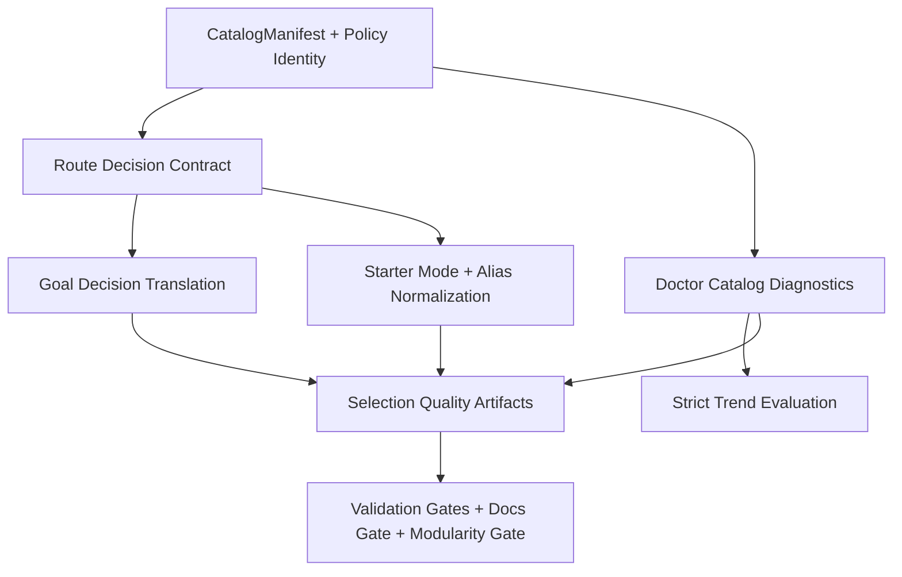

# feat: Skill and Plugin Selection Gold-Standard Upgrade Plan

## Table of Contents

- [Enhancement Summary](#enhancement-summary)
- [Section Manifest (Deepening Pass)](#section-manifest-deepening-pass)
- [Overview](#overview)
- [Problem Frame](#problem-frame)
- [Requirements Trace](#requirements-trace)
- [Scope Boundaries](#scope-boundaries)
- [Context and Research](#context-and-research)
- [Key Technical Decisions](#key-technical-decisions)
- [Open Questions](#open-questions)
- [High-Level Technical Design](#high-level-technical-design)
- [Implementation Units](#implementation-units)
- [Task Graph (id and depends_on)](#task-graph-id-and-depends_on)
- [Execution Control Gates](#execution-control-gates)
- [System-Wide Impact](#system-wide-impact)
- [Risks and Dependencies](#risks-and-dependencies)
- [Documentation and Operational Notes](#documentation-and-operational-notes)
- [Execution Ledger (Planning Mode)](#execution-ledger-planning-mode)
- [Acceptance Checklist](#acceptance-checklist)
- [Sources and References](#sources-and-references)

## Enhancement Summary

**Deepened on:** 2026-04-09  
**Mode:** targeted-confidence  
**Research execution mode:** direct  
**Key areas improved:** execution gate evidence, required-severity enforcement, and closeout verification traceability

- Added explicit weak-section deepening manifest to keep the pass bounded and auditable.
- Tightened execution control gates with concrete evidence signals per phase instead of generic completion statements.
- Strengthened validation closeout to explicitly handle required-vs-warn gate semantics and reduce false release confidence.

## Section Manifest (Deepening Pass)

| Section                 | Confidence gap observed                                                                 | Deepening action                                                                   |
| ----------------------- | --------------------------------------------------------------------------------------- | ---------------------------------------------------------------------------------- |
| Context and Research    | Repo evidence existed but did not explicitly anchor current gate-severity behavior      | Added direct validation-surface evidence from `validate_all` and lifecycle tooling |
| P4 Validation unit      | Closeout criteria did not explicitly enforce required severity for spec-critical checks | Added explicit required check set and artifact-backed gate evidence expectations   |
| Execution Control Gates | Gates were directionally correct but lacked concrete pass/fail evidence handles         | Added explicit evidence targets per gate so readiness decisions are reproducible   |
| Risks and Dependencies  | Missing explicit risk for gate severity mismatch leading to false confidence            | Added severity mismatch risk with mitigation/contingency tied to release posture   |

## Overview

Deliver the wave-1 selection contract from `Docs/specs/2026-04-09-feat-skill-plugin-selection-gold-standard-spec.md` as an execution sequence that closes remaining gaps across intent routing, catalog diagnostics, starter ergonomics, plugin visibility semantics, and validation gates.

Plan mode: `standard-plan`  
Plan depth: `deep`  
Deepening mode: `targeted-confidence`  
Research execution mode: `direct`  
Execution posture: contract-first and verification-first using vertical slices per implementation unit.

## Problem Frame

`agent-skills` already has substantial baseline work in place (`skills route`, plugin state snapshots, and selection contract tooling), but the spec-level gold standard still requires cohesive delivery across all selection surfaces and gates:

- `ask skills goal` must formalize intent guidance and route-to-goal status translation.
- `ask repo doctor-catalog --strict` must enforce deterministic parity and trend behavior.
- Required-surface parity must stay canonical across `README.md`, root `SKILL.md`, `ask skills list`, and route considered metadata.
- Starter-oriented discovery and alias normalization need consistent UX and telemetry.
- Validation must enforce hard gates, trend handling, docs requirements, and `ask_cli_modularity` evidence.

Without an integrated rollout plan, partial compliance can appear green locally while violating spec acceptance items (`SA1-SA25`) in aggregate.

## Requirements Trace

- R1. Route contract remains deterministic and explainable at CLI boundary.
  Trace: spec `SA1`, `SA2`, `SA3`, `SA4`, `SA5`, `SA21`.
- R2. Intent entrypoint returns one recommendation, alternatives, and disambiguation under one contract.
  Trace: spec `SA10`, `SA11`, `SA22`.
- R3. Catalog truth is canonical and parity-locked across required surfaces.
  Trace: spec `SA7`, `SA8`, `SA9`, `SA25`.
- R4. Strict diagnostics use deterministic trend rules and explicit blocking outcomes.
  Trace: spec lifecycle strict-mode semantics and `SA23`, `SA25`.
- R5. Starter-oriented discovery exists and is policy-consistent.
  Trace: spec `SA12`, requirements `R15-R17`.
- R6. Plugin visibility remains read-only with explicit state groups and non-success guidance.
  Trace: spec `SA14`, `SA15`, `SA19`.
- R7. Validation gates and artifacts enforce contract integrity and modularity guardrails.
  Trace: spec `SA16`, `SA17`, `SA18`, `SA20`, `SA23`, `SA24`.
- R8. Onboarding docs include a five-minute success path with required sectioning.
  Trace: spec `SA13`.

## Scope Boundaries

In scope:

- `bin/ask` command surfaces for `skills route`, `skills goal`, starter-oriented discovery, and `repo doctor-catalog` alias/canonical behavior.
- Canonical catalog parity and policy identity enforcement across required surfaces.
- Strict-mode trend computation against canonical history artifacts.
- Read-only plugin lifecycle visibility contract hardening.
- Validation and observability gates including `ask_cli_modularity` and routing-quality artifacts.
- Documentation required by spec (`Docs/agents/5-minute-success-path.md`).

Out of scope:

- Plugin mutation operations (`enable`, `disable`, `refresh`).
- Packaging/installer trust-policy redesign.
- Non-selection product features.
- Runtime algorithm overhaul of the core router beyond contract compliance work.

## Context and Research

### Relevant Code and Patterns

- `bin/ask`
  - central parser/dispatch and alias correction boundary.
- `Infrastructure/scripts/lib/ask/commands/skills.py`
  - existing route behavior; expansion point for goal and starter-mode behavior.
- `Infrastructure/scripts/lib/ask/selection_contract.py`
  - canonical route decision envelope and status mapping baseline.
- `Infrastructure/scripts/lib/ask/commands/repo.py`
  - diagnostic command surface; extension point for `doctor-catalog`.
- `Infrastructure/scripts/lib/ask/commands/plugins.py` and `Infrastructure/scripts/lib/ask/plugin_state.py`
  - read-only plugin lifecycle visibility contract.
- `Infrastructure/scripts/selection_policy.py` and `Infrastructure/scripts/skill_discovery.py`
  - policy identity and discovery/parity source behavior.
- `Infrastructure/scripts/verify_selection_contract.py`, `Infrastructure/scripts/verify_router_schema.py`, `Infrastructure/scripts/test_skill_lifecycle_validation.py`, `Infrastructure/scripts/validate_all.sh`
  - validation and artifact orchestration.
- `Infrastructure/tests/test_ask_cli.py`, `Infrastructure/tests/test_ask_skills_route.py`, `Infrastructure/tests/test_ask_plugins_state.py`, `Infrastructure/tests/fixtures/selection-contract/route-fixtures.json`
  - existing coverage foundation to extend.

### Institutional Learnings

- Keep one canonical catalog truth source and expose drift explicitly rather than masking with fallback behavior.
- Make route/goal failures machine-readable with explicit operator action so humans and agents can recover deterministically.
- Keep CLI orchestration maintainable by preserving parser/dispatch thinness and pushing business logic into command modules and contract helpers.

### External References

- None required for this plan; repository spec and implementation state provide sufficient planning evidence.

### Direct Repository Evidence for Gate Semantics

- `Infrastructure/scripts/validate_all.sh` currently runs `selection-contract` as a required check and writes routing-quality output to run artifacts, while `plan-graphs`, `docs-lint`, `skill-catalog`, and `router-schema` run as warn checks.
- `Infrastructure/scripts/test_skill_lifecycle_validation.py` directly exercises `Infrastructure/scripts/verify_skill_catalog_freshness.py`, so lifecycle parity behavior should be treated as first-class evidence in parity gates.
- `Infrastructure/scripts/README.md` explicitly defines sync/projection ownership under one lane (`sync_skills.sh`, `sync_skills_sandbox_safe.sh`, `skill_catalog.py`), which should remain the planning anchor for catalog projection integrity.

### Spec-Critical Check Set (Wave 1)

- `selection-contract` (`Infrastructure/scripts/verify_selection_contract.py`)
- `router-schema` (`Infrastructure/scripts/verify_router_schema.py --fail-on-sensitive-fields`)
- `skill-catalog` (`Infrastructure/scripts/verify_skill_catalog_freshness.py --strict`)
- `docs-lint` (`Infrastructure/scripts/docs_lint.py` with required section enforcement for `First Validated Outcome`)
- `ask_cli_modularity` (`Infrastructure/scripts/verify_ask_cli_modularity.py`, surfaced as a required aggregate validation check)

## Key Technical Decisions

- Decision 1: Update the existing plan artifact in place rather than creating a new parallel plan.
  - Rationale: this topic already has a canonical date-scoped plan path and should not fork execution history.
- Decision 2: Sequence Infrastructure/catalog/policy parity work before adding goal and strict diagnostics behavior.
  - Rationale: route/goal/doctor correctness depends on stable parity and policy identity substrate.
- Decision 3: Treat strict trend history as a canonical artifact concern, not a best-effort runtime guess.
  - Rationale: spec now requires deterministic blocking outcomes for insufficient history in strict mode.
- Decision 4: Keep plugin state commands read-only and contract-hardening only.
  - Rationale: preserves wave-1 risk boundary while improving observability and operator trust.
- Decision 5: Use one closeout unit for validation gates, docs requirements, and modularity evidence.
  - Rationale: these are release-readiness controls that should converge at the end of sequencing.

## Open Questions

### Resolved During Planning

- Should this execution plan assume greenfield route/plugin scaffolding?
  - Resolution: no. Plan assumes existing baseline implementations and focuses on spec-complete hardening.
- Should strict mode rely on ad-hoc run data?
  - Resolution: no. Use canonical history artifact (`Infrastructure/artifacts/selection-quality/history.jsonl`) only.

### Deferred to Implementation

- Starter-mode command shape (`ask skills list --starter` vs `ask skills starter`) remains open in spec and should be resolved in implementation with explicit backwards-compatibility notes.
- Goal alternatives policy (fixed at two vs policy-configurable) remains open and should be codified without violating v1 contract guarantees.

## High-Level Technical Design

> This section is directional planning guidance, not implementation code.



## Implementation Units

- [x] **P0 / Canonical Catalog and Policy Parity Substrate**

**Goal:** Ensure required selection surfaces derive from one canonical catalog and policy identity before downstream command-surface hardening.

**Requirements:** R1, R3

**Dependencies:** None

**Files:**

- Modify: `Infrastructure/scripts/selection_policy.py`
- Modify: `Infrastructure/scripts/skill_discovery.py`
- Modify: `Infrastructure/scripts/sync_skills.sh`
- Modify: `Infrastructure/scripts/skill_catalog.py`
- Modify: `Infrastructure/scripts/verify_skill_catalog_freshness.py`
- Modify: `Infrastructure/scripts/test_skill_lifecycle_validation.py`
- Projection targets regenerated by tooling: `README.md`, `SKILL.md`
- Test: `Infrastructure/scripts/test_skill_lifecycle_validation.py`

**Approach:**

- Make projection-generator ownership explicit: `Infrastructure/scripts/skill_catalog.py` owns canonical manifest derivation and `Infrastructure/scripts/sync_skills.sh` owns projection refresh into `README.md` and root `SKILL.md`.
- Normalize required-surface count derivation (`README.md`, root `SKILL.md`, `ask skills list`, route considered metadata) to one canonical source.
- Ensure policy identity is exported consistently for route and diagnostics pathways.
- Keep parity failures explicit and blocking in validator outputs.

**Execution note:** Use vertical slices by surface pair (catalog source -> one projected surface -> validator assertion) to avoid horizontal test drift.

**Patterns to follow:**

- Existing policy/discovery coupling in `Infrastructure/scripts/selection_policy.py` and `Infrastructure/scripts/skill_discovery.py`.
- Existing lifecycle gate behavior in `Infrastructure/scripts/test_skill_lifecycle_validation.py`.

**Test scenarios:**

- required surfaces report identical canonical counts;
- parity drift yields deterministic blocking diagnostics;
- policy identity is identical across route and diagnostics payload sources.

**Verification:**

- parity validators fail on intentional surface mismatch and pass when aligned;
- lifecycle validation output includes one shared policy identity evidence.

**Exit criteria:**

- required-surface parity is deterministic and canonicalized;
- policy identity parity is externally verifiable.

- [x] **P1 / Route and Goal Contract Completion**

**Goal:** Complete the route-to-goal contract so intent entrypoint behavior is deterministic and fully spec-compliant.

**Requirements:** R1, R2, R7

**Dependencies:** P0

**Files:**

- Modify: `bin/ask`
- Modify: `Infrastructure/scripts/lib/ask/commands/skills.py`
- Modify: `Infrastructure/scripts/lib/ask/selection_contract.py`
- Modify: `Infrastructure/scripts/verify_selection_contract.py`
- Modify: `Infrastructure/tests/test_ask_cli.py`
- Modify: `Infrastructure/tests/test_ask_skills_route.py`
- Create: `Infrastructure/tests/test_ask_skills_goal.py`
- Create: `Infrastructure/tests/fixtures/selection-contract/goal-fixtures.json`

**Approach:**

- Add canonical `skills goal` surface and alias normalization (`ask goal` -> `ask skills goal`).
- Enforce goal non-success translation to `intent_unresolved` while preserving route-level non-success taxonomy internally.
- Ensure `goal_decision` payload includes required fields (`schema_version`, decision/failure/operator metadata, recommendation/alternatives/disambiguation).
- Extend fixture validation to include goal cases and route-to-goal translation behavior.

**Execution note:** Add one behavior slice at a time (resolved, ambiguity-derived unresolved, no-candidate unresolved) with matching fixture assertions.

**Patterns to follow:**

- Existing `CallResult`/`ErrorObject` envelope patterns in `bin/ask`.
- Existing route contract assembly flow in `Infrastructure/scripts/lib/ask/selection_contract.py`.

**Test scenarios:**

- goal resolved output returns one recommendation and up to two alternatives;
- goal non-success outputs always map to `intent_unresolved` with disambiguation prompts;
- alias correction preserves canonical command guidance in normal and robot mode.

**Verification:**

- route and goal schemas validate under fixture runner;
- CLI tests cover canonical and alias invocations;
- non-success outputs include non-empty `operator_action`.

**Exit criteria:**

- `skills goal` contract and alias behavior meet `SA10`, `SA11`, `SA21`, `SA22`;
- goal fixtures are deterministic and gate-enforced.

- [x] **P2 / Catalog Doctor and Strict-Mode Determinism**

**Goal:** Deliver `ask repo doctor-catalog` with strict-mode semantics and deterministic trend-source behavior.

**Requirements:** R3, R4, R7

**Dependencies:** P0

**Files:**

- Modify: `bin/ask`
- Modify: `Infrastructure/scripts/lib/ask/commands/repo.py`
- Modify: `Infrastructure/scripts/verify_skill_catalog_freshness.py`
- Modify: `Infrastructure/scripts/verify_selection_contract.py`
- Modify: `Infrastructure/scripts/test_skill_lifecycle_validation.py`
- Create: `Infrastructure/tests/test_ask_repo_doctor_catalog.py`
- Modify: `Infrastructure/tests/test_ask_cli.py`
- Create: `Infrastructure/artifacts/selection-quality/history.jsonl` (bootstrap artifact contract)

**Approach:**

- Implement canonical `repo doctor-catalog` output contract and alias normalization (`ask doctor catalog` -> `ask repo doctor-catalog`).
- Enforce strict-mode escalation rules, including missing projection/policy stamps and soft-gate deterioration breaches.
- Compute trend state exclusively from `Infrastructure/artifacts/selection-quality/history.jsonl` and block strict outcomes when history is insufficient.
- Define ownership semantics for `Infrastructure/artifacts/selection-quality/history.jsonl`: append-only per completed validation run, oldest-first retention pruning by explicit cap, and schema-preserving writes only through validation/reporting pathways.

**Execution note:** Build strict-mode behavior with explicit synthetic-history fixtures before wiring to live history updates.

**Patterns to follow:**

- Existing repo command diagnostic formatting in `Infrastructure/scripts/lib/ask/commands/repo.py`.
- Existing strict/degraded handling style in `Infrastructure/scripts/verify_skill_catalog_freshness.py`.

**Test scenarios:**

- default mode validates required surfaces only;
- strict mode blocks on missing projections/policy stamps;
- strict mode returns `trend_insufficient_history` with blocking reason when history is below threshold.

**Verification:**

- doctor-catalog contract tests cover default and strict behavior;
- strict trend evaluation is deterministic across replayed history snapshots;
- history artifact writes follow append-only + bounded-retention semantics and preserve schema-valid entries after prune operations.

**Exit criteria:**

- `doctor-catalog` and strict semantics satisfy `SA9`, `SA23`, `SA25`;
- canonical history dependency is explicit and test-covered.

- [x] **P3 / Starter Discovery and Plugin Visibility Hardening**

**Goal:** Finalize starter-mode UX and read-only plugin lifecycle contract alignment.

**Requirements:** R5, R6, R7

**Dependencies:** P0

**Files:**

- Modify: `bin/ask`
- Modify: `Infrastructure/scripts/lib/ask/commands/skills.py`
- Modify: `Infrastructure/scripts/lib/ask/commands/plugins.py`
- Modify: `Infrastructure/scripts/lib/ask/plugin_state.py`
- Modify: `Infrastructure/tests/test_ask_cli.py`
- Modify: `Infrastructure/tests/test_ask_plugins_state.py`
- Create: `Infrastructure/tests/test_ask_skills_starter.py`

**Approach:**

- Add starter-oriented discovery behavior using stable-signal archetype filtering and deterministic ordering.
- Keep plugin visibility commands strictly read-only and enforce explicit non-success guidance for degraded plugin doctor output.
- Ensure alias and canonical command guidance remain consistent in help/correction output.

**Execution note:** Implement starter filtering independently from ranking logic to keep regression radius small.

**Patterns to follow:**

- Existing plugin snapshot grouping in `Infrastructure/scripts/lib/ask/plugin_state.py`.
- Existing skills list command shape in `Infrastructure/scripts/lib/ask/commands/skills.py`.

**Test scenarios:**

- starter mode returns deterministic prioritized subset by archetype;
- plugin `list/status/doctor` expose required state groups without filesystem mutation side effects;
- plugin doctor degraded paths include blockers and operator guidance.

**Verification:**

- starter-mode tests verify deterministic candidate ordering and bounded output scope;
- plugin-state tests verify read-only behavior and expected degraded contract shape.

**Exit criteria:**

- `SA12`, `SA14`, `SA15`, and `SA19` are covered by passing deterministic tests;
- no mutation side effects are introduced on plugin visibility commands.

- [x] **P4 / Validation, Modularity, and Onboarding Closeout Gates**

**Goal:** Enforce final quality gates and docs criteria required for release-ready status.

**Requirements:** R7, R8

**Dependencies:** P1, P2, P3

**Files:**

- Modify: `Infrastructure/scripts/validate_all.sh`
- Modify: `Infrastructure/scripts/verify_selection_contract.py`
- Modify: `Infrastructure/scripts/verify_router_schema.py`
- Modify: `Infrastructure/scripts/verify_ask_cli.py`
- Modify: `Infrastructure/scripts/verify_ask_cli_final.py`
- Create or Modify: `Infrastructure/scripts/verify_ask_cli_modularity.py`
- Modify: `Infrastructure/scripts/docs_lint.py`
- Modify: `Infrastructure/docs-policy.json`
- Create: `Infrastructure/config/schemas/selection-gate-severity.v1.schema.json`
- Create: `Docs/agents/5-minute-success-path.md`
- Modify: `Docs/specs/2026-04-09-feat-skill-plugin-selection-gold-standard-spec.md` (only if command-shape decisions require spec closeout updates)
- Modify: `Infrastructure/tests/test_ask_cli.py`
- Modify: `Infrastructure/tests/test_ask_skills_route.py`
- Create or Modify: `Infrastructure/tests/test_ask_repo_doctor_catalog.py`
- Create or Modify: `Infrastructure/tests/test_ask_skills_goal.py`
- Create or Modify: `Infrastructure/tests/test_ask_skills_starter.py`
- Create or Modify: `Infrastructure/tests/test_ask_plugins_state.py`

**Approach:**

- Promote the wave-1 spec-critical check set (`selection-contract`, `router-schema`, `skill-catalog --strict`, docs gate, `ask_cli_modularity`) to `required` severity in aggregate validation.
- Add/confirm required validation checks for selection contract, strict diagnostics behavior, and canonical `ask_cli_modularity` evidence.
- Ensure routing-quality artifacts encode hard/soft-gate outcomes and are persisted for trend tracking.
- Emit canonical G4 severity evidence artifact at `Infrastructure/artifacts/validation/latest/selection-gate-severity.json` from aggregate validation, including check name, mode (`required|warn`), result, and rationale, validated against `Infrastructure/config/schemas/selection-gate-severity.v1.schema.json`.
- Treat persistent validation output as the release-readiness source of truth; ephemeral runs are non-authoritative for G4 closeout evidence.
- Author onboarding doc with required `First Validated Outcome` section and validate through docs gate.

**Execution note:** Gate each closeout check independently and fail fast on first required failure.

**Patterns to follow:**

- Existing required/warn check structure in `Infrastructure/scripts/validate_all.sh`.
- Existing docs-lint integration approach in repo validation scripts.

**Test scenarios:**

- required checks fail when `ask_cli_modularity` evidence is absent;
- validation fails when routing-quality artifact is missing or schema-invalid;
- validation fails when `selection-gate-severity.json` is missing, schema-invalid, or reports a spec-critical check outside `required`;
- validation fails when required check `ask-cli-modularity` is absent from aggregate validation output;
- docs gate fails if `First Validated Outcome` section is missing;
- CLI and command-surface tests (`Infrastructure/tests/test_ask_cli.py`, route/goal/starter/doctor/plugin suites) fail when required payload fields, alias guidance, or strict-mode blockers regress.

**Verification:**

- aggregate validation emits required artifacts and passes with no required failures;
- docs and modularity checks are reflected in run output and release evidence;
- release-readiness evidence comes from persistent validation output and includes `Infrastructure/artifacts/validation/latest/selection-gate-severity.json`, confirming every wave-1 spec-critical check is `required`.

**Exit criteria:**

- `SA13`, `SA16`, `SA17`, `SA18`, `SA20`, `SA23`, `SA24` are gate-enforced;
- `SA25` strict-mode coverage remains enforced under required validation severity;
- plan closeout is backed by deterministic validation evidence.

## Task Graph (id and depends_on)

```yaml
tasks:
  - id: P0
    title: Canonical catalog and policy parity substrate
    depends_on: []
  - id: P1
    title: Route and goal contract completion
    depends_on: [P0]
  - id: P2
    title: Catalog doctor and strict-mode determinism
    depends_on: [P0]
  - id: P3
    title: Starter discovery and plugin visibility hardening
    depends_on: [P0]
  - id: P4
    title: Validation, modularity, and onboarding closeout gates
    depends_on: [P1, P2, P3]
```

## Execution Control Gates

- **G0 / Canonical Parity Gate:** Do not start `P1-P3` until required-surface parity and policy identity evidence are stable and reproducible in lifecycle and catalog-freshness validation outputs.
- **G1 / Route-Goal Contract Gate:** Do not mark `P1` complete until non-success translation and operator-action semantics are fixture-validated across route and goal suites.
- **G2 / Strict Diagnostics Gate:** Do not mark `P2` complete until strict-mode insufficient-history and deterioration paths are deterministic, blocking, and replay-stable against canonical history artifacts.
- **G3 / Read-Only Integrity Gate:** Do not mark `P3` complete until plugin visibility commands prove zero mutation side effects and degraded-doctor outputs include actionable remediation.
- **G4 / Release Readiness Gate:** Do not close `P4` until persistent validation output refreshes `Infrastructure/artifacts/validation/latest/selection-gate-severity.json` and confirms all wave-1 spec-critical checks are `required` and passing, alongside selection-contract artifacts, modularity checks, and docs criteria.

## System-Wide Impact

- **Interaction graph:** `bin/ask` parser/alias layer and command modules (`skills`, `repo`, `plugins`) become one coherent contract surface.
- **Error propagation:** route/goal/Infrastructure/catalog/plugin non-success states use deterministic status and operator-action paths.
- **State lifecycle risks:** strict trend history and parity sources move from implicit assumptions to explicit managed artifacts.
- **API surface parity:** canonical and alias command behaviors stay synchronized for humans and agent callers.
- **Integration coverage:** fixture and lifecycle gates verify cross-surface behavior beyond per-module unit tests.

## Risks and Dependencies

| Risk                                   | Trigger                                                           | Detection signal                                                                  | Mitigation                                                                                         | Contingency                                                                            |
| -------------------------------------- | ----------------------------------------------------------------- | --------------------------------------------------------------------------------- | -------------------------------------------------------------------------------------------------- | -------------------------------------------------------------------------------------- |
| Route/goal translation drift           | Goal surface evolves independently from route contract            | Goal tests pass but failure taxonomy differs from route constraints               | Keep goal mapping logic centralized and fixture-validated in one contract path                     | Temporarily gate `skills goal` behind strict validation failure until mapping is fixed |
| Strict-mode false positives            | History artifact missing, stale, or malformed                     | `doctor-catalog --strict` blocks unexpectedly across environments                 | Enforce canonical history path, schema validation, and deterministic insufficient-history handling | Treat history corruption as explicit blocking diagnostic with remediation guidance     |
| Catalog projection mismatch recurrence | Required surfaces continue deriving counts from divergent paths   | parity diagnostics flap across runs                                               | Tie all required surfaces to canonical manifest generation and projection pipeline                 | Block downstream phases until parity drift is resolved                                 |
| Validation severity mismatch           | Spec-critical checks remain warn-only in release lane             | `validate_all` appears green on required checks while spec outcomes still degrade | Promote wave-1 spec-critical checks to `required` and emit canonical severity evidence artifact    | Block release-ready status until required severity and artifact evidence are aligned   |
| Parser/dispatch sprawl in `bin/ask`    | New actions add business logic to top-level file                  | modularity checks regress or become noisy                                         | Keep behavior in command modules and verify with `ask_cli_modularity` gate                         | Roll back latest parser edits and reintroduce via module wiring only                   |
| Docs gate lag                          | Onboarding doc lands without required section or drifts over time | docs lint or validation gate fails during release prep                            | Add docs gate assertion tied to required section heading                                           | Hold release-ready status until docs requirement is restored                           |

## Documentation and Operational Notes

- Preserve the existing plan path as the canonical execution artifact for this wave.
- Maintain canonical artifact history at `Infrastructure/artifacts/selection-quality/history.jsonl` and ensure retention policy is implemented with deterministic append/rotation behavior.
- Keep release evidence focused on required gates and explicit blocker reasons; wave-1 spec-critical checks must not rely on warn-only posture.
- Rollback posture: disable newly added action wiring or strict-mode pathways selectively while preserving existing stable command surfaces.

## Execution Ledger (Planning Mode)

STEP_ID | status (pending|in_progress|completed) | owner | evidence
P0 | completed | codex | Canonical parity substrate enforced across route/list/doctor surfaces with policy-identity parity and deterministic drift diagnostics.
P1 | completed | codex | `skills goal` command + alias normalization landed with deterministic goal contract and fixture-backed route-to-goal translation.
P2 | completed | codex | `repo doctor-catalog` strict-mode contract implemented with canonical history-based trend semantics and deterministic blocking outcomes.
P3 | completed | codex | Starter discovery and plugin read-only contract hardening delivered with deterministic ordering and non-success operator guidance.
P4 | completed | codex | Validation gates promoted and passing in persistent lane (`Infrastructure/artifacts/validation/latest/selection-gate-severity.json`, `Infrastructure/artifacts/validation/latest/routing-quality.json`).

## Acceptance Checklist

- [x] AC1 (R1): Route outputs satisfy deterministic and explainable `SelectionDecision` contract fields. Trace: `SA1-SA5`, `SA21`.
- [x] AC2 (R2): Goal surface returns required recommendation/alternative/disambiguation payload and deterministic non-success translation. Trace: `SA10`, `SA11`, `SA22`.
- [x] AC3 (R3): Required catalog surfaces are parity-locked to one canonical manifest source. Trace: `SA7`, `SA8`, `SA9`.
- [x] AC4 (R4): Strict diagnostics block on trend deterioration and insufficient history using canonical history source. Trace: `SA23`, `SA25`.
- [x] AC5 (R5): Starter-oriented discovery mode is deterministic and policy-consistent. Trace: `SA12`.
- [x] AC6 (R6): Plugin state `list/status/doctor` remain read-only and expose required state groups. Trace: `SA14`, `SA15`.
- [x] AC7 (R6): Plugin-skill shadowing remains blocking in wave 1 with actionable remediation signals. Trace: `SA19`.
- [x] AC8 (R7): Selection fixtures and lifecycle validations fail fast on contract regressions. Trace: `SA16`, `SA18`.
- [x] AC9 (R7): Routing-quality artifact includes required metrics and hard/soft-gate outcomes. Trace: `SA17`, `SA23`, `SA24`.
- [x] AC10 (R7): Repo validation output includes canonical `ask_cli_modularity` gate evidence. Trace: `SA20`.
- [x] AC11 (R8): `Docs/agents/5-minute-success-path.md` exists with required `First Validated Outcome` section and passes docs gate. Trace: `SA13`.
- [x] AC12 (R1-R8): Aggregate release-readiness gate passes with no required failures across route, goal, catalog, plugin, docs, and modularity checks, and no wave-1 spec-critical checks left warn-only.
- [x] AC13 (R7-R8): `Infrastructure/artifacts/validation/latest/selection-gate-severity.json` exists, is schema-valid, and records all wave-1 spec-critical checks as `required`.

## Sources and References

- Governing requirements: `docs/brainstorms/2026-04-09-skill-plugin-selection-gold-standard-requirements.md`
- Governing spec: `Docs/specs/2026-04-09-feat-skill-plugin-selection-gold-standard-spec.md`
- Plan artifact template: `.agents/plugins-runtime/cache/agent-skills-local/harness-engineering/local/skills/ce-plan/Infrastructure/references/plan-artifacts.md`
- CLI entrypoint: `bin/ask`
- Skills commands: `Infrastructure/scripts/lib/ask/commands/skills.py`
- Repo diagnostics commands: `Infrastructure/scripts/lib/ask/commands/repo.py`
- Plugins commands: `Infrastructure/scripts/lib/ask/commands/plugins.py`
- Route contract builder: `Infrastructure/scripts/lib/ask/selection_contract.py`
- Plugin state collector: `Infrastructure/scripts/lib/ask/plugin_state.py`
- Policy and discovery: `Infrastructure/scripts/selection_policy.py`, `Infrastructure/scripts/skill_discovery.py`
- Validators: `Infrastructure/scripts/verify_selection_contract.py`, `Infrastructure/scripts/verify_router_schema.py`, `Infrastructure/scripts/test_skill_lifecycle_validation.py`, `Infrastructure/scripts/validate_all.sh`
- CLI modularity validators: `Infrastructure/scripts/verify_ask_cli.py`, `Infrastructure/scripts/verify_ask_cli_final.py`
- Modularity and gate-severity schema surfaces: `Infrastructure/scripts/verify_ask_cli_modularity.py`, `Infrastructure/config/schemas/selection-gate-severity.v1.schema.json`
- Validation and sync runbook: `Infrastructure/scripts/README.md`
- Existing tests and fixtures: `Infrastructure/tests/test_ask_cli.py`, `Infrastructure/tests/test_ask_skills_route.py`, `Infrastructure/tests/test_ask_plugins_state.py`, `Infrastructure/tests/fixtures/selection-contract/route-fixtures.json`
