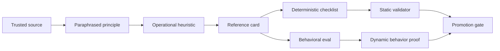
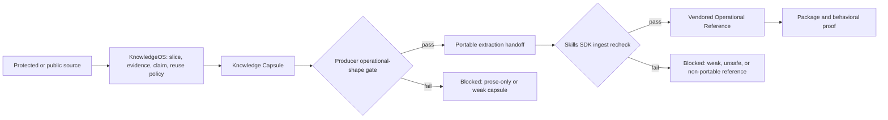

# Operational reference contract for Skills SDK

Status: the narrow operational-reference ingest contract is implemented; the
full reference-card schema below remains design context.

## Outcome

Make `reference/*.md` files behave like small, evidence-backed tools for a
skill rather than decorative prose. A reference is ready only when an agent
can select it, apply its rules, reject its anti-patterns, and produce
observable evidence that the reference changed behavior.

## Source context

- User-provided conversation: protected local design input; its private conversation URI is intentionally not retained in this repository.
- Existing SDK construction contract:
  `/Users/jamiecraik/dev/agent-skills/docs/reference/skills-sdk-skill-construction-contract.md`.
- Existing package authoring contract:
  `/Users/jamiecraik/dev/agent-skills/docs/reference/skills-sdk-authoring-contract.md`.
- Existing quality rubric:
  `/Users/jamiecraik/dev/agent-skills/docs/reference/skills-sdk-gold-standard-rubric.md`.
- Existing evaluator harness:
  `/Users/jamiecraik/dev/agent-skills/Infrastructure/EVALUATION/eval-harness.md`.

The conversation is treated as user-supplied design input, not as repository
truth. Current repository contracts remain the owner of implementation details.

## Core model



The source supplies authority. The reference supplies the operational
interpretation. The validator checks structure and traceability. The eval
checks whether the reference actually changes the agent's work.

## Reference-card contract

Each `reference/*.md` should have a stable frontmatter block and the following
sections. The exact YAML schema belongs in the package's existing
`references/contract.yaml`; this is the intended semantic shape.

```yaml
schema_version: 1
kind: operational_reference
id: <stable-slug>
title: <specific concept>
skill: <owning-skill>
status: draft|active|deprecated
scope:
  applies_when: <routing condition>
  does_not_apply_when: <nearest boundary>
sources:
  - id: <source-id>
    citation: <URL, book, paper, repository, or protected-source pointer>
    locator: <page, chapter, section, commit, or line range when available>
    relationship: primary|supporting|counterexample
claims:
  - id: <claim-id>
    statement: <paraphrased, source-grounded claim>
    evidence: <what supports it>
rules:
  - id: <rule-id>
    when: <condition>
    must: <observable action>
    rationale: <why this rule exists>
    evidence: <claim-id or source id>
good_examples: []
bad_examples: []
checklist: []
failure_modes: []
eval_bindings: []
copyright:
  mode: paraphrase_and_cite
  quoted_words: 0
```

The frontmatter is a contract shape, not permission to copy a source. Source
material should be paraphrased, cited precisely, and converted into original
rules and examples. Short quotations, when necessary, must stay within the
repository's copyright policy and carry a locator.

## Citations and protected-source policy

A citation answers **where did this claim come from?** It does not answer
**may this text be copied, redistributed, or used outside the original access
right?** Treat those as distinct fields and gates.

For a book PDF, give the reference a private source record and cite the exact
claim at the point where it is used:

```yaml
sources:
  - id: pragmatic-programmer-2e-orthogonality
    type: book_pdf
    bibliographic_citation:
      authors: ["Andrew Hunt", "David Thomas"]
      title: "The Pragmatic Programmer"
      edition: "2nd"
      publisher: "Addison-Wesley"
      year: 2019
      isbn: "978-0135957059"
    locator:
      kind: chapter_and_page
      value: "Chapter <n>, pp. <x>-<y>"
      status: verified|needs_recheck
    access:
      basis: owned_copy|library_licence|publisher_permission|public_domain
      source_record: protected://sources/<id>
    rights:
      status: protected|public_domain|licensed
      package_use: paraphrase_only|short_quote_with_review|licensed_excerpt
      redistribution: prohibited|licence_required|allowed_under_licence
      quote_word_count: 0
    derived_claim_ids: [<claim-id>]
```

`protected://` is a logical pointer, not a public URL or a local filesystem
path. The source archive can retain the PDF, purchase/licence evidence, hash,
and notes about how the material was accessed. The ordinary skill package only
needs the bibliographic record, exact locator, rights classification, and the
paraphrased operational claim.

### Citation rules

1. Cite the source actually inspected, not a vague book title remembered from
   elsewhere.
2. Give a durable bibliographic citation: author(s), title, edition, publisher,
   year, and ISBN/DOI/URL where available.
3. Give a locator precise enough for another authorised reader to check the
   claim: edition plus chapter/page for books; section/paragraph for web pages;
   commit/path/line for repositories; figure/table for papers.
4. Attach a source ID to every derived claim and attach that claim ID to every
   rule it justifies. A bibliography alone is not evidence mapping.
5. Quote by exception, not as the default. The reference should normally use a
   short paraphrase followed by original heuristics, examples, anti-patterns,
   and checklist items.
6. Preserve the difference between a source claim and a local rule. For
   example, a book may support an architectural principle; the reference must
   state the local, testable review rule derived from it.
7. Never include a whole chapter, a long sequential extract, scans of pages,
   raw PDF text, or enough material for the reference to substitute for the
   book.
8. Do not bypass DRM, access controls, licence restrictions, or a source's
   terms. If access is unclear, record `blocked_rights_unknown` rather than
   extracting it into the package.
9. Keep protected PDFs, raw highlights, and extraction logs out of normal skill
   retrieval and release artifacts. Route to a protected archive only.
10. Recheck citations when changing editions, revising a major claim, or
    promoting a reference to a public/release distribution.

### Citation-specific validation

The static validator should fail when a book-derived active reference has:

- no author/title/edition/year or no verifiable locator;
- a source claim without a `derived_claim_id` mapping;
- a rule whose stated source does not support the claimed rule;
- `quote_word_count > 0` but no quotation marker, locator, and rights review;
- a protected source classified as redistributable without an identified
  licence or permission;
- a protected source body, raw PDF text, local archive path, credential, or
  purchase/licence token embedded in the package;
- `needs_recheck` citation status when the card is being promoted to `active`;
- an output that reproduces source prose instead of applying the paraphrased
  rule; or
- citation fields that are present but unbound to a rule, checklist item, or
  eval case.

### Copyright boundary

For UK material, limited copying for non-commercial research or private study,
and quotation/criticism/review, may be permitted only in specific
fair-dealing circumstances and often requires sufficient acknowledgement.
Whether a use is fair is case-specific; a citation alone does not decide it.
For US-facing use, fair use is likewise a fact-specific four-factor analysis,
not a fixed word or page allowance. Treat `paraphrase_only` as the safe default
for protected book PDFs and get a licence or legal advice before a public,
commercial, or excerpt-heavy distribution.

## What each section must do

| Section | Enforcement question | Failure if absent or weak |
| --- | --- | --- |
| `scope` | Can the agent tell when to load this card and when not to? | The card is broad, ambiguous, or always loaded. |
| `sources` | Can a reviewer trace the claim to its owner? | The card presents unsupported expertise. |
| `claims` | Is the source idea separated from the local interpretation? | Citation becomes decoration. |
| `rules` | Does each rule change an observable decision? | The card is advice without steering power. |
| `rationale` | Does the agent know why the rule exists? | The rule is applied blindly or over-generalized. |
| `good_examples` | Is there a positive target the agent can imitate? | The desired behavior remains abstract. |
| `bad_examples` | Can the agent recognize a failure or tempting shortcut? | The card cannot defend against predictable mistakes. |
| `checklist` | Can the agent verify the rule before completion? | The reference remains prose-only. |
| `failure_modes` | Does the card state what to do when the rule cannot be applied? | Silent guessing or fallback. |
| `eval_bindings` | Is there a scenario that proves the card matters? | No evidence that the reference improves the skill. |

## Static enforcement

Extend the existing package verifier rather than adding a separate reference
linter. A strict reference check should fail closed for:

1. missing or invalid frontmatter;
2. missing `schema_version`, stable `id`, owner skill, scope, source, rule,
   checklist, or eval binding;
3. source entries without a citation and locator appropriate to the source;
4. claims, rules, examples, or checklist entries that are empty, duplicated, or
   not attached to an ID;
5. rules without a `when`, observable `must`, rationale, and claim/source link;
6. checklist items that cannot be mapped to a rule or an observable output;
7. references that are not routed from `SKILL.md` or the package contract;
8. broken relative links, symlink escapes, unsupported external paths, or
   credentials and bearer-like tokens;
9. excessive verbatim source text or missing copyright mode;
10. duplicate meaning that already exists in `SKILL.md` or another reference;
11. no declared failure mode for a rule with a known exception; and
12. an eval binding that points to a missing scenario or claim ID.

The existing SDK contract already provides nearby enforcement surfaces:

- `reference_routes[]` checks routing, `read_when`, package locality, and
  scenario binding;
- `mutation_targets[].removal_test` supports deletion/ablation proof;
- `claim_ids` and claim-to-evidence coverage bind scenarios to claims;
- progressive-disclosure checks protect the entrypoint from reference sprawl;
- construction pruning checks target duplication, sediment, and no-op prose.

The new reference-card fields should extend these surfaces, not duplicate them.

## Dynamic enforcement

Every active reference needs at least one paired behavioral case:

- **with-reference case:** the skill receives the reference and must apply its
  rule, cite the relevant decision, and complete the checklist;
- **without-reference or removal case:** the same scenario runs without the
  reference, or with one rule removed, to test whether the line/card has
  measurable lift;
- **negative case:** a tempting counterexample should be rejected or repaired;
- **boundary case:** the agent should refuse, defer, or route elsewhere when
  `applies_when` is false;
- **source-integrity case:** the output should preserve citation/provenance and
  not reproduce the source.

The scenario result should record at least:

```yaml
reference_behavior:
  reference_id: <stable-slug>
  baseline_type: no_reference|reference_removed|neutral
  selected: true|false
  rules_applied: [<rule-id>]
  checklist_observed: [<check-id>]
  source_cited: true|false
  anti_pattern_rejected: true|false
  skill_lift: positive|neutral|negative|unknown
  regression: true|false
  evidence: [<artifact or trace path>]
```

A static pass must not be called behavioral readiness. A reference can be
well-shaped and still fail to improve the skill.

## Promotion policy

Use these states:

- `draft`: structure may be incomplete; never used for release claims;
- `candidate`: static contract passes and behavioral cases are present;
- `active`: candidate behavior passes with no regression against the approved
  baseline and the owning skill routes it;
- `blocked`: a required source, citation, scenario, artifact, or runtime lane
  is unavailable;
- `deprecated`: retained for provenance but no longer routed.

Promotion is blocked when a reference is only prose, has no current source
anchor, has no applicable/negative example, has no checklist, or has no
behavioral proof. `unknown` is not a pass.

## Authoring loop

1. Start from a bounded source and extract one principle or pattern.
2. Write the local paraphrase, scope, rationale, good/bad examples, and
   checklist; do not paste the source.
3. Bind every rule to a claim and every checklist item to an observable output.
4. Add the with/without, negative, boundary, and source-integrity cases.
5. Run package verification and the smallest reference behavior case.
6. Run the deletion/ablation comparison. If removing the rule changes nothing,
   delete it, merge it, or mark it as unsupported.
7. Promote only after the relevant skill evals and evidence lanes pass.

## Non-goals

- This does not make a reference an authoritative replacement for the cited
  book, paper, or external repository.
- This does not prove the skill is an expert in the whole domain.
- This does not make a citation current without rechecking the owner source.
- This does not replace runtime, hosted, Tessl, or release evidence.
- This does not require copying private PDFs, raw transcripts, or protected
  source material into ordinary skill retrieval.

## KnowledgeOS and Skills SDK alignment

The two repositories use one shared boundary term: **Operational Reference**.
It is a KnowledgeOS Knowledge Capsule that Skills SDK may vendor into
`references/*.md` only when it contains either:

- `## Claim Cards` plus at least one of `## Principles`, `## Heuristics`,
  `## Checklists`, `## Rubrics`, `## Lenses`, or `## Eval Scenarios`; or
- the complete operational playbook: `## Core Thesis`, `## Principles`,
  `## Guidance`, `## Decision Rules`, `## Output Shape`, `## Examples`,
  `## Recovery`, `## Validation Ideas`, and `## Boundaries`.

This is intentionally narrower than the aspirational card schema above. It is
the first executable compatibility contract and can be strengthened without a
fleet-wide migration.

| Concern | KnowledgeOS owns | Skills SDK owns |
| --- | --- | --- |
| Source identity | source reference, bounded locator, digest | consumes only portable identifiers and claims |
| Protected material | access basis, rights/reuse policy, quote limits, no raw-body export | rejects raw bodies and local absolute paths; does not reinterpret rights |
| Claim quality | source slice through claim card/canonical asset lineage | package-local routing and claim/eval bindings |
| Reference shape | generates and validates the Knowledge Capsule | independently rechecks the same operational sections before ingest |
| Behavioral proof | supplies validation ideas and portable eval assets | runs package, behavioral, deletion, runtime, and promotion evidence lanes |

A **Citation Record** proves traceability. It does not prove permission to
quote, copy, redistribute, or publish. For book PDFs and similar protected
sources, KnowledgeOS should retain bibliographic identity, an exact locator,
access basis, and reuse classification; the Skills SDK handoff should contain
paraphrased claims and a stable source identifier, never the raw PDF body or a
machine-local path.



## Implemented first slice

The compatibility slice now uses the existing KnowledgeOS capsule validator
instead of adding a parallel frontmatter system:

1. KnowledgeOS already rejects weak handoff capsules through its kernel.
2. Skills SDK ingest now independently applies the same two accepted section
   shapes to every manifest-declared capsule.
3. The Skills SDK fixture now represents a valid structured reference, and a
   new negative fixture proves prose-only Markdown is blocked.
4. Both repositories define **Operational Reference** and **Citation Record**
   with the same ownership and rights boundary.

The representative `improve-agent-native` slice now also carries behavioral
proof. Its eval case names `references/knowledge-os-capsule-design.md` through a
package-local `reference_paths` field. The isolated evaluator embeds that exact
reference alongside `SKILL.md`, rejects absolute paths, traversal, symlinks,
missing files, and package escapes, and stops before model execution if the
declared reference has been removed. The live case presents a polished handoff
that satisfies the ordinary operational headings but omits the stricter source
model, relationship, downstream-integration, failure-mode, and eval surfaces;
with the reference loaded, the case passes by rejecting the handoff for those
specific omissions.

This proves positive behavior for one reference plus a deterministic deletion
boundary. It does not yet prove fleet-wide lift or live Tessl behavior. The
next expansion should be a bounded inventory of high-value reference routes,
adding `reference_paths` only to cases whose behavior genuinely depends on
those files.

## Bounded high-value route inventory

The first expansion is complete for `improve-agent-native`. The pre-existing
readiness-rubric route and five additional routes were selected because each
governs a consequential decision already covered by a focused scenario:

| Route | Selected reference | Dependent scenario | Behavior attributed to the reference |
| --- | --- | --- | --- |
| Readiness assessment | `references/harness-readiness-rubric.md` | `happy-proof-loop-gap`, `edge-no-validation-entrypoint` | Preserves named assessment dimensions and typed proof gaps when executable validation is missing. |
| AGENTS hierarchy | `references/agents-md-best-practices.md` | `happy-agents-md-audit` | Preserves root, nested, and supplemental authority when choosing keep, move, or delete. |
| Documentation freshness | `references/docs-structure-and-maintenance.md` | `edge-docs-freshness` | Requires ownership, freshness, archive, backlink, and successor evidence before deletion. |
| Agent action parity | `references/agent-native-primitives.md` | `edge-ui-action-without-agent-capability` | Treats UI actions without matching agent capabilities and outcome proof as readiness gaps. |
| Evidence lanes | `references/harness-evidence-boundary.md` | `eval.harness.local-pass-ci-unknown` | Keeps local validation separate from hosted CI, review, mergeability, and queue evidence. |
| PR lifecycle | `references/harness-pr-lifecycle.md` | `eval.harness.pr-lifecycle-stops-before-main` | Rejects an opened PR as completion without an independent delivery gate or lifecycle receipt. |

Together with `references/knowledge-os-capsule-design.md`, eight scenarios now
load one exact high-value reference each across seven routes. All other
references remain available through progressive-disclosure routing and are
intentionally absent from these prompts until a scenario demonstrates a real
behavioral dependency.
