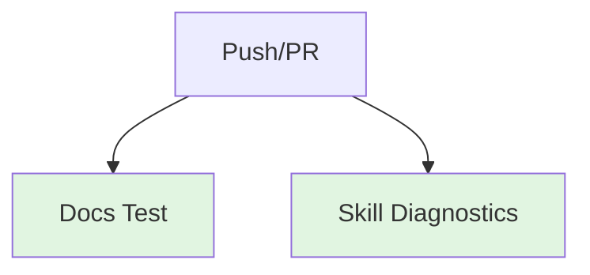

# CTW: CI Tests Workflow

Fast smoke tests for docs and skills.

---

## ABBREVIATION MAP

| Abbr | Meaning |
|------|---------|
| CTW | CI tests workflow |
| DL | Docs lint |
| SD | Skill diagnostics |

---

## TRIGGER MATRIX

| EVENT | BRANCH |
|-------|--------|
| Push | `main` |
| PR | Any |

---

## JOB PIPELINE



---

## PERMISSIONS

```yaml
permissions:
  contents: read
```

---

## JOB: DOCS TEST

| CONFIG | VALUE |
|--------|-------|
| Runner | `ubuntu-latest` |
| Python | `3.11` |
| Command | `python3 Infrastructure/scripts/validation-and-linting/docs_lint.py --mode warn --config Infrastructure/docs-policy.json` |

---

## JOB: SKILL DIAGNOSTICS

| CONFIG | VALUE |
|--------|-------|
| Runner | `ubuntu-latest` |
| Python | `3.11` |
| Command | `python3 Infrastructure/scripts/lifecycle-and-sync/diagnose_skill.py --all` |

---

## LOCAL COMMANDS

```bash
# Docs lint
python3 Infrastructure/scripts/validation-and-linting/docs_lint.py --mode warn --config Infrastructure/docs-policy.json

# Skill diagnostics
python3 Infrastructure/scripts/lifecycle-and-sync/diagnose_skill.py --all
```

---

## CI REFERENCE

Workflow: `.github/workflows/ci-tests.yml`

---

## RELATED

- [Docs lint script](/Infrastructure/scripts/validation-and-linting/docs_lint.py)
- [Skill diagnostics](/Infrastructure/scripts/lifecycle-and-sync/diagnose_skill.py)
