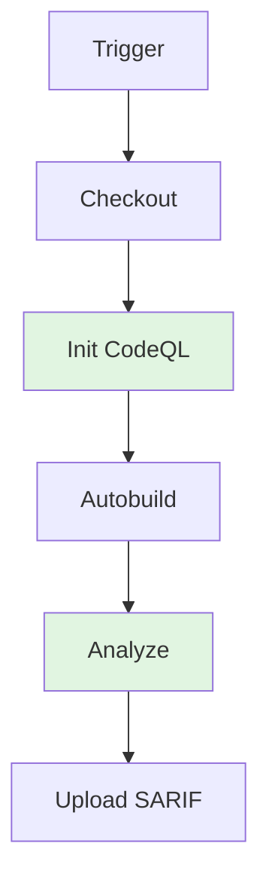

# CQW: CodeQL Workflow

Static analysis with CodeQL for JavaScript and Python.

---

## ABBREVIATION MAP

| Abbr | Meaning |
|------|---------|
| CQW | CodeQL workflow |
| CQL | CodeQL language |
| S+Q | Security-and-quality queries |
| SARIF | Static analysis results interchange format |

---

## TRIGGER MATRIX

| EVENT | BRANCH | SCHEDULE |
|-------|--------|----------|
| Push | `main`, `master` | — |
| PR | `main`, `master` | — |
| Schedule | — | `0 4 * * 1` (Mon 04:00 UTC) |
| WDsp | — | — |

---

## JOB PIPELINE



---

## JOB: ANALYZE

| CONFIG | VALUE |
|--------|-------|
| Runner | `ubuntu-latest` |
| Timeout | 120 min |
| Strategy | `fail-fast: false` |
| Matrix | `language: [javascript, python]` |

### Permissions

```yaml
permissions:
  actions: read
  contents: read
  security-events: write
```

### Steps

| STEP | ACTION | CONFIG |
|------|--------|--------|
| Checkout | `actions/checkout@v6` | — |
| Initialize | `github/codeql-action/init@v4` | `languages: ${{ matrix.language }}`, `queries: security-and-quality` |
| Autobuild | `github/codeql-action/autobuild@v4` | — |
| Analyze | `github/codeql-action/analyze@v4` | `category: "/languages/${{ matrix.language }}"` |

---

## LANGUAGES

| LANGUAGE | QUERY SET | BUILD |
|----------|-----------|-------|
| `javascript` | `security-and-quality` | Autobuild |
| `python` | `security-and-quality` | Autobuild |

---

## CI REFERENCE

Workflow: `.github/workflows/codeql.yml`

---

## RELATED

- [CodeQL docs](https://docs.github.com/en/code-security/code-scanning)
- [Security-and-quality queries](https://docs.github.com/en/code-security/code-scanning/creating-an-advanced-setup-for-code-scanning/customizing-your-advanced-setup-for-code-scanning)
