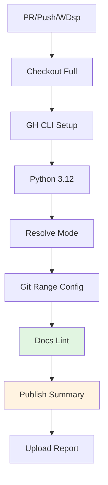

# DGW: Docs Governance Workflow

Enforces documentation policy with mode-aware linting and GitHub summary publishing.

---

## ABBREVIATION MAP

| Abbr | Meaning |
|------|---------|
| DGW | Docs governance workflow |
| DL | Docs lint |
| CO | Changed-only mode |
| EP | Enforcement policy |
| GS | GitHub step summary |

---

## TRIGGER MATRIX

| EVENT | BRANCH | PATHS |
|-------|--------|-------|
| PR | Any | `docs/**`, `CONTRIBUTING.md`, `Infrastructure/docs-policy.json`, `Infrastructure/scripts/docs_lint.py`, `.github/PULL_REQUEST_TEMPLATE.md`, `.github/workflows/docs-governance.yml` |
| Push | `main` | Same as PR |
| WDsp | — | Same as PR (manual override) |

---

## JOB PIPELINE



---

## PERMISSIONS

```yaml
permissions:
  contents: read
```

---

## JOB: DOCS LINT (DL)

| CONFIG | VALUE |
|--------|-------|
| Runner | `ubuntu-latest` |
| Checkout | Full history (`fetch-depth: 0`) |
| Python | `3.12` |
| Config | `Infrastructure/docs-policy.json` |

### Mode Resolution

```python
# From Infrastructure/docs-policy.json
mode = cfg.get("enforcement_mode", "warn")
block_after = cfg.get("block_after")

# Auto-switch to block mode after date
if block_after and today >= block_after:
    mode = "block"
```

| MODE | BEHAVIOR |
|------|----------|
| `warn` | Report issues, exit 0 |
| `block` | Report issues, exit 1 on errors |

### Git Range Config

| EVENT | BASE SHA |
|-------|----------|
| PR | `github.event.pull_request.base.sha` |
| Push | `github.event.before` |
| WDsp | None (full scan) |

### Lint Execution

```bash
CHANGED_ONLY=""
[ "${{ github.event_name }}" = "pull_request" ] && CHANGED_ONLY="--changed-only"

python3 Infrastructure/scripts/docs_lint.py \
  --config Infrastructure/docs-policy.json \
  --mode "${MODE}" \
  --report-json /tmp/docs-lint-report.json \
  $CHANGED_ONLY
```

### Report Publishing

| FIELD | SOURCE |
|-------|--------|
| Mode | `report['mode']` |
| Scanned files | `report['scanned_files']` |
| Errors | `report['errors']` |
| Warnings | `report['warnings']` |
| Issues (top 50) | `report['issues']` |

Output: `GITHUB_STEP_SUMMARY`

### Artifacts

| NAME | PATH | CONDITION |
|------|------|-----------|
| `docs-lint-report` | `/tmp/docs-lint-report.json` | `always()` |

---

## LOCAL COMMANDS

```bash
# Full scan (warn mode)
python3 Infrastructure/scripts/docs_lint.py \
  --config Infrastructure/docs-policy.json \
  --mode warn \
  --report-json docs-lint-report.json

# Changed-only scan
python3 Infrastructure/scripts/docs_lint.py \
  --config Infrastructure/docs-policy.json \
  --mode warn \
  --changed-only \
  --report-json docs-lint-report.json

# Block mode (fails on errors)
python3 Infrastructure/scripts/docs_lint.py \
  --config Infrastructure/docs-policy.json \
  --mode block \
  --report-json docs-lint-report.json
```

---

## CI REFERENCE

Workflow: `.github/workflows/docs-governance.yml`

---

## RELATED

- [Docs lint script](/Infrastructure/scripts/docs_lint.py)
- [Docs policy](/Infrastructure/docs-policy.json)
- [Contributing guide](/CONTRIBUTING.md)
