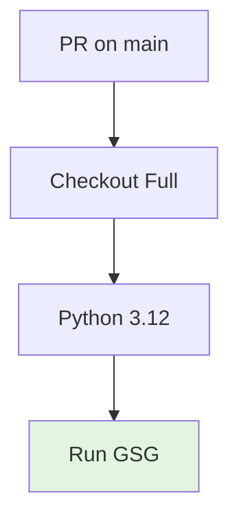

# GSGW: Gov Security Gates Workflow

Validates governance and security compliance on PRs affecting policy files.

---

## ABBREVIATION MAP

| Abbr | Meaning |
|------|---------|
| GSGW | Gov security gates workflow |
| GSG | Governance security gates |
| PR | Pull request |

---

## TRIGGER MATRIX

| EVENT | BRANCH | PATHS |
|-------|--------|-------|
| PR | `main` | `GOVERNANCE/**`, `COMPLIANCE/**`, `SECURITY/**`, `EVALUATION/**`, `.github/PULL_REQUEST_TEMPLATE.md`, `.github/branch-protection-manifest.md`, `.github/workflows/gov-security-gates.yml`, `.github/Infrastructure/scripts/gov_security_gates.py`, `.github/CODEOWNERS`, `CODEOWNERS`, `SUPPORT.md`, `SECURITY.md`, `CONTRIBUTING.md`, `CODE_OF_CONDUCT.md` |

---

## JOB PIPELINE



---

## PERMISSIONS

```yaml
permissions:
  contents: read
```

---

## JOB: GATE

| CONFIG | VALUE |
|--------|-------|
| Runner | `ubuntu-latest` |
| Checkout | Full history (`fetch-depth: 0`) |
| Python | `3.12` |
| Script | `.github/Infrastructure/scripts/gov_security_gates.py` |

### Command

```bash
python3 .github/Infrastructure/scripts/gov_security_gates.py
```

---

## LOCAL COMMANDS

```bash
# Run governance security gates
python3 .github/Infrastructure/scripts/gov_security_gates.py
```

---

## CI REFERENCE

Workflow: `.github/workflows/gov-security-gates.yml`

---

## RELATED

- [GSG script](/.github/Infrastructure/scripts/gov_security_gates.py)
