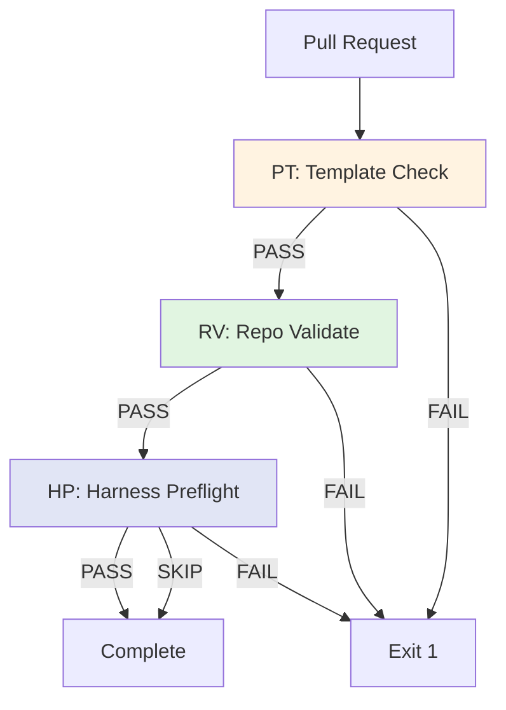

# PPW: PR Pipeline Workflow

Validates PR template compliance, runs repo checks, and executes harness preflight.

---

## ABBREVIATION MAP

| Abbr | Meaning |
|------|---------|
| PPW | PR pipeline workflow |
| PT | PR template validation |
| RV | Repo validation |
| HP | Harness preflight |
| CH | Coding harness |

---

## TRIGGER

| EVENT | BRANCH |
|-------|--------|
| Pull request | Any |

---

## JOB PIPELINE



---

## PERMISSIONS

```yaml
permissions:
  contents: read
  pull-requests: read
```

---

## JOB: PR TEMPLATE (PT)

| CONFIG | VALUE |
|--------|-------|
| Runner | `ubuntu-latest` |
| Action | `actions/github-script@v7` |

### Required Sections

| SECTION | CHECK |
|---------|-------|
| `## Summary` | Must exist |
| `## Checklist` | Must exist |
| `## Release notes` | Must exist |

### Validation Rules

| RULE | REGEX/ACTION | FAIL IF |
|------|--------------|---------|
| Empty body | `body.trim().length === 0` | True |
| Missing section | `!body.includes(section)` | True |
| Template placeholders | `/\[PROMPT:/i.test(body)` | True |

---

## JOB: REPO VALIDATE (RV)

| CONFIG | VALUE |
|--------|-------|
| Runner | `ubuntu-latest` |
| Needs | `[pr-template]` |
| Python | `3.12` |

### Steps

| STEP | COMMAND |
|------|---------|
| Checkout | `actions/checkout@v4` |
| Validate | `bash Infrastructure/scripts/validate_all.sh` |
| Diagnose | `python3 Infrastructure/scripts/lifecycle-and-sync/diagnose_skill.py --all` |
| Docs lint | `python3 Infrastructure/scripts/validation-and-linting/docs_lint.py --mode warn --config Infrastructure/docs-policy.json` |

---

## JOB: HARNESS PREFLIGHT (HP)

| CONFIG | VALUE |
|--------|-------|
| Runner | `ubuntu-latest` |
| Needs | `[repo-validate]` |
| Node | `24` |
| Tool | `@brainwav/coding-harness@latest` |

### Install (Best Effort)

```bash
npm install -g @brainwav/coding-harness@latest || {
  echo "coding-harness unavailable; continuing without harness-preflight gate."
}
```

### Preflight Gate

```bash
if ! command -v harness >/dev/null 2>&1; then
  echo "harness CLI not found; skipping harness-preflight gate."
  exit 0
fi

CHANGED_FILES="$(git diff --name-only "${BASE_SHA}" "${HEAD_SHA}" | paste -sd, -)"
[ -z "$CHANGED_FILES" ] && CHANGED_FILES="README.md"

harness preflight-gate \
  --contract Infrastructure/harness.contract.json \
  --files "$CHANGED_FILES" \
  --max-tier high \
  --json
```

### Behavior

| CONDITION | RESULT |
|-----------|--------|
| Harness unavailable | Skip (exit 0) |
| No changed files | Default to `README.md` |
| Gate passes | Continue |
| Gate fails | Exit 1 |

---

## LOCAL COMMANDS

```bash
# Repo validation
bash Infrastructure/scripts/validate_all.sh

# Skill diagnostics
python3 Infrastructure/scripts/lifecycle-and-sync/diagnose_skill.py --all

# Docs lint
python3 Infrastructure/scripts/validation-and-linting/docs_lint.py --mode warn --config Infrastructure/docs-policy.json

# Harness preflight (if installed)
 harness preflight-gate \
   --contract Infrastructure/harness.contract.json \
   --files "file1.ts,file2.py" \
   --max-tier high \
   --json
```

---

## CI REFERENCE

Workflow: `.github/workflows/pr-pipeline.yml`

---

## RELATED

- [PR template](/.github/PULL_REQUEST_TEMPLATE.md)
- [Validate all script](/Infrastructure/scripts/validate_all.sh)
- [Skill diagnostics](/Infrastructure/scripts/lifecycle-and-sync/diagnose_skill.py)
- [Docs lint](/Infrastructure/scripts/validation-and-linting/docs_lint.py)
