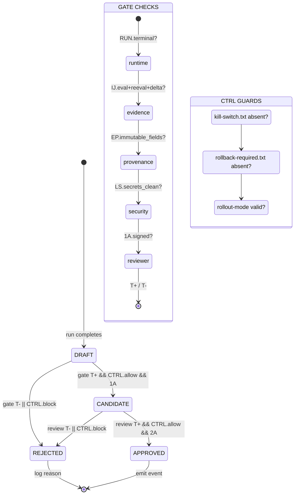

# PGW: Promotion Gate Workflow

Canonical promotions are human-gated and must include provenance + security evidence.

---

## ABBREVIATION MAP

| Abbr | Meaning |
|------|---------|
| PD | `promotion_decision.json` |
| IJ | `iteration_journal.jsonl` |
| RUN | `run.json` |
| AR | `Infrastructure/artifacts/skill-graphs/runs/` |
| CTRL | Runtime controls (kill-switch, rollback, mode) |
| EP | Evidence packet |
| LS | Lesson source |
| T+ | Threshold passed |
| T- | Threshold failed |
| 2A | Two approvers required |
| 1A | One approver sufficient |
| D/R/C/A | Draft → Rejected / Candidate / Approved |

---

## STATE MACHINE



---

## GATE CHECKLIST (G1-G8)

| ID | CHECK | T+ CONDITION |
|----|-------|--------------|
| G1_RUNTIME | RUN.status terminal | ∈ {completed, stopped} |
| G2_STOP | RUN.stop_reason explicit | ≠ null |
| G3_EVIDENCE | IJ.latest has eval+reeval | eval_ts && reeval_ts present |
| G4_DELTA | IJ.criterion_delta non-empty | delta[] length > 0 |
| G5_PROV | EP.immutable_fields present | schema+rubric+evaluator+persona |
| G6_SEC | LS.body no secrets/PII | scan.pass && sha256 recorded |
| G7_REVIEW | PD.reviewer_ids[] | wave0-1: 1A \| wave2+: 2A |
| G8_CTRL | CTRL.snapshot valid | mode∈{shadow,canary,live} |

---

## CONTROL FILE MATRIX

| FILE | PRESENCE | ACTION |
|------|----------|--------|
| `kill-switch.txt` | ABSENT | Continue |
| `kill-switch.txt` | PRESENT | EXIT 1 (global halt) |
| `rollback-required.txt` | ABSENT | Continue |
| `rollback-required.txt` | PRESENT | Rollback mode (auto-decline) |
| `rollout-mode.txt` | shadow | Log only, no apply |
| `rollout-mode.txt` | canary | Limited apply + monitor |
| `rollout-mode.txt` | live | Full apply |
| `auto_capture.disabled` | PRESENT | Skip auto-lesson-extract |
| `auto_apply.disabled` | PRESENT | Skip auto-promote |

---

## INVOCATION BOUNDARY (Pre-flight)

```python
def invoke_boundary():
    assert CTRL.killswitch_absent, "GLOBAL_KILL"
    assert CTRL.rollback_absent, "ROLLBACK_MODE"
    assert INV.id, "INVOCATION_ID_REQUIRED"
    assert INV.actor, "ACTOR_REQUIRED"
    assert INV.mode in {shadow,canary,live}, "INVALID_MODE"
    assert RUN.isolation == "profile-scoped", "ISOLATION_FAIL"
    return True
```

---

## ONBOARDING PRECONDITIONS

| ID | CHECK | T+ CONDITION |
|----|-------|--------------|
| OB1 | Profile presence | `<skill>/Infrastructure/references/task-profile.json` exists |
| OB2 | Profile schema | `schema_version` + `profile_id` + `scope_skill` + `criteria[]` + `thresholds` |
| OB3 | SKILL binding | `knowledge_graph_profile: Infrastructure/references/task-profile.json` in SKILL.md |
| OB4 | Wave sequencing | w0-controls → w1-manual → w2-co-pilot (sequential) |
| OB5 | Governance capacity | ≥2 approvers in policy for wave promotion |
| OB6 | Telemetry integrity | zero missing `events.jsonl` envelopes |

---

## COMMANDS

```bash
# Approve run
bash Infrastructure/scripts/lifecycle-and-sync/human_promote_recursive_run.sh \
  --run-id <run_id> \
  --lesson-id <lesson_id> \
  --reviewer <reviewer_id> \
  --expected-version <version_token> \
  --lesson-file <path_to_lesson_file>

# Validate decision
python3 Skills/skill-builder/Infrastructure/scripts/validate_recursive_promotion.py \
  --run-dir Infrastructure/artifacts/skill-graphs/runs/<run_id> \
  --decision-file Infrastructure/artifacts/skill-graphs/runs/<run_id>/promotion_decision.json \
  --lesson-file <path_to_lesson_file>

# CI validation
bash Infrastructure/scripts/lifecycle-and-sync/validate_recursive_promotions.sh \
  --changed-only --base-sha <base_sha> --head-sha <head_sha>
```

---

## CI TRIGGER

```yaml
on:
  pr: [AR/**/PD.json, AR/**/IJ.jsonl, AR/**/RUN.json]
  manual: workflow_dispatch

jobs:
  validate:
    if: files_changed ∩ {PD, IJ, RUN} ≠ ∅
    steps:
      - checkout@full-history
      - python@3.12
      - run: validate_recursive_promotions.sh --changed-only --strict-runs
      - upload: promotion-validation-report.json
```

Workflow: `.github/workflows/recursive-promotion-gate.yml`

---

## PD SCHEMA (Compact)

```json
{
  "d": "approved|rejected|candidate|draft",
  "rids": ["reviewer1", "reviewer2"],
  "gd": "gate_summary",
  "ver": "expected_version_token",
  "sec": {"ls_path": "...", "ls_sha256": "..."},
  "conf": {"s": 0.92, "b": "high", "cb": "calibrated"},
  "ev": {"ep_id": "...", "comp": 0.95},
  "ctrl": {"mode": "canary", "cap": true, "aap": false},
  "cuf": {"treat": 0.85, "ctrl": 0.72, "delta": 0.13, "n": 100}
}
```

| FIELD | DESCRIPTION |
|-------|-------------|
| `d` | Decision state (D/R/C/A) |
| `rids` | Reviewer IDs (1A or 2A per wave) |
| `gd` | Gate decision summary |
| `ver` | Expected version token |
| `sec` | Security: lesson path + SHA256 |
| `conf` | Confidence: score, bucket, calibration |
| `ev` | Evidence: packet ID, completeness |
| `ctrl` | Controls: mode, auto_capture, auto_apply |
| `cuf` | Counterfactual uplift: treatment, control, delta, n |

Approved promotions emit `promotion_approved` event in `run/events.jsonl`.

---

## RELATED

- [Reviewer rubric](/docs/skill-graphs/workflows/reviewer-rubric.md)
- [Human promotion guide](/docs/guides/recursive-promotion-gate.md)
- [Canonical lesson schema](/docs/skill-graphs/schemas/canonical-lesson.schema.md)
