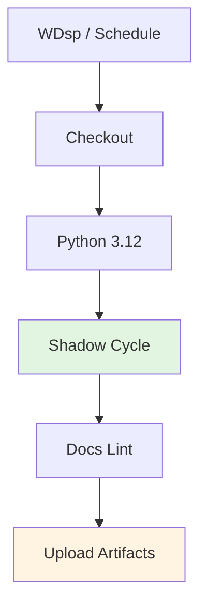

# RSSW: Recursive Skill Shadow Workflow

Executes shadow cycles for pilot profiles and aggregates results.

---

## ABBREVIATION MAP

| Abbr | Meaning                         |
| ---- | ------------------------------- |
| RSSW | Recursive skill shadow workflow |
| SC   | Shadow cycle                    |
| RPP  | Runs per profile                |
| WD   | Window days                     |
| WDsp | Workflow dispatch               |
| PF   | Pilot profile                   |

---

## TRIGGER MATRIX

| EVENT    | SCHEDULE                     | INPUTS                            | DEFAULTS |
| -------- | ---------------------------- | --------------------------------- | -------- |
| WDsp     | —                            | `runs_per_profile`, `window_days` | `2`, `7` |
| Schedule | `0 13 * * 1` (Mon 13:00 UTC) | —                                 | `2`, `7` |

---

## JOB PIPELINE



---

## PERMISSIONS

```yaml
permissions:
  contents: read
```

---

## JOB: SHADOW CYCLE

| CONFIG | VALUE                                                                           |
| ------ | ------------------------------------------------------------------------------- |
| Runner | `ubuntu-latest`                                                                 |
| Python | `3.12`                                                                          |
| Script | `Infrastructure/scripts/lifecycle-and-sync/run_recursive_skill_shadow_cycle.sh` |

### Inputs

| INPUT              | ENV                | DEFAULT | DESCRIPTION                 |
| ------------------ | ------------------ | ------- | --------------------------- |
| `runs_per_profile` | `RUNS_PER_PROFILE` | `2`     | Loop runs per pilot profile |
| `window_days`      | `WINDOW_DAYS`      | `7`     | Report aggregation window   |

### Script Flags

```bash
bash Infrastructure/scripts/lifecycle-and-sync/run_recursive_skill_shadow_cycle.sh \
  --runs-per-profile "$RUNS_PER_PROFILE" \
  --window-days "$WINDOW_DAYS" \
  --out-root "Infrastructure/artifacts/skill-graphs/runs" \
  --profiles-file "docs/skill-graphs/schemas/examples/pilot-profiles.json"
```

### Script Defaults

| FLAG                 | DEFAULT                                                  |
| -------------------- | -------------------------------------------------------- |
| `--runs-per-profile` | `2`                                                      |
| `--window-days`      | `7`                                                      |
| `--out-root`         | `Infrastructure/artifacts/skill-graphs/runs`             |
| `--profiles-file`    | `docs/skill-graphs/schemas/examples/pilot-profiles.json` |

The pilot profiles file may be either:

- a JSON array of profile ids, or
- a JSON array of objects with `profile_id`, optional `objective`, and `profile_file`/`profile_path` so the shadow cycle can run against real task profiles.

When using object entries, keep pilot objectives specific enough for adversarial checkpoints:

- front-load explicit state coverage,
- name accessibility behaviors such as keyboard focus and reduced-motion parity,
- require token-backed implementation guidance, and
- call out restraint constraints instead of generic "good design" language.

### March 2026 Quality Bar

Treat the pilot as an eval program, not only a rerun harness:

- keep the current strict gate on `critical non-regression`, which means every reevaluation in the run stayed clean;
- also report `terminal non-regression` and `non-regression recovered` so operators can distinguish a clean run from a recovered run without weakening the gate;
- freeze a baseline snapshot in `Infrastructure/artifacts/skill-graphs/pilot/shadow-baseline.json` and refresh it only on whole-window boundaries so delta KPIs stay auditable;
- prefer stronger output contracts and verification scaffolding before raising reasoning effort or rewriting objectives wholesale.

This workflow now aligns to current OpenAI guidance:

- Prompt guidance for GPT-5.4 says to treat reasoning effort as a last-mile knob and add `<completeness_contract>`, `<verification_loop>`, and `<tool_persistence_rules>` first.
- The GPT-5.4 migration guide recommends using the Responses API plus prompt optimization when upgrading long-running workflows.
- Prompt Caching 201 notes better cache utilization with the Responses API for reasoning workloads, which matters for repeated shadow-cycle turns.
- Ars Contexta methodology is used here as a synthesis layer between telemetry and hardening:
  capture unstable patterns as documentation first, checkpoint query drift during review, and only promote repeated wins upward from documentation to skill to hook.

Official references:

- [Prompt guidance for GPT-5.4](https://developers.openai.com/api/docs/guides/prompt-guidance/#treat-reasoning-effort-as-a-last-mile-knob)
- [Using GPT-5.4: migration guidance](https://developers.openai.com/api/docs/guides/latest-model/#migrating-from-other-models-to-gpt-54)
- [Prompt Caching 201: use the Responses API](https://developers.openai.com/cookbook/examples/prompt_caching_201/#45-use-the-responses-api-instead-of-chat-completions)

---

## JOB: DOCS LINT

| CONFIG | VALUE                             |
| ------ | --------------------------------- |
| Mode   | `warn`                            |
| Config | `Infrastructure/docs-policy.json` |
| Output | `/tmp/docs-lint-shadow.json`      |

```bash
python3 Infrastructure/scripts/validation-and-linting/docs_lint.py \
  --config Infrastructure/docs-policy.json \
  --mode warn \
  --report-json /tmp/docs-lint-shadow.json
```

---

## ARTIFACTS

| NAME                               | PATHS                                                                              |
| ---------------------------------- | ---------------------------------------------------------------------------------- |
| `recursive-skill-shadow-artifacts` | `Infrastructure/artifacts/skill-graphs/**`                                         |
|                                    | `docs/skill-graphs/pilots/ui-skills-shadow-results.md`                             |
|                                    | `docs/skill-graphs/pilots/ui-skills-pilot-readout.md`                              |
|                                    | `docs/skill-graphs/telemetry/daily-skill-health.md`                                |
|                                    | `Infrastructure/artifacts/skill-graphs/telemetry/failure-pattern-candidates.jsonl` |
|                                    | `Infrastructure/artifacts/skill-graphs/telemetry/promotion-queue.md`               |
|                                    | `/tmp/docs-lint-shadow.json`                                                       |

---

## LOCAL COMMANDS

```bash
# Run shadow cycle
bash Infrastructure/scripts/lifecycle-and-sync/run_recursive_skill_shadow_cycle.sh \
  --runs-per-profile 2 \
  --window-days 7

# With custom profiles
bash Infrastructure/scripts/lifecycle-and-sync/run_recursive_skill_shadow_cycle.sh \
  --runs-per-profile 3 \
  --window-days 14 \
  --profiles-file custom-profiles.json

# Review promotion candidates from the current shadow-cycle output
sed -n '1,220p' Infrastructure/artifacts/skill-graphs/telemetry/promotion-queue.md

# Docs lint
python3 Infrastructure/scripts/validation-and-linting/docs_lint.py \
  --config Infrastructure/docs-policy.json \
  --mode warn \
  --report-json docs-lint-report.json
```

---

## CI REFERENCE

Workflow: `.github/workflows/recursive-skill-shadow.yml`

---

## RELATED

- [Shadow cycle script](/Infrastructure/scripts/lifecycle-and-sync/run_recursive_skill_shadow_cycle.sh)
- [Pilot profiles example](/docs/skill-graphs/schemas/examples/pilot-profiles.json)
- [UI skills shadow results](/docs/skill-graphs/pilots/ui-skills-shadow-results.md)
- [Daily skill health](/docs/skill-graphs/telemetry/daily-skill-health.md)
