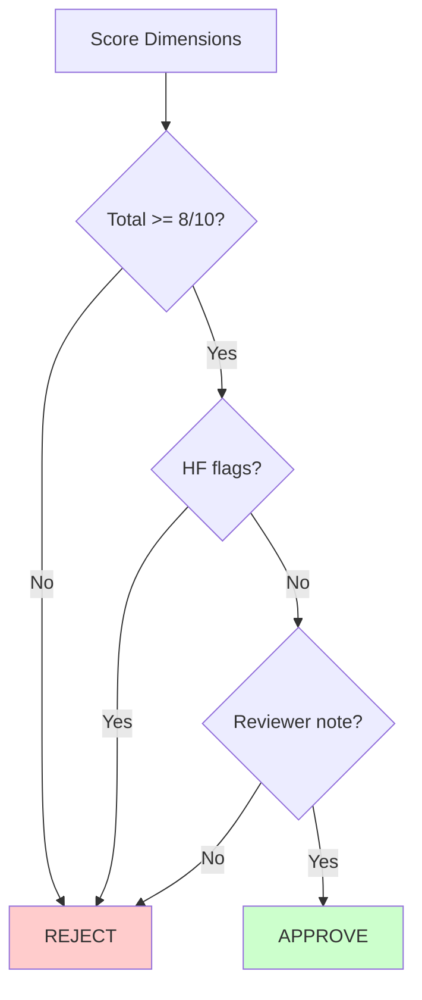

# RRW: Reviewer Rubric Workflow

Scoring rubric for lesson promotion decision review.

---

## ABBREVIATION MAP

| Abbr | Meaning |
|------|---------|
| RRW | Reviewer rubric workflow |
| PD | Promotion decision |
| HF | Hard fail |

---

## SCORING MATRIX (0-2 per dimension)

| DIM | SCORE | CRITERIA |
|-----|-------|----------|
| D1_IMPACT | 0 | Not measurable or not attributable |
| | 1 | Partially measurable |
| | 2 | Measurable and attributable |
| D2_REGRESSION | 0 | Critical criteria regress |
| | 1 | Minor regression |
| | 2 | No regression |
| D3_REUSE | 0 | Scope unclear or unbounded |
| | 1 | Scope somewhat clear |
| | 2 | Scope clear and bounded |
| D4_SAFETY | 0 | Unsafe/ambiguous guidance |
| | 1 | Minor ambiguity |
| | 2 | Safe and clear |
| D5_PROVENANCE | 0 | Missing required metadata |
| | 1 | Partial metadata |
| | 2 | All immutable metadata present |

---

## HARD FAIL (HF) CONDITIONS

Reject immediately (score = 0) if ANY true:

| ID | CONDITION |
|----|-----------|
| HF1 | Missing required provenance fields |
| HF2 | Unresolved security/privacy finding |
| HF3 | Contradictory lesson scope or lineage |
| HF4 | Non-deterministic retrieval tie-break |

---

## DECISION POLICY



### Approval Requirements

| CHECK | THRESHOLD |
|-------|-----------|
| Total score | `>= 8/10` |
| Hard fails | `0` |
| Reviewer note | Required (1 sentence rationale) |

### Rejection Requirements

| OUTPUT | REQUIRED |
|--------|----------|
| Decision | `REJECT` |
| Remediation note | Concrete action items |

---

## SCORECARD TEMPLATE

```markdown
## Review Scorecard

| Dimension | Score | Notes |
|-----------|-------|-------|
| D1_IMPACT | 0/1/2 | |
| D2_REGRESSION | 0/1/2 | |
| D3_REUSE | 0/1/2 | |
| D4_SAFETY | 0/1/2 | |
| D5_PROVENANCE | 0/1/2 | |
| **TOTAL** | **X/10** | |

Hard fails: HF1 HF2 HF3 HF4 (check if any)
Reviewer note: [1 sentence rationale]
Remediation: [if rejected]
Decision: APPROVE / REJECT
```

---

## CI REFERENCE

Document: `docs/skill-graphs/workflows/reviewer-rubric.md`

---

## RELATED

- [Promotion gate workflow](/docs/skill-graphs/workflows/promotion-gate.md)
