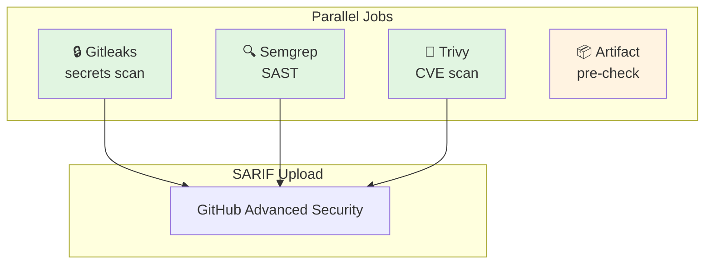

# SSW: Security Scan Workflow

Multi-layer security scanning: secrets detection, SAST, dependency CVEs, and artifact pre-check.

---

## ABBREVIATION MAP

| Abbr | Meaning |
|------|---------|
| SSW | Security scan workflow |
| GL | Gitleaks (secrets) |
| SG | Semgrep (SAST) |
| TV | Trivy (CVE scan) |
| ASC | Artifact secrets check |
| SARIF | Static analysis results interchange format |
| SAST | Static application security testing |
| CVE | Common vulnerabilities and exposures |
| PR | Pull request |

---

## TRIGGER MATRIX

| EVENT | BRANCH | SCHEDULE | JOBS |
|-------|--------|----------|------|
| Push | `main` | — | GL, SG, TV, ASC |
| PR | Any | — | GL, SG, TV, ASC |
| Schedule | — | `0 2 * * *` (nightly) | GL, SG, TV, ASC |

---

## JOB PIPELINE



---

## PERMISSIONS

```yaml
permissions:
  contents: read
  security-events: write  # SARIF upload to GitHub Advanced Security
```

---

## JOB: GITLEAKS (GL)

| CONFIG | VALUE |
|--------|-------|
| Runner | `ubuntu-latest` |
| Checkout | Full history (`fetch-depth: 0`) |
| Action | `gitleaks/gitleaks-action@v2` |
| Comments | Enabled |
| Fail mode | Hard fail on finding |

### ENV

```yaml
GITHUB_TOKEN: ${{ secrets.GITHUB_TOKEN }}
GITLEAKS_ENABLE_COMMENTS: "true"
```

---

## JOB: SEMGREP (SG)

| CONFIG | VALUE |
|--------|-------|
| Runner | `ubuntu-latest` |
| Container | `semgrep/semgrep` |
| Checkout | Full history |

### Rulesets

| RULESET | CONDITION |
|---------|-----------|
| `p/secrets` | Always |
| `p/python` | Always |
| `p/typescript` | Always |
| `p/bash` | Always |
| `auto` | If `SEMGREP_APP_TOKEN` set |

### Exclusions

- `.tmp/agent-skills-artifacts/skill-graphs/**`

### PR Mode

```bash
# Diff scan against base ref
git fetch origin "${base_ref}:${base_ref}" --depth=1
git diff --name-only --diff-filter=ACMR "${base_ref}...HEAD"
semgrep scan ... -- "${changed_files[@]}"
```

### Full Mode

```bash
semgrep scan ... -- .
```

### Exit Criteria

| CHECK | ACTION |
|-------|--------|
| Exit code ≠ 0 | Fail workflow |
| SARIF missing | Fail workflow |
| Findings count > 0 | Fail workflow |

### ENV

```yaml
SEMGREP_APP_TOKEN: ${{ secrets.SEMGREP_APP_TOKEN || '' }}
```

---

## JOB: TRIVY (TV)

| CONFIG | VALUE |
|--------|-------|
| Runner | `ubuntu-latest` |
| Action | `aquasecurity/trivy-action@master` |
| Scan type | Filesystem (`fs`) |
| Severity | `CRITICAL,HIGH` |
| Exit code | `1` |
| Unfixed | Ignored |
| Output | `trivy.sarif` |

---

## JOB: ARTIFACT SECRET CHECK (ASC)

| CONFIG | VALUE |
|--------|-------|
| Runner | `ubuntu-latest` |
| Tool | Gitleaks (latest release) |
| Target | `Infrastructure/artifacts/` directory |

### Install Script

```bash
os=$(uname -s | tr '[:upper:]' '[:lower:]')
arch=$(uname -m | tr '[:upper:]' '[:lower:]')
case "$arch" in
  x86_64|amd64) arch="x64" ;;
  aarch64|arm64) arch="arm64" ;;
esac
asset_url=$(curl -fsSL https://api.github.com/repos/gitleaks/gitleaks/releases/latest \
  | jq -r --arg os "$os" --arg arch "$arch" '.assets[].browser_download_url | select(endswith("_" + $os + "_" + $arch + ".tar.gz"))' | head -n 1)
curl -sSfL "$asset_url" | tar -xz -C /usr/local/bin gitleaks
```

### Scan Command

```bash
gitleaks detect \
  --source Infrastructure/artifacts/ \
  --no-git \
  --redact \
  --exit-code 1 \
  --report-format json \
  --report-path gitleaks-artifacts.json
```

### Upload on Failure

| ARTIFACT | RETENTION |
|----------|-----------|
| `gitleaks-artifacts.json` | 7 days |

---

## SARIF UPLOAD

| JOB | FILE | CATEGORY |
|-----|------|----------|
| SG | `semgrep.sarif` | `semgrep` |
| TV | `trivy.sarif` | `trivy` |

Upload: `github/codeql-action/upload-sarif@v3`
Condition: `always()`

---

## LOCAL COMMANDS

```bash
# Gitleaks (local install)
gitleaks detect --source . --no-git --redact

# Semgrep (docker)
docker run --rm -v "$PWD:/src" semgrep/semgrep \
  --config "p/secrets" --config "p/python" \
  --config "p/typescript" --config "p/bash" /src

# Trivy (local install)
trivy fs --severity CRITICAL,HIGH --exit-code 1 .

# Artifact pre-check
gitleaks detect --source Infrastructure/artifacts/ --no-git --redact
```

---

## FAILURE MODES

| JOB | TRIGGER | RESULT |
|-----|---------|--------|
| GL | Secret found | Exit 1, PR comment |
| SG | Finding > 0 | Exit 1, SARIF uploaded |
| TV | CVE CRITICAL/HIGH | Exit 1, SARIF uploaded |
| ASC | Secret in artifact | Exit 1, report uploaded |

---

## CI REFERENCE

Workflow: `.github/workflows/security-scan.yml`

---

## RELATED

- [Gitleaks config](/.gitleaks.toml)
- [Semgrep rules](https://semgrep.dev/explore)
- [Trivy docs](https://aquasecurity.github.io/trivy/)
- [GitHub Advanced Security](https://docs.github.com/en/code-security)
