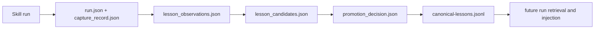

# Skill Learning Loop

Defines the practical loop for turning real skill usage into safe improvements.
Use this workflow when you want a skill such as `frontend-ui-design` to get better
over time without overfitting to one-off preferences.

## Table of Contents

- [Goal](#goal)
- [Canonical artifact flow](#canonical-artifact-flow)
- [Frontend UI Design pilot](#frontend-ui-design-pilot)
- [What to capture after each run](#what-to-capture-after-each-run)
- [Promotion policy](#promotion-policy)
- [How skill-builder participates](#how-skill-builder-participates)
- [Recommended commands](#recommended-commands)

## Goal

The graph should do more than route skills together. It should also:

- remember how a skill performed;
- distinguish repeatable quality signals from request-specific noise;
- preserve approved lessons in a canonical store;
- improve the skill only when there is enough evidence.

## Canonical artifact flow



Core files:

- `Infrastructure/artifacts/skill-graphs/runs/<run_id>/run.json`
- `Infrastructure/artifacts/skill-graphs/runs/<run_id>/capture_record.json`
- `Infrastructure/artifacts/skill-graphs/runs/<run_id>/lesson_observations.json`
- `Infrastructure/artifacts/skill-graphs/runs/<run_id>/lesson_candidates.json`
- `Infrastructure/artifacts/skill-graphs/runs/<run_id>/promotion_decision.json`
- `Infrastructure/artifacts/skill-graphs/lessons/canonical-lessons.jsonl`

## Frontend UI Design pilot

Use [`frontend-ui-design`](/Users/jamiecraik/dev/Agent-Skills/frontend/ui/frontend-ui-design/SKILL.md)
as the first high-value learning pilot because it has:

- repeated real-world usage;
- subjective risk that still benefits from structure;
- strong neighboring skills such as `design-system`, `baseline-ui`,
  `ui-ux-creative-coding`, `figma`, and `ui-visual-regression`;
- clear good-vs-bad outcomes that can be rubric-bound.

The pilot rubric lives in
[`learning-rubric.yaml`](/Users/jamiecraik/dev/Agent-Skills/frontend/ui/frontend-ui-design/Infrastructure/references/learning-rubric.yaml)
and the pilot profile lives in
[`task-profile.json`](/Users/jamiecraik/dev/Agent-Skills/frontend/ui/frontend-ui-design/Infrastructure/references/task-profile.json).

## What to capture after each run

Score the run on these dimensions:

1. `hierarchy_primary_action`
2. `state_completeness`
3. `accessibility_contract`
4. `token_alignment`
5. `implementation_readiness`
6. `visual_distinction`
7. `restraint_and_composition`

For each dimension, record:

- whether the signal was positive, negative, mixed, or unknown;
- short evidence lines tied to the actual output;
- the smallest patch target that would address the issue;
- confidence that the issue belongs to the skill rather than the request.

Good examples of lessons:

- "Visually led landing pages improved when the first viewport was anchored by one composition instead of a card collage."
- "Design outputs were easier to implement when state coverage was listed before visual polish."

Bad examples of lessons:

- "Make it prettier."
- "Use more animation."
- "The user did not like it."

## Promotion policy

Do not rewrite the skill after every run.

Use this policy instead:

| Evidence level | Action |
| --- | --- |
| 1 run | Capture observations only |
| 2 matching runs | Create or refine eval coverage |
| 3 matching runs | Propose a candidate skill/reference patch |
| benchmark lift or strong repeated failure pattern | Allow promotion review even if the run count is low |

Promotion blockers:

- issue caused by missing user context rather than weak skill guidance;
- contradictory evidence across recent runs;
- lesson scope too broad for one skill;
- lesson would weaken accessibility, safety, or token discipline.

## How skill-builder participates

[`skill-builder`](/Users/jamiecraik/dev/Agent-Skills/skill-builder/SKILL.md)
is the promotion mechanism, not the raw memory store.

Its job in this loop is:

- read `lesson_observations.json`, `lesson_candidates.json`, and `promotion_decision.json`;
- decide whether the lesson belongs in `SKILL.md`, `Infrastructure/references/`, or eval coverage;
- add or tighten `Infrastructure/references/evals.yaml` when a repeated failure should become a regression test;
- propose the smallest patch that captures the lesson cleanly;
- rerun gates before the lesson is considered safe to keep.

Practical rule:

- repeated negative pattern -> patch skill or reference doc
- repeated positive pattern -> preserve as positive guidance or example
- weak evidence -> patch evals first or hold

## Recommended commands

Profile validation:

```bash
python3 Skills/skill-builder/Infrastructure/scripts/validate_skill_graph_profiles.py \
  --inventory-policy docs/skill-graphs/governance/inventory-policy.json
```

Frontend skill quality:

```bash
python3 Skills/skill-builder/Infrastructure/scripts/skill_gate.py frontend/ui/frontend-ui-design
python3 Skills/skill-builder/Infrastructure/scripts/analyze_skill.py frontend/ui/frontend-ui-design
```

Recursive promotion validation:

```bash
python3 Skills/skill-builder/Infrastructure/scripts/validate_recursive_promotion.py \
  --run-dir Infrastructure/artifacts/skill-graphs/runs/<run_id>
```

Docs quality:

```bash
python3 Infrastructure/scripts/docs_lint.py --mode warn --config Infrastructure/docs-policy.json
```
