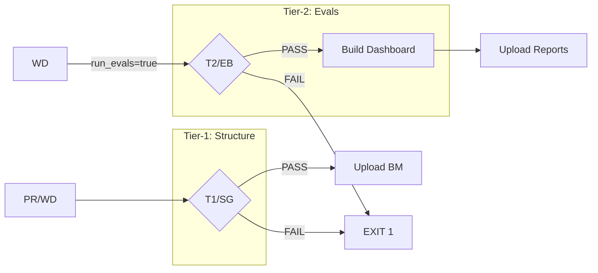

# SQW: Skill Quality Workflow

Validates skill structure against industry benchmarks and runs optional LLM evals.

---

## ABBREVIATION MAP

| Abbr | Meaning                 |
| ---- | ----------------------- |
| SQ   | Skill quality           |
| T1   | Tier-1 (structure gate) |
| T2   | Tier-2 (eval gate)      |
| SG   | Structure gate          |
| EB   | Eval baseline           |
| BM   | Benchmark               |
| EVAL | LLM evaluation          |
| WD   | Workflow dispatch       |
| PR   | Pull request            |

---

## TRIGGER MATRIX

| EVENT | PATHS                                                                                                                  | MODE              | JOBS    |
| ----- | ---------------------------------------------------------------------------------------------------------------------- | ----------------- | ------- |
| PR    | `**/SKILL.md`, `**/evals.yaml`, `**/contract.yaml`, `Infrastructure/scripts/**`, `Infrastructure/templates/evals.yaml` | Auto              | T1 only |
| WD    | Manual                                                                                                                 | `run_evals=false` | T1 only |
| WD    | Manual                                                                                                                 | `run_evals=true`  | T1 → T2 |

---

## JOB PIPELINE



---

## TIER-1: STRUCTURE GATE (SG)

| CHECK    | COMMAND                                                                        |
| -------- | ------------------------------------------------------------------------------ |
| Checkout | `actions/checkout@v7.0.1` (full)                                               |
| Python   | `3.12`                                                                         |
| GH CLI   | `Infrastructure/scripts/ensure-gh-cli.sh`                                      |
| Deps     | `pip install pyyaml pytest defusedxml`                                         |
| Validate | `run_repo_skill_quality.py --root . --baseline-file ... --benchmark-mode warn` |
| Upload   | `.harness/evidence/industry-benchmark-latest.json`                             |

### SG Flags

```bash
python Plugins/skill-factory/scripts/skill-builder/run_repo_skill_quality.py \
  --root . \
  --baseline-file Plugins/skill-factory/references/skill-builder/skill-quality-baseline.json \
  --benchmark-mode warn \
  --benchmark-config Plugins/skill-factory/references/skill-builder/benchmark-policy.json \
  --benchmark-output-json .harness/evidence/industry-benchmark-latest.json \
  --format text
```

---

## TIER-2: EVAL BASELINE (EB)

| CONDITION | `github.event_name == 'workflow_dispatch' && inputs.run_evals == 'true'` |
| NEEDS | `[structure-gate]` (must pass) |

### EB Flags

```bash
python Plugins/skill-factory/scripts/skill-builder/run_repo_skill_quality.py \
  --root . \
  --run-evals \
  --dual-run \
  --capture-jsonl \
  --tier2-mode "${{ inputs.tier2_mode }}" \
  --benchmark-mode warn \
  --benchmark-config Plugins/skill-factory/references/skill-builder/benchmark-policy.json \
  --benchmark-output-json .harness/evidence/industry-benchmark-latest.json \
  --format text
```

### Dashboard Build

```bash
python Plugins/skill-factory/scripts/skill-builder/build_skill_eval_dashboard.py \
  --reports-root .tmp/agent-skills-artifacts/skills \
  --out-json .tmp/agent-skills-artifacts/skills/dashboard.json \
  --out-md .tmp/agent-skills-artifacts/skills/dashboard.md
```

### EB Outputs

| ARTIFACT  | PATH                                                      |
| --------- | --------------------------------------------------------- |
| Reports   | `.tmp/agent-skills-artifacts/skills/**`                    |
| Benchmark | `.harness/evidence/industry-benchmark-latest.json`        |

---

## INPUTS (WD Only)

| INPUT        | TYPE   | DEFAULT | DESCRIPTION                                      |
| ------------ | ------ | ------- | ------------------------------------------------ |
| `run_evals`  | bool   | `false` | Run LLM evals (requires codex/codex CLIs + auth) |
| `tier2_mode` | string | `warn`  | Tier-2 handling: `warn` \| `strict` \| `skip`    |

---

## PERMISSIONS

```yaml
permissions:
  contents: read
```

---

## DEPENDENCIES

| COMPONENT | SOURCE                                                                       |
| --------- | ---------------------------------------------------------------------------- |
| Baseline  | `Plugins/skill-factory/references/skill-builder/skill-quality-baseline.json` |
| BM Policy | `Plugins/skill-factory/references/skill-builder/benchmark-policy.json`       |
| Script    | `Plugins/skill-factory/scripts/skill-builder/run_repo_skill_quality.py`      |
| Dashboard | `Plugins/skill-factory/scripts/skill-builder/build_skill_eval_dashboard.py`  |
| Helper    | `Infrastructure/scripts/ensure-gh-cli.sh`                                    |

---

## COMMANDS

```bash
# Validate structure only (local)
python Plugins/skill-factory/scripts/skill-builder/run_repo_skill_quality.py \
  --root . \
  --baseline-file Plugins/skill-factory/references/skill-builder/skill-quality-baseline.json \
  --benchmark-mode warn \
  --format text

# Run full evals (requires Codex/Claude auth)
python Plugins/skill-factory/scripts/skill-builder/run_repo_skill_quality.py \
  --root . \
  --run-evals \
  --dual-run \
  --capture-jsonl \
  --tier2-mode warn \
  --format text

# Build dashboard manually
python Plugins/skill-factory/scripts/skill-builder/build_skill_eval_dashboard.py \
  --reports-root .tmp/agent-skills-artifacts/skills \
  --out-json .tmp/agent-skills-artifacts/skills/dashboard.json \
  --out-md .tmp/agent-skills-artifacts/skills/dashboard.md
```

---

## CI REFERENCE

Workflow: `.github/workflows/skill-quality.yml`

---

## RELATED

- [Skill builder scripts](/Plugins/skill-factory/scripts/skill-builder)
- [Benchmark policy](/Plugins/skill-factory/references/skill-builder/benchmark-policy.json)
- [Skill quality baseline](/Plugins/skill-factory/references/skill-builder/skill-quality-baseline.json)
