# Harness Engineering Plugin

`harness-engineering` is the lifecycle plugin for shaping rough work into
reviewable artifacts, bounded execution, validation evidence, and safe closure.
It is not the `@brainwav/coding-harness` infrastructure toolchain.

## Reader Map

- [Command-Facing Skills](#command-facing-skills)
- [Lifecycle Flow](#lifecycle-flow)
- [Routing](#routing)
- [Traceability](#traceability)
- [Artifact Review Surface](#artifact-review-surface)
- [Agent-Native Compression](#agent-native-compression)
- [Goal Continuity](#goal-continuity)
- [Validation](#validation)

## Command-Facing Skills

Use `he-reconcile` when the stage is unclear. The other command-facing skills are
direct entrypoints when the user names the stage or the stage is already
obvious.

| Skill | Reader job |
| --- | --- |
| `he-reconcile` | Select the HE stage and authority boundary. |
| `he-brainstorm` | Explore options before committing to spec, plan, Linear, or implementation. |
| `he-strategy` | Capture strategy, architecture review, triage, ADR, or core invariant context. |
| `he-reframe` | Create rollback-safe migration or structural-change programs. |
| `he-linear-plan` | Map approved cognition into Linear-ready Now/Next/Later work. |
| `he-spec` | Produce reader-first implementation specifications. |
| `he-plan` | Produce execution plans with slices, gates, rollback, and review path. |
| `he-work` | Execute one bounded implementation slice. |
| `he-phase-work` | Continue approved phase work with a 10 minute heartbeat and phase gates. |
| `he-fix-bugs` | Reproduce, isolate, fix, and validate known defects. |
| `he-code-review` | Review diffs, PRs, readiness claims, or artifacts for introduced risk. |
| `he-eval-report` | Produce closure proof from validation, review, drift, and release evidence. |
| `he-improve` | Improve HE skills, references, contracts, or evals from concrete evidence. |
| `he-reconcile` | Recover lifecycle state, tracker/artifact conflicts, or resume routing. |
| `he-reinforce` | Capture solved problems, stale learning refreshes, and Project Brain syncs. |
| `he-phase-work` | Schedule lightweight follow-ups; phase execution belongs to `he-phase-work`. |

Compatibility and internal handles are retained so old prompts still route:
`he-refactor` maps to `he-reframe`, `he-phase-heartbeat` maps to
`he-phase-work`. The obsolete `he-compound` package has been removed;
old compound-learning and Project Brain capture behavior now belongs to
`he-reinforce`.

## Lifecycle Flow

Most tracked HE work follows this shape. Skip stages only when the source
artifact already proves the missing decision.

```mermaid
flowchart LR
  A["Rough idea or stale state"] --> B["he-reconcile"]
  B --> C["he-brainstorm or he-strategy"]
  C --> D["he-reframe or he-linear-plan"]
  D --> E["he-spec"]
  E --> F["he-plan"]
  F --> G["he-work or he-phase-work"]
  G --> H["he-code-review / he-fix-bugs"]
  H --> I["he-eval-report"]
  I --> J["he-reinforce"]
  J --> K["he-reconcile"]
```



The diagram is a routing aid, not a mandate. Linear, PR, validation, and
artifact evidence decide whether a stage is required or already satisfied.

## Routing

Start with `he-reconcile` when the stage is unclear. Direct stage calls are fine when the user names an active skill. Folded legacy names are aliases or modes, not packaged skills:

- `he-ideate` -> `he-brainstorm`
- `he-deepen-spec` -> `he-spec`
- `he-deepen-plan` -> `he-plan`
- `he-tdd` -> `he-work`
- `he-technical-review` / `he-reliability-review` -> `he-code-review`
- `he-refactor` -> `he-reframe`
- `he-refine` -> `he-improve`
- `he-phase-heartbeat` -> `he-phase-work`
- old compound-learning or `he-compound-refresh` solved-problem refresh -> `he-reinforce`
- lifecycle state refresh -> `he-reconcile`
- `he-prune-branches` -> `he-reconcile` branch-hygiene handoff

Source of truth:

- `Plugins/harness-engineering/references/routing-map.json`
- `Plugins/harness-engineering/references/deterministic-stage-routing.md`
- `Plugins/harness-engineering/references/subagent-routing.md`

## Traceability

Tracked work should carry the same Linear/spec/plan/PR chain through brainstorm, spec, plan, work, and review. Non-trivial tracked work must resolve or create the Linear issue through `references/linear-tracker-gate.md`; blocked tracker writes must return a ready-to-create payload instead of silently continuing.

For existing tracked plans, run `references/linear-delta-capture-gate.md`
before `he-spec`, `he-plan`, or `he-work` consumes
`.harness/linear/<repo-name>-linear-plan.md`. New or changed Linear issues are
captured into the plan as classified deltas first, then at most one admitted
item becomes the current or next execution slice.

Lifecycle state reconciliation belongs to `he-reconcile`: use it when HE work
needs earliest-stage recovery, source-prompt coverage, tracker/artifact conflict
resolution, or session-evidence resume routing.

Solved-problem capture and stale learning refresh belong to `he-reinforce` and write new HE solution
artifacts under `.harness/solutions/**` using
`references/solution-capture-contract.md`. Legacy `docs/solutions/**` entries
are source evidence and overlap/freshness inputs. When the repo uses Project
Brain, solution capture also syncs or explicitly blocks the matching
`.harness/knowledge/**` update.

Post-implementation closure proof belongs to `he-eval-report` and writes
`.harness/evals/YYYY-MM-DD-JSC-###-<repo-name>-<linear-parent-issue-or-milestone>-eval.md`
when Linear context is known, or the dated repo fallback when it is not.
Do not recommend Linear parent issue, milestone, project, or execution-slice
closure from implementation status alone; use the eval artifact to record
validation evidence, drift posture, proof artifacts, and completion safety.

Strategy, architectural review, triage, ADR compression, and core invariant
compression belong to `he-strategy`. These artifacts are cognition context, not
implementation authority, until admitted by a reframe, Linear, spec, or plan
artifact. New lifecycle artifacts prefer dated Linear filenames such as
`YYYY-MM-DD-JSC-###-<slug>-strategy.md`; stable names are reserved for living
`.harness/core/**` files and numbered ADRs.

Artifact classification uses
`references/artifact-classification-and-traceability.md`: content shape beats
path. Frontmatter, H1, required sections, source links, and Linear identifiers
classify existing `.harness` files before directory names. Path/title/date
mismatches are traceability defects, not silent routing assumptions.

High-leverage architectural migration programs belong to `he-reframe` and
write `.harness/reframes/YYYY-MM-DD-JSC-###-<reframe-slug>.md` when tracked.
They define staged evolution, rollback, eval proof, and Linear mapping without
editing implementation code or creating Linear objects.

Linear execution mapping belongs to `he-linear-plan` and writes
`.harness/linear/YYYY-MM-DD-JSC-###-<repo-name>-<slice-slug>-linear-plan.md`
when tracked.
It maps `.harness` cognition into small Now/Next/Later/Do Not Create execution
sets, milestones, parent issues, dependencies, eval gates, and human/agent
routing, but never mutates Linear without explicit confirmation.
Repo identity is carried by labels, preferably `Repo › ...`, while projects are
reserved for bounded deliverables with a clear completion state. Use labels and
views for repo queues, maintenance, triage, and backlog organization; use cycles
only for active execution commitment.

Dedicated UI plans are `he-plan` artifacts. New UI plans use
`.harness/plan/**-ui-plan.md`; legacy `docs/ui-plan/**` and
`docs/ui-plans/**` paths are compatibility source evidence unless the user asks
to preserve that convention. When Project Brain is active, UI plans feed it as
plan/decision context first; only implementation-proven reusable UI learnings
become `.harness/solutions/**` captures.

## Artifact Review Surface

Durable HE artifacts should be understandable without reading the originating
chat. Non-trivial specs, plans, reframes, Linear plans, strategies, reconcile
notes, reinforce captures, and eval reports use:

- one opening `BLUF:` paragraph in the command summary, not repeated
  section-level BLUF labels;
- reader-first body sections with explicit requirements, gates, risks,
  decisions, and next action;
- a visual-reference decision when flow, state, dependency, boundary, rollback,
  UI, media, or source-of-truth complexity would be clearer as a Mermaid
  diagram, table, screenshot, or persisted image reference;
- `Not needed` with a reason when no visual lowers review cost.

Mermaid and tables are the default visual references because humans can scan
them and agents can parse them. Generated images are exceptional and require
the repository media path plus proof that the file exists. Review-only media
belongs under repository `.harness/media/**`, not inside this plugin package.

## Agent-Native Compression

When HE work touches a cockpit, command catalog, README front door, default help,
or golden-path command, use `references/agent-native-compression-contract.md`.
Compression is a blocking product gate: visible surfaces must be selected by the
golden path, emitted in readiness/learning packets, hidden as plumbing, merged,
deprecated, or explicitly justified. Metadata and classification alone do not
count as compression.

When HE work touches skills, plugins, CLIs, agent docs, evals, routing,
projections, automation, or workflow surfaces, use
`references/agent-native-audit-scorecard.md`. Agent-native readiness must prove
action parity, capability discovery, context ownership, shared truth surfaces,
entity completion, integration feedback, prompt-native composability, and
deterministic completion.

When HE consumes prior sessions or collector evidence, use
`references/session-evidence-trace-context.md` to resolve repo, branch, PR,
Linear, artifact chain, source bundle, and currentness before drawing scope or
closure conclusions.

When review feedback changes a spec, plan, strategy artifact, Linear plan,
reframe program, or eval, use
`references/document-review-finding-tiers.md` to separate `safe_auto`,
`gated_auto`, `manual`, and `fyi` findings before editing or asking.

## Goal Continuity

Use Codex `/goal` for explicit long-running continuation only. A goal preserves the thread objective across resumes; it does not replace Linear, specs, plans, PRs, validation, or the HE lifecycle exit contract. See `references/goal-continuity.md`; hand off repo-visible goal boards, native-goal reconciliation, receipts, and worker scope checks to the independent `Skills/agent-ops/goal-governor` skill.

## Validation

Validate plugin contract and marketplace registration:

```sh
python3 Plugins/plugin-factory/scripts/plugin-builder/plugin_builder.py validate Plugins/harness-engineering --require-marketplace --marketplace-path .agents/Plugins/marketplace.json
```

Audit marketplace alignment:

```sh
python3 Plugins/plugin-factory/scripts/plugin-builder/plugin_builder.py audit-marketplace --marketplace-path .agents/Plugins/marketplace.json --plugins-path Plugins
```
