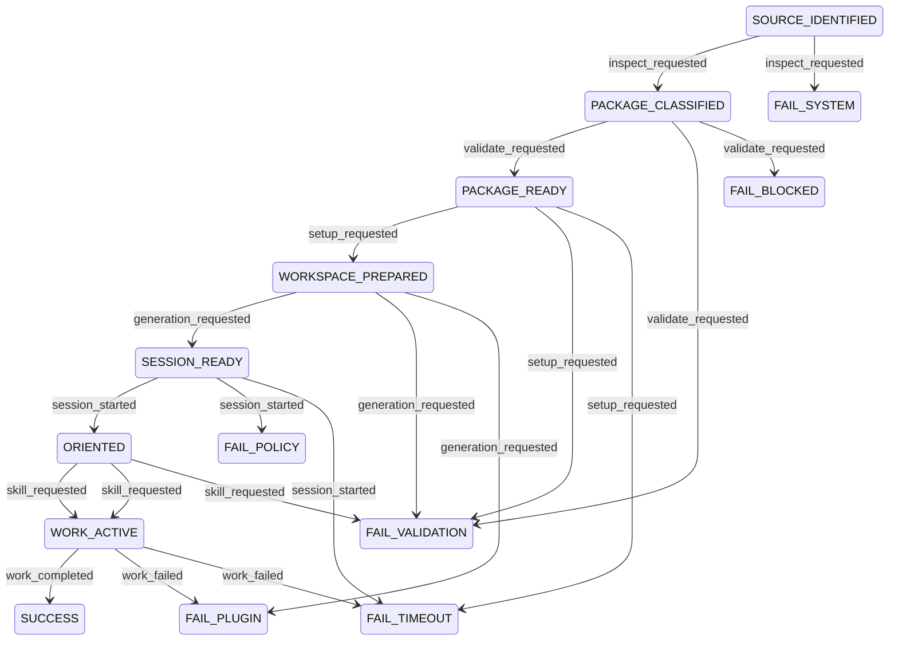

# Ars Contexta Operational Spec

## Table of Contents
- [Scope](#scope)
- [Operational Mode](#operational-mode)
- [Plugin Contract](#plugin-contract)
- [Metadata](#metadata)
- [Plugin Registry](#plugin-registry)
- [Capability Map](#capability-map)
- [Idempotency](#idempotency)
- [Invariants](#invariants)
- [Transition Table](#transition-table)
- [Diagram](#diagram)
- [Dry-Run Simulation](#dry-run-simulation)
- [Transition Tracing](#transition-tracing)
- [Logs](#logs)

## Scope
This spec models the expected Codex-oriented behavior of a converted Ars Contexta package:
- `skills/` is the primary runtime surface;
- `Infrastructure/templates/skill-sources/` is generation input, not always-on runtime behavior;
- `SessionStart` orientation is the only first-pass hook candidate considered runtime-safe;
- generated vault state and Claude-only artifacts remain outside package runtime scope.

## Operational Mode
- `STRICT`: fail on mixed package-vs-generated ownership, unsupported hook carry-over, or missing setup prerequisites.
- `ADVISORY`: allow inspection and dry-run tracing, but do not report `SUCCESS` unless package and generated-output boundaries remain intact.

## Plugin Contract
```yaml
plugin_id: arscontexta
capabilities:
  - source_classify
  - package_validate
  - setup_dispatch
  - template_generate
  - session_orient
  - skill_dispatch
  - maintenance_dispatch
result_status:
  - SUCCESS
  - FAILURE
  - RETRYABLE
errors:
  - VALIDATION_ERROR
  - BLOCKED_DEPENDENCY
  - POLICY_FAIL
  - SYSTEM_ERROR
  - PLUGIN_TIMEOUT
  - PLUGIN_FAILURE
```

## Metadata
```yaml
metadata:
  owner: agenticnotetaking
  max_duration: "setup <= workspace-specific, session_start <= 10s"
  escalation: "escalate when generated runtime outputs are bundled as package surfaces, when unsupported hook events are requested, or when setup cannot verify workspace prerequisites"
  plugin_scope:
    - package_surface_validation
    - generated_output_separation
    - setup_and_upgrade_dispatch
    - session_start_orientation
    - knowledge_skill_dispatch
```

## Plugin Registry
```yaml
plugin_registry:
  arscontexta:
    plugin_id: arscontexta
    capabilities:
      - source_classify
      - package_validate
      - setup_dispatch
      - template_generate
      - session_orient
      - skill_dispatch
      - maintenance_dispatch
```

## Capability Map
```yaml
capability_map:
  source_classify:
    plugin_id: arscontexta
    description: "Separate package-owned surfaces from generated runtime outputs and migration-only artifacts."
  package_validate:
    plugin_id: arscontexta
    description: "Validate manifest, references, and package boundaries."
  setup_dispatch:
    plugin_id: arscontexta
    description: "Run setup or upgrade entrypoints that prepare a target workspace."
  template_generate:
    plugin_id: arscontexta
    description: "Generate derived skills or runtime files from templates and references."
  session_orient:
    plugin_id: arscontexta
    description: "Inject SessionStart orientation behavior when Codex-compatible."
  skill_dispatch:
    plugin_id: arscontexta
    description: "Dispatch package-owned skills such as help, ask, tutorial, or architect."
  maintenance_dispatch:
    plugin_id: arscontexta
    description: "Dispatch maintenance flows such as health, recommend, reseed, or upgrade."
```

## Idempotency
- `source_classify` is idempotent for unchanged source contents.
- `package_validate` is idempotent for unchanged package contents.
- `template_generate` is idempotent when template inputs and target workspace state are unchanged.
- `session_orient` is idempotent per identical session-start input.
- `skill_dispatch` and `maintenance_dispatch` are deterministic for the same `(S,E,G)` tuple.

## Invariants
- package-owned plugin surfaces and generated runtime outputs must remain separate.
- `Infrastructure/templates/skill-sources/` must not be treated as always-on package skills by default.
- unsupported hook events must fail closed.
- failure states are terminal.
- success state is terminal.
- every plugin capability invocation must reference `arscontexta` in `plugin_registry`.

## Transition Table
Transition table is the source of truth.

| S | E | G | A | P | R | N |
| --- | --- | --- | --- | --- | --- | --- |
| SOURCE_IDENTIFIED | inspect_requested | source repo reachable and package-vs-generated boundaries can be evaluated | classify package, generated, and migration-only surfaces | `arscontexta.source_classify` | SUCCESS | PACKAGE_CLASSIFIED |
| SOURCE_IDENTIFIED | inspect_requested | source repo unreachable or unreadable | record source inspection failure | `arscontexta.source_classify` | FAILURE:SYSTEM_ERROR | FAIL_SYSTEM |
| PACKAGE_CLASSIFIED | validate_requested | package surfaces are complete and generated outputs are not bundled as runtime assets | validate package contract and ownership boundaries | `arscontexta.package_validate` | SUCCESS | PACKAGE_READY |
| PACKAGE_CLASSIFIED | validate_requested | generated outputs or migration-only assets are incorrectly packaged as runtime surfaces | record package boundary validation failure | `arscontexta.package_validate` | FAILURE:VALIDATION_ERROR | FAIL_VALIDATION |
| PACKAGE_CLASSIFIED | validate_requested | validation requires unavailable local dependencies | record blocked validation dependency | `arscontexta.package_validate` | FAILURE:BLOCKED_DEPENDENCY | FAIL_BLOCKED |
| PACKAGE_READY | setup_requested | setup or upgrade flow is requested and workspace prerequisites are present | dispatch setup or upgrade flow | `arscontexta.setup_dispatch` | SUCCESS | WORKSPACE_PREPARED |
| PACKAGE_READY | setup_requested | setup prerequisites are missing or unverifiable | record setup validation failure | `arscontexta.setup_dispatch` | FAILURE:VALIDATION_ERROR | FAIL_VALIDATION |
| PACKAGE_READY | setup_requested | setup execution exceeds allowed duration | record retryable setup timeout | `arscontexta.setup_dispatch` | RETRYABLE:PLUGIN_TIMEOUT | FAIL_TIMEOUT |
| WORKSPACE_PREPARED | generation_requested | template inputs are valid and target generation scope is known | generate derived runtime outputs from templates | `arscontexta.template_generate` | SUCCESS | SESSION_READY |
| WORKSPACE_PREPARED | generation_requested | generation inputs are missing, ambiguous, or violate package ownership rules | record generation validation failure | `arscontexta.template_generate` | FAILURE:VALIDATION_ERROR | FAIL_VALIDATION |
| WORKSPACE_PREPARED | generation_requested | generation execution fails unexpectedly | record generation plugin failure | `arscontexta.template_generate` | FAILURE:PLUGIN_FAILURE | FAIL_PLUGIN |
| SESSION_READY | session_started | SessionStart hook behavior is supported in Codex and orientation script is portable | inject session orientation context | `arscontexta.session_orient` | SUCCESS | ORIENTED |
| SESSION_READY | session_started | requested hook behavior depends on unsupported event types or provider-only glue in STRICT mode | reject hook activation | `arscontexta.session_orient` | FAILURE:POLICY_FAIL | FAIL_POLICY |
| SESSION_READY | session_started | session orientation times out | record retryable session orientation timeout | `arscontexta.session_orient` | RETRYABLE:PLUGIN_TIMEOUT | FAIL_TIMEOUT |
| ORIENTED | skill_requested | request resolves to a package-owned knowledge or onboarding skill | dispatch package-owned skill | `arscontexta.skill_dispatch` | SUCCESS | WORK_ACTIVE |
| ORIENTED | skill_requested | request resolves to a maintenance skill such as health or reseed | dispatch maintenance skill | `arscontexta.maintenance_dispatch` | SUCCESS | WORK_ACTIVE |
| ORIENTED | skill_requested | request does not resolve to a packaged skill or only matches generated output not yet materialized | record routing validation failure | `arscontexta.skill_dispatch` | FAILURE:VALIDATION_ERROR | FAIL_VALIDATION |
| WORK_ACTIVE | work_completed | active capability completed without plugin error and active dispatcher is `arscontexta.skill_dispatch` | finalize workflow result | `arscontexta.skill_dispatch` | SUCCESS | SUCCESS |
| WORK_ACTIVE | work_completed | active capability completed without plugin error and active dispatcher is `arscontexta.maintenance_dispatch` | finalize workflow result | `arscontexta.maintenance_dispatch` | SUCCESS | SUCCESS |
| WORK_ACTIVE | work_failed | active capability returned non-retryable plugin failure and active dispatcher is `arscontexta.skill_dispatch` | record runtime plugin failure | `arscontexta.skill_dispatch` | FAILURE:PLUGIN_FAILURE | FAIL_PLUGIN |
| WORK_ACTIVE | work_failed | active capability returned non-retryable plugin failure and active dispatcher is `arscontexta.maintenance_dispatch` | record runtime plugin failure | `arscontexta.maintenance_dispatch` | FAILURE:PLUGIN_FAILURE | FAIL_PLUGIN |
| WORK_ACTIVE | work_failed | active capability exceeded allowed duration and active dispatcher is `arscontexta.skill_dispatch` | record retryable runtime timeout | `arscontexta.skill_dispatch` | RETRYABLE:PLUGIN_TIMEOUT | FAIL_TIMEOUT |
| WORK_ACTIVE | work_failed | active capability exceeded allowed duration and active dispatcher is `arscontexta.maintenance_dispatch` | record retryable runtime timeout | `arscontexta.maintenance_dispatch` | RETRYABLE:PLUGIN_TIMEOUT | FAIL_TIMEOUT |

## Diagram


## Dry-Run Simulation
```text
1. Start with input state S and event E.
2. Filter transition rows where S and E match exactly.
3. Evaluate guards in row order until exactly one guard resolves true.
4. Emit A, P, R, and N as the simulated transition.
5. If no guard resolves true, return FAILURE:VALIDATION_ERROR to FAIL_VALIDATION.
6. If more than one guard resolves true, treat the table as invalid and return FAILURE:SYSTEM_ERROR to FAIL_SYSTEM.
```

## Transition Tracing
Transition code format:
- `TC::<from_state>::<event>::<to_state>`

## Logs
```yaml
logs:
  workflow_id: "<uuid>"
  plugin_id: "arscontexta"
  capability: "<active dispatcher capability>"
  transition_code: "TC::<from_state>::<event>::<to_state>"
  from_state: "<state>"
  to_state: "<state>"
  correlation_id: "<trace or request id>"
  result: "SUCCESS | FAILURE:<error> | RETRYABLE:<error>"
```
