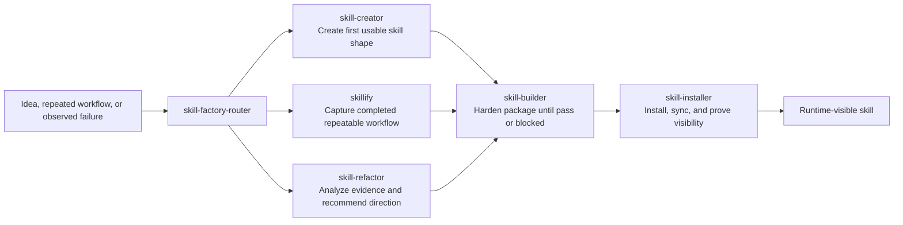

# Skill Factory

Skill Factory is the Codex plugin for skill lifecycle work. It routes skill requests, creates first drafts, captures repeatable workflows as skills, hardens existing packages, analyzes reliability evidence, installs valid packages, and proves runtime visibility.

The plugin manifest is [`.codex-plugin/plugin.json`](./.codex-plugin/plugin.json). Bundled skill sources live in [`skills/`](./skills/).

## Reader Map

- [Command-Facing Lanes](#command-facing-lanes): which skill handles which job.
- [Factory Lifecycle](#factory-lifecycle): how ideas move from draft to runtime proof.
- [Routing Boundaries](#routing-boundaries): where each lane stops.
- [Context Lifecycle](#context-lifecycle): the shared generate/test/distribute/observe/adapt frame.
- [Source Boundaries](#source-boundaries): which paths are canonical and which paths are compatibility links.
- [Validation](#validation): commands to prove docs and plugin metadata still match the live package.

## Command-Facing Lanes

| Lane | Canonical path | Use when |
|---|---|---|
| `skill-factory-router` | [`skills/skill-factory-router/`](./skills/skill-factory-router/) | A request needs classification before execution. |
| `skill-creator` | [`skills/scaffolding_templates/skill-creator/`](./skills/scaffolding_templates/skill-creator/) | A new skill or draft package needs its first usable shape. |
| `skill-builder` | [`skills/code_quality_review/skill-builder/`](./skills/code_quality_review/skill-builder/) | An existing skill or plugin needs evidence-backed hardening, budget reduction, eval coverage, safety checks, or release readiness. |
| `skill-refactor` | [`skills/data_fetch_analysis/skill-refactor/`](./skills/data_fetch_analysis/skill-refactor/) | Session or portfolio evidence should drive keep, improve, merge, split, retire, or redirect decisions. |
| `skillify` | [`skills/scaffolding_templates/skillify/`](./skills/scaffolding_templates/skillify/) | A completed repeatable workflow should become a durable skill package. |
| `skill-installer` | [`skills/infrastructure_ops/skill-installer/`](./skills/infrastructure_ops/skill-installer/) | An already valid skill needs listing, install, sync, or runtime visibility checks. |

The flat paths [`skills/skill-builder/`](./skills/skill-builder/), [`skills/skill-refactor/`](./skills/skill-refactor/), and [`skills/skillify/`](./skills/skillify/) are compatibility links to the category-owned paths above. Prefer the category path when changing source.

## Factory Lifecycle



Use this flow as the default handoff path. A lane may stop early only when it records a concrete blocker, a read-only verdict, or a user-requested pause.

## Routing Boundaries

| Request shape | Use | Stop before |
|---|---|---|
| Create a new skill or evolve a draft package into a usable first shape. | `skill-creator` | Release hardening, install proof, or portfolio analysis. |
| Convert a completed repeated workflow into a durable skill package. | `skillify` | Capturing exploratory or one-off work as if it were repeatable. |
| Improve, tighten, test, or release-harden an existing skill or plugin. | `skill-builder` | First-draft creation, install/sync operations, or read-only portfolio decisions. |
| Analyze session, review, validation, or Plugin Eval evidence for keep/improve/merge/split/retire direction. | `skill-refactor` | Editing source unless the user explicitly approves the recommended repair lane. |
| List, install, sync, or prove runtime visibility for an already valid skill. | `skill-installer` | Source creation or hardening. |

`skill-builder` is the repair lane, not the factory front door. It should patch canonical source until its gate passes or a blocker is explicit. For uncertain requests, route through `skill-factory-router` first and let it choose exactly one downstream lane.

Use Skill Builder for builder-style output: `builder_result`, `diff_summary`, severity-ranked findings, exact validation outcomes, security notes, a handoff lane only when another skill should take over, and one evidence-backed next step.

## Context Lifecycle

Skills are context packages. Durable changes should move through generate, test, distribute, observe, and adapt instead of ending at template completion. Use [`references/context-development-lifecycle.md`](./references/context-development-lifecycle.md) when repeated review feedback, session evidence, or validation drift should become a skill, eval, or routing improvement.

## Source Boundaries

Edit canonical plugin source under [`Plugins/skill-factory/`](../skill-factory/). Do not hand-edit generated runtime projections or copied plugin mirrors.

Category paths such as [`skills/code_quality_review/skill-builder/`](./skills/code_quality_review/skill-builder/) are source-owned. Flat paths such as [`skills/skill-builder/`](./skills/skill-builder/) are compatibility links. Confirm the real path with `readlink` or `find -L` before patching.

Runtime cache paths under `Plugins/cache/**` are projections and should not be edited as source. Keep examples, scripts, and references with the skill package that owns them, and do not move user-facing skills between categories without updating discovery metadata and validation.

## Validation

```sh
jq empty Plugins/skill-factory/.codex-plugin/plugin.json
python3 Plugins/plugin-factory/skills/plugin-builder/scripts/plugin_builder.py validate Plugins/skill-factory --require-marketplace --marketplace-path .agents/Plugins/marketplace.json
python3 <agent-skills-root>/Infrastructure/scripts/lifecycle-and-sync/route_skillset.py --skill-set skill-factory --skillsets-dir <agent-skills-root>/.skillsets --task "<request>" --json
Infrastructure/bin/plugin-eval analyze Plugins/skill-factory --format markdown
Infrastructure/bin/plugin-eval analyze Plugins/skill-factory/skills/code_quality_review/skill-builder --format markdown
PYTHON_BIN=/Users/jamiecraik/.venvs/pyyaml/bin/python <agent-skills-root>/bin/ask skills audit Plugins/skill-factory/skills/code_quality_review/skill-builder --level strict --json
bash Infrastructure/scripts/validation-and-linting/lint_openai_skill_format.sh --mode strict
bash Infrastructure/scripts/validation-and-linting/lint_progressive_disclosure.sh --mode warn
```

Run the focused lane gate first, then the smallest broader package gate. A package-level deferred budget warning can remain even when an individual lane is clean; evaluate important lanes directly before making release-readiness claims. `./bin/ask evals run ... --mode smoke --json` depends on the local Codex runner environment, so report runner startup failures separately from content validation.
