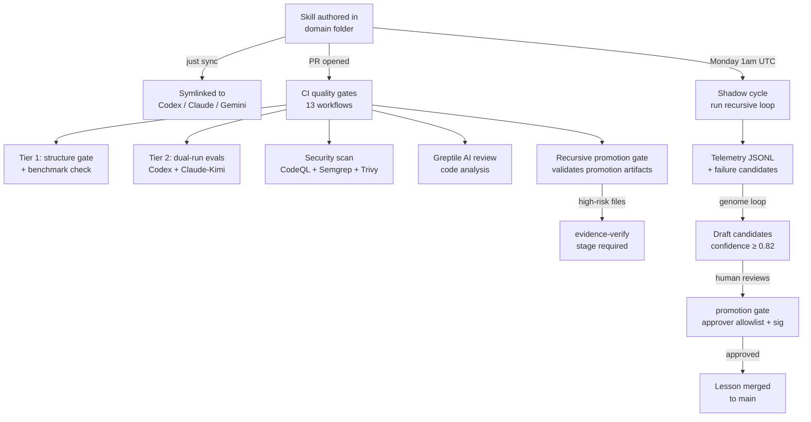

# Agent Skills

A canonical skill library and quality system for AI coding agents — Codex, Claude Code, and Gemini.

Edit a skill once. Run `just sync`. It propagates everywhere.

---

## Table of Contents

- [Why this exists](#why-this-exists)
- [What you get](#what-you-get)
- [Quickstart](#quickstart)
- [How it works](#how-it-works)
- [Repository layout](#repository-layout)
- [Creating a skill](#creating-a-skill)
- [Skill quality system](#skill-quality-system)
- [Governance and safety](#governance-and-safety)
- [Managed asset lifecycle](#managed-asset-lifecycle)
- [Limits and constraints](#limits-and-constraints)
- [Documentation](#documentation)

---

## Why this exists

Running the same skill across three AI runtimes without a shared source means they diverge. Evaluating skill quality by hand doesn't scale. Letting agents self-modify skills without human gates is unsafe.

This repository solves all three:

- **One source** → skills authored here, projected to all runtimes via `just sync`
- **Automated quality** → tiered CI gates score every skill change against a benchmark baseline
- **Human-gated improvement** → the Skill Genome Loop proposes changes; humans approve every promotion

---

## What you get

### 1. Cross-runtime skill library

One canonical library, symlinked to every runtime on sync:

| Runtime | Install location | Index format |
|---------|-----------------|--------------|
| Codex | `~/.codex/skills/` | Native skill folders |
| Claude Code | `~/.claude/skills/` | Native skill folders |
| Gemini / Antigravity | `~/.gemini/antigravity/skills/` | Folder + `skills.txt` index |

Canonical skills are authored under domain folders such as `auth/`, `backend/`, `frontend/`, `github/`, `ops/`, `product/`, and `utilities/`. Run `just sync` to project skills and plugins to the runtime directories. If you need to refresh Antigravity MCP config from `~/.codex/config.toml`, run `python3 scripts/sync_mcp.py` separately.

### 2. Deterministic skill router

`utilities/skill-builder/scripts/skill_router.py` routes natural-language queries to the most relevant skill:

```bash
python3 utilities/skill-builder/scripts/skill_router.py \
  --query "set up Better Auth for my Next.js app" \
  --top-k 3 \
  --json
```

The router:
- Scores by token overlap, path context, and explicit name mention
- Emits confidence scores and human-readable rationale
- Runs **OpenClaw readiness + security checks** on high-risk skills before routing
- Appends routing telemetry to `artifacts/skill-graphs/telemetry/route-events.jsonl`
- Respects kill-switch and rollout-mode control files

### 3. Skill quality gates (tiered, CI-enforced)

Every `SKILL.md` change runs two gate tiers:

**Tier 1 — Structure gate** (always runs):
- Validates YAML frontmatter, lifecycle metadata, and structure requirements
- Compares against a baseline JSON; fails on regressions
- Benchmarks portfolio coverage against `benchmark-policy.json`

**Tier 2 — Eval baseline** (available on `workflow_dispatch`):
- Runs `run_skill_evals.py` per skill with Codex and/or Claude-Kimi/ZAI in **dual-run mode**
- Captures JSONL traces and builds a scorecard dashboard (`artifacts/reports/skills/dashboard.json`)

```bash
# Run locally (Tier 1 equivalent)
just diagnose

# Full quality suite
just validate
```

### 4. Recursive Skill Improvement Loop

The loop runs every Monday (or on demand) against a set of pilot profiles:

```
generate → evaluate → diagnose → improve → re-score
```

Each run writes canonical artifacts under `artifacts/skill-graphs/runs/<run_id>/`:

| Artifact | What it records |
|----------|----------------|
| `run.json` | Run metadata, status, stop reason |
| `iteration_journal.jsonl` | Per-iteration scores and rationale |
| `promotion_decision.json` | Whether the run meets promotion criteria |
| `lesson_candidates.json` | Generalizable lessons from this run |

**Human promotion gate**: before any lesson or skill change is merged, a human operator runs `scripts/human_promote_recursive_run.sh`. The script validates the run ID, enforces approver-allowlist policy (`docs/skill-graphs/governance/recursive-loop-approvers.yaml`), checks the policy signature, and guards against path-traversal attacks.

```bash
# Dry-run: see what the genome loop would propose
just genome-loop

# Live run (stages candidates for review)
just genome-loop-live

# Review and approve a candidate
python3 scripts/review_candidates.py --list
python3 scripts/review_candidates.py --approve <candidate_id>
```

**Safety controls**:

| Control | How to use |
|---------|-----------|
| Kill-switch | `touch artifacts/skill-graphs/controls/kill-switch.txt` |
| Rollout mode | `echo active > artifacts/skill-graphs/controls/rollout-mode.txt` |
| Rollback required | `touch artifacts/skill-graphs/controls/rollback-required.txt` |
| Confidence gate | `composite_score ≥ 0.82`, `window_count ≥ 2` |

```bash
# Test kill-switch and rollback behavior
just rollout-drill

# View router telemetry summary
just router-metrics
```

### 5. Visual-first outputs

```bash
# Convert any plan/doc → browser-native HTML visual
just smoke-slides

# Daily skill health spotlight
just spotlight

# Domain quality scoreboard (ui / backend / security / …)
just subject-scoreboard
```

Registered visual skills: `visual-explainer` (self-contained HTML pages), `diagram-cli` (Mermaid + context packs), `slides` (PPTX from markdown). If a table reaches 4+ rows or 3+ columns, render it as HTML — not ASCII.

---

## Quickstart

```bash
# Show system status
just status

# Run all validations
just validate

# Count active skills
just count-skills

# Sync skills and plugins to all runtime directories
just sync

# Optional: refresh Antigravity MCP config from ~/.codex/config.toml
python3 scripts/sync_mcp.py

# Run full CI bundle locally
just ci-local

# Create a skill from template
mkdir -p frontend/my-skill
cp templates/SKILL.md.template frontend/my-skill/SKILL.md
```

### All commands

```bash
just --list                # All available recipes
just status                # System health overview
just validate              # Full validation suite
just diagnose              # Skill diagnostics (all skills)
just sync                  # Project skills + plugins to runtime directories
just genome-loop           # Dry-run improvement loop
just genome-loop-live      # Live improvement loop
just spotlight             # Daily health spotlight (one skill needing attention)
just subject-scoreboard    # Domain-level quality metrics
just rollout-drill         # Kill-switch + rollback resilience test
just router-metrics        # Routing telemetry analysis
just watch-readiness       # Agentation watch-mode readiness check
just smoke-slides          # Visual explainer smoke test
just docs-lint             # Documentation policy check
just harness-check         # coding-harness preflight gate (strict)
just install-cron          # Set up nightly genome loop cron
```

---

## How it works



### Skill structure

```text
skill-name/
├── SKILL.md                   # Required: YAML frontmatter + instructions
├── references/
│   ├── evals.yaml             # Optional: eval cases for Tier 2 scoring
│   └── contract.yaml          # Optional: harness contract overrides
└── scripts/                   # Optional: supporting Python/shell scripts
```

### Required YAML frontmatter

```yaml
---
name: skill-name
description: Concrete discovery description for the real trigger
metadata:
  lifecycle_state: incubating
  maturity: experimental
  owner: team-or-maintainer
  review_cadence: monthly
  last_reviewed: 2026-03-24
  metadata_source: frontmatter
---
```

### Learning posture (pilot)

Four skills support a structured pre-change dialogue:

| Posture | What happens |
|---------|-------------|
| `learn` | Agent explains alternatives, assumptions, and risks first |
| `guided` | Agent proposes concrete changes and waits for confirmation |
| `execute` | Agent applies agreed changes after safety gates pass |

Pilot skills: `skill-builder`, `agentation`, `systematic-debugging`, `interview-me`

---

## Repository layout

```text
~/dev/agent-skills/
├── auth/               # Authentication skills
├── backend/            # Backend, architecture, CLI skills
├── frontend/           # Frontend + UI + graphics + tools
├── github/             # GitHub and DevOps workflow skills
├── interview/          # Interview and requirements workflows
├── ops/                # Deployment and operational skills
├── product/            # Planning, specs, docs skills
├── utilities/          # General-purpose skills + skill-builder tooling
│   └── skill-builder/
│       └── scripts/    # Router, quality gates, eval runner, dashboard
├── .agents/skills/     # Flat symlink view (agent entrypoint)
├── skills-antigravity/ # Antigravity-specific projection
├── skills-system/      # System skills (not in flat view)
├── scripts/            # Repo-level tooling (sync, genome loop, promote)
├── references/         # Shared contracts (evals.yaml, contract.yaml)
├── templates/          # SKILL.md and eval templates
├── artifacts/          # Generated outputs (benchmarks, telemetry, reports)
├── docs/               # Contributor documentation
│   └── skill-graphs/   # Loop governance, runbooks, pilot summaries
└── harness.contract.json  # Risk-tier and merge policy contract
```

---

## Skill quality system

### CI workflows (13)

| Workflow | Trigger | What it enforces |
|----------|---------|----------------|
| `pr-pipeline.yml` | Every PR | PR template, repo validation, harness preflight gate |
| `ci-tests.yml` | Push to `main` + PR | Docs lint and skill diagnostics |
| `skill-quality.yml` | Skill-quality path changes on PR + dispatch | Tier-1 structure gate; optional Tier-2 dual-run evals |
| `skill-graph-diff.yml` | Skill graph path changes on PR | Graph diff comment and hub-stability checks |
| `recursive-promotion-gate.yml` | Promotion artifact changes on PR + dispatch | Promotion decision validation |
| `recursive-skill-shadow.yml` | Scheduled run + dispatch | Shadow cycle and candidate generation |
| `benchmark-policy-refresh.yml` | Scheduled run + dispatch | Benchmark threshold refresh |
| `greptile-review.yml` | Every PR | AI-assisted review pass |
| `secret-scan.yml` | Push to `main`, PR, merge queue | Gitleaks, Trivy, and Semgrep filesystem scan |
| `security-scan.yml` | Push to `main`, PR, nightly schedule | Security SARIF uploads plus artifact secret scan |
| `codeql.yml` | Push/PR on protected branches + schedule + dispatch | CodeQL static analysis |
| `docs-governance.yml` | Docs/governance path changes on PR/push + dispatch | Docs policy and governance checks |
| `gov-security-gates.yml` | Governance/compliance/security path changes on PR | Policy integrity checks |

### harness.contract.json

The contract (`v1.2.0`) defines concrete policies applied on every PR:

- **Risk tiers**: `scripts/**` and `.github/workflows/**` → `high`; `**/SKILL.md` → `medium`; `README.md` → `low`
- **Merge policy by tier**: high requires `review-gate` + `evidence-verify`; medium requires `review-gate`
- **Diff budget**: max 10 files, max 400 net LOC (overridable with `diff-budget-override` label)
- **Memory policy**: sessions require `repo`, `area`, `type` tags; forbids credentials in stored observations
- **Branch protection**: PRs to `main`, `master`, `release/*` are blocked by default

---

## Governance and safety

- **Approver allowlist**: `docs/skill-graphs/governance/recursive-loop-approvers.yaml` (signature-verified)
- **Branch protection**: promotion scripts enforce `confine_run_dir()` — run directories must stay within `artifacts/skill-graphs/runs/`
- **Secret redaction**: `run_skill_genome_loop.py` scrubs OpenAI keys, GitHub PATs, Slack tokens, SSH keys, AWS keys, JWTs, and IP addresses before writing any candidate
- **Kill-switch**: one file write halts the genome loop immediately
- **OpenClaw guard**: skill router runs readiness and security checks before routing to high-risk skills

---

## Managed asset lifecycle

Phase-one managed asset governance keeps one lifecycle contract across:
- canonical skills
- packaged skills
- plugin packages

Phase-one defaults:
- authoritative lifecycle metadata stays in-file
- Markdown-governed assets use canonical `SKILL.md` frontmatter
- plugin packages use `.codex-plugin/plugin.json`
- packaged skills inherit lifecycle metadata from the canonical source skill when a one-to-one mapping exists
- `docs/solutions/` entries need linked assets, concrete evidence, ownership context, and freshness markers

Reference:
- [Managed asset lifecycle reference](docs/reference/managed-asset-lifecycle.md)
- [Governed solutions](docs/solutions/README.md)

---

## Troubleshooting

### Skill not found after sync

```bash
# Check for nested .git (most common cause)
just check-nested-git

# Re-run sync
just sync

# Diagnose specific skill
python3 scripts/diagnose_skill.py <skill-name>

# Check YAML frontmatter has both 'name:' and 'description:'
head -5 <skill-dir>/SKILL.md
```

### Validation failures

```bash
# Docs lint
python3 scripts/docs_lint.py --mode warn --config docs-policy.json

# Plan graph validation
python3 ~/.codex/scripts/plan-graph-lint.py .agent/PLANS.md

# Skill router schema check
python3 scripts/verify_router_schema.py
```

### Genome loop stuck or misbehaving

```bash
# Check active control files
ls artifacts/skill-graphs/controls/

# Check watermark (last processed offset)
cat artifacts/skill-graphs/telemetry/.genome-watermark

# Run rollout drill to confirm kill-switch works
just rollout-drill
```

---

## Limits and constraints

| Capability | Current state |
|------------|--------------|
| Skill isolation | Per-folder (no sandboxing between skills) |
| Versioning | Repo-level only (no per-skill semver) |
| Language | English only |
| Sync | Local symlinks — use git for cross-machine distribution |
| Eval runner auth | Tier-2 evals require `codex` and/or `claude` CLI + auth on the runner |

---

## Documentation

- **[Skills index](SKILL.md)** — auto-generated list of the current surfaced skills with descriptions
- **[Contributor docs](docs/index.md)** — how to add, validate, and ship skills
- **[Governed solutions](docs/solutions/README.md)** — reusable fixes and decisions linked to governed assets
- **[Skill Genome runbook](docs/skill-graphs/runbooks/skill-genome-loop.md)** — operating the improvement loop
- **[Agent governance](docs/agents/06-security-and-governance.md)** — security policy and audit trail

---

## Governance

- **License**: Apache 2.0 ([LICENSE](LICENSE))
- **Contributing**: [CONTRIBUTING.md](CONTRIBUTING.md)
- **Security**: [SECURITY.md](SECURITY.md)
- **Code of Conduct**: [CODE_OF_CONDUCT.md](CODE_OF_CONDUCT.md)

---

<div align="center">

**brAInwav** — _from demo to duty_

</div>

---

<!-- AGENT-FIRST-WORKFLOW:START -->
## Agent-first workflow

1. Create or update a plan in `.agent/PLANS.md`
2. Validate: `python3 ~/.codex/scripts/plan-graph-lint.py .agent/PLANS.md`
3. Verify: `bash scripts/verify-work.sh`
<!-- AGENT-FIRST-WORKFLOW:END -->
