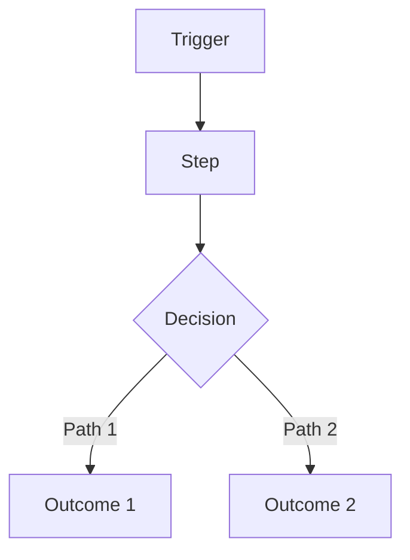
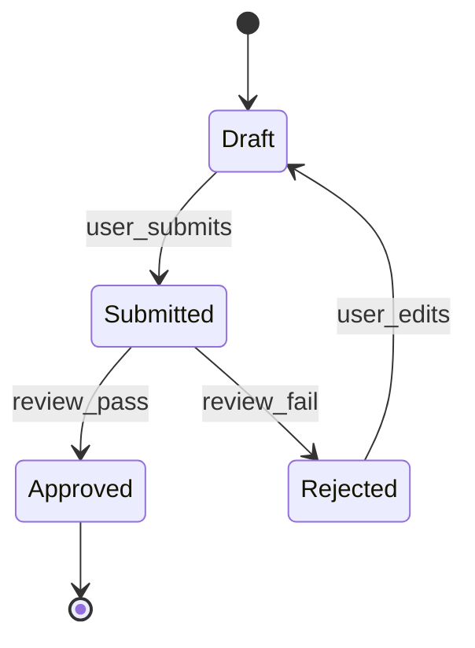

# PRD: <Product / Feature Name>

**Owner:** <name>  
**Status:** Draft | In Review | Approved  
**Last updated:** YYYY-MM-DD  
**Stakeholders:** <names/roles>  
**Links:** Repo/Issue | Design file | Tech Spec | Analytics dashboard | Support threads  

> Rule: If a section is not applicable, write `N/A` and explain why in 1–2 lines.
> Evidence rule: Every paragraph must end with an `Evidence:` line or `Evidence gap:` line. Use file paths/links; summarize all gaps and sources in the Evidence sections.

---

## 0) PRD Summary
- **One-liner:** <what we’re building + for whom>
- **Why now:** <why this matters now>
- **Desired outcome:** <measurable outcome in plain English>

---

## 0.1) Template Metadata (required for template-driven deliverables)
- **name:** <unique template identifier, e.g., "bug-fix">
- **description:** <human-readable description>
- **title_template:** <template string with {variable} placeholders>
- **acceptance_criteria:**
  - <criterion>
  - <criterion>
- **priority:** <default priority, e.g., "medium">
- **variables:** [<variable_name>, <variable_name>]
- **metadata:** { "author": "<name>", "version": "<x.y>", "notes": "<optional>" }
- **export (required):** `python3 scripts/spec-export.py <spec>.md --out <spec>.template.json`

---

## 1) Executive Summary
Write 2–3 short paragraphs that cover:
- The user problem/opportunity
- The intended change
- Why it matters (value)
- How we’ll measure success (high level)
- What is explicitly *not* being tackled (high level)

---

## 2) Problem Statement / Opportunity

### 2.1 Problem
- **Who is affected:** <persona/segment>
- **Pain today:** <what’s broken/slow/risky>
- **Current workaround:** <how they cope today>
- **Impact if we do nothing:** <cost/churn/risk/time>

### 2.2 Evidence (required)
List concrete evidence that the problem is real:
- <support tickets / logs / survey results / interviews>
- <metrics (rates, counts, drop-offs)>
- <quotes (with link/source)>

### 2.3 Opportunity
- **What improves if solved:** <outcome delta>
- **Why we’re well-positioned:** <distribution/insight/technical leverage>

---

## 3) Target Users / Personas
> Personas must be specific. Each persona should have real context + pain.

| Persona | Role | Context | Goals | Pain points |
|---|---|---|---|---|
| <Name> | <Role> | <When/where they use it> | <goal phrases> | <pain phrases> |
| <Name> | <Role> | <When/where they use it> | <goal phrases> | <pain phrases> |

**Primary user(s):** <persona(s)>  
**Secondary user(s):** <persona(s) or N/A>  

---

## 4) User Stories / Use Cases

### 4.1 Core user stories (MVP)
> Format must be: **As a [persona], I want [action] so that [benefit].**

1) **Story:** As a <persona>, I want <action> so that <benefit>.  
   **Acceptance criteria:**
   - [ ] <observable behavior>
   - [ ] <observable behavior>
   **Validation method:** <tests/lint/build/manual check; prefer repo scripts>
   **Priority:** Must | Should | Could  
   **Notes:** <constraints, policy, permissions in product terms>

2) **Story:** As a <persona>, I want <action> so that <benefit>.  
   **Acceptance criteria:**
   - [ ] <observable behavior>
   - [ ] <observable behavior>
   **Validation method:** <tests/lint/build/manual check; prefer repo scripts>
   **Priority:** Must | Should | Could

### 4.2 Use case narratives (recommended)
Write 1–3 short narratives:
- **Use case A:** Trigger → Steps → Outcome  
- **Use case B:** Trigger → Steps → Outcome  

---

## 5) Acceptance Criteria (Top-level)
> Criteria that must be true for this PRD/feature to be considered done, beyond per-story criteria.

- [ ] <criterion>
- [ ] <criterion>

### 5.1 Validation & Quality Gates (required)
> Specify how criteria will be validated. Prefer repo scripts; otherwise recommend stack-appropriate tools.
- **Lint/format:** <command>
- **Typecheck:** <command or N/A>
- **Tests:** <command>
- **Manual validation:** <what to verify>

---

## 6) Decision Log / ADRs (required)
- **Decision:** <what was decided>
  - **Rationale:** <why>
  - **Alternatives:** <other options>
  - **Tradeoffs:** <what we accept>
  - **ADR link:** <path or URL>

---

## 7) Data Lifecycle & Retention (required)
- **Data created:** <what new data is created>
- **Data sources:** <systems/data inputs>
- **Retention policy:** <duration and rationale>
- **Deletion policy:** <how/when data is deleted>
- **Data subject requests:** <how DSAR/delete/export handled or N/A>

---

## 8) Functional Requirements
> Group by user journey. Keep requirements testable and user-visible.

### Journey: <Name>
- FR-1: <requirement> (Priority: Must/Should/Could)
- FR-2: <requirement>
- FR-3: <requirement>

### Edge cases & failure UX (required)
- If <condition>, then the user sees/does: <behavior>
- If <condition>, then the user sees/does: <behavior>
- If <condition>, then the user sees/does: <behavior>

---

## 9) Non-Functional Requirements
> High-level requirements only. No architecture/database/framework choices here.

- **Performance:** <expectations; only numbers if you have them, otherwise "N/A">
- **Reliability:** <availability or degraded mode expectations>
- **Security & privacy:** <data sensitivity; access expectations; audit needs>
- **Compliance:** <PCI/PHI/GDPR/etc or N/A>
- **Accessibility:** <minimum bar; e.g., WCAG target or "N/A">
- **Observability expectation:** <what must be measurable from product POV>

---

## 10) Success Metrics / KPIs
> Every metric needs a target and a measurement method.

| Metric | Target | Measurement method | Source |
|---|---:|---|---|
| <Metric> | <#/%> | <how measured> | <event/dashboard> |
| <Metric> | <#/%> | <how measured> | <event/dashboard> |

**Measurement window:** <e.g., 7 days post-launch, 30 days post-launch>  

### Guardrails (required)
- <metric that must not regress>
- <metric that must not regress>

---

## 11) Scope

### In scope
- <bullet>
- <bullet>

### Out of scope (required)
- <bullet>
- <bullet>

### Non-goals (recommended)
- <explicitly not doing>
- <explicitly not doing>

---

## 12) Feature Creep Guardrails (required)
> Answer explicitly; if adding scope, record trade-offs and approvals.

- **Core problem validated?** <evidence and link>
- **Smallest shippable version:** <description>
- **What we are NOT building to make room:** <trade-off>
- **Success measure for any new scope:** <metric + target>
- **48-hour rule applied for scope additions:** <yes/no + date>

---

## 13) Scope Decision Log (required)
| Date | Request | Source | Decision | Rationale | Trade-off |
|---|---|---|---|---|---|
| YYYY-MM-DD | <feature> | <stakeholder/agent> | Approved/Deferred/Rejected | <why> | <what we cut/delay> |

---

## 14) Dependencies
### Internal
- <teams/systems>

### External
- <vendors/APIs>

### Assumptions about dependencies (required)
- <assumption that must hold>
- <assumption that must hold>

---

## 15) Risks and Mitigations
| Risk | Likelihood | Impact | Mitigation |
|---|---|---|---|
| <risk> | Low/Med/High | Low/Med/High | <mitigation/fallback> |
| <risk> | Low/Med/High | Low/Med/High | <mitigation/fallback> |

---

## 16) Timeline / Milestones (optional)
> If N/A, state why.

| Milestone | Date | Notes |
|---|---|---|
| <M1> | YYYY-MM-DD | <short> |
| <M2> | YYYY-MM-DD | <short> |

---

## 17) Diagrams & Clarity Checks (recommended)

### 17.1 User journey flow (Mermaid)

### 17.2 State model (Mermaid)

> Include for user-facing lifecycles with multiple states (e.g., onboarding, verification, subscription states, order lifecycle).

---

## 18) Launch & Rollback Guardrails (required)
- **Go/No-Go metrics:** <specific thresholds>
- **Rollback triggers:** <conditions>
- **Verification steps:** <post-deploy checks>
- **Owners:** <who decides and executes>

---

## 19) Post-Launch Monitoring Plan (required)
- **Monitoring window:** <e.g., 7/30 days>
- **Primary dashboards:** <links or names>
- **On-call / owners:** <names/roles>
- **Alert thresholds:** <what triggers action>

---

## 20) Support / Ops Impact (required)
- **Runbook links:** <paths/URLs>
- **Support volume change:** <expected delta or N/A>
- **Escalation path:** <team/owner>
- **Manual operations:** <new tasks or N/A>

---

## 21) Compliance & Regulatory Review Triggers (required)
- **Triggers:** <e.g., PII, payments, healthcare, minors, geo data>
- **Required reviews:** <legal/security/privacy>
- **Status:** <not started/in progress/complete>
- **Notes:** <what was reviewed>

---

## 22) Ownership & RACI (required)
| Area | Responsible | Accountable | Consulted | Informed |
|---|---|---|---|---|
| Product | <name> | <name> | <names> | <names> |
| Engineering | <name> | <name> | <names> | <names> |
| Security/Privacy | <name> | <name> | <names> | <names> |
| Support/Ops | <name> | <name> | <names> | <names> |

---

## 23) Security & Privacy Classification (required)
- **Data sensitivity tier:** <public/internal/confidential/restricted>
- **PII/PHI/PCI:** <yes/no + details>
- **Required controls:** <encryption, access logs, retention, etc.>
- **Privacy impact assessment:** <required/not required + status>

---

## 24) Dependency SLAs & Vendor Risk (required)
- **Third-party dependencies:** <list>
- **SLA/SLO expectations:** <uptime/latency>
- **Fallback plan:** <what happens if vendor is down>

---

## 25) Cost Model & Budget Guardrails (required)
- **Cost drivers:** <requests, storage, vendor fees, etc.>
- **Budget cap:** <monthly/annual>
- **Cost alerts:** <thresholds and owners>

---

## 26) Localization & Internationalization (required)
- **Locales in scope:** <list or N/A>
- **Translation workflow:** <how strings are managed>
- **Formatting rules:** <dates, currency, time zones>

---

## 27) Backward Compatibility & Deprecation (required)
- **Compatibility constraints:** <APIs/clients/data>
- **Deprecation plan:** <timelines and comms>
- **Migration aids:** <docs, tooling, redirects>

---

## 28) Experimentation & Feature Flags (required)
- **Experiment plan:** <A/B, rollout, ramp>
- **Flag ownership:** <team/person>
- **Kill switch:** <where/how to disable>

---

## 29) Kill Criteria (required)
- **Stop conditions:** <metrics or constraints>
- **Decision owner:** <name/role>
- **Communication plan:** <who is informed>

---

## 30) Evidence Gaps (required)
- **Gap:** <missing evidence for a key claim> — **Impact:** <risk of being wrong> — **Owner:** <name>
- **Gap:** <missing evidence for a key claim> — **Impact:** <risk of being wrong> — **Owner:** <name>

---

## 31) Evidence Map (required)
| Section / Claim | Evidence | Confidence | Notes |
|---|---|---|---|
| <section or claim> | <file path or URL> | High/Medium/Low | <why it supports the claim> |
| <section or claim> | <file path or URL> | High/Medium/Low | <why it supports the claim> |

---

## 32) Assumptions & Open Questions (required)

### Assumptions

* A-1: <assumption>
* A-2: <assumption>

### Open questions

* Q-1: <question> (Owner: <name>, Due: YYYY-MM-DD)
* Q-2: <question> (Owner: <name>, Due: YYYY-MM-DD)

---

## 33) PRD Integrity Rule (required)

* This PRD defines **WHAT / WHY / WHO**.
* It must **not** prescribe technical implementation details (databases, frameworks, service topology, specific libraries, etc.).
* If any technical detail seems unavoidable, move it to the Tech Spec and reference it from here.

---

## 34) PRD Review Checklist (required)

* [ ] Problem statement is clear and evidence-backed
* [ ] Personas are specific and pains are real
* [ ] Stories follow “As a… I want… so that…”
* [ ] Acceptance criteria are observable/testable
* [ ] Success metrics have numeric targets + measurement method
* [ ] Scope includes explicit OUT
* [ ] Dependencies listed with assumptions
* [ ] Risks are realistic and mitigations exist
* [ ] No technical implementation details
* [ ] Every paragraph ends with `Evidence:` or `Evidence gap:`
* [ ] Evidence Gaps and Evidence Map sections are complete
