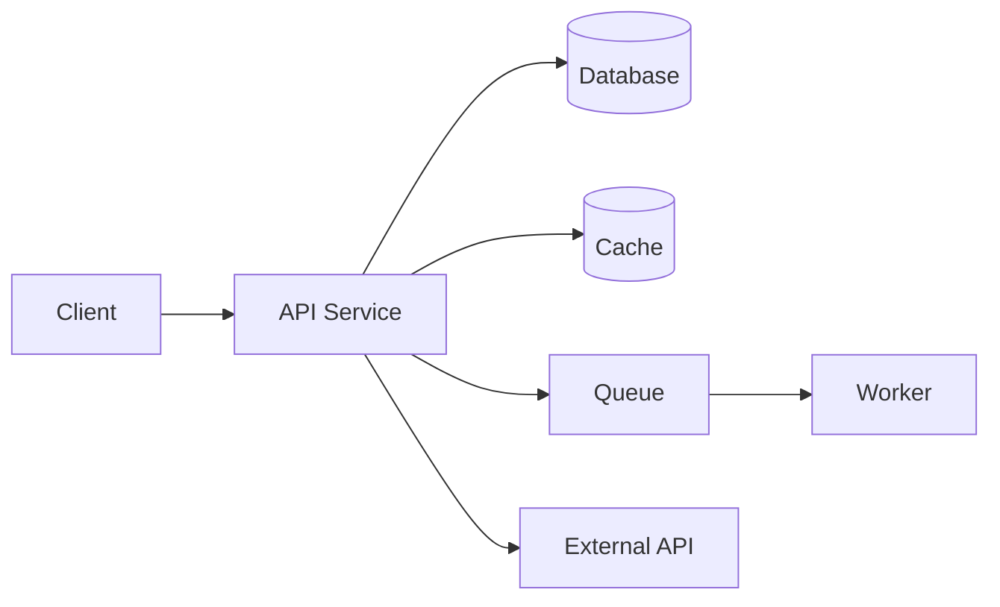
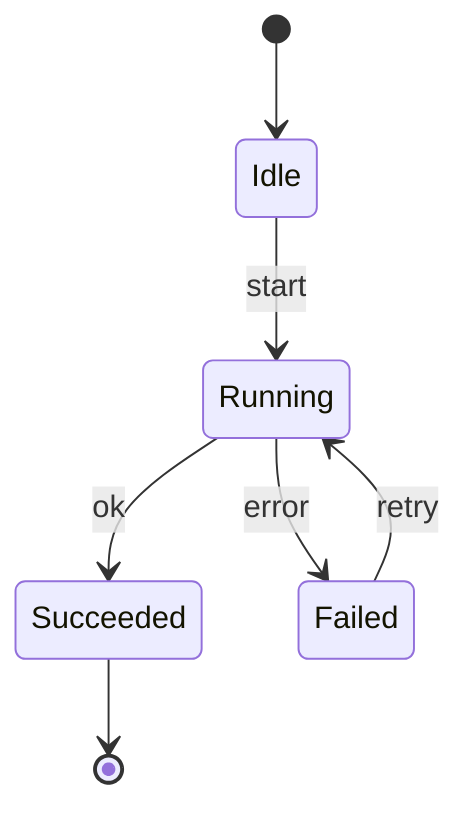
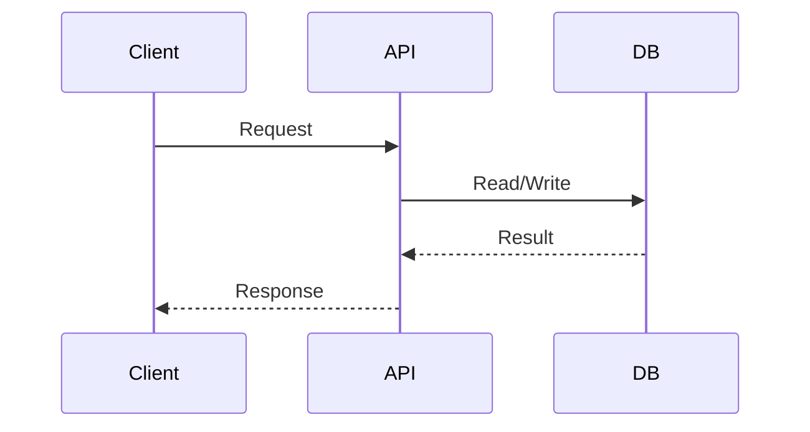
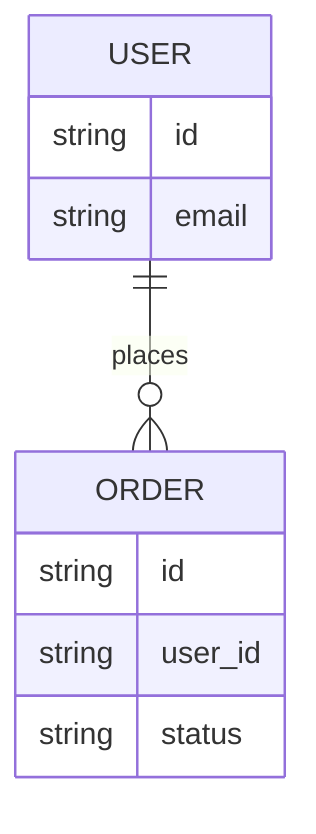

# Technical Specification: <System / Feature Name>

**Owner:** <name>  
**Status:** Draft | In Review | Approved  
**Last updated:** YYYY-MM-DD  
**Related PRD:** <link or "N/A">  
**Repo / Tracking:** <issue/epic link>  
**Reviewers:** <names/roles>  
**Release target:** <date or "TBD">  

> Evidence rule: Every paragraph must end with an `Evidence:` line or `Evidence gap:` line. Use file paths/links; summarize all gaps and sources in the Evidence sections.

---

## 0) Summary
- **One-liner:** <what are we building>
- **Primary goal:** <the outcome we want>
- **Key risks:** <top 1–3 technical risks>
- **Rollout shape:** <flag/canary/phased/etc>

---

## 0.1) Template Metadata (required for template-driven deliverables)
- **name:** <unique template identifier, e.g., "bug-fix">
- **description:** <human-readable description>
- **title_template:** <template string with {variable} placeholders>
- **acceptance_criteria:**
  - <criterion>
  - <criterion>
- **priority:** <default priority, e.g., "medium">
- **variables:** [<variable_name>, <variable_name>]
- **metadata:** { "author": "<name>", "version": "<x.y>", "notes": "<optional>" }
- **export (required):** `python3 scripts/spec-export.py <spec>.md --out <spec>.template.json`

---

## 1) Overview / Context
### Context
<What exists today, what’s changing, and why.>

### Constraints
- Platform constraints: <languages/frameworks/runtime>
- Integration constraints: <systems you must integrate with>
- Compliance constraints: <if any>
- Operating constraints: <SLA, on-call, cost ceiling>

### Glossary (only if needed)
- Term: definition

---

## 2) Goals and Non-Goals
### Goals
- G1: <goal>
- G2: <goal>

### Non-Goals (required; RNIA — if N/A, say why)
- NG1: <explicitly not doing>
- NG2: <explicitly not doing>

### Success criteria (engineering)
- <measurable outcomes tied to performance/reliability/correctness>

---

## 3) Scope (implementation)
### In scope
- <bullet>
- <bullet>

### Out of scope (required)
- <bullet>
- <bullet>

### Non-goals (recommended)
- <explicitly not doing>
- <explicitly not doing>

---

## 4) Feature Creep Guardrails (required)
> For scope changes during implementation, record approvals and trade-offs.

- **Core problem validated?** <evidence and link>
- **Smallest shippable version:** <description>
- **What we are NOT building to make room:** <trade-off>
- **Success measure for any new scope:** <metric + target>
- **48-hour rule applied for scope additions:** <yes/no + date>

---

## 5) Scope Decision Log (required)
| Date | Request | Source | Decision | Rationale | Trade-off |
|---|---|---|---|---|---|
| YYYY-MM-DD | <feature> | <stakeholder/agent> | Approved/Deferred/Rejected | <why> | <what we cut/delay> |

---

## 6) Acceptance Criteria
> Criteria that must be true for this spec/implementation to be considered done, beyond test cases.

- [ ] <criterion>
- [ ] <criterion>

---

## 7) Decision Log / ADRs (required)
- **Decision:** <what was decided>
  - **Rationale:** <why>
  - **Alternatives:** <other options>
  - **Tradeoffs:** <what we accept>
  - **ADR link:** <path or URL>

---

## 8) Data Lifecycle & Retention (required)
- **Data created:** <what new data is created>
- **Data sources:** <systems/data inputs>
- **Retention policy:** <duration and rationale>
- **Deletion policy:** <how/when data is deleted>
- **Data subject requests:** <how DSAR/delete/export handled or N/A>

---

## 9) System Architecture
### Architecture diagram (Mermaid)
> Always embed Mermaid source. If you need PNG/SVG, render with `scripts/render-diagrams.sh`.



### Architectural decisions (with rationale)

For each major decision:

* **Decision:** <what>
* **Rationale:** <why>
* **Alternatives:** <what else was considered>
* **Tradeoffs:** <what we accept>

---

## 10) Component Design

> Include planned/current/future components. Every component must have clear boundaries.

### Component inventory

| Component | Type               | Status                 |
| --------- | ------------------ | ---------------------- |
| <name>    | service/job/ui/lib | planned/current/future |
| <name>    | service/job/ui/lib | planned/current/future |

### Component: <name>

**Status:** planned | current | future

**Responsibilities**

* <bullet>
* <bullet>

**Inputs**

* <HTTP/queue/event/cron/etc>

**Outputs**

* <DB writes/events/emails/etc>

**Owned data**

* <what it owns as source-of-truth>

**Dependencies**

* <systems it calls/reads>

#### State machine (Required for stateful components; RNIA with reason)

> If the component has meaningful lifecycle state (jobs, orders, sessions, subscriptions, onboarding, verification, etc.), include a `stateDiagram-v2`.
> If stateless, write: `State machine: N/A (stateless)` with a one-liner why.



#### Failure modes & recovery (Required)

* Failure: <what can go wrong>

  * Detection: <logs/metrics/alerts>
  * Handling: <retry/fallback/circuit breaker/manual>
  * User impact: <what user sees>
  * Data impact: <partial writes? consistency risk?>

#### Scaling notes (if relevant)

* Expected load now: <#>
* Expected load in 12–24 months: <#>
* Bottlenecks and mitigations: <bullet list>

---

## 11) API Design

> Prefer OpenAPI where possible. If not using OpenAPI, define full schemas and error behavior.

### API overview

* Auth model: <authn/authz approach>
* Versioning: <path/header>
* Idempotency: <policy>
* Pagination: <policy>
* Rate limits: <policy>

### Endpoint: <name>

* **Method:** GET | POST | PUT | PATCH | DELETE
* **Path:** /v1/<...>
* **Auth:** <who/what scopes>
* **Idempotent:** yes/no (how)

**Request schema**

```json
{
  "example": "..."
}
```

**Response schema (200)**

```json
{
  "example": "..."
}
```

**Errors**

* 400: <when>
* 401/403: <when>
* 404: <when>
* 409: <when>
* 429: <when>
* 5xx: <when>

### Sequence diagram (Recommended for complex flows)



---

## 12) Data Models / Database Schema

### ER diagram (Mermaid) (Recommended if relational)



### Tables / Collections

#### <table_or_collection_name>

* Primary key: <...>
* Fields:

  * <field>: <type> <constraints>
* Indexes:

  * <index_name>: (<cols>) for <query>
* Retention:

  * <duration/policy>
* PII classification:

  * none | low | high
* Consistency:

  * <strong/eventual + justification>

---

## 13) Infrastructure Requirements

* Runtime: <node/python/go/etc>
* Deployment: <k8s/serverless/vm>
* Environments: dev | staging | prod
* Config management: <approach>
* Secrets: <approach>
* Networking: <inbound/outbound constraints>
* Cost considerations: <big drivers>

---

## 14) Security Considerations (Required)

* Authentication: <how identities are established>
* Authorization: <how access is enforced>
* Encryption: in transit / at rest
* Input validation: <schema validation + sanitization>
* Secrets management: <rotation/storage>
* Threats & mitigations:

  * T1: <threat> → <mitigation>
  * T2: <threat> → <mitigation>
  * T3: <threat> → <mitigation>

---

## 15) Error Handling Strategy (Required)

* Error taxonomy: validation | auth | dependency | timeout | unknown
* Timeouts: <per dependency>
* Retry policy: <what retries, max attempts, backoff>
* Idempotency strategy: <where/how>
* Degraded mode: <what still works, what fails fast>
* User-facing error mapping: <how messages/status are handled>

---

## 16) Performance Requirements / SLAs or SLOs (Required)

| SLI          |  Target | Measurement      |
| ------------ | ------: | ---------------- |
| p95 latency  |    <ms> | <where measured> |
| availability | <99.x%> | <where measured> |
| throughput   |   <rps> | <where measured> |

## 16b) SLOs and Error Budget (Required or N/A with reason)
- SLIs chosen: <list>  
- SLO targets: <targets>  
- Error budget window: <e.g., 30 days>  
- Error budget policy: actions at 25/50/75/100% burn (e.g., pause launches, incident, rollback)  

---

## 17) Observability (Required)

* Logging:

  * Required fields: <request_id, user_id?, component, error_code, latency_ms>
* Metrics:

  * Counters: <requests_total, errors_total>
  * Histograms: <latency>
  * Gauges: <queue_depth, cache_hit_rate>
* Tracing:

  * Propagation: <trace id headers>
* Dashboards:

  * <links>
* Alerts:

  * Alert 1: <condition> → <action>
  * Alert 2: <condition> → <action>

---

## 18) Testing Strategy (Required)

* Unit tests: <scope>
* Integration tests: <scope>
* E2E tests: <scope>
* Load tests: <targets and method>
* Security tests: <SAST/DAST/deps scan>
* Test data strategy: <fixtures, anonymized prod data?>

---

## 19) Deployment Strategy (Required)

* Build & release: <pipeline>
* Rollout: <blue/green, canary, phased>
* Feature flags: <strategy>
* Backward compatibility: <API/db compatibility>
* Rollback: <what is reversible, how fast, and what triggers rollback>
* Post-deploy verification: <smoke tests, metrics checks>

---

## 20) Migration Plan (if applicable)

* Step 1: <prepare>
* Step 2: <backfill/dual write>
* Step 3: <cutover>
* Step 4: <cleanup>

---

## 21) Operational Notes (Recommended)

* Runbook: <how to diagnose common failures>
* Manual operations: <backfill, reprocess, re-run job>
* Support playbook: <common user issues + mitigation>
* On-call readiness: <who gets paged, what to check first>

---

## 22) Launch & Rollback Guardrails (required)
- **Go/No-Go metrics:** <specific thresholds>
- **Rollback triggers:** <conditions>
- **Verification steps:** <post-deploy checks>
- **Owners:** <who decides and executes>

---

## 23) Post-Launch Monitoring Plan (required)
- **Monitoring window:** <e.g., 7/30 days>
- **Primary dashboards:** <links or names>
- **On-call / owners:** <names/roles>
- **Alert thresholds:** <what triggers action>

---

## 24) Support / Ops Impact (required)
- **Runbook links:** <paths/URLs>
- **Support volume change:** <expected delta or N/A>
- **Escalation path:** <team/owner>
- **Manual operations:** <new tasks or N/A>

---

## 25) Compliance & Regulatory Review Triggers (required)
- **Triggers:** <e.g., PII, payments, healthcare, minors, geo data>
- **Required reviews:** <legal/security/privacy>
- **Status:** <not started/in progress/complete>
- **Notes:** <what was reviewed>

---

## 26) Ownership & RACI (required)
| Area | Responsible | Accountable | Consulted | Informed |
|---|---|---|---|---|
| Product | <name> | <name> | <names> | <names> |
| Engineering | <name> | <name> | <names> | <names> |
| Security/Privacy | <name> | <name> | <names> | <names> |
| Support/Ops | <name> | <name> | <names> | <names> |

---

## 27) Security & Privacy Classification (required)
- **Data sensitivity tier:** <public/internal/confidential/restricted>
- **PII/PHI/PCI:** <yes/no + details>
- **Required controls:** <encryption, access logs, retention, etc.>
- **Privacy impact assessment:** <required/not required + status>

---

## 28) Dependency SLAs & Vendor Risk (required)
- **Third-party dependencies:** <list>
- **SLA/SLO expectations:** <uptime/latency>
- **Fallback plan:** <what happens if vendor is down>

---

## 29) Cost Model & Budget Guardrails (required)
- **Cost drivers:** <requests, storage, vendor fees, etc.>
- **Budget cap:** <monthly/annual>
- **Cost alerts:** <thresholds and owners>

---

## 30) Localization & Internationalization (required)
- **Locales in scope:** <list or N/A>
- **Translation workflow:** <how strings are managed>
- **Formatting rules:** <dates, currency, time zones>

---

## 31) Backward Compatibility & Deprecation (required)
- **Compatibility constraints:** <APIs/clients/data>
- **Deprecation plan:** <timelines and comms>
- **Migration aids:** <docs, tooling, redirects>

---

## 32) Experimentation & Feature Flags (required)
- **Experiment plan:** <A/B, rollout, ramp>
- **Flag ownership:** <team/person>
- **Kill switch:** <where/how to disable>

---

## 33) Kill Criteria (required)
- **Stop conditions:** <metrics or constraints>
- **Decision owner:** <name/role>
- **Communication plan:** <who is informed>

---

## 34) Evidence Gaps (required)
- **Gap:** <missing evidence for a key claim> — **Impact:** <risk of being wrong> — **Owner:** <name>
- **Gap:** <missing evidence for a key claim> — **Impact:** <risk of being wrong> — **Owner:** <name>

---

## 35) Evidence Map (required)
| Section / Claim | Evidence | Confidence | Notes |
|---|---|---|---|
| <section or claim> | <file path or URL> | High/Medium/Low | <why it supports the claim> |
| <section or claim> | <file path or URL> | High/Medium/Low | <why it supports the claim> |

---

## 36) Open Questions / Future Considerations (Required)

### Open questions

* Q1: <question> (Owner: <name>, Due: YYYY-MM-DD)
* Q2: <question>

### Future considerations

* <future feature/scale concern>

---

## 37) Tech Spec Quality Gate (Required)

> If anything is N/A, explicitly write `N/A` and why.

* [ ] Architecture is clear and diagrammed
* [ ] Every stateful component has a state machine (or N/A + reason)
* [ ] APIs have complete schemas + errors
* [ ] Data model includes constraints and indexes
* [ ] Security threats are identified and mitigations listed
* [ ] Error handling covers timeouts, retries, idempotency, degraded modes
* [ ] Performance targets are numeric and measurable
* [ ] Observability includes logs, metrics, dashboards, alerts
* [ ] Deployment is repeatable and rollbackable
* [ ] No ambiguity left for implementers
* [ ] Every paragraph ends with `Evidence:` or `Evidence gap:`
* [ ] Evidence Gaps and Evidence Map sections are complete
