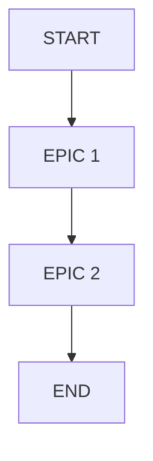

# Build Plan Template

> Use for `.spec/build-plan-YYYY-MM-DD-<slug>.md`.  
> Every paragraph ends with `Evidence:` or `Evidence gap:`.

## 0) Build Plan Summary

One-sentence execution summary.  
Evidence:

## 1) Outcome → Opportunities → Solution

- Outcome:
- Opportunities:
- Chosen solution:
- Rejected alternatives:

Evidence:

## 2) Key Assumptions & Risks (Top 3–5)

- Assumption/Risk: ...  
  Mitigation: ...  
  Evidence:

## 3) Epics (Sequenced)

1) Epic: ...
2) Epic: ...

Evidence:

## 4) Stories per Epic (with Acceptance Criteria)

### Epic: <Name>

- Story: ...  
  Acceptance Criteria: ...  
  Validation: tests/lint/build/manual  
  Evidence:

## 5) Data + Contracts (Lightweight)

- Entities:
- Key fields:
- API/routes:
- Permissions/auth:

Evidence:

## 6) Test Strategy

- Unit tests:
- Integration tests:
- E2E tests:
- Failure-mode tests:

Evidence:

## 7) Release & Measurement Plan

- Rollout:
- Monitoring/alerts:
- Measurement window + owner:
- Rollback:

Evidence:

## 8) Diagrams

Evidence:

## Evidence Gaps

- ...

## Evidence Map

| Claim/Section | Evidence | Notes |
| --- | --- | --- |
| | | |
