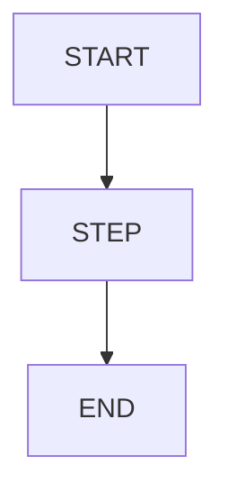

# Foundation Spec Template

> Use for `.spec/foundation-YYYY-MM-DD-<slug>.md`.  
> Every paragraph ends with `Evidence:` or `Evidence gap:`.

## 0) PRD Summary

One-sentence summary.  
Evidence:

## 1) Problem & Job (JTBD-lite)

- Primary user:
- Job to be done:
- Current workaround:
- Why now:

Evidence:

## 2) Success Criteria

- Primary metric (target + time window):
- Activation definition:
- Guardrail metrics:

Evidence:

## 3) Scope

### In-scope (MVP)

- ...

Evidence:

### Out-of-scope (Explicit)

- ...

Evidence:

## 4) Primary Journey (Happy Path Only)

1) ...
2) ...
3) ...

Evidence:

## 5) User Stories (Top 5–10)

- As a ..., I want ..., so that ...  
  Acceptance Criteria: ...  
  Evidence:

## 6) Assumptions

- ...

Evidence:

## 7) Risks & Mitigations (Top 3–5)

- Risk: ...  
  Mitigation: ...  
  Evidence:

## 8) Positioning Constraints (NEW / EASY / SAFE / BIG)

- Emphasis:
- Rationale:

Evidence:

## 9) Diagrams

Evidence:

## Evidence Gaps

- ...

## Evidence Map

| Claim/Section | Evidence | Notes |
| --- | --- | --- |
| | | |
