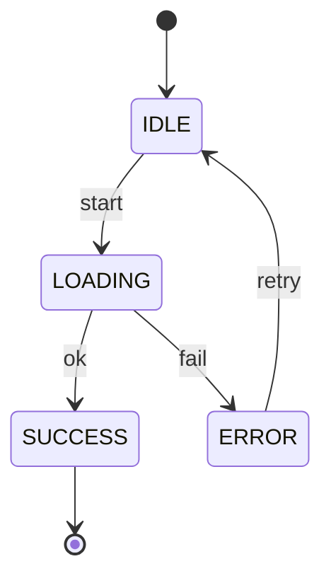

# UX Spec Template (6 Passes)

> Use for `.spec/ux-YYYY-MM-DD-<slug>.md`.  
> Every paragraph ends with `Evidence:` or `Evidence gap:`.
> Do NOT include visuals or layout specs until all 6 passes are complete.

## 0) UX Summary

One-sentence experience summary.  
Evidence:

## Pass 1: Mental Model

**Primary user intent:**  
Evidence:

**Likely misconceptions:**  
- ...
Evidence:

**UX principle to reinforce/correct:**  
Evidence:

**Evidence gate:**  
- At least one evidence line per Pass 1 subsection, or mark `Evidence gap:` explicitly.

## Pass 2: Information Architecture

**All user-visible concepts:**  
- ...
Evidence:

**Grouped structure:**  

### <Group Name>
- <Concept>: Primary/Secondary/Hidden  
- Rationale: ...
Evidence:

**Evidence gate:**  
- At least one evidence line per Pass 2 subsection, or mark `Evidence gap:` explicitly.

## Pass 3: Affordances

| Action | Visual/Interaction Signal |
| --- | --- |
| ... | ... |

**Affordance rules:**  
- If user sees X, they should assume Y.  
Evidence:

**Evidence gate:**  
- At least one evidence line per Pass 3 subsection, or mark `Evidence gap:` explicitly.

## Pass 4: Cognitive Load

**Friction points:**  
| Moment | Type | Simplification |
| --- | --- | --- |
| ... | Choice/Uncertainty/Waiting | ... |

**Defaults introduced:**  
- ...
Evidence:

**Evidence gate:**  
- At least one evidence line per Pass 4 subsection, or mark `Evidence gap:` explicitly.

## Pass 5: State Design

### <Element/Screen>

| State | User Sees | User Understands | User Can Do |
| --- | --- | --- | --- |
| Empty | | | |
| Loading | | | |
| Success | | | |
| Partial | | | |
| Error | | | |

Evidence:

**Evidence gate:**  
- At least one evidence line per Pass 5 subsection, or mark `Evidence gap:` explicitly.

## Pass 6: Flow Integrity

**Flow risks:**  
| Risk | Where | Mitigation |
| --- | --- | --- |
| ... | ... | ... |

**Visibility decisions:**  
- Must be visible: ...
- Can be implied: ...

**UX constraints:**  
Evidence:

**Evidence gate:**  
- At least one evidence line per Pass 6 subsection, or mark `Evidence gap:` explicitly.

## State Machine Diagrams

Style rules:
- Single vertical spine for the main happy path.
- Branch alternates to the sides.
- Label every transition with trigger/guard.
- Show timing hooks (e.g., periodic re-check).
- Use uppercase state names; concise trigger labels; avoid crossing lines.

Evidence:

## Visual Specifications (only after Pass 6)

**Layouts / components / interaction specs:**  
Evidence:

**Hit-area rules:**  
- Mobile min target: 44x44px  
- Desktop min target: 32x32px  
- Min spacing between adjacent targets: 8px  
Evidence:

**Responsive breakpoints (tokenized):**  
- Breakpoint tokens:  
- Layout shifts per breakpoint:  
Evidence:

**Token-based grid:**  
- Columns:  
- Gutters:  
- Margins:  
Evidence:

## UX Acceptance Criteria (Given/When/Then)

- Given ..., when ..., then ...  
  Evidence:

## Evidence Gaps

- ...

## Evidence Map

| Claim/Section | Evidence | Notes |
| --- | --- | --- |
| | | |
