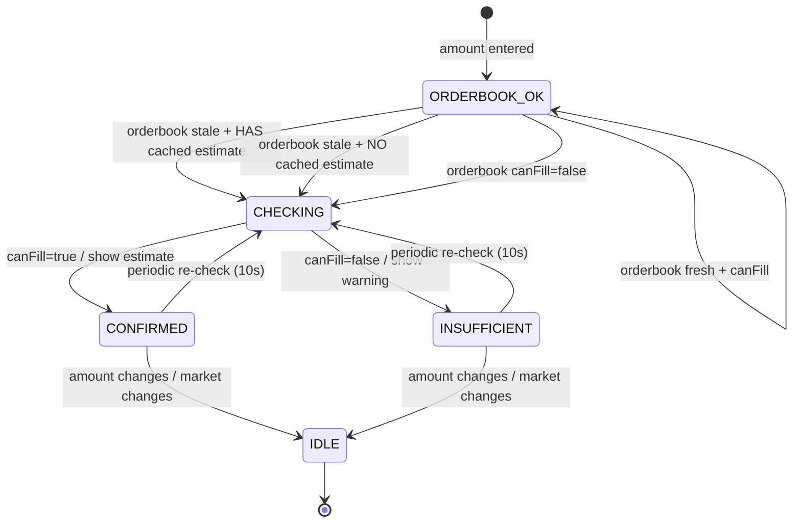

# Mermaid Diagram Examples

## State Diagram Example (stateful component)



## Export Requirement

To export diagrams for review/sharing:
```bash
npm install -g @mermaid-js/mermaid-cli
mmdc -i diagram.mmd -o diagram.png --theme dark --scale 1.5 --backgroundColor '#111827'
```

Keep the Mermaid source in the spec even after exporting. Adjust input/output names as needed.