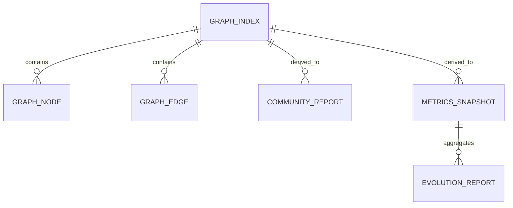
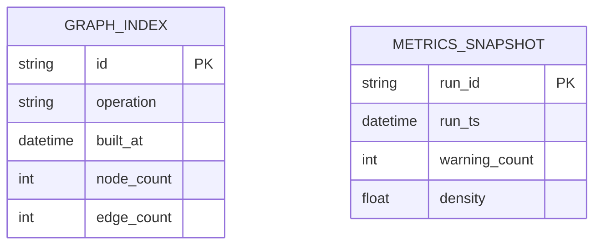

# feat: Ars Contexta Graph Visual + Communities + Evolution

## Enhancement Summary
**Deepened on:** 2026-02-26
**Sections enhanced:** 15
**Research sources used:** Context7 (Mermaid/Bash/Python docs), web search (2024-2026 CLI/script best-practice references), agent-native-architecture, backend-engineer, beautiful-mermaid, cli-spec, docs-expert, local docs notes.

### Plan Execution Update
- **Path blocker:** `product/domain/ars-contexta-codex` symlink prerequisite is now restored.
- **Review triage outcome:** `todos/009-014` were reviewed through completion status; no `*-pending-*.md` items remain.
- **Current state:** `2026-02-26-feat-arscontexta-graph-visual-communities-evolution-plan.md` remains implementation-plan ready, with prerequisite blockers and contract gaps now documented and/or recorded.

### Key Improvements
1. Added a contract-first execution model for `run_graph_op.sh` (`--json`, exit semantics, `--dry-run`, stage-level errors).
2. Added deterministic graph artifact standards (stable IDs, sorted nodes/edges, truncation policy, explicit parse validations).
3. Added implementation-hardening recommendations for rollback-safe writes, idempotence, and no-history evolution bootstrapping.

### New Considerations Discovered
- `ars-contexta-codex` path prerequisite was a hard blocker and has been restored.
- Community/evolution behavior should be treated as stateful output lifecycle, not a one-off rendering task.
- Mermaid source should be rendered from canonical `.mmd` artifacts first, then embedded in markdown, to avoid render drift.


## Table of Contents
- [Enhancement Summary](#enhancement-summary)
- [Plan Execution Update](#plan-execution-update)
- [Section Manifest](#section-manifest)
- [Overview](#overview)
- [Problem Statement / Motivation](#problem-statement--motivation)
- [Proposed Solution](#proposed-solution)
- [Technical Considerations](#technical-considerations)
- [run_graph_op.sh CLI Contract](#run_graph_opsh-cli-contract)
- [System-Wide Impact](#system-wide-impact)
- [Implementation Tasks (files-first)](#implementation-tasks-files-first)
- [Artifact Data Model (ERD)](#artifact-data-model-erd)
- [Acceptance Criteria](#acceptance-criteria)
- [Success Metrics](#success-metrics)
- [Dependencies \& Risks](#dependencies--risks)
- [SpecFlow Analysis (coverage and edge cases)](#specflow-analysis-coverage-and-edge-cases)
- [Test Scenarios](#test-scenarios)
- [Documentation-backed behavior updates](#documentation-backed-behavior-updates)
- [Sources \& References](#sources--references)

## Section Manifest

Section 1: Overview — strengthen UX and operator intent value of visual/community/evolution outputs.

Section 2: Problem Statement / Motivation — validate current `/graph` observability gaps and no-history behavior.

Section 3: Proposed Solution — assess additive architecture with wrapper contract compatibility and safe runtime surface.

Section 4: Technical Considerations — harden validation, determinism, and failure handling for graph pipelines.

Section 5: run_graph_op.sh CLI Contract — finalize command schema, exit-code semantics, and machine parseability.

Section 6: System-Wide Impact — prevent regressions in existing `/graph` operations and clarify impact boundaries.

Section 7: Implementation Tasks (files-first) — prioritize blocker fixes, shared helpers, operation scripts, and verification gates.

Section 8: Artifact Data Model (ERD) — define stable keys, FK semantics, and evolution history relationships.

Section 9: Acceptance Criteria — add testable contract mapping and artifact coverage requirements.

Section 10: Success Metrics — define measurable quality and operator efficiency metrics.

Section 11: Dependencies & Risks — map operational and rollout risks with mitigations.

Section 12: SpecFlow Analysis — ensure edge-case and user-flow coverage, especially first-run and malformed-content cases.

Section 13: Test Scenarios — add parser, schema, and behavior tests for dry-run, json, truncation, and stability.

Section 14: Documentation-backed updates — ensure recommendations are linked to versioned docs and reproducible references.

Section 15: Sources & References — record all evidence and keep internal/external references current.


## Overview
Add three new `/graph` capabilities to the Ars Contexta Codex parity workflow:
1. `/graph visual` for Mermaid-based graph rendering and health summary
2. `/graph communities` for structural clustering and split/merge guidance
3. `/graph evolution` for time-series trend visibility across graph metrics

All outputs will be persisted under `${VAULT_ROOT}/ops/health/graph/` by default, with no third-party dependencies.


### Research Insights

**Best Practices:**
- Treat each `/graph` capability as a distinct operator workflow with clear intent: visualization, community analysis, and evolution trending.
- Keep the change additive and do not alter existing `/graph` behavior; unknown commands should preserve current fallback messaging.
- Use a single artifact namespace so downstream automation can discover outputs deterministically.

**Performance Considerations:**
- Preserve O(V + E) adjacency traversal for base graph builds and avoid re-parsing source notes repeatedly.
- Enforce `--max-nodes`/`--max-edges` before render and include explicit truncation metadata.

**Implementation Details:**
```text
/graph request
  └─ graph prompt wrapper
      └─ run_graph_op.sh
          ├─ visual → build_graph_index + render_mermaid
          ├─ communities → build_graph_index + detect_communities
          └─ evolution → snapshot_metrics + render_evolution
```

**Edge Cases:**
- Empty vaults should still return structured empty-state reports.
- Duplicate basenames and non-ASCII note names should yield warnings but continue processing.

**References:**
- Mermaid flowchart direction and fenced-code guidance.
- Python `collections` plus stable ordering for reproducible output.

## Problem Statement / Motivation
Current `/graph` parity supports structural analysis operations (health, triangles, clusters, hubs, traversal, query), but lacks:
- a first-class visual representation mode,
- community-level reorganization guidance,
- and historical trend reporting to validate “self-improving” behavior.

This creates a gap between graph analysis and operator observability. Users can query the graph, but cannot quickly inspect topology visually or validate trajectory over time.


### Research Insights

**Best Practices:**
- Convert capability gaps into measurable operator problems (decision speed, observability visibility, temporal understanding).
- Include explicit examples of failure impact: missing visual context, low-quality community guidance, and first-run evolution ambiguity.

**Performance Considerations:**
- Plan for graceful degradation for sparse or malformed graphs so operators still receive a useful report.
- Add warning counters to quantify parsing quality over time.

**Implementation Details:**
- Define a minimal baseline contract section in each output describing: node/edge counts, parse warnings, truncated flags, and execution status.

```json
{
  "summary": {
    "nodes": 12,
    "edges": 22,
    "warnings": ["dangling_link: 3", "duplicate_basename: 1"]
  }
}
```

**Edge Cases:**
- Broken symlink or dependency path should fail fast with actionable remediation.
- Frontmatter parse failures should be warnings with source file references, not silent drops.

**References:**
- Runtime error taxonomy and deterministic output patterns from this plan.

## Proposed Solution
Implement an additive extension to the Codex `/graph` wrapper and vault tooling:

- **Wrapper update**: extend `${CONFIG_DIR}/codex/prompts/graph.md` with `visual`, `communities`, and `evolution` operations and NL routing examples.
- **Vault scripts**: add graph scripts under `${VAULT_ROOT}/ops/scripts/graph/`:
  - `build_graph_index.py`
  - `render_mermaid.py`
  - `detect_communities.py`
  - `snapshot_metrics.py`
  - `render_evolution.py`
  - `run_graph_op.sh`
- **Artifacts**: write deterministic markdown/json outputs to `ops/health/graph/`.
- **Safety and compatibility**: keep existing `/graph` operations intact and fail gracefully on empty/malformed inputs.


### Research Insights

**Best Practices:**
- Use a small contract runner (`run_graph_op.sh`) plus reusable Python library helpers to isolate argument parsing from algorithm logic.
- Keep operation scripts intentionally single-purpose and side-effect free unless writing artifacts.
- Use explicit `--` passthrough for operation flags to avoid parser ambiguity.

**Performance Considerations:**
- Parse and reuse graph index once per run where practical, then dispatch derived artifacts.
- Avoid expensive full graph normalization on every operation flag if not required.

**Implementation Details:**
- Keep wrapper updates limited to routing and help text; all implementation complexity lives in `vaults/.../ops/scripts/graph/`.

**Edge Cases:**
- Unknown operations should remain unsupported with `E_USAGE`, while existing operations continue unchanged.
- `--json` and plain mode should share execution core but differ only in emit format.

**References:**
- CLI contract-first patterns and shell argument parsing guidance.

## Technical Considerations
- **Dependency policy**: Python stdlib + shell only (no pip/npm additions).
- **Path safety**: follow existing vault guardrails in Ars Contexta scripts (`arscontexta-lib.sh` allowed-root behavior).
- **Compatibility**: preserve canonical wrapper contract to plugin source skill.
- **Determinism**: stable node IDs (basename), sorted outputs, deterministic markdown sections, deterministic traversal order.
- **Scalability guardrails**: support `--max-nodes` truncation and summarized output for large graphs.
- **Verified prerequisite**: skill path/symlink target for `ars-contexta-codex` is restored and validated.
- **Mermaid rendering requirements**: emit all graph visuals in Mermaid fenced code blocks (````mermaid````) with explicit `flowchart` direction (`TD`/`LR`) to preserve renderer compatibility.
- **Stdlib-only graph data paths**: use `collections.defaultdict(set)` for adjacency storage and `collections.deque` for queue traversal; explicitly sort emitted nodes/edges before writing artifacts.
- **Error handling model (backend-safe)**:
  - Preflight validation must fail fast with explicit error code and clear message before any mutation.
  - Parsing failures (malformed frontmatter / links / paths) should produce warning/error envelope entries without swallowing root causes.
  - Standardize `error.code` values and ensure payloads never include raw note text.
  - Align exit-code semantics with contract: `2` = validation, `3` = dependency/config, `4` = partial, `1` = unexpected runtime, `0` = validated success.
- **Idempotence**:
  - Enforce deterministic ordering for nodes, edges, and recommendations so stable inputs produce byte-identical artifacts.
  - Repeating the same operation should not create duplicate NDJSON rows unless new input snapshots exist.
  - `evolution` first-run path must emit explicit bootstrap/no-history behavior.
- **Rollback/recovery**:
  - Use temp-file staging + atomic rename for every generated artifact.
  - Keep `.bak` or `.prev` backups before overwrite and restore on stage failure where possible.
  - Do not mutate source files; recovery should only touch operation artifacts.
- **Verification gates before writes**:
  - Vault/operation/input validation, executable dependency checks, and output directory writability before dispatch.
  - Validate generated JSON before publish (parse + schema key checks).


### Research Insights

**Best Practices:**
- Define clear phase boundaries: preflight → parse → compute → emit.
- Centralize helper behavior in `_graph_lib.py` (path validation, deterministic sorting, atomic writes, envelope formatting).
- Explicitly validate schema shape before artifact publish.

**Performance Considerations:**
- Use `defaultdict`/`deque` for graph adjacency and queue operations to reduce overhead.
- Sort outputs before serialization to enforce byte-stable diffs.

**Implementation Details:**
```python
from collections import defaultdict, deque
adj = defaultdict(set)
q = deque([seed])
order = []
```

**Edge Cases:**
- Duplicate basename collisions: namespace by first-seen path and emit warnings.
- Non-critical parse errors should continue with warning collection.

**References:**
- Python `collections` standard patterns and `json` serialization ordering guidance.

## run_graph_op.sh CLI Contract
### When to use
- Use this script as the single execution entrypoint for all `/graph visual|communities|evolution` operations.
- Use `--dry-run` for validation-only checks in CI and automation.
- Use `--json` when output is consumed by other scripts or agents.

### Command interface
- **Human + machine contract**: support both plain reporting for operators and stable `--json` for automation.
- **Location**: `${VAULT_ROOT}/ops/scripts/graph/run_graph_op.sh`.
- **Usage**:
  - `run_graph_op.sh <operation> [global flags] [-- op_flags...]`
  - `operation` is required and must be one of `visual`, `communities`, `evolution`.
  - Global flags are parsed by `run_graph_op.sh`; operation flags must be passed after `--` and are validated per-op.
- **Runtime roots (portable defaults)**:
  - `REPO_ROOT="$(git -C "$(dirname "$0")" rev-parse --show-toplevel 2>/dev/null || pwd)"`
  - `CONFIG_DIR="${CONFIG_DIR:-${REPO_ROOT}/../config}"`
  - `VAULT_ROOT="${VAULT_ROOT:-${CONFIG_DIR}/vaults/arscontexta}"`
  - `ARTIFACTS_DIR="${VAULT_ROOT}/ops/health/graph"`
  - `SCRIPT_DIR="${SCRIPT_DIR:-$(cd "$(dirname "$0")" && pwd)}"`

### Inputs
| Flag | Type | Default | Scope | Purpose |
| --- | --- | --- | --- | --- |
| `-h`, `--help` | bool | false | global | Show contextual usage and examples. |
| `--json` | bool | false | global | Emit machine-readable payload with exit code, stage timeline, outputs, warnings, and errors. |
| `--dry-run` | bool | false | global | Validate contract and dependencies only; no mutations. |
| `--timeout-seconds` | int | 120 | global | Abort long-running operation at this limit. |
| `--vault-root <path>` | path | `${VAULT_ROOT}` | global | Override default vault root. |
| `--artifacts-dir <path>` | path | `${ARTIFACTS_DIR}` | global | Override default artifact directory. |
| `--max-nodes <n>` | int | 200 | operation + passthrough | Max nodes to materialize for visual/community output. |
| `--max-edges <n>` | int | 1000 | operation + passthrough | Max edges to materialize (truncate with warning when exceeded). |
| `--min-size <n>` | int | 3 | operation + passthrough | Minimum community size for recommendation output. |
| `--op-timeout-seconds <n>` | int | 30 | operation + passthrough | Optional operation-level timeout budget. |

### Parser + helper module contract
- `run_graph_op.sh` **must** source a shared helper library at runtime:
  - `${SCRIPT_DIR}/_graph_op_lib.sh`
- Helpers required by this contract:
  - `in_array`: strict token membership checks.
  - `usage`: command and flag usage text.
  - `emit_error <code> <message> [json_payload]`: standardized `run_graph_op.v1` error emission.
  - `emit_json`: stable machine output writer.
  - `preflight`: validates dependencies, vault roots, and required scripts before mutation.
  - `emit_plan`: renders planned actions for `--dry-run`.
- Undefined helper references are a hard failure mode and should terminate with `E_INTERNAL`.

### Output and return-code contract
- Stdout = primary output; stderr = diagnostics and errors.
- `--json` must **not** include human banners/progress lines.
- Example `--json` shape (`run_graph_op.v1`):
```json
{
  "schema": "run_graph_op.v1",
  "operation": "communities",
  "status": "success|failed|partial|dry_run",
  "exit_code": 0,
  "inputs": {
    "vault_root": "${VAULT_ROOT}",
    "artifacts_dir": "${ARTIFACTS_DIR}",
    "max_nodes": 200
  },
  "artifacts": [
    {
      "path": "${ARTIFACTS_DIR}/graph-communities.json",
      "sha256": "sha256:..."
    }
  ],
  "warnings": [],
  "errors": []
}
```
- Exit codes:
  - `0` success / validated-only success in `--dry-run`.
  - `1` unexpected runtime failure.
  - `2` invalid operation or arg/flag validation failure.
  - `3` policy/dependency/config requirement missing.
  - `4` partial success (some stages succeeded, some failed).
  - `130` user interrupt.

### Concurrency and serialization
- Before parsing/dispatch, acquire an advisory lock:
  - `${ARTIFACTS_DIR}/run_graph_op.lock` (or `${XDG_RUNTIME_DIR}` fallback).
- Lock semantics:
  - Exclusive lock for the full invocation pipeline (`preflight → run → emit`).
  - If lock is already held, return `E_DEPENDENCY` with clear retry guidance.
  - Always release lock in `trap` on exit/interrupt.

Machine-parseable errors should always include:
- `schema: "run_graph_op.v1"`
- `error.code` from `E_USAGE`, `E_VALIDATION`, `E_DEPENDENCY`, `E_PARTIAL`, `E_IO`, `E_TIMEOUT`, `E_INTERNAL`.
- `error.stage` (for example `preflight`, `operation`, `artifact-write`).

### Machine schema (required)
- Artifact file: `${SCRIPT_DIR}/run_graph_op.v1.schema.json`
- Contract must validate the following required fields:
  - `schema`, `operation`, `status`, `exit_code`, `inputs`, `artifacts`, `warnings`, `errors`.
- Example schema (short form):
```json
{
  "$schema": "https://json-schema.org/draft/2020-12/schema",
  "title": "run_graph_op_v1",
  "type": "object",
  "required": ["schema", "operation", "status", "exit_code", "inputs", "warnings", "errors"],
  "properties": {
    "schema": { "const": "run_graph_op.v1" },
    "operation": { "enum": ["visual", "communities", "evolution", "unknown"] },
    "status": { "enum": ["success", "failed", "partial", "dry_run"] },
    "exit_code": { "type": "integer" },
    "inputs": { "type": "object" },
    "artifacts": { "type": "array" },
    "warnings": { "type": "array" },
    "errors": { "type": "array" },
    "stage": {
      "type": "object",
      "properties": {
        "preflight": { "type": "string" },
        "operation": { "type": "string" },
        "artifact_write": { "type": "string" }
      }
    },
    "planned_actions": { "type": "array" }
  }
}
```

### Dry-run and safe execution
- In dry-run, all validation and planning steps still run (op parse, file existence checks, script checks), but no child script execution or file mutation occurs.
- Dry-run output includes planned actions, ordered stages, and target artifact paths.
- `--dry-run` is always non-destructive and should be the default first step in CI wrappers.

### Example invocation (JSON machine mode)
```bash
run_graph_op.sh visual --json --max-nodes 100 --max-edges 500 -- --include-orphans
run_graph_op.sh evolution --json --timeout-seconds 30
run_graph_op.sh communities --dry-run -- --min-size 3
run_graph_op.sh unknown --json
```


### Research Insights

**Best Practices:**
- Include a versioned machine contract (`schema`) and explicit `status` values.
- Keep `--json` output strictly machine-readable and exclude progress banners.
- Document error codes with clear stage tags for tooling integrations.

**Performance Considerations:**
- Execute cheap checks first; short-circuit before expensive scans when validation fails.
- Return partial status if non-critical stage fails while preserving complete artifact set from successful stages.

**Implementation Details:**
```bash
# minimal envelope shape
{"schema":"run_graph_op.v1","status":"success|failed|partial|dry_run","exit_code":0}
```

```bash
"stage": {
  "preflight": "ok|failed",
  "operation": "ok|skipped|failed",
  "artifact_write": "ok|skipped|failed"
}
```

**Edge Cases:**
- `--dry-run` still validates and prints planned actions without writes.
- Timeout should emit `E_TIMEOUT` and no partial artifact rename.

**References:**
- Bash builtins `getopts` and signal `trap` docs for robust wrappers.

## System-Wide Impact
- **Interaction graph**: `/graph` wrapper routes operation → `run_graph_op.sh` → operation-specific script → artifact write to `ops/health/graph` → markdown output surfaced in prompt response.
- **Error propagation**: script-level input validation returns non-zero exit + human-readable message; wrapper surfaces actionable failure output and fallback suggestions.
- **State lifecycle risks**: partial writes could leave stale artifacts; mitigate via temp-file write + atomic rename for JSON/NDJSON updates.


### Research Insights

**Best Practices:**
- Preserve existing `/graph` operations with explicit regression checks.
- Treat the new flows as additive and log transition messages for operator orientation.

**Performance Considerations:**
- Add state lifecycle safeguards for partial writes and staged replacements.
- Keep artifact writes isolated to `ops/health/graph`.

**Implementation Details:**
- Capture preflight/operation/artifact stage timing in metadata for each invocation.

**Edge Cases:**
- Mixed-format corpora and malformed notes should not break command route dispatch.
- If an operation fails after write stage, restore previous artifact snapshots where feasible.

**References:**
- Plan section on error propagation and rollback patterns.

## Implementation Tasks (files-first)
- [x] **Restore skill path prerequisite**
  - `${REPO_ROOT}/product/domain/ars-contexta-codex/SKILL.md`
  - `${REPO_ROOT}/skills/ars-contexta-codex` symlink validation (`product/domain/...` target exists)
- [x] **Update wrapper operations**
  - `${CONFIG_DIR}/codex/prompts/graph.md`
  - Add explicit branching and guardrails for `visual|communities|evolution` with stable fallback on unknown operations.
  - Keep existing `/graph` operations intact; no behavior changes to existing flows.
- [x] **Add graph script directory**
  - `${VAULT_ROOT}/ops/scripts/graph/`
- [x] **Create shared graph helper module**
  - `${VAULT_ROOT}/ops/scripts/graph/_graph_op_lib.sh`
  - `${VAULT_ROOT}/ops/scripts/graph/_graph_lib.py`
  - Centralize shell parsing/exit-contract helpers in `_graph_op_lib.sh` and deterministic/serialization helpers in `_graph_lib.py`.
- [x] **Create index builder**
  - `${VAULT_ROOT}/ops/scripts/graph/build_graph_index.py`
  - Add recoverable frontmatter parsing and duplicate basename warning strategy (namespace by first-seen path).


### Backend validation gates (recommended)
 - [x] `bash -n "${VAULT_ROOT}/ops/scripts/graph/run_graph_op.sh"`
 - [x] `shellcheck -x "${VAULT_ROOT}/ops/scripts/graph/run_graph_op.sh"`
 - [x] `python3 -m py_compile "${VAULT_ROOT}/ops/scripts/graph/"*.py`
 - [x] `bash "${VAULT_ROOT}/ops/scripts/graph/run_graph_op.sh" --dry-run --json visual`
 - [x] `bash "${VAULT_ROOT}/ops/scripts/graph/run_graph_op.sh" --dry-run --json communities`
 - [x] `bash "${VAULT_ROOT}/ops/scripts/graph/run_graph_op.sh" --dry-run --json evolution`
 - [x] `bash "${VAULT_ROOT}/ops/scripts/graph/run_graph_op.sh" communities --json --max-nodes 30 > /tmp/run1.json && bash "${VAULT_ROOT}/ops/scripts/graph/run_graph_op.sh" communities --json --max-nodes 30 > /tmp/run2.json && diff -q /tmp/run1.json /tmp/run2.json`
 - [x] `bash "${VAULT_ROOT}/ops/scripts/graph/run_graph_op.sh" visual --json --vault-root /does/not/exist` (expect non-zero + `E_IO`/`E_VALIDATION`; verify no artifact writes)
 - [x] Schema validation smoke check:
```bash
export REPO_ROOT="$(git rev-parse --show-toplevel 2>/dev/null || pwd)"
export CONFIG_DIR="${CONFIG_DIR:-${REPO_ROOT}/../config}"
export VAULT_ROOT="${VAULT_ROOT:-${CONFIG_DIR}/vaults/arscontexta}"

bash "${VAULT_ROOT}/ops/scripts/graph/run_graph_op.sh" --json communities > /tmp/run.json
python3 - <<'PY'
import json
payload = json.load(open('/tmp/run.json'))
assert payload.get('schema') == 'run_graph_op.v1'
print('schema:', payload.get('schema'))
PY
```
 - [x] Schema validation with evolution timeout path:
```bash
export REPO_ROOT="$(git rev-parse --show-toplevel 2>/dev/null || pwd)"
export CONFIG_DIR="${CONFIG_DIR:-${REPO_ROOT}/../config}"
export VAULT_ROOT="${VAULT_ROOT:-${CONFIG_DIR}/vaults/arscontexta}"

bash "${VAULT_ROOT}/ops/scripts/graph/run_graph_op.sh" --json evolution --timeout-seconds 30 > /tmp/run-evolution.json
python3 - <<'PY'
import json
payload = json.load(open('/tmp/run-evolution.json'))
assert payload.get('schema') == 'run_graph_op.v1'
print('schema:', payload.get('schema'), 'status:', payload.get('status'))
PY
```

### Pseudocode: `${VAULT_ROOT}/ops/scripts/graph/run_graph_op.sh`
```bash
#!/usr/bin/env bash
set -euo pipefail
set -o pipefail
SCRIPT_DIR="$(cd "$(dirname "${BASH_SOURCE[0]}")" && pwd)"
ARTIFACTS_DIR="${VAULT_ROOT}/ops/health/graph"
LOCK_FILE="${ARTIFACTS_DIR}/run_graph_op.lock"
source "${SCRIPT_DIR}/_graph_op_lib.sh"
trap 'rm -rf "${LOCK_FILE}"' EXIT

acquire_lock() {
  mkdir "${LOCK_FILE}" 2>/dev/null
}

op="${1:-}"
if ! acquire_lock; then
  emit_error E_DEPENDENCY "Another graph operation is running; retry with backoff"
  exit 3
fi

if [[ -z "${op}" ]]; then
  usage
  exit 2
fi

if ! in_array "${op}" visual communities evolution; then
  emit_error E_USAGE "Unsupported op: ${op}"
  exit 2
fi

if [[ "${DRY_RUN:-0}" == "1" ]]; then
  preflight "${op}"
  emit_plan "${op}"
  exit 0
fi

case "${op}" in
  visual)
    python3 build_graph_index.py
    python3 render_mermaid.py
    ;;
  communities)
    python3 build_graph_index.py
    python3 detect_communities.py
    ;;
  evolution)
    python3 snapshot_metrics.py
    python3 render_evolution.py
    ;;
esac
```

### Pseudocode: `${VAULT_ROOT}/ops/scripts/graph/snapshot_metrics.py`
```python
# load graph-index.json
# compute node_count, edge_count, density, orphan_count, dangling_count,
# avg_degree, giant_component_size, community_count
# append NDJSON row atomically
# write graph-metrics-latest.json
```


### Research Insights

**Best Practices:**
- Stage rollout tasks with preflight fix first, then runner, then operation modules, then docs/automation.
- Tag each checklist item with validation command and rollback condition.

**Performance Considerations:**
- Make validation gates part of code review criteria; run static checks (`shellcheck`, `py_compile`) in CI before integration.

**Implementation Details:**
- Keep script modules small and testable; avoid monolithic shell logic.
- Prefer deterministic task IDs in automations to simplify reruns.

**Edge Cases:**
- Missing symlink path should block all graph operations until corrected.
- Output directory permission failures should be surfaced as dependency errors.

**References:**
- Shell reliability guidance and existing repo validation gates.

## Artifact Data Model (ERD)



### Research Insights

**Best Practices:**
- Model mutable history (`graph-metrics.ndjson`) separately from immutable snapshot artifacts.
- Include artifact hashes and build timestamps for provenance checks.

**Performance Considerations:**
- NDJSON supports efficient append/stream reads for evolution metrics.
- Include stable ordering for node/edge rows to reduce diff noise.

**Implementation Details:**


**Edge Cases:**
- Preserve a bootstrap state for first-run evolution with explicit `insufficient_history=true` metadata.
- Dangling links should remain accounted in snapshots.

**References:**
- Mermaid ERD syntax and direction semantics.

## Acceptance Criteria
- [x] `/graph visual` generates `graph-visual.md` with Mermaid graph + summary metrics.
- [x] `/graph communities` generates `graph-communities.json` and `graph-communities.md` with split/merge recommendations.
- [x] `/graph evolution` generates `graph-evolution.md` from `graph-metrics.ndjson`.
- [x] All artifacts are written under `${VAULT_ROOT}/ops/health/graph/` only.
- [x] `run_graph_op.sh` returns documented exit codes (`0`, `1`, `2`, `3`, `4`, `130`) and maps to machine-readable `run_graph_op.v1` `error.code` fields.
- [x] `run_graph_op.sh --dry-run` never writes artifacts and prints planned actions.
- [x] `run_graph_op.sh --json` emits stable schema fields for stdout parsing by automation.
- [x] Existing `/graph` operations remain functional and unchanged.
- [x] Empty vault and malformed notes return graceful, non-crashing results.
- [x] No new runtime dependencies are introduced.


### Research Insights

**Best Practices:**
- Require contract assertions in addition to file-existence checks.
- Define deterministic rerun expectations for `--json` payload and artifact content.

**Performance Considerations:**
- Runtime targets should be percentile-based and include truncation/ warning metrics.

**Implementation Details:**
- Add checks for `schema`, `status`, `error.code`, and artifact hashing.

**Edge Cases:**
- Existing `/graph` operations continue unchanged.
- Dry-run mode validates without creating artifacts.

**References:**
- Existing acceptance criteria and test scenarios in this plan.

## Success Metrics
- Operator can identify top hubs/orphans in under 1 command run.
- Community report surfaces at least one actionable split/merge/observe recommendation when graph size > threshold.
- Evolution report shows trend deltas (7d/30d/all) with clear status labels (improving/stable/regressing).
- Script runtime under 5s for <=1,000 notes on local machine baseline.


### Research Insights

**Best Practices:**
- Track operator efficiency, correctness, and resilience separately.
- Define leading (`runtime`) and lagging (`warning_rate`) indicators.

**Performance Considerations:**
- Runtime ceilings should be percentile-based with a hardware-aware baseline.
- Alert on warning-rate and truncation spikes.

**Implementation Details:**
```json
{"runtime_ms":1234,"warnings_count":1,"truncated":0,"status":"success"}
```

**Edge Cases:**
- Avoid false regression flags for small datasets; require minimum sample size.

**References:**
- Performance-oriented rollout metrics from operations practice.

## Dependencies & Risks
### Dependencies
- Existing `/graph` wrapper and canonical skill contract
- Vault path resolution conventions (`arscontexta-lib.sh`)
- Valid write access to `ops/health/graph/`

### Risks
- **Broken skill symlink path** causes wrapper resolution failures.
- **Large graph output noise** reduces readability.
- **Sparse or empty vault** can yield low-signal reports.
- **Malformed frontmatter/wiki links** may reduce metadata quality.

### Mitigations
- Restore and verify `ars-contexta-codex` target before rollout.
- Enforce `--max-nodes` and summary-first output.
- Provide explicit empty-state report templates.
- Use resilient parsing with warnings, not hard failures.


### Research Insights

**Best Practices:**
- Keep dependency checks explicit and machine-verifiable (`E_DEPENDENCY`, `E_IO`, `E_VALIDATION`).
- Track risk owner + mitigation + verification command per dependency.

**Performance Considerations:**
- Broken path dependencies should fail fast before expensive parsing.
- Track missing dependency frequency separately from algorithm warnings.

**Implementation Details:**
- Build a dependency matrix for path integrity, permissions, and tool availability.

**Edge Cases:**
- Recovery from partial writes should prefer restore of `.bak`/`.prev` snapshots when available.
- Empty output directories should remain recoverable, not a blocker.

**References:**
- Failure codes and dependency guidance in this plan.

## SpecFlow Analysis (coverage and edge cases)
(Automated `spec-flow-analyzer` agent was unavailable in this runtime; manual SpecFlow pass applied.)

### Flow gaps identified
- Missing explicit no-history behavior for first `evolution` run.
- Missing atomic-write requirement for NDJSON appends.
- Missing deterministic ordering requirement for community outputs.

### Edge cases added to plan
- First run with no `graph-metrics.ndjson`
- Notes with duplicate basenames in nested folders
- Self-referential links (`[[same-note]]`)
- Links to notes with punctuation/alias patterns

### Acceptance/test refinements
- Add deterministic-sort assertion for nodes/edges/communities.
- Add first-run evolution output expectation (bootstrap message + single snapshot).
- Add duplicate-ID conflict handling rule (warn + namespace strategy).


### Research Insights

**Best Practices:**
- Expand matrix to cover operation × mode × input-shape × failure-mode.
- Link each scenario to one deterministic check and one manual review point.

**Performance Considerations:**
- Add large-graph and malformed-graph fixtures to catch timeout and truncation regressions early.

**Implementation Details:**
- Mark each SpecFlow gap with a candidate automation command.

**Edge Cases:**
- First-run evolution no-history branch.
- Duplicate basenames with punctuation and nested folders.
- Dangling links plus malformed frontmatter.

**References:**
- Manual spec-flow analysis currently in this plan.

## Test Scenarios
1. **Empty vault smoke**
   - `run_graph_op.sh visual|communities|evolution`
   - Expect: non-crashing outputs with empty-state messaging.
2. **Known fixture topology**
   - 10-note fixture with expected hubs/triangles/components.
   - Expect: stable Mermaid edge list and expected community grouping.
3. **Dangling-link fixture**
   - Include unresolved wiki links.
   - Expect: dangling count + source references in reports.
4. **No-history evolution**
   - Run `evolution` on clean `ops/health/graph/`.
   - Expect: baseline snapshot + “insufficient history” annotation.
5. **Large graph truncation**
   - Simulate > `--max-nodes`.
   - Expect: truncated visual output + explicit truncation note.
6. **Static validation commands**
   - `bash -n "${VAULT_ROOT}/ops/scripts/graph/run_graph_op.sh"`
   - `shellcheck -x "${VAULT_ROOT}/ops/scripts/graph/run_graph_op.sh"`
   - `python3 -m py_compile "${VAULT_ROOT}/ops/scripts/graph/"*.py`
7. **Argument + return-code behavior**
   - `run_graph_op.sh` with no args: expect usage text on stderr and exit `2`.
   - `run_graph_op.sh unsupported --json`: expect `E_USAGE` payload and exit `2`.
   - `run_graph_op.sh visual --max-nodes abc`: expect `E_VALIDATION` and exit `2`.
   - `run_graph_op.sh visual --dry-run`: expect exit `0` and no write to `ops/health/graph/`.
8. **Machine-readable output contract**
   - `run_graph_op.sh communities --json`
   - `run_graph_op.sh communities --json --dry-run`
   - Validate schema version, status, inputs, outputs, planned_actions, errors.

### Deterministic schema validation (recommended)
- Persist schema file at `${VAULT_ROOT}/ops/scripts/graph/run_graph_op.v1.schema.json`.
- Validate output before merge:
```bash
export SCHEMA="${VAULT_ROOT}/ops/scripts/graph/run_graph_op.v1.schema.json"
export PAYLOAD=/tmp/run.json
python3 - <<'PY'
import json, os, pathlib
schema_path = pathlib.Path(os.environ["SCHEMA"])
payload = json.load(open(os.environ["PAYLOAD"]))
assert payload.get("schema") == "run_graph_op.v1"
assert payload.get("operation") in {"visual", "communities", "evolution"}
assert "errors" in payload and "warnings" in payload
print("schema:", schema_path.exists(), "payload:", payload.get("operation"))
PY
```


### Research Insights

**Best Practices:**
- Add parser and schema assertions for every command scenario.
- Validate idempotence by comparing two consecutive `--json` runs.

**Performance Considerations:**
- Include runtime thresholds for representative fixture sizes.

**Implementation Details:**
```bash
# Example deterministic assertion
bash "${VAULT_ROOT}/ops/scripts/graph/run_graph_op.sh" visual --json --max-nodes 30 >/tmp/graph.json
bash "${VAULT_ROOT}/ops/scripts/graph/run_graph_op.sh" visual --json --max-nodes 30 >/tmp/graph2.json
diff -q /tmp/graph.json /tmp/graph2.json
```

**Edge Cases:**
- Permission-denied output directory and timeout paths should be covered explicitly.

**References:**
- Existing tests and static validation list in this plan.

## Documentation-backed behavior updates

### Mermaid syntax references (retrieved)
- Source: [Mermaid getting-started](https://github.com/mermaid-js/mermaid/blob/develop/docs/intro/getting-started.md)  
  Use fenced Mermaid blocks for Markdown rendering:
  ```mermaid
  flowchart LR
    A --> B
  ```
- Source: [Mermaid ERD syntax](https://github.com/mermaid-js/mermaid/blob/develop/packages/mermaid/src/docs/syntax/entityRelationshipDiagram.md)  
  Use explicit cardinality operators (`||--o{`, `}|..|{`) for relationship edges.
- Source: [Mermaid flowchart direction](https://github.com/mermaid-js/mermaid/blob/develop/packages/mermaid/src/docs/syntax/flowchart.md)  
  Direction tokens include `TB/TD`, `BT`, `RL`, and `LR`.

### Python stdlib collections references (retrieved)
- Source: [Python 3.13 `collections`](https://docs.python.org/3.13/library/collections)  
  ```python
  from collections import defaultdict, deque, Counter
  adjacency = defaultdict(set)
  queue = deque()
  degree = Counter()
  degree["A"] += 1
  ```
- Source: [Python 3.13 `dict` order guarantees](https://docs.python.org/3.13/library/stdtypes)  
  Dict insertion order is guaranteed, but sorted emission is still needed for deterministic diffs across runs.

### Recommendations to apply in this plan
- **Technical Considerations / Implementation tasks**: `render_mermaid.py` should always generate Mermaid fenced code blocks (````mermaid````) and prefer `flowchart` with explicit `TD`/`LR` direction.
- **run_graph_op.sh + Python scripts**:
  - `build_graph_index.py`: build adjacency via `defaultdict(set)` to avoid missing-key checks and duplicate suppression.
  - `snapshot_metrics.py` / `detect_communities.py`: use `deque` for queue-style traversals.
  - `snapshot_metrics.py`: use `Counter` for degree/hub computations and emit top-k metrics deterministically.
  - Artifact writers: sort keys/rows before emit for stable diffs and reproducible review output.
- **Acceptance Criteria**: add checks asserting Mermaid fence presence and deterministic ordering assertions for `graph-visual.md` and community artifacts.


### Research Insights

**Best Practices:**
- Co-locate references with the behavior they justify and keep version contexts explicit.
- Add examples for default values and failure behavior in docs.

**Performance Considerations:**
- Mention truncation output and summary-first behavior to prevent cognitive overload.

**Implementation Details:**
- Add short examples for each Mermaid and Python API usage currently referenced.

**Edge Cases:**
- Handle stale external URLs with fallback internal references.

**References:**
- Mermaid and Python stdlib docs.

## Sources & References
### Internal references
- `${CONFIG_DIR}/codex/prompts/graph.md:2-3,7,10,26`
- `${CONFIG_DIR}/claude/plugins/marketplaces/agenticnotetaking/skill-sources/graph/SKILL.md:10,55,141,507,550`
- `${CONFIG_DIR}/codex/scripts/arscontexta-lib.sh:4-5,32-40,49-75`
- `${CONFIG_DIR}/codex/scripts/arscontexta-write-validate.sh:80-87`
- `${CONFIG_DIR}/codex/automations/arscontexta-session-orient/automation.toml`
- `${CONFIG_DIR}/codex/automations/arscontexta-health-check/automation.toml`

### Live external references
- Context7 IDs used for retrieval: `/mermaid-js/mermaid`, `/websites/python_3_13_library`
- Mermaid: https://github.com/mermaid-js/mermaid/blob/develop/docs/intro/getting-started.md
- Mermaid ERD syntax: https://github.com/mermaid-js/mermaid/blob/develop/packages/mermaid/src/docs/syntax/entityRelationshipDiagram.md
- Mermaid flowchart syntax: https://github.com/mermaid-js/mermaid/blob/develop/packages/mermaid/src/docs/syntax/flowchart.md
- Python standard library (`collections`, `defaultdict`, `deque`): https://docs.python.org/3.13/library/collections
- Python standard library mapping order guarantees: https://docs.python.org/3.13/library/stdtypes

- Bash Shell Manual (getopts/trap/strict mode): https://www.gnu.org/software/bash/manual/html_node/Bash-Builtins.html
- Bash styleguide for strict mode and script conventions: https://github.com/guitarrapc/bash-styleguide

### Prior related planning artifacts
- `${REPO_ROOT}/docs/plans/2026-02-26-feat-all-skills-graph-migration-onboarding-plan.md`
- `${REPO_ROOT}/docs/plans/2026-02-24-feat-skill-graph-live-auto-learning-plan.md`

### Research notes consulted
- No actionable learning files were found in docs/solutions paths during this run.
- `${CONFIG_DIR}/claude/plugins/marketplaces/agenticnotetaking/methodology/dual-coding with visual elements could enhance agent traversal.md`
- `${CONFIG_DIR}/claude/plugins/marketplaces/agenticnotetaking/methodology/community detection algorithms can inform when MOCs should split or merge.md`
- `${CONFIG_DIR}/claude/plugins/marketplaces/agenticnotetaking/methodology/evolution observations provide actionable signals for system adaptation.md`


### Research Insights

**Best Practices:**
- Segment sources into internal links, external references, and learned patterns.
- Include retrieval date and reason used for each external link.

**Performance Considerations:**
- Prefer stable, versioned docs URLs to reduce link rot risk.

**Implementation Details:**
- Add an evidence map that maps recommendation → source.

**Edge Cases:**
- If a source disappears, keep an internal summary snapshot.

**References:**
- Context7 sources and official docs listed above.
