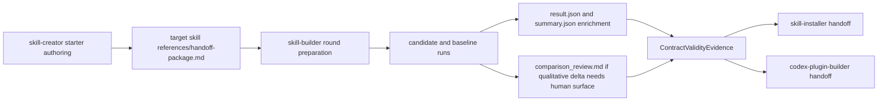

# feat: Skill Authoring Family Iteration Upgrade

## Table of Contents
- [Enhancement Summary](#enhancement-summary)
- [Overview](#overview)
- [Problem Frame](#problem-frame)
- [Requirements Trace](#requirements-trace)
- [Scope Boundaries](#scope-boundaries)
- [Context and Research](#context-and-research)
- [Key Technical Decisions](#key-technical-decisions)
- [Open Questions](#open-questions)
- [High-Level Technical Design](#high-level-technical-design)
- [Implementation Units](#implementation-units)
- [Execution Control Gates](#execution-control-gates)
- [Task Graph (id and depends_on)](#task-graph-id-and-depends_on)
- [System-Wide Impact](#system-wide-impact)
- [Risks and Dependencies](#risks-and-dependencies)
- [Documentation and Operational Notes](#documentation-and-operational-notes)
- [Execution Ledger (Planning Mode)](#execution-ledger-planning-mode)
- [Acceptance Checklist](#acceptance-checklist)
- [Sources and References](#sources-and-references)

## Enhancement Summary

**Deepened on:** 2026-04-04  
**Mode:** targeted-confidence  
**Key areas improved:** artifact ownership, unit sequencing, blocker classification, and closeout verification

- Added an explicit artifact-ownership matrix so `ce-work` can land the builder and harness changes without re-deciding where round metadata belongs.
- Tightened the deferred implementation questions with phase-one decision rules instead of leaving both as open-ended execution judgment.
- Strengthened validation and blocker-control gates so compatibility regressions, runner noise, and partial-rollout drift are classified consistently before closeout.

## Overview

Upgrade the skill-authoring family from a clean routing split into a coherent, evidence-backed authoring loop without undoing the lifecycle boundaries that were just stabilized.

This plan implements the approved spec by:
- making `skill-creator` produce a durable creator-to-builder handoff artifact for non-trivial skills;
- teaching `skill-builder` one explicit comparative iteration loop with frozen inputs, baseline rules, round states, and visible review evidence;
- keeping `skill-installer` and `codex-plugin-builder` as downstream-only owners gated by `ContractValidityEvidence`;
- extending existing repo-native eval and reporting surfaces instead of introducing a new standalone viewer or parallel harness.

Plan mode: `standard-plan`  
Plan depth: `deep`  
Execution posture: artifact-contract-first, then builder evidence surfaces, then eval enforcement, then downstream gating and full-family validation.

## Problem Frame

The family routing contract is now clear, but the authoring loop still relies too much on implied escalation and loosely bundled evidence:
- `skill-creator` stops at starter drafting plus `quick_validate.py`, but does not yet leave behind one canonical durable artifact for the next stage;
- `skill-builder` already owns eval and description-optimization surfaces, but it does not yet present one first-class round model that explains how candidate and baseline runs are prepared, compared, reviewed, and promoted;
- downstream surfaces already point back to `skill-builder`, but they do not yet depend on one explicit evidence bundle and readiness-state story;
- existing report artifacts such as `result.json`, `summary.json`, `scorecard.json`, and `release_manifest.json` are useful, but they do not yet expose the specific comparative loop concepts the spec now requires.

Without a deliberate implementation sequence, execution will drift in one of two ways:
- the docs will describe the right lifecycle, but helper outputs and eval artifacts will still not prove it; or
- the harness will grow new fields and files ad hoc, but the family skills will still not teach the same contract to users and maintainers.

## Requirements Trace

- R1. Preserve the current family split and routing ownership across `skill-creator`, `skill-builder`, `skill-installer`, and `codex-plugin-builder`.
  Trace: spec goals 1 and 7; `SA1`
- R2. Non-trivial creator-stage work must end with a durable dedicated handoff artifact file carrying the required context fields.
  Trace: spec `HandoffPackage`; spec invariants; `SA2`, `SA2a`, `SA3`
- R3. `skill-builder` must expose one explicit non-trivial iteration loop with prompt preparation, baseline selection, frozen comparison inputs, evidence capture, tuning assessment, and round decision.
  Trace: spec `IterationRound`, `ComparisonInputs`, `IterationRoundState`; `SA4`, `SA5`, `SA7`, `SA14`, `SA15`
- R4. Comparative evidence must preserve both machine-readable and human-reviewable signals, including metric unavailability and readiness-state distinctions.
  Trace: spec `EvalEvidenceBundle`; failure model; observability; `SA6`, `SA17`
- R5. Install and plugin packaging surfaces must remain downstream-only and require `ContractValidityEvidence`.
  Trace: spec downstream handoff rules; `SA9`, `SA10`, `SA18`
- R6. The implementation must stay repo-native by extending existing docs, eval manifests, and report artifacts instead of introducing a new viewer or cloned upstream workspace.
  Trace: spec goals 8 and non-goals; `SA11`, `SA12`, `SA13`

## Scope Boundaries

In scope:
- authoring-family skill docs and metadata:
  - `skills-system/skill-creator/`
  - `utilities/skill-builder/`
  - `skills-system/skill-installer/`
  - `utilities/codex-plugin-builder/`
- creator-stage artifact guidance and reusable template support
- `skill-builder` iteration, evidence, and reporting contract
- eval harness additions required to protect the new loop
- downstream handoff wording and readiness gating
- repo validation and sync work needed to keep public skill surfaces aligned

Out of scope:
- merging or renaming the family
- a repo-wide skill-evals platform redesign
- a new dedicated UI artifact or UI plan
- a new standalone viewer application for eval review
- policy changes that would make `skill-builder` explicit-only
- runtime router changes outside the named family surfaces and existing eval/reporting helpers

## Context and Research

### Relevant Code and Patterns

- `docs/specs/2026-04-03-feat-skill-authoring-family-contract-spec.md`
  - authoritative contract for the creator handoff, builder round model, baseline rules, observability, and downstream gating
- `docs/brainstorms/2026-04-03-skill-authoring-family-contract-requirements.md`
  - approved problem frame and selective Anthropic-import posture
- `skills-system/skill-creator/SKILL.md`
  - current starter-authoring contract and `quick_validate.py` boundary
- `skills-system/skill-creator/scripts/init_skill.py`
  - existing deterministic scaffolding surface if template emission or signposting needs automation
- `utilities/skill-builder/SKILL.md`
  - current lifecycle-maintenance contract with smoke/release eval and description-optimization references
- `utilities/skill-builder/references/iteration-and-testing.md`
  - likely home for the explicit round model if `SKILL.md` needs slimmer routing-level guidance
- `utilities/skill-builder/references/description-optimization.md`
  - existing route/description improvement guidance that can become one named step in the new round
- `utilities/skill-builder/references/evals.yaml`
  - current regression suite already covering routing and packaging boundaries
- `utilities/skill-builder/scripts/run_skill_evals.py`
  - current machine-readable report surface writing `result.json`, `summary.json`, `scorecard.json`, `release_manifest.json`, and `junit.xml`
- `utilities/skill-builder/scripts/test_run_skill_evals.py`
  - existing regression suite for eval-mode and runner-shape behavior
- `utilities/skill-builder/references/release-manifest.template.json`
  - current artifact contract template for release runs
- `utilities/skill-builder/references/quality-tools.md`
  - canonical docs for report outputs and validator expectations
- `skills-system/skill-installer/SKILL.md`
  - current downstream install/import boundary and provenance language
- `utilities/codex-plugin-builder/SKILL.md`
  - current downstream plugin-packaging boundary and validator expectations

### Institutional Learnings

- Keep local packaging canonical while importing useful upstream improvements; do not let the Anthropic reference reopen local family-boundary churn.
- This repo works best when the contract is visible in both markdown and the validator or report outputs that maintainers actually use.
- For repo-focused closeout, the standard broad validation path remains preflight first and `bash scripts/verify-work.sh` before completion claims.

### External References

- Anthropic pinned `skill-creator` at commit `98669c11ca63e9c81c11501e1437e5c47b556621`
- OpenAI and Codex guidance already incorporated into the governing spec as of 2026-04-04

## Key Technical Decisions

- Decision 1: Use a dedicated target-skill artifact file at `references/handoff-package.md` as the phase-one `HandoffPackage` path.
  - Rationale: it is durable, repo-visible, naturally colocated with the authored skill, and distinct from chat-only summaries or repo-global plan docs.

- Decision 2: Reuse existing machine-readable eval outputs and add only one small human-review surface when necessary.
  - Rationale: `result.json`, `summary.json`, `scorecard.json`, and `release_manifest.json` already exist. The lowest-churn upgrade is to enrich them with round-state and baseline metadata, and add `comparison_review.md` only for the qualitative side the current artifacts do not express clearly enough.
  - Phase-one ownership map:
    - `result.json`: per-case candidate-versus-baseline evidence, round state, metric availability state, and optional qualitative-review artifact pointer
    - `summary.json`: run-level rollup of readiness decisions, blocked rounds, and neutral-baseline justification references
    - `scorecard.json`: CI-facing normalized pass/fail surface that stays additive and does not become the canonical narrative record
    - `release_manifest.json`: thin release-facing snapshot that references richer report artifacts rather than duplicating every round-detail field
    - `comparison_review.md`: optional run-scoped human-readable comparison artifact under the reports directory, not a versioned skill artifact

- Decision 3: Keep `neutral_repo_baseline` planner-approved and human-justified only.
  - Rationale: allowing the builder lane to improvise baselines would weaken the whole comparative loop.
  - Phase-one source of truth: store the human approval and justification in `utilities/skill-builder/references/evals.yaml`, and require run artifacts to copy or reference that record rather than inventing a parallel approval surface.

- Decision 4: Require route and description assessment in every non-trivial round, but require edits only when the evidence shows weakness or ambiguity.
  - Rationale: this keeps the loop disciplined without forcing meaningless churn into every pass.

- Decision 5: Treat skill-sync and catalog regeneration as part of closeout when user-facing skill descriptions or metadata change.
  - Rationale: the family is public-facing, and stale indexes would make the new contract partially invisible even if the files themselves are correct.

## Open Questions

### Resolved During Planning

- What should the smallest durable creator-to-builder artifact be?
  - Resolution: `references/handoff-package.md` inside the target skill.

- Which repo-native artifact should carry comparative review evidence?
  - Resolution: enrich the existing JSON report surfaces first; add `comparison_review.md` per run only for the human-readable qualitative delta that current JSON artifacts do not already express.

- Should route and description optimization be mandatory every round?
  - Resolution: assessment is mandatory every non-trivial round; edits are mandatory only when evidence shows trigger weakness, ambiguity, or misleading descriptions.

### Deferred to Implementation

- Whether `skills-system/skill-creator/scripts/init_skill.py` should auto-scaffold a starter `references/handoff-package.md` placeholder, or whether a reference template plus `SKILL.md` guidance is sufficient for phase one.
  - Deferred because the lower-churn path should be chosen after the execution pass confirms whether deterministic scaffolding materially reduces drift.
  - Phase-one decision rule: keep this docs-and-template only unless execution shows repeated artifact omission, validator ambiguity, or enough repeated manual drift that the template is no longer a reliable contract.

- Whether `release_manifest.json` should duplicate all new readiness-state fields, or only reference the richer `summary.json` and per-case `result.json` outputs.
  - Deferred because the existing consumers may only need a narrow additive change.
  - Phase-one decision rule: keep `release_manifest.json` thin by default and only duplicate new readiness fields when a real consumer proves the pointer-plus-summary model is insufficient.

## High-Level Technical Design

> This is directional planning guidance, not implementation code.



Design notes:
- The creator-stage durable artifact should live with the target skill, not with the authoring-family skill itself.
- The builder loop should prefer additive artifact enrichment over a fresh storage model.
- Downstream surfaces should consume readiness evidence, not recreate or reinterpret it independently.

## Implementation Units

- [x] **P0 / Creator Handoff Artifact Contract**

**Goal:** Make the creator-to-builder transition concrete by teaching `skill-creator` to produce and reference `references/handoff-package.md` for non-trivial skills.

**Requirements:** R1, R2

**Dependencies:** None

**Files:**
- Modify: `skills-system/skill-creator/SKILL.md`
- Modify: `skills-system/skill-creator/agents/openai.yaml`
- Create: `skills-system/skill-creator/references/handoff-package-template.md`
- Modify if needed: `skills-system/skill-creator/scripts/init_skill.py`
- Test: `python3 scripts/docs_lint.py --mode warn --config docs-policy.json`
- Test: `python3 skills-system/skill-creator/scripts/quick_validate.py skills-system/skill-creator`

**Approach:**
- Add one explicit creator-stage rule that non-trivial work must leave behind `references/handoff-package.md` in the target skill.
- Ship a reusable template that mirrors the spec-required fields and keeps the artifact shape consistent.
- Update creator metadata and examples so the handoff looks like a normal lifecycle transition rather than a fallback.
- Only touch `init_skill.py` if the execution pass shows template scaffolding is the cleanest way to avoid repeated manual drift.

**Patterns to follow:**
- Existing `references/openai_yaml.md` and template-style signposting inside `skill-creator`
- The spec `HandoffPackage` field list and integrity rules

**Test scenarios:**
- Scaffold-only skill requests still complete without a handoff artifact.
- Non-trivial authoring requests visibly route to a target-skill `references/handoff-package.md`.
- The template preserves all required fields and uses plain language rather than eval jargon.

**Verification:**
- The creator docs, metadata, and template all agree on the artifact path and required fields.
- The new template is repo-visible and does not break current creator validation or docs lint.

**Exit criteria:**
- `skill-creator` no longer leaves the handoff artifact shape implicit.
- A maintainer can identify the required target-skill artifact path without reading the spec.

- [x] **P1 / Builder Round Contract and Evidence Surface**

**Goal:** Teach `skill-builder` one explicit comparative round model and decide the minimum additive artifact shape that makes the loop auditable.

**Requirements:** R1, R3, R4, R6

**Dependencies:** P0

**Files:**
- Modify: `utilities/skill-builder/SKILL.md`
- Modify: `utilities/skill-builder/agents/openai.yaml`
- Modify: `utilities/skill-builder/references/iteration-and-testing.md`
- Modify: `utilities/skill-builder/references/description-optimization.md`
- Modify: `utilities/skill-builder/references/quality-tools.md`
- Modify: `utilities/skill-builder/references/release-manifest.template.json`
- Create if needed: `utilities/skill-builder/references/comparison-review.template.md`
- Test: `python3 scripts/docs_lint.py --mode warn --config docs-policy.json`

**Approach:**
- Make the canonical loop explicit across docs:
  - prepare realistic prompts,
  - freeze `ComparisonInputs`,
  - select baseline,
  - run candidate and baseline in one round,
  - capture quantitative and qualitative evidence,
  - assess route and description quality,
  - record readiness decision.
- Keep the machine-readable contract anchored in the existing report files:
  - per-case `result.json`
  - merged `summary.json`
  - merged `scorecard.json`
  - `release_manifest.json`
- Add a lightweight `comparison_review.md` only if the human-review delta cannot be expressed clearly enough inside the existing JSON surfaces.
- Land the artifact-ownership matrix in docs before harness edits begin so P2 can implement one clear mapping instead of rediscovering it mid-stream.

**Patterns to follow:**
- Current report locations documented in `references/quality-tools.md`
- Existing description-optimization guidance rather than inventing a second trigger-tuning doctrine

**Test scenarios:**
- `skill-builder` teaches the same baseline and round-state story as the spec.
- The docs make metric unavailability and readiness-state distinctions explicit.
- A less technical maintainer can understand why a round stopped, widened, or handed off.

**Verification:**
- The builder docs and templates use one canonical round vocabulary.
- The chosen artifact model is additive and does not imply a new viewer or workspace architecture.
- The docs make it clear which artifact is canonical for narrative review versus CI gating versus release snapshotting.

**Exit criteria:**
- `skill-builder` no longer describes evaluation as a loose collection of checks.
- The chosen human and machine evidence surfaces are explicit enough that P2 can implement them without design guesswork.

- [x] **P2 / Eval Harness and Regression Coverage**

**Goal:** Extend the existing eval harness so the new round model, baseline rules, and readiness signals are enforceable instead of doc-only.

**Requirements:** R3, R4, R6

**Dependencies:** P1

**Files:**
- Modify: `utilities/skill-builder/references/evals.yaml`
- Modify: `utilities/skill-builder/scripts/run_skill_evals.py`
- Modify: `utilities/skill-builder/scripts/test_run_skill_evals.py`
- Modify if needed: `utilities/skill-builder/references/release-manifest.template.json`
- Test: `python3 utilities/skill-builder/scripts/test_run_skill_evals.py`
- Test: `python3 utilities/skill-builder/scripts/run_skill_evals.py utilities/skill-builder --list-cases --eval-mode smoke`
- Test: `python3 utilities/skill-builder/scripts/run_skill_evals.py utilities/skill-builder --eval-mode smoke --case builder-round-metadata-contract`
- Test: `python3 utilities/skill-builder/scripts/run_skill_evals.py utilities/skill-builder --eval-mode smoke --case clarification-package-ambiguous`
- Test: `python3 utilities/skill-builder/scripts/run_skill_evals.py utilities/skill-builder --eval-mode smoke --case provenance-import-rollback`

**Approach:**
- Start with backward-compatible artifact-shape tests before broadening eval coverage so compatibility drift fails early.
- Add or update eval cases so the family contract is protected by runnable assertions, especially around:
  - explicit handoff artifact expectations,
  - baseline selection rules,
  - route/description assessment,
  - readiness-state wording,
  - downstream-gating language.
- Treat `utilities/skill-builder/references/evals.yaml` as the canonical approval record for any `neutral_repo_baseline`; `run_skill_evals.py` should surface that record into run artifacts by copy or reference instead of maintaining a separate planner-only registry.
- Extend `run_skill_evals.py` so case and summary artifacts can record:
  - baseline type,
  - round state,
  - metric unavailability,
  - human-approved neutral baseline justification when applicable,
  - readiness-state distinctions,
  - optional qualitative review artifact path.
- Keep the changes backward-compatible for existing scorecard consumers wherever practical.
- Treat `summary.json` and per-case `result.json` as the first additive landing zone; only widen `scorecard.json` and `release_manifest.json` after the richer surfaces are stable enough to map safely.

**Patterns to follow:**
- Existing fail-fast report generation in `run_skill_evals.py`
- Existing eval-mode tests in `test_run_skill_evals.py`

**Test scenarios:**
- Smoke and release paths still produce the current core artifacts.
- Comparative-loop metadata appears in the right artifact layer without breaking existing fields.
- Non-zero runner failures remain honestly reported and do not masquerade as acceptance failures.
- A targeted iteration-upgrade case or equivalent direct regression assertion fails when handoff expectations, baseline approval references, round-state fields, readiness-state distinctions, or the optional `comparison_review.md` pointer are missing or malformed.

**Verification:**
- Harness regression tests pass.
- New cases are discoverable and survive smoke filtering where intended.
- Report artifacts now expose enough evidence to support the spec observability rules.
- Existing scorecard and release-manifest consumers still receive a usable additive contract after the new fields land.
- At least one targeted validation path proves the new iteration-upgrade metadata itself, not only the pre-existing routing and provenance smoke cases.

**Exit criteria:**
- The comparative loop is protected by runnable tests and report outputs, not only prose.
- The existing release-manifest contract remains usable after the additive changes.

- [x] **P3 / Downstream Gating and Family Surface Alignment**

**Goal:** Align installer and plugin-builder surfaces with the new evidence model so they consume `ContractValidityEvidence` instead of improvising lifecycle judgment.

**Requirements:** R1, R5, R6

**Dependencies:** P1, P2

**Files:**
- Modify: `skills-system/skill-installer/SKILL.md`
- Modify: `skills-system/skill-installer/agents/openai.yaml`
- Modify: `utilities/codex-plugin-builder/SKILL.md`
- Test: `python3 scripts/docs_lint.py --mode warn --config docs-policy.json`
- Test: `bash scripts/sync_skills.sh`

**Approach:**
- Update downstream docs so install and plugin packaging clearly depend on contract-valid evidence from the builder loop.
- Keep `skill-installer` focused on import/install/visibility and `codex-plugin-builder` focused on package conversion once lifecycle judgment is already settled.
- Regenerate public skill catalog surfaces after metadata wording changes so the visible index matches the new family contract.

**Patterns to follow:**
- Existing downstream handoff wording already present in `skill-installer` and `codex-plugin-builder`
- Repo skill-sync behavior used for prior family visibility fixes

**Test scenarios:**
- Downstream skills do not self-attest lifecycle validity.
- User-facing metadata no longer implies that install or plugin packaging can replace comparative hardening.
- Root skill indexes stay aligned after metadata updates.

**Verification:**
- Docs lint passes after downstream wording changes.
- Skill sync completes and public-facing catalog surfaces reflect the updated descriptions.
- Post-sync parity is confirmed by checking regenerated root `SKILL.md`, `.agents/skills`, and `skills-antigravity` for the expected family entries with no missing or extra projected basenames.

**Exit criteria:**
- Installer and plugin-builder surfaces consume the new evidence model consistently.
- Catalog and runtime-visible skill descriptions no longer contradict the family contract.

- [x] **P4 / Integrated Validation and Closeout Evidence**

**Goal:** Prove the upgraded loop is coherent across docs, templates, harness behavior, and repo-facing validation before handing execution back as complete.

**Requirements:** R1, R2, R3, R4, R5, R6

**Dependencies:** P0, P1, P2, P3

**Files:**
- Modify if needed: `docs/plans/2026-04-04-feat-skill-authoring-family-iteration-upgrade-plan.md`
- Test: `bash scripts/codex-preflight.sh --stack auto --mode required`
- Test: `python3 scripts/docs_lint.py --mode warn --config docs-policy.json`
- Test: `python3 ~/.codex/scripts/plan-graph-lint.py docs/plans/2026-04-04-feat-skill-authoring-family-iteration-upgrade-plan.md`
- Test: `python3 skills-system/skill-creator/scripts/quick_validate.py skills-system/skill-creator`
- Test: `python3 utilities/skill-builder/scripts/quick_validate.py utilities/skill-builder`
- Test: `python3 utilities/skill-builder/scripts/test_run_skill_evals.py`
- Test: `bash scripts/verify-work.sh`

**Approach:**
- Run the narrow validations first and fix forward one gate at a time.
- Finish with the repo-standard broad sweep so the family work does not land with hidden collateral failures.
- If execution reveals a durable new pattern or gotcha, route it into the appropriate CE compound-learning lane after the implementation closes.
- Classify any blocker before continuing:
  - docs or template contract blocker
  - harness compatibility blocker
  - runner or environment blocker
  - catalog-sync blocker

**Patterns to follow:**
- Repo validation order from current AGENTS guidance
- Previous family rollout expectation that closeout should be evidence-backed, not summary-only

**Test scenarios:**
- The docs, templates, and harness can all describe the same loop and artifact model.
- Broad repo validation still passes after the new family contract lands.
- No public-facing skill index or downstream lane remains on the pre-upgrade story.

**Verification:**
- All named validation commands succeed, or blockers are surfaced explicitly with exact failure points.
- The execution ledger and acceptance checklist can be completed without contradicting the governing spec.
- If a blocker is external or environmental, the ledger records the exact failed gate plus the smallest safe follow-up instead of collapsing it into a generic degraded state.

**Exit criteria:**
- The upgraded family contract is validated end to end.
- The repo has one coherent story for draft creation, comparative hardening, and downstream handoff.

## Execution Control Gates

- G0. Do not start harness-shape work until the creator handoff artifact path is fixed in docs and template form.
- G1. Keep report-contract changes additive; do not break existing `summary.json`, `scorecard.json`, or `release_manifest.json` consumers without explicit evidence that a consumer update is required.
- G1a. Do not emit `neutral_repo_baseline` in builder or harness outputs unless a human-approved planning justification is recorded and referenceable from the run artifacts.
- G2. Do not update downstream install or plugin handoff wording until the builder evidence model is explicit enough to reference by name.
- G2a. Treat the P1 artifact-ownership matrix as a prerequisite for P2; harness work should not start while artifact ownership is still ambiguous.
- G3. Treat skill sync as required if any user-facing metadata or public catalog text changes.
- G4. Do not mark the plan executed complete until the full repo validation sweep passes or a concrete blocker is documented.
- G4a. If partial execution reveals runner intermittency or environment noise, record it as residual operational risk only after at least one passing path proves the repo-side contract change itself.

## Task Graph (id and depends_on)

```yaml
tasks:
  - id: P0
    title: Land the creator handoff artifact contract and template
    depends_on: []
  - id: P1
    title: Teach skill-builder the explicit round model and evidence surfaces
    depends_on: [P0]
  - id: P2
    title: Extend eval harness outputs and regression coverage for the new loop
    depends_on: [P1]
  - id: P3
    title: Align downstream gating and regenerate public family metadata
    depends_on: [P1, P2]
  - id: P4
    title: Run integrated validation and close out the family upgrade
    depends_on: [P0, P1, P2, P3]
```

## System-Wide Impact

- **Interaction graph:** `skill-creator` now emits a target-skill artifact that `skill-builder` relies on; `skill-builder` produces evidence that downstream surfaces consume; sync and root catalog surfaces must reflect new metadata.
- **Error propagation:** invalid or missing creator artifacts should block lifecycle promotion early; incomplete comparative evidence should block downstream handoff rather than degrade silently.
- **State lifecycle risks:** new artifact files and enriched report fields must stay additive and deterministic; a partial rollout could leave docs and JSON artifacts disagreeing about readiness.
- **API surface parity:** public skill descriptions, `agents/openai.yaml`, and report outputs must describe the same lifecycle states.
- **Integration coverage:** unit tests alone will not prove the family story; targeted eval cases and full repo validation remain necessary.
- **Consumer impact:** any downstream reader that currently expects only the existing scorecard or release-manifest shape must either keep working unchanged or be explicitly updated in the same execution pass.

## Risks and Dependencies

- Risk: the creator artifact path feels too heavy for trivial work.
  - Mitigation: keep the stop rule explicit so scaffold-only requests bypass the artifact.

- Risk: additive report changes break current consumers.
  - Mitigation: enrich existing keys carefully, update the template contract, and keep backward-compatible paths where practical.

- Risk: route and description assessment becomes cargo-cult text with no operational value.
  - Mitigation: require the assessment every round, but require edits only when evidence justifies them.

- Risk: downstream docs drift from the upgraded builder evidence model.
  - Mitigation: sequence downstream edits after the builder artifact contract is fixed and sync all public metadata before closeout.

- Risk: the optional human-review artifact gets mistaken for a versioned source artifact and creates repo-noise or consumer confusion.
  - Mitigation: keep `comparison_review.md` run-scoped under reports unless execution evidence proves a versioned artifact is necessary.

- Risk: runner intermittency or metric gaps obscure whether a failure is repo-side contract drift or environment noise.
  - Mitigation: classify blockers by layer during P4 and only carry residual operational risk forward after at least one passing path demonstrates the repo contract.

- Dependency: local catalog regeneration must remain writable when `sync_skills.sh` runs.
- Dependency: existing `run_skill_evals.py` consumers may require a small additive compatibility pass if new fields surface in shared JSON outputs.
- Dependency: human approval for any `neutral_repo_baseline` choice must exist before execution relies on it in docs, evals, or run artifacts.

## Documentation and Operational Notes

- No companion UI plan is required because the governing spec is `ui_required: false`.
- If `agents/openai.yaml` fields change materially, regenerate and sync all derived catalog surfaces before completion.
- Keep `comparison_review.md` ephemeral and run-scoped under the reports tree unless a later spec or consumer explicitly requires a versioned artifact.
- If execution discovers a better additive artifact shape than the current planning choice, update the plan and spec before implementation proceeds further rather than letting the harness and docs diverge.
- If the implementation produces a durable operational learning, route that learning through `ce-compound` after the work lands rather than burying it in the closeout summary.

## Execution Ledger (Planning Mode)

STEP_ID | status | owner | evidence
P0 | completed | ce-work | Added non-trivial handoff contract + template in `skills-system/skill-creator/SKILL.md`, `skills-system/skill-creator/agents/openai.yaml`, and `skills-system/skill-creator/references/handoff-package-template.md`.
P1 | completed | ce-work | Landed explicit round contract and artifact ownership across `utilities/skill-builder/SKILL.md`, `utilities/skill-builder/agents/openai.yaml`, and builder references (`iteration-and-testing.md`, `description-optimization.md`, `quality-tools.md`, `release-manifest.template.json`).
P2 | completed | ce-work | Extended harness + eval contracts in `utilities/skill-builder/scripts/run_skill_evals.py`, `utilities/skill-builder/scripts/test_run_skill_evals.py`, and `utilities/skill-builder/references/evals.yaml`; `python3 utilities/skill-builder/scripts/test_run_skill_evals.py` passed; targeted smoke cases passed: `builder-round-metadata-contract` (`artifacts/reports/skills/skill-builder/20260404-192346-391682`), `clarification-package-ambiguous` (`artifacts/reports/skills/skill-builder/20260404-191825-956858`), and `provenance-import-rollback` (`artifacts/reports/skills/skill-builder/20260404-191825-956931`).
P3 | completed | ce-work | Updated downstream-only gating language in `skills-system/skill-installer/*` and `utilities/codex-plugin-builder/SKILL.md`; ran `bash scripts/sync_skills.sh` successfully.
P4 | completed | ce-work | Validation stack completed: preflight, docs lint, plan-graph lint, skill quick validators (`skill-creator` via `uv run --with pyyaml`), harness tests, and `bash scripts/verify-work.sh` pass (`artifacts/validation/20260404T181136Z`).

## Acceptance Checklist

- [x] **AC1.** `skill-creator` teaches one dedicated target-skill handoff artifact path, and the artifact fields match the governing spec.
  Trace: R2; `SA2`, `SA2a`, `SA3`
- [x] **AC2.** `skill-builder` teaches one explicit non-trivial round model with baseline choice, frozen comparison inputs, tuning assessment, and round decision.
  Trace: R3; `SA4`, `SA5`, `SA7`, `SA14`, `SA15`
- [x] **AC3.** Comparative evidence surfaces distinguish qualitative review, quantitative evidence, metric unavailability, and readiness-state differences without inventing a new parallel viewer.
  Trace: R4, R6; `SA6`, `SA11`, `SA17`
- [x] **AC4.** Eval harness outputs and regression coverage enforce the new round vocabulary and downstream-gating language.
  Trace: R3, R4; `SA12`, `SA13`, `SA18`
- [x] **AC5.** `skill-installer` and `codex-plugin-builder` remain downstream-only and consume `ContractValidityEvidence` rather than self-attesting lifecycle validity.
  Trace: R5; `SA9`, `SA10`, `SA18`
- [x] **AC6.** Docs lint, targeted validators, eval-harness regression, skill sync, plan-graph lint, and broad repo validation all pass, or remaining blockers are explicit and evidence-backed.
  Trace: R1-R6; spec observability and definition of done

## Sources and References

- Origin document: `docs/brainstorms/2026-04-03-skill-authoring-family-contract-requirements.md`
- Governing spec: `docs/specs/2026-04-03-feat-skill-authoring-family-contract-spec.md`
- Related plan baseline: `docs/plans/2026-04-04-feat-skill-authoring-family-contract-rollout-plan.md`
- Creator surface: `skills-system/skill-creator/SKILL.md`
- Builder surface: `utilities/skill-builder/SKILL.md`
- Eval harness: `utilities/skill-builder/scripts/run_skill_evals.py`
- Eval regression tests: `utilities/skill-builder/scripts/test_run_skill_evals.py`
- Downstream surfaces: `skills-system/skill-installer/SKILL.md`, `utilities/codex-plugin-builder/SKILL.md`
