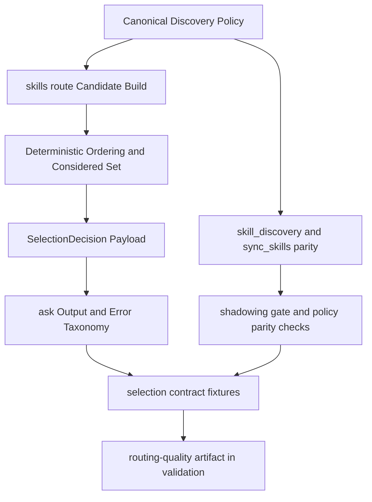

# feat: Skill and Plugin Selection Gold-Standard Upgrade Plan

## Table of Contents

- [Enhancement Summary](#enhancement-summary)
- [Section Manifest (Deepening Pass)](#section-manifest-deepening-pass)
- [Overview](#overview)
- [Problem Frame](#problem-frame)
- [Requirements Trace](#requirements-trace)
- [Scope Boundaries](#scope-boundaries)
- [Context and Research](#context-and-research)
- [Key Technical Decisions](#key-technical-decisions)
- [Open Questions](#open-questions)
- [High-Level Technical Design](#high-level-technical-design)
- [Implementation Units](#implementation-units)
- [Task Graph (id and depends_on)](#task-graph-id-and-depends_on)
- [Execution Control Gates](#execution-control-gates)
- [System-Wide Impact](#system-wide-impact)
- [Risks and Dependencies](#risks-and-dependencies)
- [Documentation and Operational Notes](#documentation-and-operational-notes)
- [Execution Ledger (Planning Mode)](#execution-ledger-planning-mode)
- [Acceptance Checklist](#acceptance-checklist)
- [Sources and References](#sources-and-references)

## Enhancement Summary

**Deepened on:** 2026-04-09  
**Mode:** targeted-confidence  
**Research execution mode:** direct  
**Selected weak sections:** Context and Research, Implementation Units, Execution Control Gates, Risks and Dependencies

- Added comparative grounding from `codex` and `claude-code` patterns so deterministic selection, collision handling, and plugin-state boundaries are anchored to concrete reference implementations.
- Strengthened `P0-P3` verification expectations to require explicit contract evidence, not only generic "tests pass" language.
- Tightened execution gates with concrete blocking signals and release-readiness evidence expectations.
- Expanded risks into trigger/detection/mitigation form so execution can fail fast and recover without widening scope.

### Section Manifest (Deepening Pass)

| Section | Confidence gap observed | Deepening action |
| --- | --- | --- |
| Context and Research | Strong local code refs, but thin comparative grounding for why these contracts are the right wave-1 shape | Added cross-repo comparative evidence and decision linkage |
| Implementation Units | Verification language was directionally correct but not strict enough to prevent "green by assertion" outcomes | Tightened verification and exit criteria for `P0-P3` with explicit contract evidence |
| Execution Control Gates | Gates existed but lacked explicit blocking signal semantics | Added measurable gate criteria tied to policy identity, replay determinism, and artifact validity |
| Risks and Dependencies | Risks were present but mitigation lacked trigger/detection structure | Replaced with operational risk matrix including mitigation and contingency paths |

## Overview

Deliver the wave-1 selection baseline defined by the governing spec so `ask` selection behavior is deterministic, explainable, and auditable across skills and plugins.

This plan sequences four implementation units:

- establish one canonical discovery-policy source used by route/discovery/sync surfaces;
- add first-class `ask skills route` output with explicit decision contracts;
- expand `ask plugins` from install-heavy to read-only state visibility (`list/status/doctor`);
- add deterministic selection-contract fixtures and validation artifacts to prevent drift.

Plan mode: `standard-plan`  
Plan depth: `standard`  
Execution posture: contract-first, deterministic-fixture-first.

## Problem Frame

`agent-skills` already contains routing and catalog primitives, but user-facing selection behavior is still fragmented:

- no first-class route command at `ask` boundary;
- discovery policy logic is duplicated between Python discovery helpers and shell sync behavior;
- plugin UX is centered on `init/install` rather than ongoing state visibility;
- selection quality is not yet enforced by a dedicated deterministic contract gate with durable artifacts.

Without a coordinated upgrade, ambiguity handling, policy drift, and shadowing behavior can regress silently and erode operator trust.

## Requirements Trace

- R1. First-class route command must return deterministic, explainable selection decisions.
  Trace: spec `SA1`, `SA2`, `SA3`, `SA4`, `SA13`.
- R2. Candidate ordering and considered-set boundaries must be explicit and deterministic.
  Trace: spec `SA17`, `SA18`.
- R3. Discovery policy must have a single canonical source with parity checks across route/discovery/sync.
  Trace: spec `SA5`, `SA14`.
- R4. Plugin lifecycle wave-1 must expose read-only `list`, `status`, `doctor` views.
  Trace: spec `SA6`, `SA7`, `SA8`.
- R5. Shadowing must enforce wave-1 no-exception policy with explicit remediation behavior.
  Trace: spec `SA15`, `SA19`.
- R6. Non-success/no-candidate behavior must be externally visible and machine-consistent.
  Trace: spec `SA12` plus decision-status/failure-class mapping.
- R7. Validation must emit routing-quality artifacts with policy identity and explainability completeness.
  Trace: spec `SA10`, `SA16`.
- R8. Deterministic fixture gates must fail fast on regressions.
  Trace: spec `SA9`, `SA11`.

## Scope Boundaries

In scope:

- `ask` command surface and command handlers for skills/plugins selection behavior.
- shared discovery-policy source consumed by discovery and sync pathways.
- read-only plugin state command family for wave 1.
- deterministic fixture and validation-gate additions for selection quality.

Out of scope:

- plugin mutation commands (`enable`, `disable`, `refresh`) in this wave.
- plugin packaging format redesign or installer trust-policy redesign.
- router algorithm replacement unless current internals violate the contract.
- non-selection feature work unrelated to routing/discovery/plugin-state quality.

## Context and Research

### Relevant Code and Patterns

- `bin/ask`
  - canonical topic/action parser and dispatch logic; currently lacks `skills route` and plugin state actions.
- `scripts/lib/ask/commands/skills.py`
  - current `skills` action handlers and router module loading path; natural insertion point for route contract surface.
- `scripts/lib/ask/commands/plugins.py`
  - current `plugins init/install` implementation; extension point for read-only lifecycle state commands.
- `scripts/skill_discovery.py`
  - canonicalized skill enumeration logic used by `skills list` and related flows.
- `scripts/sync_skills.sh`
  - flat-surface sync logic currently carrying independent policy constants.
- `scripts/check_plugin_skill_shadowing.sh`
  - existing overlap gate to preserve as authoritative shadowing validator.
- `scripts/test_skill_lifecycle_validation.py`
  - lifecycle and shadowing contract tests; suitable place for expanded selection-policy parity tests.
- `tests/test_ask_cli.py`
  - CLI command-surface coverage; baseline for new route/plugins state command assertions.

### Institutional Learnings

- Keep deterministic routing outputs explainable at CLI boundary, not only internal router events.
- Treat shadowing failures as release blockers, and keep sync/parity checks explicit.
- Preserve command contracts in `ask` rather than introducing parallel one-off scripts.

### Comparative Evidence (Codex + Claude Code)

- `~/dev/codex/codex-rs/core-skills/src/injection.rs`, `~/dev/codex/codex-rs/core-skills/src/mention_counts.rs`, and `~/dev/codex/codex-rs/core/src/plugins/mentions.rs`
  - justify explicit ambiguity/collision handling and deterministic mention resolution at the CLI contract boundary.
- `~/dev/codex/codex-rs/core-skills/src/loader.rs` and `~/dev/codex/codex-rs/core-skills/src/manager.rs`
  - justify deterministic precedence and dedupe semantics keyed to one policy identity source.
- `~/dev/claude-code/src/tools/ToolSearchTool/ToolSearchTool.ts` and `~/dev/claude-code/src/query.ts`
  - justify explicit per-turn tool/discovery refresh semantics and visible pending-state reporting.
- `~/dev/claude-code/src/utils/plugins/pluginLoader.ts`, `~/dev/claude-code/src/utils/plugins/installedPluginsManager.ts`, and `~/dev/claude-code/src/services/plugins/pluginOperations.ts`
  - justify strict separation of installed metadata versus enabled/active runtime state, which this plan keeps read-only in wave 1.

## Key Technical Decisions

- Decision 1: Introduce `ask skills route` as the single first-class operator entrypoint for selection decisions.
  - Rationale: makes selection correctness inspectable and testable in the same CLI surface users already depend on.
- Decision 2: Create one shared discovery-policy module as the source of truth for roots, hidden names, and exclusion segments.
  - Rationale: removes policy drift between `scripts/skill_discovery.py` and `scripts/sync_skills.sh`.
- Decision 3: Keep wave-1 plugin lifecycle state strictly read-only (`list/status/doctor`) and model installed/activation/health states explicitly.
  - Rationale: aligns with governing spec risk posture while improving operator observability immediately.
- Decision 4: Add a dedicated selection-contract validator that emits machine-readable routing-quality artifacts per run.
  - Rationale: prevents regressions in ambiguity handling, considered-set behavior, and failure taxonomy.
- Decision 5: Keep `scripts/check_plugin_skill_shadowing.sh` as authoritative overlap gate and make its outcomes traceable in route-quality reporting.
  - Rationale: avoids parallel/competing shadow validators.

## Open Questions

### Resolved During Planning

- Should wave-1 include plugin mutation operations?
  - Resolution: no; remain read-only per governing spec boundaries.
- Should route-quality evidence be optional in validation?
  - Resolution: no; contract-validator output is required for selection-ready status.

### Deferred to Implementation

- Exact JSON schema file location for route decision payload (`schema/` vs command-local schema helper).
  - Defer to implementation for best fit with existing `ask` envelope/schema patterns.
- Whether route-quality artifacts should be emitted as one aggregate file or split by fixture group.
  - Defer after first implementation pass and validator ergonomics review.

## High-Level Technical Design

> This section is directional planning guidance, not implementation code.



## Implementation Units

- [ ] **P0 / Canonical Discovery Policy Consolidation**

**Goal:** Remove policy drift by defining one canonical discovery-policy source consumed by discovery and sync surfaces.

**Requirements:** R3, R5

**Dependencies:** None

**Files:**

- Create: `scripts/selection_policy.py`
- Modify: `scripts/skill_discovery.py`
- Modify: `scripts/sync_skills.sh`
- Modify: `scripts/test_skill_lifecycle_validation.py`
- Test: `scripts/test_skill_lifecycle_validation.py`
- Test: `scripts/verify_skill_catalog_freshness.py`
- Test: `scripts/check_plugin_skill_shadowing.sh`

**Approach:**

- Move roots, hidden names, and excluded-scan segments into `scripts/selection_policy.py`.
- Make `scripts/skill_discovery.py` import policy constants/functions from this module.
- Make `scripts/sync_skills.sh` consume policy data from the same module (for example, via deterministic JSON/shell export), eliminating duplicated constant blocks.
- Preserve existing shadowing gate behavior while ensuring policy parity identity can be derived from the same source.

**Patterns to follow:**

- Existing `scripts/skill_discovery.py` dataclass-based catalog flow.
- Existing fail-fast guard style in `scripts/sync_skills.sh` and `scripts/check_plugin_skill_shadowing.sh`.

**Test scenarios:**

- policy-driven hidden names are identical between discovery and sync pathways;
- policy updates in one place propagate to both pathways without manual duplication;
- shadowing gate still blocks overlap scenarios after policy centralization.

**Verification:**

- route/discovery/sync surfaces expose one shared `policy_identity` derived from `scripts/selection_policy.py`;
- lifecycle validation proves parity across discovery and sync, and shadowing validation remains release-blocking.

**Exit criteria:**

- no duplicated discovery-policy constant sets remain in sync/discovery entrypoints;
- policy-parity evidence is emitted from lifecycle validation with matching policy identity across surfaces;
- shadowing gate continues to fail on overlap and provide explicit remediation hints.

- [ ] **P1 / First-Class `ask skills route` Contract Surface**

**Goal:** Add deterministic, explainable route output at CLI boundary, including non-success taxonomy mapping.

**Requirements:** R1, R2, R6

**Dependencies:** P0

**Files:**

- Modify: `bin/ask`
- Modify: `scripts/lib/ask/commands/skills.py`
- Create: `scripts/lib/ask/selection_contract.py`
- Modify: `tests/test_ask_cli.py`
- Create: `tests/test_ask_skills_route.py`
- Modify: `scripts/verify_router_schema.py`

**Approach:**

- Add `skills route <request>` parser/action wiring in `bin/ask` (`VALID_ACTIONS`, help text, dispatch, human/json output branches).
- Introduce selection-contract builder in `scripts/lib/ask/selection_contract.py` to normalize:
  - `decision_status` and `failure_class` mapping,
  - deterministic ordering metadata,
  - considered-set boundaries (`considered_limit`, truncation details),
  - selected/considered/excluded candidate explainability fields.
- Reuse existing router internals via `scripts/lib/ask/commands/skills.py` without replacing underlying routing engine.
- Ensure explicit degraded output for no-candidate outcomes and unresolved ambiguity payload for non-deterministic collisions.

**Patterns to follow:**

- Existing `CallResult` envelope and error handling patterns in `bin/ask`.
- Existing router module loading strategy in `scripts/lib/ask/commands/skills.py`.

**Test scenarios:**

- route returns deterministic selected candidates with rationale/confidence;
- ambiguous collisions return deterministic winner or explicit unresolved payload;
- no-candidate requests return `degraded_no_candidates` with mapped `NO_ELIGIBLE_CANDIDATES` failure class;
- considered-set fields are present and stable in JSON output.

**Verification:**

- `ask skills route` works in both human and `--json` modes with consistent envelopes;
- route payload includes `decision_status`, `failure_class` (when non-resolved), `considered_limit`, and truncation metadata;
- deterministic replay assertions confirm stable output ordering for identical request/catalog inputs.

**Exit criteria:**

- first-class route command is available and contract-complete for wave-1 statuses;
- route outputs satisfy spec `SA1-SA4`, `SA12`, `SA13`, `SA17`, `SA18`;
- unresolved ambiguity and no-candidate degraded behavior are externally visible and machine-consistent.

- [ ] **P2 / Plugin Read-Only State Lifecycle Commands**

**Goal:** Add `ask plugins list/status/doctor` with installed/activation/health state separation.

**Requirements:** R4, R5

**Dependencies:** P0

**Files:**

- Modify: `bin/ask`
- Modify: `scripts/lib/ask/commands/plugins.py`
- Create: `scripts/lib/ask/plugin_state.py`
- Modify: `tests/test_ask_cli.py`
- Create: `tests/test_ask_plugins_state.py`

**Approach:**

- Extend plugin action set and parser wiring for `list`, `status`, and `doctor`.
- Implement read-only state snapshots in `scripts/lib/ask/plugin_state.py` with explicit groups:
  - installed metadata,
  - activation visibility by repo context,
  - health diagnostics and blockers.
- Keep `init/install` flows intact and ensure new read-only commands introduce no mutation side effects.
- Align doctor output with existing shadowing and catalog freshness checks where practical.

**Patterns to follow:**

- Existing plugin command error handling in `scripts/lib/ask/commands/plugins.py`.
- Existing non-mutating diagnostic command behavior in `scripts/lib/ask/commands/repo.py`.

**Test scenarios:**

- list/status/doctor return machine-readable outputs with required state groups;
- commands perform no writes in dry-run and normal read-only execution;
- doctor surfaces overlap/parity blockers consistently with validator outputs.

**Verification:**

- plugin state commands produce stable envelopes and consistent state grouping (`installed_state`, `activation_state`, `health_state`);
- read-only integrity checks confirm no command-path mutation side effects for wave-1 plugin state actions;
- doctor output aligns with shadowing/parity diagnostics used by validation gates.

**Exit criteria:**

- plugin lifecycle read-only surface is complete for wave 1;
- spec `SA6-SA8` behavior is met without adding mutation operations;
- plugin-state error outcomes remain explicit and actionable (`PLUGIN_STATE_UNAVAILABLE` contract path).

- [ ] **P3 / Selection Contract Fixtures and Validation Artifactization**

**Goal:** Add deterministic selection contract tests and routing-quality artifacts to validation flow.

**Requirements:** R7, R8

**Dependencies:** P1, P2

**Files:**

- Create: `scripts/verify_selection_contract.py`
- Create: `tests/fixtures/selection-contract/route-fixtures.json`
- Modify: `scripts/validate_all.sh`
- Modify: `scripts/verify_router_schema.py`
- Modify: `scripts/test_skill_lifecycle_validation.py`
- Test: `tests/test_ask_skills_route.py`
- Test: `scripts/test_skill_lifecycle_validation.py`
- Test: `scripts/verify_selection_contract.py`
- Modify: `docs/specs/2026-04-09-feat-skill-plugin-selection-gold-standard-spec.md` (only if artifact location decision needs codified clarification)

**Approach:**

- Add deterministic fixture runner for selection decision outputs covering:
  - ordering/truncation rules,
  - ambiguity and no-candidate statuses,
  - failure taxonomy visibility,
  - policy parity identity assertions.
- Emit routing-quality artifact into `artifacts/validation/latest/routing-quality.json` with policy identity, decision-status counts, failure distribution, and explainability completeness metrics.
- Add validator gate invocation to `scripts/validate_all.sh` as required failure for contract regressions.

**Patterns to follow:**

- Existing required/warn check orchestration in `scripts/validate_all.sh`.
- Existing lifecycle validator style in `scripts/test_skill_lifecycle_validation.py`.

**Test scenarios:**

- fixture diffs fail when rank/order/explainability contracts regress;
- parity mismatch fails with explicit surface diagnostics;
- routing-quality artifact is emitted and schema-valid for each validation run.

**Verification:**

- validation fails fast on selection contract regressions;
- route-quality artifacts are present and comparable run-over-run;
- validation fails when route/discovery/sync policy identities diverge.

**Exit criteria:**

- spec `SA9-SA11`, `SA14-SA16` are enforced by deterministic gates;
- routing-quality artifacts are available in validation outputs for audit;
- `validate_all` treats missing or schema-invalid routing-quality artifact output as a required failure.

## Task Graph (id and depends_on)

```yaml
tasks:
  - id: P0
    title: Centralize discovery policy and remove sync/discovery drift.
    depends_on: []
  - id: P1
    title: Add first-class ask skills route decision contract at CLI boundary.
    depends_on: [P0]
  - id: P2
    title: Add read-only plugin lifecycle state commands list/status/doctor.
    depends_on: [P0]
  - id: P3
    title: Add deterministic selection contract fixtures and validation artifacts.
    depends_on: [P1, P2]
```

## Execution Control Gates

- **G0 / Policy Gate:** Do not start `P1` or `P2` until canonical discovery policy source is shared across discovery and sync surfaces and parity evidence exposes one matching `policy_identity`.
- **G1 / Route Contract Gate:** Do not start `P3` until `skills route` payload includes required status/failure mapping, considered-set metadata, and deterministic replay stability in fixture tests.
- **G2 / Read-Only Integrity Gate:** Do not mark `P2` complete until plugin state commands prove no mutation side effects and doctor outputs align with shadowing/parity validators.
- **G3 / Validation Gate:** Do not mark plan complete until deterministic selection-contract validation is required in `validate_all`, emits `artifacts/validation/latest/routing-quality.json`, and fails on missing or schema-invalid artifacts.

## System-Wide Impact

- **Interaction graph:** `bin/ask` parser + command handlers + discovery/sync scripts + validation pipeline become one coordinated contract surface.
- **Error propagation:** non-success selection decisions become explicit CLI-level statuses with actionable operator metadata.
- **State lifecycle risks:** discovery policy drift and shadowing overlap are elevated from implicit behavior to explicit release gates.
- **API surface parity:** route/discovery/sync/plugin-state semantics remain synchronized through shared policy identity.
- **Integration coverage:** validator fixtures cover cross-layer behavior that unit tests alone cannot prove.

## Risks and Dependencies

| Risk | Trigger | Detection signal | Mitigation | Contingency |
| --- | --- | --- | --- | --- |
| Parser/dispatch drift for new `ask` actions | New `skills route` and plugin-state actions added across parser and dispatch | CLI tests pass partially but action dispatch mismatch appears in route/state commands | Update `VALID_ACTIONS`, subparsers, and dispatch branches in one implementation unit and keep command-surface tests coupled | Roll back only the new action wiring behind existing parser contracts until parity tests are green |
| Shell/Python policy interoperability drift | `scripts/sync_skills.sh` cannot consume policy output from Python source cleanly | Discovery/sync parity mismatch under lifecycle validation | Use deterministic machine export from `scripts/selection_policy.py` and assert policy-identity parity in validator output | Keep sync path read-only and block `P1/P2` progression until parity identity matches |
| Fixture brittleness creates false positives | Legitimate contract evolution changes stable fields without fixture governance update | Deterministic fixture failures without semantic behavior regression | Keep fixtures scoped to contract fields (status/order/explainability/parity) and define fixture update protocol in validator docs | Require explicit fixture-intent annotation before accepting baseline updates |
| Validation runtime growth slows iteration | Added contract checks and artifact generation increase gate time | Noticeable expansion of `validate_all` duration in repeated runs | Keep fixture corpus bounded to high-risk collision/no-candidate/parity cases; move wide corpus to optional deep suite | Temporarily isolate slow scenarios in non-required lane while preserving required contract gates |
| Repo-wide plan-graph baseline noise masks scoped signal | `scripts/validate_plan_graphs.sh` fails on historical plan backlog unrelated to this feature | Wrapper fails while direct lint for this plan passes | Treat scoped plan lint as the blocking signal for this artifact and track wrapper backlog separately | Record backlog as a separate governance item rather than widening this implementation scope |

## Documentation and Operational Notes

- Keep this plan as the canonical execution artifact for the selection baseline wave.
- Maintain one routing-quality artifact per validation run for comparability.
- If blockers represent durable governance work, route follow-up via issue tracking with explicit evidence links.
- Preserve wave-1 boundary: read-only plugin lifecycle only.
- Rollout expectation: ship `skills route` and plugin read-only state commands behind normal CLI release flow with validation artifacts attached to release evidence.
- Rollback expectation: if parser/dispatch or selection-contract gates regress, disable only new route/state action wiring while preserving existing `ask` command surfaces.

## Execution Ledger (Planning Mode)

STEP_ID | status (pending|in_progress|completed) | owner | evidence
P0 | in_progress | codex | Planning artifact authored; source and target files identified; ready to start canonical policy extraction
P1 | pending | codex | Awaiting G0
P2 | pending | codex | Awaiting G0
P3 | pending | codex | Awaiting G1 and G2

## Acceptance Checklist

- [ ] AC1 (R1): `ask skills route` exists and returns ranked, explainable decisions with deterministic behavior.
- [ ] AC2 (R2): route outputs include canonical ordering metadata, `considered_limit`, and truncation/considered boundaries.
- [ ] AC3 (R3): one canonical discovery-policy source is consumed by discovery and sync, and policy parity is verifiable.
- [ ] AC4 (R4): `ask plugins list/status/doctor` return read-only lifecycle state outputs with installed/activation/health grouping.
- [ ] AC5 (R5): plugin-shadowing no-exception wave-1 policy is enforced with explicit remediation guidance.
- [ ] AC6 (R6): non-success selection taxonomy includes explicit no-candidate degradation behavior and external failure-class visibility.
- [ ] AC7 (R7): validation emits routing-quality artifacts including policy identity, status counts, failure distribution, and explainability completeness.
- [ ] AC8 (R8): deterministic selection fixtures fail fast on contract regressions and are integrated into repo validation flow.

## Sources and References

- Governing requirements: `docs/brainstorms/2026-04-09-skill-plugin-selection-gold-standard-requirements.md`
- Governing spec: `docs/specs/2026-04-09-feat-skill-plugin-selection-gold-standard-spec.md`
- CLI entrypoint: `bin/ask`
- Skills commands: `scripts/lib/ask/commands/skills.py`
- Plugin commands: `scripts/lib/ask/commands/plugins.py`
- Discovery helper: `scripts/skill_discovery.py`
- Sync pipeline: `scripts/sync_skills.sh`
- Shadowing gate: `scripts/check_plugin_skill_shadowing.sh`
- Lifecycle validator: `scripts/test_skill_lifecycle_validation.py`
- Validation orchestrator: `scripts/validate_all.sh`
- Existing CLI tests: `tests/test_ask_cli.py`, `tests/test_ask_skills_errors.py`, `tests/test_ask_skills_sync_security.py`
