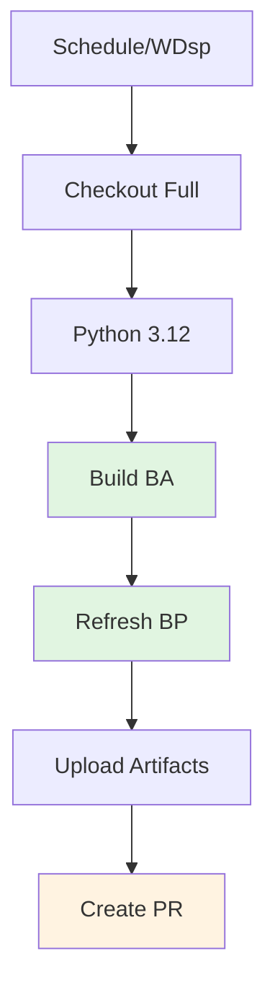

# BPRW: Benchmark Policy Refresh Workflow

Periodic refresh of benchmark policy baselines with automated PR creation.

---

## ABBREVIATION MAP

| Abbr | Meaning |
|------|---------|
| BPRW | Benchmark policy refresh workflow |
| BP | Benchmark policy |
| BA | Benchmark artifact |
| C7 | Context7 |
| PR | Pull request |

---

## TRIGGER MATRIX

| EVENT | SCHEDULE | MODE |
|-------|----------|------|
| Schedule | `0 7 * * 1` (Mon 07:00 UTC) | Auto-PR |
| WDsp | — | Auto-PR |

---

## JOB PIPELINE



---

## PERMISSIONS

```yaml
permissions:
  contents: write
  pull-requests: write
```

---

## JOB: REFRESH

| CONFIG | VALUE |
|--------|-------|
| Runner | `ubuntu-latest` |
| Checkout | Full history (`fetch-depth: 0`) |
| Python | `3.12` |

### Step 1: Build Benchmark Artifact

```bash
python3 utilities/skill-builder/scripts/benchmark_skill_portfolio.py \
  --root . \
  --config utilities/skill-builder/references/benchmark-policy.json \
  --mode off \
  --format json \
  --output-json artifacts/industry-benchmark-latest.json
```

| FLAG | VALUE | DESCRIPTION |
|------|-------|-------------|
| `--mode` | `off` | Benchmark mode off (generation only) |
| `--format` | `json` | Output format |
| `--output-json` | `artifacts/industry-benchmark-latest.json` | Artifact path |

### Step 2: Refresh Benchmark Policy

```bash
python3 utilities/skill-builder/scripts/refresh_benchmark_policy.py \
  --root . \
  --policy utilities/skill-builder/references/benchmark-policy.json \
  --benchmark-json artifacts/industry-benchmark-latest.json \
  --schedule-days 7 \
  --require-context7 \
  --apply \
  --report-json artifacts/benchmark-policy-refresh-report.json \
  --format text
```

| FLAG | VALUE | DESCRIPTION |
|------|-------|-------------|
| `--schedule-days` | `7` | Refresh schedule window |
| `--require-context7` | — | Require Context7 API |
| `--apply` | — | Apply changes to policy |
| `--report-json` | `artifacts/benchmark-policy-refresh-report.json` | Report output |

### ENV

```yaml
CONTEXT7_API_KEY: ${{ secrets.CONTEXT7_API_KEY }}
```

### Step 3: Upload Artifacts

| NAME | PATHS | CONDITION |
|------|-------|-----------|
| `benchmark-policy-refresh` | `artifacts/industry-benchmark-latest.json`, `artifacts/benchmark-policy-refresh-report.json` | `always()` |

### Step 4: Create Pull Request

| CONFIG | VALUE |
|--------|-------|
| Action | `peter-evans/create-pull-request@v7` |
| Branch | `codex/benchmark-policy-refresh` |
| Delete branch | `true` |
| Commit message | `chore: refresh benchmark policy baselines` |
| Title | `chore: refresh benchmark policy baselines` |
| Changed paths | `utilities/skill-builder/references/benchmark-policy.json` |

---

## LOCAL COMMANDS

```bash
# Build benchmark artifact
python3 utilities/skill-builder/scripts/benchmark_skill_portfolio.py \
  --root . \
  --config utilities/skill-builder/references/benchmark-policy.json \
  --mode off \
  --format json \
  --output-json artifacts/industry-benchmark-latest.json

# Refresh policy (dry-run)
python3 utilities/skill-builder/scripts/refresh_benchmark_policy.py \
  --root . \
  --policy utilities/skill-builder/references/benchmark-policy.json \
  --benchmark-json artifacts/industry-benchmark-latest.json \
  --schedule-days 7 \
  --require-context7 \
  --report-json artifacts/benchmark-policy-refresh-report.json \
  --format text

# Refresh policy (apply)
python3 utilities/skill-builder/scripts/refresh_benchmark_policy.py \
  --root . \
  --policy utilities/skill-builder/references/benchmark-policy.json \
  --benchmark-json artifacts/industry-benchmark-latest.json \
  --schedule-days 7 \
  --require-context7 \
  --apply \
  --report-json artifacts/benchmark-policy-refresh-report.json \
  --format text
```

---

## CI REFERENCE

Workflow: `.github/workflows/benchmark-policy-refresh.yml`

---

## RELATED

- [Benchmark policy](/utilities/skill-builder/references/benchmark-policy.json)
- [Benchmark script](/utilities/skill-builder/scripts/benchmark_skill_portfolio.py)
- [Refresh script](/utilities/skill-builder/scripts/refresh_benchmark_policy.py)
