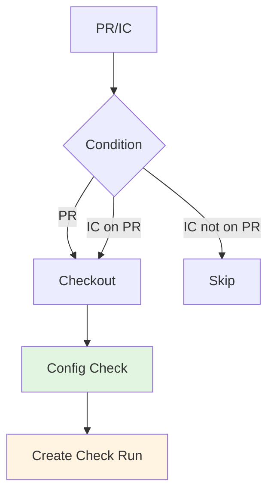

# GRW: Greptile Review Workflow

Integrates Greptile AI code review bot with PR checks.

---

## ABBREVIATION MAP

| Abbr | Meaning |
|------|---------|
| GRW | Greptile review workflow |
| GP | Greptile bot |
| PR | Pull request |
| IC | Issue comment |

---

## TRIGGER MATRIX

| EVENT | TYPES | CONDITION |
|-------|-------|-----------|
| PR | `opened`, `synchronize`, `reopened`, `review_requested` | Always |
| IC | `created` | `github.event.issue.pull_request` exists |

---

## JOB PIPELINE



---

## PERMISSIONS

```yaml
permissions:
  contents: read
  pull-requests: read
  checks: write
  statuses: write
```

---

## JOB: GREPTILE REVIEW

| CONFIG | VALUE |
|--------|-------|
| Runner | `ubuntu-latest` |
| Condition | `github.event_name == 'pull_request' \|\| (github.event_name == 'issue_comment' && github.event.issue.pull_request)` |

### Steps

| STEP | ACTION | PURPOSE |
|------|--------|---------|
| Checkout | `actions/checkout@v6` | Get code |
| Config Check | `test -f` × 3 | Verify Greptile config exists |
| Create Check | `actions/github-script@v7` | Post neutral check run |

### Required Config Files

| FILE | PURPOSE |
|------|---------|
| `.greptile/config.json` | Greptile configuration |
| `.greptile/files.json` | File patterns |
| `.greptile/rules.md` | Review rules |

### Check Run Details

| FIELD | VALUE |
|-------|-------|
| Name | `Greptile Review` |
| SHA | `context.payload.pull_request.head.sha` |
| Status | `completed` |
| Conclusion | `neutral` |
| Title | `Greptile Review Pending` |
| Summary | `Workflow is configured. Awaiting Greptile bot review comment.` |

### Skip Condition

```javascript
if (!sha) {
  core.info("No pull_request SHA in payload; skipping check run creation.");
  return;
}
```

---

## CI REFERENCE

Workflow: `.github/workflows/greptile-review.yml`

---

## RELATED

- [Greptile docs](https://greptile.com)
- Config: `.greptile/config.json`, `.greptile/files.json`, `.greptile/rules.md`
