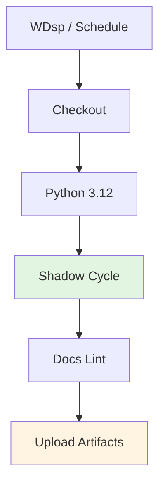

# RSSW: Recursive Skill Shadow Workflow

Executes shadow cycles for pilot profiles and aggregates results.

---

## ABBREVIATION MAP

| Abbr | Meaning |
|------|---------|
| RSSW | Recursive skill shadow workflow |
| SC | Shadow cycle |
| RPP | Runs per profile |
| WD | Window days |
| WDsp | Workflow dispatch |
| PF | Pilot profile |

---

## TRIGGER MATRIX

| EVENT | SCHEDULE | INPUTS | DEFAULTS |
|-------|----------|--------|----------|
| WDsp | — | `runs_per_profile`, `window_days` | `2`, `7` |
| Schedule | `0 13 * * 1` (Mon 13:00 UTC) | — | `2`, `7` |

---

## JOB PIPELINE



---

## PERMISSIONS

```yaml
permissions:
  contents: read
```

---

## JOB: SHADOW CYCLE

| CONFIG | VALUE |
|--------|-------|
| Runner | `ubuntu-latest` |
| Python | `3.12` |
| Script | `scripts/run_recursive_skill_shadow_cycle.sh` |

### Inputs

| INPUT | ENV | DEFAULT | DESCRIPTION |
|-------|-----|---------|-------------|
| `runs_per_profile` | `RUNS_PER_PROFILE` | `2` | Loop runs per pilot profile |
| `window_days` | `WINDOW_DAYS` | `7` | Report aggregation window |

### Script Flags

```bash
bash scripts/run_recursive_skill_shadow_cycle.sh \
  --runs-per-profile "$RUNS_PER_PROFILE" \
  --window-days "$WINDOW_DAYS" \
  --out-root "artifacts/skill-graphs/runs" \
  --profiles-file "docs/skill-graphs/schemas/examples/pilot-profiles.json"
```

### Script Defaults

| FLAG | DEFAULT |
|------|---------|
| `--runs-per-profile` | `2` |
| `--window-days` | `7` |
| `--out-root` | `artifacts/skill-graphs/runs` |
| `--profiles-file` | `docs/skill-graphs/schemas/examples/pilot-profiles.json` |

---

## JOB: DOCS LINT

| CONFIG | VALUE |
|--------|-------|
| Mode | `warn` |
| Config | `docs-policy.json` |
| Output | `/tmp/docs-lint-shadow.json` |

```bash
python3 scripts/docs_lint.py \
  --config docs-policy.json \
  --mode warn \
  --report-json /tmp/docs-lint-shadow.json
```

---

## ARTIFACTS

| NAME | PATHS |
|------|-------|
| `recursive-skill-shadow-artifacts` | `artifacts/skill-graphs/**` |
| | `docs/skill-graphs/pilots/ui-skills-shadow-results.md` |
| | `docs/skill-graphs/pilots/ui-skills-pilot-readout.md` |
| | `docs/skill-graphs/telemetry/daily-skill-health.md` |
| | `artifacts/skill-graphs/telemetry/failure-pattern-candidates.jsonl` |
| | `artifacts/skill-graphs/telemetry/promotion-queue.md` |
| | `/tmp/docs-lint-shadow.json` |

---

## LOCAL COMMANDS

```bash
# Run shadow cycle
bash scripts/run_recursive_skill_shadow_cycle.sh \
  --runs-per-profile 2 \
  --window-days 7

# With custom profiles
bash scripts/run_recursive_skill_shadow_cycle.sh \
  --runs-per-profile 3 \
  --window-days 14 \
  --profiles-file custom-profiles.json

# Docs lint
python3 scripts/docs_lint.py \
  --config docs-policy.json \
  --mode warn \
  --report-json docs-lint-report.json
```

---

## CI REFERENCE

Workflow: `.github/workflows/recursive-skill-shadow.yml`

---

## RELATED

- [Shadow cycle script](/scripts/run_recursive_skill_shadow_cycle.sh)
- [Pilot profiles example](/docs/skill-graphs/schemas/examples/pilot-profiles.json)
- [UI skills shadow results](/docs/skill-graphs/pilots/ui-skills-shadow-results.md)
- [Daily skill health](/docs/skill-graphs/telemetry/daily-skill-health.md)
