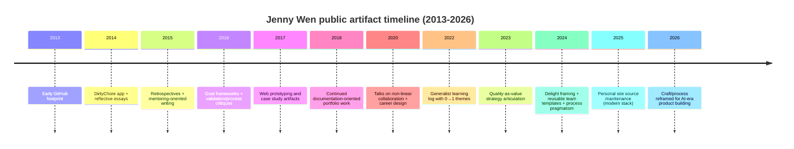
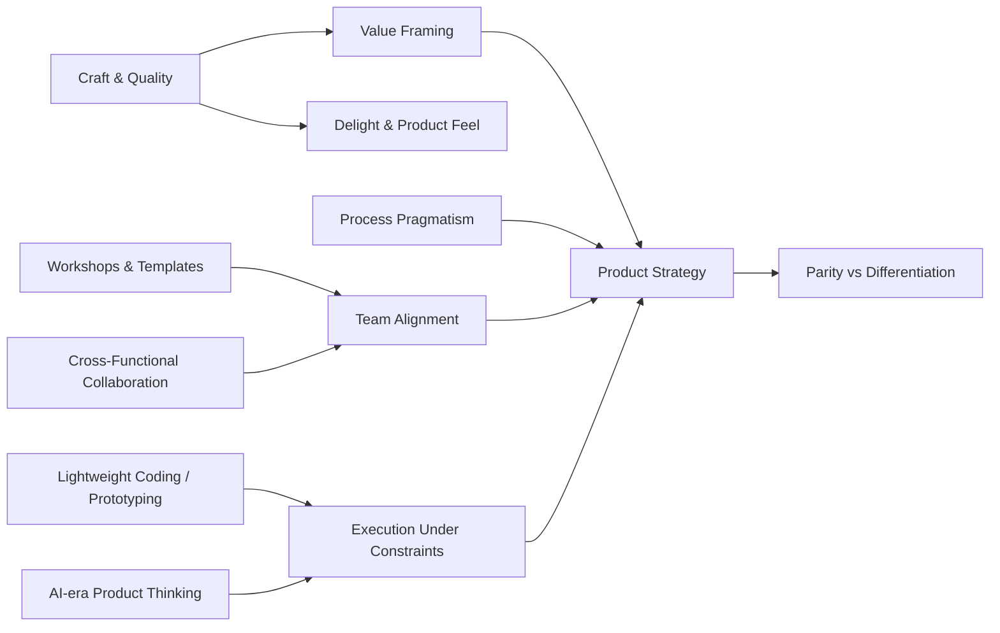

# Jenny Wen Persona Evidence (2013-2026)

## Table of Contents
- [Scope and caveats](#scope-and-caveats)
- [Identity and disambiguation](#identity-and-disambiguation)
- [Primary source hubs](#primary-source-hubs)
- [Persona thesis (evidence-backed)](#persona-thesis-evidence-backed)
- [Timeline highlights](#timeline-highlights)
- [Timeline diagram (Mermaid)](#timeline-diagram-mermaid)
- [Skill evidence matrix](#skill-evidence-matrix)
- [Skill relationship map (Mermaid)](#skill-relationship-map-mermaid)
- [Representative quote bank](#representative-quote-bank)
- [Source index (IDs to URLs)](#source-index-ids-to-urls)

## Scope and caveats
- This file consolidates publicly discoverable evidence provided in the 2013-2026 inventory.
- Prioritize primary hubs (`jennywen.ca`, `blog.jennywen.ca`, `github.com/jennywen`) for high-confidence grounding.
- Social corpus caveat: X/LinkedIn were not fully enumerable in the referenced pass due platform gating/retrieval constraints; treat social snippets as representative, not exhaustive.

## Identity and disambiguation
- Canonical identity linkage is established by cross-linked profiles:
  - Personal website: `jennywen.ca`
  - Blog: `blog.jennywen.ca`
  - GitHub: `github.com/jennywen` (links back to personal site)
  - X handle: `@jenny_wen` (links to personal site)
- Career arc matches across primary and secondary sources:
  - Current design leadership in Claude/Anthropic context.
  - Prior design leadership at Figma (including FigJam context).
- Exclusions in inventory: unrelated individuals named "Jenny Wen" without the handle/site cross-links.

## Primary source hubs
- Website: <https://jennywen.ca/>
- Notes index: <https://jennywen.ca/notes>
- Blog: <https://blog.jennywen.ca/>
- GitHub: <https://github.com/jennywen>
- X: <https://x.com/jenny_wen?lang=en>
- LinkedIn: <https://www.linkedin.com/in/jennywen>

## Persona thesis (evidence-backed)
1. **Craft and quality are strategic value levers**
   - Explicit quality framing in notes and interviews (for example, quality as value in digital products).
2. **Process is useful but must stay pragmatic**
   - Repeated critique of rigid process theater; emphasis on real execution under ambiguity.
3. **Delight and emotional UX matter**
   - Public interview/talk framing around designing for delight, not only feature checklists.
4. **Cross-functional execution is central**
   - Multiple talks/interviews highlight non-linear collaboration across design/engineering/product.
5. **Frameworks/templates improve team throughput**
   - Publicly shared templates for strategy, meetings, prioritization, and coaching.
6. **Generalist + lightweight technical fluency**
   - Repositories and web artifacts show ongoing prototyping/publishing literacy.

## Timeline highlights

### 2013-2018 (early coding + reflective writing)
- GitHub activity begins in 2013 (repo creation and technical workflow traces).
- 2014: `j3` / DirtyChore app demonstrates incentive-aware product thinking in code.
- 2014-2016 blog/notes entries establish a reflective, mentorship-oriented voice with systems for goals and feedback.
- 2017-2018 repos (`syde542`, `learning`) show HTML/CSS prototyping and case-study style artifacts.

### 2020-2024 (public product/design leadership articulation)
- 2020 talks: non-linear design+engineering collaboration and career navigation.
- 2023 interview: strategy framing around quality, differentiation, and product love.
- 2023 note: direct argument that quality adds value to digital products.
- 2024 note: publishes reusable templates/frameworks.
- 2024 note: critiques rigid design process; emphasizes flexible execution and craft.
- 2024 interview: explicit "designing for delight" framing.

### 2025-2026 (AI-era craft/process framing)
- 2025 repository updates indicate continued maintenance of a modern personal publishing stack.
- 2026 talk framing: traditional process models are increasingly outdated in AI-accelerated product environments; craft remains differentiating.

## Timeline diagram (Mermaid)

## Skill evidence matrix
| Skill/topic | Evidence IDs | What it supports |
|---|---|---|
| Craft and quality advocacy | NT-2023-12-24, WK-2026-01-25 | Quality is presented as user/business value, not ornamental polish. |
| Process pragmatism | NT-2024-06-30, WK-2020-02, WK-2026-01-25 | Encourages flexible, non-linear execution over rigid rituals. |
| Product strategy frameworks | NT-2024-01-03, BL-2016-12-30, WK-2023-04 | Uses structured templates and explicit prioritization/decision mechanics. |
| Delight and product experience | WK-2024-02, WK-2023-04 | Treats delight as strategic to adoption and product love. |
| Cross-functional collaboration | WK-2020-02, WK-2023-04 | Design/engineering/product coordination as a core operating model. |
| Generalist learning orientation | NT-2022-07-17 + website self-description | Broad, continuous learning across product and execution topics. |
| Lightweight coding/prototyping | GH-2014-01, GH-2017-01, GH-2018-01, GH-2025-01 | Ongoing technical fluency and personal publishing/tooling competence. |

## Skill relationship map (Mermaid)

## Representative quote bank
- "Quality adds value to digital products."
- "We became servants to the process..."
- "Design and Engineering are not linear..."
- "Designing for delight" (interview framing)
- "Be actionable."
- "Make mistakes. Get messy."

## Source index (IDs to URLs)

### GitHub artifacts
- GH-2013-01 — <https://github.com/jennywen/pplconnect>
- GH-2013-02 — <https://github.com/jennywen/Waterloo-Math-Work-Report-LaTeX-Template>
- GH-2014-01 — <https://github.com/jennywen/j3>
- GH-2015-01 — <https://github.com/jennywen/mygithubpage>
- GH-2017-01 — <https://github.com/jennywen/syde542>
- GH-2018-01 — <https://github.com/jennywen/learning>
- GH-2025-01 — <https://github.com/jennywen/jennywen.github.io>

### Blog artifacts
- BL-2014-02-22 — <https://blog.jennywen.ca/post/77547993191/a-memo-to-myself-four-years-ago>
- BL-2014-12-21 — <https://blog.jennywen.ca/post/105793372215/feeling-blue-feeling-twenty-two-feeling>
- BL-2014-12-24 — <https://blog.jennywen.ca/post/106081425810/just-saw-this-post-on-my-timeline-its>
- BL-2015-01-05 — <https://blog.jennywen.ca/page/2>
- BL-2015-01-31 — <https://blog.jennywen.ca/post/109705433585/high-school-a-retrospective>
- BL-2015-05-09 — <https://blog.jennywen.ca/post/118575410565/solitude-companionship>
- BL-2016-02-26 — <https://blog.jennywen.ca/post/140015728995/sharing-with-care>
- BL-2016-06-20 — <https://blog.jennywen.ca/post/146233487415/i-appear-successful-therefore-i-am>
- BL-2016-09-10 — <https://blog.jennywen.ca/post/150196494430/senior-senioritis>
- BL-2016-12-30 — <https://blog.jennywen.ca/post/155151346375/new-years-resolution-write-better-resolutions>

### Notes / talks / interviews
- NT-2015-01-11 — <https://jennywen.ca/notes/an-epilogue>
- NT-2022-07-17 — <https://jennywen.ca/notes/a-non-exhaustive-unordered-list-of>
- NT-2023-12-24 — <https://jennywen.ca/notes/were-not-great-at-talking-about-quality>
- NT-2024-01-03 — <https://jennywen.ca/notes/new-year-new-templates>
- NT-2024-06-30 — <https://jennywen.ca/notes/dont-trust-the-design-process>
- WK-2023-04 — <https://designerfund.com/blog/jenny-wen-figma-interview>
- WK-2024-02 — <https://www.dive.club/deep-dives/jenny-wen>
- WK-2026-01-25 — <https://figmalion.com/topics/jenny-wen>
