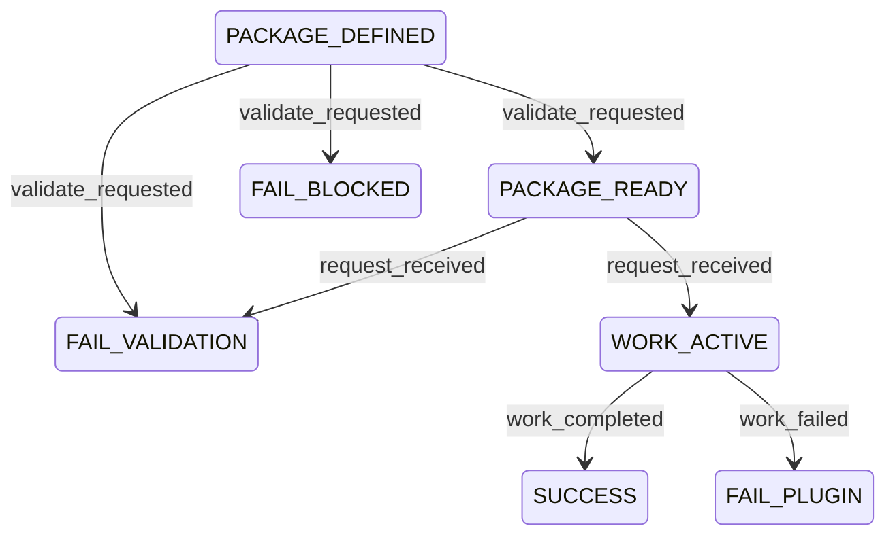

# compound-engineering-router Operational Spec

## Table of Contents
- [Scope](#scope)
- [Plugin Contract](#plugin-contract)
- [Metadata](#metadata)
- [Plugin Registry](#plugin-registry)
- [Capability Map](#capability-map)
- [Idempotency](#idempotency)
- [Invariants](#invariants)
- [Transition Table](#transition-table)
- [Diagram](#diagram)
- [Dry-Run Simulation](#dry-run-simulation)
- [Transition Tracing](#transition-tracing)
- [Logs](#logs)

## Scope
Operational spec for the packaged `compound-engineering-router` plugin. The package exposes a single plugin-owned skill that routes compound-engineering requests to the correct packaged CE skill or workflow-support meta-mode.


## Plugin Contract
```yaml
plugin_id: compound-engineering-router
capabilities:
  - package_validate
  - route_request
  - skill_dispatch
result_status:
  - SUCCESS
  - FAILURE
  - RETRYABLE
errors:
  - VALIDATION_ERROR
  - BLOCKED_DEPENDENCY
  - POLICY_FAIL
  - SYSTEM_ERROR
  - PLUGIN_TIMEOUT
  - PLUGIN_FAILURE
```

## Metadata
```yaml
metadata:
  owner: "Jamie Craik"
  max_duration: "validation <= 30s; routed skill work depends on the selected route"
  escalation: "escalate when package surfaces drift, the route is ambiguous, or target packaged CE skill assets are missing"
  plugin_scope:
    - package_validation
    - compound_workflow_routing
    - plugin_owned_skill_dispatch
```

## Plugin Registry
```yaml
plugin_registry:
  compound-engineering-router:
    plugin_id: compound-engineering-router
    capabilities:
      - package_validate
      - route_request
      - skill_dispatch
```

## Capability Map
```yaml
capability_map:
  package_validate:
    plugin_id: compound-engineering-router
    description: "Validate the manifest, package docs, marketplace entry, and plugin-owned skill surface."
  route_request:
    plugin_id: compound-engineering-router
    description: "Resolve a workflow-routing request into the correct packaged CE route or meta-mode."
  skill_dispatch:
    plugin_id: compound-engineering-router
    description: "Dispatch the packaged compound-engineering-router skill once the package is valid."
```

## Idempotency
- validation is idempotent for unchanged package contents.
- route selection is deterministic for the same `(S,E,G)` tuple.
- repeated skill dispatch should preserve the same route result when inputs and target repo context are unchanged.

## Invariants
- failure states are terminal.
- success state is terminal.
- `.codex-plugin/plugin.json`, `README.md`, `references/operational-spec.md`, and `skills/compound-engineering-router/SKILL.md` must remain present.
- packaged route logic must continue to point to verified packaged CE skill paths and explicit no-prompt-path notes for meta-modes.
- UI-first routing must remain folded into packaged `spec` and `plan` guidance rather than restoring a standalone `ui-workflow` route.

## Transition Table
| S | E | G | A | P | R | N |
| --- | --- | --- | --- | --- | --- | --- |
| PACKAGE_DEFINED | validate_requested | required package files and skill surfaces exist | validate package contract and plugin-owned skill bundle | `compound-engineering-router.package_validate` | SUCCESS | PACKAGE_READY |
| PACKAGE_DEFINED | validate_requested | required package files or skill surfaces are missing | record package validation failure | `compound-engineering-router.package_validate` | FAILURE:VALIDATION_ERROR | FAIL_VALIDATION |
| PACKAGE_DEFINED | validate_requested | validation dependencies are unavailable | record blocked validation dependency | `compound-engineering-router.package_validate` | FAILURE:BLOCKED_DEPENDENCY | FAIL_BLOCKED |
| PACKAGE_READY | request_received | request resolves to the packaged router skill | dispatch packaged router skill | `compound-engineering-router.skill_dispatch` | SUCCESS | WORK_ACTIVE |
| PACKAGE_READY | request_received | request does not resolve to the packaged router skill | record route validation failure | `compound-engineering-router.route_request` | FAILURE:VALIDATION_ERROR | FAIL_VALIDATION |
| WORK_ACTIVE | work_completed | router skill returns a route or meta-mode brief without plugin error | finalize result | `compound-engineering-router.skill_dispatch` | SUCCESS | SUCCESS |
| WORK_ACTIVE | work_failed | router skill fails or times out | record runtime failure | `compound-engineering-router.skill_dispatch` | FAILURE:PLUGIN_FAILURE | FAIL_PLUGIN |

## Diagram


## Dry-Run Simulation
```text
1. Match S and E against the transition table.
2. Evaluate guards in row order.
3. Emit A, P, R, and N for the first true guard.
4. If no guard resolves true, return FAILURE:VALIDATION_ERROR to FAIL_VALIDATION.
```

## Transition Tracing
Transition code format:
- `TC::<from_state>::<event>::<to_state>`

## Logs
```yaml
logs:
  workflow_id: "<uuid>"
  plugin_id: "compound-engineering-router"
  capability: "<capability name>"
  transition_code: "TC::<from_state>::<event>::<to_state>"
  from_state: "<state>"
  to_state: "<state>"
  correlation_id: "<trace or request id>"
  result: "SUCCESS | FAILURE:<error> | RETRYABLE:<error>"
```
