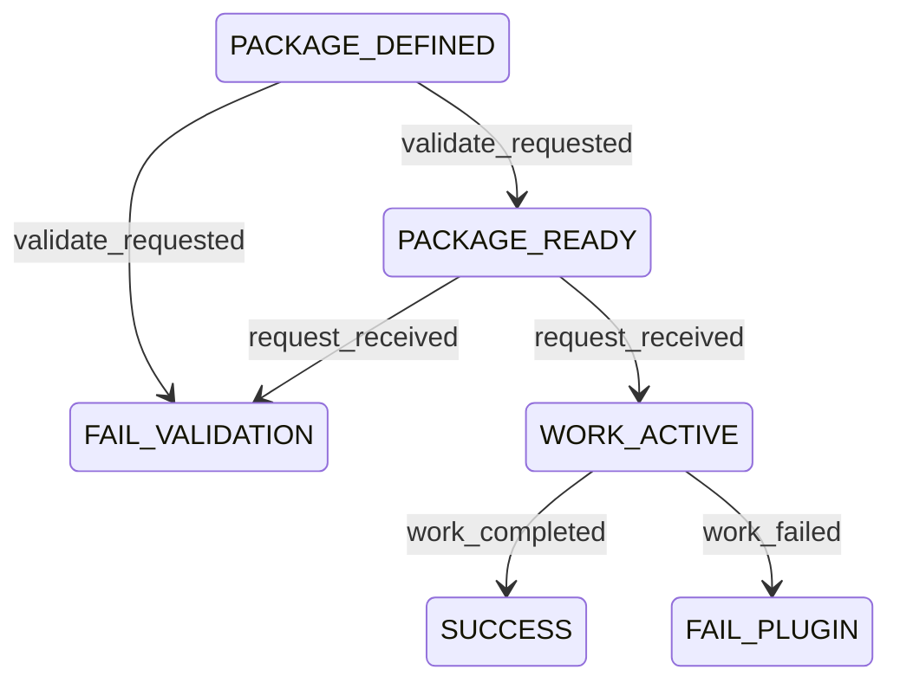

# arscontexta-codex Operational Spec

## Table of Contents
- [Scope](#scope)
- [Plugin Contract](#plugin-contract)
- [Metadata](#metadata)
- [Plugin Registry](#plugin-registry)
- [Capability Map](#capability-map)
- [Idempotency](#idempotency)
- [Invariants](#invariants)
- [Transition Table](#transition-table)
- [Diagram](#diagram)
- [Dry-Run Simulation](#dry-run-simulation)
- [Transition Tracing](#transition-tracing)
- [Logs](#logs)

## Scope
Fixture operational spec used to validate that `plugin-builder` emits and checks `references/operational-spec.md`.

## Plugin Contract
```yaml
plugin_id: arscontexta-codex
capabilities:
  - package_validate
  - route_request
  - skill_dispatch
result_status:
  - SUCCESS
  - FAILURE
  - RETRYABLE
errors:
  - VALIDATION_ERROR
  - BLOCKED_DEPENDENCY
  - POLICY_FAIL
  - SYSTEM_ERROR
  - PLUGIN_TIMEOUT
  - PLUGIN_FAILURE
```

## Metadata
```yaml
metadata:
  owner: fixture
  max_duration: "validation <= 30s"
  escalation: "escalate on fixture contract drift"
  plugin_scope:
    - fixture_validation
    - fixture_routing
```

## Plugin Registry
```yaml
plugin_registry:
  arscontexta-codex:
    plugin_id: arscontexta-codex
    capabilities:
      - package_validate
      - route_request
      - skill_dispatch
```

## Capability Map
```yaml
capability_map:
  package_validate:
    plugin_id: arscontexta-codex
    description: "Validate fixture package surfaces."
  route_request:
    plugin_id: arscontexta-codex
    description: "Route the fixture request to the packaged skill."
  skill_dispatch:
    plugin_id: arscontexta-codex
    description: "Dispatch the packaged fixture skill."
```

## Idempotency
- validation is idempotent for unchanged fixture contents.
- routing is deterministic for the same `(S,E,G)` tuple.

## Invariants
- failure states are terminal.
- success state is terminal.
- `references/operational-spec.md` must remain present.

## Transition Table
| S | E | G | A | P | R | N |
| --- | --- | --- | --- | --- | --- | --- |
| PACKAGE_DEFINED | validate_requested | required fixture files exist | validate fixture package | `arscontexta-codex.package_validate` | SUCCESS | PACKAGE_READY |
| PACKAGE_DEFINED | validate_requested | required fixture files are missing | record fixture validation failure | `arscontexta-codex.package_validate` | FAILURE:VALIDATION_ERROR | FAIL_VALIDATION |
| PACKAGE_READY | request_received | request resolves to the fixture skill | dispatch fixture skill | `arscontexta-codex.skill_dispatch` | SUCCESS | WORK_ACTIVE |
| PACKAGE_READY | request_received | request does not resolve to the fixture skill | record fixture routing failure | `arscontexta-codex.route_request` | FAILURE:VALIDATION_ERROR | FAIL_VALIDATION |
| WORK_ACTIVE | work_completed | fixture skill completes without plugin error | finalize fixture result | `arscontexta-codex.skill_dispatch` | SUCCESS | SUCCESS |
| WORK_ACTIVE | work_failed | fixture skill fails or times out | record fixture runtime failure | `arscontexta-codex.skill_dispatch` | FAILURE:PLUGIN_FAILURE | FAIL_PLUGIN |

## Diagram


## Dry-Run Simulation
```text
1. Match S and E against the transition table.
2. Evaluate guards in row order.
3. Emit A, P, R, and N for the first true guard.
4. If no guard resolves true, return FAILURE:VALIDATION_ERROR to FAIL_VALIDATION.
```

## Transition Tracing
Transition code format:
- `TC::<from_state>::<event>::<to_state>`

## Logs
```yaml
logs:
  workflow_id: "<uuid>"
  plugin_id: "arscontexta-codex"
  capability: "<capability name>"
  transition_code: "TC::<from_state>::<event>::<to_state>"
  from_state: "<state>"
  to_state: "<state>"
  correlation_id: "<trace or request id>"
  result: "SUCCESS | FAILURE:<error> | RETRYABLE:<error>"
```
