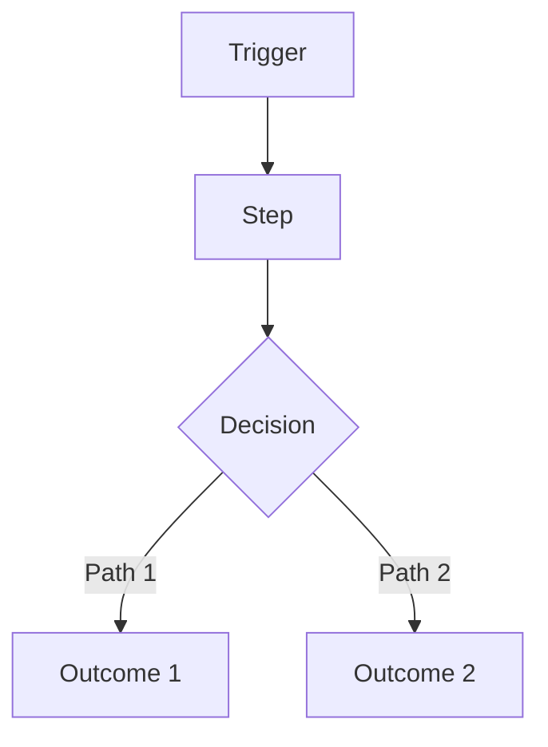
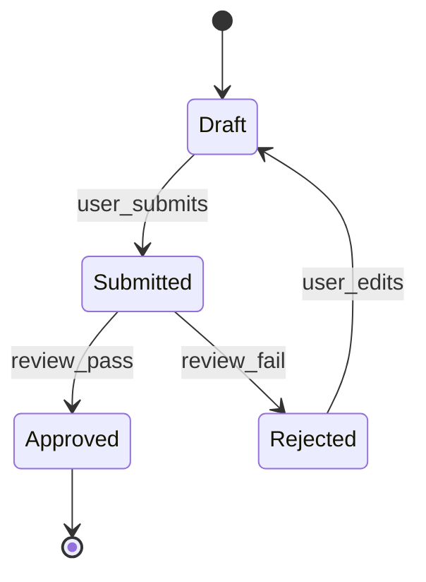

# PRD: <Product / Feature Name>

**Owner:** <name>  
**Status:** Draft | In Review | Approved  
**Last updated:** YYYY-MM-DD  
**Stakeholders:** <names/roles>  
**Links:** Repo/Issue | Design file | Tech Spec | Analytics dashboard | Support threads  

> Rule: If a section is not applicable, write `N/A` and explain why in 1–2 lines.

---

## 0) PRD Summary
- **One-liner:** <what we’re building + for whom>
- **Why now:** <why this matters now>
- **Desired outcome:** <measurable outcome in plain English>

---

## 1) Executive Summary
Write 2–3 short paragraphs that cover:
- The user problem/opportunity
- The intended change
- Why it matters (value)
- How we’ll measure success (high level)
- What is explicitly *not* being tackled (high level)

---

## 2) Problem Statement / Opportunity

### 2.1 Problem
- **Who is affected:** <persona/segment>
- **Pain today:** <what’s broken/slow/risky>
- **Current workaround:** <how they cope today>
- **Impact if we do nothing:** <cost/churn/risk/time>

### 2.2 Evidence (required)
List concrete evidence that the problem is real:
- <support tickets / logs / survey results / interviews>
- <metrics (rates, counts, drop-offs)>
- <quotes (with link/source)>

### 2.3 Opportunity
- **What improves if solved:** <outcome delta>
- **Why we’re well-positioned:** <distribution/insight/technical leverage>

---

## 3) Target Users / Personas
> Personas must be specific. Each persona should have real context + pain.

| Persona | Role | Context | Goals | Pain points |
|---|---|---|---|---|
| <Name> | <Role> | <When/where they use it> | <goal phrases> | <pain phrases> |
| <Name> | <Role> | <When/where they use it> | <goal phrases> | <pain phrases> |

**Primary user(s):** <persona(s)>  
**Secondary user(s):** <persona(s) or N/A>  

---

## 4) User Stories / Use Cases

### 4.1 Core user stories (MVP)
> Format must be: **As a [persona], I want [action] so that [benefit].**

1) **Story:** As a <persona>, I want <action> so that <benefit>.  
   **Acceptance criteria:**
   - [ ] <observable behavior>
   - [ ] <observable behavior>
   **Priority:** Must | Should | Could  
   **Notes:** <constraints, policy, permissions in product terms>

2) **Story:** As a <persona>, I want <action> so that <benefit>.  
   **Acceptance criteria:**
   - [ ] <observable behavior>
   - [ ] <observable behavior>
   **Priority:** Must | Should | Could

### 4.2 Use case narratives (recommended)
Write 1–3 short narratives:
- **Use case A:** Trigger → Steps → Outcome  
- **Use case B:** Trigger → Steps → Outcome  

---

## 5) Functional Requirements
> Group by user journey. Keep requirements testable and user-visible.

### Journey: <Name>
- FR-1: <requirement> (Priority: Must/Should/Could)
- FR-2: <requirement>
- FR-3: <requirement>

### Edge cases & failure UX (required)
- If <condition>, then the user sees/does: <behavior>
- If <condition>, then the user sees/does: <behavior>
- If <condition>, then the user sees/does: <behavior>

---

## 6) Non-Functional Requirements
> High-level requirements only. No architecture/database/framework choices here.

- **Performance:** <expectations; only numbers if you have them, otherwise "N/A">
- **Reliability:** <availability or degraded mode expectations>
- **Security & privacy:** <data sensitivity; access expectations; audit needs>
- **Compliance:** <PCI/PHI/GDPR/etc or N/A>
- **Accessibility:** <minimum bar; e.g., WCAG target or "N/A">
- **Observability expectation:** <what must be measurable from product POV>

---

## 7) Success Metrics / KPIs
> Every metric needs a target and a measurement method.

| Metric | Target | Measurement method | Source |
|---|---:|---|---|
| <Metric> | <#/%> | <how measured> | <event/dashboard> |
| <Metric> | <#/%> | <how measured> | <event/dashboard> |

**Measurement window:** <e.g., 7 days post-launch, 30 days post-launch>  

### Guardrails (required)
- <metric that must not regress>
- <metric that must not regress>

---

## 8) Scope

### In scope
- <bullet>
- <bullet>

### Out of scope (required)
- <bullet>
- <bullet>

### Non-goals (recommended)
- <explicitly not doing>
- <explicitly not doing>

---

## 9) Dependencies
### Internal
- <teams/systems>

### External
- <vendors/APIs>

### Assumptions about dependencies (required)
- <assumption that must hold>
- <assumption that must hold>

---

## 10) Risks and Mitigations
| Risk | Likelihood | Impact | Mitigation |
|---|---|---|---|
| <risk> | Low/Med/High | Low/Med/High | <mitigation/fallback> |
| <risk> | Low/Med/High | Low/Med/High | <mitigation/fallback> |

---

## 11) Timeline / Milestones (optional)
> If N/A, state why.

| Milestone | Date | Notes |
|---|---|---|
| <M1> | YYYY-MM-DD | <short> |
| <M2> | YYYY-MM-DD | <short> |

---

## 12) Diagrams & Clarity Checks (recommended)

### 12.1 User journey flow (Mermaid)

### 12.2 State model (Mermaid)

> Include for user-facing lifecycles with multiple states (e.g., onboarding, verification, subscription states, order lifecycle).

---

## 13) Assumptions & Open Questions (required)

### Assumptions

* A-1: <assumption>
* A-2: <assumption>

### Open questions

* Q-1: <question> (Owner: <name>, Due: YYYY-MM-DD)
* Q-2: <question> (Owner: <name>, Due: YYYY-MM-DD)

---

## 14) PRD Integrity Rule (required)

* This PRD defines **WHAT / WHY / WHO**.
* It must **not** prescribe technical implementation details (databases, frameworks, service topology, specific libraries, etc.).
* If any technical detail seems unavoidable, move it to the Tech Spec and reference it from here.

---

## 15) PRD Review Checklist (required)

* [ ] Problem statement is clear and evidence-backed
* [ ] Personas are specific and pains are real
* [ ] Stories follow “As a… I want… so that…”
* [ ] Acceptance criteria are observable/testable
* [ ] Success metrics have numeric targets + measurement method
* [ ] Scope includes explicit OUT
* [ ] Dependencies listed with assumptions
* [ ] Risks are realistic and mitigations exist
* [ ] No technical implementation details
