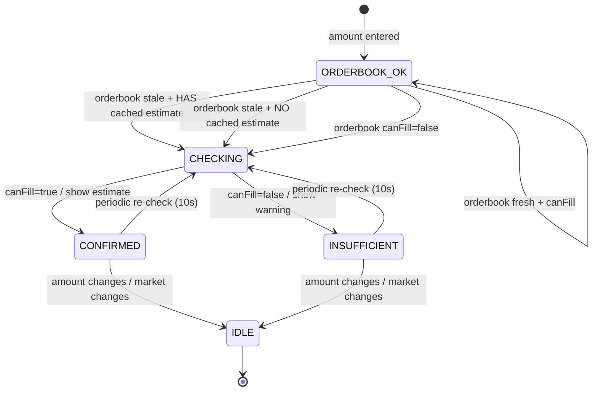

# Product Manager Skill

Purpose: Produce a complete PRD or technical specification (tech) for any idea, ready for implementation, using interview-driven discovery, rigorous critique, and visual artifacts.

## Triggers (when Codex should use this skill)
- User asks for PRD, technical spec/architecture doc, software design steps, product requirements, or “take an idea to production”.
- User mentions interview mode, spec debate, or wants structured requirements.

## Core Workflow
1) **Gather inputs (Step 0)**  
   - Ask: document type (`PRD` or `tech`).  
   - Ask: starting point (existing file path vs fresh concept). If path provided, read it first and confirm it has content.  
   - Offer interview mode: “Run in-depth interview before drafting?” (recommended).
   - If the user already asks for a PRD/tech spec and provides any context, be ready to draft immediately with explicit assumptions instead of waiting for replies.
   - Mode selection (required):  
     1) **Create** — draft PRD and/or Tech Spec from an idea or existing docs.  
     2) **Review** — audit an existing project/repo to reconstruct vision, assess usefulness, find product/engineering/ops gaps, realign, and output an action plan + updated PRD/Tech Spec/ADRs.
   - For review mode, ask for: repo path or key files; existing PRD/tech spec/roadmap; what is shipped vs WIP; available evidence (metrics, feedback, tickets); constraints (time/budget/non-negotiables).

2) **Interview mode (Step 0.5, if chosen)**  
   - First response must include an explicit `AskUserQuestion:` prompt block plus a starter scaffold showing required section headings (PRD: “User Stories”, “Risks and Mitigations”; Tech: include “API Design”, “Data Models”, “Security Considerations”, “Deployment Strategy”, “User Stories”, “Risks and Mitigations”) populated with assumption placeholders (no TODOs).  
   - Use `AskUserQuestion` in multiple passes; do not accept shallow answers.  
   - Cover all domains listed in `references/interview-guide.md` (problem/context, users, functional flow & edge cases, constraints, UX, tradeoffs, risks, success criteria).  
   - If a source doc was provided, base questions on its gaps/ambiguities.  
   - Synthesize answers; note explicit assumptions.

3) **Initial draft (Step 1)**  
   - If file provided, start from it.  
   - If no file and the prompt describes what to build (even briefly), draft immediately in the same response; add a short **Assumptions** list and note where confirmation is needed.  
   - If the prompt is very sparse, ask up to 2–3 clarifiers inline, then still deliver a full draft in the same message based on explicit assumptions.  
   - Draft the full document using the appropriate template from `references/PRD_TEMPLATE.md` (or `references/PRD_TEMPLATE_MINI.md` for speed) or `references/TECH_SPEC_TEMPLATE.md`. Populate every section; include assumptions and placeholder metrics when unknown.  
   - RNIA rule: sections are required unless not applicable; if N/A, keep the heading and add a one-liner why.
   - Embed Mermaid diagrams (and PlantUML if useful) for system architecture, key flows, and component state models. Place under “Component Behavior / State Model” or relevant section. Include the code block even if rendering is external.  
   - Present the draft wrapped in `[SPEC] ... [/SPEC]` and ask: “Does this capture intent? Changes before adversarial review?”

4) **Adversarial debate (Step 2–4)**  
   - If user provides opponent models, run rounds until all say `[AGREE]`. Otherwise use role-based reviewer passes in this order:  
     1) PM (scope/metrics/personas/viability)  
     2) UI/UX Designer (flows, error/empty states, accessibility, IA, copy)  
     3) Frontend Engineer (client state, loading/error handling, perf budgets, API integration)  
     4) API Engineer (resource model, schemas, versioning, idempotency, pagination, errors)  
     5) Backend Engineer (data model, indexes/constraints, concurrency, jobs, failure modes)  
     6) Security (authN/authZ, encryption, input validation, abuse cases)  
     7) Reliability/SRE (timeouts/retries, rollback, observability, SLO/error budget policy)  
     8) Cost/Scale (hot paths, data growth, caching, capacity planning)  
   - A persona may only `[AGREE]` once all ERROR findings for that persona are resolved.  
   - Apply critique criteria:  
     - **PRD**: clear problem evidence; real personas; user stories “As a … I want … so that …”; measurable success metrics; explicit in/out scope; realistic risks; no implementation detail.  
     - **Tech**: architecture decisions + rationale; complete API contracts (method, path, request/response schemas, error codes); data models with types/constraints/indexes/relationships; security (authz/authn/encryption/validation); enumerated error handling; specific performance targets; repeatable/reversible deploy; SLO/error budget + policy.  
     - **Review mode**: vision reconstructed; evidence captured; product/engineering/ops gaps enumerated; viability assessed; realignment plan with next-14-day actions and “done when” criteria.  
   - If gaps remain, return to interview-style questioning, then revise and debate again.

5) **Finalize (Step 5)**  
   - Quality gate: completeness (all sections substantive), consistency, clarity, actionability.  
   - PRD specifics: 2–3 para executive summary; personas with names/roles/goals/pain points; every story in correct format; metrics with numeric targets + measurement method; explicit out-of-scope list.  
   - Tech specifics: architecture diagram/description covers all components; every API endpoint has method/path/schemas/errors; data models detail fields + constraints + indexes; security covers authN/Z + encryption + input validation; performance includes latency/throughput/availability; deployment repeatable & rollback-able; observability plan; SLOs/error budget + policy.  
   - Review mode specifics: Project Review Report produced; checklist passed; realignment plan + top actions listed; follow-ups to update PRD/Tech Spec/ADRs noted.  
   - Run production gates before `[AGREE]` when shipping: ORR checklist, Launch checklist, SLO template (or N/A with reason).  
   - When satisfied and all models said `[AGREE]`, write the document to `spec-output.md` (or `PROJECT_REVIEW_REPORT.md` for review mode) and print it. Add final summary block:  
      ```
      === Debate Complete ===
      Document: [PRD | Technical Specification]
     Rounds: <N> (or include cycles if >1)
     Models: <list>
     Key refinements: - <bullets>
     ```

6) **User review (Step 6)**  
   - Offer options: accept as-is; request changes; run another debate cycle (can reuse or change models). Apply changes, rewrite `spec-output.md`, and repeat summary. Track cycle count if >1.

7) **PRD → Tech Spec continuation (Step 8, optional)**  
   - If PRD finalized, ask if they want to proceed to a tech spec using the PRD as input; rerun workflow.

8) **Delivery with RALPH loop (Step 9, optional but recommended for implementation)**  
   - After a PRD and/or Tech Spec is finalized, offer: “Would you like to generate a RALPH implementation harness (pin/plan/tasks) and run the RALPH loop to deliver incrementally?”  
   - If yes:  
     1) **Scaffold the RALPH harness** (if not present in repo):  
        - `scripts/ralph/ralph-codex.sh`  
        - `scripts/ralph/prompt.md`  
        - `.ralph/pin.md`  
        - `.ralph/plan.md`  
        - `.ralph/guardrails.md`  
        - `.ralph/progress.md`  
        - `RALPH_TASK.md`  
        - optional `prd.json` (preferred when PRD exists)  
        - If `scripts/ralph/ralph-codex.sh` is missing, copy the harness from `assets/ralph/` into the repo preserving paths.  
     2) **Populate `.ralph/pin.md`** from the finalized PRD/Tech Spec: goal, success definition, non-goals, constraints, repo conventions, sensitive areas, references.  
     3) **Choose RALPH task mode**:  
        - If PRD exists: generate `prd.json` from PRD user stories + acceptance criteria (preferred).  
          - Use `assets/ralph/scripts/generate-prd-json-from-prd.py` to convert `spec-output.md` into `prd.json`.  
        - If no PRD or work is primarily refactor/infra: use checkbox mode in `RALPH_TASK.md`.  
     4) **Wire quality gates into RALPH**:  
        - Set `lint_command` (frontmatter in `RALPH_TASK.md` or `lintCommand` in `prd.json`) to:  
          `./scripts/run-quality-gates.sh spec-output.md tech-spec-output.md && ./scripts/check-brand-signature.sh`  
        - Optionally include tests/typecheck commands if repo has them.  
     5) **Branch requirement (mandatory)**:  
        - Always create/switch to a new branch named `ralph` before starting the loop.  
        - If `ralph` already exists, preserve it by renaming to an archive branch, then create a fresh `ralph`.  
        - Branch policy snippet:  
          ```bash
          if git show-ref --verify --quiet refs/heads/ralph; then
            git branch -m ralph "ralph-archive-$(date +%Y%m%d-%H%M%S)"
          fi
          git checkout -b ralph
          ```  
     6) **Run the loop (attended first)**:  
        - `chmod +x scripts/ralph/ralph-codex.sh`  
        - `./scripts/ralph/ralph-codex.sh --branch ralph -a on-request -s workspace-write`  
        - Once stable: `-a never`

## Visuals & assets
- Default to Mermaid for system/sequence/state diagrams; PlantUML acceptable.  
- Always embed Mermaid source in the doc; if rendering is unavailable, keep the code blocks and note optional export (e.g., via `mermaid-cli`/Kroki) to `assets/diagram.png`.  
- State diagrams: generate for every stateful component or user-facing workflow with ≥3 states; include start/end states, triggers, failures/timeouts, and invariants. Avoid forcing state machines for stateless components—use flowcharts or sequence diagrams instead.  
- State machine style (must match the provided reference diagram aesthetic): keep a single vertical spine for the main happy path, branch alternates to the sides, label every transition with the trigger/guard, and show timing hooks (e.g., periodic re-check). Use uppercase state names, concise trigger labels, and avoid crossing lines. Example:



- Export requirement: after drafting diagrams, produce an artifact via Mermaid CLI for review/sharing: `npm install -g @mermaid-js/mermaid-cli` then `mmdc -i diagram.mmd -o diagram.png --theme dark --scale 1.5 --backgroundColor '#111827'` (adjust input/output names as needed). Keep the Mermaid source in the doc even after exporting.
- Keep diagrams aligned with described flows and components; update when requirements change.

## Quality, safety, and standards
- Check against GOLD Industry Standards guide in `~/.codex/AGENTS.override.md` plus `instructions/standards.md` and `instructions/engineering-guidance.md`.  
- Ensure security/privacy, accessibility, performance/scalability, reliability, and governance considerations are addressed explicitly.  
- Document assumptions; mark experimental choices with risks and mitigations.  
- Redact or exclude secrets/PII by default in questions, drafts, diagrams, and outputs.

## Safety & Redaction
- Reject/strip secrets, credentials, tokens, or personal data from inputs and outputs.  
- Avoid persisting sensitive info; do not embed secrets in diagrams or file paths.  
- When unsure if data is sensitive, treat it as sensitive and ask for redaction/confirmation.

## References (open only when needed)
- `references/interview-guide.md` — full interview question set.  
- `references/PRD_TEMPLATE.md` — PRD structure + prompts + diagram slots.  
- `references/PRD_TEMPLATE_MINI.md` — compact PRD template (checklist-compliant).  
- `references/TECH_SPEC_TEMPLATE.md` — Tech spec structure + prompts + diagram slots.  
- `references/PRD_CHECKLIST.md` — PRD quality gate (RNIA enforced).  
- `references/TECH_SPEC_CHECKLIST.md` — Tech spec quality gate (RNIA enforced).  
- `references/ORR_CHECKLIST.md` — operational readiness review gate.  
- `references/LAUNCH_CHECKLIST.md` — launch readiness gate.  
- `references/SLO_TEMPLATE.md` — minimal SLO + error budget pattern.  
- `references/PROJECT_REVIEW_REPORT_TEMPLATE.md` — use in review mode.  
- `references/PROJECT_REVIEW_CHECKLIST.md` — review quality gate.  
- `references/STYLE_GUIDE.md` — writing standards for PRDs/specs/reviews.  
- `references/ADR_TEMPLATE.md` — capture key decisions.  
- `scripts/render-diagrams.sh` — render Mermaid blocks to PNG when needed.  
- `scripts/spec-lint.py` — lint specs for required sections, stories, metrics, state machines.  
- `scripts/validate-mermaid.sh` — compile Mermaid diagrams to catch errors.  
- `scripts/run-quality-gates.sh` — run lint + mermaid + optional Vale.  
- `scripts/collect-project-context.sh` — gather repo context for review mode.  
- `scripts/check-brand-signature.sh` — enforce BrAInwav signature on README.  
- `.vale.ini` and `styles/brAInwav/*` — Vale rules for prose, user stories, N/A handling, anti-hype.  
- `assets/ralph/**` — RALPH loop harness templates to scaffold into repos.  
- `.ralph/pin.md` — RALPH spec anchor in the repo.  
- `.ralph/plan.md` — small, linkage-oriented implementation plan.  
- `.ralph/guardrails.md` — “Signs” learned from failures.  
- `.ralph/progress.md` — append-only loop log.  
- `RALPH_TASK.md` — checkbox mode task definition + quality commands.  
- `prd.json` / `prd.json.example` — PRD-mode story list for loop execution.  
- `scripts/ralph/ralph-codex.sh` — loop runner (Codex exec).  
- `scripts/ralph/prompt.md` — repo-specific conventions for the loop.
- `assets/ralph/scripts/generate-prd-json-from-prd.py` — PRD markdown to `prd.json` converter.

## Philosophy
- Evidence-led: clarify problem/users/metrics before solutioning; debate until consensus `[AGREE]`.
- Interview-first when uncertain; make assumptions explicit and testable.
- Visual-first: diagrams-as-code to prevent ambiguity.
- Safety-first: default to least privilege, avoid secrets, and redact sensitive info in prompts/outputs.

## Inputs
- User-chosen document type (`PRD` or `tech`).
- Starting point: file path to existing spec or new concept description.
- Optional: focus areas (security, scalability, performance, ux, reliability, cost), opponent models, interview mode preference.
- All inputs must exclude secrets/PII; redact if present.

## Outputs
- Complete PRD or technical spec following templates, with Mermaid/PlantUML diagrams inline.
- Saved to `spec-output.md` and printed with debate summary.
- Include a top-level metadata block with `schema_version: 1` (increment if breaking changes to the document contract occur).
- Explicit assumptions, risks, and out-of-scope items called out.

## Validation
- Run `public/skills/skill-creator/.venv/bin/python public/skills/skill-creator/scripts/quick_validate.py skills/product-manager`.
- Run `public/skills/skill-creator/.venv/bin/python public/skills/skill-creator/scripts/skill_gate.py skills/product-manager` to enforce contract/eval presence and section checks.
- Self-review against gold standards, critique criteria, and completeness checklist before `[AGREE]`; fail fast on any missing mandatory section or redaction gap.

## Anti-patterns
- Skipping sections or leaving placeholders without assumptions.
- Accepting vague user stories (missing “so that” benefit) or metrics without targets.
- Omitting security/privacy or accessibility requirements.
- Removing unconventional but intentional choices without justification; instead, add safeguards and rationale.
- Forcing state machines on stateless components; prefer flow/sequence diagrams when state is trivial.
- Shipping without an explicit rollout/kill-switch plan for risky changes (AI, payments, auth).
- Conflating PRD and tech spec: keep product intent separate from implementation details.
- Reusing stale metrics or personas across projects without revalidation.
- Silent scope changes without updating assumptions, risks, and out-of-scope lists.

## Examples
- “Draft a PRD for a mobile habit-tracking app; include user stories, metrics, and risks.”
- “Create a technical spec for a CSV ingest API with dashboards; include APIs, data model, and rollout.”
- “Interview me first, then write the PRD for a B2B onboarding flow.”

## Variation
- Vary document depth based on product stage: discovery (brief, assumption-heavy), validate (metrics/experiments emphasized), build (full tech spec, APIs, data models).
- Vary diagram types by need: stateDiagram-v2 for stateful workflows; sequence for request/response; flowchart for simple user paths.
- Adjust tone for audience: exec/stakeholder summaries concise; engineering sections detailed and unambiguous.
- Vary structure, personas, and examples per domain; avoid reusing the same ordering, labels, or sample stories across different specs.
- Avoid repeating the same default personas; create role-appropriate personas that map to the current product domain.

## Empowerment
- Make decisions explicit: state chosen options, rejected alternatives, and rationale.
- Highlight owner and DRI for each risk/assumption and each open question.
- Encourage small, testable slices with graduation criteria before full rollout.
- Offer two to three concrete next-step choices at each review gate (accept, revise, or debate again) and ask the user to pick one.
- Ask for prioritization when scope is broad; propose a default ordering and let the user approve or reorder it.
