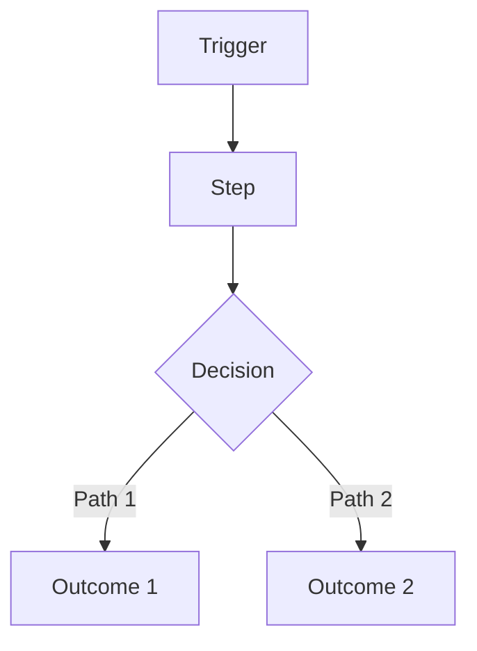
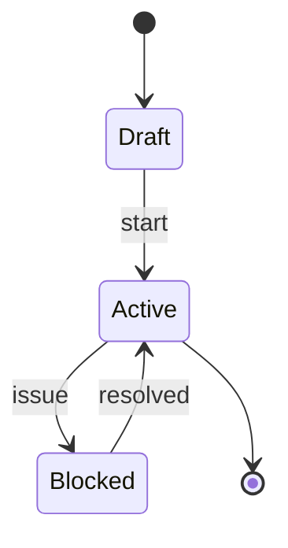

# PRD (Mini): <Product / Feature Name>

**Owner:** <name>  
**Status:** Draft | In Review | Approved  
**Last updated:** YYYY-MM-DD  
**Stakeholders:** <names/roles>  
**Links:** Repo/Issue | Design file | Tech Spec | Analytics dashboard | Support threads  

> Rule: If a section is not applicable, write `N/A` and explain why in 1–2 lines.

---

## 0) One‑screen summary
- **One-liner:** <what we’re building + for whom>
- **Why now:** <why this matters now>
- **Expected outcome:** <measurable outcome in plain English>

---

## 1) Problem / Opportunity (with evidence)
- **Problem:** <what’s broken / missing / expensive / risky>
- **Who feels it most:** <primary persona>
- **Current workaround:** <how they cope today>
- **Evidence (required):**
  - <metric / support thread / user quote>
  - <metric / support thread / user quote>
- **If we do nothing:** <impact: time/cost/churn/risk>

---

## 2) Target Users / Personas
| Persona | Role | Context | Goals | Pain points |
|---|---|---|---|---|
| <Name> | <Role> | <where/when> | <goal phrases> | <pain phrases> |
| <Name> | <Role> | <where/when> | <goal phrases> | <pain phrases> |

**Primary:** <persona>  
**Secondary:** <persona or N/A>  

---

## 3) User Stories (MVP)
> Format must be: **As a [persona], I want [action] so that [benefit].**

1) **Story:** As a <persona>, I want <action> so that <benefit>.  
   **Acceptance criteria:**
   - [ ] <observable behavior>
   - [ ] <observable behavior>
   **Priority:** Must | Should | Could  

2) **Story:** As a <persona>, I want <action> so that <benefit>.  
   **Acceptance criteria:**
   - [ ] <observable behavior>
   - [ ] <observable behavior>
   **Priority:** Must | Should | Could  

3) **Story:** As a <persona>, I want <action> so that <benefit>.  
   **Acceptance criteria:**
   - [ ] <observable behavior>
   - [ ] <observable behavior>
   **Priority:** Must | Should | Could  

---

## 4) Functional Requirements (testable)
- FR-1: <requirement> (Must/Should/Could)
- FR-2: <requirement>
- FR-3: <requirement>

### Edge cases & failure UX (required)
- If <condition>, then the user sees/does: <behavior>
- If <condition>, then the user sees/does: <behavior>
- If <condition>, then the user sees/does: <behavior>

---

## 5) Non‑Functional Requirements (high level only)
- **Performance:** <expectations or N/A>
- **Reliability:** <expectations or N/A>
- **Security & privacy:** <data sensitivity + access expectations>
- **Compliance:** <PCI/PHI/GDPR/etc or N/A>
- **Accessibility:** <minimum bar or N/A>
- **Observability expectation:** <what must be measurable>

---

## 6) Success Metrics / KPIs
| Metric | Target | Measurement method | Source |
|---|---:|---|---|
| <Metric> | <#/%> | <how measured> | <event/dashboard> |
| <Metric> | <#/%> | <how measured> | <event/dashboard> |

**Measurement window:** <e.g., 7/30 days post-launch>  

### Guardrails (required)
- <metric that must not regress>
- <metric that must not regress>

---

## 7) Scope
### In scope
- <bullet>
- <bullet>

### Out of scope (required)
- <bullet>
- <bullet>

### Non‑goals (recommended)
- <explicitly not doing>
- <explicitly not doing>

---

## 8) Dependencies
- **Internal:** <teams/systems or N/A>
- **External:** <vendors/APIs or N/A>
- **Assumptions (required):**
  - <assumption that must hold>
  - <assumption that must hold>

---

## 9) Risks & Mitigations
- Risk: <risk>  
  - Likelihood: Low/Med/High  
  - Impact: Low/Med/High  
  - Mitigation: <mitigation/fallback>

- Risk: <risk>  
  - Likelihood: Low/Med/High  
  - Impact: Low/Med/High  
  - Mitigation: <mitigation/fallback>

---

## 10) Timeline / Milestones (optional)
> If N/A, state why.

- Milestone: <M1> — <YYYY-MM-DD>
- Milestone: <M2> — <YYYY-MM-DD>

---

## 11) Diagrams (recommended)
### User journey flow (Mermaid)

### User lifecycle state model (Mermaid)

---

## 12) Assumptions & Open Questions (required)

### Assumptions

* A-1: <assumption>
* A-2: <assumption>

### Open questions

* Q-1: <question> (Owner: <name>, Due: YYYY-MM-DD)
* Q-2: <question> (Owner: <name>, Due: YYYY-MM-DD)

---

## 13) PRD Integrity Rule (required)

* This PRD defines **WHAT / WHY / WHO**.
* No technical implementation details (databases, frameworks, service topology).
* Reference the Tech Spec for HOW.

---

## 14) PRD Quality Gate (required)

* [ ] Problem has evidence
* [ ] Personas are specific
* [ ] Stories follow correct format + acceptance criteria exist
* [ ] Metrics have numeric targets + measurement method
* [ ] Scope includes explicit OUT
* [ ] Dependencies and risks exist
* [ ] No implementation details
