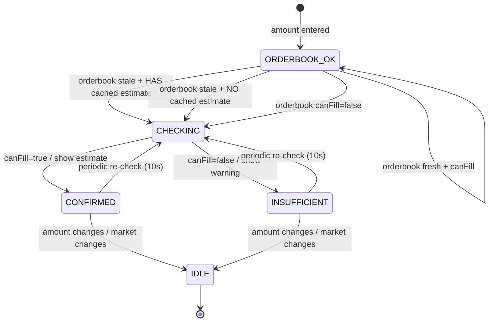

# Product Spec Skill

Purpose: Produce complete PRDs/tech specs ready for implementation, using interview-driven discovery, rigorous critique, and visual artifacts.

## Triggers (when Codex should use this skill)
- User asks for PRD, technical spec/architecture doc, software design steps, product requirements, or “take an idea to production”.
- User mentions interview mode, spec debate, or wants structured requirements.

## Core Workflow
1) **Gather inputs (Step 0)**  
   - Evidence policy (baseline): assume broad repo evidence is allowed; if no evidence found, explicitly mark **Evidence Gap**. Every paragraph should end with an `Evidence:` line (or `Evidence gap:` if none). Provide both inline evidence and a final **Evidence Map** table.  
   - Evidence sources (default): any repo files, run artifacts, and user-provided links/paths; auto-discover as needed and record gaps.  
   - Ask: document type (`PRD` or `tech`).  
   - Ask: starting point (existing file path vs fresh concept). If path provided, read it first and confirm it has content.  
   - Offer interview mode: “Run in-depth interview before drafting?” (recommended).
   - If the user already asks for a PRD/tech spec and provides any context, be ready to draft immediately with explicit assumptions instead of waiting for replies.
   - Mode selection (required):  
     1) **Create** — draft PRD and/or Tech Spec from an idea or existing docs.  
     2) **Review** — audit an existing project/repo to reconstruct vision, assess usefulness, find product/engineering/ops gaps, realign, and output findings + recommendations (no implementation). Only draft or modify PRD/Tech Spec/ADRs if the user explicitly requests it after the audit.
   - For review mode, ask for: repo path or key files; existing PRD/tech spec/roadmap; what is shipped vs WIP; available evidence (metrics, feedback, tickets); constraints (time/budget/non-negotiables).
   - **Audit discipline (default):** The audit output is findings + recommendations, not implemented fixes. Do not change code, write specs, or create new process artifacts unless explicitly asked after the audit.
   - **Documentation trap (default):** Treat new docs (e.g., `SPEC_INDEX.md`) as scope with maintenance burden. Apply the 48-hour rule and require explicit justification before adding or proposing new documentation artifacts.
   - If the user requests a UX/UI audit or heuristic review, route to `product-design-review` instead.

2) **Interview mode (Step 0.5, if chosen)**  
   - First response must include an explicit `AskUserQuestion:` prompt block plus a starter scaffold showing required section headings (PRD: “User Stories”, “Risks and Mitigations”, “Acceptance Criteria”; Tech: include “API Design”, “Data Models”, “Security Considerations”, “Deployment Strategy”, “User Stories”, “Risks and Mitigations”, “Acceptance Criteria”) populated with assumption placeholders (no TODOs).  
   - Use `AskUserQuestion` in multiple passes; do not accept shallow answers.  
   - Cover all domains listed in `references/interview-guide.md` (problem/context, users, functional flow & edge cases, constraints, UX, tradeoffs, risks, success criteria).  
   - If a source doc was provided, base questions on its gaps/ambiguities.  
   - Synthesize answers; note explicit assumptions.

3) **Initial draft (Step 1)**  
   - If file provided, start from it.  
   - If no file and the prompt describes what to build (even briefly), draft immediately in the same response; add a short **Assumptions** list and note where confirmation is needed.  
   - If the prompt is very sparse, ask up to 2–3 clarifiers inline, then still deliver a full draft in the same message based on explicit assumptions.  
   - For PRDs, write to `.spec/spec-YYYY-MM-DD-<slug>.md` (use the current date).  
   - Use `STORY-###` IDs and the acceptance-criteria checkbox format defined in `references/PRD_COMPILER_CONTRACT.md`.  
   - Draft the full document using the appropriate template from `references/PRD_TEMPLATE.md` (or `references/PRD_TEMPLATE_MINI.md` for speed) or `references/TECH_SPEC_TEMPLATE.md`. Populate every section; include assumptions and placeholder metrics when unknown.  
   - For PRDs, ensure exact section headings include: `User Stories`, `Risks and Mitigations`, `Acceptance Criteria` (top-level), `Decision Log / ADRs`, `Data Lifecycle & Retention`, `Scope`, `Feature Creep Guardrails`, `Scope Decision Log`, `Launch & Rollback Guardrails`, `Post-Launch Monitoring Plan`, `Support / Ops Impact`, `Compliance & Regulatory Review Triggers`, `Ownership & RACI`, `Security & Privacy Classification`, `Dependency SLAs & Vendor Risk`, `Cost Model & Budget Guardrails`, `Localization & Internationalization`, `Backward Compatibility & Deprecation`, `Experimentation & Feature Flags`, `Kill Criteria`, `Evidence Gaps`, `Evidence Map`.  
   - For tech specs, ensure exact section headings include: `API Design`, `Data Models`, `Security Considerations`, `Deployment Strategy`, `Acceptance Criteria` (top-level), `Decision Log / ADRs`, `Data Lifecycle & Retention`, `Scope`, `Feature Creep Guardrails`, `Scope Decision Log`, `Launch & Rollback Guardrails`, `Post-Launch Monitoring Plan`, `Support / Ops Impact`, `Compliance & Regulatory Review Triggers`, `Ownership & RACI`, `Security & Privacy Classification`, `Dependency SLAs & Vendor Risk`, `Cost Model & Budget Guardrails`, `Localization & Internationalization`, `Backward Compatibility & Deprecation`, `Experimentation & Feature Flags`, `Kill Criteria`, `Evidence Gaps`, `Evidence Map`.  
   - RNIA rule: sections are required unless not applicable; if N/A, keep the heading and add a one-liner why.
   - Evidence discipline: every paragraph should end with an `Evidence:` line or `Evidence gap:` line. Cite file paths/links; use `Evidence gap:` when no source exists. Summarize all gaps in `Evidence Gaps` and list all citations in `Evidence Map`.
   - Embed Mermaid diagrams (and PlantUML if useful) for system architecture, key flows, and component state models. Place under “Component Behavior / State Model” or relevant section. Include the code block even if rendering is external.  
   - Present the draft wrapped in `[SPEC] ... [/SPEC]` and ask: “Does this capture intent? Changes before adversarial review?”

4) **Adversarial debate (Step 2–4)**  
   - If user provides opponent models, run rounds until all say `[AGREE]`. Otherwise use adaptive personas based on repo inference from stack + dirs + README. Use `references/adversarial-review-personas.md` to select personas and ordering.  
   - Use tagged prompt blocks and strict formatting from `references/adversarial-review-prompts.md` for each persona.  
   - Default order (after selection): PM, UX, Frontend, Backend, Security, Reliability/SRE, Data/ML, Platform/Infra, QA/Test (if triggered), DevEx/Tooling (if triggered).  
   - If inference is ambiguous, include the broader set and record an Evidence gap for persona selection.  
   - A persona may only `[AGREE]` once all ERROR findings for that persona are resolved.  
   - Apply critique criteria:  
     - **PRD**: clear problem evidence; real personas; user stories “As a … I want … so that …”; measurable success metrics; explicit in/out scope; realistic risks; no implementation detail.  
     - **Tech**: architecture decisions + rationale; complete API contracts (method, path, request/response schemas, error codes); data models with types/constraints/indexes/relationships; security (authz/authn/encryption/validation); enumerated error handling; specific performance targets; repeatable/reversible deploy; SLO/error budget + policy.  
     - **Review mode**: vision reconstructed; evidence captured; product/engineering/ops gaps enumerated; viability assessed; recommendations only with next-14-day actions and “done when” criteria; no implementation.  
   - If gaps remain, return to interview-style questioning, then revise and debate again.

4.5) **Design review routing (if requested)**  
   - Use `product-design-review` for UX/UI audits, heuristic evaluations, accessibility-first reviews, onboarding/checkout critique, or end-to-end journey analysis.

5) **Finalize (Step 5)**  
   - Quality gate: completeness (all sections substantive), consistency, clarity, actionability.  
   - PRD specifics: 2–3 para executive summary; personas with names/roles/goals/pain points; every story in correct format; metrics with numeric targets + measurement method; explicit out-of-scope list; top-level `Acceptance Criteria` section present and populated; decision log/ADRs referenced; data lifecycle/retention/deletion addressed; feature creep guardrails answered with evidence; scope decision log populated; launch/rollback guardrails and go/no-go metrics defined; post-launch monitoring plan with owners and window; support/ops impact and runbook links; compliance/regulatory review triggers stated; ownership/RACI defined; security/privacy classification completed; dependency SLAs/vendor risk covered; cost model with guardrails; localization/i18n stance; backward compatibility/deprecation policy; experimentation/feature flag plan; explicit kill criteria.  
   - Tech specifics: architecture diagram/description covers all components; every API endpoint has method/path/schemas/errors; data models detail fields + constraints + indexes; security covers authN/Z + encryption + input validation; performance includes latency/throughput/availability; deployment repeatable & rollback-able; observability plan; SLOs/error budget + policy; top-level `Acceptance Criteria` section present and populated; decision log/ADRs referenced; data lifecycle/retention/deletion addressed; feature creep guardrails answered with evidence; scope decision log populated; launch/rollback guardrails and go/no-go metrics defined; post-launch monitoring plan with owners and window; support/ops impact and runbook links; compliance/regulatory review triggers stated; ownership/RACI defined; security/privacy classification completed; dependency SLAs/vendor risk covered; cost model with guardrails; localization/i18n stance; backward compatibility/deprecation policy; experimentation/feature flag plan; explicit kill criteria.  
   - Review mode specifics: Project Review Report produced; checklist passed; realignment plan + top actions listed; follow-ups to update PRD/Tech Spec/ADRs noted (only if explicitly requested after audit). Every paragraph includes `Evidence:` or `Evidence gap:`; include `Evidence Gaps` + `Evidence Map` sections.  
   - **Review artifact vs. new process (default):** The adversarial review document is evidence of the audit (like a transcript), not a new ongoing project process. Keep it, but do not introduce new mandatory processes unless the user explicitly asks.  
   - Run production gates before `[AGREE]` when shipping: ORR checklist, Launch checklist, SLO template (or N/A with reason).  
   - When satisfied and all models said `[AGREE]`, write the PRD to `.spec/spec-YYYY-MM-DD-<slug>.md` (or `PROJECT_REVIEW_REPORT.md` for review mode) and print it. Add final summary block:  
      ```
      === Debate Complete ===
      Document: [PRD | Technical Specification]
     Rounds: <N> (or include cycles if >1)
     Models: <list>
     Key refinements: - <bullets>
     ```
   - For template-driven deliverables, run `python3 scripts/spec-export.py <spec>.md --out <spec>.template.json` and include the JSON in deliverables.  

6) **User review (Step 6)**  
   - Offer options: accept as-is; request changes; run another debate cycle (can reuse or change models). Apply changes, rewrite `spec-output.md`, and repeat summary. Track cycle count if >1.

7) **PRD → Tech Spec continuation (Step 8, optional)**  
   - If PRD finalized, ask if they want to proceed to a tech spec using the PRD as input; rerun workflow.

8) **Delivery with RALPH loop (Step 9, optional but recommended for implementation)**  
  - After a PRD and/or Tech Spec is finalized, offer: “Would you like to run the Golden Ralph Loop to deliver incrementally?”  
  - If yes:  
    1) **Initialize the loop scaffold** (in repo root):  
        - Run `ralph init` to create `.ralph/ralph.toml`, `.ralph/PRD.md`, `.ralph/prd.json`, `.ralph/AGENTS.md`, `.ralph/progress.md`, `.ralph/specs/`, `.ralph/PROMPT_build.md`, `.ralph/PROMPT_plan.md`, `.ralph/PROMPT_judge.md`, `.ralph/logs/`, and `.ralph/state.json`.  
        - Verify `ralph --help` and `ralph doctor` if needed (ensures git + agent CLIs are available).  
        - Run `ralph diagnose --test-gates` to validate gate commands before the loop.  
     2) **Choose the PRD format** (set in `ralph.toml` under `[files].prd`):  
        - JSON (`.ralph/prd.json`) with a `stories` array (id, priority, title, description, acceptance, and done state).  
        - Markdown (`.ralph/PRD.md`) with a `## Tasks` section and checkbox lines.  
        - If you use `[tracker].kind`, set it to `auto|markdown|json|beads` and keep `files.prd` aligned.  
     3) **Write loop instructions and commands**:  
        - Update `.ralph/PROMPT_build.md` with the implementation plan and guardrails.  
        - Update `.ralph/AGENTS.md` with repo-specific build/test/run commands.  
        - If `CLAUDE.md` is present, list dependencies and commands there and reference `.ralph/AGENTS.md` to keep a single source of truth.  
     4) **Wire quality gates**:  
        - Set `ralph.toml` `[gates].commands` to the repo’s quality gate commands (lint/test/typecheck).  
        - Gates run after each iteration; failures keep the task open and block exit.  
     5) **Generate or refine the PRD** (optional):  
        - Use `ralph plan --agent <runner> --desc "<summary>"` to create or update tasks.  
        - Ensure tasks are atomic (5–15 minutes) with explicit acceptance criteria + a test command.  
        - Enforce evidence discipline: cite file paths and command output, or state "Unable to verify: <reason>".  
     6) **Run the loop (attended first)**:  
        - `ralph step --agent codex` (single iteration), or  
        - `ralph run --agent codex --max-iterations N`  
        - The agent must print `EXIT_SIGNAL: true|false` at the end of output.  
     7) **Monitor progress**:  
        - `ralph status` for progress and last iteration summary.  
        - Logs are in `.ralph/logs/`; loop state in `.ralph/state.json`.  
     8) **Exit conditions**:  
        - Loop exits only when all tasks are done AND the agent prints `EXIT_SIGNAL: true`.  
        - The orchestrator ignores `EXIT_SIGNAL: true` if the repo is dirty or gates/judge fail.  
        - Circuit breaker stops on repeated no-progress iterations (`loop.no_progress_limit`).

## Visuals & assets
- Default to Mermaid for system/sequence/state diagrams; PlantUML acceptable.  
- Always embed Mermaid source in the doc; if rendering is unavailable, keep the code blocks and note optional export (e.g., via `mermaid-cli`/Kroki) to `assets/diagram.png`.  
- State diagrams: generate for every stateful component or user-facing workflow with ≥3 states; include start/end states, triggers, failures/timeouts, and invariants. Avoid forcing state machines for stateless components—use flowcharts or sequence diagrams instead.  
- State machine style (must match the provided reference diagram aesthetic): keep a single vertical spine for the main happy path, branch alternates to the sides, label every transition with the trigger/guard, and show timing hooks (e.g., periodic re-check). Use uppercase state names, concise trigger labels, and avoid crossing lines. Example:



- Export requirement: after drafting diagrams, produce an artifact via Mermaid CLI for review/sharing: `npm install -g @mermaid-js/mermaid-cli` then `mmdc -i diagram.mmd -o diagram.png --theme dark --scale 1.5 --backgroundColor '#111827'` (adjust input/output names as needed). Keep the Mermaid source in the doc even after exporting.
- Keep diagrams aligned with described flows and components; update when requirements change.

## Quality, safety, and standards
- Check against GOLD Industry Standards guide in `~/.codex/AGENTS.override.md` plus `instructions/standards.md` and `instructions/engineering-guidance.md`.  
- Ensure security/privacy, accessibility, performance/scalability, reliability, and governance considerations are addressed explicitly.  
- Document assumptions; mark experimental choices with risks and mitigations.  
- Redact or exclude secrets/PII by default in questions, drafts, diagrams, and outputs.

## Avoid feature creep (baseline discipline)
- Apply the full discipline checklist, templates, and scripts in `references/avoid-feature-creep.md`.  
- Treat any new feature as a scope change that must displace something else.  
- Use explicit in/out-of-scope lists, decision logs, and the 48-hour rule before adding items.
- **Documentation is scope:** Adding new docs/indexes is scope and ongoing maintenance; require justification and apply the 48-hour rule.

## Safety & Redaction
- Reject/strip secrets, credentials, tokens, or personal data from inputs and outputs.  
- Avoid persisting sensitive info; do not embed secrets in diagrams or file paths.  
- When unsure if data is sensitive, treat it as sensitive and ask for redaction/confirmation.

## References (open only when needed)
- `references/interview-guide.md` — full interview question set.  
- `references/PRD_TEMPLATE.md` — PRD structure + prompts + diagram slots.  
- `references/PRD_TEMPLATE_MINI.md` — compact PRD template (checklist-compliant).  
- `references/TECH_SPEC_TEMPLATE.md` — Tech spec structure + prompts + diagram slots.  
- `references/PRD_CHECKLIST.md` — PRD quality gate (RNIA enforced).  
- `references/PRD_COMPILER_CONTRACT.md` — canonical story ID + acceptance-criteria + prd.json contract.  
- `references/PRD_COMPILER_README.md` — compiler usage and spec parsing rules.  
- `references/RALPH_LOOP_README.md` — loop usage notes and config details.  
- `references/TECH_SPEC_CHECKLIST.md` — Tech spec quality gate (RNIA enforced).  
- `references/ORR_CHECKLIST.md` — operational readiness review gate.  
- `references/LAUNCH_CHECKLIST.md` — launch readiness gate.  
- `references/SLO_TEMPLATE.md` — minimal SLO + error budget pattern.  
- `references/PROJECT_REVIEW_REPORT_TEMPLATE.md` — use in review mode.  
- `references/PROJECT_REVIEW_CHECKLIST.md` — review quality gate.  
- `references/STYLE_GUIDE.md` — writing standards for PRDs/specs/reviews.  
- `references/ADR_TEMPLATE.md` — capture key decisions.  
- `references/avoid-feature-creep.md` — scope discipline, templates, and anti-creep guardrails.  
- `references/adversarial-review-personas.md` — adaptive persona selection + coverage matrix.  
- `references/adversarial-review-prompts.md` — persona prompt template + evidence gap handling.  
- `references/repo-inference.md` — deterministic project type inference rules.  
- `references/persona-checklists/*` — persona-specific pass/fail criteria.  
- `scripts/render-diagrams.sh` — render Mermaid blocks to PNG when needed.  
- `scripts/spec-lint.py` — lint specs for required sections, stories, metrics, state machines.  
- `scripts/evidence-map.py` — append Evidence gap lines and build Evidence Map table.  
- `scripts/validate-mermaid.sh` — compile Mermaid diagrams to catch errors.  
- `scripts/run-quality-gates.sh` — run lint + mermaid + optional Vale.  
- `scripts/collect-project-context.sh` — gather repo context for review mode.  
- `scripts/check-brand-signature.sh` — enforce BrAInwav signature on README.  
- `.vale.ini` and `styles/brAInwav/*` — Vale rules for prose, user stories, N/A handling, anti-hype.  
- `assets/ralph/**` — RALPH loop harness templates to scaffold into repos.  
- `.ralph/ralph.toml` — loop configuration (files, gates, runners).  
- `.ralph/PROMPT_build.md` / `.ralph/PROMPT_plan.md` / `.ralph/PROMPT_judge.md` — loop prompts and guardrails.  
- `.ralph/AGENTS.md` / `AGENTS.md.example` — repo-wide agent instructions.  
- `CLAUDE.md` / `CLAUDE.md.example` — model-specific instructions (may reference `.ralph/AGENTS.md`).  
- `.ralph/PRD.md` — Markdown task list (checkbox format).  
- `.ralph/prd.json` / `prd.json.example` — JSON task list for loop execution.  
- `.ralph/progress.md` — append-only loop memory.  
- `.ralph/state.json` — loop state and history.  
- `.ralph/logs/` — per-iteration logs.  
- `.ralph/.gitignore` — ignore loop artifacts inside `.ralph/`.  
- `.github/copilot-instructions.md.example` — optional Copilot instructions file.  

## Philosophy
- Evidence-led: clarify problem/users/metrics before solutioning; debate until consensus `[AGREE]`.
- Interview-first when uncertain; make assumptions explicit and testable.
- Visual-first: diagrams-as-code to prevent ambiguity.
- Safety-first: default to least privilege, avoid secrets, and redact sensitive info in prompts/outputs.

## Inputs
- User-chosen document type (`PRD` or `tech`).
- Starting point: file path to existing spec or new concept description.
- Optional: focus areas (security, scalability, performance, ux, reliability, cost), opponent models, interview mode preference.
- All inputs must exclude secrets/PII; redact if present.

## Outputs
- Complete PRD or technical spec following templates, with Mermaid/PlantUML diagrams inline.
- PRD saved to `.spec/spec-YYYY-MM-DD-<slug>.md` and printed with debate summary.
- Tech spec saved to `.spec/tech-spec-YYYY-MM-DD-<slug>.md` and printed with debate summary.
- Include a top-level metadata block with `schema_version: 1` (increment if breaking changes to the document contract occur).
- Explicit assumptions, risks, and out-of-scope items called out.
- Evidence included per paragraph (`Evidence:` or `Evidence gap:`) plus `Evidence Gaps` and `Evidence Map` sections.
- Never write or edit `prd.json` directly; the compiler owns it.

## Response format (required)
Every user-facing response must include these headings:
- `## Inputs`
- `## Outputs`
- `## When to use`

## Validation
- Run `public/skills/skill-creator/.venv/bin/python public/skills/skill-creator/scripts/quick_validate.py skills/product-spec`.
- Fail fast and report errors before proceeding.
- Run `public/skills/skill-creator/.venv/bin/python public/skills/skill-creator/scripts/skill_gate.py skills/product-spec` to enforce contract/eval presence and section checks.
- For spec output linting: run `scripts/evidence-map.py --input <spec>.md --append-missing --update-map --in-place` then `scripts/spec-lint.py <spec>.md --strict`.
- Self-review against gold standards, critique criteria, and completeness checklist before `[AGREE]`; fail fast on any missing mandatory section or redaction gap.

## Anti-patterns
- Skipping sections or leaving placeholders without assumptions.
- Omitting evidence lines per paragraph or missing Evidence Gaps/Evidence Map sections.
- Accepting vague user stories (missing “so that” benefit) or metrics without targets.
- Omitting security/privacy or accessibility requirements.
- Removing unconventional but intentional choices without justification; instead, add safeguards and rationale.
- Forcing state machines on stateless components; prefer flow/sequence diagrams when state is trivial.
- Shipping without an explicit rollout/kill-switch plan for risky changes (AI, payments, auth).
- Conflating PRD and tech spec: keep product intent separate from implementation details.
- Reusing stale metrics or personas across projects without revalidation.
- Design review anti-patterns: generic advice, aesthetic-only feedback, skipping accessibility/edge states, or unscoped redesigns.
- Silent scope changes without updating assumptions, risks, and out-of-scope lists.
- Treating audit outputs as implementation work (code/spec changes) without explicit user request.
- Creating new documentation artifacts without accounting for ongoing maintenance burden.

## Examples
- “Draft a PRD for a mobile habit-tracking app; include user stories, metrics, and risks.”
- “Create a technical spec for a CSV ingest API with dashboards; include APIs, data model, and rollout.”
- “Interview me first, then write the PRD for a B2B onboarding flow.”

## Variation
- Vary document depth based on product stage: discovery (brief, assumption-heavy), validate (metrics/experiments emphasized), build (full tech spec, APIs, data models).
- Vary diagram types by need: stateDiagram-v2 for stateful workflows; sequence for request/response; flowchart for simple user paths.
- Adjust tone for audience: exec/stakeholder summaries concise; engineering sections detailed and unambiguous.
- Vary structure, personas, and examples per domain; avoid reusing the same ordering, labels, or sample stories across different specs.
- Avoid repeating the same default personas; create role-appropriate personas that map to the current product domain.

## Empowerment
- Make decisions explicit: state chosen options, rejected alternatives, and rationale.
- Highlight owner and DRI for each risk/assumption and each open question.
- Encourage small, testable slices with graduation criteria before full rollout.
- Offer two to three concrete next-step choices at each review gate (accept, revise, or debate again) and ask the user to pick one.
- Ask for prioritization when scope is broad; propose a default ordering and let the user approve or reorder it.

## Compliance
- Check against GOLD Industry Standards guide in ~/.codex/AGENTS.override.md

## Remember
The agent is capable of extraordinary work in this domain. These guidelines unlock that potential—they don't constrain it.
Use judgment, adapt to context, and push boundaries when appropriate.

## When to use
- Use this skill when the task matches its description and triggers.
- If the request is outside scope, route to the referenced skill.


## Constraints
- Redact secrets/PII by default.
- Avoid destructive operations without explicit user direction.
## Procedure
1) Clarify scope and inputs.
2) Execute the core workflow.
3) Summarize outputs and next steps.

## Antipatterns
- Do not add features outside the agreed scope.
