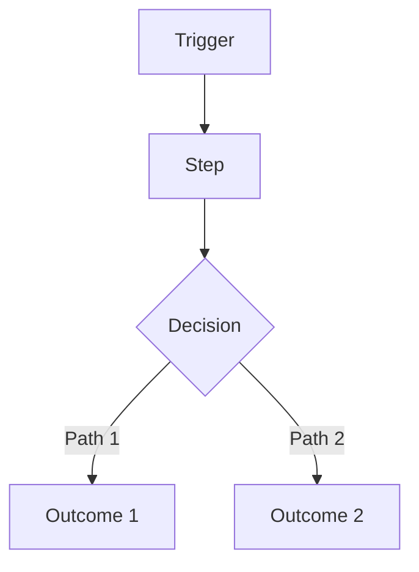
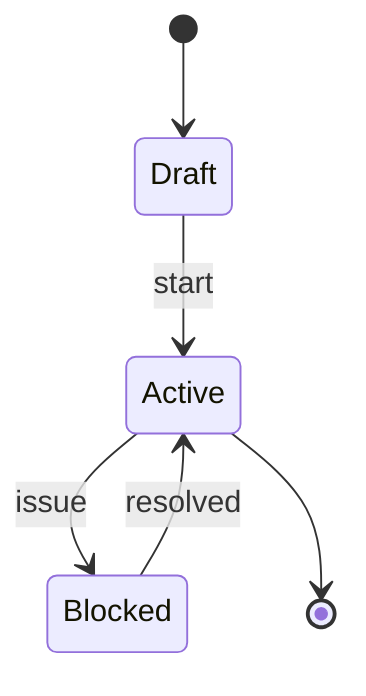

# PRD (Mini): <Product / Feature Name>

**Owner:** <name>  
**Status:** Draft | In Review | Approved  
**Last updated:** YYYY-MM-DD  
**Stakeholders:** <names/roles>  
**Links:** Repo/Issue | Design file | Tech Spec | Analytics dashboard | Support threads  

> Rule: If a section is not applicable, write `N/A` and explain why in 1–2 lines.
> Evidence rule: Every paragraph must end with an `Evidence:` line or `Evidence gap:` line. Use file paths/links; summarize all gaps and sources in the Evidence sections.

---

## 0) One‑screen summary
- **One-liner:** <what we’re building + for whom>
- **Why now:** <why this matters now>
- **Expected outcome:** <measurable outcome in plain English>

---

## 0.1) Template Metadata (required for template-driven deliverables)
- **name:** <unique template identifier, e.g., "bug-fix">
- **description:** <human-readable description>
- **title_template:** <template string with {variable} placeholders>
- **acceptance_criteria:**
  - <criterion>
  - <criterion>
- **priority:** <default priority, e.g., "medium">
- **variables:** [<variable_name>, <variable_name>]
- **metadata:** { "author": "<name>", "version": "<x.y>", "notes": "<optional>" }
- **export (required):** `python3 scripts/spec-export.py <spec>.md --out <spec>.template.json`

---

## 1) Problem / Opportunity (with evidence)
- **Problem:** <what’s broken / missing / expensive / risky>
- **Who feels it most:** <primary persona>
- **Current workaround:** <how they cope today>
- **Evidence (required):**
  - <metric / support thread / user quote>
  - <metric / support thread / user quote>
- **If we do nothing:** <impact: time/cost/churn/risk>

---

## 2) Target Users / Personas
| Persona | Role | Context | Goals | Pain points |
|---|---|---|---|---|
| <Name> | <Role> | <where/when> | <goal phrases> | <pain phrases> |
| <Name> | <Role> | <where/when> | <goal phrases> | <pain phrases> |

**Primary:** <persona>  
**Secondary:** <persona or N/A>  

---

## 3) User Stories (MVP)
> Format must be: **As a [persona], I want [action] so that [benefit].**

1) **Story:** As a <persona>, I want <action> so that <benefit>.  
   **Acceptance criteria:**
   - [ ] <observable behavior>
   - [ ] <observable behavior>
   **Priority:** Must | Should | Could  

2) **Story:** As a <persona>, I want <action> so that <benefit>.  
   **Acceptance criteria:**
   - [ ] <observable behavior>
   - [ ] <observable behavior>
   **Priority:** Must | Should | Could  

3) **Story:** As a <persona>, I want <action> so that <benefit>.  
   **Acceptance criteria:**
   - [ ] <observable behavior>
   - [ ] <observable behavior>
   **Priority:** Must | Should | Could  

---

## 4) Acceptance Criteria (Top-level)
> Criteria that must be true for this PRD/feature to be considered done, beyond per-story criteria.

- [ ] <criterion>
- [ ] <criterion>

---

## 5) Decision Log / ADRs (required)
- **Decision:** <what was decided> (ADR link: <path or URL>)
- **Rationale:** <why>
- **Alternatives:** <other options>

---

## 6) Data Lifecycle & Retention (required)
- **Data created:** <what new data is created>
- **Retention policy:** <duration>
- **Deletion policy:** <how/when data is deleted>

---

## 7) Functional Requirements (testable)
- FR-1: <requirement> (Must/Should/Could)
- FR-2: <requirement>
- FR-3: <requirement>

### Edge cases & failure UX (required)
- If <condition>, then the user sees/does: <behavior>
- If <condition>, then the user sees/does: <behavior>
- If <condition>, then the user sees/does: <behavior>

---

## 8) Non‑Functional Requirements (high level only)
- **Performance:** <expectations or N/A>
- **Reliability:** <expectations or N/A>
- **Security & privacy:** <data sensitivity + access expectations>
- **Compliance:** <PCI/PHI/GDPR/etc or N/A>
- **Accessibility:** <minimum bar or N/A>
- **Observability expectation:** <what must be measurable>

---

## 9) Success Metrics / KPIs
| Metric | Target | Measurement method | Source |
|---|---:|---|---|
| <Metric> | <#/%> | <how measured> | <event/dashboard> |
| <Metric> | <#/%> | <how measured> | <event/dashboard> |

**Measurement window:** <e.g., 7/30 days post-launch>  

### Guardrails (required)
- <metric that must not regress>
- <metric that must not regress>

---

## 10) Scope
### In scope
- <bullet>
- <bullet>

### Out of scope (required)
- <bullet>
- <bullet>

### Non‑goals (recommended)
- <explicitly not doing>
- <explicitly not doing>

---

## 11) Feature Creep Guardrails (required)
- **Core problem validated?** <evidence>
- **Smallest shippable version:** <description>
- **What we are NOT building to make room:** <trade-off>
- **Success measure for any new scope:** <metric + target>
- **48-hour rule applied for scope additions:** <yes/no + date>

---

## 12) Scope Decision Log (required)
| Date | Request | Source | Decision | Rationale | Trade-off |
|---|---|---|---|---|---|
| YYYY-MM-DD | <feature> | <stakeholder/agent> | Approved/Deferred/Rejected | <why> | <what we cut/delay> |

---

## 13) Dependencies
- **Internal:** <teams/systems or N/A>
- **External:** <vendors/APIs or N/A>
- **Assumptions (required):**
  - <assumption that must hold>
  - <assumption that must hold>

---

## 14) Risks & Mitigations
- Risk: <risk>  
  - Likelihood: Low/Med/High  
  - Impact: Low/Med/High  
  - Mitigation: <mitigation/fallback>

- Risk: <risk>  
  - Likelihood: Low/Med/High  
  - Impact: Low/Med/High  
  - Mitigation: <mitigation/fallback>

---

## 15) Timeline / Milestones (optional)
> If N/A, state why.

- Milestone: <M1> — <YYYY-MM-DD>
- Milestone: <M2> — <YYYY-MM-DD>

---

## 16) Diagrams (recommended)
### User journey flow (Mermaid)

### User lifecycle state model (Mermaid)

---

## 17) Launch & Rollback Guardrails (required)
- **Go/No-Go metrics:** <thresholds>
- **Rollback triggers:** <conditions>
- **Owners:** <names/roles>

---

## 18) Post-Launch Monitoring Plan (required)
- **Monitoring window:** <e.g., 7/30 days>
- **Dashboards:** <links or names>
- **Owners:** <names/roles>

---

## 19) Support / Ops Impact (required)
- **Runbook links:** <paths/URLs>
- **Escalation path:** <team/owner>

---

## 20) Compliance & Regulatory Review Triggers (required)
- **Triggers:** <e.g., PII, payments, healthcare>
- **Required reviews:** <legal/security/privacy>
- **Status:** <not started/in progress/complete>

---

## 21) Ownership & RACI (required)
| Area | Responsible | Accountable | Consulted | Informed |
|---|---|---|---|---|
| Product | <name> | <name> | <names> | <names> |
| Engineering | <name> | <name> | <names> | <names> |
| Security/Privacy | <name> | <name> | <names> | <names> |
| Support/Ops | <name> | <name> | <names> | <names> |

---

## 22) Security & Privacy Classification (required)
- **Data sensitivity tier:** <public/internal/confidential/restricted>
- **PII/PHI/PCI:** <yes/no + details>
- **Required controls:** <encryption, access logs, retention, etc.>

---

## 23) Dependency SLAs & Vendor Risk (required)
- **Third-party dependencies:** <list>
- **SLA/SLO expectations:** <uptime/latency>
- **Fallback plan:** <vendor-down behavior>

---

## 24) Cost Model & Budget Guardrails (required)
- **Cost drivers:** <requests, storage, vendor fees, etc.>
- **Budget cap:** <monthly/annual>
- **Cost alerts:** <thresholds and owners>

---

## 25) Localization & Internationalization (required)
- **Locales in scope:** <list or N/A>
- **Translation workflow:** <how strings are managed>

---

## 26) Backward Compatibility & Deprecation (required)
- **Compatibility constraints:** <APIs/clients/data>
- **Deprecation plan:** <timelines and comms>

---

## 27) Experimentation & Feature Flags (required)
- **Experiment plan:** <A/B, rollout, ramp>
- **Flag ownership:** <team/person>
- **Kill switch:** <where/how to disable>

---

## 28) Kill Criteria (required)
- **Stop conditions:** <metrics or constraints>
- **Decision owner:** <name/role>

---

## 29) Evidence Gaps (required)
- **Gap:** <missing evidence for a key claim> — **Impact:** <risk of being wrong> — **Owner:** <name>
- **Gap:** <missing evidence for a key claim> — **Impact:** <risk of being wrong> — **Owner:** <name>

---

## 30) Evidence Map (required)
| Section / Claim | Evidence | Confidence | Notes |
|---|---|---|---|
| <section or claim> | <file path or URL> | High/Medium/Low | <why it supports the claim> |
| <section or claim> | <file path or URL> | High/Medium/Low | <why it supports the claim> |

---

## 31) Assumptions & Open Questions (required)

### Assumptions

* A-1: <assumption>
* A-2: <assumption>

### Open questions

* Q-1: <question> (Owner: <name>, Due: YYYY-MM-DD)
* Q-2: <question> (Owner: <name>, Due: YYYY-MM-DD)

---

## 32) PRD Integrity Rule (required)

* This PRD defines **WHAT / WHY / WHO**.
* No technical implementation details (databases, frameworks, service topology).
* Reference the Tech Spec for HOW.

---

## 33) PRD Quality Gate (required)

* [ ] Problem has evidence
* [ ] Personas are specific
* [ ] Stories follow correct format + acceptance criteria exist
* [ ] Metrics have numeric targets + measurement method
* [ ] Scope includes explicit OUT
* [ ] Dependencies and risks exist
* [ ] No implementation details
* [ ] Every paragraph ends with `Evidence:` or `Evidence gap:`
* [ ] Evidence Gaps and Evidence Map sections are complete
